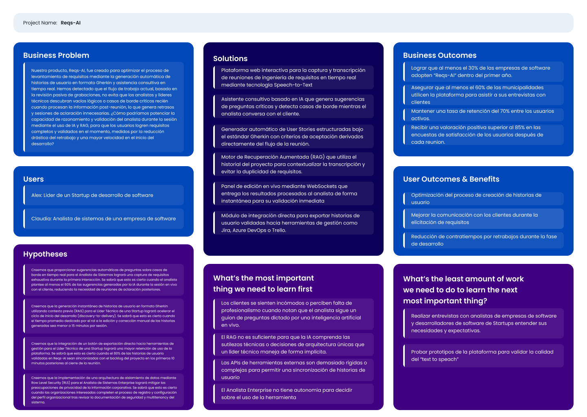
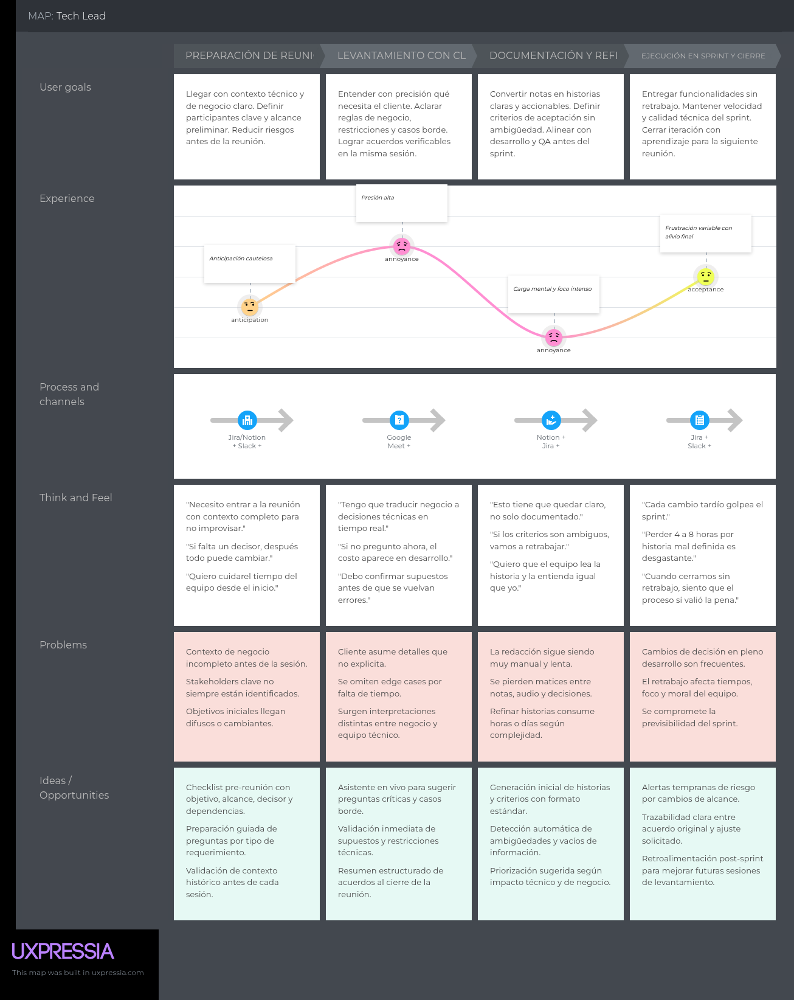
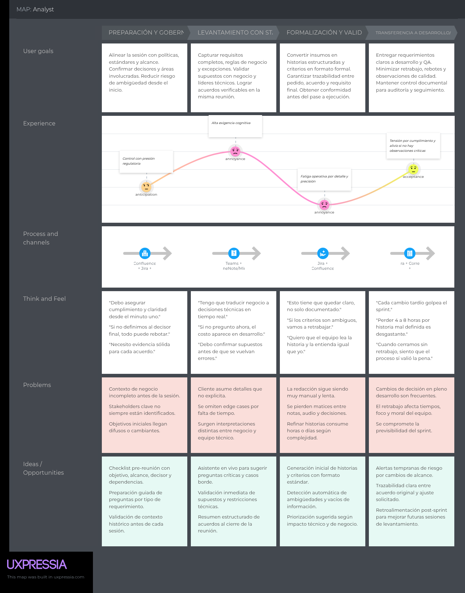
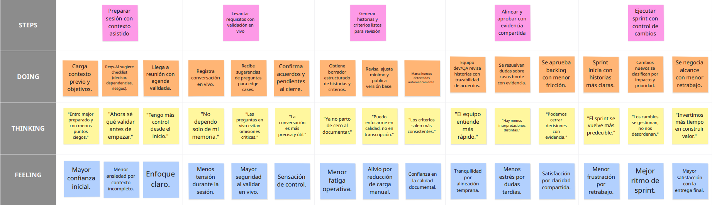
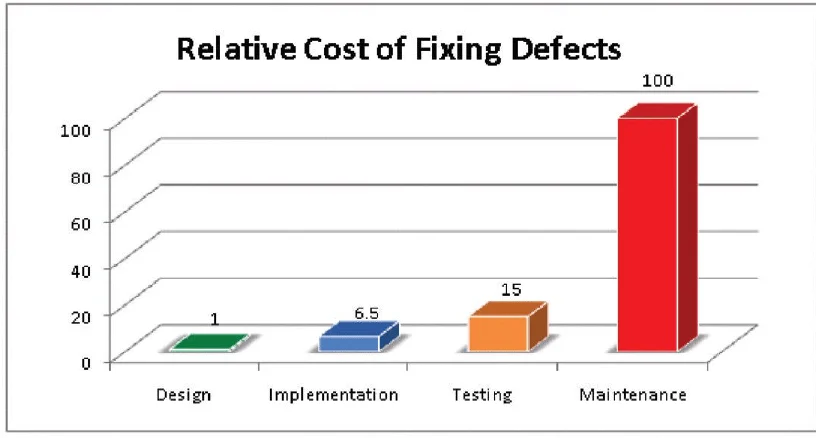

<body>
    

        
Universidad Peruana de Ciencias Aplicadas - Ingeniería de Software - 8 Ciclo

        
        
1ASI0732 - Arquitectura de Software Emergentes

        
Sección - 11821

        
Docente: Christian Luis De Los Rios Fernandez
   
        
Informe de Trabajo Final

        
Startup: Kntro-Soft

        
Producto: Reqs-AI

    

    

        <h3 style="font-weight: bolder">Integrantes del equipo:</h3>
        <table style="width: fit-content">
            <tr>
                <th style="text-align:start;">Estudiante</th>
                <th style="text-align:center;">Código</th>
            </tr>
            <tr>
                <td style="text-align:start;">Gutiérrez Soto, Jhosepmyr Orlando</td>
                <td>202317638</td>
            </tr>
            <tr>
                <td style="text-align:start;">Hernández Tuiro, Eric Ernesto</td>
                <td>20221C857</td>
            </tr>
            <tr>
                <td style="text-align:start;">Ramirez Mestanza, Salim Ignacio</td>
                <td>20201E843</td>
            </tr>
            <tr>
                <td style="text-align:start;">Varela Bustinza, Marcelo Alessandro</td>
                <td>202319668</td>
            <tr>
              <td style="text-align:start;">Sulca Gonzales, Paul Fernando</td>
              <td>20221C486</td>
            </tr>
        </table>
    

    
Abril 2026

</body>

# Registro de Versiones del Informe

| Versión | Fecha      | Autor                             | Descripción de modificación |
|---------|------------|-----------------------------------|-----------------------------|

# Project Report Collaboration Insights

En esta sección se documenta la colaboración del equipo en la elaboración del informe, mostrando evidencias gráficas de la actividad en GitHub y su coherencia con el registro de versiones.

* URL del repositorio del Project Report en la organización de GitHub del equipo:
* [https://github.com/Kntro-Soft/Report](https://github.com/Kntro-Soft/Report)

# Contenido

<!-- TOC -->
* [Registro de Versiones del Informe](#registro-de-versiones-del-informe)
* [Project Report Collaboration Insights](#project-report-collaboration-insights)
* [Contenido](#contenido)
* [Student Outcome](#student-outcome)
* [Capítulo I: Introducción](#capítulo-i-introducción)
  * [1.1. Startup Profile](#11-startup-profile)
    * [1.1.1. Descripción de la Startup](#111-descripción-de-la-startup)
    * [1.1.2. Perfiles de integrantes del equipo](#112-perfiles-de-integrantes-del-equipo)
  * [1.2. Solution Profile](#12-solution-profile)
    * [1.2.1. Antecedentes y problemática](#121-antecedentes-y-problemática)
    * [1.2.2. Lean UX Process](#122-lean-ux-process)
      * [1.2.2.1. Lean UX Problem Statements](#1221-lean-ux-problem-statements)
      * [1.2.2.2. Lean UX Assumptions](#1222-lean-ux-assumptions)
      * [1.2.2.3. Lean UX Hypothesis Statements](#1223-lean-ux-hypothesis-statements)
      * [1.2.2.4. Lean UX Canvas](#1224-lean-ux-canvas)
  * [1.3. Segmentos objetivos](#13-segmentos-objetivos)
* [Capítulo II: Requirements Elicitation & Analysis](#capítulo-ii-requirements-elicitation--analysis)
  * [2.1. Competidores](#21-competidores)
    * [2.1.1. Análisis competitivo](#211-análisis-competitivo)
    * [2.1.2. Estrategias y tácticas frente a competidores](#212-estrategias-y-tácticas-frente-a-competidores)
  * [2.2. Entrevistas](#22-entrevistas)
    * [2.2.1. Diseño de entrevistas](#221-diseño-de-entrevistas)
    * [2.2.2. Registro de entrevistas](#222-registro-de-entrevistas)
    * [2.2.3. Análisis de entrevistas](#223-análisis-de-entrevistas)
  * [2.3. Need finding](#23-need-finding)
    * [2.3.1. User personas](#231-user-personas)
    * [2.3.2. User Task Matrix](#232-user-task-matrix)
    * [2.3.3. User Journey Mapping](#233-user-journey-mapping)
    * [2.3.4. Empathy Mapping](#234-empathy-mapping)
    * [2.3.5. As-is Scenario Mapping](#235-as-is-scenario-mapping)
  * [2.4. Ubiquitous Language](#24-ubiquitous-language)
* [Capítulo III: Requirements Specification](#capítulo-iii-requirements-specification)
  * [3.1. To-Be Scenario Mapping](#31-to-be-scenario-mapping)
  * [3.2. User Stories](#32-user-stories)
  * [3.3. Product Backlog](#33-product-backlog)
  * [3.4. Impact Mapping](#34-impact-mapping)
* [Capítulo IV: Strategic-Level Product Design](#capítulo-iv-strategic-level-product-design)
  * [4.1. Strategic-Level Attribute-Driven Design](#41-strategic-level-attribute-driven-design)
    * [4.1.1.	Design Purpose](#411-design-purpose)
    * [4.1.2.	Attribute-Driven Design Inputs](#412-attribute-driven-design-inputs)
      * [4.1.2.1.	Primary Functionality (Primary User Stories)](#4121-primary-functionality-primary-user-stories)
      * [4.1.2.2.	Quality attribute Scenarios](#4122-quality-attribute-scenarios)
        * [4.1.2.3.	Constraints](#4123-constraints)
    * [4.1.3.	Architectural Drivers Backlog](#413-architectural-drivers-backlog)
    * [4.1.4.	Architectural Design Decisions](#414-architectural-design-decisions)
    * [4.1.5.	Quality Attribute Scenario Refinements](#415-quality-attribute-scenario-refinements)
  * [4.2.	Strategic-Level Domain-Driven Design](#42-strategic-level-domain-driven-design)
    * [4.2.1.	EventStorming](#421-eventstorming)
    * [4.2.2.	Candidate Context Discovery](#422-candidate-context-discovery)
    * [4.2.3.	Domain Message Flows Modeling](#423-domain-message-flows-modeling)
    * [4.2.4.	Bounded Context Canvases](#424-bounded-context-canvases)
    * [4.2.5.	Context Mapping](#425-context-mapping)
  * [4.3.	Software Architecture](#43-software-architecture)
    * [4.3.1.	Software Architecture System Landscape Diagram](#431-software-architecture-system-landscape-diagram)
    * [4.3.1.	Software Architecture Context Level Diagrams](#431-software-architecture-context-level-diagrams)
    * [4.3.2.	Software Architecture Container Level Diagrams](#432-software-architecture-container-level-diagrams)
    * [4.3.3.	Software Architecture Deployment Diagrams](#433-software-architecture-deployment-diagrams)
* [Capítulo V: Tactical-Level Software Design](#capítulo-v-tactical-level-software-design)
  * [5.X.	Bounded Context: <Bounded Context Name>](#5x-bounded-context-bounded-context-name)
    * [5.X.1.	Domain Layer](#5x1-domain-layer)
    * [5.X.2.	Interface Layer](#5x2-interface-layer)
    * [5.X.3.	Application Layer](#5x3-application-layer)
    * [5.X.4.	Infrastructure Layer](#5x4-infrastructure-layer)
    * [5.X.6.	Bounded Context Software Architecture Component Level Diagrams](#5x6-bounded-context-software-architecture-component-level-diagrams)
    * [5.X.7.	Bounded Context Software Architecture Code Level Diagrams](#5x7-bounded-context-software-architecture-code-level-diagrams)
      * [5.X.7.1.	Bounded Context Domain Layer Class Diagrams](#5x71-bounded-context-domain-layer-class-diagrams)
      * [5.X.7.2.	Bounded Context Database Design Diagram](#5x72-bounded-context-database-design-diagram)
* [Capítulo VI: Solution UX Design](#capítulo-vi-solution-ux-design)
  * [6.1.	Style Guidelines](#61-style-guidelines)
    * [6.1.1.	General Style Guidelines](#611-general-style-guidelines)
    * [6.1.2.	Web, Mobile & Devices Style Guidelines](#612-web-mobile--devices-style-guidelines)
  * [6.2.	Information Architecture](#62-information-architecture)
    * [6.2.2.	Labeling Systems](#622-labeling-systems)
    * [6.2.3.	Searching Systems](#623-searching-systems)
    * [6.2.4.	SEO Tags and Meta Tags](#624-seo-tags-and-meta-tags)
    * [6.2.5.	Navigation Systems](#625-navigation-systems)
  * [6.3.	Landing Page UI Design](#63-landing-page-ui-design)
    * [6.3.1.	Landing Page Wireframe](#631-landing-page-wireframe)
    * [6.3.2.	Landing Page Mock-up](#632-landing-page-mock-up)
  * [6.4.	Applications UX/UI Design](#64-applications-uxui-design)
    * [6.4.1.	Applications Wireframes](#641-applications-wireframes)
    * [6.4.2.	Applications Wireflow Diagrams](#642-applications-wireflow-diagrams)
    * [6.4.2.	Applications Mock-ups](#642-applications-mock-ups)
    * [6.4.3.	Applications User Flow Diagrams](#643-applications-user-flow-diagrams)
  * [6.5.	Applications Prototyping](#65-applications-prototyping)
* [Capítulo VII: Product Implementation, Validation & Deployment](#capítulo-vii-product-implementation-validation--deployment)
  * [7.1.	Software Configuration Management](#71-software-configuration-management)
    * [7.1.1.	Software Development Environment Configuration](#711-software-development-environment-configuration)
    * [7.1.2.	Source Code Management](#712-source-code-management)
    * [7.1.3.	Source Code Style Guide & Conventions](#713-source-code-style-guide--conventions)
    * [7.1.4.	Software Deployment Configuration](#714-software-deployment-configuration)
  * [7.2.	Solution Implementation](#72-solution-implementation)
    * [7.2.X.	Sprint n](#72x-sprint-n)
      * [7.2.X.1.	Sprint Planning n](#72x1-sprint-planning-n)
      * [7.2.X.2.	Sprint Backlog n](#72x2-sprint-backlog-n)
      * [7.2.X.3.	Development Evidence for Sprint Review](#72x3-development-evidence-for-sprint-review)
      * [7.2.X.4.	Testing Suite Evidence for Sprint Review](#72x4-testing-suite-evidence-for-sprint-review)
      * [7.2.X.5.	Execution Evidence for Sprint Review](#72x5-execution-evidence-for-sprint-review)
      * [7.2.X.6.	Services Documentation Evidence for Sprint Review](#72x6-services-documentation-evidence-for-sprint-review)
      * [7.2.X.7.	Software Deployment Evidence for Sprint Review](#72x7-software-deployment-evidence-for-sprint-review)
      * [7.2.X.8.	Team Collaboration Insights during Sprint](#72x8-team-collaboration-insights-during-sprint)
  * [7.3.	Validation Interviews](#73-validation-interviews)
    * [7.3.1.	Diseño de Entrevistas](#731-diseño-de-entrevistas)
    * [7.3.2.	Registro de Entrevistas](#732-registro-de-entrevistas)
    * [7.3.3.	Evaluaciones según heurísticas](#733-evaluaciones-según-heurísticas)
  * [7.4.	Video About-the-Product](#74-video-about-the-product)
* [Conclusiones](#conclusiones)
* [Bibliografía](#bibliografía)
* [Anexos](#anexos)
<!-- TOC -->

# Student Outcome

El curso contribuye al cumplimiento del Student Outcome ABET:

****ABET - EAC - Student Outcome ****

**Criterio:** 

En el siguiente cuadro se describe las acciones realizadas y enunciados de conclusiones por parte del grupo, que permiten sustentar el haber alcanzado el logro del ABET – EAC - Student Outcome 4.

| **Criterio específico** | **Acciones realizadas** | **Conclusiones** |
|-------------------------|-------------------------|------------------|  
| **.**                   |                         |                  |
| **.**                   |                         |                  |

# Capítulo I: Introducción

## 1.1. Startup Profile

### 1.1.1. Descripción de la Startup

Kntro-Soft es una startup tecnológica peruana dedicada a la innovación en ingeniería de software mediante el uso de Inteligencia Artificial Generativa y procesamiento de lenguaje natural en tiempo real.
Nuestra misión es potenciar la productividad de los equipos de desarrollo y analistas de sistemas, eliminando la pérdida de información durante el levantamiento de requisitos, asegurando que cada necesidad del cliente se convierta en una historia de usuario precisa y completa.

**Propuesta de Valor**

* Documentación Instantánea: Generación automática de User Stories con criterios de aceptación en formato Gherkin mediante LLMs de última generación
* Asistencia Consultiva en Vivo: Sugerencias inteligentes de preguntas durante las reuniones para evitar vacíos de información y considerar casos de borde
* Contexto Inteligente (RAG): Integración con el historial del proyecto para detectar duplicados y asegurar que los nuevos requisitos sean consistentes con la arquitectura existente
* Privacidad Empresarial: Arquitectura multitenancy robusta con Row Level Security, garantizando que los datos y el conocimiento de cada organización permanezcan estrictamente aislados

**Visión**

Convertirnos en la plataforma estándar de gestión de requisitos para empresas de software en Latinoamérica, liderando la transición hacia un desarrollo de software asistido por IA que sea transparente, eficiente y libre de errores de comunicación.

**Valores**

* Precisión Técnica: Compromiso con la entrega de requisitos listos para el desarrollo.
* Agilidad: Reducción drástica del tiempo entre la reunión y el inicio de la codificación.
* Seguridad: Protección absoluta de la propiedad intelectual de nuestros clientes.
* Innovación Adaptativa: Evolución constante de nuestros modelos para entender los dialectos y modismos técnicos de la región.

### 1.1.2. Perfiles de integrantes del equipo

| Foto del participante                                                                       | Nombres y apellidos               | Código de estudiante | Carrera                | Conocimientos técnicos y habilidades                                                                                                                                                                                                                                            |
|---------------------------------------------------------------------------------------------|-----------------------------------|----------------------|------------------------|---------------------------------------------------------------------------------------------------------------------------------------------------------------------------------------------------------------------------------------------------------------------------------|
|          | Eric Ernesto Hernández Tuiro      | 20221C857            | Ingeniería de Software | Especialista en desarrollo backend con Java/Spring Boot y diseño de arquitecturas de sistemas. Enfocado en tecnologías empresariales y soluciones eficientes.                                                                                                                   |
|      | Marcelo Alejandro Varela Bustinza | 202319668            | Ingeniería de Software | Desarrollador con experiencia en Angular/Spring Boot y Vue.js/ASP.NET, enfocado en arquitecturas monolíticas y desarrollo de aplicaciones.                                                                                                                                      | 
|  | Jhosepmyr Orlando Gutiérrez Soto  | 202317638            | Ingeniería de Software | Especialista en desarrollo full-stack con Java/Spring Boot y frameworks frontend como Angular y Vue.js. Experiencia en microservicios y servicios cloud (AWS, Azure, GCP). Aporta habilidades de liderazgo técnico, toma de decisiones y coordinación de equipos de desarrollo. | 
|            | Paul Fernando Sulca Gonzales      | 20221C486            | Ingeniería de Software | Conocimiento en diseño de software orientado a objetos y modelado UML. Experiencia en implementación de interfaces web adaptativas. Amante de los desafíos de la vida universitaria.                                                                                            |
|          | Salim Ignacio Ramirez Mestanza    | 20201E843            | Ingeniería de Software | Conocimiento en arquitectura de software y control de versiones con Git. Experiencia en documentación técnica y colaboración en equipos ágiles. Desarrollo backend con Java/Spring Boot y Domain-Driven Design.                                                                 |

## 1.2. Solution Profile

### 1.2.1. Antecedentes y problemática

Esta sección analiza la desconexión entre la captura de información y la ejecución en el desarrollo de software. Se utiliza la técnica de las 5W2H para desglosar cómo la gestión deficiente de requisitos impacta la rentabilidad y el éxito de los proyectos de TI, estableciendo la base fáctica que justifica la implementación de Kntro-Soft.

**Análisis mediante la técnica de las 5 W's y 2 H's:**

* WHO - ¿Quién está afectado?: El problema afecta principalmente a los Analistas de Sistemas, Product Owners y Business Analysts, quienes deben alternar entre la escucha activa y la toma de notas. Secundariamente, impacta a los equipos de desarrollo, startups de software, y a las empresas de software en el Perú.

* WHAT - ¿Cuál es el problema?: La pérdida de información crítica durante las reuniones de descubrimiento. A los analistas se les puede dificultar el procesar y documentar simultáneamente la información que brinda el cliente, generando requisitos incompletos y casos de borde ignorados. Esto deriva en una deuda técnica desde la concepción del producto.

* WHERE - ¿Dónde ocurre?: En el entorno de las empresas de servicios de software y startups de desarrollo de software en Perú y Latinoamérica. Se manifiesta tanto en reuniones presenciales como en videollamadas, donde el flujo de información es rápido y desestructurado.

* WHEN - ¿Cuándo sucede?: Ocurre durante la fase de Elicitación de Requisitos. La crisis de documentación se agrava después de la reunion, cuando el analista intenta reconstruir lo conversado, perdiendo varios detalles específicos y dándose cuenta de dudas y preguntas importantes que no resolvió con el cliente durante la reunión.

* WHY - ¿Por qué persiste?: Por la dependencia en métodos manuales. La captura de requisitos sigue siendo un proceso artesanal en una industria automatizada. Según el Project Management Institute (PMI), la comunicación deficiente es la razón principal del fracaso en 1 de cada 3 proyectos de TI.

* HOW - ¿Cómo se manifiesta el problema?: Se evidencia en el retrabajo. Las historias de usuario mal definidas obligan a los desarrolladores a detenerse para pedir aclaraciones o, peor aún, a construir funcionalidades que no cumplen con la expectativa del cliente, generando ciclos de feedback infinitos.

* HOW MUCH - ¿Cuál es la magnitud del impacto?: * Costo de Fallas: El 47% de los proyectos de software fallan o se ven comprometidos debido a una mala gestión de requisitos (Standish Group, 2020). Impacto Económico: Corregir un error de requisitos durante la fase de desarrollo cuesta hasta 10 veces más que hacerlo durante la fase de diseño. Si el error llega a producción, el costo se eleva a 100 veces más (Ver Anexos 1). Desperdicio Financiero: Las organizaciones pierden, en promedio, US$ 97 millones por cada 1,000 millones invertidos debido a un desempeño deficiente de los proyectos (PMI, 2018).

### 1.2.2. Lean UX Process

Esta sección aplica el Proceso Lean UX para estructurar la visión del negocio del proyecto WasteTrack. Se inicia con la formulación del problema, se desglosan las suposiciones fundamentales que sostienen el modelo de negocio y de producto, y finalmente se traducen estas suposiciones en hipótesis comprobables que guiarán el ciclo de desarrollo y validación.

#### 1.2.2.1. Lean UX Problem Statements

El estado actual de la ingeniería de requisitos en el desarrollo de software depende principalmente en la captura pasiva de información a través de grabaciones de video y transcripciones automáticas, las cuales funcionan como una memoria histórica para que el analista de sistemas revise el contenido después de la reunión.

Lo que los servicios y flujos de trabajo existentes no logran abordar es el desafío del razonamiento y la validación en tiempo real. Actualmente, el analista suele descubrir ambigüedades, casos de borde no considerados y vacíos de lógica recién cuando procesa la grabación horas o días después. Esto genera un ciclo ineficiente de reuniones de seguimiento para aclarar dudas que pudieron resolverse en el momento si se hubiera contado con un soporte analítico inmediato.

Nuestro producto, Reqs-AI, abordará esta brecha mediante un motor de inteligencia artificial que procesa el audio en vivo para generar historias de usuario estructuradas mientras la reunión ocurre. Su valor diferencial reside en un asistente de consulta activa que proporciona sugerencias de preguntas críticas al analista en tiempo real, asegurando que toda duda técnica o de negocio sea resuelta mientras el cliente aún está presente.

Nuestro enfoque inicial serán las Startups tecnológicas y empresas de desarrollo de software que operan bajo metodologías ágiles y necesitan una transición inmediata y sin errores desde la fase de descubrimiento hasta el inicio de la codificación.

Sabremos que hemos tenido éxito cuando observemos una reducción del 40% en las reuniones de seguimiento para aclaración de requisitos, una disminución significativa en el tiempo que el analista dedica al post-procesamiento de la información y una tasa de aceptación de historias de usuario superior al 80% en la primera iteración de revisión con el equipo de desarrollo.

#### 1.2.2.2. Lean UX Assumptions

Esta sección presenta las suposiciones fundamentales del proyecto Reqs-AI, estructuradas bajo el marco de Lean UX. Aquí definimos los resultados de negocio esperados, los perfiles de usuario que enfrentan el problema y los beneficios tangibles que estos obtendrán al utilizar nuestra solución.

**Business Outcomes (Resultados de Negocio):**

Utilizamos el framework AARRR (Pirate Metrics) para cuantificar el impacto estratégico de Reqs-AI en el mercado de startups y empresas:
* Acquisition (Adquisición): El 25% de las empresas contactadas se registrarán para una prueba gratuita de 14 días.
* Activation (Activación): El 40% de los usuarios registrados procesará al menos 3 reuniones reales y generará un set de User Stories en su primera semana.
* Retention (Retención): El 60% de las Startups que completen la prueba gratuita optarán por una suscripción mensual activa.
* Revenue (Ingresos): Se proyecta un Ingreso Mensual Recurrente (MRR) promedio de $49 por Startup y contratos anuales de 4,000+ para Empresas.
* Referral (Recomendación): 1 de cada 4 usuarios activos recomendará la herramienta a otros colegas en comunidades de Product Management o Ingeniería.

**Users (Usuarios)**
Hemos identificado dos perfiles clave que enfrentan el reto de transformar la voz del cliente en código, adaptados a la realidad de una Startup y una organización corporativa:

| Usuario                           | Perfil                                                      | Objetivos                                                                                                                              | Obstáculos                                                                                              |
|:----------------------------------|:------------------------------------------------------------|:---------------------------------------------------------------------------------------------------------------------------------------|:--------------------------------------------------------------------------------------------------------|
| **Alex (Tech Leader)**            | 32 años, Desarrollador Senior que lidera el equipo técnico. | Traducir visiones de negocio a especificaciones técnicas, evitar deuda técnica por requisitos ambiguos, agilizar el inicio del sprint. | Alta carga de trabajo técnico, dificultad para documentar mientras lidera la discusión técnica.         |
| **Claudia (Analista Enterprise)** | 35 años, Business Analyst en una corporación.               | Estandarizar requisitos en Gherkin, asegurar que nada quede ambiguo, cumplir con normas de seguridad.                                  | Reuniones largas y densas, dificultad para procesar horas de grabación, burocracia en la documentación. |

**User Outcomes (Resultados de Usuario)**
Estos son los resultados esperados por nuestros usuarios, divididos según el valor que perciben al usar Reqs-AI:

* Startup Lead:
Funcional: Obtener historias de usuario en Gherkin y restricciones técnicas listas para el backlog inmediatamente al finalizar la sesión.
Emocional: Sentir la seguridad de que la arquitectura y los casos críticos están alineados con la expectativa del cliente antes de escribir una sola línea de código
Aspiracional: Ser el facilitador de una cultura de ingeniería de alto rendimiento donde la documentación nunca es un cuello de botella para la innovación.

* Analista Enterprise:
Funcional: Eliminar el trabajo manual de transcribir grabaciones y redactar Gherkin desde cero.
Emocional: Sentirse empoderada durante la reunión al recibir sugerencias de preguntas que exponen vacíos de lógica del cliente.
Aspiracional: Posicionarse como una analista estratégica que garantiza la precisión del proyecto, reduciendo el retrabajo del equipo.

#### 1.2.2.3. Lean UX Hypothesis Statements

**Test (Alto valor, alto riesgo)**

* Hipótesis 1 (Riesgo de Valor y Comportamiento):
El equipo cree que proporcionar sugerencias automáticas de preguntas sobre casos de borde en tiempo real para el Analista de Sistemas logrará una captura de requisitos exhaustiva durante la primera interacción. Se sabrá que esto es cierto cuando el analista plantee al menos el 60% de las sugerencias generadas por la IA durante la sesión en vivo con el cliente, reduciendo la necesidad de reuniones de aclaración posteriores.

* Hipótesis 2 (Riesgo de Confianza Técnica):
El equipo cree que la generación instantánea de historias de usuario en formato Gherkin utilizando contexto previo (RAG) para el Líder Técnico de una Startup logrará acelerar el ciclo de inicio del desarrollo (discovery-to-delivery). Se sabrá que esto es cierto cuando el tiempo promedio dedicado por el rol a la edición y corrección manual de las historias generadas sea menor a 15 minutos por sesión.

**Ship & Measure (Alto valor, bajo riesgo)**

* Hipótesis 3 (Riesgo de Adopción Funcional):
El equipo cree que la integración de un botón de exportación directa hacia herramientas de gestión para el Líder Técnico de una Startup logrará una mayor retención de uso de la plataforma. Se sabrá que esto es cierto cuando el 80% de las historias de usuario validadas en Reqs-AI sean sincronizadas con el backlog del proyecto en los primeros 10 minutos posteriores al cierre de la reunión.

* Hipótesis 4 (Riesgo de Cumplimiento y Seguridad):
El equipo cree que la implementación de una arquitectura de aislamiento de datos mediante Row Level Security (RLS) para el Analista de Sistemas Enterprise logrará mitigar las preocupaciones de privacidad de la información corporativa. Se sabrá que esto es cierto cuando las organizaciones interesadas completen el proceso de registro y configuración del perfil organizacional tras revisar la documentación de seguridad y multitenancy del sistema.

#### 1.2.2.4. Lean UX Canvas

## 1.3. Segmentos objetivos

**Segmento 1: Líder Técnico de Startup**

**Descripción:**

Este segmento representa al motor técnico y estratégico de empresas tecnológicas en etapa de crecimiento. Son profesionales que cumplen roles híbridos entre la gestión de producto y el desarrollo.
Su principal motivación es la velocidad de entrega y la precisión técnica. Se frustran al perder tiempo valioso en la documentación manual tras reuniones intensas y al descubrir "deuda de requisitos" solo cuando ya están en plena fase de codificación. Buscan una herramienta que les permita pasar de la conversación al código sin fricciones.

**Características Demográficas (Perfil Inferido):**

| Aspecto                  | Detalle                                                                    |
|--------------------------|----------------------------------------------------------------------------|
| Rango de Edad            | 30 - 35 años                                                               |
| Nivel Educativo          | Universitario o Postgrado (Ingeniería de Software, Sistemas o Computación) |
| Entorno Laboral          | Startups, ambientes ágiles, trabajo remoto o híbrido                       |
| Familiaridad Tecnológica | Nativo digital; uso experto de APIs, LLMs, y herramientas como Jira/Notion |

**Segmento 2: Analista de Sistemas Enterprise**

**Descripción:**

Este segmento representa al profesional encargado de la gobernanza de requisitos en grandes corporaciones o Software Factories. Su enfoque principal es la estandarización y la mitigación de riesgos.
Deben asegurar que cada requerimiento del cliente esté perfectamente documentado en formatos rigurosos como Gherkin para su posterior pase a desarrollo y testing (QA). Actualmente, su mayor dolor es la carga operativa de procesar horas de grabaciones para extraer criterios de aceptación, enfrentando el riesgo de malinterpretar la visión del cliente por falta de validación inmediata en la reunión.

**Características Demográficas (Perfil Inferido):**

| Aspecto                  | Detalle                                                                                             |
|--------------------------|-----------------------------------------------------------------------------------------------------|
| Rango de Edad            | 30 - 45 años                                                                                        |
| Nivel Educativo          | Universitario o Postgrado (Gestión de Proyectos, Business Analysis)                                 |
| Entorno Laboral          | Corporativo, grandes departamentos de TI, procesos bajo marcos CMMI o SAFe                          |
| Familiaridad Tecnológica | Alta; manejo de herramientas de modelado y gestión empresarial (Azure DevOps, Enterprise Architect) |

# Capítulo II: Requirements Elicitation & Analysis

## 2.1. Competidores

### 2.1.1. Análisis competitivo

<table border="1" cellspacing="0" cellpadding="10" style="border-collapse: collapse; width: 100%; text-align: left;">
  <thead>
    <tr>
      <th>Aspecto</th>
      <th>Reqs-AI</th>
      <th>Jira + Atlassian Intelligence</th>
      <th>Notion AI</th>
      <th>Miro AI</th>
    </tr>
  </thead>
  <tbody>
    <tr>
      <td><strong>¿Por qué llevar a cabo este análisis?</strong></td>
      <td colspan="4">
        Identificar cómo Reqs-AI puede diferenciarse de las herramientas actuales de documentación,
        gestión de proyectos y colaboración asistida por inteligencia artificial, especialmente en el
        proceso de levantamiento de requisitos, generación de historias de usuario y reducción de vacíos
        de información durante reuniones con clientes.
      </td>
    </tr>
    <tr>
      <td><strong>Nombre</strong></td>
      <td>Reqs-AI</td>
      <td>Jira + Atlassian Intelligence</td>
      <td>Notion AI</td>
      <td>Miro AI</td>
    </tr>
    <tr>
      <td><strong>Logo</strong></td>
      <td>
        
      </td>
      <td>
        
      </td>
      <td>
        
      </td>
      <td>
        
      </td>
    </tr>
    <tr>
      <td><strong>Overview</strong></td>
      <td>
        Plataforma SaaS impulsada por inteligencia artificial generativa para asistir el levantamiento
        de requisitos en tiempo real, generar historias de usuario, criterios de aceptación en formato
        Gherkin y mantener consistencia con el contexto histórico del proyecto mediante RAG.
      </td>
      <td>
        Herramienta de gestión de proyectos ágiles que permite administrar issues, épicas, sprints y
        tableros Scrum/Kanban, incorporando capacidades de IA para resumir, generar contenido y apoyar
        la productividad dentro del ecosistema Atlassian.
      </td>
      <td>
        Plataforma de documentación y organización de conocimiento que integra IA para resumir,
        redactar, estructurar información y apoyar la creación de documentos colaborativos.
      </td>
      <td>
        Herramienta colaborativa de pizarras digitales que utiliza IA para organizar ideas, sintetizar
        contenido, generar diagramas y apoyar dinámicas visuales de trabajo en equipo.
      </td>
    </tr>
    <tr>
      <td><strong>Ventaja competitiva</strong></td>
      <td>
        Está especializada en el proceso de requirements elicitation, transformando reuniones en
        requisitos accionables, historias de usuario y criterios de aceptación, además de sugerir
        preguntas consultivas para evitar información incompleta.
      </td>
      <td>
        Tiene fuerte adopción en equipos ágiles y se integra con herramientas de desarrollo, seguimiento
        de tareas, planificación de sprints y reportes de avance.
      </td>
      <td>
        Destaca por su flexibilidad para documentar información, organizar bases de conocimiento y crear
        contenido con asistencia de IA en un entorno simple y colaborativo.
      </td>
      <td>
        Es fuerte en colaboración visual, ideación, workshops, mapas mentales, diagramas y sesiones
        remotas de descubrimiento de producto.
      </td>
    </tr>
    <tr>
      <td><strong>¿Qué valor ofrece a los clientes?</strong></td>
      <td>
        Reduce la pérdida de información en reuniones con clientes, acelera la documentación de requisitos,
        mejora la calidad de las historias de usuario y facilita que analistas, product owners y equipos
        de desarrollo trabajen con información clara y trazable.
      </td>
      <td>
        Permite gestionar el ciclo de trabajo ágil, priorizar tareas, asignar responsables, visualizar
        avances y mantener seguimiento del backlog del producto.
      </td>
      <td>
        Ayuda a centralizar documentación, crear wikis, resumir información y mantener espacios
        colaborativos para equipos de trabajo.
      </td>
      <td>
        Facilita sesiones colaborativas visuales para lluvia de ideas, mapeo de procesos, diagramación
        y organización temprana de conceptos de producto.
      </td>
    </tr>
    <tr>
      <td><strong>Mercado objetivo</strong></td>
      <td>
        Empresas de software, analistas de negocio, product owners, startups tecnológicas, consultoras
        de desarrollo y equipos ágiles que realizan reuniones frecuentes de levantamiento de requisitos.
      </td>
      <td>
        Equipos de desarrollo de software, áreas de producto, Scrum Masters, Project Managers y
        organizaciones que gestionan proyectos ágiles.
      </td>
      <td>
        Equipos que necesitan documentar información, organizar conocimiento interno, crear reportes,
        wikis, notas de reuniones y espacios colaborativos.
      </td>
      <td>
        Equipos de diseño, producto, innovación, UX, consultoría y facilitadores de workshops remotos
        o presenciales.
      </td>
    </tr>
    <tr>
      <td><strong>Estrategias de marketing</strong></td>
      <td>
        Posicionamiento como solución especializada para requirements engineering asistido por IA,
        enfocada en productividad, precisión técnica, reducción de retrabajo y privacidad empresarial
        mediante arquitectura multitenancy.
      </td>
      <td>
        Estrategia basada en ecosistema empresarial, integraciones con herramientas de desarrollo,
        adopción ágil y presencia consolidada en compañías tecnológicas.
      </td>
      <td>
        Estrategia centrada en productividad personal y de equipos, facilidad de uso, plantillas,
        documentación flexible y adopción rápida.
      </td>
      <td>
        Estrategia enfocada en colaboración visual, creatividad, workshops, innovación, diseño de
        producto y trabajo remoto.
      </td>
    </tr>
    <tr>
      <td><strong>Productos y servicios</strong></td>
      <td>
        Plataforma web SaaS con transcripción o registro de reuniones, generación automática de user
        stories, criterios de aceptación, sugerencias de preguntas, validación de duplicados y contexto
        inteligente mediante RAG.
      </td>
      <td>
        Gestión de issues, backlogs, épicas, sprints, tableros ágiles, reportes, automatizaciones e
        integración con herramientas del ecosistema Atlassian.
      </td>
      <td>
        Documentos colaborativos, wikis, bases de datos, plantillas, resúmenes automáticos y generación
        asistida de contenido con IA.
      </td>
      <td>
        Pizarras colaborativas, diagramas, mapas mentales, plantillas de workshops, organización visual
        de ideas y funciones de IA para sintetizar información.
      </td>
    </tr>
    <tr>
      <td><strong>Precios y costos</strong></td>
      <td>
        Modelo SaaS por suscripción, con planes para equipos pequeños, startups y organizaciones,
        considerando diferenciación por número de usuarios, proyectos, almacenamiento y uso de IA.
      </td>
      <td>
        Modelo freemium y planes de pago por usuario, orientado a equipos que requieren gestión avanzada
        de proyectos y escalabilidad empresarial.
      </td>
      <td>
        Modelo freemium con planes personales, de equipo y empresariales, con funciones adicionales de IA
        bajo planes pagos.
      </td>
      <td>
        Modelo freemium con planes para equipos, empresas y organizaciones que requieren colaboración
        visual avanzada.
      </td>
    </tr>
    <tr>
      <td><strong>Canales de distribución</strong></td>
      <td>
        Plataforma web accesible desde navegador, comercialización directa a empresas de software,
        alianzas con consultoras tecnológicas y posible estrategia B2B SaaS para equipos ágiles.
      </td>
      <td>
        Distribución mediante plataforma web, marketplace de Atlassian, ventas empresariales y adopción
        por equipos de desarrollo.
      </td>
      <td>
        Plataforma web y aplicación móvil/escritorio, con adopción directa por usuarios, equipos y empresas.
      </td>
      <td>
        Plataforma web y aplicaciones colaborativas, orientada a equipos de producto, diseño e innovación.
      </td>
    </tr>
    <tr>
      <td><strong>Fortalezas</strong></td>
      <td>
        Especialización en levantamiento de requisitos, generación estructurada de historias de usuario,
        asistencia consultiva en vivo, contexto mediante RAG y enfoque en privacidad empresarial.
      </td>
      <td>
        Alta adopción en la industria, integración con metodologías ágiles, ecosistema robusto y soporte
        para gestión completa del backlog.
      </td>
      <td>
        Interfaz flexible, facilidad de uso, buena experiencia colaborativa y capacidades amplias para
        documentación general.
      </td>
      <td>
        Gran capacidad visual, útil para workshops, ideación, diagramación y trabajo colaborativo remoto.
      </td>
    </tr>
    <tr>
      <td><strong>Oportunidades</strong></td>
      <td>
        Crecimiento del uso de IA generativa en procesos de software, necesidad de reducir retrabajo por
        requisitos incompletos y oportunidad de posicionarse en Latinoamérica como solución especializada
        para equipos de análisis y desarrollo.
      </td>
      <td>
        Mayor adopción de IA dentro de herramientas de gestión ágil y expansión en organizaciones que ya
        utilizan el ecosistema Atlassian.
      </td>
      <td>
        Crecimiento de la documentación inteligente y adopción de IA para mejorar productividad en equipos
        multidisciplinarios.
      </td>
      <td>
        Mayor demanda de herramientas visuales para trabajo remoto, descubrimiento de producto y dinámicas
        colaborativas.
      </td>
    </tr>
    <tr>
      <td><strong>Debilidades</strong></td>
      <td>
        Al ser una propuesta nueva, requiere validación con usuarios reales, construcción de confianza,
        precisión en los resultados generados por IA y evidencia de impacto en proyectos de software.
      </td>
      <td>
        No está especializada en capturar requisitos desde reuniones ni en guiar al analista con preguntas
        consultivas durante la elicitación.
      </td>
      <td>
        Su IA es generalista y no está enfocada específicamente en ingeniería de requisitos, criterios
        Gherkin o trazabilidad técnica.
      </td>
      <td>
        Es fuerte para ideación visual, pero no cubre de forma especializada la generación formal de
        requisitos, historias de usuario o criterios de aceptación.
      </td>
    </tr>
    <tr>
      <td><strong>Amenazas</strong></td>
      <td>
        Competencia de plataformas consolidadas que pueden incorporar funciones similares de IA,
        resistencia de empresas a compartir información sensible en herramientas nuevas y necesidad de
        demostrar seguridad, precisión y valor frente a soluciones ya adoptadas.
      </td>
      <td>
        Puede expandir sus capacidades de IA hacia la generación de requisitos y reducir el espacio de
        diferenciación de soluciones emergentes.
      </td>
      <td>
        Puede ser suficiente para equipos pequeños que solo necesitan documentación básica con IA.
      </td>
      <td>
        Puede cubrir etapas iniciales de descubrimiento de producto y competir indirectamente en sesiones
        de levantamiento colaborativo.
      </td>
    </tr>
  </tbody>
</table>

### 2.1.2. Estrategias y tácticas frente a competidores

En esta sección se detallan las estrategias y tácticas que Reqs-AI aplicará para establecer una ventaja competitiva frente a herramientas de gestión de proyectos, documentación colaborativa y plataformas con inteligencia artificial aplicadas al trabajo de equipos de software.

#### Estrategias para afrontar las fortalezas de los competidores

- Diferenciación por especialización en ingeniería de requisitos:
Para enfrentar la fortaleza de herramientas como Jira, que cuenta con alta adopción en equipos ágiles y gestión de backlogs, Reqs-AI aplicará la táctica de “levantamiento inteligente de requisitos en tiempo real”. A diferencia de Jira, que se enfoca principalmente en administrar tareas, issues y sprints, Reqs-AI se centrará en la etapa previa: capturar, interpretar y transformar la información de reuniones con clientes en requisitos funcionales, historias de usuario y criterios de aceptación más claros.

#### Estrategia de documentación asistida con contexto del proyecto:
Frente a plataformas como Notion AI, que destacan por su flexibilidad para redactar y organizar información, Reqs-AI implementará la táctica de “generación contextual basada en RAG”. Esto permitirá que la IA no genere respuestas aisladas, sino que considere información histórica del proyecto, acuerdos anteriores, requisitos existentes y decisiones tomadas previamente, reduciendo duplicidades, contradicciones y vacíos en la documentación.

#### Estrategia de integración con el flujo ágil del equipo:
Ante competidores consolidados en colaboración visual como Miro AI, Reqs-AI aplicará la táctica de “conversión de ideas en entregables técnicos”. Mientras Miro facilita la ideación y organización visual, Reqs-AI buscará convertir directamente los hallazgos de las reuniones en artefactos accionables para el equipo de desarrollo, como user stories, criterios Gherkin, épicas, funcionalidades priorizadas y preguntas pendientes para el cliente.

#### Estrategias para aprovechar las debilidades de los competidores

- Táctica de preguntas consultivas durante la elicitación:
Reqs-AI aprovechará la debilidad de herramientas generalistas que no guían activamente al analista durante una reunión. Para ello, incorporará una táctica de “asistente consultivo en vivo”, capaz de sugerir preguntas relevantes cuando detecte ambigüedad, información incompleta o falta de reglas de negocio. Esto permitirá mejorar la calidad del levantamiento de requisitos antes de que el equipo pase a la fase de desarrollo.

#### Estrategia de reducción de retrabajo por requisitos incompletos:
Muchas herramientas permiten documentar información, pero no necesariamente validan si un requisito está claro, completo o alineado con el contexto del proyecto. Reqs-AI aplicará la táctica de “validación semántica de requisitos”, identificando posibles inconsistencias, requisitos duplicados, criterios de aceptación incompletos o historias de usuario mal estructuradas. Con ello, se busca reducir errores de interpretación y retrabajo en etapas posteriores del proyecto.

- Táctica de trazabilidad entre reunión, requisito e historia de usuario:
Reqs-AI aprovechará la falta de trazabilidad directa en herramientas de documentación general mediante la táctica de “registro trazable de decisiones”. Cada historia de usuario o criterio generado podrá vincularse con la información de origen de la reunión, permitiendo que analistas, product owners y desarrolladores comprendan de dónde proviene cada requerimiento y por qué fue definido.

#### Contexto de oportunidades y amenazas

- Oportunidades:
Reqs-AI puede aprovechar el crecimiento del uso de inteligencia artificial generativa en equipos de software, la necesidad de acelerar procesos de documentación y la demanda de herramientas que reduzcan errores en la comunicación entre clientes y equipos técnicos. Además, existe una oportunidad importante en startups, consultoras y equipos ágiles que realizan reuniones frecuentes de descubrimiento, levantamiento de requisitos y refinamiento de backlog.

- Amenazas:
Una amenaza importante es que plataformas consolidadas como Jira, Notion o Miro incorporen funciones similares de IA para generación de requisitos. Para mitigar este riesgo, Reqs-AI deberá enfocarse en una especialización clara en ingeniería de requisitos, privacidad empresarial, precisión contextual y facilidad de integración con el flujo de trabajo ágil. Asimismo, será necesario construir confianza mediante pruebas con usuarios reales, casos de uso demostrables y resultados medibles en reducción de tiempo de documentación y mejora de calidad de requisitos.

## 2.2. Entrevistas

### 2.2.1. Diseño de entrevistas

El diseño de entrevistas se orienta a comprender en profundidad el trabajo real de cada segmento: su contexto, decisiones, tareas, emociones y restricciones operativas. El guion se organiza de forma progresiva para conocer cómo viven hoy el proceso, qué valoran y dónde encuentran más dificultades.

**Segmento 1: Líder Técnico de Startup**

**Inicio y contexto profesional**
1. ¿Cuál es tu rol actual dentro del equipo y qué nivel de participación tienes en reuniones de discovery con clientes?
2. ¿Cómo está conformado tu equipo (roles, seniority y metodología) y cómo se reparte la responsabilidad del levantamiento de requisitos?
3. ¿Qué tipo de proyectos desarrollan y qué restricciones de tiempo o presupuesto suelen condicionar sus decisiones?

**Herramientas, ecosistema e influencias**
4. ¿Qué stack tecnológico y equipos tecnológicos usan para coordinar reuniones, documentar decisiones y gestionar backlog?
5. ¿Qué herramientas o marcas influyen más en tu forma de trabajar (por ejemplo Atlassian, Microsoft, AWS, GitHub, Notion) y por qué?
6. ¿Qué referentes, comunidades, canales o personas influyen en tus decisiones sobre prácticas de análisis de requisitos?

**Flujo actual de trabajo**
7. Cuéntame paso a paso qué haces desde que se agenda una reunión con cliente hasta que una historia de usuario entra al sprint.
8. ¿Qué tareas realizas tú, cuáles delegas y cuáles dependen de otros roles para cerrar un requerimiento?
9. ¿Qué entradas usas en cada etapa (audio, notas, tickets, acuerdos) y qué entregables concretos produces al final?

**Puntos de dolor y fricciones del proceso**
10. ¿En qué momento del flujo se pierden más detalles críticos o aparecen ambiguedades?
11. ¿Qué tipo de retrabajo se genera cuando una historia queda incompleta o mal definida?
12. ¿Qué casos de borde o restricciones técnicas suelen omitirse en la primera conversación y por qué?
13. ¿Cómo impactan esos errores en tiempo de sprint, esfuerzo del equipo y calidad del resultado?

**Experiencia, motivaciones y expectativas**
14. ¿Qué te motiva más de liderar esta etapa y qué resultado ideal te gustaría garantizar en cada sesión?
15. ¿Qué situaciones te generan más frustración durante o después de las reuniones de levantamiento?
16. Cuando el proceso sale bien, ¿qué te hace pensar "esta reunión sí fue productiva"?

**Recorrido completo y validación de propuesta**
17. Si describieras tu experiencia de principio a fin, ¿cuáles son tus "momentos críticos" (inicio, caos, decisión, cierre)?
18. ¿En qué parte del recorrido actual sientes mayor carga mental o riesgo de cometer errores?
19. Si durante la reunión recibieras sugerencias de preguntas en tiempo real, ¿en qué momento exacto del proceso te ayudaría más?
20. Si al finalizar obtuvieras historias en Gherkin listas para backlog, ¿qué nivel de precisión y edición manual aceptarías?
21. Si tuvieras que resumir tu experiencia actual en una frase textual, ¿qué dirías?

**Segmento 2: Analista de Sistemas Enterprise**

**Inicio y contexto profesional**
1. ¿Cuál es tu responsabilidad principal en el ciclo de requisitos y con qué áreas debes coordinar (negocio, desarrollo, QA, seguridad)?
2. ¿Qué estándares, políticas o marcos de cumplimiento condicionan la documentación que produces?
3. ¿Qué tipo de proyectos y stakeholders manejas con mayor frecuencia y qué nivel de complejidad tienen sus sesiones?

**Herramientas, ecosistema e influencias**
4. ¿Qué plataformas, equipos tecnológicos e integraciones usas para registrar, validar y trazar requisitos?
5. ¿Qué marcas o proveedores pesan más en la selección de herramientas dentro de tu organización?
6. ¿Qué referentes internos o externos (comités, líderes, buenas prácticas) influyen en tus decisiones metodológicas?

**Flujo actual de trabajo**
7. Describe paso a paso tu proceso desde la convocatoria de una reunión hasta la aprobación final del requerimiento.
8. ¿Qué tareas ejecutas tú directamente y cuáles requieren validación de terceros antes de cerrar un requisito?
9. ¿Qué evidencias o artefactos debes generar en cada etapa para cumplir trazabilidad y auditoría?

**Puntos de dolor y fricciones del proceso**
10. ¿Dónde aparecen más errores o retrasos: captura inicial, redacción, validación, transferencia a desarrollo/QA o seguimiento?
11. ¿Qué consecuencias operativas y de riesgo aparecen cuando hay ambiguedades en los requisitos?
12. ¿Qué situaciones te obligan a convocar reuniones adicionales y cómo impactan en tus plazos?
13. ¿Qué parte del proceso te demanda más esfuerzo manual y por qué?

**Experiencia, motivaciones y expectativas**
14. ¿Qué te motiva profesionalmente cuando logras una especificación clara, trazable y útil para todo el equipo?
15. ¿Qué te frustra más del proceso actual, incluso cuando se cumplen los procedimientos formales?
16. ¿Qué señales te indican que una entrevista con stakeholders realmente fue efectiva?

**Recorrido completo y validación de propuesta**
17. Si dibujaras tu recorrido completo de trabajo, ¿en qué momentos sientes más presión o incertidumbre?
18. ¿Qué piensa, siente y teme tu área cuando se propone usar IA para asistir la documentación de requisitos?
19. ¿Qué condiciones de seguridad, privacidad, control y auditoría serían indispensables para evaluar una solución como Reqs-AI?
20. Si la herramienta sugiriera preguntas en vivo y redactara borradores en tiempo real, ¿qué criterios usarías para aprobar su adopción?
21. Si tuvieras que dejar una frase textual que resuma tu experiencia actual en este proceso, ¿cuál sería?

### 2.2.2. Registro de entrevistas

### 2.2.3. Análisis de entrevistas

## 2.3. Need finding

### 2.3.1. User personas

Esta sección presenta los arquetipos de usuario de Reqs-AI, construidos a partir del análisis de entrevistas realizadas a profesionales del levantamiento de requisitos y del estudio del contexto operativo en startups y entornos enterprise.
Los user personas sintetizan patrones de comportamiento, objetivos, frustraciones y necesidades clave que luego se conectan con los demás artefactos de needfinding (User Task Matrix, Journey Map, Empathy Map y As-Is Scenario Mapping).

**User persona del segmento de Líder Técnico de Startup**

**User persona del segmento de Analista de Sistemas Enterprise**

### 2.3.2. User Task Matrix

En este User Task Matrix se detallan las tareas que realizan los dos segmentos objetivo considerados en Reqs-AI: el Líder Técnico de Startup y el Analista de Sistemas Enterprise. Las tareas descritas corresponden al trabajo real de levantamiento, validación y transferencia de requisitos, y se ejecutan independientemente de la existencia de una herramienta de software.

| **TAREA** | **Diego Alvarado (Líder Técnico de Startup) - Frecuencia** | **Diego Alvarado (Líder Técnico de Startup) - Importancia** | **Analista Enterprise Genérico (Analista de Sistemas Enterprise) - Frecuencia** | **Analista Enterprise Genérico (Analista de Sistemas Enterprise) - Importancia** |
|---|:---:|:---:|:---:|:---:|
| Agendar y preparar reuniones de levantamiento de requisitos con stakeholders | always | high | always | high |
| Escuchar, sintetizar y registrar necesidades funcionales y reglas de negocio durante la reunión | always | high | always | high |
| Identificar supuestos, restricciones, dependencias y casos de borde | always | high | always | high |
| Formular preguntas de aclaración para reducir ambiguedad en tiempo real | always | high | always | high |
| Transformar notas y acuerdos en historias de usuario y criterios de aceptación | always | high | always | high |
| Estandarizar la redacción de criterios en formato estructurado (por ejemplo, Gherkin) | sometimes | high | always | high |
| Validar entendimiento con desarrollo y QA antes de comprometer el sprint | always | high | always | high |
| Gestionar cambios de alcance y negociar prioridades con negocio cuando aparecen nuevas condiciones | sometimes | high | always | high |
| Mantener trazabilidad de acuerdos, versiones y decisiones para auditoría y control | sometimes | medium | always | high |
| Revisar grabaciones/minutas y depurar documentación para cerrar vacíos de información | sometimes | medium | always | high |
| Coordinar reuniones de seguimiento por dudas o contradicciones detectadas después del levantamiento | sometimes | medium | sometimes | high |

La principal diferencia está en el enfoque operativo: el Líder Técnico de Startup prioriza velocidad de ejecución y alineación práctica para codificar cuanto antes, mientras que el Analista de Sistemas Enterprise prioriza estandarización, trazabilidad y control de riesgo. Por ello, en el segmento enterprise aumentan la frecuencia e importancia de actividades formales como redacción estructurada, revisión exhaustiva de evidencias y gestión de cambios bajo criterios de gobernanza.

### 2.3.3. User Journey Mapping

A continuación, se presentan los User Journey Maps As-Is de cada User Persona. Estos mapas permiten visualizar el recorrido end-to-end de ambos segmentos durante el levantamiento y documentación de requisitos en su situación actual (sin la solución), identificando fricciones, puntos de dolor y oportunidades de mejora en cada etapa del proceso.

* User Journey Map de Diego Alvarado (Líder Técnico de Startup):

  

* User Journey Map de Analista Enterprise Genérico (Analista de Sistemas Enterprise):

  

### 2.3.4. Empathy Mapping

Se elaboraron los Empathy Maps para los dos User Personas priorizados: el Líder Técnico de Startup y el Analista de Sistemas Enterprise. Este proceso permitió profundizar en lo que cada segmento dice, piensa, hace, observa y escucha durante el levantamiento de requisitos, identificando sus principales pains y gains para orientar el diseño de una solución realmente alineada con su contexto operativo.

#### Líder Técnico de Startup

#### Analista de Sistemas Enterprise

### 2.3.5. As-is Scenario Mapping

El equipo elaboró los As-Is Scenario Mapping mediante preparación, lluvia de ideas individual y revisión conjunta por segmento. Con base en entrevistas y artefactos previos, se definieron las fases del recorrido actual de cada User Persona en las filas Steps, Doing, Thinking y Feeling, representando la situación actual sin la solución propuesta.

Además, se identificaron áreas positivas, negativas y blank areas para ubicar con precisión los puntos de mayor impacto operativo y emocional en cada segmento.

**As-Is Scenario Mapping de Diego Alvarado (Líder Técnico de Startup)**

**As-Is Scenario Mapping de Analista Enterprise Genérico (Analista de Sistemas Enterprise)**

## 2.4. Ubiquitous Language

En esta sección se presenta el glosario del dominio de negocio de Reqs-AI, redactado con términos en inglés (y su equivalente en español) para mantener una comunicación consistente y sin ambigüedades entre analistas, líderes técnicos, negocio, QA y demás stakeholders. Este lenguaje ubicuo se centra en el proceso de levantamiento, validación y gobernanza de requisitos en entornos startup y enterprise.

| Term | Equivalente | Definición |
|---|---|---|
| Stakeholder | Interesado / Parte interesada | Persona o área que influye, decide o se ve impactada por un requerimiento del proyecto. |
| Requirement | Requerimiento | Necesidad del negocio o del usuario que debe quedar descrita de forma clara para guiar la implementación y validación. |
| Requirement Elicitation | Levantamiento de requerimientos | Proceso de recopilar información con el cliente y actores clave para entender qué problema se debe resolver. |
| Discovery Session | Sesión de descubrimiento | Reunión inicial en la que se explora el problema, objetivos, contexto y restricciones del requerimiento. |
| Business Rule | Regla de negocio | Condición o política del negocio que determina cómo debe comportarse un proceso o una funcionalidad. |
| Acceptance Criteria | Criterios de aceptación | Condiciones verificables que definen cuándo un requerimiento se considera correctamente cumplido. |
| Edge Case | Caso borde | Situación excepcional o poco frecuente que puede afectar el resultado esperado y debe ser considerada en el análisis. |
| Assumption | Supuesto | Condición que se da por cierta temporalmente cuando no existe confirmación explícita en la reunión. |
| Dependency | Dependencia | Elemento externo (área, dato, aprobación o acceso) del cual depende la ejecución de un requerimiento. |
| Constraint | Restricción | Límite de negocio, tiempo, regulación o presupuesto que condiciona cómo se puede ejecutar una solución. |
| Scope | Alcance | Conjunto de entregables y límites funcionales acordados para una iniciativa o requerimiento. |
| Scope Change | Cambio de alcance | Modificación posterior del alcance originalmente acordado que impacta tiempo, costo o prioridades. |
| Decision Maker | Decisor | Stakeholder con autoridad final para aprobar, rechazar o redefinir un requerimiento. |
| Approval | Aprobación | Confirmación formal de que un requerimiento y sus criterios están listos para pasar a ejecución. |
| Requirement Traceability | Trazabilidad de requerimientos | Capacidad de seguir un requerimiento desde su origen hasta su validación final, incluyendo cambios y decisiones. |
| Minutes of Meeting | Acta de reunión | Registro formal de acuerdos, pendientes y decisiones tomadas durante una sesión con stakeholders. |
| Clarification Meeting | Reunión de aclaración | Reunión adicional convocada para resolver ambigüedades o contradicciones detectadas después del levantamiento inicial. |
| Rework | Retrabajo | Esfuerzo adicional causado por requisitos incompletos, ambiguos o mal interpretados en etapas previas. |
| Requirement Governance | Gobernanza de requerimientos | Conjunto de prácticas para asegurar estandarización, calidad, control de cambios y cumplimiento en la gestión de requerimientos. |
| Business Alignment | Alineación de negocio | Grado en que todos los stakeholders comparten la misma interpretación sobre el problema y la solución esperada. |

# Capítulo III: Requirements Specification

## 3.1. To-Be Scenario Mapping

Para elaborar el To-Be Scenario Mapping, el equipo partió de los recorridos As-Is de ambos segmentos y proyectó un flujo mejorado con apoyo de Reqs-AI. El objetivo fue reducir ambigüedad, retrabajo y carga manual, manteniendo las mismas fases del proceso para comparar claramente los cambios en las filas Steps, Doing, Thinking y Feeling.

El escenario To-Be propone sesiones de levantamiento con mayor validación en tiempo real, mejor estandarización de criterios de aceptación y trazabilidad más sólida para la transferencia hacia desarrollo y QA.

**To-Be Scenario Mapping de Diego Alvarado (Líder Técnico de Startup)**

**To-Be Scenario Mapping de Analista Enterprise Genérico (Analista de Sistemas Enterprise)**

## 3.2. User Stories

## 3.3. Product Backlog

## 3.4. Impact Mapping

# Capítulo IV: Strategic-Level Product Design

## 4.1. Strategic-Level Attribute-Driven Design

### 4.1.1.	Design Purpose

### 4.1.2.	Attribute-Driven Design Inputs

#### 4.1.2.1.	Primary Functionality (Primary User Stories)

#### 4.1.2.2.	Quality attribute Scenarios

##### 4.1.2.3.	Constraints

### 4.1.3.	Architectural Drivers Backlog

### 4.1.4.	Architectural Design Decisions

### 4.1.5.	Quality Attribute Scenario Refinements

## 4.2.	Strategic-Level Domain-Driven Design

### 4.2.1.	EventStorming

### 4.2.2.	Candidate Context Discovery

### 4.2.3.	Domain Message Flows Modeling

### 4.2.4.	Bounded Context Canvases

### 4.2.5.	Context Mapping

## 4.3.	Software Architecture

### 4.3.1.	Software Architecture System Landscape Diagram

### 4.3.1.	Software Architecture Context Level Diagrams

### 4.3.2.	Software Architecture Container Level Diagrams

### 4.3.3.	Software Architecture Deployment Diagrams

# Capítulo V: Tactical-Level Software Design

## 5.X.	Bounded Context: <Bounded Context Name>

### 5.X.1.	Domain Layer

### 5.X.2.	Interface Layer

### 5.X.3.	Application Layer

### 5.X.4.	Infrastructure Layer

### 5.X.6.	Bounded Context Software Architecture Component Level Diagrams

### 5.X.7.	Bounded Context Software Architecture Code Level Diagrams

#### 5.X.7.1.	Bounded Context Domain Layer Class Diagrams

#### 5.X.7.2.	Bounded Context Database Design Diagram

# Capítulo VI: Solution UX Design

## 6.1.	Style Guidelines

### 6.1.1.	General Style Guidelines

### 6.1.2.	Web, Mobile & Devices Style Guidelines

## 6.2.	Information Architecture

### 6.2.2.	Labeling Systems

### 6.2.3.	Searching Systems

### 6.2.4.	SEO Tags and Meta Tags

### 6.2.5.	Navigation Systems

## 6.3.	Landing Page UI Design

### 6.3.1.	Landing Page Wireframe

### 6.3.2.	Landing Page Mock-up

## 6.4.	Applications UX/UI Design

### 6.4.1.	Applications Wireframes

### 6.4.2.	Applications Wireflow Diagrams

### 6.4.2.	Applications Mock-ups

### 6.4.3.	Applications User Flow Diagrams

## 6.5.	Applications Prototyping

# Capítulo VII: Product Implementation, Validation & Deployment

## 7.1.	Software Configuration Management

### 7.1.1.	Software Development Environment Configuration

### 7.1.2.	Source Code Management

### 7.1.3.	Source Code Style Guide & Conventions

### 7.1.4.	Software Deployment Configuration

## 7.2.	Solution Implementation

### 7.2.X.	Sprint n

#### 7.2.X.1.	Sprint Planning n

#### 7.2.X.2.	Sprint Backlog n

#### 7.2.X.3.	Development Evidence for Sprint Review

#### 7.2.X.4.	Testing Suite Evidence for Sprint Review

#### 7.2.X.5.	Execution Evidence for Sprint Review

#### 7.2.X.6.	Services Documentation Evidence for Sprint Review

#### 7.2.X.7.	Software Deployment Evidence for Sprint Review

#### 7.2.X.8.	Team Collaboration Insights during Sprint

## 7.3.	Validation Interviews

### 7.3.1.	Diseño de Entrevistas

### 7.3.2.	Registro de Entrevistas

### 7.3.3.	Evaluaciones según heurísticas

## 7.4.	Video About-the-Product

# Conclusiones

# Bibliografía

>Pulse of the Profession (2018) Success in Disruptiive Times. Project Management Institute. Recuperado el 15 de Abril de 2025, de https://www.pmi.org/learning/thought-leadership/pulse/pulse-of-the-profession-2018

>Jhonson J (2020) CHAOS Report: Beyond Infinity. Standish Group. Recuperado el 15 de Abril de 2025, de https://www.standishgroup.com/products/copy-of-chaos-report-beyond-infinity-digital-version

# Anexos

1. Relative Cost of Fixing Defects (IBM System Science Institute)   
