<body>
    

        
Universidad Peruana de Ciencias Aplicadas - Ingeniería de Software - 8 Ciclo

        
        
1ASI0732 - Arquitectura de Software Emergentes

        
Sección - 11821

        
Docente: Christian Luis De Los Rios Fernandez
   
        
Informe de Trabajo Final

        
Startup: Kntro-Soft

        
Producto: Reqs-AI

    

    

        <h3 style="font-weight: bolder">Integrantes del equipo:</h3>
        <table style="width: fit-content">
            <tr>
                <th style="text-align:start;">Estudiante</th>
                <th style="text-align:center;">Código</th>
            </tr>
            <tr>
                <td style="text-align:start;">Gutiérrez Soto, Jhosepmyr Orlando</td>
                <td>202317638</td>
            </tr>
            <tr>
                <td style="text-align:start;">Hernández Tuiro, Eric Ernesto</td>
                <td>20221C857</td>
            </tr>
            <tr>
                <td style="text-align:start;">Ramirez Mestanza, Salim Ignacio</td>
                <td>20201E843</td>
            </tr>
            <tr>
                <td style="text-align:start;">Varela Bustinza, Marcelo Alessandro</td>
                <td>202319668</td>
            <tr>
              <td style="text-align:start;">Sulca Gonzales, Paul Fernando</td>
              <td>20221C486</td>
            </tr>
        </table>
    

    
Abril 2026

</body>

# Registro de Versiones del Informe

| Versión | Fecha      | Autor                             | Descripción de modificación                                                                                                                                                              |
|---------|------------|-----------------------------------|------------------------------------------------------------------------------------------------------------------------------------------------------------------------------------------|
| 1.0     | 14/04/2026 | Eric                              | Creación de la estructura base del informe, portada, logos y descripción inicial del Startup.                                                                                            |
| 1.1     | 17/04/2026 | Eric                              | Adición del Background, problemáticas, proceso de Lean UX, Target Segments y perfiles del equipo (Team Profiles).                                                                        |
| 1.2     | 22/04/2026 | Marcelo, Salim Ramirez            | Inclusión del análisis de competidores, diseño preliminar de preguntas para entrevistas y configuración de exclusiones del repositorio (.gitignore).                                     |
| 1.3     | 23/04/2026 | Gutierrez Soto Jhosepmyr, Eric    | Estructuración de Epics, User Stories (formato BDD y criterios de aceptación), Product Backlog priorizado y definición de atributos de calidad (Quality Attribute Scenarios).            |
| 1.4     | 24/04/2026 | Marcelo, Gutierrez Soto Jhosepmyr | Redacción de estrategias y tácticas, actualización de la sección de competidores, e iteración técnica de historias de usuario (criterios INVEST).                                        |
| 1.5     | 25/04/2026 | Marcelo                           | Actualización de la información general del proyecto e informe.                                                                                                                          |
| 1.6     | 26/04/2026 | Paul, Gutierrez Soto Jhosepmyr    | Incorporación de la sección de User Personas (Empathy Mapping, User Journey, User Task Matrix) y modelado de escenarios As-Is / To-Be.                                                   |
| 1.7     | 26/04/2026 | Eric                              | Desarrollo de la sección de Domain-Driven Design (Eventstorming, Context Discovery, Context Mapping, Bounded Context Canvases).                                                          |
| 1.8     | 26/04/2026 | Marcelo, Salim Ramirez, Paul      | Incorporación de análisis y hallazgos de las entrevistas para roles técnicos y funcionales. Adición de sección de Impact Mapping y Student Outcomes.                                     |
| 2.0     | 26/04/2026 | Eric, Gutierrez Soto Jhosepmyr    | Inclusión de los diagramas de Arquitectura de Software C4 (System Landscape, System Context, Container y Deployment). Actualización final del Backlog en Jira y sección de conclusiones. |

# Project Report Collaboration Insights

En esta sección se documenta la colaboración del equipo en la elaboración del informe, mostrando evidencias gráficas de la actividad en GitHub y su coherencia con el registro de versiones.

* URL del repositorio del Project Report en la organización de GitHub del equipo:
* [https://github.com/Kntro-Soft/Report](https://github.com/Kntro-Soft/Report)

# Contenido

<!-- TOC -->
* [Registro de Versiones del Informe](#registro-de-versiones-del-informe)
* [Project Report Collaboration Insights](#project-report-collaboration-insights)
* [Contenido](#contenido)
* [Student Outcome](#student-outcome)
* [Capítulo I: Introducción](#capítulo-i-introducción)
  * [1.1. Startup Profile](#11-startup-profile)
    * [1.1.1. Descripción de la Startup](#111-descripción-de-la-startup)
    * [1.1.2. Perfiles de integrantes del equipo](#112-perfiles-de-integrantes-del-equipo)
  * [1.2. Solution Profile](#12-solution-profile)
    * [1.2.1. Antecedentes y problemática](#121-antecedentes-y-problemática)
    * [1.2.2. Lean UX Process](#122-lean-ux-process)
      * [1.2.2.1. Lean UX Problem Statements](#1221-lean-ux-problem-statements)
      * [1.2.2.2. Lean UX Assumptions](#1222-lean-ux-assumptions)
      * [1.2.2.3. Lean UX Hypothesis Statements](#1223-lean-ux-hypothesis-statements)
      * [1.2.2.4. Lean UX Canvas](#1224-lean-ux-canvas)
  * [1.3. Segmentos objetivos](#13-segmentos-objetivos)
* [Capítulo II: Requirements Elicitation & Analysis](#capítulo-ii-requirements-elicitation--analysis)
  * [2.1. Competidores](#21-competidores)
    * [2.1.1. Análisis competitivo](#211-análisis-competitivo)
    * [2.1.2. Estrategias y tácticas frente a competidores](#212-estrategias-y-tácticas-frente-a-competidores)
  * [2.2. Entrevistas](#22-entrevistas)
    * [2.2.1. Diseño de entrevistas](#221-diseño-de-entrevistas)
    * [2.2.2. Registro de entrevistas](#222-registro-de-entrevistas)
    * [2.2.3. Análisis de entrevistas](#223-análisis-de-entrevistas)
  * [2.3. Need finding](#23-need-finding)
    * [2.3.1. User personas](#231-user-personas)
    * [2.3.2. User Task Matrix](#232-user-task-matrix)
    * [2.3.3. User Journey Mapping](#233-user-journey-mapping)
    * [2.3.4. Empathy Mapping](#234-empathy-mapping)
    * [2.3.5. As-is Scenario Mapping](#235-as-is-scenario-mapping)
  * [2.4. Ubiquitous Language](#24-ubiquitous-language)
* [Capítulo III: Requirements Specification](#capítulo-iii-requirements-specification)
  * [3.1. To-Be Scenario Mapping](#31-to-be-scenario-mapping)
  * [3.2. User Stories](#32-user-stories)
  * [3.3. Product Backlog](#33-product-backlog)
  * [3.4. Impact Mapping](#34-impact-mapping)
* [Capítulo IV: Strategic-Level Product Design](#capítulo-iv-strategic-level-product-design)
  * [4.1. Strategic-Level Attribute-Driven Design](#41-strategic-level-attribute-driven-design)
    * [4.1.1.	Design Purpose](#411-design-purpose)
    * [4.1.2.	Attribute-Driven Design Inputs](#412-attribute-driven-design-inputs)
      * [4.1.2.1.	Primary Functionality (Primary User Stories)](#4121-primary-functionality-primary-user-stories)
      * [4.1.2.2.	Quality attribute Scenarios](#4122-quality-attribute-scenarios)
        * [4.1.2.3.	Constraints](#4123-constraints)
    * [4.1.3.	Architectural Drivers Backlog](#413-architectural-drivers-backlog)
    * [4.1.4.	Architectural Design Decisions](#414-architectural-design-decisions)
    * [4.1.5.	Quality Attribute Scenario Refinements](#415-quality-attribute-scenario-refinements)
  * [4.2.	Strategic-Level Domain-Driven Design](#42-strategic-level-domain-driven-design)
    * [4.2.1.	EventStorming](#421-eventstorming)
    * [4.2.2.	Candidate Context Discovery](#422-candidate-context-discovery)
    * [4.2.3.	Domain Message Flows Modeling](#423-domain-message-flows-modeling)
    * [4.2.4.	Bounded Context Canvases](#424-bounded-context-canvases)
    * [4.2.5.	Context Mapping](#425-context-mapping)
  * [4.3.	Software Architecture](#43-software-architecture)
    * [4.3.1.	Software Architecture System Landscape Diagram](#431-software-architecture-system-landscape-diagram)
    * [4.3.2.	Software Architecture Context Level Diagrams](#432-software-architecture-context-level-diagrams)
    * [4.3.3.	Software Architecture Container Level Diagrams](#433-software-architecture-container-level-diagrams)
    * [4.3.4.	Software Architecture Deployment Diagrams](#434-software-architecture-deployment-diagrams)
* [Capítulo V: Tactical-Level Software Design](#capítulo-v-tactical-level-software-design)
  * [5.X.	Bounded Context: <Bounded Context Name>](#5x-bounded-context-bounded-context-name)
    * [5.X.1.	Domain Layer](#5x1-domain-layer)
    * [5.X.2.	Interface Layer](#5x2-interface-layer)
    * [5.X.3.	Application Layer](#5x3-application-layer)
    * [5.X.4.	Infrastructure Layer](#5x4-infrastructure-layer)
    * [5.X.6.	Bounded Context Software Architecture Component Level Diagrams](#5x6-bounded-context-software-architecture-component-level-diagrams)
    * [5.X.7.	Bounded Context Software Architecture Code Level Diagrams](#5x7-bounded-context-software-architecture-code-level-diagrams)
      * [5.X.7.1.	Bounded Context Domain Layer Class Diagrams](#5x71-bounded-context-domain-layer-class-diagrams)
      * [5.X.7.2.	Bounded Context Database Design Diagram](#5x72-bounded-context-database-design-diagram)
* [Capítulo VI: Solution UX Design](#capítulo-vi-solution-ux-design)
  * [6.1.	Style Guidelines](#61-style-guidelines)
    * [6.1.1.	General Style Guidelines](#611-general-style-guidelines)
    * [6.1.2.	Web, Mobile & Devices Style Guidelines](#612-web-mobile--devices-style-guidelines)
  * [6.2.	Information Architecture](#62-information-architecture)
    * [6.2.2.	Labeling Systems](#622-labeling-systems)
    * [6.2.3.	Searching Systems](#623-searching-systems)
    * [6.2.4.	SEO Tags and Meta Tags](#624-seo-tags-and-meta-tags)
    * [6.2.5.	Navigation Systems](#625-navigation-systems)
  * [6.3.	Landing Page UI Design](#63-landing-page-ui-design)
    * [6.3.1.	Landing Page Wireframe](#631-landing-page-wireframe)
    * [6.3.2.	Landing Page Mock-up](#632-landing-page-mock-up)
  * [6.4.	Applications UX/UI Design](#64-applications-uxui-design)
    * [6.4.1.	Applications Wireframes](#641-applications-wireframes)
    * [6.4.2.	Applications Wireflow Diagrams](#642-applications-wireflow-diagrams)
    * [6.4.2.	Applications Mock-ups](#642-applications-mock-ups)
    * [6.4.3.	Applications User Flow Diagrams](#643-applications-user-flow-diagrams)
  * [6.5.	Applications Prototyping](#65-applications-prototyping)
* [Capítulo VII: Product Implementation, Validation & Deployment](#capítulo-vii-product-implementation-validation--deployment)
  * [7.1.	Software Configuration Management](#71-software-configuration-management)
    * [7.1.1.	Software Development Environment Configuration](#711-software-development-environment-configuration)
    * [7.1.2.	Source Code Management](#712-source-code-management)
    * [7.1.3.	Source Code Style Guide & Conventions](#713-source-code-style-guide--conventions)
    * [7.1.4.	Software Deployment Configuration](#714-software-deployment-configuration)
  * [7.2.	Solution Implementation](#72-solution-implementation)
    * [7.2.X.	Sprint n](#72x-sprint-n)
      * [7.2.X.1.	Sprint Planning n](#72x1-sprint-planning-n)
      * [7.2.X.2.	Sprint Backlog n](#72x2-sprint-backlog-n)
      * [7.2.X.3.	Development Evidence for Sprint Review](#72x3-development-evidence-for-sprint-review)
      * [7.2.X.4.	Testing Suite Evidence for Sprint Review](#72x4-testing-suite-evidence-for-sprint-review)
      * [7.2.X.5.	Execution Evidence for Sprint Review](#72x5-execution-evidence-for-sprint-review)
      * [7.2.X.6.	Services Documentation Evidence for Sprint Review](#72x6-services-documentation-evidence-for-sprint-review)
      * [7.2.X.7.	Software Deployment Evidence for Sprint Review](#72x7-software-deployment-evidence-for-sprint-review)
      * [7.2.X.8.	Team Collaboration Insights during Sprint](#72x8-team-collaboration-insights-during-sprint)
  * [7.3.	Validation Interviews](#73-validation-interviews)
    * [7.3.1.	Diseño de Entrevistas](#731-diseño-de-entrevistas)
    * [7.3.2.	Registro de Entrevistas](#732-registro-de-entrevistas)
    * [7.3.3.	Evaluaciones según heurísticas](#733-evaluaciones-según-heurísticas)
  * [7.4.	Video About-the-Product](#74-video-about-the-product)
* [Conclusiones](#conclusiones)
* [Bibliografía](#bibliografía)
* [Anexos](#anexos)
<!-- TOC -->

# Student Outcome

El curso contribuye al cumplimiento del Student Outcome ABET:

****ABET - EAC - Student Outcome 3****

**Criterio:** Capacidad de comunicarse efectivamente con un rango de audiencias.

En el siguiente cuadro se describen las acciones realizadas y los enunciados de conclusiones por parte del grupo, los cuales permiten sustentar el haber alcanzado el logro del ABET – EAC - Student Outcome 3.

| **Criterio específico** | **Acciones realizadas** | **Conclusiones** |
|-------------------------|-------------------------|------------------|
| **Comunica oralmente sus ideas y/o resultados con objetividad a público de diferentes especialidades y niveles jerárquicos, en el marco del desarrollo de un proyecto en ingeniería.** | **TB1**  **Gutiérrez Soto, Jhosepmyr Orlando – 202317638** Trabajé comunicando oralmente los aspectos generales del proyecto relacionados con el Capítulo I y parte del Capítulo IV. Expliqué la descripción de la startup, la propuesta de solución y los fundamentos estratégicos del producto, procurando presentar las ideas de manera clara, ordenada y comprensible para una audiencia académica.  **Hernández Tuiro, Eric Ernesto – 20221C857** Trabajé comunicando oralmente los contenidos vinculados al Capítulo I y Capítulo IV. Presenté ideas relacionadas con el perfil de la solución, el enfoque estratégico del producto y las decisiones generales de diseño, utilizando un lenguaje objetivo y adecuado para explicar la relación entre la problemática identificada y la solución propuesta.  **Ramirez Mestanza, Salim Ignacio – 20201E843** Trabajé comunicando oralmente los avances desarrollados en el Capítulo II, principalmente los resultados del análisis de requerimientos, entrevistas, competidores y hallazgos del proceso de need finding. Mi participación permitió explicar cómo se identificaron necesidades relevantes para orientar el desarrollo del producto.  **Varela Bustinza, Marcelo Alessandro – 202319668** Trabajé comunicando oralmente los resultados correspondientes al Capítulo II, especialmente el análisis competitivo, las estrategias frente a competidores, el diseño y análisis de entrevistas, así como los principales hallazgos obtenidos sobre los usuarios. Busqué explicar la información de manera objetiva, conectando los resultados con la definición de requerimientos del proyecto.  **Sulca Gonzales, Paul Fernando – 20221C486** Trabajé comunicando oralmente los contenidos del Capítulo III, relacionados con la especificación de requerimientos, user stories, product backlog e impact mapping. Expliqué cómo los hallazgos obtenidos en etapas anteriores se transformaron en requisitos y elementos priorizados para el desarrollo de la solución. | Como equipo, se logró comunicar oralmente los avances del proyecto de manera clara, organizada y objetiva. Cada integrante explicó los resultados correspondientes a su participación, conectando los capítulos desarrollados con el propósito general de la solución. Asimismo, la exposición permitió adaptar el lenguaje técnico a una audiencia académica, integrando aspectos de negocio, usuarios, requerimientos y diseño de ingeniería. |
| **Comunica en forma escrita ideas y/o resultados con objetividad a público de diferentes especialidades y niveles jerárquicos, en el marco del desarrollo de un proyecto en ingeniería.** | **TB1**  **Gutiérrez Soto, Jhosepmyr Orlando – 202317638** Trabajé comunicando de forma escrita los contenidos relacionados con el Capítulo I y parte del Capítulo IV. Redacté información sobre el perfil de la startup, la propuesta de solución y los elementos estratégicos del diseño del producto, procurando mantener una estructura clara y una redacción adecuada para el contexto académico y de ingeniería.  **Hernández Tuiro, Eric Ernesto – 20221C857** Trabajé comunicando de forma escrita los apartados vinculados al Capítulo I y Capítulo IV. Mi aporte se centró en organizar y redactar ideas sobre la solución propuesta, su relación con la problemática y los criterios estratégicos del producto, asegurando coherencia entre el enfoque del proyecto y las decisiones de diseño.  **Ramirez Mestanza, Salim Ignacio – 20201E843** Trabajé comunicando de forma escrita los contenidos del Capítulo II, principalmente en los apartados de análisis de requerimientos, entrevistas, competidores, identificación de necesidades y lenguaje ubicuo. Mi aporte permitió documentar los hallazgos de manera ordenada y orientada a sustentar la definición de requerimientos.  **Varela Bustinza, Marcelo Alessandro – 202319668** Trabajé comunicando de forma escrita los resultados del Capítulo II, incluyendo el análisis competitivo, estrategias frente a competidores, diseño y análisis de entrevistas, user personas, mapas de empatía y escenarios actuales. Mi trabajo contribuyó a presentar evidencia relevante sobre las necesidades del usuario y su relación con los requerimientos del producto.  **Sulca Gonzales, Paul Fernando – 20221C486** Trabajé comunicando de forma escrita los contenidos del Capítulo III, enfocados en to-be scenario mapping, user stories, product backlog e impact mapping. Mi aporte permitió transformar los hallazgos del análisis en requisitos claros, priorizados y alineados con los objetivos del producto. | Como equipo, se logró comunicar por escrito las ideas, resultados y decisiones del proyecto de manera estructurada y objetiva. El documento integra información sobre negocio, usuarios, requerimientos y diseño estratégico, manteniendo una secuencia lógica entre los capítulos. Además, la redacción permitió presentar el proyecto de forma comprensible para audiencias con distintos niveles de conocimiento técnico. |
|

# Capítulo I: Introducción

## 1.1. Startup Profile

### 1.1.1. Descripción de la Startup

Kntro-Soft es una startup tecnológica peruana dedicada a la innovación en ingeniería de software mediante el uso de Inteligencia Artificial Generativa y procesamiento de lenguaje natural en tiempo real.
Nuestra misión es potenciar la productividad de los equipos de desarrollo y analistas de sistemas, eliminando la pérdida de información durante el levantamiento de requisitos, asegurando que cada necesidad del cliente se convierta en una historia de usuario precisa y completa.

**Propuesta de Valor**

* Documentación Instantánea: Generación automática de User Stories con criterios de aceptación en formato Gherkin mediante LLMs de última generación
* Asistencia Consultiva en Vivo: Sugerencias inteligentes de preguntas durante las reuniones para evitar vacíos de información y considerar casos de borde
* Contexto Inteligente (RAG): Integración con el historial del proyecto para detectar duplicados y asegurar que los nuevos requisitos sean consistentes con la arquitectura existente
* Privacidad Empresarial: Arquitectura multitenancy robusta con Row Level Security, garantizando que los datos y el conocimiento de cada organización permanezcan estrictamente aislados

**Visión**

Convertirnos en la plataforma estándar de gestión de requisitos para empresas de software en Latinoamérica, liderando la transición hacia un desarrollo de software asistido por IA que sea transparente, eficiente y libre de errores de comunicación.

**Valores**

* Precisión Técnica: Compromiso con la entrega de requisitos listos para el desarrollo.
* Agilidad: Reducción drástica del tiempo entre la reunión y el inicio de la codificación.
* Seguridad: Protección absoluta de la propiedad intelectual de nuestros clientes.
* Innovación Adaptativa: Evolución constante de nuestros modelos para entender los dialectos y modismos técnicos de la región.

### 1.1.2. Perfiles de integrantes del equipo

| Foto del participante                                                                       | Nombres y apellidos               | Código de estudiante | Carrera                | Conocimientos técnicos y habilidades                                                                                                                                                                                                                                            |
|---------------------------------------------------------------------------------------------|-----------------------------------|----------------------|------------------------|---------------------------------------------------------------------------------------------------------------------------------------------------------------------------------------------------------------------------------------------------------------------------------|
|          | Eric Ernesto Hernández Tuiro      | 20221C857            | Ingeniería de Software | Especialista en desarrollo backend con Java/Spring Boot y diseño de arquitecturas de sistemas. Enfocado en tecnologías empresariales y soluciones eficientes.                                                                                                                   |
|      | Marcelo Alejandro Varela Bustinza | 202319668            | Ingeniería de Software | Desarrollador con experiencia en Angular/Spring Boot y Vue.js/ASP.NET, enfocado en arquitecturas monolíticas y desarrollo de aplicaciones.                                                                                                                                      | 
|  | Jhosepmyr Orlando Gutiérrez Soto  | 202317638            | Ingeniería de Software | Especialista en desarrollo full-stack con Java/Spring Boot y frameworks frontend como Angular y Vue.js. Experiencia en microservicios y servicios cloud (AWS, Azure, GCP). Aporta habilidades de liderazgo técnico, toma de decisiones y coordinación de equipos de desarrollo. | 
|            | Paul Fernando Sulca Gonzales      | 20221C486            | Ingeniería de Software | Conocimiento en diseño de software orientado a objetos y modelado UML. Experiencia en implementación de interfaces web adaptativas. Amante de los desafíos de la vida universitaria.                                                                                            |
|          | Salim Ignacio Ramirez Mestanza    | 20201E843            | Ingeniería de Software | Conocimiento en arquitectura de software y control de versiones con Git. Experiencia en documentación técnica y colaboración en equipos ágiles. Desarrollo backend con Java/Spring Boot y Domain-Driven Design.                                                                 |

## 1.2. Solution Profile

### 1.2.1. Antecedentes y problemática

Esta sección analiza la desconexión entre la captura de información y la ejecución en el desarrollo de software. Se utiliza la técnica de las 5W2H para desglosar cómo la gestión deficiente de requisitos impacta la rentabilidad y el éxito de los proyectos de TI, estableciendo la base fáctica que justifica la implementación de Kntro-Soft.

**Análisis mediante la técnica de las 5 W's y 2 H's:**

* WHO - ¿Quién está afectado?: El problema afecta principalmente a los Analistas de Sistemas, Product Owners y Business Analysts, quienes deben alternar entre la escucha activa y la toma de notas. Secundariamente, impacta a los equipos de desarrollo, startups de software, y a las empresas de software en el Perú.

* WHAT - ¿Cuál es el problema?: La pérdida de información crítica durante las reuniones de descubrimiento. A los analistas se les puede dificultar el procesar y documentar simultáneamente la información que brinda el cliente, generando requisitos incompletos y casos de borde ignorados. Esto deriva en una deuda técnica desde la concepción del producto.

* WHERE - ¿Dónde ocurre?: En el entorno de las empresas de servicios de software y startups de desarrollo de software en Perú y Latinoamérica. Se manifiesta tanto en reuniones presenciales como en videollamadas, donde el flujo de información es rápido y desestructurado.

* WHEN - ¿Cuándo sucede?: Ocurre durante la fase de Elicitación de Requisitos. La crisis de documentación se agrava después de la reunion, cuando el analista intenta reconstruir lo conversado, perdiendo varios detalles específicos y dándose cuenta de dudas y preguntas importantes que no resolvió con el cliente durante la reunión.

* WHY - ¿Por qué persiste?: Por la dependencia en métodos manuales. La captura de requisitos sigue siendo un proceso artesanal en una industria automatizada. Según el Project Management Institute (PMI), la comunicación deficiente es la razón principal del fracaso en 1 de cada 3 proyectos de TI.

* HOW - ¿Cómo se manifiesta el problema?: Se evidencia en el retrabajo. Las historias de usuario mal definidas obligan a los desarrolladores a detenerse para pedir aclaraciones o, peor aún, a construir funcionalidades que no cumplen con la expectativa del cliente, generando ciclos de feedback infinitos.

* HOW MUCH - ¿Cuál es la magnitud del impacto?: * Costo de Fallas: El 47% de los proyectos de software fallan o se ven comprometidos debido a una mala gestión de requisitos (Standish Group, 2020). Impacto Económico: Corregir un error de requisitos durante la fase de desarrollo cuesta hasta 10 veces más que hacerlo durante la fase de diseño. Si el error llega a producción, el costo se eleva a 100 veces más (Ver Anexos 1). Desperdicio Financiero: Las organizaciones pierden, en promedio, US$ 97 millones por cada 1,000 millones invertidos debido a un desempeño deficiente de los proyectos (PMI, 2018).

### 1.2.2. Lean UX Process

Esta sección aplica el Proceso Lean UX para estructurar la visión del negocio del proyecto WasteTrack. Se inicia con la formulación del problema, se desglosan las suposiciones fundamentales que sostienen el modelo de negocio y de producto, y finalmente se traducen estas suposiciones en hipótesis comprobables que guiarán el ciclo de desarrollo y validación.

#### 1.2.2.1. Lean UX Problem Statements

El estado actual de la ingeniería de requisitos en el desarrollo de software depende principalmente en la captura pasiva de información a través de grabaciones de video y transcripciones automáticas, las cuales funcionan como una memoria histórica para que el analista de sistemas revise el contenido después de la reunión.

Lo que los servicios y flujos de trabajo existentes no logran abordar es el desafío del razonamiento y la validación en tiempo real. Actualmente, el analista suele descubrir ambigüedades, casos de borde no considerados y vacíos de lógica recién cuando procesa la grabación horas o días después. Esto genera un ciclo ineficiente de reuniones de seguimiento para aclarar dudas que pudieron resolverse en el momento si se hubiera contado con un soporte analítico inmediato.

Nuestro producto, Reqs-AI, abordará esta brecha mediante un motor de inteligencia artificial que procesa el audio en vivo para generar historias de usuario estructuradas mientras la reunión ocurre. Su valor diferencial reside en un asistente de consulta activa que proporciona sugerencias de preguntas críticas al analista en tiempo real, asegurando que toda duda técnica o de negocio sea resuelta mientras el cliente aún está presente.

Nuestro enfoque inicial serán las Startups tecnológicas y empresas de desarrollo de software que operan bajo metodologías ágiles y necesitan una transición inmediata y sin errores desde la fase de descubrimiento hasta el inicio de la codificación.

Sabremos que hemos tenido éxito cuando observemos una reducción del 40% en las reuniones de seguimiento para aclaración de requisitos, una disminución significativa en el tiempo que el analista dedica al post-procesamiento de la información y una tasa de aceptación de historias de usuario superior al 80% en la primera iteración de revisión con el equipo de desarrollo.

#### 1.2.2.2. Lean UX Assumptions

Esta sección presenta las suposiciones fundamentales del proyecto Reqs-AI, estructuradas bajo el marco de Lean UX. Aquí definimos los resultados de negocio esperados, los perfiles de usuario que enfrentan el problema y los beneficios tangibles que estos obtendrán al utilizar nuestra solución.

**Business Outcomes (Resultados de Negocio):**

Utilizamos el framework AARRR (Pirate Metrics) para cuantificar el impacto estratégico de Reqs-AI en el mercado de startups y empresas:
* Acquisition (Adquisición): El 25% de las empresas contactadas se registrarán para una prueba gratuita de 14 días.
* Activation (Activación): El 40% de los usuarios registrados procesará al menos 3 reuniones reales y generará un set de User Stories en su primera semana.
* Retention (Retención): El 60% de las Startups que completen la prueba gratuita optarán por una suscripción mensual activa.
* Revenue (Ingresos): Se proyecta un Ingreso Mensual Recurrente (MRR) promedio de $49 por Startup y contratos anuales de 4,000+ para Empresas.
* Referral (Recomendación): 1 de cada 4 usuarios activos recomendará la herramienta a otros colegas en comunidades de Product Management o Ingeniería.

**Users (Usuarios)**
Hemos identificado dos perfiles clave que enfrentan el reto de transformar la voz del cliente en código, adaptados a la realidad de una Startup y una organización corporativa:

| Usuario                           | Perfil                                                      | Objetivos                                                                                                                              | Obstáculos                                                                                              |
|:----------------------------------|:------------------------------------------------------------|:---------------------------------------------------------------------------------------------------------------------------------------|:--------------------------------------------------------------------------------------------------------|
| **Alex (Tech Leader)**            | 32 años, Desarrollador Senior que lidera el equipo técnico. | Traducir visiones de negocio a especificaciones técnicas, evitar deuda técnica por requisitos ambiguos, agilizar el inicio del sprint. | Alta carga de trabajo técnico, dificultad para documentar mientras lidera la discusión técnica.         |
| **Claudia (Analista Enterprise)** | 35 años, Business Analyst en una corporación.               | Estandarizar requisitos en Gherkin, asegurar que nada quede ambiguo, cumplir con normas de seguridad.                                  | Reuniones largas y densas, dificultad para procesar horas de grabación, burocracia en la documentación. |

**User Outcomes (Resultados de Usuario)**
Estos son los resultados esperados por nuestros usuarios, divididos según el valor que perciben al usar Reqs-AI:

* Startup Lead:
Funcional: Obtener historias de usuario en Gherkin y restricciones técnicas listas para el backlog inmediatamente al finalizar la sesión.
Emocional: Sentir la seguridad de que la arquitectura y los casos críticos están alineados con la expectativa del cliente antes de escribir una sola línea de código
Aspiracional: Ser el facilitador de una cultura de ingeniería de alto rendimiento donde la documentación nunca es un cuello de botella para la innovación.

* Analista Enterprise:
Funcional: Eliminar el trabajo manual de transcribir grabaciones y redactar Gherkin desde cero.
Emocional: Sentirse empoderada durante la reunión al recibir sugerencias de preguntas que exponen vacíos de lógica del cliente.
Aspiracional: Posicionarse como una analista estratégica que garantiza la precisión del proyecto, reduciendo el retrabajo del equipo.

#### 1.2.2.3. Lean UX Hypothesis Statements

**Test (Alto valor, alto riesgo)**

* Hipótesis 1 (Riesgo de Valor y Comportamiento):
El equipo cree que proporcionar sugerencias automáticas de preguntas sobre casos de borde en tiempo real para el Analista de Sistemas logrará una captura de requisitos exhaustiva durante la primera interacción. Se sabrá que esto es cierto cuando el analista plantee al menos el 60% de las sugerencias generadas por la IA durante la sesión en vivo con el cliente, reduciendo la necesidad de reuniones de aclaración posteriores.

* Hipótesis 2 (Riesgo de Confianza Técnica):
El equipo cree que la generación instantánea de historias de usuario en formato Gherkin utilizando contexto previo (RAG) para el Líder Técnico de una Startup logrará acelerar el ciclo de inicio del desarrollo (discovery-to-delivery). Se sabrá que esto es cierto cuando el tiempo promedio dedicado por el rol a la edición y corrección manual de las historias generadas sea menor a 15 minutos por sesión.

**Ship & Measure (Alto valor, bajo riesgo)**

* Hipótesis 3 (Riesgo de Adopción Funcional):
El equipo cree que la integración de un botón de exportación directa hacia herramientas de gestión para el Líder Técnico de una Startup logrará una mayor retención de uso de la plataforma. Se sabrá que esto es cierto cuando el 80% de las historias de usuario validadas en Reqs-AI sean sincronizadas con el backlog del proyecto en los primeros 10 minutos posteriores al cierre de la reunión.

* Hipótesis 4 (Riesgo de Cumplimiento y Seguridad):
El equipo cree que la implementación de una arquitectura de aislamiento de datos mediante Row Level Security (RLS) para el Analista de Sistemas Enterprise logrará mitigar las preocupaciones de privacidad de la información corporativa. Se sabrá que esto es cierto cuando las organizaciones interesadas completen el proceso de registro y configuración del perfil organizacional tras revisar la documentación de seguridad y multitenancy del sistema.

#### 1.2.2.4. Lean UX Canvas

## 1.3. Segmentos objetivos

**Segmento 1: Líder Técnico de Startup**

**Descripción:**

Este segmento representa al motor técnico y estratégico de empresas tecnológicas en etapa de crecimiento. Son profesionales que cumplen roles híbridos entre la gestión de producto y el desarrollo.
Su principal motivación es la velocidad de entrega y la precisión técnica. Se frustran al perder tiempo valioso en la documentación manual tras reuniones intensas y al descubrir "deuda de requisitos" solo cuando ya están en plena fase de codificación. Buscan una herramienta que les permita pasar de la conversación al código sin fricciones.

**Características Demográficas (Perfil Inferido):**

| Aspecto                  | Detalle                                                                    |
|--------------------------|----------------------------------------------------------------------------|
| Rango de Edad            | 30 - 35 años                                                               |
| Nivel Educativo          | Universitario o Postgrado (Ingeniería de Software, Sistemas o Computación) |
| Entorno Laboral          | Startups, ambientes ágiles, trabajo remoto o híbrido                       |
| Familiaridad Tecnológica | Nativo digital; uso experto de APIs, LLMs, y herramientas como Jira/Notion |

**Segmento 2: Analista de Sistemas Enterprise**

**Descripción:**

Este segmento representa al profesional encargado de la gobernanza de requisitos en grandes corporaciones o Software Factories. Su enfoque principal es la estandarización y la mitigación de riesgos.
Deben asegurar que cada requerimiento del cliente esté perfectamente documentado en formatos rigurosos como Gherkin para su posterior pase a desarrollo y testing (QA). Actualmente, su mayor dolor es la carga operativa de procesar horas de grabaciones para extraer criterios de aceptación, enfrentando el riesgo de malinterpretar la visión del cliente por falta de validación inmediata en la reunión.

**Características Demográficas (Perfil Inferido):**

| Aspecto                  | Detalle                                                                                             |
|--------------------------|-----------------------------------------------------------------------------------------------------|
| Rango de Edad            | 30 - 45 años                                                                                        |
| Nivel Educativo          | Universitario o Postgrado (Gestión de Proyectos, Business Analysis)                                 |
| Entorno Laboral          | Corporativo, grandes departamentos de TI, procesos bajo marcos CMMI o SAFe                          |
| Familiaridad Tecnológica | Alta; manejo de herramientas de modelado y gestión empresarial (Azure DevOps, Enterprise Architect) |

# Capítulo II: Requirements Elicitation & Analysis

## 2.1. Competidores

### 2.1.1. Análisis competitivo

Para este análisis, hemos seleccionado a los competidores más relevantes según el tipo de amenaza que representan para **Reqs-AI**: un competidor directo y especializado (Spinach.io), un competidor sustituto de uso masivo (Otter.ai / Fireflies.ai), y el incumbente o *Status Quo* de la industria (Jira + Atlassian Intelligence).

<table border="1" cellspacing="0" cellpadding="10" style="border-collapse: collapse; width: 100%; text-align: left;">
  <thead>
    <tr>
      <th>Aspecto</th>
      <th>Reqs-AI (Nuestro Producto)</th>
      <th>Spinach.io (Competidor Directo)</th>
      <th>Otter.ai / Fireflies (Sustituto)</th>
      <th>Jira + Atlassian AI (Incumbente)</th>
    </tr>
  </thead>
  <tbody>
    <tr>
      <td><strong>¿Por qué se analiza?</strong></td>
      <td colspan="4">
        Para identificar brechas de mercado entre los transcriptores genéricos, los asistentes ágiles y las herramientas de ticketing, posicionando a Reqs-AI como el único especialista en <strong>Ingeniería de Requisitos</strong>.
      </td>
    </tr>
    <tr>
      <td><strong>Logo</strong></td>
      <td align="center"></td>
      <td align="center"></td>
      <td align="center"></td>
      <td align="center"></td>
    </tr>
    <tr>
      <td><strong>Overview</strong></td>
      <td>
        SaaS impulsado por IA especializado en <em>Requirements Elicitation</em>. Captura audio de reuniones, aplica RAG con documentos del proyecto y genera historias de usuario estructuradas (BDD/Gherkin).
      </td>
      <td>
        "AI Scrum Master". Se une a las reuniones de Zoom/Meet, toma notas, resume stand-ups y crea tickets básicos en Jira.
      </td>
      <td>
        Asistentes de reuniones por IA de propósito general. Transcriben, hacen resúmenes ejecutivos y extraen "Action Items".
      </td>
      <td>
        La plataforma líder mundial en gestión ágil. Recientemente integró IA para ayudar a redactar y mejorar la gramática de los tickets directamente en su interfaz.
      </td>
    </tr>
    <tr>
      <td><strong>Ventaja competitiva</strong></td>
      <td>
        <strong>Profundidad Técnica:</strong> No hace resúmenes, hace Ingeniería de Software. Detecta edge cases, sugiere preguntas al cliente en vivo y previene historias duplicadas.
      </td>
      <td>
        <strong>Integración nativa:</strong> Se comporta como un bot que entra automáticamente a las videollamadas y se integra con múltiples CRMs.
      </td>
      <td>
        <strong>Adopción masiva:</strong> Son extremadamente fáciles de usar, baratos y sirven para cualquier industria (ventas, legal, educación).
      </td>
      <td>
        <strong>Monopolio del dato:</strong> Los equipos ya viven en Jira. No necesitan salir de la plataforma para usar su IA.
      </td>
    </tr>
    <tr>
      <td><strong>Mercado objetivo</strong></td>
      <td>
        Business Analysts, Product Owners, y Software Factories que sufren por requerimientos ambiguos.
      </td>
      <td>
        Scrum Masters y Project Managers que quieren automatizar la burocracia de las ceremonias ágiles.
      </td>
      <td>
        Profesionales de cualquier rubro que tienen demasiadas reuniones y necesitan recordar qué se habló.
      </td>
      <td>
        Equipos de desarrollo de software y corporaciones que ya usan el ecosistema Atlassian.
      </td>
    </tr>
    <tr>
      <td><strong>Estrategia de Marketing</strong></td>
      <td>
        Nicho técnico: "Deja de codificar lo que no es. Reqs-AI convierte reuniones caóticas en requerimientos perfectos."
      </td>
      <td>
        Productividad ágil: "Tu asistente de IA que actualiza tu tablero Kanban por ti."
      </td>
      <td>
        Productividad general: "Nunca más tomes notas en una reunión."
      </td>
      <td>
        Ecosistema cerrado: "Todo el poder de la IA, sin salir de tu entorno seguro de Jira."
      </td>
    </tr>
    <tr>
      <td><strong>Fortalezas</strong></td>
      <td>
        Generación de criterios de aceptación en Gherkin, entendimiento del contexto técnico (RAG con glosarios del cliente) y asistencia consultiva en tiempo real.
      </td>
      <td>
        Cubre todo el ciclo Scrum (Plannings, Dailies, Retrospectives) no solo el levantamiento de requerimientos.
      </td>
      <td>
        Transcripción casi perfecta, búsqueda global de palabras clave, reconocimiento de voz (diarización) excepcional.
      </td>
      <td>
        Confianza corporativa absoluta, seguridad empresarial (Compliance) y cero fricción de adopción para equipos actuales.
      </td>
    </tr>
    <tr>
      <td><strong>Debilidades</strong></td>
      <td>
        Requiere cambiar el hábito del Analista (usar una herramienta externa antes de pasar a Jira). Marca nueva sin confianza corporativa aún.
      </td>
      <td>
        Sus Historias de Usuario son superficiales. Se enfocan en el "Qué" pero fallan gravemente en los detalles técnicos y reglas de negocio complejas.
      </td>
      <td>
        No entienden de software. Un "Action Item" para Otter es "Hacer el login", pero no generará los criterios de aceptación técnicos para el desarrollador.
      </td>
      <td>
        La IA de Jira reacciona a texto, no escucha. El Product Owner todavía tiene que tomar notas en la reunión y luego pedirle a la IA de Jira que las mejore.
      </td>
    </tr>
  </tbody>
</table>

### 2.1.2. Estrategias y tácticas frente a competidores

## 2.2. Entrevistas

### 2.2.1. Diseño de entrevistas

El diseño de entrevistas se orienta a comprender en profundidad el trabajo real de cada segmento: su contexto, decisiones, tareas, emociones y restricciones operativas. El guion se organiza de forma progresiva para conocer cómo viven hoy el proceso, qué valoran y dónde encuentran más dificultades.

**Segmento 1: Líder Técnico de Startup**

**Fase A: Perfil y Ecosistema**

1. *Datos base:* Nombre, edad, distrito y con quién vives.
2. *Contexto Profesional:* ¿Cuál es tu rol, cuánto tiempo llevas en él y cómo es tu equipo (personas, roles y metodología)?
3. *Stack de trabajo:* ¿Qué herramientas usas para coordinar reuniones, documentar lo que sale de ellas y gestionar el backlog?
4. *La "imprescindible":* ¿Cuál herramienta no podrías eliminar de tu flujo y por qué?
5. *Influencias:* ¿Alguna comunidad o recurso que dicte cómo defines tus prácticas?

**Fase B: El Flujo y la Ejecución**

6. *El proceso:* Cuéntame el paso a paso desde que se agenda la reunión de requisitos hasta que la historia entra al sprint.
7. *Dinámica de reunión:* ¿Quién agenda? ¿Cómo se preparan? ¿Qué haces tú exactamente mientras el cliente habla y quién más participa?
8. *Post-reunión:* Al terminar, ¿cuál es tu primera acción y qué información queda registrada?
9. *Foco Técnico:* ¿Desarrollas tú mismo lo que se levantó? ¿Cuánto tiempo pasa hasta tener la historia lista?
10. *La brecha:* Al trabajar con tus notas, ¿qué información sientes que faltó capturar?

**Fase C: Dolores, Costos y Éxitos**

11. *Puntos de quiebre:* ¿Qué parte es la más desgastante? ¿Dónde hay más malentendidos o pérdida de información?
12. *Casos reales:* Cuéntame una reunión que salió mal. ¿Qué detalles suelen omitirse al inicio y por qué crees que pasa?
13. *Impacto en código:* ¿Con qué frecuencia cambian las decisiones técnicas ya en desarrollo? ¿Cómo lo resuelven?
14. *El costo del error:* Si una historia queda mal definida, ¿cuántas horas de tu propio desarrollo pierdes? ¿Cómo afecta al sprint y a tu estado de ánimo?
15. *El ideal:* ¿Cuándo sientes que una reunión salió "perfecta"? ¿Qué cambió?
16. *Validación:* ¿Han intentado automatizar la documentación? ¿Qué cambiarías del proceso si pudieras?
17. *Cierre:* En una frase honesta, ¿cómo vives este proceso? ¿Algo más que deba saber?

**Segmento 2: Analista de Sistemas Enterprise**

**Fase A: Perfil y Ecosistema**

1. *Datos base:* Nombre, edad, distrito y con quién vives.
2. *Contexto Profesional:* ¿Cuál es tu rol, cuánto tiempo llevas en él y cómo es tu equipo (personas, roles y metodología)?
3. *Stack de trabajo:* ¿Qué herramientas usas para coordinar reuniones, documentar lo que sale de ellas y gestionar el backlog?
4. *La "imprescindible":* ¿Cuál herramienta no podrías eliminar de tu flujo y por qué?
5. *Influencias:* ¿Alguna comunidad o recurso que dicte cómo defines tus prácticas?

**Fase B: El Flujo y la Entrega**

6. *El proceso:* Cuéntame el paso a paso desde que se agenda la reunión de requisitos hasta que la historia entra al sprint.
7. *Dinámica de reunión:* ¿Quién agenda? ¿Cómo se preparan? ¿Qué haces tú exactamente mientras el cliente habla y quién más participa?
8. *Post-reunión:* Al terminar, ¿cuál es tu primera acción y qué información queda registrada?
9. *Foco Funcional:* ¿A quién le entregas los requisitos, en qué formato y cuánto tiempo inviertes en transformar notas en historias formales?
10. *Alineación:* ¿Cómo te aseguras de que el equipo técnico entendió lo mismo que tú y el cliente?

**Fase C: Dolores, Relaciones y Éxitos**

11. *Puntos de quiebre:* ¿Qué parte es la más desgastante? ¿Dónde hay más malentendidos o pérdida de información?
12. *Casos reales:* Cuéntame una reunión que salió mal. ¿Qué detalles suelen omitirse al inicio y por qué crees que pasa?
13. *Crisis:* ¿Qué pasa si el cliente dice que lo entregado no es lo que pidió? ¿Cómo manejas al cliente y al equipo a la vez?
14. *El costo del error:* Si una historia está incompleta, ¿quién se ve más afectado y cómo daña la relación con el cliente? ¿Cómo te sientes tú?
15. *El ideal:* ¿Cuándo sientes que una reunión salió "perfecta"? ¿Qué cambió?
16. *Validación:* ¿Usan templates o checklists? ¿Qué tan bien funcionan en la realidad vs. el papel? ¿Qué cambiarías del proceso?
17. *Cierre:* En una frase honesta, ¿cómo vives este proceso? ¿Algo más que deba saber?

### 2.2.2. Registro de entrevistas

**Segmento Líder Técnico: Entrevistado 1**

| Atributo                | Detalle                                                                                                                                                                                                                                                                                                                                                                                                                                                                                                                                                                                                                                                                                                                 |
|-------------------------|-------------------------------------------------------------------------------------------------------------------------------------------------------------------------------------------------------------------------------------------------------------------------------------------------------------------------------------------------------------------------------------------------------------------------------------------------------------------------------------------------------------------------------------------------------------------------------------------------------------------------------------------------------------------------------------------------------------------------|
| **Nombre**              | Gabriel Reyna                                                                                                                                                                                                                                                                                                                                                                                                                                                                                                                                                                                                                                                                                                           |
| **Edad**                | 22                                                                                                                                                                                                                                                                                                                                                                                                                                                                                                                                                                                                                                                                                                                      |
| **Sexo**                | Masculino                                                                                                                                                                                                                                                                                                                                                                                                                                                                                                                                                                                                                                                                                                               |
| **Distrito**            | Barranco                                                                                                                                                                                                                                                                                                                                                                                                                                                                                                                                                                                                                                                                                                                |
| **Ocupación**           | Desarrollador full stack                                                                                                                                                                                                                                                                                                                                                                                                                                                                                                                                                                                                                                                                                                |
| **Fecha de entrevista** | 2026-04-26                                                                                                                                                                                                                                                                                                                                                                                                                                                                                                                                                                                                                                                                                                              |
| **Timing**              | 00:00 - 08:44                                                                                                                                                                                                                                                                                                                                                                                                                                                                                                                                                                                                                                                                                                           |
| **Video**               | [Ver en Microsoft Stream](https://upcedupe-my.sharepoint.com/:v:/g/personal/u20201e843_upc_edu_pe/IQBfI-e1lo83TbYt7kDQtSnkAdVnWNpkz3TnXS4tGTxTGYk?nav=eyJyZWZlcnJhbEluZm8iOnsicmVmZXJyYWxBcHAiOiJPbmVEcml2ZUZvckJ1c2luZXNzIiwicmVmZXJyYWxBcHBQbGF0Zm9ybSI6IldlYiIsInJlZmVycmFsTW9kZSI6InZpZXciLCJyZWZlcnJhbFZpZXciOiJNeUZpbGVzTGlua0NvcHkifX0&e=vSJAsl)                                                                                                                                                                                                                                                                                                                                                                 |
| **Captura**             |                                                                                                                                                                                                                                                                                                                                                                                                                                                                                                                                                                                                                                |
| **Resumen**             | Gabriel cuenta con experiencia como desarrollador full stack y participa en reuniones de levantamiento de requisitos dentro de un equipo ágil basado en Scrum. Durante la entrevista, señaló que el proceso actual depende en gran medida de reuniones, notas manuales, documentación en Notion y gestión del backlog en Jira. Identificó como principales dificultades la pérdida de información, la ambigüedad en los requisitos y el retrabajo generado cuando no se definen correctamente los flujos o criterios desde el inicio. Además, considera que una solución que automatice el resumen de reuniones y apoye la generación de historias de usuario podría reducir errores y mejorar la claridad del proceso. |

**Segmento Líder Técnico: Entrevistado 2**

| Atributo                | Detalle                                                                                                                                                                                                                                                                                                                                                                                                                                                                                                                                                                                                                                                                                                                                                                              |
|-------------------------|--------------------------------------------------------------------------------------------------------------------------------------------------------------------------------------------------------------------------------------------------------------------------------------------------------------------------------------------------------------------------------------------------------------------------------------------------------------------------------------------------------------------------------------------------------------------------------------------------------------------------------------------------------------------------------------------------------------------------------------------------------------------------------------|
| **Nombre**              | Ronald Peralta                                                                                                                                                                                                                                                                                                                                                                                                                                                                                                                                                                                                                                                                                                                                                                       |
| **Edad**                | 22                                                                                                                                                                                                                                                                                                                                                                                                                                                                                                                                                                                                                                                                                                                                                                                   |
| **Sexo**                | Masculino                                                                                                                                                                                                                                                                                                                                                                                                                                                                                                                                                                                                                                                                                                                                                                            |
| **Distrito**            | Santiago de Surco                                                                                                                                                                                                                                                                                                                                                                                                                                                                                                                                                                                                                                                                                                                                                                    |
| **Ocupación**           | Líder técnico                                                                                                                                                                                                                                                                                                                                                                                                                                                                                                                                                                                                                                                                                                                                                                        |
| **Fecha de entrevista** | 2026-04-26                                                                                                                                                                                                                                                                                                                                                                                                                                                                                                                                                                                                                                                                                                                                                                           |
| **Timing**              | 08:44 - 18:26                                                                                                                                                                                                                                                                                                                                                                                                                                                                                                                                                                                                                                                                                                                                                                        |
| **Video**               | [Ver en Microsoft Stream](https://upcedupe-my.sharepoint.com/:v:/g/personal/u20201e843_upc_edu_pe/IQBfI-e1lo83TbYt7kDQtSnkAdVnWNpkz3TnXS4tGTxTGYk?nav=eyJyZWZlcnJhbEluZm8iOnsicmVmZXJyYWxBcHAiOiJPbmVEcml2ZUZvckJ1c2luZXNzIiwicmVmZXJyYWxBcHBQbGF0Zm9ybSI6IldlYiIsInJlZmVycmFsTW9kZSI6InZpZXciLCJyZWZlcnJhbFZpZXciOiJNeUZpbGVzTGlua0NvcHkifX0&e=vSJAsl)                                                                                                                                                                                                                                                                                                                                                                                                                              |
| **Captura**             |                                                                                                                                                                                                                                                                                                                                                                                                                                                                                                                                                                                                                                                                                              |
| **Resumen**             | Ronald se desempeña como líder técnico y participa activamente en el proceso de levantamiento de requisitos junto con perfiles como el Product Owner y el Project Manager. Su equipo trabaja con herramientas como Google Meet, Zoom, Notion, Jira y Trello para coordinar reuniones, documentar acuerdos y gestionar el backlog. Durante la entrevista, destacó que uno de los principales problemas ocurre al traducir lo que el cliente solicita en historias de usuario claras y accionables. Señaló que una historia mal definida puede generar entre cuatro y ocho horas de retrabajo, afectar el avance del sprint y producir frustración en el equipo. Para él, el proceso es necesario, pero todavía depende demasiado de la claridad humana y requiere mayor optimización. |

**Segmento Líder Técnico: Entrevistado 3**

| Atributo                | Detalle                                                                                                                                                                                                                                                                                                                                                                                                                                                                                                                                                                                                                                                                                                                                                                                                                              |
|-------------------------|--------------------------------------------------------------------------------------------------------------------------------------------------------------------------------------------------------------------------------------------------------------------------------------------------------------------------------------------------------------------------------------------------------------------------------------------------------------------------------------------------------------------------------------------------------------------------------------------------------------------------------------------------------------------------------------------------------------------------------------------------------------------------------------------------------------------------------------|
| **Nombre**              | Daniela Martínez                                                                                                                                                                                                                                                                                                                                                                                                                                                                                                                                                                                                                                                                                                                                                                                                                     |
| **Edad**                | 23                                                                                                                                                                                                                                                                                                                                                                                                                                                                                                                                                                                                                                                                                                                                                                                                                                   |
| **Sexo**                | Femenino                                                                                                                                                                                                                                                                                                                                                                                                                                                                                                                                                                                                                                                                                                                                                                                                                             |
| **Distrito**            | San Miguel                                                                                                                                                                                                                                                                                                                                                                                                                                                                                                                                                                                                                                                                                                                                                                                                                           |
| **Ocupación**           | Desarrolladora backend y apoyo en levantamiento de requerimientos                                                                                                                                                                                                                                                                                                                                                                                                                                                                                                                                                                                                                                                                                                                                                                    |
| **Fecha de entrevista** | 2026-04-26                                                                                                                                                                                                                                                                                                                                                                                                                                                                                                                                                                                                                                                                                                                                                                                                                           |
| **Timing**              | 18:26 - 28:42                                                                                                                                                                                                                                                                                                                                                                                                                                                                                                                                                                                                                                                                                                                                                                                                                        |
| **Video**               | [Ver en Microsoft Stream](https://upcedupe-my.sharepoint.com/:v:/g/personal/u20201e843_upc_edu_pe/IQBfI-e1lo83TbYt7kDQtSnkAdVnWNpkz3TnXS4tGTxTGYk?nav=eyJyZWZlcnJhbEluZm8iOnsicmVmZXJyYWxBcHAiOiJPbmVEcml2ZUZvckJ1c2luZXNzIiwicmVmZXJyYWxBcHBQbGF0Zm9ybSI6IldlYiIsInJlZmVycmFsTW9kZSI6InZpZXciLCJyZWZlcnJhbFZpZXciOiJNeUZpbGVzTGlua0NvcHkifX0&e=vSJAsl)                                                                                                                                                                                                                                                                                                                                                                                                                                                                              |
| **Captura**             |                                                                                                                                                                                                                                                                                                                                                                                                                                                                                                                                                                                                                                                                                                                                             |
| **Resumen**             | Daniela trabaja como desarrolladora backend y también apoya en el levantamiento de requerimientos dentro de un equipo Scrum. En su flujo de trabajo utiliza Google Meet, Google Spaces, Notion, Google Docs, notas personales y Jira para organizar la información obtenida en reuniones con clientes. Durante la entrevista, explicó que los principales problemas aparecen cuando el cliente no comunica con claridad sus necesidades o cuando se omiten validaciones y reglas de negocio importantes. Indicó que estos errores pueden generar retrabajo, retrasos en el sprint y frustración en el equipo. Asimismo, considera que una herramienta capaz de transcribir reuniones y generar historias de usuario de manera automática podría optimizar significativamente el proceso, siempre que mantenga una validación humana. |

---

**Segmento Analista Funcional: Entrevistado 1**

| Atributo                | Detalle                                                                                                                                                                                                                                                                                                                                                                                                                                                                                                                                                                                                                                                                                                                                                                                 |
|-------------------------|-----------------------------------------------------------------------------------------------------------------------------------------------------------------------------------------------------------------------------------------------------------------------------------------------------------------------------------------------------------------------------------------------------------------------------------------------------------------------------------------------------------------------------------------------------------------------------------------------------------------------------------------------------------------------------------------------------------------------------------------------------------------------------------------|
| **Nombre**              | Renato Torres                                                                                                                                                                                                                                                                                                                                                                                                                                                                                                                                                                                                                                                                                                                                                                           |
| **Edad**                | 28                                                                                                                                                                                                                                                                                                                                                                                                                                                                                                                                                                                                                                                                                                                                                                                      |
| **Sexo**                | Masculino                                                                                                                                                                                                                                                                                                                                                                                                                                                                                                                                                                                                                                                                                                                                                                               |
| **Distrito**            | Magdalena                                                                                                                                                                                                                                                                                                                                                                                                                                                                                                                                                                                                                                                                                                                                                                               |
| **Ocupación**           | Analista Funcional                                                                                                                                                                                                                                                                                                                                                                                                                                                                                                                                                                                                                                                                                                                                                                      |
| **Fecha de entrevista** | 25 de abril de 2026                                                                                                                                                                                                                                                                                                                                                                                                                                                                                                                                                                                                                                                                                                                                                                     |
| **Timing**              | 28:42 - 44:31                                                                                                                                                                                                                                                                                                                                                                                                                                                                                                                                                                                                                                                                                                                                                                           |
| **Video**               | [Ver en Microsoft Stream](https://upcedupe-my.sharepoint.com/:v:/g/personal/u20201e843_upc_edu_pe/IQBfI-e1lo83TbYt7kDQtSnkAdVnWNpkz3TnXS4tGTxTGYk?nav=eyJyZWZlcnJhbEluZm8iOnsicmVmZXJyYWxBcHAiOiJPbmVEcml2ZUZvckJ1c2luZXNzIiwicmVmZXJyYWxBcHBQbGF0Zm9ybSI6IldlYiIsInJlZmVycmFsTW9kZSI6InZpZXciLCJyZWZlcnJhbFZpZXciOiJNeUZpbGVzTGlua0NvcHkifX0&e=vSJAsl)                                                                                                                                                                                                                                                                                                                                                                                                                                 |
| **Captura**             |                                                                                                                                                                                                                                                                                                                                                                                                                                                                                                                                                                                                                                                                                            |
| **Resumen**             | Esta entrevista presenta a Renato Torres, analista funcional senior con tres años de experiencia en una consultora tecnológica para el sector bancario. Lidera una célula ágil bajo la metodología Scrum adaptada, utilizando herramientas como Jira, Confluence y Microsoft Teams. Su proceso comienza con el discovery y la redacción de historias de usuario, actuando como un "traductor" entre las necesidades de negocio y el equipo técnico. Renato enfatiza que Jira es su única fuente de verdad para evitar malentendidos. Identifica como principales desafíos la falta de claridad en los procesos de los clientes y la omisión de los decisores finales. Finalmente, destaca que el éxito de su rol en el entorno peruano depende en un 80% de la gestión de expectativas. |

**Segmento Analista Funcional: Entrevistado 2**

| Atributo                | Detalle                                                                                                                                                                                                                                                                                                                                                                                                                                                                                                                                                                                                                                                                                                                                                                                                                                                                                 |
|-------------------------|-----------------------------------------------------------------------------------------------------------------------------------------------------------------------------------------------------------------------------------------------------------------------------------------------------------------------------------------------------------------------------------------------------------------------------------------------------------------------------------------------------------------------------------------------------------------------------------------------------------------------------------------------------------------------------------------------------------------------------------------------------------------------------------------------------------------------------------------------------------------------------------------|
| **Nombre**              | Valentin Velasquez                                                                                                                                                                                                                                                                                                                                                                                                                                                                                                                                                                                                                                                                                                                                                                                                                                                                      |
| **Edad**                | 25                                                                                                                                                                                                                                                                                                                                                                                                                                                                                                                                                                                                                                                                                                                                                                                                                                                                                      |
| **Sexo**                | Masculino                                                                                                                                                                                                                                                                                                                                                                                                                                                                                                                                                                                                                                                                                                                                                                                                                                                                               |
| **Distrito**            | Santiago de Surco                                                                                                                                                                                                                                                                                                                                                                                                                                                                                                                                                                                                                                                                                                                                                                                                                                                                       |
| **Ocupación**           | Analista de Producto                                                                                                                                                                                                                                                                                                                                                                                                                                                                                                                                                                                                                                                                                                                                                                                                                                                                    |
| **Fecha de entrevista** | 25 de abril de 2026                                                                                                                                                                                                                                                                                                                                                                                                                                                                                                                                                                                                                                                                                                                                                                                                                                                                     |
| **Timing**              | 44:31 - 54:51                                                                                                                                                                                                                                                                                                                                                                                                                                                                                                                                                                                                                                                                                                                                                                                                                                                                           |
| **Video**               | [Ver en Microsoft Stream](https://upcedupe-my.sharepoint.com/:v:/g/personal/u20201e843_upc_edu_pe/IQBfI-e1lo83TbYt7kDQtSnkAdVnWNpkz3TnXS4tGTxTGYk?nav=eyJyZWZlcnJhbEluZm8iOnsicmVmZXJyYWxBcHAiOiJPbmVEcml2ZUZvckJ1c2luZXNzIiwicmVmZXJyYWxBcHBQbGF0Zm9ybSI6IldlYiIsInJlZmVycmFsTW9kZSI6InZpZXciLCJyZWZlcnJhbFZpZXciOiJNeUZpbGVzTGlua0NvcHkifX0&e=vSJAsl)                                                                                                                                                                                                                                                                                                                                                                                                                                                                                                                                 |
| **Captura**             |                                                                                                                                                                                                                                                                                                                                                                                                                                                                                                                                                                                                                                                                                                                                                                                          |
| **Resumen**             | Esta entrevista presenta a Valentín, analista de producto de 25 años con experiencia en una consultora tecnológica. Trabaja en un equipo pequeño de cinco personas bajo una metodología Kanban, priorizando la agilidad sobre la rigidez de Scrum. Su stack incluye Slack, Google Meet, Trello y Notion, siendo esta última su herramienta indispensable para documentar requerimientos. Su proceso se centra en el aspecto visual, utilizando FigJam para crear mapas mentales en vivo y prototipos que reemplazan la documentación extensa. Valentín define su labor como un "caos ordenado" y actúa como puente entre el cliente y los desarrolladores. Entre sus principales desafíos destaca el manejo de cambios imprevistos por stakeholders ausentes y la falta de límites en la comunicación (WhatsApp), subrayando que la empatía con el usuario final es la clave del éxito. |

**Segmento Analista Funcional: Entrevistado 3**

| Atributo                | Detalle                                                                                                                                                                                                                                                                                                                                                                                                                                                                                                                                                                                                                                                                                                                                                                                                                    |
|-------------------------|----------------------------------------------------------------------------------------------------------------------------------------------------------------------------------------------------------------------------------------------------------------------------------------------------------------------------------------------------------------------------------------------------------------------------------------------------------------------------------------------------------------------------------------------------------------------------------------------------------------------------------------------------------------------------------------------------------------------------------------------------------------------------------------------------------------------------|
| **Nombre**              | Daniel Franco                                                                                                                                                                                                                                                                                                                                                                                                                                                                                                                                                                                                                                                                                                                                                                                                              |
| **Edad**                | 30                                                                                                                                                                                                                                                                                                                                                                                                                                                                                                                                                                                                                                                                                                                                                                                                                         |
| **Sexo**                | Masculino                                                                                                                                                                                                                                                                                                                                                                                                                                                                                                                                                                                                                                                                                                                                                                                                                  |
| **Distrito**            | Santiago de Surco                                                                                                                                                                                                                                                                                                                                                                                                                                                                                                                                                                                                                                                                                                                                                                                                          |
| **Ocupación**           | Analista de Sistemas                                                                                                                                                                                                                                                                                                                                                                                                                                                                                                                                                                                                                                                                                                                                                                                                       |
| **Fecha de entrevista** | 26 de abril de 2026                                                                                                                                                                                                                                                                                                                                                                                                                                                                                                                                                                                                                                                                                                                                                                                                        |
| **Timing**              | 54:51 - 01:05:32                                                                                                                                                                                                                                                                                                                                                                                                                                                                                                                                                                                                                                                                                                                                                                                                           |
| **Video**               | [Ver en Microsoft Stream](https://upcedupe-my.sharepoint.com/:v:/g/personal/u20201e843_upc_edu_pe/IQBfI-e1lo83TbYt7kDQtSnkAdVnWNpkz3TnXS4tGTxTGYk?nav=eyJyZWZlcnJhbEluZm8iOnsicmVmZXJyYWxBcHAiOiJPbmVEcml2ZUZvckJ1c2luZXNzIiwicmVmZXJyYWxBcHBQbGF0Zm9ybSI6IldlYiIsInJlZmVycmFsTW9kZSI6InZpZXciLCJyZWZlcnJhbFZpZXciOiJNeUZpbGVzTGlua0NvcHkifX0&e=vSJAsl)                                                                                                                                                                                                                                                                                                                                                                                                                                                                    |
| **Captura**             |                                                                                                                                                                                                                                                                                                                                                                                                                                                                                                                                                                                                                                                                                                                               |
| **Resumen**             | Esta entrevista presenta a Daniel Franco, analista de sistemas de 30 años en una software factory para el sector bancario. Trabaja bajo el marco SAFe en una célula con roles definidos y procesos rigurosos. Su matriz de trabajo es Azure DevOps, herramienta que considera imprescindible por la trazabilidad y certificación del proceso. Daniel destaca por su enfoque técnico: redacta historias en formato Gherkin, utiliza Enterprise Architect para procesos complejos y se guía por el BABOK Guide. Su mayor desafío operativo es procesar grabaciones de reuniones para evitar ambigüedades, invirtiendo cuatro horas de análisis por cada hora de sesión. Se define como el "guardián de la certidumbre", subrayando que en el entorno corporativo un error de lógica impacta a miles de usuarios financieros. |

### 2.2.3. Análisis de entrevistas

Las entrevistas se realizaron entre el 25 y 26 de abril de 2026 a un total de seis participantes: tres del segmento Líder Técnico de Startup y tres del segmento Analista Funcional/Producto/Sistemas. El objetivo fue comprender sus flujos reales de levantamiento de requisitos, identificar fricciones operativas recurrentes y validar la oportunidad de una solución como Reqs-AI para reducir ambigüedad y retrabajo.

---

**Segmento: Líder Técnico de Startup**

**Total entrevistados:** 3  
**Edades:** 22, 22, 23 años  
**Distritos:** Barranco, Santiago de Surco, San Miguel  
**Fechas:** 26 de abril de 2026

**Características objetivas**

- Participan directamente en reuniones de levantamiento bajo marcos ágiles (principalmente Scrum): **3/3 (100%)**
- Utilizan herramientas colaborativas para reuniones y documentación (Google Meet/Zoom/Notion/Google Docs): **3/3 (100%)**
- Gestionan el backlog con Jira como herramienta de trabajo recurrente: **3/3 (100%)**
- Reportan problemas de ambigüedad o información incompleta al traducir necesidades del cliente a historias: **3/3 (100%)**
- Evidencian impacto operativo en retrabajo y tiempo perdido por historias mal definidas: **3/3 (100%)**

**Características subjetivas**

- Perciben que el proceso actual depende demasiado de la claridad humana durante la reunión: **3/3 (100%)**
- Consideran que errores tempranos en requisitos afectan el sprint y generan desgaste del equipo: **3/3 (100%)**
- Valoran la automatización de transcripción/resumen y apoyo en generación de historias para mejorar precisión: **3/3 (100%)**
- Esperan que cualquier automatización mantenga un criterio de validación por parte del equipo: **2/3 (66%)**

---

**Segmento: Analista Funcional / Producto / Sistemas**

**Total entrevistados:** 3  
**Edades:** 25, 28, 30 años  
**Distritos:** Magdalena, Santiago de Surco  
**Fechas:** 25 y 26 de abril de 2026

**Características objetivas**

- Actúan como puente entre necesidad de negocio y especificación técnica para desarrollo: **3/3 (100%)**
- Utilizan plataformas de trazabilidad/documentación como Jira, Notion y Azure DevOps: **3/3 (100%)**
- Transforman acuerdos de reunión en artefactos formales (historias de usuario, criterios y procesos): **3/3 (100%)**
- Identifican como riesgo frecuente la falta de claridad del cliente o de stakeholders clave: **3/3 (100%)**
- Enfrentan una alta carga de post-procesamiento para reducir ambigüedades antes de entregar al equipo: **3/3 (100%)**

**Características subjetivas**

- Priorizan la trazabilidad y la consistencia del registro para evitar malentendidos entre áreas: **3/3 (100%)**
- Consideran crítico gestionar expectativas de cliente y equipo para sostener la calidad del requisito: **3/3 (100%)**
- Perciben que la ambigüedad en una historia puede escalar a errores de alto impacto operativo: **3/3 (100%)**
- Reconocen valor en acelerar el análisis de reuniones si se preserva el rigor técnico y funcional: **3/3 (100%)**

---

**Conclusión general**

El análisis muestra un patrón común en ambos segmentos: el principal cuello de botella no es la captura inicial de la reunión, sino la transformación de conversaciones en requisitos claros, trazables y accionables sin pérdida de contexto. La coincidencia en dolores (ambigüedad, retrabajo, sobrecarga de post-procesamiento e impacto en tiempos de sprint) valida la necesidad de una plataforma que asista en tiempo real con transcripción estructurada, síntesis y generación de historias de usuario. A la vez, los hallazgos refuerzan que la adopción será más sólida si la automatización se diseña como soporte al criterio profesional y no como reemplazo de la validación humana.

## 2.3. Need finding

### 2.3.1. User personas

Esta sección presenta los arquetipos de usuario de Reqs-AI, construidos a partir del análisis de entrevistas realizadas a profesionales del levantamiento de requisitos y del estudio del contexto operativo en startups y entornos enterprise.
Los user personas sintetizan patrones de comportamiento, objetivos, frustraciones y necesidades clave que luego se conectan con los demás artefactos de needfinding (User Task Matrix, Journey Map, Empathy Map y As-Is Scenario Mapping).

**User persona del segmento de Líder Técnico de Startup**

**User persona del segmento de Analista de sistemas Enterprise**

### 2.3.2. User Task Matrix

En este User Task Matrix se detallan las tareas que realizan los dos segmentos objetivo considerados en Reqs-AI: el Líder Técnico de Startup y el Analista de Sistemas Enterprise. Las tareas descritas corresponden al trabajo real de levantamiento, validación y transferencia de requisitos, y se ejecutan independientemente de la existencia de una herramienta de software.

| **TAREA** | **Diego Alvarado (Líder Técnico de Startup) - Frecuencia** | **Diego Alvarado (Líder Técnico de Startup) - Importancia** | **Analista Enterprise Genérico (Analista de Sistemas Enterprise) - Frecuencia** | **Analista Enterprise Genérico (Analista de Sistemas Enterprise) - Importancia** |
|---|:---:|:---:|:---:|:---:|
| Agendar y preparar reuniones de levantamiento de requisitos con stakeholders | always | high | always | high |
| Escuchar, sintetizar y registrar necesidades funcionales y reglas de negocio durante la reunión | always | high | always | high |
| Identificar supuestos, restricciones, dependencias y casos de borde | always | high | always | high |
| Formular preguntas de aclaración para reducir ambiguedad en tiempo real | always | high | always | high |
| Transformar notas y acuerdos en historias de usuario y criterios de aceptación | always | high | always | high |
| Estandarizar la redacción de criterios en formato estructurado (por ejemplo, Gherkin) | sometimes | high | always | high |
| Validar entendimiento con desarrollo y QA antes de comprometer el sprint | always | high | always | high |
| Gestionar cambios de alcance y negociar prioridades con negocio cuando aparecen nuevas condiciones | sometimes | high | always | high |
| Mantener trazabilidad de acuerdos, versiones y decisiones para auditoría y control | sometimes | medium | always | high |
| Revisar grabaciones/minutas y depurar documentación para cerrar vacíos de información | sometimes | medium | always | high |
| Coordinar reuniones de seguimiento por dudas o contradicciones detectadas después del levantamiento | sometimes | medium | sometimes | high |

La principal diferencia está en el enfoque operativo: el Líder Técnico de Startup prioriza velocidad de ejecución y alineación práctica para codificar cuanto antes, mientras que el Analista de Sistemas Enterprise prioriza estandarización, trazabilidad y control de riesgo. Por ello, en el segmento enterprise aumentan la frecuencia e importancia de actividades formales como redacción estructurada, revisión exhaustiva de evidencias y gestión de cambios bajo criterios de gobernanza.

### 2.3.3. User Journey Mapping

A continuación, se presentan los User Journey Maps As-Is de cada User Persona. Estos mapas permiten visualizar el recorrido end-to-end de ambos segmentos durante el levantamiento y documentación de requisitos en su situación actual (sin la solución), identificando fricciones, puntos de dolor y oportunidades de mejora en cada etapa del proceso.

* User Journey Map de Diego Alvarado (Líder Técnico de Startup):

  

* User Journey Map de Analista Enterprise Genérico (Analista de Sistemas Enterprise):

  

### 2.3.4. Empathy Mapping

Se elaboraron los Empathy Maps para los dos User Personas priorizados: el Líder Técnico de Startup y el Analista de Sistemas Enterprise. Este proceso permitió profundizar en lo que cada segmento dice, piensa, hace, observa y escucha durante el levantamiento de requisitos, identificando sus principales pains y gains para orientar el diseño de una solución realmente alineada con su contexto operativo.

#### Líder Técnico de Startup

#### Analista de Sistemas Enterprise

### 2.3.5. As-is Scenario Mapping

El equipo elaboró los As-Is Scenario Mapping mediante preparación, lluvia de ideas individual y revisión conjunta por segmento. Con base en entrevistas y artefactos previos, se definieron las fases del recorrido actual de cada User Persona en las filas Steps, Doing, Thinking y Feeling, representando la situación actual sin la solución propuesta.

Además, se identificaron áreas positivas, negativas y blank areas para ubicar con precisión los puntos de mayor impacto operativo y emocional en cada segmento.

**As-Is Scenario Mapping de Diego Alvarado (Líder Técnico de Startup)**

**As-Is Scenario Mapping de Analista Enterprise Genérico (Analista de Sistemas Enterprise)**

## 2.4. Ubiquitous Language

En esta sección se presenta el glosario del dominio de negocio de Reqs-AI, redactado con términos en inglés (y su equivalente en español) para mantener una comunicación consistente y sin ambigüedades entre analistas, líderes técnicos, negocio, QA y demás stakeholders. Este lenguaje ubicuo se centra en el proceso de levantamiento, validación y gobernanza de requisitos en entornos startup y enterprise.

| Term                     | Equivalente                     | Definición                                                                                                                       |
|--------------------------|---------------------------------|----------------------------------------------------------------------------------------------------------------------------------|
| Stakeholder              | Interesado / Parte interesada   | Persona o área que influye, decide o se ve impactada por un requerimiento del proyecto.                                          |
| Requirement              | Requerimiento                   | Necesidad del negocio o del usuario que debe quedar descrita de forma clara para guiar la implementación y validación.           |
| Requirement Elicitation  | Levantamiento de requerimientos | Proceso de recopilar información con el cliente y actores clave para entender qué problema se debe resolver.                     |
| Discovery Session        | Sesión de descubrimiento        | Reunión inicial en la que se explora el problema, objetivos, contexto y restricciones del requerimiento.                         |
| Business Rule            | Regla de negocio                | Condición o política del negocio que determina cómo debe comportarse un proceso o una funcionalidad.                             |
| Acceptance Criteria      | Criterios de aceptación         | Condiciones verificables que definen cuándo un requerimiento se considera correctamente cumplido.                                |
| Edge Case                | Caso borde                      | Situación excepcional o poco frecuente que puede afectar el resultado esperado y debe ser considerada en el análisis.            |
| Assumption               | Supuesto                        | Condición que se da por cierta temporalmente cuando no existe confirmación explícita en la reunión.                              |
| Dependency               | Dependencia                     | Elemento externo (área, dato, aprobación o acceso) del cual depende la ejecución de un requerimiento.                            |
| Constraint               | Restricción                     | Límite de negocio, tiempo, regulación o presupuesto que condiciona cómo se puede ejecutar una solución.                          |
| Scope                    | Alcance                         | Conjunto de entregables y límites funcionales acordados para una iniciativa o requerimiento.                                     |
| Scope Change             | Cambio de alcance               | Modificación posterior del alcance originalmente acordado que impacta tiempo, costo o prioridades.                               |
| Decision Maker           | Decisor                         | Stakeholder con autoridad final para aprobar, rechazar o redefinir un requerimiento.                                             |
| Approval                 | Aprobación                      | Confirmación formal de que un requerimiento y sus criterios están listos para pasar a ejecución.                                 |
| Requirement Traceability | Trazabilidad de requerimientos  | Capacidad de seguir un requerimiento desde su origen hasta su validación final, incluyendo cambios y decisiones.                 |
| Minutes of Meeting       | Acta de reunión                 | Registro formal de acuerdos, pendientes y decisiones tomadas durante una sesión con stakeholders.                                |
| Clarification Meeting    | Reunión de aclaración           | Reunión adicional convocada para resolver ambigüedades o contradicciones detectadas después del levantamiento inicial.           |
| Rework                   | Retrabajo                       | Esfuerzo adicional causado por requisitos incompletos, ambiguos o mal interpretados en etapas previas.                           |
| Requirement Governance   | Gobernanza de requerimientos    | Conjunto de prácticas para asegurar estandarización, calidad, control de cambios y cumplimiento en la gestión de requerimientos. |
| Business Alignment       | Alineación de negocio           | Grado en que todos los stakeholders comparten la misma interpretación sobre el problema y la solución esperada.                  |

# Capítulo III: Requirements Specification

## 3.1. To-Be Scenario Mapping

Para elaborar el To-Be Scenario Mapping, el equipo partió de los recorridos As-Is de ambos segmentos y proyectó un flujo mejorado con apoyo de Reqs-AI. El objetivo fue reducir ambigüedad, retrabajo y carga manual, manteniendo las mismas fases del proceso para comparar claramente los cambios en las filas Steps, Doing, Thinking y Feeling.

El escenario To-Be propone sesiones de levantamiento con mayor validación en tiempo real, mejor estandarización de criterios de aceptación y trazabilidad más sólida para la transferencia hacia desarrollo y QA.

**To-Be Scenario Mapping de Diego Alvarado (Líder Técnico de Startup)**

**To-Be Scenario Mapping de Analista Enterprise Genérico (Analista de Sistemas Enterprise)**

## 3.2. User Stories

El siguiente inventario detalla las funcionalidades del sistema. Nótese la diferenciación entre **US** (User Stories - Funcionalidades de interfaz/usuario) y **TS** (Technical Stories - API y Arquitectura backend).

| ID       | Título de la Historia                                 | Descripción (Como... quiero... para...)                                                                                                                                                                                                                                                                                                                            | Criterios de Aceptación (BDD)                                                                                                                                                                                                                                                                                                                                                                                                                                                                                                                                                                                                                                                                                                                                                                                                                                                                                                                                                                                                                                                                                                                                                                                                                                                                                                                                                                                                                                                                                                                                                                                                                                                                                                                                                                                                                                            | Épica Asociada |
|:---------|:------------------------------------------------------|:-------------------------------------------------------------------------------------------------------------------------------------------------------------------------------------------------------------------------------------------------------------------------------------------------------------------------------------------------------------------|:-------------------------------------------------------------------------------------------------------------------------------------------------------------------------------------------------------------------------------------------------------------------------------------------------------------------------------------------------------------------------------------------------------------------------------------------------------------------------------------------------------------------------------------------------------------------------------------------------------------------------------------------------------------------------------------------------------------------------------------------------------------------------------------------------------------------------------------------------------------------------------------------------------------------------------------------------------------------------------------------------------------------------------------------------------------------------------------------------------------------------------------------------------------------------------------------------------------------------------------------------------------------------------------------------------------------------------------------------------------------------------------------------------------------------------------------------------------------------------------------------------------------------------------------------------------------------------------------------------------------------------------------------------------------------------------------------------------------------------------------------------------------------------------------------------------------------------------------------------------------------|:---------------|
| **EP00** | **Landing Page y Captación de Leads**                 | Landing page pública orientada a convertir visitantes en usuarios mediante la exposición de la propuesta de valor y beneficios por segmentos B2B.                                                                                                                                                                                                                  | --                                                                                                                                                                                                                                                                                                                                                                                                                                                                                                                                                                                                                                                                                                                                                                                                                                                                                                                                                                                                                                                                                                                                                                                                                                                                                                                                                                                                                                                                                                                                                                                                                                                                                                                                                                                                                                                                       | --             |
| US01     | Visualizar Propuesta de Valor (Hero)                  | Como visitante, quiero entender inmediatamente qué es Reqs-AI y su propuesta de valor principal en la cabecera (Hero), para decidir en los primeros segundos si me interesa continuar explorando la herramienta.                                                                                                                                                   | <strong>Feature:</strong> Landing Page - Hero Section  <strong>Scenario:</strong> Carga inicial y visibilidad de conversión <strong>Given</strong> un visitante que accede a la URL principal de Reqs-AI <strong>When</strong> la página carga completamente <strong>Then</strong> visualiza un título claro sobre la automatización de requisitos con IA <strong>And</strong> un llamado a la acción (CTA) principal visible sin hacer scroll para iniciar el registro.                                                                                                                                                                                                                                                                                                                                                                                                                                                                                                                                                                                                                                                                                                                                                                                                                                                                                                                                                                                                                                                                                                                                                                                                                                                                                                                                                                               | EP00           |
| US02     | Explorar Casos de Uso por Segmento                    | Como visitante, quiero alternar entre diferentes perfiles (ej. Consultoras vs Startups) en una sección interactiva, para ver beneficios y ejemplos específicos que se adapten a la realidad de mi equipo.                                                                                                                                                          | <strong>Feature:</strong> Landing Page - Segmentación Interactiva  <strong>Scenario Outline:</strong> Alternar entre perfiles de usuario <strong>Given</strong> un visitante en la sección de 'Construido para tu equipo' <strong>When</strong> hace clic en la pestaña del perfil <strong>&lt;Perfil&gt;</strong> <strong>Then</strong> el contenido dinámico se actualiza sin recargar la página <strong>And</strong> muestra el beneficio principal <strong>&lt;Beneficio&gt;</strong> asociado a ese perfil  <strong>Examples:</strong> <table><tr><th>Perfil</th><th>Beneficio</th></tr><tr><td>Consultoras de Software</td><td>Reducción de horas facturables en análisis y toma de requerimientos.</td></tr><tr><td>Product Managers / Startups</td><td>Integración directa con Jira y adopción de metodologías ágiles.</td></tr></table>                                                                                                                                                                                                                                                                                                                                                                                                                                                                                                                                                                                                                                                                                                                                                                                                                                                                                                                                                                                              | EP00           |
| US03     | Validar Credibilidad (Social Proof)                   | Como visitante escéptico, quiero ver testimonios, métricas de éxito o logos de empresas que ya usan la herramienta, para sentir confianza antes de invertir mi tiempo o dinero en la plataforma.                                                                                                                                                                   | <strong>Feature:</strong> Landing Page - Social Proof  <strong>Scenario:</strong> Visualización de respaldo social <strong>Given</strong> un visitante explorando los beneficios de la herramienta <strong>When</strong> llega a la sección de confianza (Social Proof) <strong>Then</strong> el sistema le presenta un carrusel de testimonios o métricas de horas ahorradas <strong>And</strong> no permite avanzar hacia el final sin antes exponer estas validaciones de mercado.                                                                                                                                                                                                                                                                                                                                                                                                                                                                                                                                                                                                                                                                                                                                                                                                                                                                                                                                                                                                                                                                                                                                                                                                                                                                                                                                                                  | EP00           |
| US04     | Visualizar Planes y Precios                           | Como visitante evaluando la viabilidad financiera, quiero comparar los planes de suscripción (Gratuito, Pro, Equipo) de forma transparente, para determinar cuál se ajusta a mi presupuesto antes de crearme una cuenta.                                                                                                                                           | <strong>Feature:</strong> Landing Page - Pricing  <strong>Scenario:</strong> Comparativa de planes (Toggle Mensual/Anual) <strong>Given</strong> un visitante en la sección de Precios <strong>When</strong> alterna el interruptor entre facturación 'Mensual' y 'Anual' <strong>Then</strong> los precios de los planes de pago se actualizan dinámicamente mostrando el descuento aplicado <strong>And</strong> cada tarjeta de plan contiene un CTA que redirige al formulario de registro correspondiente.                                                                                                                                                                                                                                                                                                                                                                                                                                                                                                                                                                                                                                                                                                                                                                                                                                                                                                                                                                                                                                                                                                                                                                                                                                                                                                                                        | EP00           |
| **EP01** | **Autenticación y Seguridad**                         | Gestión de acceso y protección de identidad para los usuarios de Reqs-AI, garantizando que solo personal autorizado acceda a la plataforma y su historial.                                                                                                                                                                                                         | --                                                                                                                                                                                                                                                                                                                                                                                                                                                                                                                                                                                                                                                                                                                                                                                                                                                                                                                                                                                                                                                                                                                                                                                                                                                                                                                                                                                                                                                                                                                                                                                                                                                                                                                                                                                                                                                                       | --             |
| US03     | Registro de cuenta                                    | Como visitante que llega por primera vez a la plataforma, quiero crear una cuenta con mi correo y una contraseña, para poder acceder a mis proyectos y sesiones de captura de requisitos.                                                                                                                                                                          | <strong>Feature:</strong> Registro de cuenta  <strong>Scenario:</strong> Registro exitoso (Happy Path) <strong>Given</strong> un visitante en la página de registro <strong>When</strong> ingresa un correo válido y una contraseña segura <strong>Then</strong> el sistema crea la cuenta en estado 'pendiente de verificación' <strong>And</strong> envía un correo con el enlace de activación  <strong>Scenario Outline:</strong> Validaciones de registro (Unhappy Paths) <strong>Given</strong> un visitante en la página de registro <strong>When</strong> ingresa datos con el problema <strong>&lt;Problema&gt;</strong> <strong>Then</strong> el sistema rechaza el registro indicando <strong>&lt;Mensaje&gt;</strong>  <strong>Examples:</strong> <table><tr><th>Problema</th><th>Mensaje</th></tr><tr><td>El correo ya está registrado en otra cuenta</td><td>El correo ingresado ya se encuentra en uso.</td></tr><tr><td>La contraseña tiene menos de 8 caracteres</td><td>La contraseña debe tener al menos 8 caracteres.</td></tr><tr><td>El formato del correo es inválido</td><td>Ingresa un correo electrónico válido.</td></tr></table>                                                                                                                                                                                                                                                                                                                                                                                                                                                                                                                                                                                                                                                                   | EP01           |
| US04     | Verificación de correo                                | Como usuario con cuenta pendiente de activación, quiero verificar mi correo haciendo clic en el enlace que recibí, para activar mi cuenta y empezar a trabajar en la plataforma.                                                                                                                                                                                   | <strong>Feature:</strong> Verificación de correo  <strong>Scenario:</strong> Verificación exitosa (Happy Path) <strong>Given</strong> un usuario con cuenta pendiente de activación <strong>When</strong> hace clic en el enlace de verificación recibido por correo <strong>Then</strong> el sistema activa la cuenta <strong>And</strong> redirige al usuario al inicio de sesión  <strong>Scenario:</strong> Enlace expirado o inválido (Unhappy Path) <strong>Given</strong> un usuario con un enlace de verificación <strong>When</strong> el enlace fue usado previamente o ya expiró su vigencia <strong>Then</strong> el sistema muestra un error de enlace inválido <strong>And</strong> ofrece la opción de reenviar un nuevo correo de verificación                                                                                                                                                                                                                                                                                                                                                                                                                                                                                                                                                                                                                                                                                                                                                                                                                                                                                                                                                                                                                                                                       | EP01           |
| US05     | Inicio de sesión                                      | Como usuario con cuenta activa, quiero iniciar sesión con mi correo y contraseña, para acceder a mis proyectos y al historial de sesiones de mi organización.                                                                                                                                                                                                      | <strong>Feature:</strong> Inicio de sesión  <strong>Scenario:</strong> Autenticación exitosa (Happy Path) <strong>Given</strong> un usuario con cuenta activa <strong>When</strong> ingresa sus credenciales correctas <strong>Then</strong> el sistema le concede acceso <strong>And</strong> lo redirige al panel principal de su última organización activa  <strong>Scenario Outline:</strong> Fallos de autenticación (Unhappy Paths) <strong>Given</strong> un usuario intentando iniciar sesión <strong>When</strong> ocurre la situación <strong>&lt;Situacion&gt;</strong> <strong>Then</strong> el sistema deniega el acceso con el mensaje <strong>&lt;Error&gt;</strong>  <strong>Examples:</strong> <table><tr><th>Situacion</th><th>Error</th></tr><tr><td>Contraseña incorrecta</td><td>Credenciales inválidas.</td></tr><tr><td>La cuenta aún no ha sido verificada</td><td>Debes verificar tu correo antes de iniciar sesión.</td></tr><tr><td>Demasiados intentos fallidos consecutivos</td><td>Cuenta bloqueada temporalmente por seguridad.</td></tr></table>                                                                                                                                                                                                                                                                                                                                                                                                                                                                                                                                                                                                                                                                                                                                              | EP01           |
| US06     | Recuperación de contraseña                            | Como usuario registrado que no recuerda su contraseña, quiero recibir un enlace de restablecimiento en mi correo, para recuperar el acceso a mi cuenta sin perder mi historial de trabajo.                                                                                                                                                                         | <strong>Feature:</strong> Recuperación de contraseña  <strong>Scenario:</strong> Solicitar recuperación (Happy Path) <strong>Given</strong> un usuario que olvidó su contraseña <strong>When</strong> ingresa su correo en el formulario de recuperación <strong>Then</strong> el sistema envía un enlace de restablecimiento <strong>And</strong> muestra un mensaje genérico de confirmación por seguridad  <strong>Scenario:</strong> Prevenir enumeración de usuarios (Edge Case - Seguridad) <strong>Given</strong> un visitante malintencionado <strong>When</strong> ingresa un correo que no existe en el sistema <strong>Then</strong> el sistema no revela que el correo es inexistente <strong>And</strong> muestra el mismo mensaje genérico de confirmación                                                                                                                                                                                                                                                                                                                                                                                                                                                                                                                                                                                                                                                                                                                                                                                                                                                                                                                                                                                                                                                             | EP01           |
| **EP02** | **Organizaciones**                                    | Gestión de espacios de trabajo independientes para separar la información de diferentes empresas o equipos, garantizando que cada organización acceda únicamente a sus propios datos.                                                                                                                                                                              | --                                                                                                                                                                                                                                                                                                                                                                                                                                                                                                                                                                                                                                                                                                                                                                                                                                                                                                                                                                                                                                                                                                                                                                                                                                                                                                                                                                                                                                                                                                                                                                                                                                                                                                                                                                                                                                                                       | --             |
| US07     | Crear organización                                    | Como usuario autenticado que aún no pertenece a ninguna organización, quiero crear un espacio de trabajo con el nombre de mi empresa, para centralizar mis proyectos y gestionar mi equipo en un entorno separado.                                                                                                                                                 | <strong>Feature:</strong> Crear organización  <strong>Scenario:</strong> Creación exitosa (Happy Path) <strong>Given</strong> un usuario autenticado sin organización <strong>When</strong> crea una organización con un nombre válido <strong>Then</strong> el sistema genera el espacio de trabajo <strong>And</strong> asigna al usuario el rol inamovible de 'Propietario'  <strong>Scenario:</strong> Nombre de organización vacío (Unhappy Path) <strong>Given</strong> un usuario creando una organización <strong>When</strong> deja el nombre en blanco <strong>Then</strong> el sistema bloquea la creación exigiendo un nombre obligatorio                                                                                                                                                                                                                                                                                                                                                                                                                                                                                                                                                                                                                                                                                                                                                                                                                                                                                                                                                                                                                                                                                                                                                                                   | EP02           |
| US32     | Editar organización                                   | Como Propietario de la organización, quiero actualizar el nombre o los datos generales de mi organización, para mantener la información correcta cuando el equipo o el negocio cambia.                                                                                                                                                                             | <strong>Feature:</strong> Editar organización  <strong>Scenario:</strong> Actualizar datos (Happy Path) <strong>Given</strong> el Propietario de una organización <strong>When</strong> modifica el nombre y guarda los cambios <strong>Then</strong> la organización actualiza sus datos en toda la plataforma  <strong>Scenario:</strong> Intento de edición sin permisos (Unhappy Path) <strong>Given</strong> un miembro regular de la organización <strong>When</strong> intenta acceder a la configuración de la organización <strong>Then</strong> el sistema oculta o bloquea la opción por falta de privilegios                                                                                                                                                                                                                                                                                                                                                                                                                                                                                                                                                                                                                                                                                                                                                                                                                                                                                                                                                                                                                                                                                                                                                                                                                   | EP02           |
| US33     | Cambiar de organización                               | Como usuario que pertenece a más de una organización, quiero seleccionar con cuál quiero trabajar desde el menú principal, para asegurarme de estar operando en el contexto correcto según el cliente que estoy atendiendo.                                                                                                                                        | <strong>Feature:</strong> Cambiar de organización  <strong>Scenario:</strong> Cambio exitoso de contexto (Happy Path) <strong>Given</strong> un usuario que pertenece a múltiples organizaciones <strong>When</strong> selecciona una organización distinta desde el menú <strong>Then</strong> el sistema recarga el contexto de trabajo <strong>And</strong> muestra únicamente los proyectos de la organización seleccionada  <strong>Scenario:</strong> Eliminación concurrente (Edge Case) <strong>Given</strong> un usuario intentando cambiar a la Organización B <strong>When</strong> el propietario de la Organización B lo elimina en ese mismo instante <strong>Then</strong> el sistema deniega el acceso y lo devuelve a su organización actual                                                                                                                                                                                                                                                                                                                                                                                                                                                                                                                                                                                                                                                                                                                                                                                                                                                                                                                                                                                                                                                                           | EP02           |
| US41     | Política de retención de audios                       | Como Propietario de la organización, quiero configurar la eliminación automática de los archivos de audio originales X días después de procesarse, para cumplir con las políticas de privacidad y confidencialidad corporativas.                                                                                                                                   | <strong>Feature:</strong> Política de retención de audios  <strong>Scenario:</strong> Eliminación automática al cumplir plazo (Happy Path) <strong>Given</strong> una organización con la retención configurada en 7 días <strong>When</strong> se cumple el plazo desde que un audio fue procesado <strong>Then</strong> el sistema elimina permanentemente el archivo de audio físico <strong>And</strong> conserva únicamente las historias generadas en texto  <strong>Scenario:</strong> Intentar acceder a un audio eliminado (Unhappy Path) <strong>Given</strong> un audio que ya superó su periodo de retención y fue purgado <strong>When</strong> un usuario intenta reproducirlo o descargarlo desde el historial <strong>Then</strong> el sistema muestra un aviso de que el archivo fue eliminado por políticas de privacidad corporativa                                                                                                                                                                                                                                                                                                                                                                                                                                                                                                                                                                                                                                                                                                                                                                                                                                                                                                                                                                                 | EP02           |
| **EP03** | **Suscripción y Facturación**                         | Gestión de planes y límites de uso del sistema basados en un modelo de suscripción SaaS. Épica de baja prioridad — no entra en los primeros sprints.                                                                                                                                                                                                               | --                                                                                                                                                                                                                                                                                                                                                                                                                                                                                                                                                                                                                                                                                                                                                                                                                                                                                                                                                                                                                                                                                                                                                                                                                                                                                                                                                                                                                                                                                                                                                                                                                                                                                                                                                                                                                                                                       | --             |
| US42     | Plan gratuito automático                              | Como usuario que acaba de crear su organización, quiero empezar a usar la plataforma sin ingresar datos de pago, para evaluar si se ajusta a mis necesidades antes de decidir suscribirme.                                                                                                                                                                         | <strong>Feature:</strong> Plan gratuito automático  <strong>Scenario:</strong> Asignación por defecto (Happy Path) <strong>Given</strong> un usuario que acaba de crear una nueva organización <strong>When</strong> ingresa a su panel por primera vez <strong>Then</strong> el sistema le asigna el 'Plan Gratuito' <strong>And</strong> habilita las cuotas iniciales sin solicitar método de pago                                                                                                                                                                                                                                                                                                                                                                                                                                                                                                                                                                                                                                                                                                                                                                                                                                                                                                                                                                                                                                                                                                                                                                                                                                                                                                                                                                                                                                                  | EP03           |
| US43     | Suscripción al plan Pro                               | Como Propietario de una organización en plan gratuito, quiero contratar el plan Pro, para acceder a sesiones ilimitadas, captura en tiempo real e integración con Jira.                                                                                                                                                                                            | <strong>Feature:</strong> Suscripción al plan Pro  <strong>Scenario:</strong> Upgrade de plan exitoso (Happy Path) <strong>Given</strong> el Propietario de una organización en plan gratuito <strong>When</strong> ingresa un método de pago válido y contrata el Plan Pro <strong>Then</strong> los límites de la organización se expanden inmediatamente <strong>And</strong> se emite la factura correspondiente  <strong>Scenario:</strong> Tarjeta rechazada (Unhappy Path) <strong>Given</strong> un Propietario intentando hacer upgrade <strong>When</strong> la pasarela de pagos rechaza la tarjeta por fondos insuficientes <strong>Then</strong> el sistema mantiene el plan gratuito <strong>And</strong> notifica el error de pago al usuario                                                                                                                                                                                                                                                                                                                                                                                                                                                                                                                                                                                                                                                                                                                                                                                                                                                                                                                                                                                                                                                                         | EP03           |
| US44     | Suscripción al plan Equipo                            | Como Propietario de una organización en plan Pro, quiero contratar el plan Equipo, para poder agregar a todos los miembros de mi equipo y definir mediante roles personalizados qué puede hacer cada uno.                                                                                                                                                          | <strong>Feature:</strong> Suscripción al plan Equipo  <strong>Scenario:</strong> Upgrade a Equipo (Happy Path) <strong>Given</strong> el Propietario de una organización en Plan Pro <strong>When</strong> contrata el Plan Equipo <strong>Then</strong> se habilitan las funciones de gestión avanzada de roles y miembros múltiples                                                                                                                                                                                                                                                                                                                                                                                                                                                                                                                                                                                                                                                                                                                                                                                                                                                                                                                                                                                                                                                                                                                                                                                                                                                                                                                                                                                                                                                                                                                     | EP03           |
| US45     | Cancelación de suscripción                            | Como Propietario de una suscripción activa, quiero cancelar mi plan antes de que inicie el siguiente período de facturación, para no recibir cargos adicionales después de dejar de usar el servicio.                                                                                                                                                              | <strong>Feature:</strong> Cancelación de suscripción  <strong>Scenario:</strong> Cancelar antes de renovación (Happy Path) <strong>Given</strong> el Propietario de una suscripción paga activa <strong>When</strong> cancela la suscripción desde el panel <strong>Then</strong> el sistema desactiva la auto-renovación <strong>And</strong> mantiene los beneficios premium hasta el final del ciclo de facturación actual                                                                                                                                                                                                                                                                                                                                                                                                                                                                                                                                                                                                                                                                                                                                                                                                                                                                                                                                                                                                                                                                                                                                                                                                                                                                                                                                                                                                                          | EP03           |
| US46     | Ver estado del plan y consumo                         | Como Propietario de la organización, quiero ver el plan activo, la fecha de renovación y cuántas sesiones o proyectos he usado, para saber cuándo necesito actualizar mi plan antes de quedarme sin cupo.                                                                                                                                                          | <strong>Feature:</strong> Ver estado del plan y consumo  <strong>Scenario:</strong> Visualización de cuotas (Happy Path) <strong>Given</strong> el Propietario de la organización <strong>When</strong> ingresa a la sección de facturación <strong>Then</strong> visualiza una barra de progreso con el consumo actual de sesiones frente al límite de su plan  <strong>Scenario:</strong> Límite alcanzado (Edge Case) <strong>Given</strong> una organización que alcanzó exactamente el 100% de su límite <strong>When</strong> el usuario visualiza el estado <strong>Then</strong> el sistema muestra una alerta destacada invitando al upgrade                                                                                                                                                                                                                                                                                                                                                                                                                                                                                                                                                                                                                                                                                                                                                                                                                                                                                                                                                                                                                                                                                                                                                                                      | EP03           |
| US47     | Dashboard de valor y ahorro de tiempo                 | Como Propietario de la organización, quiero ver un panel que traduzca las historias generadas en 'horas de trabajo manual ahorradas', para justificar el pago de la suscripción y entender el retorno de inversión mensual de la herramienta.                                                                                                                      | <strong>Feature:</strong> Dashboard de ROI  <strong>Scenario:</strong> Calcular ROI exitosamente (Happy Path) <strong>Given</strong> una organización con proyectos y sesiones generadas <strong>When</strong> el administrador ingresa al dashboard principal <strong>Then</strong> el sistema calcula el tiempo humano ahorrado en base a las horas de audio procesadas vs redacción manual <strong>And</strong> muestra gráficas de productividad y métricas clave de retorno de inversión  <strong>Scenario:</strong> Organización sin historial (Unhappy Path) <strong>Given</strong> una organización recién creada sin sesiones activas <strong>When</strong> el administrador visita el dashboard <strong>Then</strong> el sistema muestra un estado vacío con un mensaje orientativo sobre cómo comenzar a capturar valor                                                                                                                                                                                                                                                                                                                                                                                                                                                                                                                                                                                                                                                                                                                                                                                                                                                                                                                                                                                                      | EP03           |
| **EP04** | **Gestión de Proyectos**                              | Creación, configuración y ciclo de vida de los proyectos por cliente, incluyendo la carga de conocimiento previo que permite a la IA generar historias más precisas.                                                                                                                                                                                               | --                                                                                                                                                                                                                                                                                                                                                                                                                                                                                                                                                                                                                                                                                                                                                                                                                                                                                                                                                                                                                                                                                                                                                                                                                                                                                                                                                                                                                                                                                                                                                                                                                                                                                                                                                                                                                                                                       | --             |
| US08     | Crear proyecto                                        | Como miembro con permiso para crear proyectos, quiero registrar un proyecto asociado a un cliente específico, para organizar y separar todas las sesiones de levantamiento de requisitos de ese cliente.                                                                                                                                                           | <strong>Feature:</strong> Crear proyecto  <strong>Scenario:</strong> Creación de proyecto válida (Happy Path) <strong>Given</strong> un usuario con permisos de creación <strong>When</strong> crea un proyecto indicando el nombre del cliente <strong>Then</strong> el proyecto aparece en el listado activo de la organización  <strong>Scenario:</strong> Proyecto duplicado (Unhappy Path) <strong>Given</strong> un usuario creando un proyecto <strong>When</strong> ingresa un nombre que ya existe activo en la misma organización <strong>Then</strong> el sistema sugiere usar un nombre distinto para evitar confusiones                                                                                                                                                                                                                                                                                                                                                                                                                                                                                                                                                                                                                                                                                                                                                                                                                                                                                                                                                                                                                                                                                                                                                                                                       | EP04           |
| US10     | Cargar documentos del cliente                         | Como miembro con permiso para configurar proyectos, quiero subir documentos y glosarios del cliente al proyecto, para que las historias generadas reflejen el vocabulario y las reglas del negocio de ese cliente de forma observable en cada historia producida.                                                                                                  | <strong>Feature:</strong> Cargar documentos del cliente  <strong>Scenario:</strong> Carga de contexto exitosa (Happy Path) <strong>Given</strong> un usuario configurando un proyecto <strong>When</strong> sube un glosario en PDF válido <strong>Then</strong> el sistema procesa el documento y lo incorpora a la base de conocimiento de la IA para futuras sesiones  <strong>Scenario Outline:</strong> Restricciones de carga documental (Unhappy Paths) <strong>Given</strong> un usuario intentando subir documentos de contexto <strong>When</strong> ocurre el escenario <strong>&lt;Fallo&gt;</strong> <strong>Then</strong> el sistema rechaza el archivo indicando <strong>&lt;Error&gt;</strong>  <strong>Examples:</strong> <table><tr><th>Fallo</th><th>Error</th></tr><tr><td>El archivo es un ejecutable (.exe)</td><td>Solo se permiten documentos de texto o PDF.</td></tr><tr><td>El archivo excede los 50MB</td><td>El documento es demasiado pesado.</td></tr></table>                                                                                                                                                                                                                                                                                                                                                                                                                                                                                                                                                                                                                                                                                                                                                                                                                                     | EP04           |
| US11     | Configurar perfil técnico del proyecto                | Como miembro con permiso para configurar proyectos, quiero registrar las tecnologías que usa el equipo del cliente y los tipos de usuarios del sistema, para que los criterios de aceptación generados sean aplicables al contexto real del proyecto.                                                                                                              | <strong>Feature:</strong> Configurar perfil técnico del proyecto  <strong>Scenario:</strong> Guardar perfil técnico (Happy Path) <strong>Given</strong> un usuario con permisos en el proyecto <strong>When</strong> define que el stack es 'React + Node' y guarda <strong>Then</strong> el sistema utiliza esta instrucción como prompt base para la generación de criterios técnicos en las historias de usuario                                                                                                                                                                                                                                                                                                                                                                                                                                                                                                                                                                                                                                                                                                                                                                                                                                                                                                                                                                                                                                                                                                                                                                                                                                                                                                                                                                                                                                       | EP04           |
| US30     | Editar proyecto                                       | Como miembro con permiso para administrar proyectos, quiero modificar el nombre o la descripción de un proyecto existente, para corregir o actualizar la información cuando cambian los acuerdos con el cliente.                                                                                                                                                   | <strong>Feature:</strong> Editar proyecto  <strong>Scenario:</strong> Modificar datos del proyecto (Happy Path) <strong>Given</strong> un usuario administrador del proyecto <strong>When</strong> cambia la descripción del proyecto <strong>Then</strong> los cambios se reflejan inmediatamente en el panel del equipo                                                                                                                                                                                                                                                                                                                                                                                                                                                                                                                                                                                                                                                                                                                                                                                                                                                                                                                                                                                                                                                                                                                                                                                                                                                                                                                                                                                                                                                                                                                                 | EP04           |
| US31     | Archivar proyecto                                     | Como miembro con permiso para administrar proyectos, quiero archivar un proyecto cuando termina el trabajo con ese cliente, para mantener el panel principal ordenado sin eliminar el historial de sesiones e historias generadas.                                                                                                                                 | <strong>Feature:</strong> Archivar proyecto  <strong>Scenario:</strong> Archivar proyecto finalizado (Happy Path) <strong>Given</strong> un proyecto activo <strong>When</strong> el administrador lo archiva <strong>Then</strong> el proyecto se oculta de las vistas principales pero mantiene su historial intacto  <strong>Scenario:</strong> Operaciones en proyecto archivado (Edge Case) <strong>Given</strong> un proyecto en estado archivado <strong>When</strong> un usuario intenta iniciar una nueva sesión de captura <strong>Then</strong> el sistema bloquea la acción hasta que el proyecto sea desarchivado                                                                                                                                                                                                                                                                                                                                                                                                                                                                                                                                                                                                                                                                                                                                                                                                                                                                                                                                                                                                                                                                                                                                                                                                             | EP04           |
| US09     | Proyecto de demostración automático                   | Como nuevo usuario que acaba de registrarse, quiero encontrar un proyecto de demostración pre-cargado con audios e historias ya generadas, para entender inmediatamente el valor de la plataforma sin tener que grabar mi propia reunión primero.                                                                                                                  | <strong>Feature:</strong> Proyecto Sandbox de Demo  <strong>Scenario:</strong> Cargar datos de demostración en nueva cuenta (Happy Path) <strong>Given</strong> un usuario que acaba de registrarse exitosamente en la plataforma <strong>When</strong> accede a su organización por primera vez <strong>Then</strong> el sistema genera e inserta un proyecto de demostración pre-poblado (con audios, historias y transcripciones de ejemplo) <strong>And</strong> lo marca visualmente como 'Sandbox / Demo' para que el usuario experimente de inmediato  <strong>Scenario:</strong> Restaurar proyecto de demostración (Flujo Alternativo) <strong>Given</strong> un usuario que eliminó su proyecto de demostración <strong>When</strong> hace clic en 'Restaurar datos de prueba' desde la configuración <strong>Then</strong> el sistema vuelve a clonar el proyecto de ejemplo en su espacio de trabajo                                                                                                                                                                                                                                                                                                                                                                                                                                                                                                                                                                                                                                                                                                                                                                                                                                                                                                                        | EP04           |
| **EP05** | **Colaboración y Roles**                              | Gestión de roles personalizados con permisos configurables y administración de los miembros del equipo dentro de la organización y sus proyectos. El Propietario es el único rol fijo del sistema — es quien creó la organización, tiene todos los permisos y es el responsable del contrato. Todos los demás roles son creados y configurados por el Propietario. | --                                                                                                                                                                                                                                                                                                                                                                                                                                                                                                                                                                                                                                                                                                                                                                                                                                                                                                                                                                                                                                                                                                                                                                                                                                                                                                                                                                                                                                                                                                                                                                                                                                                                                                                                                                                                                                                                       | --             |
| US34     | Invitar miembro a la organización                     | Como miembro con permiso para gestionar el equipo, quiero invitar a un colega mediante su correo electrónico, para que pueda acceder a los proyectos que le correspondan dentro de la organización.                                                                                                                                                                | <strong>Feature:</strong> Invitar miembro  <strong>Scenario:</strong> Enviar invitación (Happy Path) <strong>Given</strong> un usuario con permisos de gestión de equipo <strong>When</strong> envía una invitación a un correo válido <strong>Then</strong> el invitado recibe el correo con el enlace de acceso <strong>And</strong> aparece en estado 'Pendiente' en el panel  <strong>Scenario Outline:</strong> Fallos de invitación (Unhappy Paths) <strong>Given</strong> un administrador invitando a un usuario <strong>When</strong> comete el error <strong>&lt;Error_Inv&gt;</strong> <strong>Then</strong> la invitación falla indicando <strong>&lt;Aviso&gt;</strong>  <strong>Examples:</strong> <table><tr><th>Error_Inv</th><th>Aviso</th></tr><tr><td>El correo ya pertenece a la organización</td><td>El usuario ya es miembro del equipo.</td></tr><tr><td>El correo ya tiene una invitación pendiente</td><td>Ya existe una invitación enviada a este correo.</td></tr></table>                                                                                                                                                                                                                                                                                                                                                                                                                                                                                                                                                                                                                                                                                                                                                                                                                          | EP05           |
| US35     | Crear rol personalizado                               | Como Propietario de la organización, quiero crear un rol con un nombre definido por mi equipo, para representar una función real dentro de la organización en lugar de usar etiquetas genéricas del sistema.                                                                                                                                                       | <strong>Feature:</strong> Crear rol personalizado  <strong>Scenario:</strong> Rol creado exitosamente (Happy Path) <strong>Given</strong> el Propietario de la organización <strong>When</strong> crea el rol 'QA Lead' <strong>Then</strong> el nuevo rol queda disponible para ser asignado a cualquier miembro                                                                                                                                                                                                                                                                                                                                                                                                                                                                                                                                                                                                                                                                                                                                                                                                                                                                                                                                                                                                                                                                                                                                                                                                                                                                                                                                                                                                                                                                                                                                         | EP05           |
| US36     | Asignar permisos a un rol                             | Como Propietario de la organización, quiero seleccionar qué acciones puede realizar cada rol dentro de los proyectos y la organización, para que el nivel de acceso de cada miembro refleje exactamente sus responsabilidades reales.                                                                                                                              | <strong>Feature:</strong> Asignar permisos a un rol  <strong>Scenario:</strong> Configurar permisos (Happy Path) <strong>Given</strong> el Propietario configurando un rol <strong>When</strong> activa los permisos de 'Crear Sesiones' y 'Aprobar Historias' <strong>Then</strong> todos los usuarios con ese rol adquieren dichas capacidades inmediatamente                                                                                                                                                                                                                                                                                                                                                                                                                                                                                                                                                                                                                                                                                                                                                                                                                                                                                                                                                                                                                                                                                                                                                                                                                                                                                                                                                                                                                                                                                           | EP05           |
| US37     | Asignar rol a un miembro                              | Como miembro con permiso para gestionar el equipo, quiero asignar uno de los roles disponibles a un miembro de la organización, para que sus permisos queden definidos en el momento en que acepta la invitación. Depende de: US19 y US20.                                                                                                                         | <strong>Feature:</strong> Asignar rol a un miembro  <strong>Scenario:</strong> Cambio de rol (Happy Path) <strong>Given</strong> un administrador de equipo <strong>When</strong> cambia el rol del Usuario A de 'Lector' a 'Editor' <strong>Then</strong> el Usuario A obtiene acceso a las herramientas de edición en su próxima navegación                                                                                                                                                                                                                                                                                                                                                                                                                                                                                                                                                                                                                                                                                                                                                                                                                                                                                                                                                                                                                                                                                                                                                                                                                                                                                                                                                                                                                                                                                                             | EP05           |
| US38     | Editar permisos de un rol existente                   | Como Propietario de la organización, quiero modificar los permisos de un rol ya creado, para ajustar el nivel de acceso de todos los miembros que lo tienen asignado cuando cambian sus responsabilidades.                                                                                                                                                         | <strong>Feature:</strong> Editar permisos de un rol existente  <strong>Scenario:</strong> Propagación de permisos (Happy Path) <strong>Given</strong> un rol asignado a 5 usuarios <strong>When</strong> el Propietario revoca el permiso de 'Exportar' <strong>Then</strong> los 5 usuarios pierden la capacidad de exportar instantáneamente sin necesidad de re-login                                                                                                                                                                                                                                                                                                                                                                                                                                                                                                                                                                                                                                                                                                                                                                                                                                                                                                                                                                                                                                                                                                                                                                                                                                                                                                                                                                                                                                                                                  | EP05           |
| US39     | Eliminar un rol                                       | Como Propietario de la organización, quiero eliminar un rol que ya no corresponde a ninguna función activa del equipo, para mantener la lista de roles ordenada y evitar asignaciones incorrectas.                                                                                                                                                                 | <strong>Feature:</strong> Eliminar un rol  <strong>Scenario:</strong> Eliminar rol sin uso (Happy Path) <strong>Given</strong> un rol personalizado que no tiene usuarios asignados <strong>When</strong> el Propietario lo elimina <strong>Then</strong> el rol desaparece definitivamente de la organización  <strong>Scenario:</strong> Intento de eliminar rol en uso (Unhappy Path) <strong>Given</strong> un rol que está asignado a al menos un miembro <strong>When</strong> el Propietario intenta eliminarlo <strong>Then</strong> el sistema bloquea la eliminación <strong>And</strong> exige reasignar a esos miembros a otro rol antes de proceder                                                                                                                                                                                                                                                                                                                                                                                                                                                                                                                                                                                                                                                                                                                                                                                                                                                                                                                                                                                                                                                                                                                                                                        | EP05           |
| US40     | Remover miembro de la organización                    | Como miembro con permiso para gestionar el equipo, quiero remover a un miembro de la organización, para revocar su acceso a todos los proyectos de forma inmediata cuando ya no forma parte del equipo.                                                                                                                                                            | <strong>Feature:</strong> Remover miembro de la organización  <strong>Scenario:</strong> Remoción exitosa (Happy Path) <strong>Given</strong> un administrador de equipo <strong>When</strong> remueve al Usuario B de la organización <strong>Then</strong> el Usuario B pierde acceso inmediatamente a todos los proyectos de esa organización  <strong>Scenario:</strong> Intento de remover al Propietario (Edge Case - Seguridad) <strong>Given</strong> un administrador de equipo <strong>When</strong> intenta remover al Propietario original de la cuenta <strong>Then</strong> el sistema bloquea la acción indicando que el rol de Propietario es intransferible e irremovible                                                                                                                                                                                                                                                                                                                                                                                                                                                                                                                                                                                                                                                                                                                                                                                                                                                                                                                                                                                                                                                                                                                                                 | EP05           |
| **EP06** | **Captura en Tiempo Real**                            | Funcionalidad principal del producto que procesa audio en vivo para generar historias de usuario de forma automática mientras la reunión con el cliente ocurre. Las sesiones requieren un proyecto existente.                                                                                                                                                      | --                                                                                                                                                                                                                                                                                                                                                                                                                                                                                                                                                                                                                                                                                                                                                                                                                                                                                                                                                                                                                                                                                                                                                                                                                                                                                                                                                                                                                                                                                                                                                                                                                                                                                                                                                                                                                                                                       | --             |
| US32     | Iniciar sesión de captura en vivo                     | Como miembro con permiso para crear sesiones, quiero activar la captura de audio durante la reunión dentro de un proyecto existente, para que el sistema identifique quién habla en cada momento y genere las historias a partir de lo que dice el cliente sin que yo tenga que tomar notas. Depende de: US13.                                                     | <strong>Feature:</strong> Captura en vivo  <strong>Scenario:</strong> Iniciar captura exitosamente (Happy Path) <strong>Given</strong> que el usuario tiene permisos y el proyecto es válido <strong>When</strong> inicia la captura de audio en vivo <strong>Then</strong> la sesión cambia a estado 'activa' y comienza a registrar el habla  <strong>Scenario Outline:</strong> Validaciones al intentar iniciar captura (Unhappy Paths) <strong>Given</strong> que el usuario intenta iniciar una sesión de captura en vivo <strong>When</strong> ocurre la situación <strong>&lt;Condicion&gt;</strong> <strong>Then</strong> el sistema impide el inicio de la sesión <strong>And</strong> muestra el mensaje <strong>&lt;Mensaje_Error&gt;</strong>  <strong>Examples:</strong> <table><tr><th>Condicion</th><th>Mensaje_Error</th></tr><tr><td>El navegador no tiene permisos de micrófono</td><td>Debes otorgar permisos de micrófono para continuar.</td></tr><tr><td>El usuario tiene un rol sin permisos de creación</td><td>No tienes permisos para crear sesiones en este proyecto.</td></tr><tr><td>El proyecto seleccionado se encuentra archivado</td><td>El proyecto está archivado y no admite nuevas sesiones.</td></tr></table> <strong>Scenario:</strong> Pérdida de conexión al iniciar (Unhappy Path - Flujo Alternativo) <strong>Given</strong> que el usuario inicia la captura <strong>When</strong> se pierde la conexión a internet antes de confirmar con el servidor <strong>Then</strong> el sistema cancela la creación de la sesión <strong>And</strong> notifica al usuario que verifique su conexión                                                                                                                                                                        | EP06           |
| US33     | Generación automática de historias                    | Como analista en sesión activa, quiero que el sistema convierta automáticamente lo que dice el cliente en historias de usuario con criterios de aceptación, para obtener un backlog estructurado al finalizar la reunión sin necesidad de documentar después.                                                                                                      | <strong>Feature:</strong> Generación automática de historias  <strong>Scenario:</strong> Extraer historia desde un requisito claro (Happy Path) <strong>Given</strong> una sesión activa <strong>When</strong> el sistema detecta un requisito válido en la intervención del cliente <strong>Then</strong> genera una historia de usuario con criterios de aceptación <strong>And</strong> la agrega al backlog de la sesión en tiempo real  <strong>Scenario:</strong> Manejo de audio incomprensible o ruido (Unhappy Path) <strong>Given</strong> una sesión activa <strong>When</strong> el cliente habla de temas irrelevantes o hay ruido de fondo <strong>Then</strong> el sistema ignora la intervención <strong>And</strong> no genera historias vacías ni interrumpe la captura  <strong>Scenario:</strong> Intervención larga con múltiples requisitos (Edge Case) <strong>Given</strong> una sesión activa <strong>When</strong> el cliente menciona varios requerimientos distintos en una sola intervención continua <strong>Then</strong> el sistema separa lógicamente los temas <strong>And</strong> crea una historia individual por cada requerimiento detectado                                                                                                                                                                                                                                                                                                                                                                                                                                                                                                                                                                                                                                | EP06           |
| US19     | Descartar historia (Componente Unificado)             | Como analista, quiero descartar una historia generada indicando un motivo, tanto durante la sesión en vivo como en la etapa de revisión posterior, utilizando una misma interfaz para mantener el backlog limpio.                                                                                                                                                  | <strong>Feature:</strong> Descarte de historias en vivo  <strong>Scenario:</strong> Descartar historia correctamente (Happy Path) <strong>Given</strong> una historia recién generada en el backlog de la sesión <strong>When</strong> el analista la descarta ingresando un motivo válido <strong>Then</strong> la historia se oculta del backlog activo <strong>And</strong> queda registrada en el historial con su motivo  <strong>Scenario Outline:</strong> Validaciones al descartar (Unhappy Paths) <strong>Given</strong> que el analista intenta descartar una historia <strong>When</strong> el formulario presenta el problema <strong>&lt;Problema&gt;</strong> <strong>Then</strong> el sistema bloquea el descarte <strong>And</strong> solicita la corrección con el mensaje <strong>&lt;Mensaje&gt;</strong>  <strong>Examples:</strong> <table><tr><th>Problema</th><th>Mensaje</th></tr><tr><td>El campo de motivo está completamente vacío</td><td>Debes ingresar un motivo para descartar la historia.</td></tr><tr><td>El motivo excede el límite de caracteres (ej. 500)</td><td>El motivo es demasiado largo.</td></tr></table> <strong>Scenario:</strong> Descarte concurrente (Unhappy Path - Flujo Alternativo) <strong>Given</strong> una historia visible en pantalla <strong>When</strong> el analista intenta descartarla pero otro usuario ya lo hizo segundos antes <strong>Then</strong> el sistema alerta que el estado de la historia ha cambiado <strong>And</strong> refresca la vista del backlog                                                                                                                                                                                                                                                                     | EP06           |
| US15     | Pausar y reanudar captura                             | Como analista durante una sesión activa, quiero pausar la captura cuando la conversación se desvía del tema o hay un receso, para evitar que se generen historias a partir de conversaciones que no son requisitos del cliente.                                                                                                                                    | <strong>Feature:</strong> Pausa y reanudación  <strong>Scenario:</strong> Pausar y reanudar la captura (Happy Path) <strong>Given</strong> una sesión en estado activa <strong>When</strong> el analista pausa la sesión <strong>Then</strong> el sistema detiene temporalmente la generación de historias <strong>And</strong> al reanudarla, continúa el procesamiento normalmente  <strong>Scenario:</strong> Intentar pausar una sesión ya pausada (Unhappy Path de concurrencia) <strong>Given</strong> una sesión que fue pausada por el analista A <strong>When</strong> el analista B intenta pausarla desde otro dispositivo sin haber refrescado <strong>Then</strong> el sistema ignora la acción <strong>And</strong> sincroniza el estado de la UI para el analista B informando la pausa                                                                                                                                                                                                                                                                                                                                                                                                                                                                                                                                                                                                                                                                                                                                                                                                                                                                                                                                                                                                                               | EP06           |
| US16     | Cerrar y guardar sesión                               | Como analista al terminar una reunión, quiero finalizar la sesión de captura, para asegurar que todas las historias generadas queden guardadas en el historial del proyecto.                                                                                                                                                                                       | <strong>Feature:</strong> Cierre de sesión  <strong>Scenario:</strong> Cerrar sesión con historias guardadas (Happy Path) <strong>Given</strong> una sesión activa con al menos una historia generada <strong>When</strong> el analista cierra la sesión de captura <strong>Then</strong> la sesión pasa a estado 'cerrada' <strong>And</strong> todas las historias se persisten en el proyecto principal  <strong>Scenario:</strong> Prevenir pérdida de datos al cerrar (Unhappy Path - Flujo de Red) <strong>Given</strong> una sesión activa con historias sin sincronizar al backend <strong>When</strong> el usuario intenta cerrar la sesión pero no hay conexión a internet <strong>Then</strong> el sistema bloquea el cierre temporalmente <strong>And</strong> muestra una advertencia de sincronización pendiente para evitar pérdida de datos  <strong>Scenario:</strong> Cerrar sesión vacía (Edge Case) <strong>Given</strong> una sesión activa en la que no se generó ninguna historia <strong>When</strong> el analista cierra la sesión <strong>Then</strong> el sistema permite el cierre <strong>And</strong> muestra el resumen final con contadores en cero                                                                                                                                                                                                                                                                                                                                                                                                                                                                                                                                                                                                                                | EP06           |
| US18     | Abortar sesión sin guardar                            | Como analista en una sesión de captura, quiero poder abortar y descartar la reunión por completo si hubo un error (ej. reunión cancelada), para no ensuciar el historial del proyecto con datos basura.                                                                                                                                                            | <strong>Feature:</strong> Abortar sesión en vivo  <strong>Scenario:</strong> Cancelar y purgar sesión (Happy Path) <strong>Given</strong> una sesión activa que no debe ser guardada <strong>When</strong> el analista selecciona la opción 'Abortar y salir' <strong>And</strong> confirma la advertencia destructiva <strong>Then</strong> el sistema purga todas las historias generadas temporalmente <strong>And</strong> cierra la sesión sin dejar rastro en el historial del proyecto  <strong>Scenario:</strong> Abortar por error sin confirmación (Unhappy Path) <strong>Given</strong> una sesión activa <strong>When</strong> el analista hace clic en 'Abortar' <strong>Then</strong> el sistema muestra un modal de confirmación estricto pidiendo tipear 'ELIMINAR' <strong>And</strong> no ejecuta el borrado hasta validar el input                                                                                                                                                                                                                                                                                                                                                                                                                                                                                                                                                                                                                                                                                                                                                                                                                                                                                                                                                                             | EP06           |
| US13     | Etiquetar voz del cliente (Diarización)               | Como analista revisando una sesión, quiero poder identificar y etiquetar qué voz corresponde al 'Cliente' y cuáles al 'Equipo', para que la IA priorice las necesidades del cliente y no genere historias basadas en nuestras propias preguntas.                                                                                                                   | <strong>Feature:</strong> Diarización (Etiquetado de locutor)  <strong>Scenario:</strong> Distinguir locutores automáticamente (Happy Path) <strong>Given</strong> una sesión de grabación con múltiples participantes (ej. 2 clientes y 1 analista) <strong>When</strong> el motor procesa el audio de entrada <strong>Then</strong> el sistema segmenta el audio y asigna la transcripción a etiquetas como 'Speaker 1', 'Speaker 2' <strong>And</strong> el analista puede renombrar esas etiquetas con los nombres reales de los participantes  <strong>Scenario:</strong> Audio con superposición de voces (Unhappy Path - Modelo) <strong>Given</strong> una sesión activa donde dos personas hablan exactamente al mismo tiempo y fuerte <strong>When</strong> el sistema intenta diarizar ese segmento superpuesto <strong>Then</strong> el sistema agrupa ambas voces como 'Speaker X' <strong>And</strong> advierte sutilmente en la transcripción sobre 'Superposición de voces detectada'                                                                                                                                                                                                                                                                                                                                                                                                                                                                                                                                                                                                                                                                                                                                                                                                                                | EP06           |
| **EP07** | **Procesamiento de Audio Grabado**                    | Funcionalidad para procesar grabaciones de reuniones anteriores cuando no fue posible usar la captura en tiempo real.                                                                                                                                                                                                                                              | --                                                                                                                                                                                                                                                                                                                                                                                                                                                                                                                                                                                                                                                                                                                                                                                                                                                                                                                                                                                                                                                                                                                                                                                                                                                                                                                                                                                                                                                                                                                                                                                                                                                                                                                                                                                                                                                                       | --             |
| US39     | Subir grabación de reunión                            | Como miembro con permiso para crear sesiones, quiero subir el archivo de audio de una reunión pasada dentro de un proyecto específico, para que el sistema extraiga los requisitos aplicando el glosario y contexto técnico de ese proyecto.                                                                                                                       | <strong>Feature:</strong> Carga de grabaciones  <strong>Scenario:</strong> Procesar exitosamente una grabación válida (Happy Path) <strong>Given</strong> que el usuario tiene permisos para crear sesiones <strong>And</strong> la organización tiene minutos de procesamiento disponibles <strong>When</strong> el usuario sube un archivo de audio válido <strong>Then</strong> el sistema acepta el archivo <strong>And</strong> inicia la extracción de requisitos automáticamente sin intervención manual  <strong>Scenario Outline:</strong> Rechazar carga de grabaciones inválidas o no permitidas (Unhappy Paths) <strong>Given</strong> que el usuario intenta subir una grabación <strong>When</strong> ocurre la situación descrita en <strong>&lt;Condicion_Invalida&gt;</strong> <strong>Then</strong> el sistema rechaza la carga <strong>And</strong> muestra el mensaje explicativo <strong>&lt;Mensaje_Esperado&gt;</strong> <strong>And</strong> no descuenta minutos del plan de suscripción de la organización  <strong>Examples:</strong> <table><tr><th>Condicion_Invalida</th><th>Mensaje_Esperado</th></tr><tr><td>El archivo tiene un formato no soportado (ej. .pdf, .docx)</td><td>El formato del archivo no está soportado.</td></tr><tr><td>El archivo de audio está corrupto o dañado</td><td>El archivo de audio no se puede leer o está dañado.</td></tr><tr><td>El archivo supera el límite de tamaño máximo permitido</td><td>El archivo supera el límite de tamaño permitido.</td></tr><tr><td>La organización agotó su límite de minutos mensuales</td><td>Has alcanzado el límite de procesamiento de tu plan actual.</td></tr></table>                                                                                                                                        | EP07           |
| US12     | Manejo de límite de tokens (Chunking) en IA           | Como sistema de procesamiento, quiero dividir los audios grandes en fragmentos manejables (Chunking) antes de enviarlos al LLM, para evitar errores de 'límite de tokens excedido' cuando las reuniones son muy largas.                                                                                                                                            | <strong>Feature:</strong> Manejo de tokens y chunking  <strong>Scenario:</strong> Procesar audio extremadamente largo (Happy Path) <strong>Given</strong> un archivo de audio que excede la ventana de contexto del LLM (ej. reunión de 2 horas) <strong>When</strong> el sistema inicia el proceso de transcripción y análisis <strong>Then</strong> divide internamente el audio en bloques lógicos (chunks) sin cortar oraciones por la mitad <strong>And</strong> los procesa en lote para consolidar los requisitos sin error de límite de tokens  <strong>Scenario:</strong> Error al ensamblar chunks (Unhappy Path - Backend) <strong>Given</strong> un audio dividido en 5 fragmentos <strong>When</strong> el motor de IA procesa exitosamente 4 pero falla en 1 por intermitencia de red <strong>Then</strong> el sistema reintenta exclusivamente el fragmento fallido en lugar de reiniciar todo el procesamiento <strong>And</strong> garantiza que no se pierda la información ensamblando el resultado final de forma consistente                                                                                                                                                                                                                                                                                                                                                                                                                                                                                                                                                                                                                                                                                                                                                                                    | EP07           |
| US14     | Ver estado del procesamiento                          | Como miembro que subió un archivo de audio, quiero ver el avance del procesamiento de forma visible en la pantalla, para saber cuándo las historias están listas sin tener que revisar la sección manualmente cada cierto tiempo. Depende de: US30.                                                                                                                | <strong>Feature:</strong> Estado del procesamiento  <strong>Scenario:</strong> Consultar el avance del procesamiento (Happy Path) <strong>Given</strong> que un archivo de audio se subió exitosamente <strong>When</strong> el usuario consulta la vista de procesamiento <strong>Then</strong> el sistema muestra el estado actualizado (ej. 'En cola', 'Procesando', 'Completado') <strong>And</strong> muestra un progreso estimado de ser posible  <strong>Scenario:</strong> Manejo de procesamiento fallido (Unhappy Path - Asíncrono) <strong>Given</strong> que un archivo está en estado 'Procesando' <strong>When</strong> el motor de IA falla o agota el tiempo de espera por un error interno <strong>Then</strong> el estado de la tarea cambia a 'Fallido' <strong>And</strong> la interfaz permite al usuario reintentar el procesamiento sin volver a subir el archivo                                                                                                                                                                                                                                                                                                                                                                                                                                                                                                                                                                                                                                                                                                                                                                                                                                                                                                                                             | EP07           |
| **EP08** | **Asistencia Proactiva de la IA**                     | Capacidad del sistema para sugerir acciones al analista durante o después de la sesión con el fin de mejorar la calidad y completitud de los requisitos capturados.                                                                                                                                                                                                | --                                                                                                                                                                                                                                                                                                                                                                                                                                                                                                                                                                                                                                                                                                                                                                                                                                                                                                                                                                                                                                                                                                                                                                                                                                                                                                                                                                                                                                                                                                                                                                                                                                                                                                                                                                                                                                                                       | --             |
| US22     | Sugerencias de preguntas al cliente                   | Como analista durante o después de una sesión, quiero recibir una lista de preguntas concretas cuando el sistema detecta partes ambiguas en lo que dijo el cliente, para hacer esas preguntas antes de cerrar la reunión y evitar contactar al cliente después. Depende de: US26.                                                                                  | <strong>Feature:</strong> Sugerencias de preguntas al cliente  <strong>Scenario:</strong> Sugerir preguntas ante un requisito ambiguo (Happy Path) <strong>Given</strong> que el sistema generó una historia a partir de la sesión <strong>When</strong> la IA detecta partes ambiguas o contradictorias en lo dicho por el cliente <strong>Then</strong> muestra una lista de preguntas concretas sugeridas <strong>And</strong> vincula las preguntas al punto de ambigüedad específico  <strong>Scenario:</strong> Omitir sugerencias ante requisitos claros (Unhappy Path) <strong>Given</strong> que el sistema generó una historia <strong>When</strong> el requisito expresado por el cliente es completamente claro y detallado <strong>Then</strong> el sistema no muestra sugerencias de preguntas irrelevantes                                                                                                                                                                                                                                                                                                                                                                                                                                                                                                                                                                                                                                                                                                                                                                                                                                                                                                                                                                                                               | EP08           |
| US23     | Detección de casos no mencionados                     | Como analista revisando las historias generadas, quiero ver una lista de situaciones concretas que no se mencionaron en la reunión pero que suelen presentarse en ese tipo de módulo, para que el equipo las evalúe antes de empezar a construir y no las descubra durante el desarrollo. Depende de: US26.                                                        | <strong>Feature:</strong> Detección de casos no mencionados  <strong>Scenario:</strong> Proponer escenarios omitidos (Happy Path) <strong>Given</strong> una historia de usuario estructurada sobre un módulo específico (ej. 'Login') <strong>When</strong> el sistema analiza el contexto general de la historia <strong>Then</strong> sugiere casos de uso típicos no mencionados por el cliente (ej. 'Bloqueo de cuenta tras N intentos fallidos')  <strong>Scenario Outline:</strong> Restricciones de sugerencia (Unhappy Paths) <strong>Given</strong> una historia de usuario estructurada <strong>When</strong> ocurre el escenario <strong>&lt;Escenario&gt;</strong> <strong>Then</strong> el comportamiento del sistema será <strong>&lt;Comportamiento&gt;</strong>  <strong>Examples:</strong> <table><tr><th>Escenario</th><th>Comportamiento</th></tr><tr><td>El contexto del proyecto y el requisito son excesivamente genéricos</td><td>No inventa casos de uso sin fundamento ni genera ruido visual.</td></tr><tr><td>Existen docenas de posibles casos borde asociados al módulo</td><td>Filtra la lista y muestra únicamente los N casos más críticos y probables.</td></tr></table>                                                                                                                                                                                                                                                                                                                                                                                                                                                                                                                                                                                                                        | EP08           |
| US24     | Sugerencias de funcionalidades relacionadas           | Como analista en una sesión activa, quiero recibir una lista de funcionalidades que otros sistemas del mismo sector suelen incluir y que el cliente no mencionó, para presentarlas como opciones concretas durante la reunión y que el cliente decida si las quiere o no.                                                                                          | <strong>Feature:</strong> Funcionalidades relacionadas  <strong>Scenario:</strong> Sugerir funcionalidades típicas del dominio (Happy Path) <strong>Given</strong> un proyecto con un dominio de negocio bien definido (ej. E-commerce) <strong>When</strong> el sistema procesa los requerimientos actuales <strong>Then</strong> sugiere funcionalidades complementarias comunes en el mercado (ej. 'Recuperación de carrito')  <strong>Scenario:</strong> Omitir repeticiones durante la sesión (Edge Case) <strong>Given</strong> una sesión larga en curso <strong>When</strong> el sistema genera un nuevo lote de sugerencias relacionadas <strong>Then</strong> filtra cualquier funcionalidad que ya haya sido sugerida o descartada previamente en la misma sesión                                                                                                                                                                                                                                                                                                                                                                                                                                                                                                                                                                                                                                                                                                                                                                                                                                                                                                                                                                                                                                                               | EP08           |
| **EP09** | **Calidad y Detección de Duplicados**                 | Búsqueda semántica sobre el historial de historias aprobadas del proyecto para mantener la integridad y unicidad del backlog.                                                                                                                                                                                                                                      | --                                                                                                                                                                                                                                                                                                                                                                                                                                                                                                                                                                                                                                                                                                                                                                                                                                                                                                                                                                                                                                                                                                                                                                                                                                                                                                                                                                                                                                                                                                                                                                                                                                                                                                                                                                                                                                                                       | --             |
| US20     | Detección de historias similares                      | Como analista en una sesión activa, quiero que el sistema me avise con el porcentaje de similitud cuando una historia nueva se parece a una que ya existe en el proyecto, para evitar que el backlog tenga requisitos redundantes o contradictorios entre sí.                                                                                                      | <strong>Feature:</strong> Detección de historias similares  <strong>Scenario:</strong> Alertar duplicidad evidente (Happy Path) <strong>Given</strong> una nueva historia recién generada <strong>When</strong> su significado excede el porcentaje de similitud configurado respecto a una historia previamente aprobada <strong>Then</strong> el sistema muestra una alerta de posible duplicado <strong>And</strong> enlaza a la historia original para comparación  <strong>Scenario:</strong> Ignorar historias relacionadas pero distintas (Unhappy Path) <strong>Given</strong> una nueva historia recién generada <strong>When</strong> comparte palabras clave con historias anteriores pero el objetivo funcional es diferente (no supera el umbral de similitud semántica) <strong>Then</strong> el sistema no levanta ninguna alerta de duplicidad                                                                                                                                                                                                                                                                                                                                                                                                                                                                                                                                                                                                                                                                                                                                                                                                                                                                                                                                                                          | EP09           |
| US21     | Resolver historia duplicada                           | Como analista que recibió una alerta de similitud, quiero decidir si fusiono la nueva historia con la existente o la mantengo separada dejando registrada mi justificación, para que el backlog quede limpio con una decisión explícita visible en el historial. Depende de: US35.                                                                                 | <strong>Feature:</strong> Resolver historia duplicada  <strong>Scenario:</strong> Resolver manteniendo la historia separada (Happy Path) <strong>Given</strong> una alerta activa de historia similar <strong>When</strong> el analista elige la opción 'Mantener separada' <strong>And</strong> escribe una justificación válida de negocio <strong>Then</strong> la alerta se da por resuelta <strong>And</strong> la justificación queda documentada en el historial de la historia  <strong>Scenario Outline:</strong> Validaciones al intentar resolver (Unhappy Paths) <strong>Given</strong> una alerta activa de historia similar <strong>When</strong> el analista intenta resolverla con la falla <strong>&lt;Falla&gt;</strong> <strong>Then</strong> el sistema bloquea la resolución <strong>And</strong> exige corregir la entrada indicando <strong>&lt;Requisito&gt;</strong>  <strong>Examples:</strong> <table><tr><th>Falla</th><th>Requisito</th></tr><tr><td>No seleccionó ni 'Fusionar' ni 'Mantener separada'</td><td>Debe elegir explícitamente una acción.</td></tr><tr><td>Eligió 'Mantener separada' pero dejó la justificación en blanco</td><td>La justificación es obligatoria para excepciones.</td></tr></table> <strong>Scenario:</strong> Intento de resolución concurrente (Unhappy Path - Concurrencia) <strong>Given</strong> una alerta de similitud visible para dos analistas simultáneamente <strong>When</strong> el analista A resuelve la alerta y segundos después el analista B intenta hacer lo mismo <strong>Then</strong> el sistema rechaza la acción del analista B <strong>And</strong> notifica que la alerta ya fue resuelta, actualizando la vista                                                                                                 | EP09           |
| **EP10** | **Revisión, Edición y Aprobación**                    | Fase final del flujo donde el analista valida y ajusta el trabajo de la IA antes de que las historias queden listas para el equipo de desarrollo.                                                                                                                                                                                                                  | --                                                                                                                                                                                                                                                                                                                                                                                                                                                                                                                                                                                                                                                                                                                                                                                                                                                                                                                                                                                                                                                                                                                                                                                                                                                                                                                                                                                                                                                                                                                                                                                                                                                                                                                                                                                                                                                                       | --             |
| US47     | Editar historia generada                              | Como miembro con permiso para editar historias, quiero modificar el texto de una historia generada por la IA, para ajustar el lenguaje al estándar que usa mi equipo antes de aprobarla.                                                                                                                                                                           | <strong>Feature:</strong> Editar historia generada  <strong>Scenario:</strong> Guardar cambios en el contenido (Happy Path) <strong>Given</strong> que un usuario con permisos se encuentra editando una historia generada por la IA <strong>When</strong> modifica el texto y presiona guardar <strong>Then</strong> la historia actualiza su contenido <strong>And</strong> preserva la etiqueta o trazabilidad de que su origen inicial fue generado por IA  <strong>Scenario Outline:</strong> Validaciones del formulario de edición (Unhappy Paths) <strong>Given</strong> que el usuario intenta guardar las modificaciones de una historia <strong>When</strong> el formulario presenta <strong>&lt;Error_Formulario&gt;</strong> <strong>Then</strong> el sistema bloquea el guardado <strong>And</strong> muestra el mensaje <strong>&lt;Mensaje_Error&gt;</strong>  <strong>Examples:</strong> <table><tr><th>Error_Formulario</th><th>Mensaje_Error</th></tr><tr><td>El título de la historia se ha borrado por completo</td><td>El título de la historia es obligatorio.</td></tr><tr><td>La descripción quedó completamente vacía</td><td>La descripción no puede estar vacía.</td></tr></table> <strong>Scenario:</strong> Conflicto de edición concurrente (Unhappy Path - Flujo Alternativo) <strong>Given</strong> que dos usuarios abren la misma historia para editarla al mismo tiempo <strong>When</strong> el usuario A guarda sus cambios y luego el usuario B intenta guardar los suyos <strong>Then</strong> el sistema bloquea la acción del usuario B <strong>And</strong> le advierte que la historia fue modificada externamente para evitar sobreescritura accidental                                                                                                         | EP10           |
| US48     | Aprobar historia                                      | Como miembro con permiso para aprobar historias, quiero marcar una historia como aprobada después de revisarla, para que quede disponible para el equipo de desarrollo y pueda exportarse al gestor de tareas.                                                                                                                                                     | <strong>Feature:</strong> Aprobar historia  <strong>Scenario:</strong> Aprobar historia revisada (Happy Path) <strong>Given</strong> una historia completa en estado de revisión <strong>When</strong> un usuario con permisos la marca como 'Aprobada' <strong>Then</strong> el estado de la historia cambia a 'Aprobada' <strong>And</strong> queda disponible en la cola para ser exportada a sistemas externos (ej. Jira)  <strong>Scenario Outline:</strong> Impedir aprobación de historias incompletas (Unhappy Paths) <strong>Given</strong> que el usuario intenta aprobar una historia <strong>When</strong> la historia tiene <strong>&lt;Falla_Integridad&gt;</strong> <strong>Then</strong> la aprobación es rechazada <strong>And</strong> el sistema indica <strong>&lt;Razon_Rechazo&gt;</strong>  <strong>Examples:</strong> <table><tr><th>Falla_Integridad</th><th>Razon_Rechazo</th></tr><tr><td>Faltan definir los criterios de aceptación</td><td>La historia debe tener criterios de aceptación antes de ser aprobada.</td></tr><tr><td>La historia tiene alertas de similitud sin resolver</td><td>Debes resolver los conflictos de duplicidad pendientes.</td></tr></table>                                                                                                                                                                                                                                                                                                                                                                                                                                                                                                                                                                                                                        | EP10           |
| US17     | Resumen de cierre de sesión                           | Como analista al cerrar una sesión, quiero ver un resumen con el total de historias creadas, descartadas y pendientes de revisión, para confirmar con el cliente que los acuerdos quedaron correctamente registrados antes de dar la reunión por concluida.                                                                                                        | <strong>Feature:</strong> Resumen de cierre de sesión  <strong>Scenario:</strong> Presentar totales precisos (Happy Path) <strong>Given</strong> que una sesión de captura acaba de ser cerrada <strong>When</strong> el sistema calcula el resumen final de la reunión <strong>Then</strong> presenta una vista consolidada mostrando el total exacto de historias creadas, descartadas y pendientes de revisión  <strong>Scenario:</strong> Inconsistencia crítica durante cálculo (Unhappy Path - Sistema) <strong>Given</strong> que una sesión está en proceso de cierre <strong>When</strong> el backend detecta una discrepancia en el conteo de registros (inconsistencia de datos transaccional) <strong>Then</strong> interrumpe el cierre de la sesión <strong>And</strong> alerta al usuario sobre el problema solicitando actualizar la página antes de reintentar el cierre seguro                                                                                                                                                                                                                                                                                                                                                                                                                                                                                                                                                                                                                                                                                                                                                                                                                                                                                                                                        | EP10           |
| US26     | Compartir historias con el cliente                    | Como analista, quiero generar un enlace público y seguro de solo lectura con las historias generadas, para enviarlo al cliente y que pueda validarlas o comentarlas sin necesidad de crearse una cuenta en la plataforma.                                                                                                                                          | <strong>Feature:</strong> Aprobación externa del cliente  <strong>Scenario:</strong> Generar y visitar enlace público (Happy Path) <strong>Given</strong> un proyecto con historias en revisión <strong>When</strong> el analista genera un enlace público y el cliente accede a él <strong>Then</strong> el cliente puede visualizar las historias en modo de solo lectura <strong>And</strong> puede marcarlas como 'Aprobadas' o dejar comentarios  <strong>Scenario:</strong> Expiración o revocación del enlace (Unhappy Path) <strong>Given</strong> un enlace público generado anteriormente <strong>When</strong> el analista revoca el acceso o expira el tiempo de validez configurado <strong>Then</strong> cualquier intento de ingresar mostrará un error de enlace no disponible                                                                                                                                                                                                                                                                                                                                                                                                                                                                                                                                                                                                                                                                                                                                                                                                                                                                                                                                                                                                                                          | EP10           |
| US25     | Calificar calidad de historia (Feedback Loop)         | Como analista revisando las historias generadas, quiero calificar la precisión de la IA (ej. Pulgar arriba/abajo) e indicar si hubo alucinaciones, para generar un registro de retroalimentación que mejore los prompts y el modelo en el futuro.                                                                                                                  | <strong>Feature:</strong> Retroalimentación de la IA (Feedback Loop)  <strong>Scenario:</strong> Calificar positivamente una historia (Happy Path) <strong>Given</strong> una historia generada correctamente por la IA <strong>When</strong> el analista la califica positivamente (ej. Pulgar arriba) <strong>Then</strong> el sistema registra la métrica de éxito de forma silenciosa para el dataset de calidad  <strong>Scenario:</strong> Reportar alucinación o error de contexto (Unhappy Path - Mejora continua) <strong>Given</strong> una historia que contiene datos inventados o malinterpretados por la IA <strong>When</strong> el analista la califica negativamente (ej. Pulgar abajo) <strong>Then</strong> el sistema despliega un menú opcional para categorizar el fallo (ej. 'Alucinación', 'Falta contexto') <strong>And</strong> vincula el texto original generado con la versión final editada por el analista para afinar los modelos futuros                                                                                                                                                                                                                                                                                                                                                                                                                                                                                                                                                                                                                                                                                                                                                                                                                                                               | EP10           |
| **EP11** | **Integraciones Externas**                            | Conectividad con herramientas del ecosistema de desarrollo para transferir las historias aprobadas al backlog del equipo sin trabajo manual.                                                                                                                                                                                                                       | --                                                                                                                                                                                                                                                                                                                                                                                                                                                                                                                                                                                                                                                                                                                                                                                                                                                                                                                                                                                                                                                                                                                                                                                                                                                                                                                                                                                                                                                                                                                                                                                                                                                                                                                                                                                                                                                                       | --             |
| US27     | Conectar cuenta de Jira                               | Como miembro con permiso para configurar integraciones, quiero autorizar la conexión con Jira a través de un proceso seguro, para que la exportación de historias no requiera compartir credenciales con nadie del equipo.                                                                                                                                         | <strong>Feature:</strong> Conectar cuenta de Jira  <strong>Scenario:</strong> Autorización segura y exitosa (Happy Path) <strong>Given</strong> un usuario administrador en la sección de integraciones <strong>When</strong> completa satisfactoriamente el flujo de autorización (OAuth) en la plataforma de Jira <strong>Then</strong> el sistema de Reqs-AI vincula el proyecto a Jira <strong>And</strong> muestra un indicador visual de conexión activa y saludable  <strong>Scenario Outline:</strong> Rechazo de autorización (Unhappy Paths) <strong>Given</strong> que el usuario inicia el flujo de autorización <strong>When</strong> ocurre el evento <strong>&lt;Evento_Fallo&gt;</strong> <strong>Then</strong> el sistema aborta la integración <strong>And</strong> muestra el estado <strong>&lt;Estado_Final&gt;</strong> sin guardar datos espurios  <strong>Examples:</strong> <table><tr><th>Evento_Fallo</th><th>Estado_Final</th></tr><tr><td>El usuario deniega los permisos desde la ventana de Jira</td><td>Operación cancelada por el usuario, integración inactiva.</td></tr><tr><td>Fallo de red o timeout durante la comunicación con Jira</td><td>Error de comunicación, inténtalo nuevamente.</td></tr></table> <strong>Scenario:</strong> Token de conexión expirado (Unhappy Path - Flujo Alternativo) <strong>Given</strong> una integración previamente configurada que estaba operativa <strong>When</strong> el token de seguridad subyacente caduca (vencimiento de credencial) <strong>Then</strong> el sistema deshabilita las opciones de exportación <strong>And</strong> notifica explícitamente al administrador que se requiere una 'Re-autenticación' para reactivar la conexión                                                                            | EP11           |
| US28     | Configurar mapeo de proyecto en Jira                  | Como administrador, quiero vincular un proyecto local de Reqs-AI con un Board/Proyecto específico de Jira, para que el sistema sepa exactamente a qué destino enviar las historias durante la exportación.                                                                                                                                                         | <strong>Feature:</strong> Mapeo de proyectos externos  <strong>Scenario:</strong> Vincular board destino (Happy Path) <strong>Given</strong> una integración con Jira activa <strong>When</strong> el usuario accede a la configuración del proyecto <strong>Then</strong> puede seleccionar de una lista desplegable el 'Proyecto de Jira' y 'Tipo de Issue' destino <strong>And</strong> el sistema guarda este mapeo para las futuras exportaciones  <strong>Scenario:</strong> Intentar exportar sin mapeo previo (Unhappy Path) <strong>Given</strong> un proyecto sin board de destino configurado <strong>When</strong> el analista intenta exportar historias a Jira <strong>Then</strong> la exportación se bloquea <strong>And</strong> el sistema redirige al usuario a la pantalla de mapeo de configuración                                                                                                                                                                                                                                                                                                                                                                                                                                                                                                                                                                                                                                                                                                                                                                                                                                                                                                                                                                                                             | EP11           |
| US29     | Exportar historias a Jira                             | Como miembro con permiso para exportar historias, quiero enviar las historias aprobadas directamente al backlog de Jira, para que el equipo de desarrollo pueda planificar el sprint sin copiar ni pegar nada manualmente. Depende de: US38 y US41.                                                                                                                | <strong>Feature:</strong> Exportar historias a Jira  <strong>Scenario:</strong> Exportación exitosa de historias aprobadas (Happy Path) <strong>Given</strong> un proyecto con una conexión activa a Jira y varias historias en estado 'Aprobada' <strong>When</strong> el usuario ejecuta la acción de exportación masiva <strong>Then</strong> el sistema transmite únicamente las historias aprobadas a Jira <strong>And</strong> marca exitosamente dichas historias como 'Exportadas' dentro de Reqs-AI  <strong>Scenario Outline:</strong> Validaciones de prerrequisitos de exportación (Unhappy Paths) <strong>Given</strong> que el usuario intenta ejecutar la exportación masiva <strong>When</strong> se incumple la condición <strong>&lt;Incumplimiento&gt;</strong> <strong>Then</strong> el botón o acción es bloqueado o rechazado indicando <strong>&lt;Mensaje_Error&gt;</strong>  <strong>Examples:</strong> <table><tr><th>Incumplimiento</th><th>Mensaje_Error</th></tr><tr><td>La integración con Jira no está configurada o el token expiró</td><td>Debes conectar y autorizar tu cuenta de Jira primero.</td></tr><tr><td>No existe ninguna historia que se encuentre en estado 'Aprobada'</td><td>No hay historias válidas listas para exportar.</td></tr></table> <strong>Scenario:</strong> Fallo parcial durante la transmisión de lotes (Unhappy Path - Fallo de red) <strong>Given</strong> un lote de 10 historias aprobadas listas para envío a la API de Jira <strong>When</strong> la red experimenta intermitencia y 2 de las peticiones fallan <strong>Then</strong> el sistema marca las 8 historias exitosas como 'Exportadas' <strong>And</strong> retiene las 2 restantes, marcándolas con error de exportación y habilitando un botón para reintentar el lote fallido | EP11           |
| **EP12** | **Arquitectura y Servicios RESTful API**              | Endpoints y servicios backend sin interfaz gráfica directa (Technical Stories), necesarios para soportar el procesamiento de IA, integraciones y lógica de negocio del frontend.                                                                                                                                                                                   | --                                                                                                                                                                                                                                                                                                                                                                                                                                                                                                                                                                                                                                                                                                                                                                                                                                                                                                                                                                                                                                                                                                                                                                                                                                                                                                                                                                                                                                                                                                                                                                                                                                                                                                                                                                                                                                                                       | --             |
| TS55     | API: Registro de Usuario (POST /auth/register)        | Como Developer, quiero un endpoint para registrar usuarios hasheando su contraseña, para asegurar sus accesos.                                                                                                                                                                                                                                                     | <strong>Scenario:</strong> Registro exitoso <strong>Given</strong> payload con email y password <strong>When</strong> POST a /auth/register <strong>Then</strong> 201 Created                                                                                                                                                                                                                                                                                                                                                                                                                                                                                                                                                                                                                                                                                                                                                                                                                                                                                                                                                                                                                                                                                                                                                                                                                                                                                                                                                                                                                                                                                                                                                                                                                                                                                   | EP12           |
| TS56     | API: Login de Usuario (POST /auth/login)              | Como Developer, quiero un endpoint que valide credenciales y retorne un JWT.                                                                                                                                                                                                                                                                                       | <strong>Scenario:</strong> Login válido <strong>Given</strong> credenciales correctas <strong>When</strong> POST a /auth/login <strong>Then</strong> 200 OK con token JWT                                                                                                                                                                                                                                                                                                                                                                                                                                                                                                                                                                                                                                                                                                                                                                                                                                                                                                                                                                                                                                                                                                                                                                                                                                                                                                                                                                                                                                                                                                                                                                                                                                                                                       | EP12           |
| TS57     | API: Perfil de Usuario (GET /auth/me)                 | Como Developer, quiero un endpoint que retorne los datos del usuario logueado según su JWT.                                                                                                                                                                                                                                                                        | <strong>Scenario:</strong> Token válido <strong>Given</strong> header Authorization: Bearer &lt;token&gt; <strong>When</strong> GET a /auth/me <strong>Then</strong> 200 OK                                                                                                                                                                                                                                                                                                                                                                                                                                                                                                                                                                                                                                                                                                                                                                                                                                                                                                                                                                                                                                                                                                                                                                                                                                                                                                                                                                                                                                                                                                                                                                                                                                                                                     | EP12           |
| TS58     | API: Crear Proyecto (POST /projects)                  | Como Developer, quiero un endpoint para crear un nuevo espacio de trabajo.                                                                                                                                                                                                                                                                                         | <strong>Scenario:</strong> Creación de proyecto <strong>Given</strong> payload con nombre <strong>When</strong> POST a /projects <strong>Then</strong> 201 Created                                                                                                                                                                                                                                                                                                                                                                                                                                                                                                                                                                                                                                                                                                                                                                                                                                                                                                                                                                                                                                                                                                                                                                                                                                                                                                                                                                                                                                                                                                                                                                                                                                                                                              | EP12           |
| TS59     | API: Listar Proyectos (GET /projects)                 | Como Developer, quiero un endpoint para listar los proyectos del usuario autenticado.                                                                                                                                                                                                                                                                              | <strong>Scenario:</strong> Listar proyectos <strong>Given</strong> usuario con token válido <strong>When</strong> GET a /projects <strong>Then</strong> 200 OK con array de proyectos                                                                                                                                                                                                                                                                                                                                                                                                                                                                                                                                                                                                                                                                                                                                                                                                                                                                                                                                                                                                                                                                                                                                                                                                                                                                                                                                                                                                                                                                                                                                                                                                                                                                           | EP12           |
| TS60     | API: Actualizar Proyecto (PUT /projects/{id})         | Como Developer, quiero un endpoint para modificar metadatos de un proyecto.                                                                                                                                                                                                                                                                                        | <strong>Scenario:</strong> Actualización válida <strong>Given</strong> ID de proyecto existente <strong>When</strong> PUT a /projects/{id} <strong>Then</strong> 200 OK                                                                                                                                                                                                                                                                                                                                                                                                                                                                                                                                                                                                                                                                                                                                                                                                                                                                                                                                                                                                                                                                                                                                                                                                                                                                                                                                                                                                                                                                                                                                                                                                                                                                                         | EP12           |
| TS61     | API: Eliminar Proyecto (DELETE /projects/{id})        | Como Developer, quiero un endpoint de soft-delete para archivar proyectos.                                                                                                                                                                                                                                                                                         | <strong>Scenario:</strong> Eliminación lógica <strong>Given</strong> ID válido <strong>When</strong> DELETE a /projects/{id} <strong>Then</strong> 204 No Content                                                                                                                                                                                                                                                                                                                                                                                                                                                                                                                                                                                                                                                                                                                                                                                                                                                                                                                                                                                                                                                                                                                                                                                                                                                                                                                                                                                                                                                                                                                                                                                                                                                                                               | EP12           |
| TS62     | API: Subir Audio (POST /sessions/upload)              | Como Developer, quiero un endpoint que reciba un multipart/form-data y lo suba a Cloud Storage.                                                                                                                                                                                                                                                                    | <strong>Scenario:</strong> Subida exitosa <strong>Given</strong> archivo MP3 <strong>When</strong> POST a /sessions/upload <strong>Then</strong> 200 OK con URL del storage                                                                                                                                                                                                                                                                                                                                                                                                                                                                                                                                                                                                                                                                                                                                                                                                                                                                                                                                                                                                                                                                                                                                                                                                                                                                                                                                                                                                                                                                                                                                                                                                                                                                                     | EP12           |
| TS63     | API: Transcribir Audio (POST /sessions/transcribe)    | Como Developer, quiero un endpoint que envíe la URL del audio a Whisper/AWS y retorne texto.                                                                                                                                                                                                                                                                       | <strong>Scenario:</strong> Transcripción exitosa <strong>Given</strong> URL de audio válida <strong>When</strong> POST a /sessions/transcribe <strong>Then</strong> 200 OK con transcripción                                                                                                                                                                                                                                                                                                                                                                                                                                                                                                                                                                                                                                                                                                                                                                                                                                                                                                                                                                                                                                                                                                                                                                                                                                                                                                                                                                                                                                                                                                                                                                                                                                                                    | EP12           |
| TS64     | API: Extraer Historias (POST /sessions/extract)       | Como Developer, quiero un endpoint que procese la transcripción con el LLM y retorne el JSON de historias.                                                                                                                                                                                                                                                         | <strong>Scenario:</strong> Extracción LLM <strong>Given</strong> texto transcrito <strong>When</strong> POST a /sessions/extract <strong>Then</strong> 200 OK con array JSON                                                                                                                                                                                                                                                                                                                                                                                                                                                                                                                                                                                                                                                                                                                                                                                                                                                                                                                                                                                                                                                                                                                                                                                                                                                                                                                                                                                                                                                                                                                                                                                                                                                                                    | EP12           |
| TS65     | API: Auth Jira (GET /integrations/jira/auth)          | Como Developer, quiero un endpoint para iniciar el flujo OAuth2 con Atlassian.                                                                                                                                                                                                                                                                                     | <strong>Scenario:</strong> Redirección OAuth <strong>Given</strong> petición de integración <strong>When</strong> GET a /integrations/jira/auth <strong>Then</strong> 302 Redirect a Jira                                                                                                                                                                                                                                                                                                                                                                                                                                                                                                                                                                                                                                                                                                                                                                                                                                                                                                                                                                                                                                                                                                                                                                                                                                                                                                                                                                                                                                                                                                                                                                                                                                                                       | EP12           |
| TS66     | API: Exportar a Jira (POST /integrations/jira/export) | Como Developer, quiero un endpoint que mapee y envíe las historias al Webhook de Jira.                                                                                                                                                                                                                                                                             | <strong>Scenario:</strong> Exportación a Webhook <strong>Given</strong> array de IDs de historias <strong>When</strong> POST a /integrations/jira/export <strong>Then</strong> 200 OK confirmando creación                                                                                                                                                                                                                                                                                                                                                                                                                                                                                                                                                                                                                                                                                                                                                                                                                                                                                                                                                                                                                                                                                                                                                                                                                                                                                                                                                                                                                                                                                                                                                                                                                                                      | EP12           |

## 3.3. Product Backlog

A continuación, se presenta el Product Backlog priorizado estrictamente por el **Valor de Negocio** y la **Secuencia Lógica de Construcción (MVP Golden Path)**.

Esta priorización se rige por el **Valor de Negocio**: las funcionalidades que generan mayor impacto para el usuario y el negocio ocupan los primeros puestos, independientemente de las dependencias técnicas (que se resuelven durante la planificación del sprint). Las `TS` (Technical Stories / API backend) se ubican justo antes de las `US` de su misma épica para reflejar el orden de construcción dentro de cada bloque de valor.

**Tabla de Estimación y Priorización**

| # Orden | User Story Id | Título                                                | Descripción                                                                                                                                                                                                                                                                                                 | Story Points (1/2/3/5/8) |
|:-------:|:--------------|:------------------------------------------------------|:------------------------------------------------------------------------------------------------------------------------------------------------------------------------------------------------------------------------------------------------------------------------------------------------------------|:------------------------:|
|  **1**  | **US01**      | Visualizar Propuesta de Valor (Hero)                  | Como visitante, quiero entender inmediatamente qué es Reqs-AI y su propuesta de valor principal en la cabecera (Hero), para decidir en los primeros segundos si me interesa continuar explorando la herramienta.                                                                                            |          **3**           |
|  **2**  | **US02**      | Explorar Casos de Uso por Segmento                    | Como visitante, quiero alternar entre diferentes perfiles (ej. Consultoras vs Startups) en una sección interactiva, para ver beneficios y ejemplos específicos que se adapten a la realidad de mi equipo.                                                                                                   |          **3**           |
|  **3**  | **US03**      | Validar Credibilidad (Social Proof)                   | Como visitante escéptico, quiero ver testimonios, métricas de éxito o logos de empresas que ya usan la herramienta, para sentir confianza antes de invertir mi tiempo o dinero en la plataforma.                                                                                                            |          **2**           |
|  **4**  | **US04**      | Visualizar Planes y Precios                           | Como visitante evaluando la viabilidad financiera, quiero comparar los planes de suscripción (Gratuito, Pro, Equipo) de forma transparente, para determinar cuál se ajusta a mi presupuesto antes de crearme una cuenta.                                                                                    |          **3**           |
|  **5**  | **US35**      | Pausar y reanudar captura                             | Como analista durante una sesión activa, quiero pausar la captura cuando la conversación se desvía del tema o hay un receso, para evitar que se generen historias a partir de conversaciones que no son requisitos del cliente.                                                                             |          **2**           |
|  **6**  | **US36**      | Cerrar y guardar sesión                               | Como analista al terminar una reunión, quiero finalizar la sesión de captura, para asegurar que todas las historias generadas queden guardadas en el historial del proyecto.                                                                                                                                |          **2**           |
|  **7**  | **US34**      | Descartar historia (Componente Unificado)             | Como analista, quiero descartar una historia generada indicando un motivo, tanto durante la sesión en vivo como en la etapa de revisión posterior, utilizando una misma interfaz para mantener el backlog limpio.                                                                                           |          **3**           |
|  **8**  | **US37**      | Abortar sesión sin guardar                            | Como analista en una sesión de captura, quiero poder abortar y descartar la reunión por completo si hubo un error (ej. reunión cancelada), para no ensuciar el historial del proyecto con datos basura.                                                                                                     |          **2**           |
|  **9**  | **TS62**      | API: Subir Audio (POST /sessions/upload)              | Como Developer, quiero un endpoint que reciba un multipart/form-data y lo suba a Cloud Storage.                                                                                                                                                                                                             |          **3**           |
| **10**  | **TS63**      | API: Transcribir Audio (POST /sessions/transcribe)    | Como Developer, quiero un endpoint que envíe la URL del audio a Whisper/AWS y retorne texto.                                                                                                                                                                                                                |          **5**           |
| **11**  | **TS64**      | API: Extraer Historias (POST /sessions/extract)       | Como Developer, quiero un endpoint que procese la transcripción con el LLM y retorne el JSON de historias.                                                                                                                                                                                                  |          **5**           |
| **12**  | **US38**      | Etiquetar voz del cliente (Diarización)               | Como analista revisando una sesión, quiero poder identificar y etiquetar qué voz corresponde al 'Cliente' y cuáles al 'Equipo', para que la IA priorice las necesidades del cliente y no genere historias basadas en nuestras propias preguntas.                                                            |          **5**           |
| **13**  | **US40**      | Manejo de límite de tokens (Chunking) en IA           | Como sistema de procesamiento, quiero dividir los audios grandes en fragmentos manejables (Chunking) antes de enviarlos al LLM, para evitar errores de 'límite de tokens excedido' cuando las reuniones son muy largas.                                                                                     |          **8**           |
| **14**  | **US41**      | Ver estado del procesamiento                          | Como miembro que subió un archivo de audio, quiero ver el avance del procesamiento de forma visible en la pantalla, para saber cuándo las historias están listas sin tener que revisar la sección manualmente cada cierto tiempo. Depende de: US30.                                                         |          **2**           |
| **15**  | **US45**      | Detección de historias similares                      | Como analista en una sesión activa, quiero que el sistema me avise con el porcentaje de similitud cuando una historia nueva se parece a una que ya existe en el proyecto, para evitar que el backlog tenga requisitos redundantes o contradictorios entre sí.                                               |          **5**           |
| **16**  | **US46**      | Resolver historia duplicada                           | Como analista que recibió una alerta de similitud, quiero decidir si fusiono la nueva historia con la existente o la mantengo separada dejando registrada mi justificación, para que el backlog quede limpio con una decisión explícita visible en el historial. Depende de: US35.                          |          **3**           |
| **17**  | **US42**      | Sugerencias de preguntas al cliente                   | Como analista durante o después de una sesión, quiero recibir una lista de preguntas concretas cuando el sistema detecta partes ambiguas en lo que dijo el cliente, para hacer esas preguntas antes de cerrar la reunión y evitar contactar al cliente después. Depende de: US26.                           |          **5**           |
| **18**  | **US43**      | Detección de casos no mencionados                     | Como analista revisando las historias generadas, quiero ver una lista de situaciones concretas que no se mencionaron en la reunión pero que suelen presentarse en ese tipo de módulo, para que el equipo las evalúe antes de empezar a construir y no las descubra durante el desarrollo. Depende de: US26. |          **3**           |
| **19**  | **US44**      | Sugerencias de funcionalidades relacionadas           | Como analista en una sesión activa, quiero recibir una lista de funcionalidades que otros sistemas del mismo sector suelen incluir y que el cliente no mencionó, para presentarlas como opciones concretas durante la reunión y que el cliente decida si las quiere o no.                                   |          **3**           |
| **20**  | **US21**      | Configurar perfil técnico del proyecto                | Como miembro con permiso para configurar proyectos, quiero registrar las tecnologías que usa el equipo del cliente y los tipos de usuarios del sistema, para que los criterios de aceptación generados sean aplicables al contexto real del proyecto.                                                       |          **3**           |
| **21**  | **US20**      | Cargar documentos del cliente                         | Como miembro con permiso para configurar proyectos, quiero subir documentos y glosarios del cliente al proyecto, para que las historias generadas reflejen el vocabulario y las reglas del negocio de ese cliente de forma observable en cada historia producida.                                           |          **5**           |
| **22**  | **US24**      | Proyecto de demostración automático                   | Como nuevo usuario que acaba de registrarse, quiero encontrar un proyecto de demostración pre-cargado con audios e historias ya generadas, para entender inmediatamente el valor de la plataforma sin tener que grabar mi propia reunión primero.                                                           |          **3**           |
| **23**  | **US22**      | Editar proyecto                                       | Como miembro con permiso para administrar proyectos, quiero modificar el nombre o la descripción de un proyecto existente, para corregir o actualizar la información cuando cambian los acuerdos con el cliente.                                                                                            |          **1**           |
| **24**  | **US23**      | Archivar proyecto                                     | Como miembro con permiso para administrar proyectos, quiero archivar un proyecto cuando termina el trabajo con ese cliente, para mantener el panel principal ordenado sin eliminar el historial de sesiones e historias generadas.                                                                          |          **2**           |
| **25**  | **US49**      | Resumen de cierre de sesión                           | Como analista al cerrar una sesión, quiero ver un resumen con el total de historias creadas, descartadas y pendientes de revisión, para confirmar con el cliente que los acuerdos quedaron correctamente registrados antes de dar la reunión por concluida.                                                 |          **2**           |
| **26**  | **US50**      | Compartir historias con el cliente                    | Como analista, quiero generar un enlace público y seguro de solo lectura con las historias generadas, para enviarlo al cliente y que pueda validarlas o comentarlas sin necesidad de crearse una cuenta en la plataforma.                                                                                   |          **3**           |
| **27**  | **US51**      | Calificar calidad de historia (Feedback Loop)         | Como analista revisando las historias generadas, quiero calificar la precisión de la IA (ej. Pulgar arriba/abajo) e indicar si hubo alucinaciones, para generar un registro de retroalimentación que mejore los prompts y el modelo en el futuro.                                                           |          **2**           |
| **28**  | **TS65**      | API: Auth Jira (GET /integrations/jira/auth)          | Como Developer, quiero un endpoint para iniciar el flujo OAuth2 con Atlassian.                                                                                                                                                                                                                              |          **3**           |
| **29**  | **TS66**      | API: Exportar a Jira (POST /integrations/jira/export) | Como Developer, quiero un endpoint que mapee y envíe las historias al Webhook de Jira.                                                                                                                                                                                                                      |          **5**           |
| **30**  | **US52**      | Conectar cuenta de Jira                               | Como miembro con permiso para configurar integraciones, quiero autorizar la conexión con Jira a través de un proceso seguro, para que la exportación de historias no requiera compartir credenciales con nadie del equipo.                                                                                  |          **5**           |
| **31**  | **US53**      | Configurar mapeo de proyecto en Jira                  | Como administrador, quiero vincular un proyecto local de Reqs-AI con un Board/Proyecto específico de Jira, para que el sistema sepa exactamente a qué destino enviar las historias durante la exportación.                                                                                                  |          **2**           |
| **32**  | **US54**      | Exportar historias a Jira                             | Como miembro con permiso para exportar historias, quiero enviar las historias aprobadas directamente al backlog de Jira, para que el equipo de desarrollo pueda planificar el sprint sin copiar ni pegar nada manualmente. Depende de: US38 y US41.                                                         |          **5**           |
| **33**  | **US25**      | Invitar miembro a la organización                     | Como miembro con permiso para gestionar el equipo, quiero invitar a un colega mediante su correo electrónico, para que pueda acceder a los proyectos que le correspondan dentro de la organización.                                                                                                         |          **3**           |
| **34**  | **US26**      | Crear rol personalizado                               | Como Propietario de la organización, quiero crear un rol con un nombre definido por mi equipo, para representar una función real dentro de la organización en lugar de usar etiquetas genéricas del sistema.                                                                                                |          **2**           |
| **35**  | **US27**      | Asignar permisos a un rol                             | Como Propietario de la organización, quiero seleccionar qué acciones puede realizar cada rol dentro de los proyectos y la organización, para que el nivel de acceso de cada miembro refleje exactamente sus responsabilidades reales.                                                                       |          **3**           |
| **36**  | **US28**      | Asignar rol a un miembro                              | Como miembro con permiso para gestionar el equipo, quiero asignar uno de los roles disponibles a un miembro de la organización, para que sus permisos queden definidos en el momento en que acepta la invitación. Depende de: US19 y US20.                                                                  |          **1**           |
| **37**  | **US29**      | Editar permisos de un rol existente                   | Como Propietario de la organización, quiero modificar los permisos de un rol ya creado, para ajustar el nivel de acceso de todos los miembros que lo tienen asignado cuando cambian sus responsabilidades.                                                                                                  |          **2**           |
| **38**  | **US30**      | Eliminar un rol                                       | Como Propietario de la organización, quiero eliminar un rol que ya no corresponde a ninguna función activa del equipo, para mantener la lista de roles ordenada y evitar asignaciones incorrectas.                                                                                                          |          **1**           |
| **39**  | **US31**      | Remover miembro de la organización                    | Como miembro con permiso para gestionar el equipo, quiero remover a un miembro de la organización, para revocar su acceso a todos los proyectos de forma inmediata cuando ya no forma parte del equipo.                                                                                                     |          **2**           |
| **40**  | **TS55**      | API: Registro de Usuario (POST /auth/register)        | Como Developer, quiero un endpoint para registrar usuarios hasheando su contraseña, para asegurar sus accesos.                                                                                                                                                                                              |          **2**           |
| **41**  | **TS56**      | API: Login de Usuario (POST /auth/login)              | Como Developer, quiero un endpoint que valide credenciales y retorne un JWT.                                                                                                                                                                                                                                |          **2**           |
| **42**  | **TS57**      | API: Perfil de Usuario (GET /auth/me)                 | Como Developer, quiero un endpoint que retorne los datos del usuario logueado según su JWT.                                                                                                                                                                                                                 |          **1**           |
| **43**  | **US05**      | Registro de cuenta                                    | Como visitante que llega por primera vez a la plataforma, quiero crear una cuenta con mi correo y una contraseña, para poder acceder a mis proyectos y sesiones de captura de requisitos.                                                                                                                   |          **3**           |
| **44**  | **US06**      | Verificación de correo                                | Como usuario con cuenta pendiente de activación, quiero verificar mi correo haciendo clic en el enlace que recibí, para activar mi cuenta y empezar a trabajar en la plataforma.                                                                                                                            |          **2**           |
| **45**  | **US07**      | Inicio de sesión                                      | Como usuario con cuenta activa, quiero iniciar sesión con mi correo y contraseña, para acceder a mis proyectos y al historial de sesiones de mi organización.                                                                                                                                               |          **3**           |
| **46**  | **US08**      | Recuperación de contraseña                            | Como usuario registrado que no recuerda su contraseña, quiero recibir un enlace de restablecimiento en mi correo, para recuperar el acceso a mi cuenta sin perder mi historial de trabajo.                                                                                                                  |          **2**           |
| **47**  | **US09**      | Crear organización                                    | Como usuario autenticado que aún no pertenece a ninguna organización, quiero crear un espacio de trabajo con el nombre de mi empresa, para centralizar mis proyectos y gestionar mi equipo en un entorno separado.                                                                                          |          **2**           |
| **48**  | **US10**      | Editar organización                                   | Como Propietario de la organización, quiero actualizar el nombre o los datos generales de mi organización, para mantener la información correcta cuando el equipo o el negocio cambia.                                                                                                                      |          **1**           |
| **49**  | **US11**      | Cambiar de organización                               | Como usuario que pertenece a más de una organización, quiero seleccionar con cuál quiero trabajar desde el menú principal, para asegurarme de estar operando en el contexto correcto según el cliente que estoy atendiendo.                                                                                 |          **2**           |
| **50**  | **TS58**      | API: Crear Proyecto (POST /projects)                  | Como Developer, quiero un endpoint para crear un nuevo espacio de trabajo.                                                                                                                                                                                                                                  |          **2**           |
| **51**  | **TS59**      | API: Listar Proyectos (GET /projects)                 | Como Developer, quiero un endpoint para listar los proyectos del usuario autenticado.                                                                                                                                                                                                                       |          **1**           |
| **52**  | **TS60**      | API: Actualizar Proyecto (PUT /projects/{id})         | Como Developer, quiero un endpoint para modificar metadatos de un proyecto.                                                                                                                                                                                                                                 |          **1**           |
| **53**  | **TS61**      | API: Eliminar Proyecto (DELETE /projects/{id})        | Como Developer, quiero un endpoint de soft-delete para archivar proyectos.                                                                                                                                                                                                                                  |          **1**           |
| **54**  | **US12**      | Política de retención de audios                       | Como Propietario de la organización, quiero configurar la eliminación automática de los archivos de audio originales X días después de procesarse, para cumplir con las políticas de privacidad y confidencialidad corporativas.                                                                            |          **3**           |
| **55**  | **US13**      | Plan gratuito automático                              | Como usuario que acaba de crear su organización, quiero empezar a usar la plataforma sin ingresar datos de pago, para evaluar si se ajusta a mis necesidades antes de decidir suscribirme.                                                                                                                  |          **2**           |
| **56**  | **US14**      | Suscripción al plan Pro                               | Como Propietario de una organización en plan gratuito, quiero contratar el plan Pro, para acceder a sesiones ilimitadas, captura en tiempo real e integración con Jira.                                                                                                                                     |          **5**           |
| **57**  | **US15**      | Suscripción al plan Equipo                            | Como Propietario de una organización en plan Pro, quiero contratar el plan Equipo, para poder agregar a todos los miembros de mi equipo y definir mediante roles personalizados qué puede hacer cada uno.                                                                                                   |          **3**           |
| **58**  | **US16**      | Cancelación de suscripción                            | Como Propietario de una suscripción activa, quiero cancelar mi plan antes de que inicie el siguiente período de facturación, para no recibir cargos adicionales después de dejar de usar el servicio.                                                                                                       |          **2**           |
| **59**  | **US17**      | Ver estado del plan y consumo                         | Como Propietario de la organización, quiero ver el plan activo, la fecha de renovación y cuántas sesiones o proyectos he usado, para saber cuándo necesito actualizar mi plan antes de quedarme sin cupo.                                                                                                   |          **3**           |
| **60**  | **US18**      | Dashboard de valor y ahorro de tiempo                 | Como Propietario de la organización, quiero ver un panel que traduzca las historias generadas en 'horas de trabajo manual ahorradas', para justificar el pago de la suscripción y entender el retorno de inversión mensual de la herramienta.                                                               |          **5**           |

**Referencia en Herramienta de Gestión (Jira Software)**

Las historias de usuario, junto con sus estimaciones en Story Points, Criterios de Aceptación (BDD) e hitos (Sprints) se encuentran mapeadas y gestionadas en nuestro tablero ágil corporativo.

**Enlace Público al Product Backlog:**  
[https://uni-ride.atlassian.net/jira/software/projects/REQ/boards/299/backlog](https://uni-ride.atlassian.net/jira/software/projects/REQ/boards/299/backlog) *(Enlace de acceso).*

**Captura del Product Backlog (Priorizado):**  

## 3.4. Impact Mapping

En esta sección presentamos el Impact Mapping del modelo de negocio digital de Reqs-AI. Para su elaboración partimos de las User Personas definidas previamente, **Miguel Ocampo** y **Diego Alvarado**, y conectamos cada objetivo de negocio con los cambios de comportamiento esperados (impacts), los entregables del producto (deliverables) y las historias de usuario del backlog.

El mapa fue estructurado con **tres Business Goals SMART** para mantener foco estratégico y trazabilidad funcional:

- **G1**: En 4 meses, aumentar la conversión de visitante a cuenta del 3% al 12%, y lograr que el 70% de nuevos usuarios cree su organización y abra el demo en menos de 15 minutos.
- **G2**: En 4 meses, reducir en 40% el tiempo de levantamiento y documentación por reunión, y lograr que el 75% de sesiones se cierre el mismo día con backlog utilizable.
- **G3**: En 6 meses, lograr 100% de organizaciones con control de acceso y retención activa, convertir 15% de organizaciones free a pago y exportar 70% de historias aprobadas a Jira en menos de 5 minutos.

Para cada meta, el mapa diferencia el rol de cada persona: Miguel concentra impactos de gobierno, operación y decisión de negocio; Diego concentra impactos de captura, validación y continuidad del flujo analítico hacia desarrollo. A partir de ello se priorizan deliverables de captación, onboarding, configuración de proyecto, control de calidad y exportación a Jira.

La trazabilidad final se mantiene en formato **Goal -> Persona -> Impact -> Deliverable -> User Story**, usando únicamente historias **US** del Product Backlog para asegurar consistencia entre estrategia y planificación de producto.

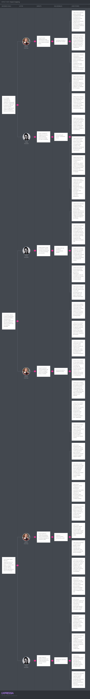

[Ver imagen detallada](./assets/requirements/maps/impact-map/impact-mapping.png)

# Capítulo IV: Strategic-Level Product Design

## 4.1. Strategic-Level Attribute-Driven Design

### 4.1.1.	Design Purpose

El propósito del proceso de diseño de Reqs-AI es establecer una arquitectura de software capaz de resolver tecnológicamente la desconexión y pérdida de información que ocurre durante el levantamiento de requisitos. El diseño está concebido como un sistema creado desde cero orientado a construir una solución robusta, escalable y en tiempo real que traduzca la voz del cliente directamente en especificaciones técnicas de alto valor.

Este diseño está directamente orientado a satisfacer las necesidades críticas de nuestros dos segmentos objetivos:
* **Para el Líder Técnico de Startup:** La arquitectura priorizará el rendimiento y la integración (flujos automatizados hacia herramientas como Jira), asegurando agilidad y la reducción del tiempo entre el *discovery* y el desarrollo.
* **Para la Analista Enterprise:** El diseño se centrará en la seguridad y la privacidad de los datos, estableciendo una arquitectura *Multitenancy* con aislamiento de datos estricto (*Row Level Security*), cumpliendo así con las exigencias corporativas y mitigando los riesgos de fuga de información.

A nivel de negocio para la startup Kntro-Soft, el diseño tiene el propósito de habilitar el modelo de distribución SaaS (Software as a Service). La arquitectura debe soportar el sistema de suscripciones y facturación, gestionar los límites de consumo de los motores de IA (LLMs) para mantener la rentabilidad, y asegurar que la plataforma pueda escalar el procesamiento de múltiples organizaciones concurrentes sin degradar la experiencia de usuario.

### 4.1.2.	Attribute-Driven Design Inputs

En esta sección se presentan las entradas fundamentales requeridas para ejecutar el proceso de diseño arquitectónico basado en el método Attribute-Driven Design (ADD). Estos inputs proporcionan el contexto, las metas y los límites que guiarán la toma de decisiones técnicas para la plataforma Reqs-AI. A continuación, el contenido se divide en tres categorías principales dictadas por la metodología: la funcionalidad primaria, los escenarios de atributos de calidad y las restricciones.

#### 4.1.2.1.	Primary Functionality (Primary User Stories)

A continuación, se detallan las Historias de Usuario primarias que tienen el mayor impacto arquitectónico en el diseño de Reqs-AI. Estas funcionalidades han sido seleccionadas porque introducen requerimientos complejos de procesamiento asíncrono (análisis de audio en tiempo real), integración con servicios de Inteligencia Artificial (LLMs) y aislamiento estricto de datos (Multitenancy), elementos que dictarán la topología base del sistema.

| Epic / User Story ID | Título                             | Descripción                                                                                                                                                                                     | Criterios de Aceptación                                                                                                                                                                                                                                                          | Relacionado con (Epic ID) |
|:---------------------|:-----------------------------------|:------------------------------------------------------------------------------------------------------------------------------------------------------------------------------------------------|:---------------------------------------------------------------------------------------------------------------------------------------------------------------------------------------------------------------------------------------------------------------------------------|:--------------------------|
| **US05**             | Crear organización                 | Como usuario autenticado sin organización, quiero crear un espacio de trabajo con el nombre de mi empresa, para centralizar proyectos en un entorno separado.                                   | **Given** un usuario autenticado sin organización **When** crea una organización con un nombre válido **Then** el sistema genera el espacio de trabajo **And** asigna al usuario el rol inamovible de 'Propietario'                                                     | EP02                      |
| **US16**             | Cargar documentos del cliente      | Como miembro, quiero subir documentos del cliente al proyecto, para que las historias generadas reflejen el vocabulario del negocio (RAG).                                                      | **Given** un usuario configurando un proyecto **When** sube un glosario en PDF válido **Then** el sistema debe fragmentar (chunking), vectorizar y persistir el documento en una base de datos vectorial en menos de 10 segundos                                           | EP04                      |
| **US29**             | Generación automática de historias | Como analista, quiero que el sistema procese el audio en vivo y redacte automáticamente historias de usuario estructuradas con criterios de aceptación, para ahorrar horas de redacción manual. | **Given** una sesión de captura de audio activa **When** el sistema recibe y transcribe el flujo de voz **Then** el motor de IA procesa el texto generado **And** redacta una historia de usuario en formato Gherkin **And** la añade al backlog de la sesión actual | EP06                      |

#### 4.1.2.2.	Quality attribute Scenarios

En esta sección se definen los escenarios de atributos de calidad más críticos que guiarán las decisiones arquitectónicas de Reqs-AI. Se ha priorizado el Rendimiento (necesario para el procesamiento de audio en tiempo real), la Seguridad (aislamiento de datos), la Disponibilidad (para tolerar fallas externas) y la Modificabilidad (cambio de proveedores de IA).

| Atributo                            | Fuente                              | Estímulo                                                                                                | Artefacto                                | Entorno                                           | Respuesta                                                                                                                                                     | Medida                                                                               |
|:------------------------------------|:------------------------------------|:--------------------------------------------------------------------------------------------------------|:-----------------------------------------|:--------------------------------------------------|:--------------------------------------------------------------------------------------------------------------------------------------------------------------|:-------------------------------------------------------------------------------------|
| **Performance (Streaming)**         | Líder Técnico / Analista Enterprise | El usuario habla durante la sesión de levantamiento de requerimientos.                                  | Motor de Transcripción (STT)             | Operación normal del sistema.                     | El sistema procesa el flujo de audio continuo y renderiza el texto en la interfaz del cliente.                                                                | La transcripción parcial debe aparecer en pantalla en **menos de 2 segundos**.       |
| **Performance (Consolidación)**     | Líder Técnico / Analista Enterprise | El usuario detiene la grabación de la sesión para generar el Gherkin final.                             | Motor de Procesamiento e Integración LLM | Operación normal del sistema.                     | El sistema procesa la transcripción, consulta al LLM y retorna el documento estructurado.                                                                     | El documento final se entrega en **menos de 20 segundos** tras finalizar la sesión.  |
| **Security (Seguridad)**            | Usuario autenticado del Tenant A    | Intenta acceder a través de la API a un ID de proyecto o archivo de audio del Tenant B.                 | API Gateway / Base de Datos              | Operación normal del sistema.                     | El sistema intercepta la petición, verifica el contexto de seguridad (Row Level Security) y deniega el acceso.                                                | El acceso se bloquea el **100% de las veces** y se registra el intento en auditoría. |
| **Availability (Disponibilidad)**   | Proveedor externo de IA (API)       | El servicio del LLM no responde (Timeout) o devuelve un error 500 durante una sesión en vivo.           | Motor de Integración de IA               | Entorno degradado (Falla de dependencia externa). | El sistema persiste la transcripción con estado Pendiente y encola la solicitud en memoria mediante Eventos de Spring asíncronos para reintentar la conexión. | Se recupera la operación con **0 bytes perdidos**.                                   |
| **Modifiability (Modificabilidad)** | Arquitecto de Software              | El negocio decide cambiar de proveedor de LLM (ej. de OpenAI a Anthropic) por un incremento de precios. | Módulo de Integración de IA              | Tiempo de diseño/desarrollo.                      | El desarrollador implementa un nuevo adaptador (Adapter) para la nueva API sin alterar la lógica de negocio core.                                             | El cambio se completa e integra en **menos de 16 horas de desarrollo**.              |

##### 4.1.2.3.	Constraints

Esta sección describe las restricciones innegociables impuestas por el modelo de negocio, las capacidades técnicas del equipo y la viabilidad del proyecto. Las principales restricciones incluyen la dependencia de APIs de LLMs externos y el uso del stack tecnológico (Java/Spring Boot y Angular/Vue.js). A continuación, se detallan como Technical Stories:

| Technical Story ID | Título                               | Descripción                                                                                                                                                            | Criterios de Aceptación                                                                                                                                                                              | Relacionado con (Epic ID) |
|:-------------------|:-------------------------------------|:-----------------------------------------------------------------------------------------------------------------------------------------------------------------------|:-----------------------------------------------------------------------------------------------------------------------------------------------------------------------------------------------------|:--------------------------|
| **TS01**           | Stack Tecnológico Backend y Frontend | Como equipo de desarrollo, debemos utilizar Java (Spring Boot) para el backend y Angular o Vue.js para el frontend, debido a la experiencia técnica previa del equipo. | **Given** un nuevo componente a desarrollar **When** el equipo inicie su construcción **Then** el código debe estar escrito en Java 17+ usando Spring Boot o TypeScript usando Angular/Vue.js. | EP01, EP02                |
| **TS02**           | Uso de APIs de LLM externas          | Como Arquitecto de Software, debo integrar el sistema con APIs de modelos de terceros (ej. OpenAI, Anthropic), ya que no alojaremos modelos propios.                   | **Given** la necesidad de generar Gherkin **When** el sistema realice una inferencia **Then** la petición debe enrutarse hacia la API REST del proveedor seleccionado.                         | EP04                      |
| **TS03**           | Despliegue en Cloud Pública          | Como responsable de infraestructura, debo asegurar que los componentes sean desplegados en la nube (AWS, Azure o GCP), para evitar costos *on-premise*.                | **Given** la liberación de una nueva versión **When** se ejecute el pipeline de despliegue **Then** los artefactos deben aprovisionarse en la nube pública seleccionada.                       | Todas                     |

### 4.1.3.	Architectural Drivers Backlog

En esta sección se establece el conjunto de Architectural Drivers acordados por el equipo, resultado del proceso iterativo en nuestro Quality Attribute Workshop (QAW). El Architectural Drivers Backlog consolida los Functional Drivers seleccionados (provenientes de las historias de usuario críticas), los Quality Attribute Drivers seleccionados (Performance, Security, Availability, Modifiability) y todos los Constraints del negocio y la tecnología. Todos los Drivers se presentan a continuación, habiendo sido priorizados de forma descendente colocando primero aquellos que representan una Alta importancia para los Stakeholders y un Alto impacto en la Complejidad Técnica de la Arquitectura.

| Driver ID | Título de Driver                                          | Descripción                                                                                                                                                                            | Importancia para Stakeholders (High, Medium, Low) | Impacto en Architecture Technical Complexity (High, Medium, Low) |
|:----------|:----------------------------------------------------------|:---------------------------------------------------------------------------------------------------------------------------------------------------------------------------------------|:--------------------------------------------------|:-----------------------------------------------------------------|
| **AD-01** | Procesamiento de Audio en Tiempo Real e Integración LLM   | El sistema debe ingestar flujos continuos de audio (STT) en <2s y consolidar la inferencia del modelo LLM (Gherkin) en <20s, gestionando operaciones asíncronas durante las reuniones. | High                                              | High                                                             |
| **AD-02** | Arquitectura Multitenancy y Aislamiento de Datos          | El diseño debe garantizar la separación estricta de la información (Row Level Security) entre organizaciones corporativas, denegando el 100% de los accesos cruzados.                  | High                                              | High                                                             |
| **AD-03** | Tolerancia a Fallos en Servicios de IA Externos           | El sistema debe ser capaz de soportar caídas de las APIs de IA (Timeout/5xx) sin perder datos, procesando las sesiones de forma asíncrona mediante el patrón Observer (Eventos de Spring) y control de estado en la Base de Datos. | High                                              | High                                                             |
| **AD-04** | Dependencia Estricta de APIs de LLM Externas              | Todo el procesamiento de inteligencia generativa dependerá de proveedores externos, lo que obliga al diseño a gestionar *rate limits* y costos operativos.                             | High                                              | High                                                             |
| **AD-05** | Ingesta de Contexto del Cliente y Motor RAG               | El sistema debe fragmentar (chunking) y vectorizar los PDFs de contexto de las empresas en <10s para proveer Retrieval-Augmented Generation en las inferencias.                        | High                                              | Medium                                                           |
| **AD-06** | Modificabilidad de Proveedores de Inteligencia Artificial | La arquitectura debe ser agnóstica al proveedor del LLM, permitiendo el reemplazo de la API de IA (ej. de OpenAI a Anthropic) en <16 horas de desarrollo mediante adaptadores.         | High                                              | Medium                                                           |
| **AD-07** | Despliegue en Cloud Pública                               | Todos los componentes deben ser contenerizados y desplegados en una nube pública como AWS o Azure para minimizar costos *on-premise* y permitir la escalabilidad.                      | Medium                                            | Medium                                                           |
| **AD-08** | Stack Tecnológico Base de Desarrollo                      | El backend debe desarrollarse en Java (Spring Boot) y el frontend en Angular/Vue.js debido al conocimiento técnico previo del equipo, limitando la adopción de otros lenguajes core.   | Medium                                            | Low                                                              |

### 4.1.4.	Architectural Design Decisions

En esta sección se detalla el proceso seguido durante las iteraciones (Stages) del *Quality Attribute Workshop* para definir la arquitectura de Reqs-AI. En cada etapa, el equipo enfrentó un conjunto específico de *Architectural Drivers* y evaluó distintos patrones o tácticas de diseño, sopesando sus pros y contras (Trade-offs) para asegurar que la solución cumpla con los atributos de calidad exigidos sin incurrir en *over-engineering* para la etapa actual de la startup.

**Iteración 1: Topología Base y Multitenancy (Drivers: AD-02, AD-07, AD-08)**
En esta primera iteración se evaluó la estructura general del backend y cómo gestionar el aislamiento de datos. Se descartó la arquitectura de Microservicios por su alta complejidad operativa, optando por un **Monolito Modular** en Spring Boot (AD-08). Para resolver la separación de datos entre empresas (AD-02), se debatió entre *Database-per-Tenant* y *Shared-Database*. Se eligió la base de datos compartida aplicando políticas estrictas de **Row Level Security (RLS)** a nivel de base de datos (ej. PostgreSQL), lo que garantiza el aislamiento del 100% de la información mientras se optimizan los costos de despliegue en la nube (AD-07).

**Iteración 2: Ingesta de Audio en Tiempo Real y Tolerancia a Fallos (Drivers: AD-01, AD-03)**
El reto principal fue cumplir con la latencia <2s para la transcripción en vivo (AD-01). Se evaluó REST Polling, Server-Sent Events (SSE) y WebSockets. Se eligió **WebSockets** por permitir una comunicación bidireccional continua (necesaria para mandar fragmentos de audio al server y recibir texto del STT simultáneamente). Para la tolerancia a fallos ante caídas de las APIs de IA (AD-03), se descartó la complejidad de un **Message Broker externo** y se adoptó el uso de **Colas en Memoria RAM (Patrón Observer)** junto con persistencia de estado en la Base de Datos, optimizando la latencia y reduciendo costos de infraestructura en el MVP.

**Iteración 3: Integración RAG y Modificabilidad de IA (Drivers: AD-04, AD-05, AD-06)**
Finalmente, el equipo abordó cómo evitar el acoplamiento con las APIs de IA de terceros y cómo lograr el RAG rápido (AD-05). Se descartó la Arquitectura en Capas tradicional a favor de una **Arquitectura Hexagonal (Ports and Adapters)**. Esto permite encapsular las reglas de negocio del *Prompt Engineering* en el dominio, dejando a OpenAI o Anthropic como simples "adaptadores", cumpliendo la meta de intercambiabilidad en <16h (AD-06). Para el almacenamiento del contexto del cliente, se eligió una **Base de Datos Vectorial** (ej. pgvector) superando las limitaciones de búsqueda semántica de las BD relacionales tradicionales.

**Candidate Pattern Evaluation Matrix**

La siguiente matriz resume la evaluación de los patrones candidatos considerados para los Drivers más críticos, justificando técnica y económicamente la decisión final del equipo.

| Driver ID | Título de Driver                          | Pattern 1                                                                                                                                                                                                                                       | Pattern 2                                                                                                                                                                                                                                                                                      | Pattern 3                                                                                                                                                                                                                |
|:----------|:------------------------------------------|:------------------------------------------------------------------------------------------------------------------------------------------------------------------------------------------------------------------------------------------------|:-----------------------------------------------------------------------------------------------------------------------------------------------------------------------------------------------------------------------------------------------------------------------------------------------|:-------------------------------------------------------------------------------------------------------------------------------------------------------------------------------------------------------------------------|
| **AD-01** | Procesamiento de Audio en Tiempo Real     | **REST Long Polling** **Pro:** Fácil implementación inicial. **Con:** Genera una alta latencia de red e interrumpe el flujo continuo del audio, incumpliendo la meta de <2s. *(Descartado)*                                               | **WebSockets** *(Elegido)* **Pro:** Comunicación bidireccional y persistente, latencia casi nula para *streaming* de audio a texto. **Con:** Añade complejidad al manejo de estados y balanceo de carga.                                                                                 | **Server-Sent Events (SSE)** **Pro:** Excelente para enviar texto del servidor al cliente con soporte HTTP nativo. **Con:** Es unidireccional. No sirve para que el cliente envíe su audio en vivo. *(Descartado)* |
| **AD-02** | Arquitectura Multitenancy y Aislamiento   | **Database per Tenant** **Pro:** Aislamiento físico de datos impecable. Fácil restauración. **Con:** Costos exorbitantes para una startup si la plataforma escala a miles de pequeñas empresas. *(Descartado)*                            | **Shared Database con Row Level Security** *(Elegido)* **Pro:** Maximiza la economía de infraestructura. El motor (PostgreSQL) asegura que un inquilino jamás vea datos ajenos. **Con:** Un error en la configuración de la política expone a todos.                                     | *(No se evaluó un 3er patrón)*                                                                                                                                                                                           |
| **AD-03** | Tolerancia a Fallos en Servicios Externos | **Cola en Memoria RAM local (Patrón Observer con @Async)** *(Elegido)* **Pro:** Muy rápido (latencia mínima), simplicidad de código y no requiere aprovisionar infraestructura extra (RabbitMQ/Kafka). **Con:** Si el servidor se reinicia abruptamente, los eventos en memoria se pierden, por lo que el estado debe respaldarse en Base de Datos. | **Message Broker Persistente (ej. RabbitMQ / Kafka)** *(Descartado)* **Pro:** Garantiza la durabilidad total de los mensajes y retries automáticos si el pod falla. **Con:** Exceso de ingeniería (Overengineering) para la etapa actual del proyecto. Requiere aprovisionar, configurar y pagar por otro componente pesado en el cloud. | *(No se evaluó un 3er patrón)*                                                                                                                                                                                           |
| **AD-06** | Modificabilidad de Proveedores IA         | **Arquitectura Monolítica en Capas** **Pro:** Modelo mental simple para el equipo (Controllers, Services, Repositories). **Con:** Lógica de negocio altamente acoplada al SDK del proveedor de IA. Tomaría semanas migrar. *(Descartado)* | **Arquitectura Hexagonal (Ports & Adapters)** *(Elegido)* **Pro:** El dominio ignora qué IA se usa. Cambiar a Anthropic solo exige escribir un nuevo Adapter para el Port correspondiente en <16h. **Con:** Exige escribir más código *boilerplate* y dominar Inyección de Dependencias. | *(No se evaluó un 3er patrón)*                                                                                                                                                                                           |

### 4.1.5.	Quality Attribute Scenario Refinements

Tras finalizar las iteraciones del *Quality Attribute Workshop* y definir los patrones arquitectónicos base (WebSockets para el streaming, Shared DB con Row Level Security para el multitenancy, y Arquitectura Orientada a Eventos en Memoria para la tolerancia a fallos), procedemos a refinar los escenarios de atributos de calidad priorizados. Estos refinamientos incorporan los artefactos tecnológicos que ahora conocemos y mapean directamente los escenarios con los objetivos de negocio (Business Goals) de la plataforma SaaS, identificando además las preguntas abiertas y riesgos remanentes (Issues).

A continuación, se presenta la versión final de los escenarios refinados en orden de prioridad.

 

<table border="1" style="width: 100%; border-collapse: collapse;">
  <tr>
    <th colspan="2" style="text-align: left; padding: 8px;">Scenario Refinement for Scenario 1</th>
    <th style="padding: 8px;">Procesamiento de Audio en Tiempo Real (Streaming)</th>
  </tr>
  <tr>
    <td colspan="2" style="padding: 8px;"><strong>Scenario(s):</strong></td>
    <td style="padding: 8px;">Procesamiento asíncrono y bidireccional de audio durante la reunión en vivo.</td>
  </tr>
  <tr>
    <td colspan="2" style="padding: 8px;"><strong>Business Goals:</strong></td>
    <td style="padding: 8px;">Garantizar una experiencia de usuario fluida y sin fricciones que posicione a Reqs-AI como una herramienta no intrusiva y veloz, fomentando la adopción temprana por parte de Startups.</td>
  </tr>
  <tr>
    <td colspan="2" style="padding: 8px;"><strong>Relevant Quality Attributes:</strong></td>
    <td style="padding: 8px;">Performance, Usability</td>
  </tr>
  <tr>
    <td style="width: 15%; padding: 8px;"></td>
    <td style="width: 25%; padding: 8px;"><strong>Stimulus:</strong></td>
    <td style="padding: 8px;">El usuario habla de forma continua durante la sesión de levantamiento de requerimientos.</td>
  </tr>
  <tr>
    <td rowspan="5" style="vertical-align: top; padding: 8px;"><strong>Scenario Components</strong></td>
    <td style="padding: 8px;"><strong>Stimulus Source:</strong></td>
    <td style="padding: 8px;">Líder Técnico / Analista Enterprise.</td>
  </tr>
  <tr>
    <td style="padding: 8px;"><strong>Environment:</strong></td>
    <td style="padding: 8px;">Operación normal del sistema, con conexión a internet estable.</td>
  </tr>
  <tr>
    <td style="padding: 8px;"><strong>Artifact (if Known):</strong></td>
    <td style="padding: 8px;">Servidor de WebSockets y Motor STT (Speech-to-Text).</td>
  </tr>
  <tr>
    <td style="padding: 8px;"><strong>Response:</strong></td>
    <td style="padding: 8px;">El sistema ingesta el flujo de audio a través del canal WebSocket abierto y retorna transcripciones parciales asíncronas al cliente.</td>
  </tr>
  <tr>
    <td style="padding: 8px;"><strong>Response Measure:</strong></td>
    <td style="padding: 8px;">La transcripción parcial aparece en pantalla en <strong>&lt; 2 segundos</strong>.</td>
  </tr>
  <tr>
    <td colspan="2" style="padding: 8px;"><strong>Questions:</strong></td>
    <td style="padding: 8px;">¿Cuál es el impacto en la memoria RAM del servidor al mantener cientos de conexiones WebSocket concurrentes abiertas durante horas?</td>
  </tr>
  <tr>
    <td colspan="2" style="padding: 8px;"><strong>Issues:</strong></td>
    <td style="padding: 8px;">Posibles desconexiones abruptas de WebSockets en redes corporativas (Enterprise) que utilizan firewalls o proxies estrictos.</td>
  </tr>
</table>

 

<table border="1" style="width: 100%; border-collapse: collapse;">
  <tr>
    <th colspan="2" style="text-align: left; padding: 8px;">Scenario Refinement for Scenario 2</th>
    <th style="padding: 8px;">Arquitectura Multitenancy y Aislamiento de Datos</th>
  </tr>
  <tr>
    <td colspan="2" style="padding: 8px;"><strong>Scenario(s):</strong></td>
    <td style="padding: 8px;">Prevención de acceso no autorizado a datos transaccionales de otra organización.</td>
  </tr>
  <tr>
    <td colspan="2" style="padding: 8px;"><strong>Business Goals:</strong></td>
    <td style="padding: 8px;">Cumplir con estrictas normativas de privacidad corporativa para lograr cerrar contratos B2B de alto valor con clientes del segmento Enterprise.</td>
  </tr>
  <tr>
    <td colspan="2" style="padding: 8px;"><strong>Relevant Quality Attributes:</strong></td>
    <td style="padding: 8px;">Security, Data Privacy</td>
  </tr>
  <tr>
    <td style="width: 15%; padding: 8px;"></td>
    <td style="width: 25%; padding: 8px;"><strong>Stimulus:</strong></td>
    <td style="padding: 8px;">Intento de lectura/escritura a través de la API hacia un ID de proyecto o archivo de audio que pertenece a otro inquilino (Tenant).</td>
  </tr>
  <tr>
    <td rowspan="5" style="vertical-align: top; padding: 8px;"><strong>Scenario Components</strong></td>
    <td style="padding: 8px;"><strong>Stimulus Source:</strong></td>
    <td style="padding: 8px;">Usuario autenticado malintencionado o error de enrutamiento en el frontend.</td>
  </tr>
  <tr>
    <td style="padding: 8px;"><strong>Environment:</strong></td>
    <td style="padding: 8px;">Operación normal, sistema bajo ataque o durante auditoría de seguridad.</td>
  </tr>
  <tr>
    <td style="padding: 8px;"><strong>Artifact (if Known):</strong></td>
    <td style="padding: 8px;">API Gateway, Spring Security y Base de Datos PostgreSQL (Shared DB con RLS).</td>
  </tr>
  <tr>
    <td style="padding: 8px;"><strong>Response:</strong></td>
    <td style="padding: 8px;">El filtro RLS de la base de datos deniega la lectura, la API retorna un error 403 Forbidden y el evento se guarda en los logs de auditoría.</td>
  </tr>
  <tr>
    <td style="padding: 8px;"><strong>Response Measure:</strong></td>
    <td style="padding: 8px;">El acceso se bloquea el <strong>100% de las veces</strong> sin fugas de información.</td>
  </tr>
  <tr>
    <td colspan="2" style="padding: 8px;"><strong>Questions:</strong></td>
    <td style="padding: 8px;">¿Cómo afecta la validación de políticas RLS al rendimiento de las consultas complejas (JOINs) cuando la tabla principal supere el millón de registros?</td>
  </tr>
  <tr>
    <td colspan="2" style="padding: 8px;"><strong>Issues:</strong></td>
    <td style="padding: 8px;">Un error humano del DBA al configurar una nueva política RLS podría exponer datos cruzados masivamente si no hay pruebas automatizadas que lo verifiquen.</td>
  </tr>
</table>

 

<table border="1" style="width: 100%; border-collapse: collapse;">
  <tr>
    <th colspan="2" style="text-align: left; padding: 8px;">Scenario Refinement for Scenario 3</th>
    <th style="padding: 8px;">Tolerancia a Fallos en Servicios de IA</th>
  </tr>
  <tr>
    <td colspan="2" style="padding: 8px;"><strong>Scenario(s):</strong></td>
    <td style="padding: 8px;">Caída o timeout del proveedor externo de Inteligencia Artificial (OpenAI / Anthropic).</td>
  </tr>
  <tr>
    <td colspan="2" style="padding: 8px;"><strong>Business Goals:</strong></td>
    <td style="padding: 8px;">Evitar la pérdida irreversible de la información capturada en las reuniones para mantener la confianza absoluta de los clientes y minimizar la tasa de abandono (churn rate).</td>
  </tr>
  <tr>
    <td colspan="2" style="padding: 8px;"><strong>Relevant Quality Attributes:</strong></td>
    <td style="padding: 8px;">Availability, Reliability</td>
  </tr>
  <tr>
    <td style="width: 15%; padding: 8px;"></td>
    <td style="width: 25%; padding: 8px;"><strong>Stimulus:</strong></td>
    <td style="padding: 8px;">El servicio del LLM no responde (Timeout) o devuelve un error 5xx durante la fase crítica de consolidación de historias.</td>
  </tr>
  <tr>
    <td rowspan="5" style="vertical-align: top; padding: 8px;"><strong>Scenario Components</strong></td>
    <td style="padding: 8px;"><strong>Stimulus Source:</strong></td>
    <td style="padding: 8px;">Proveedor externo de API de Inteligencia Artificial.</td>
  </tr>
  <tr>
    <td style="padding: 8px;"><strong>Environment:</strong></td>
    <td style="padding: 8px;">Entorno degradado (Falla crítica de dependencia externa).</td>
  </tr>
  <tr>
    <td style="padding: 8px;"><strong>Artifact (if Known):</strong></td>
    <td style="padding: 8px;">Módulo de Integración de IA (Adapter Hexagonal) y ApplicationEventPublisher de Spring Boot.</td>
  </tr>
  <tr>
    <td style="padding: 8px;"><strong>Response:</strong></td>
    <td style="padding: 8px;">El sistema marca el registro como PENDIENTE en base de datos, encola el evento en memoria (@Async), notifica al usuario en la UI ("En proceso diferido") y aplica reintentos.</td>
  </tr>
  <tr>
    <td style="padding: 8px;"><strong>Response Measure:</strong></td>
    <td style="padding: 8px;">Se recupera la operación y persiste el texto con <strong>0 bytes perdidos</strong>.</td>
  </tr>
  <tr>
    <td colspan="2" style="padding: 8px;"><strong>Questions:</strong></td>
    <td style="padding: 8px;">¿Cómo garantizamos que un reinicio no planificado del servidor Spring Boot retome automáticamente las tareas marcadas como PENDIENTES en la Base de Datos?</td>
  </tr>
  <tr>
    <td colspan="2" style="padding: 8px;"><strong>Issues:</strong></td>
    <td style="padding: 8px;">Si el servidor reinicia durante un pico de peticiones concurrentes, los eventos asíncronos en RAM se perderán, requiriendo un job de reconciliación en base de datos al arrancar.</td>
  </tr>
</table>

## 4.2.	Strategic-Level Domain-Driven Design

### 4.2.1.	EventStorming

Para establecer una base sólida en el diseño guiado por el dominio (DDD) y facilitar el descubrimiento de nuestros Bounded Contexts, el equipo de Kntro-Soft llevó a cabo una sesión de **Design-Level Event Storming** utilizando la herramienta colaborativa Miro. La sesión tuvo una duración aproximada de 2 horas. El objetivo principal fue transicionar del espacio del problema (entendido en los capítulos anteriores) al espacio de la solución, mapeando la línea de tiempo completa del negocio de Reqs-AI. Al utilizar un enfoque de nivel de diseño, pudimos no solo explorar los eventos que ocurren en el sistema (como la captura de audio o la generación de Gherkin), sino también agrupar lógicamente las reglas de negocio para descubrir los Agregados (Aggregates) estructurales del código antes de definir las fronteras de los subdominios.

La sesión se estructuró siguiendo una agenda iterativa para construir el modelo de forma progresiva:

1. **Domain Events (Eventos de Dominio):** Iniciamos la sesión identificando y ordenando cronológicamente en post-its naranjas los hechos relevantes que ya han ocurrido en el sistema (verbos en participio pasado). La línea de tiempo abarcó desde Organización Registrada y Suscripción Pagada, pasando por el núcleo operativo, hasta eventos de cierre como Historias Exportadas a Jira.

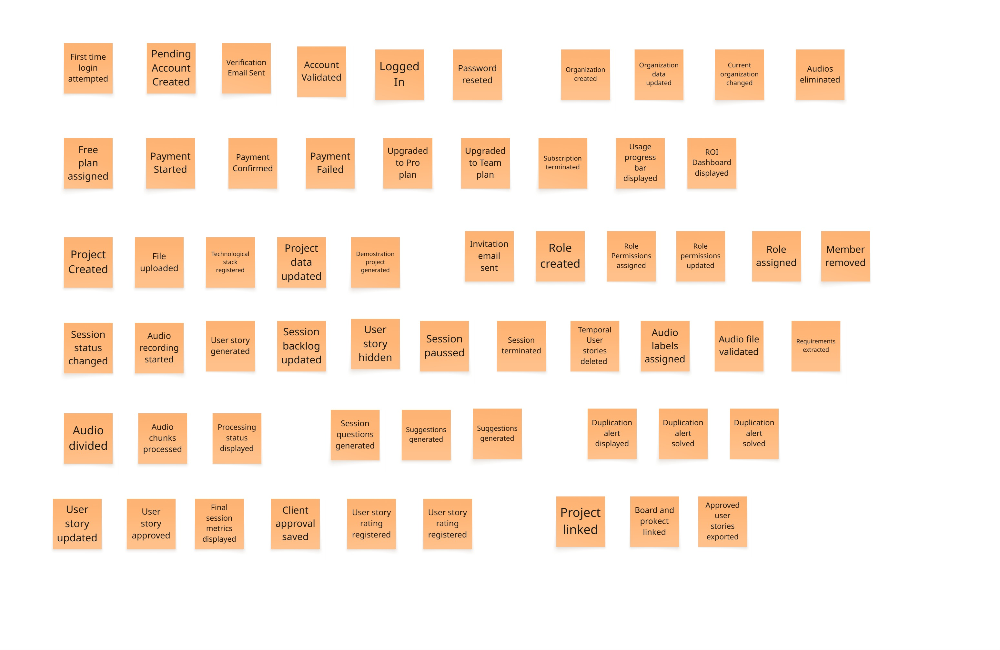

2. **Commands (Comandos):** A la izquierda de cada evento naranja, colocamos post-its azules que representan la acción o intención que provocó dicho evento. Por ejemplo, el comando Procesar Audio precede al evento Audio Transcrito, y el comando Generar Historia de usuario precede a Historia de Usuario Generada.

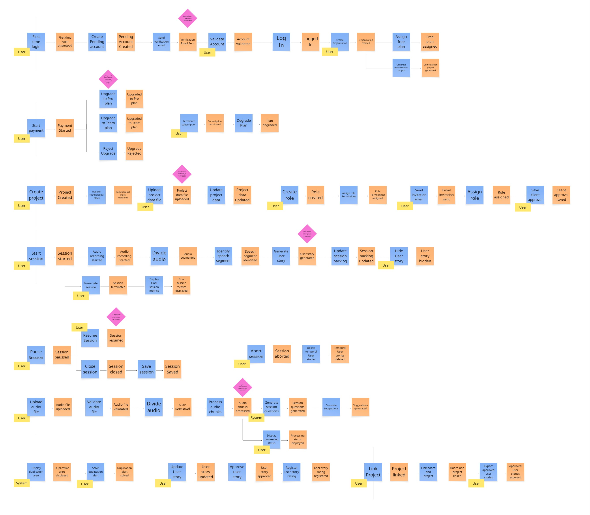

5. **Actors and Policies (Actores y Políticas):** Identificamos qué o quién ejecuta los comandos. Utilizamos post-its amarillos pequeños para los actores humanos, destacando a nuestros roles principales: Líder Técnico, Analista Enterprise. Para las acciones automatizadas de nuestro SaaS, usamos post-its lilas (Políticas), redactadas como reacciones.

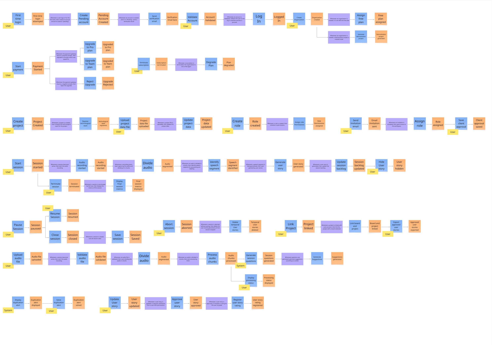

5. **Blank stickies for Read models and UX mockups:** Para garantizar que el diseño de software contemple la experiencia del usuario, insertamos post-its verdes y blancos vacíos justo antes de las decisiones (comandos) de los actores, marcando los lugares donde el usuario necesita información antes de actuar.

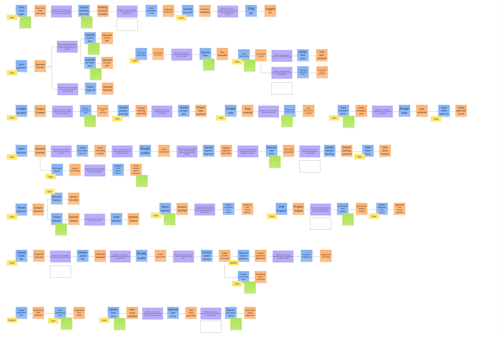

6. **Read models and UX Mockups:** Llenamos los post-its vacíos detallando la información necesaria (post-its verdes), como Estado de Transcripción en Vivo o Dashboard de Consumo de Tokens, y agregamos bocetos rápidos (wireframes en post-its blancos) para visualizar la interfaz de la consola de captura de Reqs-AI.

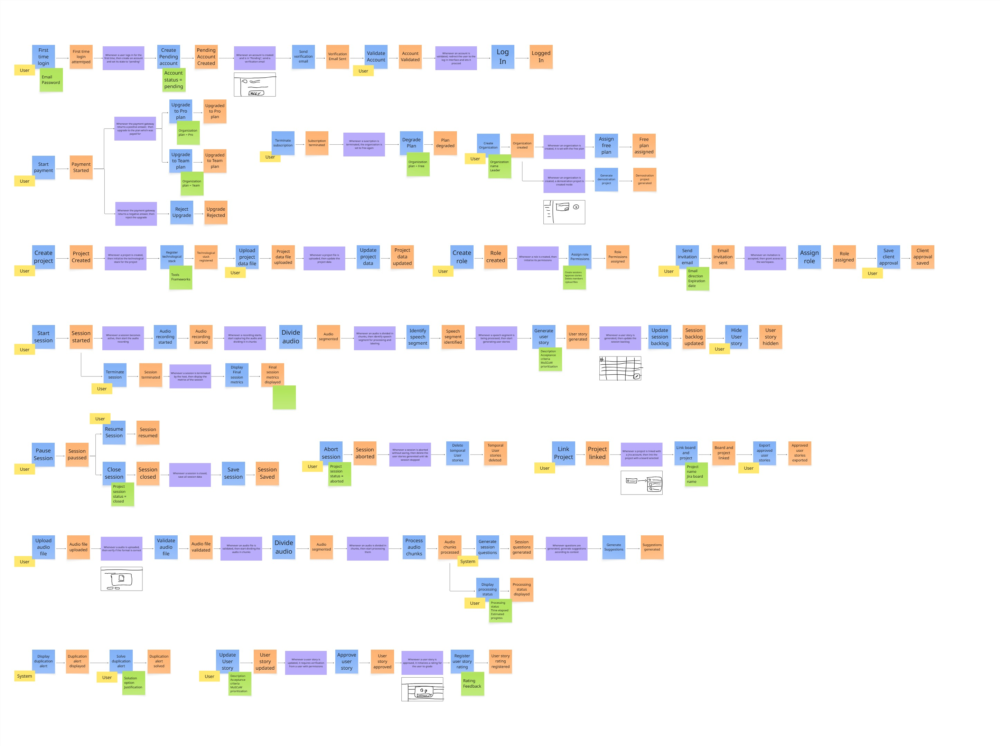

7. **External systems (Sistemas Externos):** Mapeamos las dependencias críticas de Reqs-AI utilizando post-its rosados. Los colocamos entre los comandos y los eventos cuando la acción delegaba responsabilidad a un tercero. Fue fundamental para diagramar llamadas a la API de IA (generación de historias), a la pasarela de pago (facturación) y a la API de Jira (exportación).

8. **Aggregates and Business Rules (Agregados y Reglas de Negocio):** Esta fue la etapa más crítica del diseño. Añadimos post-its amarillos rectangulares entre los comandos y los eventos para documentar las Reglas de Negocio (Business Rules) requeridas, definiendo precondiciones, postcondiciones e invariantes

El resultado de la sesión de Design-Level Event Storming fue un mapa exhaustivo y altamente estructurado del dominio de Reqs-AI. Pasamos de una simple línea de tiempo a un conjunto de Agregados claramente definidos, destacando Aggregates críticos como Organization (para el multitenancy), Subscription, Session y UserStory.

### 4.2.2.	Candidate Context Discovery

A partir del dominio modelado en nuestra sesión de EventStorming, el equipo llevó a cabo un taller colaborativo de descubrimiento de contextos de aproximadamente 2 horas. El objetivo de esta fase fue trazar fronteras lógicas alrededor de los Agregados identificados previamente, con el fin de descomponer el sistema en módulos altamente cohesivos y con bajo acoplamiento (Bounded Contexts).

Para lograr esto, no nos basamos en corazonadas técnicas, sino que aplicamos rigurosamente tres heurísticas de Domain-Driven Design recomendadas por la industria (Alberto Brandolini y Nick Tune) sobre nuestro tablero de Miro. A continuación, se explica la aplicación progresiva de cada heurística y los resultados obtenidos:

1. Aplicación de "Start-with-value" (Identificando el Core Domain)
   Comenzamos el análisis preguntándonos: *¿Por qué partes del sistema pagarían nuestros clientes?* La propuesta de valor y ventaja competitiva de Reqs-AI radica exclusivamente en la transcripción en vivo y la inferencia de Inteligencia Artificial para generar historias de usuario estructuradas.
*   Al analizar la complejidad del tablero, notamos que agrupar esta "magia" en un solo contexto generaría un "monolito de contexto", ya que el flujo del audio y el procesamiento del texto en LLMs manejan ciclos de vida, lenguajes ubicuos y requisitos de rendimiento distintos.
*   **Decisión:** Dividimos el Core Domain en dos Bounded Contexts. Por un lado, el **Meeting Capture**, encargado del manejo de WebSockets y Speech-to-Text. Por el otro lado, **Requirement Generation** se encarga del manejo de los Prompts, el LLM y la gestión del formato Gherkin.

2. Aplicación de "Look-for-pivotal-events" (Fronteras por Cambio de Estado B2B)
   Posteriormente, buscamos en la línea de tiempo los Eventos Pivote que marcan "un antes y un después" crítico en la vida de un cliente dentro de la plataforma.
*   *Evento: "Account Validated" vs "Organization Created":* Observamos que la autenticación de un usuario es un problema genérico, mientras que gestionar a qué empresa pertenece y qué roles tiene es un problema organizativo B2B. **Decisión:** Extraímos el agregado *User* hacia un **IAM** independiente, y el agregado *Organization* hacia el **Workspace**.
*   *Evento: "Upgraded to Pro Plan":* Este evento cambia radicalmente los límites operativos del sistema (cuotas). Involucra pasarelas de pago y facturación. **Decisión:** Aislamos el agregado *Subscription* en el **Billing & Subscription**.

3. Aplicación de "Start-with-simple" (Fronteras por Secuencia de Soporte)
   Finalmente, agrupamos los agregados restantes evaluando su función en los pasos "antes" y "después" del proceso principal de captura de requisitos.
*   Antes de que la IA pueda operar, el Analista necesita crear un entorno y subir documentos PDF de contexto. Esto pertenece al agregado *Project*. **Decisión:** Agrupado en el **Project Configuration**.
*   Después de que las historias son aprobadas, deben enviarse a plataformas externas. Aquí decidimos aplicar el patrón *Anti-Corruption Layer (ACL)* aislando el agregado *ExternalConnection* para que los cambios en las APIs de terceros no contaminen el Core de Reqs-AI, aislandolo en **Integration Gateway**.

**Resumen de Bounded Contexts Descubiertos**
A través de este proceso analítico y evolutivo, el sistema quedó dividido arquitectónicamente en los siguientes 7 Candidate Bounded Contexts:

| Bounded Context | Tipo de Subdominio | Agregado(s) Principal(es) | Responsabilidad Principal |
| :--- | :--- | :--- | :--- |
| **1. Meeting Capture** | Core Domain | Session | Ingesta de audio en tiempo real (WebSockets), control de estado de la reunión (iniciar/pausar) e integración con el servicio de Speech-to-Text. |
| **2. Requirement Generation** | Core Domain | User Story | Inferencia mediante LLMs, fragmentación de contexto (RAG), generación y estructuración del formato Gherkin, y gestión de similitudes. |
| **3. IAM** | Generic Subdomain | User | Autenticación, registro, validación de correo y gestión de credenciales seguras. |
| **4. Workspace** | Generic Subdomain | Organization | Aislamiento Multitenant (Row Level Security), gestión de espacios de trabajo, invitación de miembros y roles corporativos. |
| **5. Billing & Subscription** | Generic Subdomain | Subscription | Integración con pasarelas de pago (ej. Stripe), upgrades/downgrades de planes y monitoreo de consumo de cuotas/tokens. |
| **6. Project Configuration** | Supporting Subdomain | Project | Estructura local de iniciativas del cliente, almacenamiento de parámetros técnicos y alojamiento de PDFs de glosario. |
| **7. Integration Gateway** | Supporting Subdomain | ExternalConnection | Capa Anticorrupción (ACL) para autorizar credenciales (OAuth) y exportar historias hacia herramientas externas como Jira. |

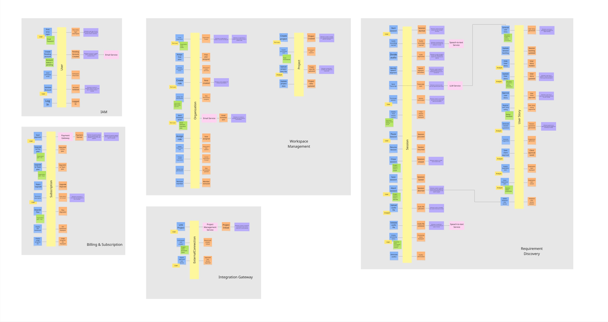

### 4.2.3.	Domain Message Flows Modeling

En esta sección, explicamos y evidenciamos el proceso seguido para visualizar cómo deben colaborar los Bounded Contexts para resolver el caso principal del negocio. Para ello, aplicamos una variante técnica de Domain Storytelling enfocada en el flujo de mensajes. 

Utilizamos una notación específica para modelar la interacción:
*   **Actor:** Persona interactuando con el sistema.
*   **Bounded Context:** Módulo lógico de nuestro dominio.
*   **System:** Sistemas o dependencias externas.
*   **Command:** Intención de hacer algo en color azul.
*   **Event:** Hecho que ya ocurrió en color naranja.
*   **Query:** Solicitud de información en color verde.
*   **Direction of message:** Flecha que indica el flujo del emisor al receptor.

A continuación, detallamos el paso a paso del diagrama elaborado para el flujo principal de Reqs-AI.

**Escenario Core: Captura de Sesión y Generación de Requerimientos**

Este flujo describe la colaboración desde que el usuario inicia la grabación hasta que se generan las historias de usuario estructuradas.

1. **Inicio de Sesión:** El Actor **Analyst** utiliza el System **Website** para enviar el Command **Start Session** al Bounded Context **Meeting Capture**, el cual confirma el inicio emitiendo el Event **Recording Started**.
2. **Procesamiento de Audio:** **Meeting Capture** delega la carga de trabajo enviando el Command **Divide Audio** al System **STT Service**, que retorna progresivamente el Event **Speech segments identified**.
3. **Recopilación de Contexto:** Al finalizar, se emite el Command **Send Transcript** hacia **Requirement Generation**. Este contexto necesita el glosario del cliente, por lo que envía un Query **Request Project Data** a **Project Configuration**, recibiendo como respuesta el Event **Project data sent**.
4. **Inferencia IA:** Con el texto y el contexto listos, **Requirement Generation** envía el Command **Generate User story** al System **LLM Service**. Una vez procesado, se consolida el flujo emitiendo el Event final **User story generated**.

**Escenario: Creación de Organización y Suscripción**

Este flujo detalla el onboarding B2B, donde un líder técnico registra su empresa, realiza el pago de un plan Pro y el sistema prepara su entorno de trabajo inicial.

1. **Creación del Espacio:** El Actor **Tech Lead** usa el System **Website** para enviar el Command **Create organization** al Bounded Context **Workspace**, el cual notifica el éxito de la operación con el Event **Organization Created**.
2. **Gestión del Pago:** Para desbloquear los límites de IA, se emite el Command **Request Pro plan Upgrade** hacia **Billing & Subscription**. Este contexto se comunica con el System **Payment Gateway** mediante el Command **Start Payment** y espera el Event **Payment Validated**.
3. **Activación y Onboarding:** Tras el pago exitoso, se notifica a Workspace con el Event **Upgraded to Pro plan**. Como parte del onboarding automático, Workspace envía el Command **Generate Demonstration Project** a **Project Configuration**, finalizando el flujo con el Event **Demonstration Project Generated**.

### 4.2.4.	Bounded Context Canvases

En esta sección el equipo diseña sus candidate bounded contexts, detallando los criterios de diseño. El equipo seleccionó cada bounded context, por orden de importancia, para elaborar su Bounded Context Canvas basándose en la plantilla de Domain Storytelling. 

A continuación, presentamos los lienzos diseñados para los siete Bounded Contexts de Reqs-AI.

**1. Meeting Capture**

Este contexto es responsable de la ingesta de audio en tiempo real y la transcripción mediante WebSockets.

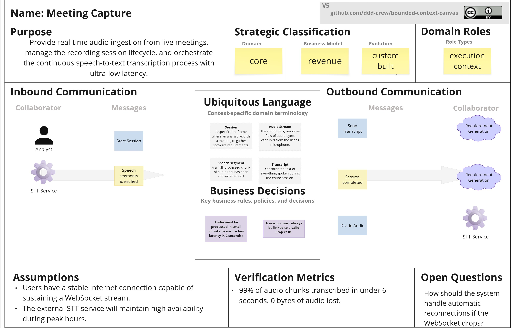

**2. Requirement Generation**

Este contexto es el motor de inteligencia artificial que estructura las transcripciones en formato Gherkin usando estrategias de prompting.

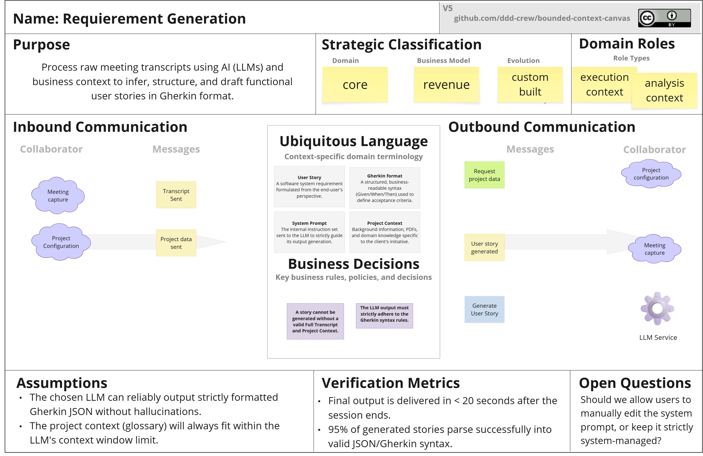

**3. Identity and Access Management**

Este contexto asegura el acceso a la plataforma mediante autenticación y gestión de usuarios.

**4. Workspace**

Este contexto administra el aislamiento de datos multitenant, las organizaciones y los roles B2B.

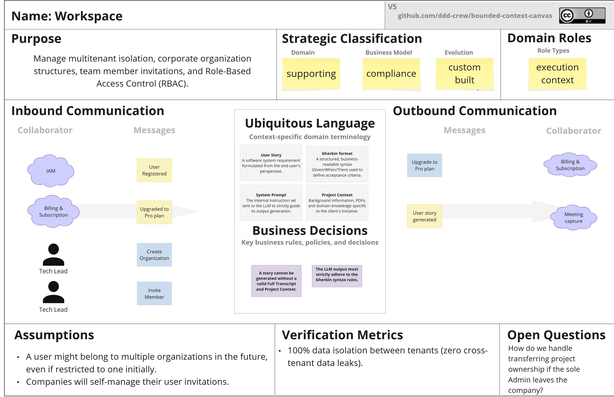

**5. Billing & Subscription**

Este contexto monitorea el uso de las cuotas de IA y gestiona los pagos recurrentes integrando pasarelas externas.

**6. Project Configuration**

Este contexto almacena la estructura de las iniciativas del cliente y sus glosarios para contextualizar la IA.

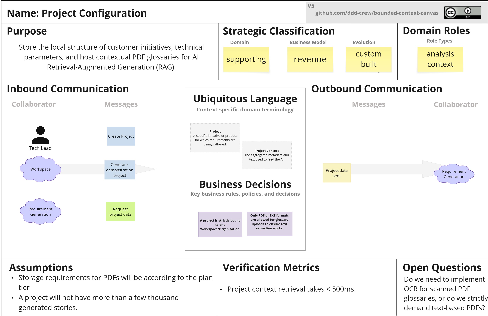

**7. Integration Gateway**

Este contexto actúa como capa anticorrupción para exportar las historias de usuario hacia herramientas ágiles externas como Jira.

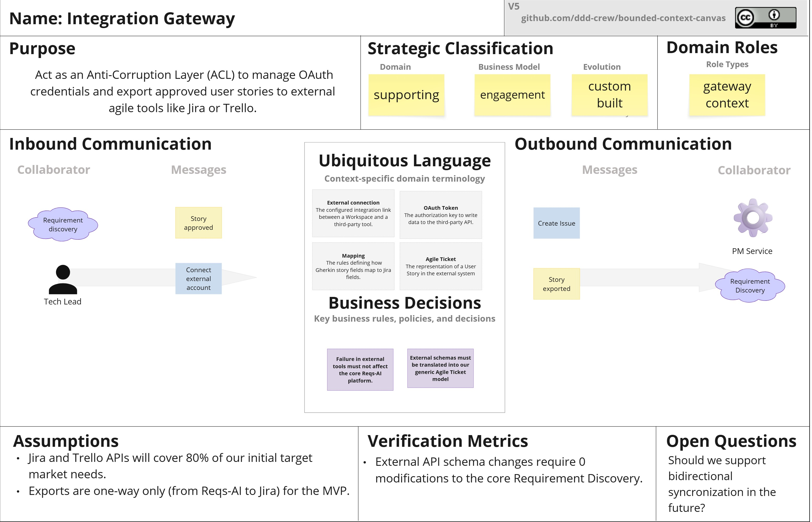

### 4.2.5.	Context Mapping

En esta sección evidenciamos el proceso de elaboración de nuestro Context Map. Para llegar al diseño estructural definitivo de nuestros Bounded Contexts, el equipo evaluó el modelo sometiéndolo a un análisis crítico, respondiendo a las preguntas estratégicas de diseño sugeridas. Además, aplicamos rigurosamente los patrones de integración definidos por el repositorio oficial de Context Mapping de DDD Crew.

**Evaluación de Alternativas y Diseños Candidatos**

*   **¿Qué pasaría si aislamos los core capabilities y movemos los otros a un context aparte?**
    Inicialmente consideramos que la generación de la historia de usuario y su posterior exportación a Jira ocurrieran en el mismo módulo. Sin embargo, al aplicar esta pregunta, nos dimos cuenta de que exportar tickets es una capacidad de soporte. Aislamos el core de IA en **Requirement Generation** y movimos la integración externa al **Integration Gateway** para evitar que cambios en APIs de terceros contaminen nuestro motor de inferencia.
*   **¿Qué pasaría si duplicamos una funcionalidad para romper la dependencia?**
    Evaluamos la validación de cuotas. Si **Requirement Generation** tuviera que preguntar sincrónicamente a **Billing & Subscription** si un usuario tiene saldo de IA antes de cada inferencia, el sistema sería lento y frágil. Decidimos romper esta dependencia directa. **Billing & Subscription** emite eventos asíncronos cuando una cuota se acaba, y **Requirement Generation** duplica y almacena localmente un indicador de bloqueo, permitiendo inferencias rápidas sin consultas de red.
*   **¿Qué pasaría si tomamos un capability de estos contexts y lo usamos para formar un nuevo context?**
    Al analizar la autenticación de usuarios y la gestión de empresas, notamos que estaban fuertemente acopladas. Tomamos la capacidad de registro y login y formamos el contexto **IAM**, separándolo de **Workspace**. Esto nos permite evolucionar la seguridad genérica independientemente de la compleja lógica de roles corporativos multitenant.

**Patrones de Relación DDD Establecidos**

Tras este debate, definimos formalmente los patrones de integración estratégicos entre nuestros módulos y los sistemas de terceros. Las relaciones indican quién es el proveedor Upstream U y quién es el consumidor Downstream D.

1.  **Integration Gateway D hacia External PM Service (Jira) U**
    *   **Patrón:** Anti-Corruption Layer ACL
    *   **Justificación:** El Integration Gateway actúa como una barrera traductora. Consume nuestros eventos internos y los transforma a los complejos modelos de datos de Atlassian. Nuestro Core jamás se entera de los esquemas propietarios de Jira.
2.  **Requirement Generation D hacia External LLM Service U**
    *   **Patrón:** Anti-Corruption Layer ACL
    *   **Justificación:** Para evitar el vendor lock-in con OpenAI o Anthropic. Traducimos nuestros Prompts genéricos al esquema JSON específico de la API del proveedor, protegiendo nuestro modelo de dominio de cambios en la IA externa.
3.  **Meeting Capture D hacia External STT Service U**
    *   **Patrón:** Anti-Corruption Layer ACL
    *   **Justificación:** Al igual que con el LLM, el servicio de Speech-to-Text externo dicta un formato de streaming propio. El ACL aísla a Meeting Capture de la tecnología de transcripción subyacente.
4.  **Requirement Generation D hacia Project Configuration U**
    *   **Patrón:** Customer / Supplier
    *   **Justificación:** Requirement Generation Customer exige que el glosario se le entregue en un formato limpio de texto para el RAG. Project Configuration Supplier adapta su entrega de documentos PDFs para satisfacer esta necesidad.
5.  **Workspace D hacia IAM U y Workspace D hacia Billing & Subscription U**
    *   **Patrón:** Conformist CF
    *   **Justificación:** Workspace conforma ciegamente a los modelos de Identidad de IAM y a los eventos de Cuotas de Billing, sin exigirles cambios a esos dominios genéricos.
6.  **Workspace U hacia Requirement Generation D y Project Configuration D**
    *   **Patrones:** Open Host Service OHS y Published Language PL
    *   **Justificación:** Workspace emite eventos de dominio indicando si una organización tiene permisos o cuotas válidas. Contextos como Requirement Generation y Project Configuration consumen estos eventos estandarizados PL para saber si deben procesar o rechazar las peticiones de IA o creación de proyectos.
7.  **Comunicación Core Interna Event-Driven**
    *   **Patrones:** Open Host Service OHS y Published Language PL
    *   **Justificación:** Las conexiones asíncronas entre los contextos **Meeting Capture U -> Requirement Generation D** y **Requirement Generation U -> Integration Gateway D** se realizan publicando eventos en una cola local, funcionando como un OHS.

**Diagrama de Context Map Final**

A continuación presentamos la visualización de las relaciones estructurales consolidadas tras aplicar los patrones descritos. Las líneas conectan los Bounded Contexts indicando los roles U y D y los patrones aplicados sobre ellas.

## 4.3.	Software Architecture

En este capítulo, el equipo detalla la arquitectura de software de Reqs-AI aplicando el modelo C4. Este modelo jerárquico permite documentar el sistema desde su ecosistema más amplio hasta sus componentes desplegables y su entorno de infraestructura final. Todas las decisiones reflejadas en estos diagramas están alineadas con los Atributos de Calidad y Restricciones analizados previamente, como el uso del Monolito Modular, la tolerancia a fallos en memoria y el multitenancy seguro.

### 4.3.1.	Software Architecture System Landscape Diagram

El *System Landscape Diagram* proporciona una vista panorámica del ecosistema tecnológico en el que habita Reqs-AI. A diferencia de un simple diagrama de contexto que solo mira hacia adentro, este diagrama ilustra cómo nuestro sistema principal (agrupado dentro de los límites de la empresa *Kntro-Soft Enterprise*) interactúa no solo con los usuarios, sino también con el entorno de herramientas de terceros que el usuario final ya utiliza en su día a día corporativo.

A continuación, se presenta la topología del paisaje del sistema:

**Análisis de Interacciones en el Ecosistema:**

1.  **Límite Empresarial Kntro-Soft Enterprise:** Agrupa a nuestros actores principales (Technical Lead y Enterprise Analyst) interactuando centralmente con el **ReqsAI System**. Este es el núcleo de valor donde se graban las reuniones, se analizan los requerimientos y se estructuran en historias de usuario.
2.  **Proveedores de Inteligencia y Procesamiento (Core Dependencies):** En la parte inferior, observamos las dependencias críticas (SaaS) que Reqs-AI delega para cumplir sus objetivos complejos:
    *   **STT API (Speech-to-Text):** Recibe los fragmentos de audio en tiempo real y devuelve el texto.
    *   **LLM API (Large Language Model):** Recibe el contexto del RAG y la transcripción para inferir historias en formato Gherkin.
    *   **Payment Gateway:** Procesa las transacciones de las suscripciones B2B corporativas.
3.  **Herramientas de Ecosistema del Cliente (The Landscape Effect):** La verdadera amplitud del ecosistema se observa en los bordes laterales:
    *   **Project Management Tool Jira:** El diagrama evidencia que el *Technical Lead* gestiona sus Sprints directamente en Jira. ReqsAI actúa como un puente inteligente que exporta las historias de usuario aprobadas hacia esta herramienta, cerrando la brecha entre el levantamiento de requerimientos y la ejecución ágil.
    *   **Email Service Provider:** El *Enterprise Analyst* recibe notificaciones de su organización a través de su proveedor de correo, alimentadas por los eventos disparados desde nuestro sistema.

### 4.3.2.	Software Architecture Context Level Diagrams

Mientras que el Diagrama Landscape nos mostró el panorama del negocio, el **Diagrama de Contexto (Context Level Diagram)** del modelo C4 cambia el foco hacia el interior, centrando toda la atención arquitectónica exclusivamente en el **Reqs-AI System**. Este diagrama responde a la pregunta de "¿Cuáles son las fronteras inmediatas de nuestra solución?".

A nivel de contexto, eliminamos las interacciones directas entre los usuarios y los sistemas de terceros (ej. el Technical Lead consultando Jira por su cuenta) y nos limitamos a mapear cómo nuestro sistema es el único orquestador responsable de comunicarse con el mundo exterior para cumplir sus objetivos.

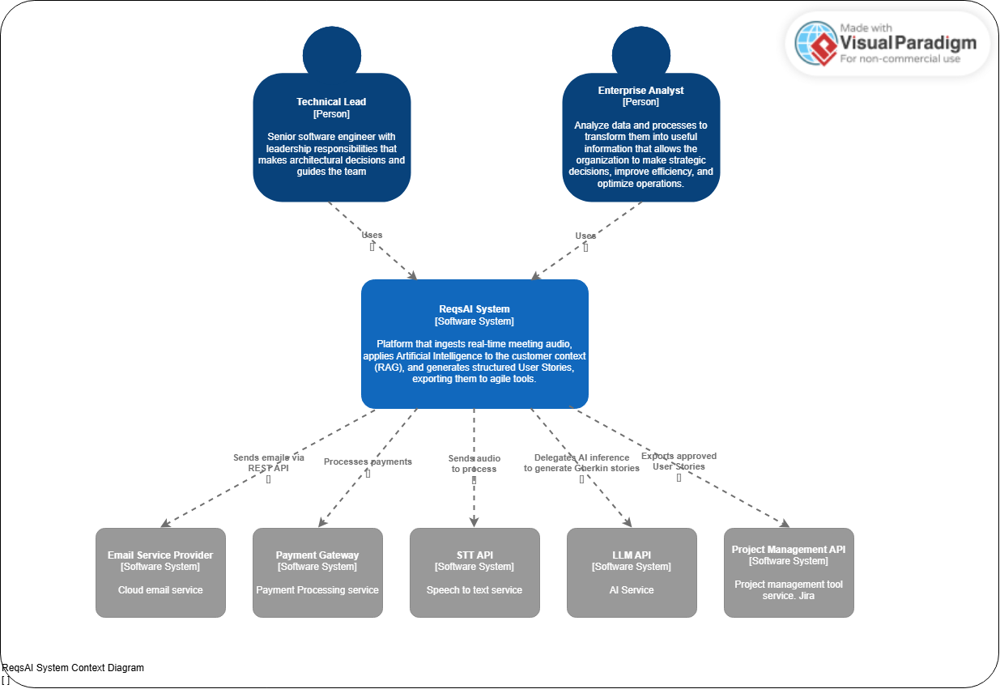

**Análisis de Entradas y Salidas del Sistema Central:**

*   **Actores Primarios (Inbound):**
    *   El **Technical Lead** envía los comandos principales: inicia grabaciones de audio en tiempo real y aprueba las historias generadas.
    *   El **Enterprise Analyst** administra las organizaciones corporativas (Workspaces), los pagos B2B y sube los glosarios de términos que contextualizan la IA.
*   **Sistemas de Soporte (Outbound Operacional):**
    *   **Payment Gateway:** Recibe los datos de transacción para habilitar el uso ilimitado o cuotas Pro de la inteligencia artificial.
    *   **Email Service Provider:** Recibe peticiones vía REST API para enviar los correos transaccionales de recuperación de contraseña y validación de cuentas.
*   **Sistemas Core (Outbound Tecnológico):**
    *   **STT API (Speech-to-Text):** Recibe el streaming continuo de audio de las reuniones y retorna texto fragmentado con latencia inferior a 2 segundos.
    *   **LLM API (Inteligencia Generativa):** Recibe un *Prompt* complejo inyectado con el texto de la reunión y el glosario del proyecto, devolviendo un bloque JSON estructurado en Gherkin.
    *   **Project Management Tool:** Recibe las historias de usuario aprobadas y formateadas para crear automáticamente *Issues* en el backlog del equipo (por ejemplo en Jira).

### 4.3.3.	Software Architecture Container Level Diagrams

En esta sección presentamos el diagrama de contenedores (Nivel 2 del modelo C4) para el sistema **ReqsAI**. Este nivel hace un *zoom in* al sistema principal para revelar los contenedores de software que lo componen (aplicaciones móviles, web, APIs, bases de datos), mostrando cómo se distribuyen las responsabilidades, las decisiones tecnológicas de alto nivel y cómo estos componentes se comunican entre sí y con los sistemas externos.

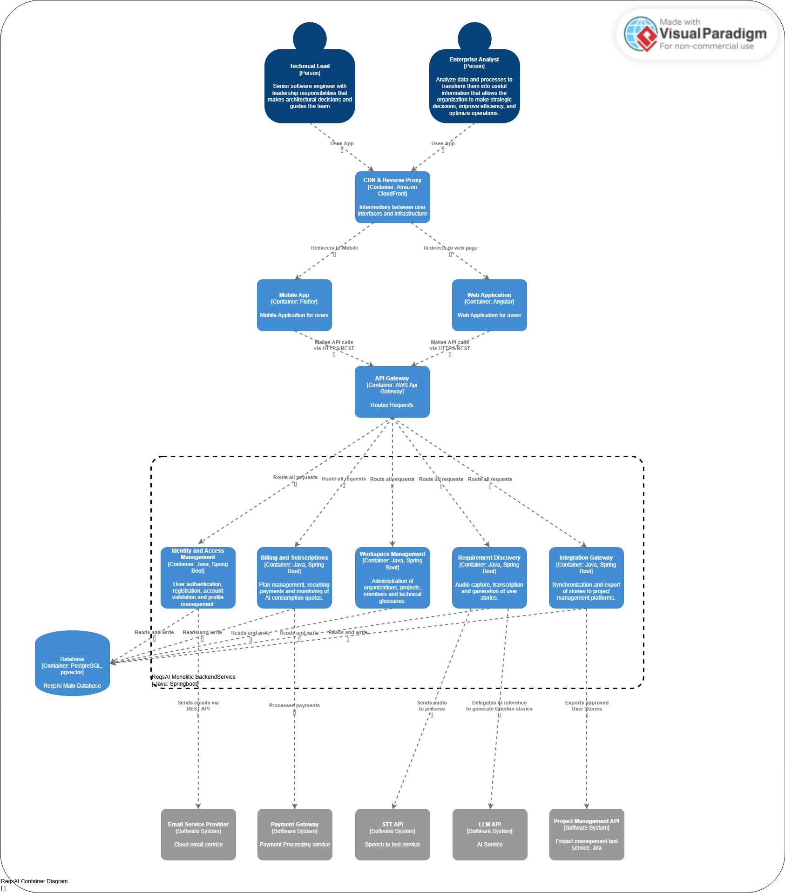

#### Elementos del Diagrama y Distribución de Responsabilidades

El sistema ReqsAI está compuesto por los siguientes contenedores principales:

1.  **Interfaces de Usuario (Frontend):**
    *   **Web Application** Es la plataforma principal para los usuarios. Permite una visualización completa para el análisis profundo de datos, revisión de historias de usuario, configuración de proyectos y gestión general del sistema. Se eligió **Angular** por ser un framework robusto, ideal para aplicaciones empresariales escalables.
    *   **Mobile App:** Proporciona accesibilidad móvil a los usuarios, permitiéndoles interactuar con el sistema, grabar reuniones o revisar el estado de los requerimientos desde cualquier lugar. Se optó por **Flutter** para asegurar un desarrollo multiplataforma eficiente (iOS y Android) con una base de código unificada.

2.  **Punto de Entrada y Enrutamiento:**
    *   **API Gateway:** Actúa como la puerta de entrada única para todas las peticiones (Requests) provenientes de las aplicaciones Web y Móvil. Su responsabilidad es enrutar estas solicitudes hacia los servicios de backend correspondientes, centralizando potencialmente políticas de seguridad, *throttling* y métricas.

3.  **Lógica Core (Backend):**
    *   **ReqsAI Backend Service** Es el motor central del sistema. Maneja toda la lógica de negocio, coordina las transformaciones de datos y orquesta la comunicación con las APIs de terceros. Se seleccionó **Java con Spring Boot** debido a su madurez, seguridad, facilidad para integraciones empresariales y alto rendimiento.

4.  **Almacenamiento de Datos:**
    *   **Database** Es la base de datos principal de ReqsAI. Almacena toda la información del dominio (usuarios, configuraciones, transcripciones e historias de usuario). La elección de **PostgreSQL** con la extensión **pgvector** es una decisión estratégica crítica, ya que permite almacenar y consultar *embeddings* vectoriales, facilitando el procesamiento avanzado de IA y las búsquedas semánticas sobre el contexto de los requerimientos.

**Comunicación e Integración de Contenedores**

La arquitectura define un flujo de comunicación moderno y orientado a servicios:

*   **Comunicación Cliente-Servidor:** Tanto la aplicación móvil como la web interactúan con el API Gateway realizando llamadas a través de **HTTPS/REST**, garantizando seguridad en el transporte y un estándar ampliamente adoptado.
*   **Comunicación Interna:** El API Gateway enruta estas llamadas al *ReqsAI Backend Service*. El backend, a su vez, lee y escribe (*Reads and write*) de manera síncrona en la base de datos PostgreSQL para mantener el estado del sistema.
*   **Integración con Sistemas Externos:** El Backend Service actúa como el coordinador central que delega tareas específicas a sistemas externos especializados:
    *   Envía correos a través del **Email Service Provider**.
    *   Procesa transacciones a través del **Payment Gateway**.
    *   Envía los audios de las reuniones al **STT API** para convertirlos a texto.
    *   Delega la inferencia de inteligencia artificial al **LLM API** para la generación de historias de usuario en formato Gherkin.
    *   Exporta finalmente las historias de usuario aprobadas hacia la herramienta de gestión mediante la **Project Management API** (Jira).

### 4.3.4.	Software Architecture Deployment Diagrams

En esta sección se presenta el diagrama de despliegue, el cual ilustra cómo los contenedores de software de ReqsAI se mapean a la infraestructura física o virtual. Este diagrama detalla los nodos de ejecución, los entornos operativos y la topología de red, priorizando una arquitectura viable, escalable y optimizada en costos.

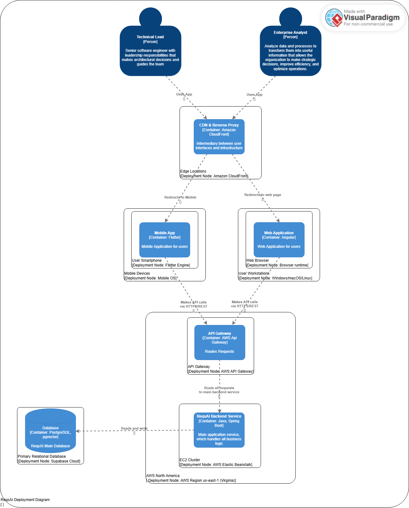

**Nodos de Despliegue y Distribución de Componentes**

La infraestructura de despliegue se divide en los entornos de cliente, la infraestructura de procesamiento en AWS, y la persistencia de datos en una nube externa especializada.

1.  **Entorno del Cliente (Client-Side):**
    *   **Dispositivos físicos (iOS/Android).** Dentro opera el *Flutter Engine*, entorno encargado de ejecutar la aplicación mobile.
    *   **Computadoras de los usuarios.** Utilizan un navegador web como nodo para renderizar la aplicación web.

2.  **Entorno de Nube - Procesamiento (Server-Side - AWS):**
    La lógica de negocio se aloja en AWS North America, específicamente en us-east-1 (Virginia), elegida por su alta disponibilidad y optimización de costos.
    
    *   **AWS API Gateway:** Actúa como el punto de entrada público único, completamente gestionado. Recibe las llamadas HTTPS/REST de los clientes y enruta las peticiones de manera segura hacia el backend.
    *   **AWS Elastic Beanstalk:** Es el entorno PaaS (Platform as a Service) encargado de alojar el **ReqsAI Backend Service [Container: Java, Spring Boot]**. Elastic Beanstalk abstrae la complejidad de la infraestructura, aprovisionando servidores EC2 subyacentes, auto-escalado y monitoreo, permitiendo al equipo enfocarse únicamente en el código del runtime de Java.

3.  **Entorno de Nube - Persistencia (Database as a Service):**
    *   **Base de datos Relacional Principal:** Se delegó el almacenamiento de datos a Supabase, una plataforma BaaS (Backend as a Service). Esta decisión arquitectónica permite aprovechar una base de datos robusta, gestionada y con soporte nativo para *embeddings* vectoriales (esenciales para las funcionalidades de IA), reduciendo drásticamente la carga operativa y los costos iniciales en comparación con mantener instancias tradicionales de bases de datos.

**Comunicación e Interacción de Nodos**

*   Las aplicaciones (Mobile y Web) se comunican vía internet mediante **HTTPS/REST** con el **AWS API Gateway**.
*   El API Gateway enruta el tráfico internamente hacia el entorno de **AWS Elastic Beanstalk**, donde reside la lógica del sistema.
*   El backend de Spring Boot se conecta de manera externa y segura hacia el clúster gestionado en **Supabase Cloud** para realizar operaciones de lectura y escritura (*Reads and write*) de la información del dominio.

# Capítulo V: Tactical-Level Software Design

## 5.X.	Bounded Context: <Bounded Context Name>

### 5.X.1.	Domain Layer

### 5.X.2.	Interface Layer

### 5.X.3.	Application Layer

### 5.X.4.	Infrastructure Layer

### 5.X.6.	Bounded Context Software Architecture Component Level Diagrams

### 5.X.7.	Bounded Context Software Architecture Code Level Diagrams

#### 5.X.7.1.	Bounded Context Domain Layer Class Diagrams

#### 5.X.7.2.	Bounded Context Database Design Diagram

# Capítulo VI: Solution UX Design

## 6.1.	Style Guidelines

### 6.1.1.	General Style Guidelines

### 6.1.2.	Web, Mobile & Devices Style Guidelines

## 6.2.	Information Architecture

### 6.2.2.	Labeling Systems

### 6.2.3.	Searching Systems

### 6.2.4.	SEO Tags and Meta Tags

### 6.2.5.	Navigation Systems

## 6.3.	Landing Page UI Design

### 6.3.1.	Landing Page Wireframe

### 6.3.2.	Landing Page Mock-up

## 6.4.	Applications UX/UI Design

### 6.4.1.	Applications Wireframes

### 6.4.2.	Applications Wireflow Diagrams

### 6.4.2.	Applications Mock-ups

### 6.4.3.	Applications User Flow Diagrams

## 6.5.	Applications Prototyping

# Capítulo VII: Product Implementation, Validation & Deployment

## 7.1.	Software Configuration Management

### 7.1.1.	Software Development Environment Configuration

### 7.1.2.	Source Code Management

### 7.1.3.	Source Code Style Guide & Conventions

### 7.1.4.	Software Deployment Configuration

## 7.2.	Solution Implementation

### 7.2.X.	Sprint n

#### 7.2.X.1.	Sprint Planning n

#### 7.2.X.2.	Sprint Backlog n

#### 7.2.X.3.	Development Evidence for Sprint Review

#### 7.2.X.4.	Testing Suite Evidence for Sprint Review

#### 7.2.X.5.	Execution Evidence for Sprint Review

#### 7.2.X.6.	Services Documentation Evidence for Sprint Review

#### 7.2.X.7.	Software Deployment Evidence for Sprint Review

#### 7.2.X.8.	Team Collaboration Insights during Sprint

## 7.3.	Validation Interviews

### 7.3.1.	Diseño de Entrevistas

### 7.3.2.	Registro de Entrevistas

### 7.3.3.	Evaluaciones según heurísticas

## 7.4.	Video About-the-Product

# Conclusiones

El equipo concluye que el problema abordado es real, recurrente y de alto impacto en el ciclo de vida del software: la ambigüedad en el levantamiento de requisitos y la sobrecarga de post-procesamiento generan retrabajo, retrasos y riesgo de construir funcionalidades incorrectas. La evidencia obtenida en entrevistas confirma un patrón consistente en ambos segmentos objetivo (Líder Técnico de Startup y Analista de Sistemas/Producto): transformar conversaciones en requisitos claros, trazables y accionables sigue siendo el principal cuello de botella.

Sobre esta base, Reqs-AI se consolida como una propuesta de valor pertinente al combinar asistencia en tiempo real, generación estructurada de historias de usuario y criterios de aceptación, y mecanismos de integración con herramientas de gestión del backlog. El enfoque del producto no reemplaza el criterio profesional del analista o líder técnico, sino que lo potencia para reducir omisiones, acelerar la claridad funcional y mejorar la calidad de entrada hacia desarrollo y QA.

Asimismo, el trabajo desarrollado en el informe demuestra coherencia metodológica entre descubrimiento, análisis y diseño de solución. Los artefactos de Lean UX, entrevistas, need finding, user stories, backlog e impact mapping se enlazan con decisiones arquitectónicas estratégicas (DDD, EventStorming, Bounded Contexts y lineamientos de seguridad multitenancy con RLS), aportando trazabilidad desde la necesidad del usuario hasta la estructura técnica propuesta.

Respecto a las hipótesis planteadas, el equipo considera que cuentan con validación inicial de problema y de deseabilidad, debido a la convergencia de hallazgos cualitativos y cuantitativos en las entrevistas. Sin embargo, su validación de desempeño y negocio permanece parcial, ya que métricas objetivo como reducción de reuniones de aclaración, tiempo de edición manual por sesión, retención de uso y sincronización efectiva al backlog deben medirse con el producto en operación real.

La principal limitación actual del proyecto es que aún no se presenta evidencia completa de implementación, pruebas de campo y resultados longitudinales de adopción. En consecuencia, aunque la arquitectura y el diseño funcional están sólidamente fundamentados, todavía es necesario contrastar el comportamiento del sistema en escenarios productivos con usuarios reales y condiciones de carga, seguridad y dependencia de servicios externos de IA.

Como siguientes pasos, se recomienda priorizar un MVP enfocado en el flujo crítico end-to-end (captura de reunión, síntesis guiada, generación de historias con criterios de aceptación y exportación a backlog), ejecutar pilotos controlados en startups y entornos enterprise, y definir un tablero de métricas para validar hipótesis de valor, eficiencia y confianza. Con ello, Reqs-AI podrá transitar de una solución bien diseñada en el plano estratégico a una plataforma validada en impacto operativo y escalabilidad de negocio.

# Bibliografía

>Pulse of the Profession (2018) Success in Disruptiive Times. Project Management Institute. Recuperado el 15 de Abril de 2025, de https://www.pmi.org/learning/thought-leadership/pulse/pulse-of-the-profession-2018

>Jhonson J (2020) CHAOS Report: Beyond Infinity. Standish Group. Recuperado el 15 de Abril de 2025, de https://www.standishgroup.com/products/copy-of-chaos-report-beyond-infinity-digital-version

# Anexos

1. Relative Cost of Fixing Defects (IBM System Science Institute)   
