<body>
    <div style="text-align: center; font-weight: bolder">
        <p>Universidad Peruana de Ciencias Aplicadas - Ingeniería de Software - 8 Ciclo</p>
        
        <p>1ASI0732 - Arquitectura de Software Emergentes</p>
        <p>Sección - 11821</p>
        <p>Docente: Christian Luis De Los Rios Fernández</p>   
        <p>Informe de Trabajo Final<p>
        <p>Startup: Kntro-Soft</p>
        <p>Producto: Reqs-AI</p>
    </div>
    <div style="text-align: center; display: flex; flex-direction: column; align-items: center">
        <h3 style="font-weight: bolder">Integrantes del equipo:</h3>
        <table style="width: fit-content">
            <tr>
                <th style="text-align:start;">Estudiante</th>
                <th style="text-align:center;">Código</th>
            </tr>
            <tr>
                <td style="text-align:start;">Gutiérrez Soto, Jhosepmyr Orlando</td>
                <td>202317638</td>
            </tr>
            <tr>
                <td style="text-align:start;">Hernández Tuiro, Eric Ernesto</td>
                <td>20221C857</td>
            </tr>
            <tr>
                <td style="text-align:start;">Ramirez Mestanza, Salim Ignacio</td>
                <td>20201E843</td>
            </tr>
            <tr>
                <td style="text-align:start;">Varela Bustinza, Marcelo Alessandro</td>
                <td>202319668</td>
            <tr>
              <td style="text-align:start;">Sulca Gonzales, Paul Fernando</td>
              <td>20221C486</td>
            </tr>
        </table>
    </div>
    <p style="text-align: center">Abril 2026</p>
</body>

<div style="page-break-before: always"></div>

# Registro de Versiones del Informe

| Versión | Fecha      | Autor                                         | Descripción de modificación                                                                                                                                                                                                                                                                                                                                                                                                                                                                                                                  |
|---------|------------|-----------------------------------------------|----------------------------------------------------------------------------------------------------------------------------------------------------------------------------------------------------------------------------------------------------------------------------------------------------------------------------------------------------------------------------------------------------------------------------------------------------------------------------------------------------------------------------------------------|
| 1.0     | 14/04/2026 | Eric                                          | Creación de la estructura base del informe, portada, logos y descripción inicial del Startup.                                                                                                                                                                                                                                                                                                                                                                                                                                                |
| 1.1     | 17/04/2026 | Eric                                          | Adición del Background, problemáticas, proceso de Lean UX, Target Segments y perfiles del equipo (Team Profiles).                                                                                                                                                                                                                                                                                                                                                                                                                            |
| 1.2     | 22/04/2026 | Marcelo, Salim Ramirez                        | Inclusión del análisis de competidores, diseño preliminar de preguntas para entrevistas y configuración de exclusiones del repositorio (.gitignore).                                                                                                                                                                                                                                                                                                                                                                                         |
| 1.3     | 23/04/2026 | Gutierrez Soto Jhosepmyr, Eric                | Estructuración de Epics, User Stories (formato BDD y criterios de aceptación), Product Backlog priorizado y definición de atributos de calidad (Quality Attribute Scenarios).                                                                                                                                                                                                                                                                                                                                                                |
| 1.4     | 24/04/2026 | Marcelo, Gutierrez Soto Jhosepmyr             | Redacción de estrategias y tácticas, actualización de la sección de competidores, e iteración técnica de historias de usuario (criterios INVEST).                                                                                                                                                                                                                                                                                                                                                                                            |
| 1.5     | 25/04/2026 | Marcelo                                       | Actualización de la información general del proyecto e informe.                                                                                                                                                                                                                                                                                                                                                                                                                                                                              |
| 1.6     | 26/04/2026 | Paul, Gutierrez Soto Jhosepmyr                | Incorporación de la sección de User Personas (Empathy Mapping, User Journey, User Task Matrix) y modelado de escenarios As-Is / To-Be.                                                                                                                                                                                                                                                                                                                                                                                                       |
| 1.7     | 26/04/2026 | Eric                                          | Desarrollo de la sección de Domain-Driven Design (Eventstorming, Context Discovery, Context Mapping, Bounded Context Canvases).                                                                                                                                                                                                                                                                                                                                                                                                              |
| 1.8     | 26/04/2026 | Marcelo, Salim Ramirez, Paul                  | Incorporación de análisis y hallazgos de las entrevistas para roles técnicos y funcionales. Adición de sección de Impact Mapping y Student Outcomes.                                                                                                                                                                                                                                                                                                                                                                                         |
| 2.0     | 26/04/2026 | Eric, Gutierrez Soto Jhosepmyr                | Inclusión de los diagramas de Arquitectura de Software C4 (System Landscape, System Context, Container y Deployment). Actualización final del Backlog en Jira y sección de conclusiones.                                                                                                                                                                                                                                                                                                                                                     |
| 2.1     | 09/05/2026 | Gutierrez Soto Jhosepmyr                      | Refinamientos por feedback TP1: ampliación uniforme de los 5 patrones de Context Mapping (ACL hacia Jira, ACL hacia LLM/STT, Customer/Supplier Discovery↔Workspace, Conformist Workspace↔Billing, OHS+PL Discovery↔Gateway) con contratos detallados, escenarios de evolución y tradeoffs explícitos; reescritura del Container Diagram con declaración explícita Monolito Modular vs. Microservicios, mapeo Bounded Context → Módulo Maven y reglas de dependencia automatizadas con ArchUnit, en tono orientado a presentación al cliente. |
| 2.2     | 13/05/2026 | Marcelo                                       | Elaboración de wireframes, wireflows y mock-ups iniciales para la aplicación web.                                                                                                                                                                                                                                                                                                                                                                                                                                                            |
| 2.3     | 14/05/2026 | Gutierrez Soto Jhosepmyr, Marcelo, Eric       | Expansión del inventario de funcionalidades, refinamiento de User Stories y Backlog, inclusión de directrices de estilo de diseño (UI/UX) y corrección de formato.                                                                                                                                                                                                                                                                                                                                                                           |
| 2.4     | 15/05/2026 | Gutierrez Soto Jhosepmyr, Eric, Paul          | Desarrollo detallado del diseño de software a nivel táctico (Capítulo V): estructuración de capas de dominio, infraestructura e interfaz. Actualización de diagramas C4 y modelado detallado para los Bounded Contexts (IAM, Billing, Workspace, Discovery, Gateway).                                                                                                                                                                                                                                                                        |
| 2.5     | 16/05/2026 | Salim Ramirez, Eric, Gutierrez Soto Jhosepmyr | Diseño UX/UI completo para la aplicación móvil y Landing Page (wireframes, wireflows y prototipos interactivos de alta fidelidad). Refactorización de justificaciones de restricciones e impacto arquitectónico, soporte al cliente en diagrama C4 y actualización final de Student Outcomes para TP.                                                                                                                                                                                                                                        |

<div style="page-break-before: always"></div>

# Project Report Collaboration Insights

En esta sección se documenta la colaboración del equipo en la elaboración del informe, mostrando evidencias gráficas de la actividad en GitHub y su coherencia con el registro de versiones.

* URL del repositorio del Project Report en la organización de GitHub del equipo:
* [https://github.com/Kntro-Soft/ReqsAI-Report](https://github.com/Kntro-Soft/ReqsAI-Report)

TB1:

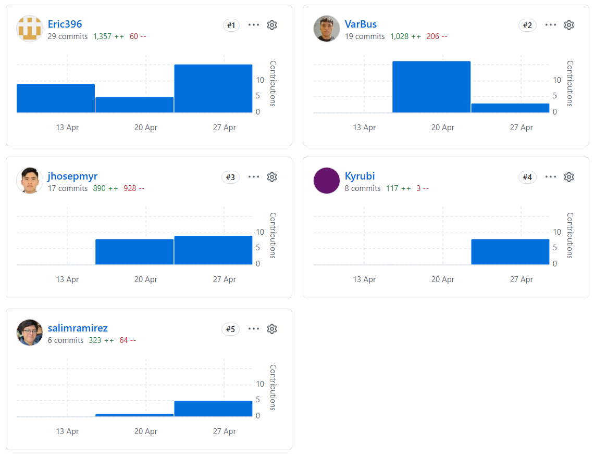

<div style="page-break-before: always"></div>

# Contenido

<!-- TOC -->
* [Registro de Versiones del Informe](#registro-de-versiones-del-informe)
* [Project Report Collaboration Insights](#project-report-collaboration-insights)
* [Contenido](#contenido)
* [Student Outcome](#student-outcome)
* [Capítulo I: Introducción](#capítulo-i-introducción)
  * [1.1. Startup Profile](#11-startup-profile)
    * [1.1.1. Descripción de la Startup](#111-descripción-de-la-startup)
    * [1.1.2. Perfiles de integrantes del equipo](#112-perfiles-de-integrantes-del-equipo)
  * [1.2. Solution Profile](#12-solution-profile)
    * [1.2.1. Antecedentes y problemática](#121-antecedentes-y-problemática)
    * [1.2.2. Lean UX Process](#122-lean-ux-process)
      * [1.2.2.1. Lean UX Problem Statements](#1221-lean-ux-problem-statements)
      * [1.2.2.2. Lean UX Assumptions](#1222-lean-ux-assumptions)
      * [1.2.2.3. Lean UX Hypothesis Statements](#1223-lean-ux-hypothesis-statements)
      * [1.2.2.4. Lean UX Canvas](#1224-lean-ux-canvas)
  * [1.3. Segmentos objetivos](#13-segmentos-objetivos)
* [Capítulo II: Requirements Elicitation & Analysis](#capítulo-ii-requirements-elicitation--analysis)
  * [2.1. Competidores](#21-competidores)
    * [2.1.1. Análisis competitivo](#211-análisis-competitivo)
    * [2.1.2. Estrategias y tácticas frente a competidores](#212-estrategias-y-tácticas-frente-a-competidores)
  * [2.2. Entrevistas](#22-entrevistas)
    * [2.2.1. Diseño de entrevistas](#221-diseño-de-entrevistas)
    * [2.2.2. Registro de entrevistas](#222-registro-de-entrevistas)
    * [2.2.3. Análisis de entrevistas](#223-análisis-de-entrevistas)
  * [2.3. Need finding](#23-need-finding)
    * [2.3.1. User personas](#231-user-personas)
    * [2.3.2. User Task Matrix](#232-user-task-matrix)
    * [2.3.3. User Journey Mapping](#233-user-journey-mapping)
    * [2.3.4. Empathy Mapping](#234-empathy-mapping)
    * [2.3.5. As-is Scenario Mapping](#235-as-is-scenario-mapping)
  * [2.4. Ubiquitous Language](#24-ubiquitous-language)
* [Capítulo III: Requirements Specification](#capítulo-iii-requirements-specification)
  * [3.1. To-Be Scenario Mapping](#31-to-be-scenario-mapping)
  * [3.2. User Stories](#32-user-stories)
  * [3.3. Product Backlog](#33-product-backlog)
  * [3.4. Impact Mapping](#34-impact-mapping)
* [Capítulo IV: Strategic-Level Product Design](#capítulo-iv-strategic-level-product-design)
  * [4.1. Strategic-Level Attribute-Driven Design](#41-strategic-level-attribute-driven-design)
    * [4.1.1. Design Purpose](#411-design-purpose)
    * [4.1.2. Attribute-Driven Design Inputs](#412-attribute-driven-design-inputs)
      * [4.1.2.1. Primary Functionality (Primary User Stories)](#4121-primary-functionality-primary-user-stories)
      * [4.1.2.2. Quality attribute Scenarios](#4122-quality-attribute-scenarios)
      * [4.1.2.3. Constraints](#4123-constraints)
    * [4.1.3. Architectural Drivers Backlog](#413-architectural-drivers-backlog)
    * [4.1.4. Architectural Design Decisions](#414-architectural-design-decisions)
    * [4.1.5. Quality Attribute Scenario Refinements](#415-quality-attribute-scenario-refinements)
  * [4.2. Strategic-Level Domain-Driven Design](#42-strategic-level-domain-driven-design)
    * [4.2.1. EventStorming](#421-eventstorming)
    * [4.2.2. Candidate Context Discovery](#422-candidate-context-discovery)
    * [4.2.3. Domain Message Flows Modeling](#423-domain-message-flows-modeling)
    * [4.2.4. Bounded Context Canvases](#424-bounded-context-canvases)
    * [4.2.5. Context Mapping](#425-context-mapping)
  * [4.3. Software Architecture](#43-software-architecture)
    * [4.3.1. Software Architecture System Landscape Diagram](#431-software-architecture-system-landscape-diagram)
    * [4.3.2. Software Architecture Context Level Diagrams](#432-software-architecture-context-level-diagrams)
    * [4.3.3. Software Architecture Container Level Diagrams](#433-software-architecture-container-level-diagrams)
    * [4.3.4. Software Architecture Deployment Diagrams](#434-software-architecture-deployment-diagrams)
* [Capítulo V: Tactical-Level Software Design](#capítulo-v-tactical-level-software-design)
  * [5.1. Bounded Context: IAM](#51-bounded-context-iam)
    * [5.1.1. Domain Layer](#511-domain-layer)
    * [5.1.2. Interface Layer](#512-interface-layer)
    * [5.1.3. Application Layer](#513-application-layer)
    * [5.1.4. Infrastructure Layer](#514-infrastructure-layer)
    * [5.1.6. Bounded Context Software Architecture Component Level Diagrams](#516-bounded-context-software-architecture-component-level-diagrams)
    * [5.1.7. Bounded Context Software Architecture Code Level Diagrams](#517-bounded-context-software-architecture-code-level-diagrams)
      * [5.1.7.1. Bounded Context Domain Layer Class Diagrams](#5171-bounded-context-domain-layer-class-diagrams)
      * [5.1.7.2. Bounded Context Database Design Diagram](#5172-bounded-context-database-design-diagram)
  * [5.2. Bounded Context: Billing and Subscriptions](#52-bounded-context-billing-and-subscriptions)
    * [5.2.1. Domain Layer](#521-domain-layer)
    * [5.2.2. Interface Layer](#522-interface-layer)
    * [5.2.3. Application Layer](#523-application-layer)
    * [5.2.4. Infrastructure Layer](#524-infrastructure-layer)
    * [5.2.6. Bounded Context Software Architecture Component Level Diagrams](#526-bounded-context-software-architecture-component-level-diagrams)
    * [5.2.7. Bounded Context Software Architecture Code Level Diagrams](#527-bounded-context-software-architecture-code-level-diagrams)
      * [5.2.7.1. Bounded Context Domain Layer Class Diagrams](#5271-bounded-context-domain-layer-class-diagrams)
      * [5.2.7.2. Bounded Context Database Design Diagram](#5272-bounded-context-database-design-diagram)
  * [5.3. Bounded Context: Workspace Management](#53-bounded-context-workspace-management)
    * [5.3.1. Domain Layer](#531-domain-layer)
    * [5.3.2. Interface Layer](#532-interface-layer)
    * [5.3.3. Application Layer](#533-application-layer)
    * [5.3.4. Infrastructure Layer](#534-infrastructure-layer)
    * [5.3.6. Bounded Context Software Architecture Component Level Diagrams](#536-bounded-context-software-architecture-component-level-diagrams)
    * [5.3.7. Bounded Context Software Architecture Code Level Diagrams](#537-bounded-context-software-architecture-code-level-diagrams)
      * [5.3.7.1. Bounded Context Domain Layer Class Diagrams](#5371-bounded-context-domain-layer-class-diagrams)
      * [5.3.7.2. Bounded Context Database Design Diagram](#5372-bounded-context-database-design-diagram)
  * [5.4. Bounded Context: Requirement Discovery](#54-bounded-context-requirement-discovery)
    * [5.4.1. Domain Layer](#541-domain-layer)
    * [5.4.2. Interface Layer](#542-interface-layer)
    * [5.4.3. Application Layer](#543-application-layer)
    * [5.4.4. Infrastructure Layer](#544-infrastructure-layer)
    * [5.4.6. Bounded Context Software Architecture Component Level Diagrams](#546-bounded-context-software-architecture-component-level-diagrams)
    * [5.4.7. Bounded Context Software Architecture Code Level Diagrams](#547-bounded-context-software-architecture-code-level-diagrams)
      * [5.4.7.1. Bounded Context Domain Layer Class Diagrams](#5471-bounded-context-domain-layer-class-diagrams)
      * [5.4.7.2. Bounded Context Database Design Diagram](#5472-bounded-context-database-design-diagram)
  * [5.5. Bounded Context: Integration Gateway](#55-bounded-context-integration-gateway)
    * [5.5.1. Domain Layer](#551-domain-layer)
    * [5.5.2. Interface Layer](#552-interface-layer)
    * [5.5.3. Application Layer](#553-application-layer)
    * [5.5.4. Infrastructure Layer](#554-infrastructure-layer)
    * [5.5.6. Bounded Context Software Architecture Component Level Diagrams](#556-bounded-context-software-architecture-component-level-diagrams)
    * [5.5.7. Bounded Context Software Architecture Code Level Diagrams](#557-bounded-context-software-architecture-code-level-diagrams)
      * [5.5.7.1. Bounded Context Domain Layer Class Diagrams](#5571-bounded-context-domain-layer-class-diagrams)
      * [5.5.7.2. Bounded Context Database Design Diagram](#5572-bounded-context-database-design-diagram)
* [Capítulo VI: Solution UX Design](#capítulo-vi-solution-ux-design)
  * [6.1. Style Guidelines](#61-style-guidelines)
    * [6.1.1. General Style Guidelines](#611-general-style-guidelines)
    * [6.1.2. Web, Mobile & Devices Style Guidelines](#612-web-mobile--devices-style-guidelines)
  * [6.2. Information Architecture](#62-information-architecture)
    * [6.2.2. Labeling Systems](#622-labeling-systems)
    * [6.2.3. Searching Systems](#623-searching-systems)
    * [6.2.4. SEO Tags and Meta Tags](#624-seo-tags-and-meta-tags)
    * [6.2.5. Navigation Systems](#625-navigation-systems)
  * [6.3. Landing Page UI Design](#63-landing-page-ui-design)
    * [6.3.1. Landing Page Wireframe](#631-landing-page-wireframe)
    * [6.3.2. Landing Page Mock-up](#632-landing-page-mock-up)
  * [6.4. Applications UX/UI Design](#64-applications-uxui-design)
    * [6.4.1. Applications Wireframes](#641-applications-wireframes)
    * [6.4.2. Applications Wireflow Diagrams](#642-applications-wireflow-diagrams)
    * [6.4.2. Applications Mock-ups](#642-applications-mock-ups)
    * [6.4.3. Applications User Flow Diagrams](#643-applications-user-flow-diagrams)
  * [6.5. Applications Prototyping](#65-applications-prototyping)
* [Capítulo VII: Product Implementation, Validation & Deployment](#capítulo-vii-product-implementation-validation--deployment)
  * [7.1. Software Configuration Management](#71-software-configuration-management)
    * [7.1.1. Software Development Environment Configuration](#711-software-development-environment-configuration)
    * [7.1.2. Source Code Management](#712-source-code-management)
    * [7.1.3. Source Code Style Guide & Conventions](#713-source-code-style-guide--conventions)
    * [7.1.4. Software Deployment Configuration](#714-software-deployment-configuration)
  * [7.2. Solution Implementation](#72-solution-implementation)
    * [7.2.X. Sprint n](#72x-sprint-n)
      * [7.2.X.1. Sprint Planning n](#72x1-sprint-planning-n)
      * [7.2.X.2. Sprint Backlog n](#72x2-sprint-backlog-n)
      * [7.2.X.3. Development Evidence for Sprint Review](#72x3-development-evidence-for-sprint-review)
      * [7.2.X.4. Testing Suite Evidence for Sprint Review](#72x4-testing-suite-evidence-for-sprint-review)
      * [7.2.X.5. Execution Evidence for Sprint Review](#72x5-execution-evidence-for-sprint-review)
      * [7.2.X.6. Services Documentation Evidence for Sprint Review](#72x6-services-documentation-evidence-for-sprint-review)
      * [7.2.X.7. Software Deployment Evidence for Sprint Review](#72x7-software-deployment-evidence-for-sprint-review)
      * [7.2.X.8. Team Collaboration Insights during Sprint](#72x8-team-collaboration-insights-during-sprint)
  * [7.3. Validation Interviews](#73-validation-interviews)
    * [7.3.1. Diseño de Entrevistas](#731-diseño-de-entrevistas)
    * [7.3.2. Registro de Entrevistas](#732-registro-de-entrevistas)
    * [7.3.3. Evaluaciones según heurísticas](#733-evaluaciones-según-heurísticas)
  * [7.4. Video About-the-Product](#74-video-about-the-product)
* [Conclusiones](#conclusiones)
* [Bibliografía](#bibliografía)
* [Anexos](#anexos)
<!-- TOC -->

<div style="page-break-before: always"></div>

# Student Outcome

El curso contribuye al cumplimiento del Student Outcome ABET:

****ABET - EAC - Student Outcome 3****

**Criterio:** Capacidad de comunicarse efectivamente con un rango de audiencias.

En el siguiente cuadro se describen las acciones realizadas y los enunciados de conclusiones por parte del grupo, los cuales permiten sustentar el haber alcanzado el logro del ABET – EAC - Student Outcome 3.

| **Criterio específico**                                                                                                                                                                   | **Acciones realizadas**                                                                                                                                                                                                                                                                                                                                                                                                                                                                                                                                                                                                                                                                                                                                                                                                                                                                                                                                                                                                                                                                                                                                                                                                                                                                                                                                                                                                                                                                                                                                                                                                                                                                                                                                                                                                                                                                                                                                                                                                                                                                                                                                                                                                                                                                                                                                                                                                                                                                                                                                                                                                                                                                                                                                                                                                                                                                                                                                                                                                                                                                                                                                                                                                                                                                                                                                                                                                                                                                                                                                                                                                                                                                                                                                                                                                                                                                                                                                                                                                                                                                                                                                                                                                                                                    | **Conclusiones**                                                                                                                                                                                                                                                                                                                                                                                                                                |
|-------------------------------------------------------------------------------------------------------------------------------------------------------------------------------------------|----------------------------------------------------------------------------------------------------------------------------------------------------------------------------------------------------------------------------------------------------------------------------------------------------------------------------------------------------------------------------------------------------------------------------------------------------------------------------------------------------------------------------------------------------------------------------------------------------------------------------------------------------------------------------------------------------------------------------------------------------------------------------------------------------------------------------------------------------------------------------------------------------------------------------------------------------------------------------------------------------------------------------------------------------------------------------------------------------------------------------------------------------------------------------------------------------------------------------------------------------------------------------------------------------------------------------------------------------------------------------------------------------------------------------------------------------------------------------------------------------------------------------------------------------------------------------------------------------------------------------------------------------------------------------------------------------------------------------------------------------------------------------------------------------------------------------------------------------------------------------------------------------------------------------------------------------------------------------------------------------------------------------------------------------------------------------------------------------------------------------------------------------------------------------------------------------------------------------------------------------------------------------------------------------------------------------------------------------------------------------------------------------------------------------------------------------------------------------------------------------------------------------------------------------------------------------------------------------------------------------------------------------------------------------------------------------------------------------------------------------------------------------------------------------------------------------------------------------------------------------------------------------------------------------------------------------------------------------------------------------------------------------------------------------------------------------------------------------------------------------------------------------------------------------------------------------------------------------------------------------------------------------------------------------------------------------------------------------------------------------------------------------------------------------------------------------------------------------------------------------------------------------------------------------------------------------------------------------------------------------------------------------------------------------------------------------------------------------------------------------------------------------------------------------------------------------------------------------------------------------------------------------------------------------------------------------------------------------------------------------------------------------------------------------------------------------------------------------------------------------------------------------------------------------------------------------------------------------------------------------------------------------|-------------------------------------------------------------------------------------------------------------------------------------------------------------------------------------------------------------------------------------------------------------------------------------------------------------------------------------------------------------------------------------------------------------------------------------------------|
| **Comunica oralmente sus ideas y/o resultados con objetividad a público de diferentes especialidades y niveles jerárquicos, en el marco del desarrollo de un proyecto en ingeniería.**    | **TB1**<br>**Gutiérrez Soto, Jhosepmyr Orlando – 202317638**<br>Trabajé comunicando oralmente los aspectos generales del proyecto relacionados con el Capítulo I y parte del Capítulo IV. Expliqué la descripción de la startup, la propuesta de solución y los fundamentos estratégicos del producto, procurando presentar las ideas de manera clara, ordenada y comprensible para una audiencia académica.<br><br>**Hernández Tuiro, Eric Ernesto – 20221C857**<br>Trabajé comunicando oralmente los contenidos vinculados al Capítulo I y Capítulo IV. Presenté ideas relacionadas con el perfil de la solución, el enfoque estratégico del producto y las decisiones generales de diseño, utilizando un lenguaje objetivo y adecuado para explicar la relación entre la problemática identificada y la solución propuesta.<br><br>**Ramirez Mestanza, Salim Ignacio – 20201E843**<br>Trabajé comunicando oralmente los avances desarrollados en el Capítulo II, principalmente los resultados del análisis de requerimientos, entrevistas, competidores y hallazgos del proceso de need finding. Mi participación permitió explicar cómo se identificaron necesidades relevantes para orientar el desarrollo del producto.<br><br>**Varela Bustinza, Marcelo Alessandro – 202319668**<br>Trabajé comunicando oralmente los resultados correspondientes al Capítulo II, especialmente el análisis competitivo, las estrategias frente a competidores, el diseño y análisis de entrevistas, así como los principales hallazgos obtenidos sobre los usuarios. Busqué explicar la información de manera objetiva, conectando los resultados con la definición de requerimientos del proyecto.<br><br>**Sulca Gonzales, Paul Fernando – 20221C486**<br>Trabajé comunicando oralmente los contenidos del Capítulo III, relacionados con la especificación de requerimientos, user stories, product backlog e impact mapping. Expliqué cómo los hallazgos obtenidos en etapas anteriores se transformaron en requisitos y elementos priorizados para el desarrollo de la solución.<br><br>**TP**<br>**Gutiérrez Soto, Jhosepmyr Orlando – 202317638**<br>Trabajé comunicando oralmente mis ideas con objetividad al presentar la arquitectura y diseño de cada bounded context en el Capítulo V. Adapté mi lenguaje para que perfiles tanto técnicos (desarrolladores) como de negocio (stakeholders) comprendieran cómo los componentes tácticos resuelven los problemas del proyecto de ingeniería.<br><br>**Hernández Tuiro, Eric Ernesto – 20221C857**<br>Trabajé comunicando oralmente los resultados de la refactorización aplicada al Event Storming y sustenté los diagramas del Capítulo V. Expuse estas ideas con objetividad, asegurándome de que las decisiones de diseño arquitectónico fueran claras para una audiencia de diferentes niveles jerárquicos y especialidades.<br><br>**Ramirez Mestanza, Salim Ignacio – 20201E843**<br>Trabajé comunicando oralmente las especificaciones de la landing page y el diseño y estilos de la versión mobile, correspondientes al Capítulo VI. Presenté mis ideas de forma objetiva, demostrando cómo las decisiones de interfaz de usuario se alinean con los requerimientos técnicos y de ingeniería.<br><br>**Varela Bustinza, Marcelo Alessandro – 202319668**<br>Comuniqué oralmente los resultados del diseño UX/UI de la aplicación web de Reqs-AI, explicando el flujo completo desde la autenticación y creación del workspace hasta la gestión de proyectos, sesiones de descubrimiento, revisión de historias de usuario, integración con Jira, facturación y configuración del equipo. Además, sustenté la relación entre wireframes, wireflows y mock-ups, destacando cómo cada pantalla mantiene coherencia visual, navegación consistente y alineación con las funcionalidades principales del producto.<br><br>**Sulca Gonzales, Paul Fernando – 20221C486**<br>Trabajé comunicando oralmente la refactorización de las User Stories y del Product Backlog, además de sustentar partes del Capítulo V. Mantuve objetividad al explicar cómo las historias guían el desarrollo de la ingeniería, asegurando que el público de diferentes especialidades entendiera su impacto en la arquitectura.      | **TB1**<br>Como equipo, se logró comunicar oralmente los avances del proyecto de manera clara, organizada y objetiva. Cada integrante explicó los resultados correspondientes a su participación, conectando los capítulos desarrollados con el propósito general de la solución. Asimismo, la exposición permitió adaptar el lenguaje técnico a una audiencia académica, integrando aspectos de negocio, usuarios, requerimientos y diseño de ingeniería.<br><br>**TP**<br>Como equipo en esta etapa (TP), logramos sustentar oralmente decisiones arquitectónicas complejas y diseños de interfaz. Comunicamos con objetividad cómo el diseño táctico de los Bounded Contexts y las mejoras en UX/UI resuelven las necesidades del negocio. Adaptamos nuestra exposición para que tanto perfiles gerenciales (enfocados en el valor del producto) como técnicos (enfocados en patrones de ingeniería) comprendieran claramente la evolución y escalabilidad del sistema. |
| **Comunica en forma escrita ideas y/o resultados con objetividad a público de diferentes especialidades y niveles jerárquicos, en el marco del desarrollo de un proyecto en ingeniería.** | **TB1**<br>**Gutiérrez Soto, Jhosepmyr Orlando – 202317638**<br>Trabajé comunicando de forma escrita los contenidos relacionados con el Capítulo I y parte del Capítulo IV. Redacté información sobre el perfil de la startup, la propuesta de solución y los elementos estratégicos del diseño del producto, procurando mantener una estructura clara y una redacción adecuada para el contexto académico y de ingeniería.<br><br>**Hernández Tuiro, Eric Ernesto – 20221C857**<br>Trabajé comunicando de forma escrita los apartados vinculados al Capítulo I y Capítulo IV. Mi aporte se centró en organizar y redactar ideas sobre la solución propuesta, su relación con la problemática y los criterios estratégicos del producto, asegurando coherencia entre el enfoque del proyecto y las decisiones de diseño.<br><br>**Ramirez Mestanza, Salim Ignacio – 20201E843**<br>Trabajé comunicando de forma escrita los contenidos del Capítulo II, principalmente en los apartados de análisis de requerimientos, entrevistas, competidores, identificación de necesidades y lenguaje ubicuo. Mi aporte permitió documentar los hallazgos de manera ordenada y orientada a sustentar la definición de requerimientos.<br><br>**Varela Bustinza, Marcelo Alessandro – 202319668**<br>Trabajé comunicando de forma escrita los resultados del Capítulo II, incluyendo el análisis competitivo, estrategias frente a competidores, diseño y análisis de entrevistas, user personas, mapas de empatía y escenarios actuales. Mi trabajo contribuyó a presentar evidencia relevante sobre las necesidades del usuario y su relación con los requerimientos del producto.<br><br>**Sulca Gonzales, Paul Fernando – 20221C486**<br>Trabajé comunicando de forma escrita los contenidos del Capítulo III, enfocados en to-be scenario mapping, user stories, product backlog e impact mapping. Mi aporte permitió transformar los hallazgos del análisis en requisitos claros, priorizados y alineados con los objetivos del producto.<br><br>**TP**<br><br>**Gutiérrez Soto, Jhosepmyr Orlando – 202317638**<br>Trabajé comunicando en forma escrita los resultados del diseño táctico de cada bounded context en el Capítulo V. Redacté la estructura de las capas de dominio, aplicación e infraestructura manteniendo objetividad técnica, utilizando diagramas estándar para que equipos de diferentes especialidades puedan comprender la arquitectura.<br><br>**Hernández Tuiro, Eric Ernesto – 20221C857**<br>Trabajé comunicando en forma escrita las mejoras y la refactorización aplicadas al Event Storming, documentando objetivamente las decisiones tomadas. Apoyé en la redacción técnica del Capítulo V, asegurando que la documentación sea comprensible y útil tanto para desarrolladores como para evaluadores del proyecto.<br><br>**Ramirez Mestanza, Salim Ignacio – 20201E843**<br>Trabajé comunicando en forma escrita los elementos del Capítulo VI, especificando la landing page y el diseño y estilos de la versión mobile del app. Documenté estas decisiones de UX/UI con objetividad, estructurando la información de manera que sea fácilmente interpretable por equipos de distintas disciplinas.<br><br>**Varela Bustinza, Marcelo Alessandro – 202319668**<br>Comuniqué de forma escrita la documentación del Capítulo VI: Solution UX Design, desarrollando secciones relacionadas con style guidelines, information architecture, wireframes, wireflows y mock-ups de la web application. Redacté subtítulos y descripciones para cada imagen, organicé los recursos visuales con nombres consistentes y expliqué cómo cada pantalla representa una acción o estado funcional dentro del flujo de Reqs-AI. Este trabajo permitió evidenciar la evolución desde la estructura de baja fidelidad hasta la propuesta visual final de la plataforma.<br><br>**Sulca Gonzales, Paul Fernando – 20221C486**<br>Trabajé comunicando en forma escrita la refactorización de las User Stories y la actualización del Product Backlog. Redacté estos artefactos con objetividad técnica para que sirvan de puente claro entre las necesidades del negocio y la implementación en ingeniería, apoyando también en la documentación del Capítulo V. | **TB1**<br>Como equipo, se logró comunicar por escrito las ideas, resultados y decisiones del proyecto de manera estructurada y objetiva. El documento integra información sobre negocio, usuarios, requerimientos y diseño estratégico, manteniendo una secuencia lógica entre los capítulos. Además, la redacción permitió presentar el proyecto de forma comprensible para audiencias con distintos niveles de conocimiento técnico.<br><br>**TP**<br>Para el entregable TP, el equipo demostró la capacidad de documentar formalmente la arquitectura de software (Capítulo V) y el diseño de la experiencia de usuario (Capítulo VI). Se estructuraron los modelos de dominio, diagramas tácticos y wireflows con estricta objetividad técnica. Esta documentación escrita permite que profesionales de diferentes especialidades, desde desarrolladores hasta líderes de proyecto, puedan entender las soluciones de ingeniería propuestas sin ambigüedades.                    |

<div style="page-break-before: always"></div>

# Capítulo I: Introducción

## 1.1. Startup Profile

### 1.1.1. Descripción de la Startup

Kntro-Soft es una startup tecnológica peruana dedicada a la innovación en ingeniería de software mediante el uso de Inteligencia Artificial Generativa y procesamiento de lenguaje natural en tiempo real.
Nuestra misión es potenciar la productividad de los equipos de desarrollo y analistas de sistemas, eliminando la pérdida de información durante el levantamiento de requisitos, asegurando que cada necesidad del cliente se convierta en una historia de usuario precisa y completa.

**Propuesta de Valor**

* Documentación Instantánea: Generación automática de User Stories con criterios de aceptación en formato Gherkin mediante LLM de última generación
* Asistencia de Consulta en Tiempo Real: Recomendaciones de preguntas estratégicas durante las juntas para eludir lagunas de información y contemplar escenarios excepcionales.
* Contexto Inteligente (RAG): Integración con el historial del proyecto para detectar duplicados y asegurar que los nuevos requisitos sean consistentes con la arquitectura existente
* Privacidad Empresarial: Arquitectura multitenancy robusta con Row Level Security, garantizando que los datos y el conocimiento de cada organización permanezcan estrictamente aislados

**Visión**

Convertirnos en la plataforma estándar de gestión de requisitos para empresas de software en Latinoamérica, liderando la transición hacia un desarrollo de software asistido por IA que sea transparente, eficiente y libre de errores de comunicación.

**Valores**

* Precisión Técnica: Compromiso con la entrega de requisitos listos para el desarrollo.
* Agilidad: Reducción drástica del tiempo entre la reunión y el inicio de la codificación.
* Seguridad: Protección absoluta de la propiedad intelectual de nuestros clientes.
* Innovación Adaptativa: Evolución constante de nuestros modelos para entender los dialectos y modismos técnicos de la región.

### 1.1.2. Perfiles de integrantes del equipo

| Foto del participante                                 | Nombres y apellidos               | Código de estudiante | Carrera                | Conocimientos técnicos y habilidades                                                                                                                                                                                                                                            |
|-------------------------------------------------------|-----------------------------------|----------------------|------------------------|---------------------------------------------------------------------------------------------------------------------------------------------------------------------------------------------------------------------------------------------------------------------------------|
|           | Eric Ernesto Hernández Tuiro      | 20221C857            | Ingeniería de Software | Especialista en desarrollo backend con Java/Spring Boot y diseño de arquitecturas de sistemas. Enfocado en tecnologías empresariales y soluciones eficientes.                                                                                                                   |
|         | Marcelo Alejandro Varela Bustinza | 202319668            | Ingeniería de Software | Desarrollador con experiencia en Angular/Spring Boot y Vue.js/ASP.NET, enfocado en arquitecturas monolíticas y desarrollo de aplicaciones.                                                                                                                                      | 
|  | Jhosepmyr Orlando Gutiérrez Soto  | 202317638            | Ingeniería de Software | Especialista en desarrollo full-stack con Java/Spring Boot y frameworks frontend como Angular y Vue.js. Experiencia en microservicios y servicios cloud (AWS, Azure, GCP). Aporta habilidades de liderazgo técnico, toma de decisiones y coordinación de equipos de desarrollo. | 
|                | Paul Fernando Sulca Gonzales      | 20221C486            | Ingeniería de Software | Conocimiento en diseño de software orientado a objetos y modelado UML. Experiencia en implementación de interfaces web adaptativas. Amante de los desafíos de la vida universitaria.                                                                                            |
|            | Salim Ignacio Ramirez Mestanza    | 20201E843            | Ingeniería de Software | Conocimiento en arquitectura de software y control de versiones con Git. Experiencia en documentación técnica y colaboración en equipos ágiles. Desarrollo backend con Java/Spring Boot y Domain-Driven Design.                                                                 |

## 1.2. Solution Profile

### 1.2.1. Antecedentes y problemática

Esta sección analiza la desconexión entre la captura de información y la ejecución en el desarrollo de software. Se utiliza la técnica de las 5W2H para desglosar cómo la gestión deficiente de requisitos impacta la rentabilidad y el éxito de los proyectos de TI, estableciendo la base fáctica que justifica la implementación de Kntro-Soft.

**Análisis mediante la técnica de las 5 W's y 2 H's:**

* WHO - ¿Quién está afectado?: El problema afecta principalmente a los Analistas de Sistemas, Product Owners y Business Analysts, quienes deben alternar entre la escucha activa y la toma de notas. Secundariamente, impacta a los equipos de desarrollo, startups de software, y a las empresas de software en el Perú.

* WHAT - ¿Cuál es el problema?: La pérdida de información crítica durante las reuniones de descubrimiento. A los analistas se les puede dificultar el procesar y documentar simultáneamente la información que brinda el cliente, generando requisitos incompletos y casos de borde ignorados. Esto deriva en una deuda técnica desde la concepción del producto.

* WHERE - ¿Dónde ocurre?: En el entorno de las empresas de servicios de software y startups de desarrollo de software en Perú y Latinoamérica. Se manifiesta tanto en reuniones presenciales como en videollamadas, donde el flujo de información es rápido y desestructurado.

* WHEN - ¿Cuándo sucede?: Ocurre durante la fase de Elicitación de Requisitos. La crisis de documentación se agrava después de la reunion, cuando el analista intenta reconstruir lo conversado, perdiendo varios detalles específicos y dándose cuenta de dudas y preguntas importantes que no resolvió con el cliente durante la reunión.

* WHY - ¿Por qué persiste?: Por la dependencia en métodos manuales. La captura de requisitos sigue siendo un proceso artesanal en una industria automatizada. Según el Project Management Institute (PMI), la comunicación deficiente es la razón principal del fracaso en 1 de cada 3 proyectos de TI.

* HOW - ¿Cómo se manifiesta el problema?: Se evidencia en el retrabajo. Las historias de usuario mal definidas obligan a los desarrolladores a detenerse para pedir aclaraciones o, peor aún, a construir funcionalidades que no cumplen con la expectativa del cliente, generando ciclos de feedback infinitos.

* HOW MUCH - ¿Cuál es la magnitud del impacto?: * Costo de Fallas: El 47% de los proyectos de software fallan o se ven comprometidos debido a una mala gestión de requisitos (Standish Group, 2020). Impacto Económico: Corregir un error de requisitos durante la fase de desarrollo cuesta hasta 10 veces más que hacerlo durante la fase de diseño. Si el error llega a producción, el costo se eleva a 100 veces más (Ver Anexos 1). Desperdicio Financiero: Las organizaciones pierden, en promedio, US$ 97 millones por cada 1,000 millones invertidos debido a un desempeño deficiente de los proyectos (PMI, 2018).

### 1.2.2. Lean UX Process

Esta sección aplica el Proceso Lean UX para estructurar la visión del negocio del proyecto WasteTrack. Se inicia con la formulación del problema, se desglosan las suposiciones fundamentales que sostienen el modelo de negocio y de producto, y finalmente se traducen estas suposiciones en hipótesis comprobables que guiarán el ciclo de desarrollo y validación.

#### 1.2.2.1. Lean UX Problem Statements

El estado actual de la ingeniería de requisitos en el desarrollo de software depende principalmente en la captura pasiva de información a través de grabaciones de video y transcripciones automáticas, las cuales funcionan como una memoria histórica para que el analista de sistemas revise el contenido después de la reunión.

Lo que los servicios y flujos de trabajo existentes no logran abordar es el desafío del razonamiento y la validación en tiempo real. Actualmente, el analista suele descubrir ambigüedades, casos de borde no considerados y vacíos de lógica recién cuando procesa la grabación horas o días después. Esto genera un ciclo ineficiente de reuniones de seguimiento para aclarar dudas que pudieron resolverse en el momento si se hubiera contado con un soporte analítico inmediato.

Nuestro producto, Reqs-AI, abordará esta brecha mediante un motor de inteligencia artificial que procesa el audio en vivo para generar historias de usuario estructuradas mientras la reunión ocurre. Su valor diferencial reside en un asistente de consulta activa que proporciona sugerencias de preguntas críticas al analista en tiempo real, asegurando que toda duda técnica o de negocio sea resuelta mientras el cliente aún está presente.

Nuestro enfoque inicial serán las Startups tecnológicas y empresas de desarrollo de software que operan bajo metodologías ágiles y necesitan una transición inmediata y sin errores desde la fase de descubrimiento hasta el inicio de la codificación.

Sabremos que hemos tenido éxito cuando observemos una reducción del 40% en las reuniones de seguimiento para aclaración de requisitos, una disminución significativa en el tiempo que el analista dedica al postprocesamiento de la información y una tasa de aceptación de historias de usuario superior al 80% en la primera iteración de revisión con el equipo de desarrollo.

#### 1.2.2.2. Lean UX Assumptions

Esta sección presenta las suposiciones fundamentales del proyecto Reqs-AI, estructuradas bajo el marco de Lean UX. Aquí definimos los resultados de negocio esperados, los perfiles de usuario que enfrentan el problema y los beneficios tangibles que estos obtendrán al utilizar nuestra solución.

**Business Outcomes (Resultados de Negocio):**

Utilizamos el framework AARRR (Pirate Metrics) para cuantificar el impacto estratégico de Reqs-AI en el mercado de startups y empresas:
* Acquisition (Adquisición): El 25% de las empresas contactadas se registrarán para una prueba gratuita de 14 días.
* Activation (Activación): El 40% de los usuarios registrados procesará al menos 3 reuniones reales y generará un set de User Stories en su primera semana.
* Retention (Retención): El 60% de las Startups que completen la prueba gratuita optarán por una suscripción mensual activa.
* Revenue (Ingresos): Se proyecta un Ingreso Mensual Recurrente (MRR) promedio de $49 por Startup y contratos anuales de 4,000+ para Empresas.
* Referral (Recomendación): 1 de cada 4 usuarios activos recomendará la herramienta a otros colegas en comunidades de Product Management o Ingeniería.

**Users (Usuarios)**
Hemos identificado dos perfiles clave que enfrentan el reto de transformar la voz del cliente en código, adaptados a la realidad de una Startup y una organización corporativa:

| Usuario                           | Perfil                                                      | Objetivos                                                                                                                              | Obstáculos                                                                                              |
|:----------------------------------|:------------------------------------------------------------|:---------------------------------------------------------------------------------------------------------------------------------------|:--------------------------------------------------------------------------------------------------------|
| **Alex (Tech Leader)**            | 32 años, Desarrollador Senior que lidera el equipo técnico. | Traducir visiones de negocio a especificaciones técnicas, evitar deuda técnica por requisitos ambiguos, agilizar el inicio del sprint. | Alta carga de trabajo técnico, dificultad para documentar mientras lidera la discusión técnica.         |
| **Claudia (Analista Enterprise)** | 35 años, Business Analyst en una corporación.               | Estandarizar requisitos en Gherkin, asegurar que nada quede ambiguo, cumplir con normas de seguridad.                                  | Reuniones largas y densas, dificultad para procesar horas de grabación, burocracia en la documentación. |

**User Outcomes (Resultados de Usuario)**
Estos son los resultados esperados por nuestros usuarios, divididos según el valor que perciben al usar Reqs-AI:

* Startup Lead:
Funcional: Obtener historias de usuario en Gherkin y restricciones técnicas listas para el backlog inmediatamente al finalizar la sesión.
Emocional: Sentir la seguridad de que la arquitectura y los casos críticos están alineados con la expectativa del cliente antes de escribir una sola línea de código
Aspiracional: Ser el facilitador de una cultura de ingeniería de alto rendimiento donde la documentación nunca es un cuello de botella para la innovación.

* Analista Enterprise:
Funcional: Eliminar el trabajo manual de transcribir grabaciones y redactar Gherkin desde cero.
Emocional: Sentir empoderamiento durante la reunión al recibir sugerencias de preguntas que exponen vacíos de lógica del cliente.
Aspiracional: Posicionarse como una analista estratégica que garantiza la precisión del proyecto, reduciendo el retrabajo del equipo.

#### 1.2.2.3. Lean UX Hypothesis Statements

**Test (Alto valor, alto riesgo)**

* Hipótesis 1 (Riesgo de Valor y Comportamiento):
El equipo cree que proporcionar sugerencias automáticas de preguntas sobre casos de borde en tiempo real para el Analista de Sistemas logrará una captura de requisitos exhaustiva durante la primera interacción. Se sabrá que esto es cierto cuando el analista plantee al menos el 60% de las sugerencias generadas por la IA durante la sesión en vivo con el cliente, reduciendo la necesidad de reuniones de aclaración posteriores.

* Hipótesis 2 (Riesgo de Confianza Técnica):
El equipo cree que la generación instantánea de historias de usuario en formato Gherkin utilizando contexto previo (RAG) para el Líder Técnico de una Startup logrará acelerar el ciclo de inicio del desarrollo (discovery-to-delivery). Se sabrá que esto es cierto cuando el tiempo promedio dedicado por el rol a la edición y corrección manual de las historias generadas sea menor a 15 minutos por sesión.

**Ship & Measure (Alto valor, bajo riesgo)**

* Hipótesis 3 (Riesgo de Adopción Funcional):
El equipo cree que la integración de un botón de exportación directa hacia herramientas de gestión para el Líder Técnico de una Startup logrará una mayor retención de uso de la plataforma. Se sabrá que esto es cierto cuando el 80% de las historias de usuario validadas en Reqs-AI sean sincronizadas con el backlog del proyecto en los primeros 10 minutos posteriores al cierre de la reunión.

* Hipótesis 4 (Riesgo de Cumplimiento y Seguridad):
El equipo cree que la implementación de una arquitectura de aislamiento de datos mediante Row Level Security (RLS) para el Analista de Sistemas Enterprise logrará mitigar las preocupaciones de privacidad de la información corporativa. Se sabrá que esto es cierto cuando las organizaciones interesadas completen el proceso de registro y configuración del perfil organizacional tras revisar la documentación de seguridad y multitenancy del sistema.

#### 1.2.2.4. Lean UX Canvas


## 1.3. Segmentos objetivos

**Segmento 1: Líder Técnico de Startup**

**Descripción:**

Este segmento representa al motor técnico y estratégico de empresas tecnológicas en etapa de crecimiento. Son profesionales que cumplen roles híbridos entre la gestión de producto y el desarrollo.
Su principal motivación es la velocidad de entrega y la precisión técnica. Se frustran al perder tiempo valioso en la documentación manual tras reuniones intensas y al descubrir "deuda de requisitos" solo cuando ya están en plena fase de codificación. Buscan una herramienta que les permita pasar de la conversación al código sin fricciones.

**Características Demográficas (Perfil Inferido):**

| Aspecto                  | Detalle                                                                    |
|--------------------------|----------------------------------------------------------------------------|
| Rango de Edad            | 30 - 35 años                                                               |
| Nivel Educativo          | Universitario o Postgrado (Ingeniería de Software, Sistemas o Computación) |
| Entorno Laboral          | Startups, ambientes ágiles, trabajo remoto o híbrido                       |
| Familiaridad Tecnológica | Nativo digital; uso experto de APIs, LLMs, y herramientas como Jira/Notion |

**Segmento 2: Analista de Sistemas Enterprise**

**Descripción:**

Este segmento representa al profesional encargado de la gobernanza de requisitos en grandes corporaciones o Software Factories. Su enfoque principal es la estandarización y la mitigación de riesgos.
Deben asegurar que cada requerimiento del cliente esté perfectamente documentado en formatos rigurosos como Gherkin para su posterior pase a desarrollo y testing (QA). Actualmente, su mayor dolor es la carga operativa de procesar horas de grabaciones para extraer criterios de aceptación, enfrentando el riesgo de malinterpretar la visión del cliente por falta de validación inmediata en la reunión.

**Características Demográficas (Perfil Inferido):**

| Aspecto                  | Detalle                                                                                             |
|--------------------------|-----------------------------------------------------------------------------------------------------|
| Rango de Edad            | 30 - 45 años                                                                                        |
| Nivel Educativo          | Universitario o Postgrado (Gestión de Proyectos, Business Analysis)                                 |
| Entorno Laboral          | Corporativo, grandes departamentos de TI, procesos bajo marcos CMMI o SAFe                          |
| Familiaridad Tecnológica | Alta; manejo de herramientas de modelado y gestión empresarial (Azure DevOps, Enterprise Architect) |

# Capítulo II: Requirements Elicitation & Analysis

## 2.1. Competidores

### 2.1.1. Análisis competitivo

Para este análisis, hemos seleccionado a los competidores más relevantes según el tipo de amenaza que representan para **Reqs-AI**: un competidor directo y especializado (Spinach.io), un competidor sustituto de uso masivo (Otter.ai / Fireflies.ai), y el incumbente o *Status Quo* de la industria (Jira + Atlassian Intelligence).

<table style="border: 1px solid; border-collapse: collapse; width: 100%; text-align: left;">
  <thead>
    <tr>
      <th style="padding: 10px">Aspecto</th>
      <th style="padding: 10px">Reqs-AI (Nuestro Producto)</th>
      <th style="padding: 10px">Spinach.io (Competidor Directo)</th>
      <th style="padding: 10px">Otter.ai / Fireflies (Sustituto)</th>
      <th style="padding: 10px">Jira + Atlassian AI (Incumbente)</th>
    </tr>
  </thead>
  <tbody>
    <tr>
      <td style="padding: 10px"><strong>¿Por qué se analiza?</strong></td>
      <td colspan="4" style="padding: 10px">
        Para identificar brechas de mercado entre los transcriptores genéricos, los asistentes ágiles y las herramientas de ticketing, posicionando a Reqs-AI como el único especialista en <strong>Ingeniería de Requisitos</strong>.
      </td>
    </tr>
    <tr>
      <td style="padding: 10px"><strong>Logo</strong></td>
      <td style="text-align: center; padding: 10px"></td>
      <td style="text-align: center; padding: 10px"></td>
      <td style="text-align: center; padding: 10px"></td>
      <td style="text-align: center; padding: 10px"></td>
    </tr>
    <tr>
      <td style="padding: 10px"><strong>Overview</strong></td>
      <td style="padding: 10px">
        SaaS impulsado por IA especializado en <em>Requirements Elicitation</em>. Captura audio de reuniones, aplica RAG con documentos del proyecto y genera historias de usuario estructuradas (BDD/Gherkin).
      </td>
      <td style="padding: 10px">
        "AI Scrum Master". Se une a las reuniones de Zoom/Meet, toma notas, resume stand-ups y crea tickets básicos en Jira.
      </td>
      <td style="padding: 10px">
        Asistentes de reuniones por IA de propósito general. Transcriben, hacen resúmenes ejecutivos y extraen "Action Items".
      </td>
      <td style="padding: 10px">
        La plataforma líder mundial en gestión ágil. Recientemente, integró IA para ayudar a redactar y mejorar la gramática de los tickets directamente en su interfaz.
      </td>
    </tr>
    <tr>
      <td style="padding: 10px"><strong>Ventaja competitiva</strong></td>
      <td style="padding: 10px">
        <strong>Profundidad Técnica:</strong> No hace resúmenes, hace Ingeniería de Software. Detecta edge cases, sugiere preguntas al cliente en vivo y previene historias duplicadas.
      </td>
      <td style="padding: 10px">
        <strong>Integración nativa:</strong> Se comporta como un bot que entra automáticamente a las videollamadas y se integra con múltiples CRM.
      </td>
      <td style="padding: 10px">
        <strong>Adopción masiva:</strong> Son extremadamente fáciles de usar, baratos y sirven para cualquier industria (ventas, legal, educación).
      </td>
      <td style="padding: 10px">
        <strong>Monopolio del dato:</strong> Los equipos ya viven en Jira. No necesitan salir de la plataforma para usar su IA.
      </td>
    </tr>
    <tr>
      <td style="padding: 10px"><strong>Mercado objetivo</strong></td>
      <td style="padding: 10px">
        Business Analysts, Product Owners, y Software Factories que sufren por requerimientos ambiguos.
      </td>
      <td style="padding: 10px">
        Scrum Masters y Project Managers que quieren automatizar la burocracia de las ceremonias ágiles.
      </td>
      <td style="padding: 10px">
        Profesionales de cualquier rubro que tienen demasiadas reuniones y necesitan recordar qué se habló.
      </td>
      <td style="padding: 10px">
        Equipos de desarrollo de software y corporaciones que ya usan el ecosistema Atlassian.
      </td>
    </tr>
    <tr>
      <td style="padding: 10px"><strong>Estrategia de Marketing</strong></td>
      <td style="padding: 10px">
        Nicho técnico: "Deja de codificar lo que no es. Reqs-AI convierte reuniones caóticas en requerimientos perfectos."
      </td>
      <td style="padding: 10px">
        Productividad ágil: "Tu asistente de IA que actualiza tu tablero Kanban por ti."
      </td>
      <td style="padding: 10px">
        Productividad general: "Nunca más tomes notas en una reunión."
      </td>
      <td style="padding: 10px">
        Ecosistema cerrado: "Todo el poder de la IA, sin salir de tu entorno seguro de Jira."
      </td>
    </tr>
    <tr>
      <td style="padding: 10px"><strong>Fortalezas</strong></td>
      <td style="padding: 10px">
        Generación de criterios de aceptación en Gherkin, entendimiento del contexto técnico (RAG con glosarios del cliente) y asistencia consultiva en tiempo real.
      </td>
      <td style="padding: 10px">
        Cubre todo el ciclo Scrum (Plannings, Dailies, Retrospectives) no solo el levantamiento de requerimientos.
      </td>
      <td style="padding: 10px">
        Transcripción casi perfecta, búsqueda global de palabras clave, reconocimiento de voz (diarización) excepcional.
      </td>
      <td style="padding: 10px">
        Confianza corporativa absoluta, seguridad empresarial (Compliance) y cero fricción de adopción para equipos actuales.
      </td>
    </tr>
    <tr>
      <td style="padding: 10px"><strong>Debilidades</strong></td>
      <td style="padding: 10px">
        Requiere cambiar el hábito del Analista (usar una herramienta externa antes de pasar a Jira). Marca nueva sin confianza corporativa aún.
      </td>
      <td style="padding: 10px">
        Sus Historias de Usuario son superficiales. Se enfocan en el "Qué" pero fallan gravemente en los detalles técnicos y reglas de negocio complejas.
      </td>
      <td style="padding: 10px">
        No entienden de software. Un "Action Item" para Otter es "Hacer el login", pero no generará los criterios de aceptación técnicos para el desarrollador.
      </td>
      <td style="padding: 10px">
        La IA de Jira reacciona a texto, no escucha. El Product Owner todavía tiene que tomar notas en la reunión y luego pedirle a la IA de Jira que las mejore.
      </td>
    </tr>
  </tbody>
</table>

### 2.1.2. Estrategias y tácticas frente a competidores

## 2.2. Entrevistas

### 2.2.1. Diseño de entrevistas

El diseño de entrevistas se orienta a comprender en profundidad el trabajo real de cada segmento: su contexto, decisiones, tareas, emociones y restricciones operativas. El guion se organiza de forma progresiva para conocer cómo viven hoy el proceso, qué valoran y dónde encuentran más dificultades.

**Segmento 1: Líder Técnico de Startup**

**Fase A: Perfil y Ecosistema**

*1. Datos base:* Nombre, edad, distrito y con quién vives.

*2. Contexto Profesional:* ¿Cuál es tu rol, cuánto tiempo llevas en él y cómo es tu equipo (personas, roles y metodología)?

*3. Stack de trabajo:* ¿Qué herramientas usas para coordinar reuniones, documentar lo que sale de ellas y gestionar el backlog?

*4. La "imprescindible":* ¿Cuál herramienta no podrías eliminar de tu flujo y por qué?

*5. Influencias:* ¿Alguna comunidad o recurso que dicte cómo defines tus prácticas?

**Fase B: El Flujo y la Ejecución**

*6. El proceso:* Cuéntame el paso a paso desde que se agenda la reunión de requisitos hasta que la historia entra al sprint.

*7. Dinámica de reunión:* ¿Quién agenda? ¿Cómo se preparan? ¿Qué haces tú exactamente mientras el cliente habla y quién más participa?

*8. Post-reunión:* Al terminar, ¿cuál es tu primera acción y qué información queda registrada?

*9. Foco Técnico:* ¿Desarrollas tú mismo lo que se levantó? ¿Cuánto tiempo pasa hasta tener la historia lista?

*10. La brecha:* Al trabajar con tus notas, ¿qué información sientes que faltó capturar?

**Fase C: Dolores, Costos y Éxitos**

*11. Puntos de quiebre:* ¿Qué parte es la más desgastante? ¿Dónde hay más malentendidos o pérdida de información?

*12. Casos reales:* Cuéntame una reunión que salió mal. ¿Qué detalles suelen omitirse al inicio y por qué crees que pasa?

*13. Impacto en código:* ¿Con qué frecuencia cambian las decisiones técnicas ya en desarrollo? ¿Cómo lo resuelven?

*14. El costo del error:* Si una historia queda mal definida, ¿cuántas horas de tu propio desarrollo pierdes? ¿Cómo afecta al sprint y a tu estado de ánimo?

*15. El ideal:* ¿Cuándo sientes que una reunión salió "perfecta"? ¿Qué cambió?

*16. Validación:* ¿Han intentado automatizar la documentación? ¿Qué cambiarías del proceso si pudieras?

*17. Cierre:* En una frase honesta, ¿cómo vives este proceso? ¿Algo más que deba saber?

**Segmento 2: Analista de Sistemas Enterprise**

**Fase A: Perfil y Ecosistema**

*1. Datos base:* Nombre, edad, distrito y con quién vives.

*2. Contexto Profesional:* ¿Cuál es tu rol, cuánto tiempo llevas en él y cómo es tu equipo (personas, roles y metodología)?

*3. Stack de trabajo:* ¿Qué herramientas usas para coordinar reuniones, documentar lo que sale de ellas y gestionar el backlog?

*4. La "imprescindible":* ¿Cuál herramienta no podrías eliminar de tu flujo y por qué?

*5. Influencias:* ¿Alguna comunidad o recurso que dicte cómo defines tus prácticas?

**Fase B: El Flujo y la Entrega**

*6. El proceso:* Cuéntame el paso a paso desde que se agenda la reunión de requisitos hasta que la historia entra al sprint.

*7. Dinámica de reunión:* ¿Quién agenda? ¿Cómo se preparan? ¿Qué haces tú exactamente mientras el cliente habla y quién más participa?

*8. Post-reunión:* Al terminar, ¿cuál es tu primera acción y qué información queda registrada?

*9. Foco Funcional:* ¿A quién le entregas los requisitos, en qué formato y cuánto tiempo inviertes en transformar notas en historias formales?

*10. Alineación:* ¿Cómo te aseguras de que el equipo técnico entendió lo mismo que tú y el cliente?

**Fase C: Dolores, Relaciones y Éxitos**

*11. Puntos de quiebre:* ¿Qué parte es la más desgastante? ¿Dónde hay más malentendidos o pérdida de información?

*12. Casos reales:* Cuéntame una reunión que salió mal. ¿Qué detalles suelen omitirse al inicio y por qué crees que pasa?

*13. Crisis:* ¿Qué pasa si el cliente dice que lo entregado no es lo que pidió? ¿Cómo manejas al cliente y al equipo a la vez?

*14. El costo del error:* Si una historia está incompleta, ¿quién se ve más afectado y cómo daña la relación con el cliente? ¿Cómo te sientes tú?

*15. El ideal:* ¿Cuándo sientes que una reunión salió "perfecta"? ¿Qué cambió?

*16. Validación:* ¿Usan templates o checklists? ¿Qué tan bien funcionan en la realidad vs. el papel? ¿Qué cambiarías del proceso?

*17. Cierre:* En una frase honesta, ¿cómo vives este proceso? ¿Algo más que deba saber?

### 2.2.2. Registro de entrevistas

**Segmento Líder Técnico: Entrevistado 1**

| Atributo                | Detalle                                                                                                                                                                                                                                                                                                                                                                                                                                                                                                                                                                                                                                                                                                                 |
|-------------------------|-------------------------------------------------------------------------------------------------------------------------------------------------------------------------------------------------------------------------------------------------------------------------------------------------------------------------------------------------------------------------------------------------------------------------------------------------------------------------------------------------------------------------------------------------------------------------------------------------------------------------------------------------------------------------------------------------------------------------|
| **Nombre**              | Gabriel Reyna                                                                                                                                                                                                                                                                                                                                                                                                                                                                                                                                                                                                                                                                                                           |
| **Edad**                | 22                                                                                                                                                                                                                                                                                                                                                                                                                                                                                                                                                                                                                                                                                                                      |
| **Sexo**                | Masculino                                                                                                                                                                                                                                                                                                                                                                                                                                                                                                                                                                                                                                                                                                               |
| **Distrito**            | Barranco                                                                                                                                                                                                                                                                                                                                                                                                                                                                                                                                                                                                                                                                                                                |
| **Ocupación**           | Desarrollador full stack                                                                                                                                                                                                                                                                                                                                                                                                                                                                                                                                                                                                                                                                                                |
| **Fecha de entrevista** | 2026-04-26                                                                                                                                                                                                                                                                                                                                                                                                                                                                                                                                                                                                                                                                                                              |
| **Timing**              | 00:00 - 08:44                                                                                                                                                                                                                                                                                                                                                                                                                                                                                                                                                                                                                                                                                                           |
| **Video**               | [Ver en Microsoft Stream](https://upcedupe-my.sharepoint.com/:v:/g/personal/u20201e843_upc_edu_pe/IQBfI-e1lo83TbYt7kDQtSnkAdVnWNpkz3TnXS4tGTxTGYk?nav=eyJyZWZlcnJhbEluZm8iOnsicmVmZXJyYWxBcHAiOiJPbmVEcml2ZUZvckJ1c2luZXNzIiwicmVmZXJyYWxBcHBQbGF0Zm9ybSI6IldlYiIsInJlZmVycmFsTW9kZSI6InZpZXciLCJyZWZlcnJhbFZpZXciOiJNeUZpbGVzTGlua0NvcHkifX0&e=vSJAsl)                                                                                                                                                                                                                                                                                                                                                                 |
| **Captura**             |                                                                                                                                                                                                                                                                                                                                                                                                                                                                                                                                                                                                                                                            |
| **Resumen**             | Gabriel cuenta con experiencia como desarrollador full stack y participa en reuniones de levantamiento de requisitos dentro de un equipo ágil basado en Scrum. Durante la entrevista, señaló que el proceso actual depende en gran medida de reuniones, notas manuales, documentación en Notion y gestión del backlog en Jira. Identificó como principales dificultades la pérdida de información, la ambigüedad en los requisitos y el retrabajo generado cuando no se definen correctamente los flujos o criterios desde el inicio. Además, considera que una solución que automatice el resumen de reuniones y apoye la generación de historias de usuario podría reducir errores y mejorar la claridad del proceso. |

**Segmento Líder Técnico: Entrevistado 2**

| Atributo                | Detalle                                                                                                                                                                                                                                                                                                                                                                                                                                                                                                                                                                                                                                                                                                                                                                              |
|-------------------------|--------------------------------------------------------------------------------------------------------------------------------------------------------------------------------------------------------------------------------------------------------------------------------------------------------------------------------------------------------------------------------------------------------------------------------------------------------------------------------------------------------------------------------------------------------------------------------------------------------------------------------------------------------------------------------------------------------------------------------------------------------------------------------------|
| **Nombre**              | Ronald Peralta                                                                                                                                                                                                                                                                                                                                                                                                                                                                                                                                                                                                                                                                                                                                                                       |
| **Edad**                | 22                                                                                                                                                                                                                                                                                                                                                                                                                                                                                                                                                                                                                                                                                                                                                                                   |
| **Sexo**                | Masculino                                                                                                                                                                                                                                                                                                                                                                                                                                                                                                                                                                                                                                                                                                                                                                            |
| **Distrito**            | Santiago de Surco                                                                                                                                                                                                                                                                                                                                                                                                                                                                                                                                                                                                                                                                                                                                                                    |
| **Ocupación**           | Líder técnico                                                                                                                                                                                                                                                                                                                                                                                                                                                                                                                                                                                                                                                                                                                                                                        |
| **Fecha de entrevista** | 2026-04-26                                                                                                                                                                                                                                                                                                                                                                                                                                                                                                                                                                                                                                                                                                                                                                           |
| **Timing**              | 08:44 - 18:26                                                                                                                                                                                                                                                                                                                                                                                                                                                                                                                                                                                                                                                                                                                                                                        |
| **Video**               | [Ver en Microsoft Stream](https://upcedupe-my.sharepoint.com/:v:/g/personal/u20201e843_upc_edu_pe/IQBfI-e1lo83TbYt7kDQtSnkAdVnWNpkz3TnXS4tGTxTGYk?nav=eyJyZWZlcnJhbEluZm8iOnsicmVmZXJyYWxBcHAiOiJPbmVEcml2ZUZvckJ1c2luZXNzIiwicmVmZXJyYWxBcHBQbGF0Zm9ybSI6IldlYiIsInJlZmVycmFsTW9kZSI6InZpZXciLCJyZWZlcnJhbFZpZXciOiJNeUZpbGVzTGlua0NvcHkifX0&e=vSJAsl)                                                                                                                                                                                                                                                                                                                                                                                                                              |
| **Captura**             |                                                                                                                                                                                                                                                                                                                                                                                                                                                                                                                                                                                                                                                                                                                          |
| **Resumen**             | Ronald se desempeña como líder técnico y participa activamente en el proceso de levantamiento de requisitos junto con perfiles como el Product Owner y el Project Manager. Su equipo trabaja con herramientas como Google Meet, Zoom, Notion, Jira y Trello para coordinar reuniones, documentar acuerdos y gestionar el backlog. Durante la entrevista, destacó que uno de los principales problemas ocurre al traducir lo que el cliente solicita en historias de usuario claras y accionables. Señaló que una historia mal definida puede generar entre cuatro y ocho horas de retrabajo, afectar el avance del sprint y producir frustración en el equipo. Para él, el proceso es necesario, pero todavía depende demasiado de la claridad humana y requiere mayor optimización. |

**Segmento Líder Técnico: Entrevistado 3**

| Atributo                | Detalle                                                                                                                                                                                                                                                                                                                                                                                                                                                                                                                                                                                                                                                                                                                                                                                                                              |
|-------------------------|--------------------------------------------------------------------------------------------------------------------------------------------------------------------------------------------------------------------------------------------------------------------------------------------------------------------------------------------------------------------------------------------------------------------------------------------------------------------------------------------------------------------------------------------------------------------------------------------------------------------------------------------------------------------------------------------------------------------------------------------------------------------------------------------------------------------------------------|
| **Nombre**              | Daniela Martínez                                                                                                                                                                                                                                                                                                                                                                                                                                                                                                                                                                                                                                                                                                                                                                                                                     |
| **Edad**                | 23                                                                                                                                                                                                                                                                                                                                                                                                                                                                                                                                                                                                                                                                                                                                                                                                                                   |
| **Sexo**                | Femenino                                                                                                                                                                                                                                                                                                                                                                                                                                                                                                                                                                                                                                                                                                                                                                                                                             |
| **Distrito**            | San Miguel                                                                                                                                                                                                                                                                                                                                                                                                                                                                                                                                                                                                                                                                                                                                                                                                                           |
| **Ocupación**           | Desarrolladora backend y apoyo en levantamiento de requerimientos                                                                                                                                                                                                                                                                                                                                                                                                                                                                                                                                                                                                                                                                                                                                                                    |
| **Fecha de entrevista** | 2026-04-26                                                                                                                                                                                                                                                                                                                                                                                                                                                                                                                                                                                                                                                                                                                                                                                                                           |
| **Timing**              | 18:26 - 28:42                                                                                                                                                                                                                                                                                                                                                                                                                                                                                                                                                                                                                                                                                                                                                                                                                        |
| **Video**               | [Ver en Microsoft Stream](https://upcedupe-my.sharepoint.com/:v:/g/personal/u20201e843_upc_edu_pe/IQBfI-e1lo83TbYt7kDQtSnkAdVnWNpkz3TnXS4tGTxTGYk?nav=eyJyZWZlcnJhbEluZm8iOnsicmVmZXJyYWxBcHAiOiJPbmVEcml2ZUZvckJ1c2luZXNzIiwicmVmZXJyYWxBcHBQbGF0Zm9ybSI6IldlYiIsInJlZmVycmFsTW9kZSI6InZpZXciLCJyZWZlcnJhbFZpZXciOiJNeUZpbGVzTGlua0NvcHkifX0&e=vSJAsl)                                                                                                                                                                                                                                                                                                                                                                                                                                                                              |
| **Captura**             |                                                                                                                                                                                                                                                                                                                                                                                                                                                                                                                                                                                                                                                                                                                                                                         |
| **Resumen**             | Daniela trabaja como desarrolladora backend y también apoya en el levantamiento de requerimientos dentro de un equipo Scrum. En su flujo de trabajo utiliza Google Meet, Google Spaces, Notion, Google Docs, notas personales y Jira para organizar la información obtenida en reuniones con clientes. Durante la entrevista, explicó que los principales problemas aparecen cuando el cliente no comunica con claridad sus necesidades o cuando se omiten validaciones y reglas de negocio importantes. Indicó que estos errores pueden generar retrabajo, retrasos en el sprint y frustración en el equipo. Asimismo, considera que una herramienta capaz de transcribir reuniones y generar historias de usuario de manera automática podría optimizar significativamente el proceso, siempre que mantenga una validación humana. |

---

**Segmento Analista Funcional: Entrevistado 1**

| Atributo                | Detalle                                                                                                                                                                                                                                                                                                                                                                                                                                                                                                                                                                                                                                                                                                                                                                                 |
|-------------------------|-----------------------------------------------------------------------------------------------------------------------------------------------------------------------------------------------------------------------------------------------------------------------------------------------------------------------------------------------------------------------------------------------------------------------------------------------------------------------------------------------------------------------------------------------------------------------------------------------------------------------------------------------------------------------------------------------------------------------------------------------------------------------------------------|
| **Nombre**              | Renato Torres                                                                                                                                                                                                                                                                                                                                                                                                                                                                                                                                                                                                                                                                                                                                                                           |
| **Edad**                | 28                                                                                                                                                                                                                                                                                                                                                                                                                                                                                                                                                                                                                                                                                                                                                                                      |
| **Sexo**                | Masculino                                                                                                                                                                                                                                                                                                                                                                                                                                                                                                                                                                                                                                                                                                                                                                               |
| **Distrito**            | Magdalena                                                                                                                                                                                                                                                                                                                                                                                                                                                                                                                                                                                                                                                                                                                                                                               |
| **Ocupación**           | Analista Funcional                                                                                                                                                                                                                                                                                                                                                                                                                                                                                                                                                                                                                                                                                                                                                                      |
| **Fecha de entrevista** | 25 de abril de 2026                                                                                                                                                                                                                                                                                                                                                                                                                                                                                                                                                                                                                                                                                                                                                                     |
| **Timing**              | 28:42 - 44:31                                                                                                                                                                                                                                                                                                                                                                                                                                                                                                                                                                                                                                                                                                                                                                           |
| **Video**               | [Ver en Microsoft Stream](https://upcedupe-my.sharepoint.com/:v:/g/personal/u20201e843_upc_edu_pe/IQBfI-e1lo83TbYt7kDQtSnkAdVnWNpkz3TnXS4tGTxTGYk?nav=eyJyZWZlcnJhbEluZm8iOnsicmVmZXJyYWxBcHAiOiJPbmVEcml2ZUZvckJ1c2luZXNzIiwicmVmZXJyYWxBcHBQbGF0Zm9ybSI6IldlYiIsInJlZmVycmFsTW9kZSI6InZpZXciLCJyZWZlcnJhbFZpZXciOiJNeUZpbGVzTGlua0NvcHkifX0&e=vSJAsl)                                                                                                                                                                                                                                                                                                                                                                                                                                 |
| **Captura**             |                                                                                                                                                                                                                                                                                                                                                                                                                                                                                                                                                                                                                                                                                                                         |
| **Resumen**             | Esta entrevista presenta a Renato Torres, analista funcional senior con tres años de experiencia en una consultora tecnológica para el sector bancario. Lidera una célula ágil bajo la metodología Scrum adaptada, utilizando herramientas como Jira, Confluence y Microsoft Teams. Su proceso comienza con el discovery y la redacción de historias de usuario, actuando como un "traductor" entre las necesidades de negocio y el equipo técnico. Renato enfatiza que Jira es su única fuente de verdad para evitar malentendidos. Identifica como principales desafíos la falta de claridad en los procesos de los clientes y la omisión de los decisores finales. Finalmente, destaca que el éxito de su rol en el entorno peruano depende en un 80% de la gestión de expectativas. |

**Segmento Analista Funcional: Entrevistado 2**

| Atributo                | Detalle                                                                                                                                                                                                                                                                                                                                                                                                                                                                                                                                                                                                                                                                                                                                                                                                                                                                                 |
|-------------------------|-----------------------------------------------------------------------------------------------------------------------------------------------------------------------------------------------------------------------------------------------------------------------------------------------------------------------------------------------------------------------------------------------------------------------------------------------------------------------------------------------------------------------------------------------------------------------------------------------------------------------------------------------------------------------------------------------------------------------------------------------------------------------------------------------------------------------------------------------------------------------------------------|
| **Nombre**              | Valentin Velasquez                                                                                                                                                                                                                                                                                                                                                                                                                                                                                                                                                                                                                                                                                                                                                                                                                                                                      |
| **Edad**                | 25                                                                                                                                                                                                                                                                                                                                                                                                                                                                                                                                                                                                                                                                                                                                                                                                                                                                                      |
| **Sexo**                | Masculino                                                                                                                                                                                                                                                                                                                                                                                                                                                                                                                                                                                                                                                                                                                                                                                                                                                                               |
| **Distrito**            | Santiago de Surco                                                                                                                                                                                                                                                                                                                                                                                                                                                                                                                                                                                                                                                                                                                                                                                                                                                                       |
| **Ocupación**           | Analista de Producto                                                                                                                                                                                                                                                                                                                                                                                                                                                                                                                                                                                                                                                                                                                                                                                                                                                                    |
| **Fecha de entrevista** | 25 de abril de 2026                                                                                                                                                                                                                                                                                                                                                                                                                                                                                                                                                                                                                                                                                                                                                                                                                                                                     |
| **Timing**              | 44:31 - 54:51                                                                                                                                                                                                                                                                                                                                                                                                                                                                                                                                                                                                                                                                                                                                                                                                                                                                           |
| **Video**               | [Ver en Microsoft Stream](https://upcedupe-my.sharepoint.com/:v:/g/personal/u20201e843_upc_edu_pe/IQBfI-e1lo83TbYt7kDQtSnkAdVnWNpkz3TnXS4tGTxTGYk?nav=eyJyZWZlcnJhbEluZm8iOnsicmVmZXJyYWxBcHAiOiJPbmVEcml2ZUZvckJ1c2luZXNzIiwicmVmZXJyYWxBcHBQbGF0Zm9ybSI6IldlYiIsInJlZmVycmFsTW9kZSI6InZpZXciLCJyZWZlcnJhbFZpZXciOiJNeUZpbGVzTGlua0NvcHkifX0&e=vSJAsl)                                                                                                                                                                                                                                                                                                                                                                                                                                                                                                                                 |
| **Captura**             |                                                                                                                                                                                                                                                                                                                                                                                                                                                                                                                                                                                                                                                                                                                                                                                                                       |
| **Resumen**             | Esta entrevista presenta a Valentín, analista de producto de 25 años con experiencia en una consultora tecnológica. Trabaja en un equipo pequeño de cinco personas bajo una metodología Kanban, priorizando la agilidad sobre la rigidez de Scrum. Su stack incluye Slack, Google Meet, Trello y Notion, siendo esta última su herramienta indispensable para documentar requerimientos. Su proceso se centra en el aspecto visual, utilizando FigJam para crear mapas mentales en vivo y prototipos que reemplazan la documentación extensa. Valentín define su labor como un "caos ordenado" y actúa como puente entre el cliente y los desarrolladores. Entre sus principales desafíos destaca el manejo de cambios imprevistos por stakeholders ausentes y la falta de límites en la comunicación (WhatsApp), subrayando que la empatía con el usuario final es la clave del éxito. |

**Segmento Analista Funcional: Entrevistado 3**

| Atributo                | Detalle                                                                                                                                                                                                                                                                                                                                                                                                                                                                                                                                                                                                                                                                                                                                                                                                                    |
|-------------------------|----------------------------------------------------------------------------------------------------------------------------------------------------------------------------------------------------------------------------------------------------------------------------------------------------------------------------------------------------------------------------------------------------------------------------------------------------------------------------------------------------------------------------------------------------------------------------------------------------------------------------------------------------------------------------------------------------------------------------------------------------------------------------------------------------------------------------|
| **Nombre**              | Daniel Franco                                                                                                                                                                                                                                                                                                                                                                                                                                                                                                                                                                                                                                                                                                                                                                                                              |
| **Edad**                | 30                                                                                                                                                                                                                                                                                                                                                                                                                                                                                                                                                                                                                                                                                                                                                                                                                         |
| **Sexo**                | Masculino                                                                                                                                                                                                                                                                                                                                                                                                                                                                                                                                                                                                                                                                                                                                                                                                                  |
| **Distrito**            | Santiago de Surco                                                                                                                                                                                                                                                                                                                                                                                                                                                                                                                                                                                                                                                                                                                                                                                                          |
| **Ocupación**           | Analista de Sistemas                                                                                                                                                                                                                                                                                                                                                                                                                                                                                                                                                                                                                                                                                                                                                                                                       |
| **Fecha de entrevista** | 26 de abril de 2026                                                                                                                                                                                                                                                                                                                                                                                                                                                                                                                                                                                                                                                                                                                                                                                                        |
| **Timing**              | 54:51 - 01:05:32                                                                                                                                                                                                                                                                                                                                                                                                                                                                                                                                                                                                                                                                                                                                                                                                           |
| **Video**               | [Ver en Microsoft Stream](https://upcedupe-my.sharepoint.com/:v:/g/personal/u20201e843_upc_edu_pe/IQBfI-e1lo83TbYt7kDQtSnkAdVnWNpkz3TnXS4tGTxTGYk?nav=eyJyZWZlcnJhbEluZm8iOnsicmVmZXJyYWxBcHAiOiJPbmVEcml2ZUZvckJ1c2luZXNzIiwicmVmZXJyYWxBcHBQbGF0Zm9ybSI6IldlYiIsInJlZmVycmFsTW9kZSI6InZpZXciLCJyZWZlcnJhbFZpZXciOiJNeUZpbGVzTGlua0NvcHkifX0&e=vSJAsl)                                                                                                                                                                                                                                                                                                                                                                                                                                                                    |
| **Captura**             |                                                                                                                                                                                                                                                                                                                                                                                                                                                                                                                                                                                                                                                                                                                                                            |
| **Resumen**             | Esta entrevista presenta a Daniel Franco, analista de sistemas de 30 años en una software factory para el sector bancario. Trabaja bajo el marco SAFe en una célula con roles definidos y procesos rigurosos. Su matriz de trabajo es Azure DevOps, herramienta que considera imprescindible por la trazabilidad y certificación del proceso. Daniel destaca por su enfoque técnico: redacta historias en formato Gherkin, utiliza Enterprise Architect para procesos complejos y se guía por el BABOK Guide. Su mayor desafío operativo es procesar grabaciones de reuniones para evitar ambigüedades, invirtiendo cuatro horas de análisis por cada hora de sesión. Se define como el "guardián de la certidumbre", subrayando que en el entorno corporativo un error de lógica impacta a miles de usuarios financieros. |

### 2.2.3. Análisis de entrevistas

Las entrevistas se realizaron entre el 25 y 26 de abril de 2026 a un total de seis participantes: tres del segmento Líder Técnico de Startup y tres del segmento Analista Funcional/Producto/Sistemas. El objetivo fue comprender sus flujos reales de levantamiento de requisitos, identificar fricciones operativas recurrentes y validar la oportunidad de una solución como Reqs-AI para reducir ambigüedad y retrabajo.

---

**Segmento: Líder Técnico de Startup**

**Total de entrevistados:** 3  
**Edades:** 22, 22, 23 años  
**Distritos:** Barranco, Santiago de Surco, San Miguel  
**Fechas:** 26 de abril de 2026

**Características objetivas**

- Participan directamente en reuniones de levantamiento bajo marcos ágiles (principalmente Scrum): **3/3 (100%)**
- Utilizan herramientas colaborativas para reuniones y documentación (Google Meet/Zoom/Notion/Google Docs): **3/3 (100%)**
- Gestionan el backlog con Jira como herramienta de trabajo recurrente: **3/3 (100%)**
- Reportan problemas de ambigüedad o información incompleta al traducir necesidades del cliente a historias: **3/3 (100%)**
- Evidencian impacto operativo en retrabajo y tiempo perdido por historias mal definidas: **3/3 (100%)**

**Características subjetivas**

- Perciben que el proceso actual depende demasiado de la claridad humana durante la reunión: **3/3 (100%)**
- Consideran que errores tempranos en requisitos afectan el sprint y generan desgaste del equipo: **3/3 (100%)**
- Valoran la automatización de transcripción/resumen y apoyo en generación de historias para mejorar precisión: **3/3 (100%)**
- Esperan que cualquier automatización mantenga un criterio de validación por parte del equipo: **2/3 (66%)**

---

**Segmento: Analista Funcional / Producto / Sistemas**

**Total de entrevistados:** 3  
**Edades:** 25, 28, 30 años  
**Distritos:** Magdalena, Santiago de Surco  
**Fechas:** 25 y 26 de abril de 2026

**Características objetivas**

- Actúan como puente entre necesidad de negocio y especificación técnica para desarrollo: **3/3 (100%)**
- Utilizan plataformas de trazabilidad/documentación como Jira, Notion y Azure DevOps: **3/3 (100%)**
- Transforman acuerdos de reunión en artefactos formales (historias de usuario, criterios y procesos): **3/3 (100%)**
- Identifican como riesgo frecuente la falta de claridad del cliente o de stakeholders clave: **3/3 (100%)**
- Enfrentan una alta carga de postprocesamiento para reducir ambigüedades antes de entregar al equipo: **3/3 (100%)**

**Características subjetivas**

- Priorizan la trazabilidad y la consistencia del registro para evitar malentendidos entre áreas: **3/3 (100%)**
- Consideran crítico gestionar expectativas de cliente y equipo para sostener la calidad del requisito: **3/3 (100%)**
- Perciben que la ambigüedad en una historia puede escalar a errores de alto impacto operativo: **3/3 (100%)**
- Reconocen valor en acelerar el análisis de reuniones si se preserva el rigor técnico y funcional: **3/3 (100%)**

---

**Conclusión general**

El análisis muestra un patrón común en ambos segmentos: el principal cuello de botella no es la captura inicial de la reunión, sino la transformación de conversaciones en requisitos claros, trazables y accionables sin pérdida de contexto. La coincidencia en dolores (ambigüedad, retrabajo, sobrecarga de postprocesamiento e impacto en tiempos de sprint) válida la necesidad de una plataforma que asista en tiempo real con transcripción estructurada, síntesis y generación de historias de usuario. A la vez, los hallazgos refuerzan que la adopción será más sólida si la automatización se diseña como soporte al criterio profesional y no como reemplazo de la validación humana.

## 2.3. Need finding

### 2.3.1. User personas

Esta sección presenta los arquetipos de usuario de Reqs-AI, construidos a partir del análisis de entrevistas realizadas a profesionales del levantamiento de requisitos y del estudio del contexto operativo en startups y entornos enterprise.
Los user personas sintetizan patrones de comportamiento, objetivos, frustraciones y necesidades clave que luego se conectan con los demás artefactos de need finding (User Task Matrix, Journey Map, Empathy Map y As-Is Scenario Mapping).

**User persona del segmento de Líder Técnico de Startup**

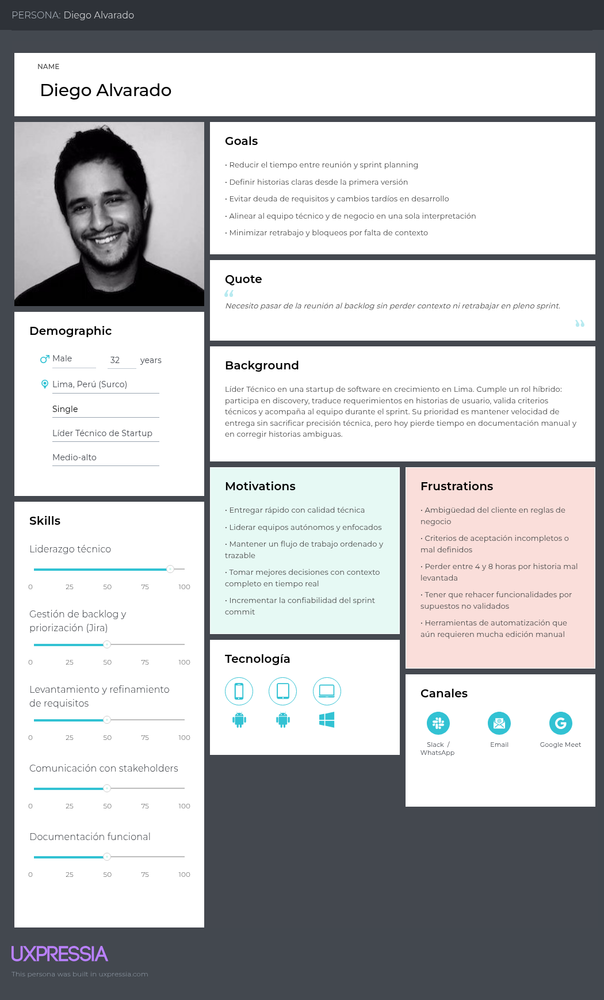

**User persona del segmento de Analista de sistemas Enterprise**

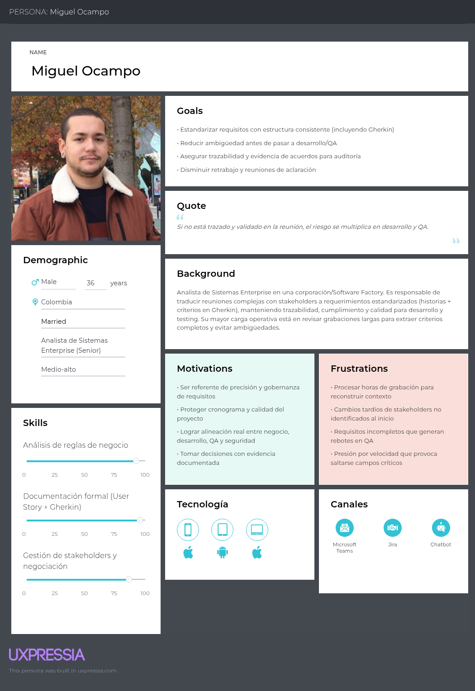

### 2.3.2. User Task Matrix

En este User Task Matrix se detallan las tareas que realizan los dos segmentos objetivos considerados en Reqs-AI: el Líder Técnico de Startup y el Analista de Sistemas Enterprise. Las tareas descritas corresponden al trabajo real de levantamiento, validación y transferencia de requisitos, y se ejecutan independientemente de la existencia de una herramienta de software.

| **TAREA**                                                                                           | **Diego Alvarado (Líder Técnico de Startup) - Frecuencia** | **Diego Alvarado (Líder Técnico de Startup) - Importancia** | **Analista Enterprise Genérico (Analista de Sistemas Enterprise) - Frecuencia** | **Analista Enterprise Genérico (Analista de Sistemas Enterprise) - Importancia** |
|-----------------------------------------------------------------------------------------------------|:----------------------------------------------------------:|:-----------------------------------------------------------:|:-------------------------------------------------------------------------------:|:--------------------------------------------------------------------------------:|
| Agendar y preparar reuniones de levantamiento de requisitos con stakeholders                        |                           always                           |                            high                             |                                     always                                      |                                       high                                       |
| Escuchar, sintetizar y registrar necesidades funcionales y reglas de negocio durante la reunión     |                           always                           |                            high                             |                                     always                                      |                                       high                                       |
| Identificar supuestos, restricciones, dependencias y casos de borde                                 |                           always                           |                            high                             |                                     always                                      |                                       high                                       |
| Formular preguntas de aclaración para reducir ambiguedad en tiempo real                             |                           always                           |                            high                             |                                     always                                      |                                       high                                       |
| Transformar notas y acuerdos en historias de usuario y criterios de aceptación                      |                           always                           |                            high                             |                                     always                                      |                                       high                                       |
| Estandarizar la redacción de criterios en formato estructurado (por ejemplo, Gherkin)               |                         sometimes                          |                            high                             |                                     always                                      |                                       high                                       |
| Validar entendimiento con desarrollo y QA antes de comprometer el sprint                            |                           always                           |                            high                             |                                     always                                      |                                       high                                       |
| Gestionar cambios de alcance y negociar prioridades con negocio cuando aparecen nuevas condiciones  |                         sometimes                          |                            high                             |                                     always                                      |                                       high                                       |
| Mantener trazabilidad de acuerdos, versiones y decisiones para auditoría y control                  |                         sometimes                          |                           medium                            |                                     always                                      |                                       high                                       |
| Revisar grabaciones/minutas y depurar documentación para cerrar vacíos de información               |                         sometimes                          |                           medium                            |                                     always                                      |                                       high                                       |
| Coordinar reuniones de seguimiento por dudas o contradicciones detectadas después del levantamiento |                         sometimes                          |                           medium                            |                                    sometimes                                    |                                       high                                       |

La principal diferencia está en el enfoque operativo: el Líder Técnico de Startup prioriza velocidad de ejecución y alineación práctica para codificar cuanto antes, mientras que el Analista de Sistemas Enterprise prioriza estandarización, trazabilidad y control de riesgo. Por ello, en el segmento enterprise aumentan la frecuencia e importancia de actividades formales como redacción estructurada, revisión exhaustiva de evidencias y gestión de cambios bajo criterios de gobernanza.

### 2.3.3. User Journey Mapping

A continuación, se presentan los User Journey Maps As-Is de cada User Persona. Estos mapas permiten visualizar el recorrido end-to-end de ambos segmentos durante el levantamiento y documentación de requisitos en su situación actual (sin la solución), identificando fricciones, puntos de dolor y oportunidades de mejora en cada etapa del proceso.

* User Journey Map de Diego Alvarado (Líder Técnico de Startup):

  

* User Journey Map de Analista Enterprise Genérico (Analista de sistemas enterprise):

  

### 2.3.4. Empathy Mapping

Se elaboraron los Empathy Maps para los dos user persona priorizados: el Líder Técnico de Startup y el Analista de Sistemas Enterprise. Este proceso permitió profundizar en lo que cada segmento dice, piensa, hace, observa y escucha durante el levantamiento de requisitos, identificando sus principales pains y gains para orientar el diseño de una solución realmente alineada con su contexto operativo.

**Líder Técnico de Startup**

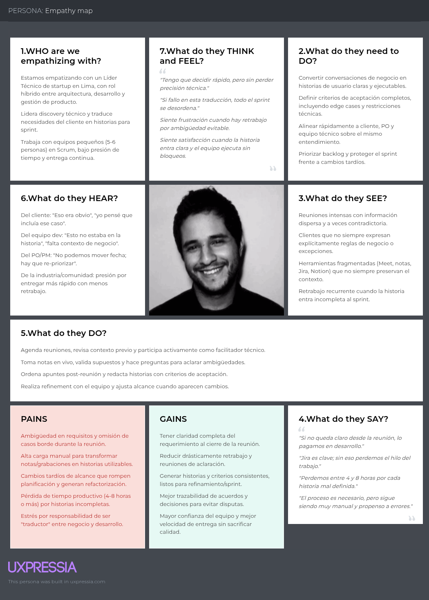

**Analista de sistemas enterprise**

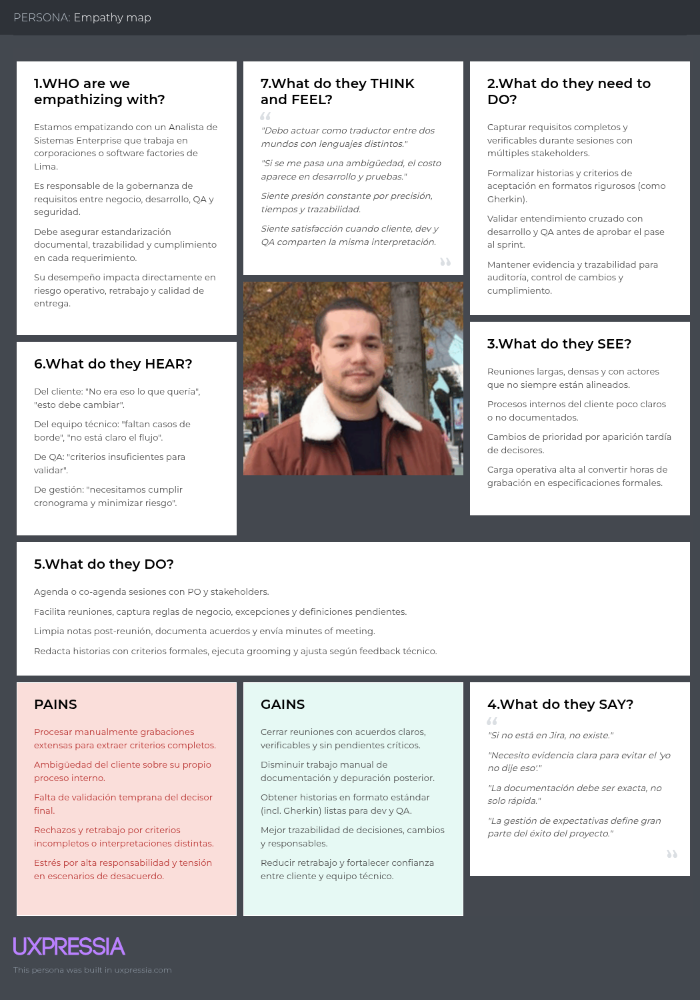

### 2.3.5. As-is Scenario Mapping

El equipo elaboró los As-Is Scenario Mapping mediante preparación, lluvia de ideas individual y revisión conjunta por segmento. Con base en entrevistas y artefactos previos, se definieron las fases del recorrido actual de cada User Persona en las filas Steps, Doing, Thinking y Feeling, representando la situación actual sin la solución propuesta.

Además, se identificaron áreas positivas, negativas y blank áreas para ubicar con precisión los puntos de mayor impacto operativo y emocional en cada segmento.

**As-Is Scenario Mapping de Diego Alvarado (Líder Técnico de Startup)**

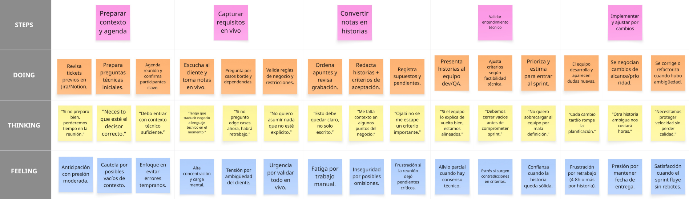

**As-Is Scenario Mapping de Analista Enterprise Genérico (Analista de Sistemas Enterprise)**

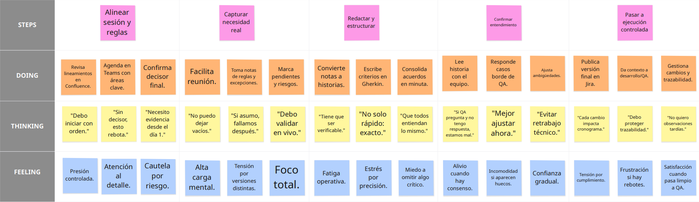

## 2.4. Ubiquitous Language

En esta sección se presenta el glosario del dominio de negocio de Reqs-AI, redactado con términos en inglés (y su equivalente en español) para mantener una comunicación consistente y sin ambigüedades entre analistas, líderes técnicos, negocio, QA y demás stakeholders. Este lenguaje ubicuo se centra en el proceso de levantamiento, validación y gobernanza de requisitos en entornos startup y enterprise.

| Term                     | Equivalente                     | Definición                                                                                                                       |
|--------------------------|---------------------------------|----------------------------------------------------------------------------------------------------------------------------------|
| Stakeholder              | Interesado / Parte interesada   | Persona o área que influye, decide o se ve impactada por un requerimiento del proyecto.                                          |
| Requirement              | Requerimiento                   | Necesidad del negocio o del usuario que debe quedar descrita de forma clara para guiar la implementación y validación.           |
| Requirement Elicitation  | Levantamiento de requerimientos | Proceso de recopilar información con el cliente y actores clave para entender qué problema se debe resolver.                     |
| Discovery Session        | Sesión de descubrimiento        | Reunión inicial en la que se explora el problema, objetivos, contexto y restricciones del requerimiento.                         |
| Business Rule            | Regla de negocio                | Condición o política del negocio que determina cómo debe comportarse un proceso o una funcionalidad.                             |
| Acceptance Criteria      | Criterios de aceptación         | Condiciones verificables que definen cuándo un requerimiento se considera correctamente cumplido.                                |
| Edge Case                | Caso borde                      | Situación excepcional o poco frecuente que puede afectar el resultado esperado y debe ser considerada en el análisis.            |
| Assumption               | Supuesto                        | Condición que se da por cierta temporalmente cuando no existe confirmación explícita en la reunión.                              |
| Dependency               | Dependencia                     | Elemento externo (área, dato, aprobación o acceso) del cual depende la ejecución de un requerimiento.                            |
| Constraint               | Restricción                     | Límite de negocio, tiempo, regulación o presupuesto que condiciona cómo se puede ejecutar una solución.                          |
| Scope                    | Alcance                         | Conjunto de entregables y límites funcionales acordados para una iniciativa o requerimiento.                                     |
| Scope Change             | Cambio de alcance               | Modificación posterior del alcance originalmente acordado que impacta tiempo, costo o prioridades.                               |
| Decision Maker           | Decisor                         | Stakeholder con autoridad final para aprobar, rechazar o redefinir un requerimiento.                                             |
| Approval                 | Aprobación                      | Confirmación formal de que un requerimiento y sus criterios están listos para pasar a ejecución.                                 |
| Requirement Traceability | Trazabilidad de requerimientos  | Capacidad de seguir un requerimiento desde su origen hasta su validación final, incluyendo cambios y decisiones.                 |
| Minutes of Meeting       | Acta de reunión                 | Registro formal de acuerdos, pendientes y decisiones tomadas durante una sesión con stakeholders.                                |
| Clarification Meeting    | Reunión de aclaración           | Reunión adicional convocada para resolver ambigüedades o contradicciones detectadas después del levantamiento inicial.           |
| Rework                   | Retrabajo                       | Esfuerzo adicional causado por requisitos incompletos, ambiguos o mal interpretados en etapas previas.                           |
| Requirement Governance   | Gobernanza de requerimientos    | Conjunto de prácticas para asegurar estandarización, calidad, control de cambios y cumplimiento en la gestión de requerimientos. |
| Business Alignment       | Alineación de negocio           | Grado en que todos los stakeholders comparten la misma interpretación sobre el problema y la solución esperada.                  |

# Capítulo III: Requirements Specification

## 3.1. To-Be Scenario Mapping

Para elaborar el To-Be Scenario Mapping, el equipo partió de los recorridos As-Is de ambos segmentos y proyectó un flujo mejorado con apoyo de Reqs-AI. El objetivo fue reducir ambigüedad, retrabajo y carga manual, manteniendo las mismas fases del proceso para comparar claramente los cambios en las filas Steps, Doing, Thinking y Feeling.

El escenario To-Be propone sesiones de levantamiento con mayor validación en tiempo real, mejor estandarización de criterios de aceptación y trazabilidad más sólida para la transferencia hacia desarrollo y QA.

**To-Be Scenario Mapping de Diego Alvarado (Líder Técnico de Startup)**


**To-Be Scenario Mapping de Analista Enterprise Genérico (Analista de Sistemas Enterprise)**

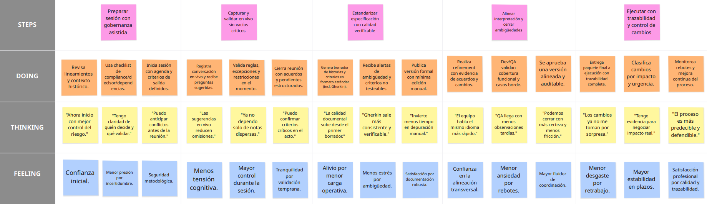

## 3.2. User Stories

El siguiente inventario detalla las funcionalidades del sistema. Nótese la diferenciación entre **US** (User Stories - Funcionalidades de interfaz/usuario) y **TS** (Technical Stories - API y Arquitectura backend).

| ID       | Título de la Historia                                                    | Descripción (Como... quiero... para...)                                                                                                                                                                                                                                                                                                                            | Criterios de Aceptación (BDD)                                                                                                                                                                                                                                                                                                                                                                                                                                                                                                                                                                                                                                                                                                                                                                                                                                                                                                                                                                                                                                                                                                                                                                                                                                                                                                                                                                                                                                                                                                                                                                                                                                                                                                                                                                                                                                              | Épica Asociada |
|:---------|:-------------------------------------------------------------------------|:-------------------------------------------------------------------------------------------------------------------------------------------------------------------------------------------------------------------------------------------------------------------------------------------------------------------------------------------------------------------|:---------------------------------------------------------------------------------------------------------------------------------------------------------------------------------------------------------------------------------------------------------------------------------------------------------------------------------------------------------------------------------------------------------------------------------------------------------------------------------------------------------------------------------------------------------------------------------------------------------------------------------------------------------------------------------------------------------------------------------------------------------------------------------------------------------------------------------------------------------------------------------------------------------------------------------------------------------------------------------------------------------------------------------------------------------------------------------------------------------------------------------------------------------------------------------------------------------------------------------------------------------------------------------------------------------------------------------------------------------------------------------------------------------------------------------------------------------------------------------------------------------------------------------------------------------------------------------------------------------------------------------------------------------------------------------------------------------------------------------------------------------------------------------------------------------------------------------------------------------------------------|:---------------|
| **EP00** | **Landing Page y Captación de Leads**                                    | Landing page pública orientada a convertir visitantes en usuarios mediante la exposición de la propuesta de valor y beneficios por segmentos B2B.                                                                                                                                                                                                                  | --                                                                                                                                                                                                                                                                                                                                                                                                                                                                                                                                                                                                                                                                                                                                                                                                                                                                                                                                                                                                                                                                                                                                                                                                                                                                                                                                                                                                                                                                                                                                                                                                                                                                                                                                                                                                                                                                         | --             |
| US01     | Visualizar Propuesta de Valor (Hero)                                     | Como visitante, quiero entender inmediatamente qué es Reqs-AI y su propuesta de valor principal en la cabecera (Hero), para decidir en los primeros segundos si me interesa continuar explorando la herramienta.                                                                                                                                                   | <strong>Feature:</strong> Landing Page - Hero Section<br><br><strong>Scenario:</strong> Carga inicial y visibilidad de conversión (Happy Path)<br><strong>Given</strong> un visitante que accede a la URL principal de Reqs-AI<br><strong>When</strong> la página carga completamente<br><strong>Then</strong> visualiza un título claro sobre la automatización de requisitos con IA<br><strong>And</strong> un llamado a la acción (CTA) principal visible sin hacer scroll para iniciar el registro<br><br><strong>Scenario:</strong> Acceso desde dispositivo móvil (Edge Case - Responsive)<br><strong>Given</strong> un visitante que accede desde un dispositivo móvil (viewport inferior a 768px)<br><strong>When</strong> la página carga completamente<br><strong>Then</strong> el Hero adapta su diseño al ancho de pantalla sin perder legibilidad<br><strong>And</strong> el CTA principal sigue visible y pulsable sin necesidad de hacer scroll<br><br><strong>Scenario:</strong> Visitante ya autenticado (Edge Case)<br><strong>Given</strong> un usuario que ya tiene sesión activa en la plataforma<br><strong>When</strong> accede a la URL de la landing page<br><strong>Then</strong> el sistema lo redirige directamente al panel principal de su organización<br><strong>And</strong> no muestra la landing para evitar confusión innecesaria                                                                                                                                                                                                                                                                                                                                                                                                                                                                                                      | EP00           |
| US02     | Explorar Casos de Uso por Segmento                                       | Como visitante, quiero alternar entre diferentes perfiles (ej. Consultoras vs Startups) en una sección interactiva, para ver beneficios y ejemplos específicos que se adapten a la realidad de mi equipo.                                                                                                                                                          | <strong>Feature:</strong> Landing Page - Segmentación Interactiva<br><br><strong>Scenario Outline:</strong> Alternar entre perfiles de usuario<br><strong>Given</strong> un visitante en la sección de 'Construido para tu equipo'<br><strong>When</strong> hace clic en la pestaña del perfil <strong>&lt;Perfil&gt;</strong><br><strong>Then</strong> el contenido dinámico se actualiza sin recargar la página<br><strong>And</strong> muestra el beneficio principal <strong>&lt;Beneficio&gt;</strong> asociado a ese perfil<br><br><strong>Examples:</strong><br><table><tr><th>Perfil</th><th>Beneficio</th></tr><tr><td>Consultoras de Software</td><td>Reducción de horas facturables en análisis y toma de requerimientos.</td></tr><tr><td>Product Managers / Startups</td><td>Integración directa con Jira y adopción de metodologías ágiles.</td></tr></table>                                                                                                                                                                                                                                                                                                                                                                                                                                                                                                                                                                                                                                                                                                                                                                                                                                                                                                                                                                                                | EP00           |
| US03     | Visualizar Planes y Precios                                              | Como visitante evaluando la viabilidad financiera, quiero comparar los planes de suscripción (Gratuito, Pro, Equipo) de forma transparente, para determinar cuál se ajusta a mi presupuesto antes de crearme una cuenta.                                                                                                                                           | <strong>Feature:</strong> Landing Page - Pricing<br><br><strong>Scenario:</strong> Comparativa de planes con toggle (Happy Path)<br><strong>Given</strong> un visitante en la sección de Precios<br><strong>When</strong> alterna el interruptor entre facturación 'Mensual' y 'Anual'<br><strong>Then</strong> los precios de los planes de pago se actualizan dinámicamente mostrando el descuento aplicado<br><strong>And</strong> cada tarjeta de plan contiene un CTA que redirige al formulario de registro correspondiente<br><br><strong>Scenario:</strong> CTA de plan gratuito no solicita datos de pago (Edge Case)<br><strong>Given</strong> un visitante interesado en el Plan Gratuito<br><strong>When</strong> hace clic en el CTA correspondiente<br><strong>Then</strong> es redirigido al formulario de registro sin que se le solicite ningún dato de tarjeta ni método de pago<br><br><strong>Scenario:</strong> Visualización sin interacción con el toggle (Edge Case)<br><strong>Given</strong> un visitante que no interactúa con el toggle de facturación<br><strong>When</strong> llega a la sección de precios<br><strong>Then</strong> los planes se muestran en modo mensual por defecto<br><strong>And</strong> cada tarjeta expone precio, límites principales y características clave de forma legible                                                                                                                                                                                                                                                                                                                                                                                                                                                                                                                                     | EP00           |
| **EP01** | **Autenticación y Seguridad**                                            | Gestión de acceso y protección de identidad para los usuarios de Reqs-AI, garantizando que solo personal autorizado acceda a la plataforma y su historial.                                                                                                                                                                                                         | --                                                                                                                                                                                                                                                                                                                                                                                                                                                                                                                                                                                                                                                                                                                                                                                                                                                                                                                                                                                                                                                                                                                                                                                                                                                                                                                                                                                                                                                                                                                                                                                                                                                                                                                                                                                                                                                                         | --             |
| US04     | Registro de cuenta                                                       | Como visitante que llega por primera vez a la plataforma, quiero crear una cuenta con mi correo y una contraseña, para poder acceder a mis proyectos y sesiones de captura de requisitos.                                                                                                                                                                          | <strong>Feature:</strong> Registro de cuenta<br><br><strong>Scenario:</strong> Registro exitoso (Happy Path)<br><strong>Given</strong> un visitante en la página de registro<br><strong>When</strong> ingresa un correo válido y una contraseña segura<br><strong>Then</strong> el sistema crea la cuenta en estado 'pendiente de verificación'<br><strong>And</strong> envía un correo con el enlace de activación<br><br><strong>Scenario Outline:</strong> Validaciones de registro (Unhappy Paths)<br><strong>Given</strong> un visitante en la página de registro<br><strong>When</strong> ingresa datos con el problema <strong>&lt;Problema&gt;</strong><br><strong>Then</strong> el sistema rechaza el registro indicando <strong>&lt;Mensaje&gt;</strong><br><br><strong>Examples:</strong><br><table><tr><th>Problema</th><th>Mensaje</th></tr><tr><td>El correo ya está registrado en otra cuenta</td><td>El correo ingresado ya se encuentra en uso.</td></tr><tr><td>La contraseña tiene menos de 8 caracteres</td><td>La contraseña debe tener al menos 8 caracteres.</td></tr><tr><td>El formato del correo es inválido</td><td>Ingresa un correo electrónico válido.</td></tr></table>                                                                                                                                                                                                                                                                                                                                                                                                                                                                                                                                                                                                                                                                     | EP01           |
| US05     | Verificación de correo                                                   | Como usuario con cuenta pendiente de activación, quiero verificar mi correo haciendo clic en el enlace que recibí, para activar mi cuenta y empezar a trabajar en la plataforma.                                                                                                                                                                                   | <strong>Feature:</strong> Verificación de correo<br><br><strong>Scenario:</strong> Verificación exitosa (Happy Path)<br><strong>Given</strong> un usuario con cuenta pendiente de activación<br><strong>When</strong> hace clic en el enlace de verificación recibido por correo<br><strong>Then</strong> el sistema activa la cuenta<br><strong>And</strong> redirige al usuario al inicio de sesión<br><br><strong>Scenario:</strong> Enlace expirado o inválido (Unhappy Path)<br><strong>Given</strong> un usuario con un enlace de verificación<br><strong>When</strong> el enlace fue usado previamente o ya expiró su vigencia<br><strong>Then</strong> el sistema muestra un error de enlace inválido<br><strong>And</strong> ofrece la opción de reenviar un nuevo correo de verificación<br><br><strong>Scenario:</strong> Reenvío de enlace de verificación (Flujo Alternativo)<br><strong>Given</strong> un usuario cuyo enlace de verificación ha expirado<br><strong>When</strong> solicita el reenvío del enlace desde la notificación de error<br><strong>Then</strong> el sistema invalida el enlace anterior<br><strong>And</strong> envía un nuevo enlace válido con un tiempo de expiración renovado                                                                                                                                                                                                                                                                                                                                                                                                                                                                                                                                                                                                                                                   | EP01           |
| US06     | Inicio de sesión                                                         | Como usuario con cuenta activa, quiero iniciar sesión con mi correo y contraseña, para acceder a mis proyectos y al historial de sesiones de mi organización.                                                                                                                                                                                                      | <strong>Feature:</strong> Inicio de sesión<br><br><strong>Scenario:</strong> Autenticación exitosa (Happy Path)<br><strong>Given</strong> un usuario con cuenta activa<br><strong>When</strong> ingresa sus credenciales correctas<br><strong>Then</strong> el sistema le concede acceso<br><strong>And</strong> lo redirige al panel principal de su última organización activa<br><br><strong>Scenario Outline:</strong> Fallos de autenticación (Unhappy Paths)<br><strong>Given</strong> un usuario intentando iniciar sesión<br><strong>When</strong> ocurre la situación <strong>&lt;Situacion&gt;</strong><br><strong>Then</strong> el sistema deniega el acceso con el mensaje <strong>&lt;Error&gt;</strong><br><br><strong>Examples:</strong><br><table><tr><th>Situacion</th><th>Error</th></tr><tr><td>Contraseña incorrecta</td><td>Credenciales inválidas.</td></tr><tr><td>La cuenta aún no ha sido verificada</td><td>Debes verificar tu correo antes de iniciar sesión.</td></tr><tr><td>Demasiados intentos fallidos consecutivos</td><td>Cuenta bloqueada temporalmente por seguridad.</td></tr></table>                                                                                                                                                                                                                                                                                                                                                                                                                                                                                                                                                                                                                                                                                                                                                | EP01           |
| US07     | Recuperación de contraseña                                               | Como usuario registrado que no recuerda su contraseña, quiero recibir un enlace de restablecimiento en mi correo, para recuperar el acceso a mi cuenta sin perder mi historial de trabajo.                                                                                                                                                                         | <strong>Feature:</strong> Recuperación de contraseña<br><br><strong>Scenario:</strong> Solicitar recuperación (Happy Path)<br><strong>Given</strong> un usuario que olvidó su contraseña<br><strong>When</strong> ingresa su correo en el formulario de recuperación<br><strong>Then</strong> el sistema envía un enlace de restablecimiento<br><strong>And</strong> muestra un mensaje genérico de confirmación por seguridad<br><br><strong>Scenario:</strong> Prevenir enumeración de usuarios (Edge Case - Seguridad)<br><strong>Given</strong> un visitante malintencionado<br><strong>When</strong> ingresa un correo que no existe en el sistema<br><strong>Then</strong> el sistema no revela que el correo es inexistente<br><strong>And</strong> muestra el mismo mensaje genérico de confirmación<br><br><strong>Scenario:</strong> Enlace de restablecimiento expirado al usarlo (Unhappy Path)<br><strong>Given</strong> un usuario que recibió el enlace de restablecimiento en su correo<br><strong>When</strong> intenta acceder a él después de su período de validez (ej. pasadas 24 horas)<br><strong>Then</strong> el sistema rechaza el token indicando que expiró<br><strong>And</strong> ofrece la opción de solicitar un nuevo enlace de restablecimiento                                                                                                                                                                                                                                                                                                                                                                                                                                                                                                                                                                                          | EP01           |
| US08     | Cerrar sesión                                                            | Como usuario autenticado, quiero cerrar mi sesión de forma explícita, para asegurarme de que nadie más pueda acceder a mi cuenta desde el mismo dispositivo.                                                                                                                                                                                                       | <strong>Feature:</strong> Cerrar sesión<br><br><strong>Scenario:</strong> Logout exitoso (Happy Path)<br><strong>Given</strong> un usuario autenticado<br><strong>When</strong> selecciona la opción 'Cerrar sesión'<br><strong>Then</strong> el sistema invalida el token de sesión<br><strong>And</strong> redirige al usuario a la pantalla de inicio de sesión<br><br><strong>Scenario:</strong> Cierre de sesión con captura activa (Edge Case)<br><strong>Given</strong> un usuario con una sesión de captura en curso<br><strong>When</strong> intenta cerrar sesión<br><strong>Then</strong> el sistema muestra una advertencia de que hay una sesión activa<br><strong>And</strong> requiere confirmar antes de proceder                                                                                                                                                                                                                                                                                                                                                                                                                                                                                                                                                                                                                                                                                                                                                                                                                                                                                                                                                                                                                                                                                                                                          | EP01           |
| US09     | Aceptar términos y política de privacidad                                | Como nuevo usuario completando el registro, quiero leer y aceptar los términos de uso y la política de privacidad antes de activar mi cuenta, para entender cómo se usan mis datos y las grabaciones de audio antes de comenzar a usar el servicio.                                                                                                                | <strong>Feature:</strong> Consentimiento de privacidad<br><br><strong>Scenario:</strong> Aceptar términos durante el registro (Happy Path)<br><strong>Given</strong> un visitante completando el formulario de registro<br><strong>When</strong> marca la casilla de aceptación y envía el formulario<br><strong>Then</strong> el sistema registra la fecha y versión del consentimiento otorgado<br><strong>And</strong> procede con la creación de la cuenta<br><br><strong>Scenario:</strong> Intentar registrarse sin aceptar términos (Unhappy Path)<br><strong>Given</strong> un visitante en el formulario de registro<br><strong>When</strong> intenta crear la cuenta sin marcar la casilla de aceptación<br><strong>Then</strong> el sistema bloquea el envío<br><strong>And</strong> resalta la casilla indicando que es obligatoria                                                                                                                                                                                                                                                                                                                                                                                                                                                                                                                                                                                                                                                                                                                                                                                                                                                                                                                                                                                                                            | EP01           |
| US10     | Editar perfil de usuario                                                 | Como usuario autenticado, quiero actualizar mi nombre y foto de perfil, para que mis compañeros de equipo me identifiquen correctamente en los registros de actividad de las sesiones.                                                                                                                                                                             | <strong>Feature:</strong> Editar perfil<br><br><strong>Scenario:</strong> Actualizar nombre y foto (Happy Path)<br><strong>Given</strong> un usuario autenticado en su perfil<br><strong>When</strong> modifica su nombre y sube una imagen válida<br><strong>Then</strong> el sistema actualiza los datos<br><strong>And</strong> refleja los cambios en todos los proyectos donde el usuario aparece<br><br><strong>Scenario:</strong> Formato de imagen no soportado (Unhappy Path)<br><strong>Given</strong> un usuario editando su perfil<br><strong>When</strong> sube un archivo que no es imagen (ej. PDF)<br><strong>Then</strong> el sistema rechaza el archivo<br><strong>And</strong> muestra un mensaje indicando los formatos aceptados<br><br><strong>Scenario:</strong> Imagen supera el tamaño máximo permitido (Unhappy Path)<br><strong>Given</strong> un usuario editando su perfil<br><strong>When</strong> intenta subir una imagen que excede el límite de tamaño (ej. mayor de 5 MB)<br><strong>Then</strong> el sistema rechaza el archivo antes de procesarlo<br><strong>And</strong> muestra el tamaño máximo permitido y los formatos válidos                                                                                                                                                                                                                                                                                                                                                                                                                                                                                                                                                                                                                                                                                                  | EP01           |
| **EP02** | **Organizaciones**                                                       | Gestión de espacios de trabajo independientes para separar la información de diferentes empresas o equipos, garantizando que cada organización acceda únicamente a sus propios datos.                                                                                                                                                                              | --                                                                                                                                                                                                                                                                                                                                                                                                                                                                                                                                                                                                                                                                                                                                                                                                                                                                                                                                                                                                                                                                                                                                                                                                                                                                                                                                                                                                                                                                                                                                                                                                                                                                                                                                                                                                                                                                         | --             |
| US11     | Crear organización                                                       | Como usuario autenticado que aún no pertenece a ninguna organización, quiero crear un espacio de trabajo con el nombre de mi empresa, para centralizar mis proyectos y gestionar mi equipo en un entorno separado.                                                                                                                                                 | <strong>Feature:</strong> Crear organización<br><br><strong>Scenario:</strong> Creación exitosa (Happy Path)<br><strong>Given</strong> un usuario autenticado sin organización<br><strong>When</strong> crea una organización con un nombre válido<br><strong>Then</strong> el sistema genera el espacio de trabajo<br><strong>And</strong> asigna al usuario el rol inamovible de 'Propietario'<br><br><strong>Scenario:</strong> Nombre de organización vacío (Unhappy Path)<br><strong>Given</strong> un usuario creando una organización<br><strong>When</strong> deja el nombre en blanco<br><strong>Then</strong> el sistema bloquea la creación exigiendo un nombre obligatorio                                                                                                                                                                                                                                                                                                                                                                                                                                                                                                                                                                                                                                                                                                                                                                                                                                                                                                                                                                                                                                                                                                                                                                                     | EP02           |
| US12     | Editar organización                                                      | Como Propietario de la organización, quiero actualizar el nombre o los datos generales de mi organización, para mantener la información correcta cuando el equipo o el negocio cambia.                                                                                                                                                                             | <strong>Feature:</strong> Editar organización<br><br><strong>Scenario:</strong> Actualizar datos (Happy Path)<br><strong>Given</strong> el Propietario de una organización<br><strong>When</strong> modifica el nombre y guarda los cambios<br><strong>Then</strong> la organización actualiza sus datos en toda la plataforma<br><br><strong>Scenario:</strong> Intento de edición sin permisos (Unhappy Path)<br><strong>Given</strong> un miembro regular de la organización<br><strong>When</strong> intenta acceder a la configuración de la organización<br><strong>Then</strong> el sistema oculta o bloquea la opción por falta de privilegios                                                                                                                                                                                                                                                                                                                                                                                                                                                                                                                                                                                                                                                                                                                                                                                                                                                                                                                                                                                                                                                                                                                                                                                                                     | EP02           |
| US13     | Cambiar de organización                                                  | Como usuario que pertenece a más de una organización, quiero seleccionar con cuál quiero trabajar desde el menú principal, para asegurarme de estar operando en el contexto correcto según el cliente que estoy atendiendo.                                                                                                                                        | <strong>Feature:</strong> Cambiar de organización<br><br><strong>Scenario:</strong> Cambio exitoso de contexto (Happy Path)<br><strong>Given</strong> un usuario que pertenece a múltiples organizaciones<br><strong>When</strong> selecciona una organización distinta desde el menú<br><strong>Then</strong> el sistema recarga el contexto de trabajo<br><strong>And</strong> muestra únicamente los proyectos de la organización seleccionada<br><br><strong>Scenario:</strong> Eliminación concurrente (Edge Case)<br><strong>Given</strong> un usuario intentando cambiar a la Organización B<br><strong>When</strong> el propietario de la Organización B lo elimina en ese mismo instante<br><strong>Then</strong> el sistema deniega el acceso y lo devuelve a su organización actual                                                                                                                                                                                                                                                                                                                                                                                                                                                                                                                                                                                                                                                                                                                                                                                                                                                                                                                                                                                                                                                                             | EP02           |
| US14     | Política de retención de audios                                          | Como Propietario de la organización, quiero configurar la eliminación automática de los archivos de audio originales X días después de procesarse, para cumplir con las políticas de privacidad y confidencialidad corporativas.                                                                                                                                   | <strong>Feature:</strong> Política de retención de audios<br><br><strong>Scenario:</strong> Eliminación automática al cumplir plazo (Happy Path)<br><strong>Given</strong> una organización con la retención configurada en 7 días<br><strong>When</strong> se cumple el plazo desde que un audio fue procesado<br><strong>Then</strong> el sistema elimina permanentemente el archivo de audio físico<br><strong>And</strong> conserva únicamente las historias generadas en texto<br><br><strong>Scenario:</strong> Intentar acceder a un audio eliminado (Unhappy Path)<br><strong>Given</strong> un audio que ya superó su periodo de retención y fue purgado<br><strong>When</strong> un usuario intenta reproducirlo o descargarlo desde el historial<br><strong>Then</strong> el sistema muestra un aviso de que el archivo fue eliminado por políticas de privacidad corporativa                                                                                                                                                                                                                                                                                                                                                                                                                                                                                                                                                                                                                                                                                                                                                                                                                                                                                                                                                                                   | EP02           |
| **EP03** | **Suscripción y Facturación**                                            | Gestión de planes y límites de uso del sistema basados en un modelo de suscripción SaaS. Épica de baja prioridad — no entra en los primeros sprints.                                                                                                                                                                                                               | --                                                                                                                                                                                                                                                                                                                                                                                                                                                                                                                                                                                                                                                                                                                                                                                                                                                                                                                                                                                                                                                                                                                                                                                                                                                                                                                                                                                                                                                                                                                                                                                                                                                                                                                                                                                                                                                                         | --             |
| US15     | Plan gratuito automático                                                 | Como usuario que acaba de crear su organización, quiero empezar a usar la plataforma sin ingresar datos de pago, para evaluar si se ajusta a mis necesidades antes de decidir suscribirme.                                                                                                                                                                         | <strong>Feature:</strong> Plan gratuito automático<br><br><strong>Scenario:</strong> Asignación por defecto (Happy Path)<br><strong>Given</strong> un usuario que acaba de crear una nueva organización<br><strong>When</strong> ingresa a su panel por primera vez<br><strong>Then</strong> el sistema le asigna el 'Plan Gratuito'<br><strong>And</strong> habilita las cuotas iniciales sin solicitar método de pago<br><br><strong>Scenario:</strong> Cuota de sesiones del plan gratuito agotada (Edge Case)<br><strong>Given</strong> una organización en Plan Gratuito que ya consumió su límite mensual de sesiones<br><strong>When</strong> un analista intenta iniciar una nueva sesión de captura<br><strong>Then</strong> el sistema bloquea la acción<br><strong>And</strong> muestra un aviso invitando a actualizar al Plan Pro para continuar<br><br><strong>Scenario:</strong> Intento de crear segunda organización en plan gratuito (Edge Case)<br><strong>Given</strong> un usuario en Plan Gratuito con una organización activa<br><strong>When</strong> intenta crear una segunda organización<br><strong>Then</strong> el sistema bloquea la creación<br><strong>And</strong> informa que el Plan Gratuito está limitado a un único espacio de trabajo                                                                                                                                                                                                                                                                                                                                                                                                                                                                                                                                                                                              | EP03           |
| US16     | Suscripción al plan Pro                                                  | Como Propietario de una organización en plan gratuito, quiero contratar el plan Pro, para acceder a sesiones ilimitadas, captura en tiempo real e integración con Jira.                                                                                                                                                                                            | <strong>Feature:</strong> Suscripción al plan Pro<br><br><strong>Scenario:</strong> Upgrade de plan exitoso (Happy Path)<br><strong>Given</strong> el Propietario de una organización en plan gratuito<br><strong>When</strong> ingresa un método de pago válido y contrata el Plan Pro<br><strong>Then</strong> los límites de la organización se expanden inmediatamente<br><strong>And</strong> se emite la factura correspondiente<br><br><strong>Scenario:</strong> Tarjeta rechazada (Unhappy Path)<br><strong>Given</strong> un Propietario intentando hacer upgrade<br><strong>When</strong> la pasarela de pagos rechaza la tarjeta por fondos insuficientes<br><strong>Then</strong> el sistema mantiene el plan gratuito<br><strong>And</strong> notifica el error de pago al usuario                                                                                                                                                                                                                                                                                                                                                                                                                                                                                                                                                                                                                                                                                                                                                                                                                                                                                                                                                                                                                                                                           | EP03           |
| US17     | Suscripción al plan Equipo                                               | Como Propietario de una organización en plan Pro, quiero contratar el plan Equipo, para poder agregar a todos los miembros de mi equipo y definir mediante roles personalizados qué puede hacer cada uno.                                                                                                                                                          | <strong>Feature:</strong> Suscripción al plan Equipo<br><br><strong>Scenario:</strong> Upgrade a Equipo exitoso (Happy Path)<br><strong>Given</strong> el Propietario de una organización en Plan Pro<br><strong>When</strong> ingresa un método de pago válido y contrata el Plan Equipo<br><strong>Then</strong> el plan se actualiza de inmediato<br><strong>And</strong> se habilitan la gestión avanzada de roles y los asientos ilimitados de miembros<br><strong>And</strong> se emite la factura correspondiente al nuevo plan<br><br><strong>Scenario:</strong> Intento de upgrade sin plan Pro previo (Unhappy Path)<br><strong>Given</strong> el Propietario de una organización en Plan Gratuito<br><strong>When</strong> intenta contratar el Plan Equipo directamente<br><strong>Then</strong> el sistema bloquea la operación<br><strong>And</strong> lo redirige al flujo de upgrade al Plan Pro como paso previo requerido<br><br><strong>Scenario:</strong> Pago rechazado durante upgrade (Unhappy Path)<br><strong>Given</strong> el Propietario intentando contratar el Plan Equipo<br><strong>When</strong> la pasarela de pagos rechaza el método de pago<br><strong>Then</strong> el sistema mantiene el Plan Pro activo sin cambios<br><strong>And</strong> notifica el error de pago solicitando actualizar el método de facturación                                                                                                                                                                                                                                                                                                                                                                                                                                                                                                             | EP03           |
| US18     | Cancelación de suscripción                                               | Como Propietario de una suscripción activa, quiero cancelar mi plan antes de que inicie el siguiente período de facturación, para no recibir cargos adicionales después de dejar de usar el servicio.                                                                                                                                                              | <strong>Feature:</strong> Cancelación de suscripción<br><br><strong>Scenario:</strong> Cancelar antes de renovación (Happy Path)<br><strong>Given</strong> el Propietario de una suscripción paga activa<br><strong>When</strong> cancela la suscripción desde el panel<br><strong>Then</strong> el sistema desactiva la auto-renovación<br><strong>And</strong> mantiene los beneficios premium hasta el final del ciclo de facturación actual<br><br><strong>Scenario:</strong> Reactivar suscripción antes del vencimiento (Flujo Alternativo)<br><strong>Given</strong> una suscripción en estado CANCELING con días de acceso premium restantes<br><strong>When</strong> el Propietario decide mantener el servicio<br><strong>Then</strong> el sistema restaura la auto-renovación<br><strong>And</strong> la suscripción vuelve al estado ACTIVE sin interrupciones ni cobros adicionales<br><br><strong>Scenario:</strong> Intentar cancelar un plan gratuito (Edge Case)<br><strong>Given</strong> el Propietario de una organización en Plan Gratuito<br><strong>When</strong> accede al panel de cancelación<br><strong>Then</strong> el sistema informa que el Plan Gratuito no genera cargos<br><strong>And</strong> oculta la opción de cancelación para ese plan                                                                                                                                                                                                                                                                                                                                                                                                                                                                                                                                                                                            | EP03           |
| US19     | Ver estado del plan y consumo                                            | Como Propietario de la organización, quiero ver el plan activo, la fecha de renovación y cuántas sesiones o proyectos he usado, para saber cuándo necesito actualizar mi plan antes de quedarme sin cupo.                                                                                                                                                          | <strong>Feature:</strong> Ver estado del plan y consumo<br><br><strong>Scenario:</strong> Visualización de cuotas (Happy Path)<br><strong>Given</strong> el Propietario de la organización<br><strong>When</strong> ingresa a la sección de facturación<br><strong>Then</strong> visualiza una barra de progreso con el consumo actual de sesiones frente al límite de su plan<br><br><strong>Scenario:</strong> Límite alcanzado (Edge Case)<br><strong>Given</strong> una organización que alcanzó exactamente el 100% de su límite<br><strong>When</strong> el usuario visualiza el estado<br><strong>Then</strong> el sistema muestra una alerta destacada invitando al upgrade<br><br><strong>Scenario:</strong> Servicio de facturación no disponible (Unhappy Path - Sistema)<br><strong>Given</strong> el Propietario accediendo a la sección de facturación<br><strong>When</strong> el servicio de datos de suscripción falla temporalmente<br><strong>Then</strong> el sistema muestra un mensaje de error con opción de reintento<br><strong>And</strong> no expone datos parciales o incorrectos del plan al usuario                                                                                                                                                                                                                                                                                                                                                                                                                                                                                                                                                                                                                                                                                                                                          | EP03           |
| **EP04** | **Gestión de Proyectos**                                                 | Creación, configuración y ciclo de vida de los proyectos por cliente, incluyendo la carga de conocimiento previo que permite a la IA generar historias más precisas.                                                                                                                                                                                               | --                                                                                                                                                                                                                                                                                                                                                                                                                                                                                                                                                                                                                                                                                                                                                                                                                                                                                                                                                                                                                                                                                                                                                                                                                                                                                                                                                                                                                                                                                                                                                                                                                                                                                                                                                                                                                                                                         | --             |
| US20     | Crear proyecto                                                           | Como analista, quiero registrar un proyecto asociado a un cliente específico, para organizar y separar todas las sesiones de levantamiento de requisitos de ese cliente.                                                                                                                                                                                           | <strong>Feature:</strong> Crear proyecto<br><br><strong>Scenario:</strong> Creación de proyecto válida (Happy Path)<br><strong>Given</strong> un analista con permisos para crear proyectos en la organización<br><strong>When</strong> registra un nuevo proyecto indicando el nombre del cliente<br><strong>Then</strong> el proyecto aparece en el listado activo de la organización<br><br><strong>Scenario:</strong> Proyecto duplicado (Unhappy Path)<br><strong>Given</strong> un usuario creando un proyecto<br><strong>When</strong> ingresa un nombre que ya existe activo en la misma organización<br><strong>Then</strong> el sistema sugiere usar un nombre distinto para evitar confusiones                                                                                                                                                                                                                                                                                                                                                                                                                                                                                                                                                                                                                                                                                                                                                                                                                                                                                                                                                                                                                                                                                                                                                                  | EP04           |
| US21     | Cargar documentos del cliente                                            | Como analista, quiero subir documentos del cliente (PDF, Word) al proyecto, para que el sistema extraiga y clasifique automáticamente su contenido en glosario, restricciones y contexto general, enriqueciendo así las historias que se generen en sesiones futuras.                                                                                              | <strong>Feature:</strong> Cargar documentos del cliente<br><br><strong>Scenario:</strong> Carga y clasificación exitosa (Happy Path)<br><strong>Given</strong> un usuario configurando un proyecto<br><strong>When</strong> sube un documento PDF o Word válido<br><strong>Then</strong> el sistema extrae el texto del documento<br><strong>And</strong> clasifica el contenido en glosario, restricciones y contexto general<br><strong>And</strong> lo incorpora a la base de conocimiento del proyecto para futuras sesiones<br><br><strong>Scenario Outline:</strong> Restricciones de carga documental (Unhappy Paths)<br><strong>Given</strong> un usuario intentando subir documentos de contexto<br><strong>When</strong> ocurre el escenario <strong>&lt;Fallo&gt;</strong><br><strong>Then</strong> el sistema rechaza el archivo indicando <strong>&lt;Error&gt;</strong><br><br><strong>Examples:</strong><br><table><tr><th>Fallo</th><th>Error</th></tr><tr><td>El archivo es un ejecutable (.exe)</td><td>Solo se permiten documentos de texto o PDF.</td></tr><tr><td>El archivo excede los 50MB</td><td>El documento es demasiado pesado.</td></tr></table>                                                                                                                                                                                                                                                                                                                                                                                                                                                                                                                                                                                                                                                                                              | EP04           |
| US22     | Configurar perfil técnico del proyecto                                   | Como analista, quiero registrar las tecnologías que usa el equipo del cliente y los tipos de usuarios del sistema, para que los criterios de aceptación generados sean aplicables al contexto real del proyecto.                                                                                                                                                   | <strong>Feature:</strong> Configurar perfil técnico del proyecto<br><br><strong>Scenario:</strong> Guardar perfil técnico (Happy Path)<br><strong>Given</strong> un analista configurando el proyecto<br><strong>When</strong> define que el stack es 'React + Node' y guarda<br><strong>Then</strong> el sistema utiliza esta instrucción como prompt base para la generación de criterios técnicos en las historias de usuario<br><br><strong>Scenario:</strong> Campo de stack vacío al guardar (Unhappy Path)<br><strong>Given</strong> un analista en el formulario del perfil técnico<br><strong>When</strong> intenta guardar sin haber definido ningún stack tecnológico<br><strong>Then</strong> el sistema bloquea el guardado<br><strong>And</strong> señala que el campo es obligatorio para la generación contextualizada de criterios<br><br><strong>Scenario:</strong> Actualizar stack con historias ya generadas (Edge Case)<br><strong>Given</strong> un proyecto que ya tiene historias generadas con un stack previo<br><strong>When</strong> el analista actualiza el stack tecnológico<br><strong>Then</strong> el sistema guarda la nueva configuración para futuras sesiones<br><strong>And</strong> advierte que las historias existentes reflejan el stack anterior y no se actualizarán automáticamente                                                                                                                                                                                                                                                                                                                                                                                                                                                                                                                                         | EP04           |
| US23     | Agregar término al glosario manualmente                                  | Como analista, quiero agregar términos del negocio del cliente directamente al glosario del proyecto sin necesidad de subir un documento, para enriquecer el vocabulario de la IA cuando el cliente solo transmite su conocimiento de forma oral.                                                                                                                  | <strong>Feature:</strong> Glosario manual del proyecto<br><br><strong>Scenario:</strong> Agregar término exitosamente (Happy Path)<br><strong>Given</strong> un miembro configurando el glosario de un proyecto<br><strong>When</strong> ingresa un término y su definición y los guarda<br><strong>Then</strong> el término queda disponible para ser utilizado como contexto en futuras sesiones de captura<br><br><strong>Scenario:</strong> Intentar guardar término sin definición (Unhappy Path)<br><strong>Given</strong> un miembro en el formulario del glosario<br><strong>When</strong> ingresa solo el término sin su definición<br><strong>Then</strong> el sistema bloquea el guardado<br><strong>And</strong> exige completar la definición antes de continuar<br><br><strong>Scenario:</strong> Término duplicado en el glosario (Unhappy Path)<br><strong>Given</strong> un miembro agregando términos al glosario del proyecto<br><strong>When</strong> ingresa un término idéntico (ignorando mayúsculas) a uno ya registrado<br><strong>Then</strong> el sistema detecta la duplicidad<br><strong>And</strong> ofrece la opción de editar la definición del término existente en lugar de crear uno nuevo                                                                                                                                                                                                                                                                                                                                                                                                                                                                                                                                                                                                                                              | EP04           |
| US24     | Registrar restricción técnica manualmente                                | Como analista, quiero registrar restricciones técnicas del cliente (ej. 'sin uso de cookies de terceros', 'máximo 3 segundos de latencia') directamente en el proyecto, para que la IA las considere al generar los criterios de aceptación sin necesidad de incluirlas en cada sesión.                                                                            | <strong>Feature:</strong> Restricciones técnicas del proyecto<br><br><strong>Scenario:</strong> Registrar restricción exitosamente (Happy Path)<br><strong>Given</strong> un miembro configurando las restricciones del proyecto<br><strong>When</strong> ingresa una restricción técnica y la guarda<br><strong>Then</strong> la restricción queda registrada<br><strong>And</strong> se incorpora al contexto de generación de historias en futuras sesiones<br><br><strong>Scenario:</strong> Restricción duplicada (Unhappy Path)<br><strong>Given</strong> un miembro agregando restricciones<br><strong>When</strong> ingresa una restricción idéntica a una ya existente en el proyecto<br><strong>Then</strong> el sistema alerta sobre la duplicidad<br><strong>And</strong> ofrece la opción de editar la existente en lugar de crear una nueva                                                                                                                                                                                                                                                                                                                                                                                                                                                                                                                                                                                                                                                                                                                                                                                                                                                                                                                                                                                                                  | EP04           |
| US25     | Editar proyecto                                                          | Como analista, quiero modificar el nombre o la descripción de un proyecto existente, para corregir o actualizar la información cuando cambian los acuerdos con el cliente.                                                                                                                                                                                         | <strong>Feature:</strong> Editar proyecto<br><br><strong>Scenario:</strong> Modificar datos del proyecto (Happy Path)<br><strong>Given</strong> un analista con permisos de administración del proyecto<br><strong>When</strong> cambia el nombre o la descripción del proyecto<br><strong>Then</strong> los cambios se reflejan inmediatamente en el panel del equipo<br><br><strong>Scenario:</strong> Nombre vacío al guardar (Unhappy Path)<br><strong>Given</strong> un analista editando el nombre del proyecto<br><strong>When</strong> borra el nombre por completo e intenta guardar<br><strong>Then</strong> el sistema bloquea el guardado<br><strong>And</strong> exige que el nombre del proyecto sea obligatorio<br><br><strong>Scenario:</strong> Nombre duplicado en la organización (Unhappy Path)<br><strong>Given</strong> un analista renombrando un proyecto<br><strong>When</strong> ingresa un nombre igual al de otro proyecto activo en la misma organización<br><strong>Then</strong> el sistema alerta sobre la colisión de nombres<br><strong>And</strong> sugiere usar un sufijo o nombre alternativo para diferenciarlos                                                                                                                                                                                                                                                                                                                                                                                                                                                                                                                                                                                                                                                                                                                     | EP04           |
| US26     | Archivar proyecto                                                        | Como analista, quiero archivar un proyecto cuando termina el trabajo con ese cliente, para mantener el panel principal ordenado sin eliminar el historial de sesiones e historias generadas.                                                                                                                                                                       | <strong>Feature:</strong> Archivar proyecto<br><br><strong>Scenario:</strong> Archivar proyecto finalizado (Happy Path)<br><strong>Given</strong> un proyecto activo<br><strong>When</strong> el administrador lo archiva<br><strong>Then</strong> el proyecto se oculta de las vistas principales pero mantiene su historial intacto<br><br><strong>Scenario:</strong> Operaciones en proyecto archivado (Edge Case)<br><strong>Given</strong> un proyecto en estado archivado<br><strong>When</strong> un usuario intenta iniciar una nueva sesión de captura<br><strong>Then</strong> el sistema bloquea la acción hasta que el proyecto sea desarchivado                                                                                                                                                                                                                                                                                                                                                                                                                                                                                                                                                                                                                                                                                                                                                                                                                                                                                                                                                                                                                                                                                                                                                                                                               | EP04           |
| US27     | Proyecto de demostración automático                                      | Como nuevo usuario que acaba de registrarse, quiero encontrar un proyecto de demostración pre-cargado con audios e historias ya generadas, para entender inmediatamente el valor de la plataforma sin tener que grabar mi propia reunión primero.                                                                                                                  | <strong>Feature:</strong> Proyecto Sandbox de Demo<br><br><strong>Scenario:</strong> Cargar datos de demostración en nueva cuenta (Happy Path)<br><strong>Given</strong> un usuario que acaba de registrarse exitosamente en la plataforma<br><strong>When</strong> accede a su organización por primera vez<br><strong>Then</strong> el sistema genera e inserta un proyecto de demostración pre-poblado (con audios, historias y transcripciones de ejemplo)<br><strong>And</strong> lo marca visualmente como 'Sandbox / Demo' para que el usuario experimente de inmediato<br><br><strong>Scenario:</strong> Restaurar proyecto de demostración (Flujo Alternativo)<br><strong>Given</strong> un usuario que eliminó su proyecto de demostración<br><strong>When</strong> hace clic en 'Restaurar datos de prueba' desde la configuración<br><strong>Then</strong> el sistema vuelve a clonar el proyecto de ejemplo en su espacio de trabajo                                                                                                                                                                                                                                                                                                                                                                                                                                                                                                                                                                                                                                                                                                                                                                                                                                                                                                                          | EP04           |
| **EP05** | **Colaboración y Roles**                                                 | Gestión de roles personalizados con permisos configurables y administración de los miembros del equipo dentro de la organización y sus proyectos. El Propietario es el único rol fijo del sistema — es quien creó la organización, tiene todos los permisos y es el responsable del contrato. Todos los demás roles son creados y configurados por el Propietario. | --                                                                                                                                                                                                                                                                                                                                                                                                                                                                                                                                                                                                                                                                                                                                                                                                                                                                                                                                                                                                                                                                                                                                                                                                                                                                                                                                                                                                                                                                                                                                                                                                                                                                                                                                                                                                                                                                         | --             |
| US28     | Invitar miembro a la organización                                        | Como Administrador de la organización, quiero invitar a un colega mediante su correo electrónico, para que pueda acceder a los proyectos que le correspondan dentro de la organización.                                                                                                                                                                            | <strong>Feature:</strong> Invitar miembro<br><br><strong>Scenario:</strong> Enviar invitación (Happy Path)<br><strong>Given</strong> un usuario con permisos de gestión de equipo<br><strong>When</strong> envía una invitación a un correo válido<br><strong>Then</strong> el invitado recibe el correo con el enlace de acceso<br><strong>And</strong> aparece en estado 'Pendiente' en el panel<br><br><strong>Scenario Outline:</strong> Fallos de invitación (Unhappy Paths)<br><strong>Given</strong> un administrador invitando a un usuario<br><strong>When</strong> comete el error <strong>&lt;Error_Inv&gt;</strong><br><strong>Then</strong> la invitación falla indicando <strong>&lt;Aviso&gt;</strong><br><br><strong>Examples:</strong><br><table><tr><th>Error_Inv</th><th>Aviso</th></tr><tr><td>El correo ya pertenece a la organización</td><td>El usuario ya es miembro del equipo.</td></tr><tr><td>El correo ya tiene una invitación pendiente</td><td>Ya existe una invitación enviada a este correo.</td></tr></table>                                                                                                                                                                                                                                                                                                                                                                                                                                                                                                                                                                                                                                                                                                                                                                                                                            | EP05           |
| US29     | Crear rol personalizado                                                  | Como Propietario de la organización, quiero crear un rol con un nombre definido por mi equipo, para representar una función real dentro de la organización en lugar de usar etiquetas genéricas del sistema.                                                                                                                                                       | <strong>Feature:</strong> Crear rol personalizado<br><br><strong>Scenario:</strong> Rol creado exitosamente (Happy Path)<br><strong>Given</strong> el Propietario de la organización<br><strong>When</strong> crea el rol 'QA Lead' con un nombre único<br><strong>Then</strong> el nuevo rol queda disponible para ser asignado a cualquier miembro<br><br><strong>Scenario:</strong> Nombre de rol duplicado (Unhappy Path)<br><strong>Given</strong> el Propietario creando un nuevo rol<br><strong>When</strong> ingresa un nombre que ya existe entre los roles de la organización<br><strong>Then</strong> el sistema bloquea la creación<br><strong>And</strong> muestra que el nombre ya está en uso<br><br><strong>Scenario:</strong> Nombre de rol vacío (Unhappy Path)<br><strong>Given</strong> el Propietario en el formulario de creación de rol<br><strong>When</strong> deja el campo de nombre vacío e intenta guardar<br><strong>Then</strong> el sistema bloquea la acción<br><strong>And</strong> señala que el nombre del rol es obligatorio                                                                                                                                                                                                                                                                                                                                                                                                                                                                                                                                                                                                                                                                                                                                                                                                          | EP05           |
| US30     | Asignar permisos a un rol                                                | Como Propietario de la organización, quiero seleccionar qué acciones puede realizar cada rol dentro de los proyectos y la organización, para que el nivel de acceso de cada miembro refleje exactamente sus responsabilidades reales.                                                                                                                              | <strong>Feature:</strong> Asignar permisos a un rol<br><br><strong>Scenario:</strong> Configurar permisos (Happy Path)<br><strong>Given</strong> el Propietario configurando un rol<br><strong>When</strong> activa los permisos de 'Crear Sesiones' y 'Aprobar Historias'<br><strong>Then</strong> todos los usuarios con ese rol adquieren dichas capacidades inmediatamente<br><br><strong>Scenario:</strong> Revocar todos los permisos de un rol (Edge Case)<br><strong>Given</strong> el Propietario editando los permisos de un rol existente<br><strong>When</strong> intenta desactivar absolutamente todos los permisos disponibles<br><strong>Then</strong> el sistema bloquea la acción<br><strong>And</strong> advierte que un rol debe conservar al menos un permiso para ser funcional<br><br><strong>Scenario:</strong> Cambio de permisos con miembros en sesión activa (Edge Case)<br><strong>Given</strong> el Propietario revocando el permiso 'Crear Sesiones' de un rol que tienen analistas con sesiones abiertas<br><strong>When</strong> confirma el cambio<br><strong>Then</strong> el sistema aplica la restricción de inmediato<br><strong>And</strong> notifica en tiempo real a los afectados que ya no pueden iniciar nuevas sesiones                                                                                                                                                                                                                                                                                                                                                                                                                                                                                                                                                                                                       | EP05           |
| US31     | Asignar rol a un miembro                                                 | Como Administrador de la organización, quiero asignar uno de los roles disponibles a un miembro de la organización, para que sus permisos queden definidos en el momento en que acepta la invitación.                                                                                                                                                              | <strong>Feature:</strong> Asignar rol a un miembro<br><br><strong>Scenario:</strong> Cambio de rol exitoso (Happy Path)<br><strong>Given</strong> un Administrador de la organización<br><strong>When</strong> cambia el rol del Usuario A de 'Lector' a 'Editor'<br><strong>Then</strong> el Usuario A obtiene acceso a las herramientas de edición en su próxima navegación<br><br><strong>Scenario:</strong> Intentar cambiar el rol del Propietario (Edge Case - Seguridad)<br><strong>Given</strong> un Administrador de la organización<br><strong>When</strong> intenta asignar un rol diferente al usuario Propietario de la cuenta<br><strong>Then</strong> el sistema bloquea la acción<br><strong>And</strong> recuerda que el rol de Propietario es fijo e intransferible<br><br><strong>Scenario:</strong> Reasignar a rol con permisos reducidos (Unhappy Path - Confirmación)<br><strong>Given</strong> un Administrador que va a reducir los permisos de un miembro activo<br><strong>When</strong> cambia su rol a uno con menos privilegios<br><strong>Then</strong> el sistema solicita confirmación antes de aplicar el cambio<br><strong>And</strong> notifica al miembro afectado que sus permisos han sido actualizados                                                                                                                                                                                                                                                                                                                                                                                                                                                                                                                                                                                                                             | EP05           |
| US32     | Editar permisos de un rol existente                                      | Como Propietario de la organización, quiero modificar los permisos de un rol ya creado, para ajustar el nivel de acceso de todos los miembros que lo tienen asignado cuando cambian sus responsabilidades.                                                                                                                                                         | <strong>Feature:</strong> Editar permisos de un rol existente<br><br><strong>Scenario:</strong> Propagación de permisos (Happy Path)<br><strong>Given</strong> un rol asignado a 5 usuarios<br><strong>When</strong> el Propietario revoca el permiso de 'Exportar'<br><strong>Then</strong> los 5 usuarios pierden la capacidad de exportar instantáneamente sin necesidad de re-login<br><br><strong>Scenario:</strong> Editar rol sin miembros asignados (Edge Case)<br><strong>Given</strong> un rol personalizado sin ningún miembro asignado actualmente<br><strong>When</strong> el Propietario agrega permisos de 'Crear Sesiones' al rol<br><strong>Then</strong> el sistema guarda los nuevos permisos sin ningún efecto inmediato<br><strong>And</strong> los permisos se aplicarán cuando el rol sea asignado a un miembro<br><br><strong>Scenario:</strong> Intentar dejar rol sin permisos (Unhappy Path)<br><strong>Given</strong> el Propietario editando permisos de un rol<br><strong>When</strong> revoca el último permiso activo del rol<br><strong>Then</strong> el sistema bloquea la acción<br><strong>And</strong> exige conservar al menos un permiso por integridad del rol                                                                                                                                                                                                                                                                                                                                                                                                                                                                                                                                                                                                                                                                     | EP05           |
| US33     | Eliminar un rol                                                          | Como Propietario de la organización, quiero eliminar un rol que ya no corresponde a ninguna función activa del equipo, para mantener la lista de roles ordenada y evitar asignaciones incorrectas.                                                                                                                                                                 | <strong>Feature:</strong> Eliminar un rol<br><br><strong>Scenario:</strong> Eliminar rol sin uso (Happy Path)<br><strong>Given</strong> un rol personalizado que no tiene usuarios asignados<br><strong>When</strong> el Propietario lo elimina<br><strong>Then</strong> el rol desaparece definitivamente de la organización<br><br><strong>Scenario:</strong> Intento de eliminar rol en uso (Unhappy Path)<br><strong>Given</strong> un rol que está asignado a al menos un miembro<br><strong>When</strong> el Propietario intenta eliminarlo<br><strong>Then</strong> el sistema bloquea la eliminación<br><strong>And</strong> exige reasignar a esos miembros a otro rol antes de proceder                                                                                                                                                                                                                                                                                                                                                                                                                                                                                                                                                                                                                                                                                                                                                                                                                                                                                                                                                                                                                                                                                                                                                                          | EP05           |
| US34     | Remover miembro de la organización                                       | Como Administrador de la organización, quiero remover a un miembro de la organización, para revocar su acceso a todos los proyectos de forma inmediata cuando ya no forma parte del equipo.                                                                                                                                                                        | <strong>Feature:</strong> Remover miembro de la organización<br><br><strong>Scenario:</strong> Remoción exitosa (Happy Path)<br><strong>Given</strong> un administrador de equipo<br><strong>When</strong> remueve al Usuario B de la organización<br><strong>Then</strong> el Usuario B pierde acceso inmediatamente a todos los proyectos de esa organización<br><br><strong>Scenario:</strong> Intento de remover al Propietario (Edge Case - Seguridad)<br><strong>Given</strong> un administrador de equipo<br><strong>When</strong> intenta remover al Propietario original de la cuenta<br><strong>Then</strong> el sistema bloquea la acción indicando que el rol de Propietario es intransferible e irremovible                                                                                                                                                                                                                                                                                                                                                                                                                                                                                                                                                                                                                                                                                                                                                                                                                                                                                                                                                                                                                                                                                                                                                   | EP05           |
| US35     | Transferir propiedad de la organización                                  | Como Propietario de la organización, quiero transferir la propiedad a otro miembro activo, para poder desvincularme del equipo sin dejar la cuenta sin responsable cuando abandono el proyecto.                                                                                                                                                                    | <strong>Feature:</strong> Transferencia de propiedad<br><br><strong>Scenario:</strong> Transferir propiedad exitosamente (Happy Path)<br><strong>Given</strong> el Propietario actual de la organización<br><strong>When</strong> selecciona a un miembro activo y confirma la transferencia<br><strong>Then</strong> el miembro seleccionado asume el rol de Propietario<br><strong>And</strong> el Propietario anterior pasa a tener un rol regular configurable<br><br><strong>Scenario:</strong> Intentar transferir a un miembro pendiente de invitación (Unhappy Path)<br><strong>Given</strong> el Propietario intentando transferir la propiedad<br><strong>When</strong> selecciona un usuario que aún no aceptó su invitación<br><strong>Then</strong> el sistema bloquea la transferencia<br><strong>And</strong> exige que el destinatario sea un miembro activo de la organización                                                                                                                                                                                                                                                                                                                                                                                                                                                                                                                                                                                                                                                                                                                                                                                                                                                                                                                                                                            | EP05           |
| **EP06** | **Captura en Tiempo Real**                                               | Funcionalidad principal del producto que procesa audio en vivo para generar historias de usuario de forma automática mientras la reunión con el cliente ocurre. Las sesiones requieren un proyecto existente.                                                                                                                                                      | --                                                                                                                                                                                                                                                                                                                                                                                                                                                                                                                                                                                                                                                                                                                                                                                                                                                                                                                                                                                                                                                                                                                                                                                                                                                                                                                                                                                                                                                                                                                                                                                                                                                                                                                                                                                                                                                                         | --             |
| US36     | Iniciar sesión de captura en vivo                                        | Como analista, quiero activar la captura de audio durante la reunión dentro de un proyecto existente, para que el sistema identifique quién habla en cada momento y genere las historias a partir de lo que dice el cliente sin que yo tenga que tomar notas. Depende de: US20.                                                                                    | <strong>Feature:</strong> Captura en vivo<br><br><strong>Scenario:</strong> Iniciar captura exitosamente (Happy Path)<br><strong>Given</strong> que el analista tiene permisos y el proyecto está activo<br><strong>When</strong> inicia la captura de audio en vivo<br><strong>Then</strong> la sesión cambia a estado 'activa' y comienza a registrar el habla<br><br><strong>Scenario Outline:</strong> Validaciones al intentar iniciar captura (Unhappy Paths)<br><strong>Given</strong> que el analista intenta iniciar una sesión de captura en vivo<br><strong>When</strong> ocurre la situación <strong>&lt;Condicion&gt;</strong><br><strong>Then</strong> el sistema impide el inicio de la sesión<br><strong>And</strong> muestra el mensaje <strong>&lt;Mensaje_Error&gt;</strong><br><br><strong>Examples:</strong><br><table><tr><th>Condicion</th><th>Mensaje_Error</th></tr><tr><td>El navegador no tiene permisos de micrófono</td><td>Debes otorgar permisos de micrófono para continuar.</td></tr><tr><td>El usuario tiene un rol sin permisos de creación</td><td>No tienes permisos para crear sesiones en este proyecto.</td></tr><tr><td>El proyecto seleccionado se encuentra archivado</td><td>El proyecto está archivado y no admite nuevas sesiones.</td></tr></table><br><strong>Scenario:</strong> Pérdida de conexión al iniciar (Unhappy Path - Flujo Alternativo)<br><strong>Given</strong> que el analista inicia la captura<br><strong>When</strong> se pierde la conexión a internet antes de confirmar con el servidor<br><strong>Then</strong> el sistema cancela la creación de la sesión<br><strong>And</strong> notifica al analista que verifique su conexión                                                                                                                                                                    | EP06           |
| US37     | Generación automática de historias                                       | Como analista en sesión activa, quiero que el sistema convierta automáticamente lo que dice el cliente en historias de usuario con criterios de aceptación, para obtener un backlog estructurado al finalizar la reunión sin necesidad de documentar después.                                                                                                      | <strong>Feature:</strong> Generación automática de historias<br><br><strong>Scenario:</strong> Extraer historia desde un requisito claro (Happy Path)<br><strong>Given</strong> una sesión activa<br><strong>When</strong> el sistema detecta un requisito válido en la intervención del cliente<br><strong>Then</strong> genera una historia de usuario con criterios de aceptación<br><strong>And</strong> la agrega al backlog de la sesión en tiempo real<br><br><strong>Scenario:</strong> Manejo de audio incomprensible o ruido (Unhappy Path)<br><strong>Given</strong> una sesión activa<br><strong>When</strong> el cliente habla de temas irrelevantes o hay ruido de fondo<br><strong>Then</strong> el sistema ignora la intervención<br><strong>And</strong> no genera historias vacías ni interrumpe la captura<br><br><strong>Scenario:</strong> Intervención larga con múltiples requisitos (Edge Case)<br><strong>Given</strong> una sesión activa<br><strong>When</strong> el cliente menciona varios requerimientos distintos en una sola intervención continua<br><strong>Then</strong> el sistema separa lógicamente los temas<br><strong>And</strong> crea una historia individual por cada requerimiento detectado                                                                                                                                                                                                                                                                                                                                                                                                                                                                                                                                                                                                                                  | EP06           |
| US38     | Descartar historia durante sesión en vivo                                | Como analista con una sesión activa, quiero descartar una historia recién generada indicando un motivo, para mantener el backlog de la sesión limpio en tiempo real sin interrumpir la reunión.                                                                                                                                                                    | <strong>Feature:</strong> Descarte de historia en vivo<br><br><strong>Scenario:</strong> Descartar historia en sesión activa (Happy Path)<br><strong>Given</strong> una historia recién generada en el backlog de la sesión activa<br><strong>When</strong> el analista la descarta ingresando un motivo válido<br><strong>Then</strong> la historia se oculta del backlog activo inmediatamente<br><strong>And</strong> queda registrada en el historial de la sesión con su motivo<br><br><strong>Scenario Outline:</strong> Validaciones al descartar (Unhappy Paths)<br><strong>Given</strong> que el analista intenta descartar una historia<br><strong>When</strong> el formulario presenta el problema <strong>&lt;Problema&gt;</strong><br><strong>Then</strong> el sistema bloquea el descarte<br><strong>And</strong> solicita la corrección con el mensaje <strong>&lt;Mensaje&gt;</strong><br><br><strong>Examples:</strong><br><table><tr><th>Problema</th><th>Mensaje</th></tr><tr><td>El campo de motivo está completamente vacío</td><td>Debes ingresar un motivo para descartar la historia.</td></tr><tr><td>El motivo excede el límite de caracteres (ej. 500)</td><td>El motivo es demasiado largo.</td></tr></table><br><br><strong>Scenario:</strong> Descartar historia ya descartada simultáneamente (Edge Case - Concurrencia)<br><strong>Given</strong> dos analistas con la misma sesión activa abierta en paralelo<br><strong>When</strong> el analista A descarta una historia y el analista B intenta descartar la misma instantes después<br><strong>Then</strong> el sistema rechaza el intento del analista B<br><strong>And</strong> refresca su vista indicando que la historia ya fue descartada                                                                                                                                       | EP06           |
| US39     | Descartar historia en revisión post-sesión                               | Como analista revisando el backlog después de cerrar la sesión, quiero descartar una historia indicando un motivo, para depurar el resultado final antes de que el equipo de desarrollo lo utilice.                                                                                                                                                                | <strong>Feature:</strong> Descarte de historia en revisión<br><br><strong>Scenario:</strong> Descartar historia en etapa de revisión (Happy Path)<br><strong>Given</strong> una sesión cerrada con historias pendientes de revisión<br><strong>When</strong> el analista descarta una historia ingresando un motivo válido<br><strong>Then</strong> la historia pasa al estado 'Descartada'<br><strong>And</strong> el motivo queda visible en el historial del proyecto<br><br><strong>Scenario:</strong> Descarte concurrente (Edge Case)<br><strong>Given</strong> una historia en revisión visible para dos analistas al mismo tiempo<br><strong>When</strong> el analista A la descarta y segundos después el analista B intenta hacer lo mismo<br><strong>Then</strong> el sistema informa al analista B que la historia ya fue descartada<br><strong>And</strong> refresca su vista del backlog con el estado actualizado                                                                                                                                                                                                                                                                                                                                                                                                                                                                                                                                                                                                                                                                                                                                                                                                                                                                                                                                           | EP10           |
| US40     | Consentimiento de grabación al iniciar sesión                            | Como analista que va a iniciar una sesión de captura, quiero que el sistema muestre un aviso claro indicando que se grabará audio antes de comenzar, para que todos los participantes sean informados y puedan dar su consentimiento.                                                                                                                              | <strong>Feature:</strong> Consentimiento de grabación<br><br><strong>Scenario:</strong> Mostrar aviso y confirmar inicio (Happy Path)<br><strong>Given</strong> un analista a punto de iniciar una sesión de captura<br><strong>When</strong> hace clic en 'Iniciar sesión'<br><strong>Then</strong> el sistema muestra un modal con el aviso de grabación de audio<br><strong>And</strong> solo activa el micrófono después de que el analista confirma que los participantes fueron informados<br><br><strong>Scenario:</strong> Cancelar inicio por falta de consentimiento (Unhappy Path)<br><strong>Given</strong> el modal de consentimiento visible<br><strong>When</strong> el analista cancela la acción<br><strong>Then</strong> la sesión no se inicia<br><strong>And</strong> el estado del proyecto permanece sin cambios                                                                                                                                                                                                                                                                                                                                                                                                                                                                                                                                                                                                                                                                                                                                                                                                                                                                                                                                                                                                                                     | EP06           |
| US41     | Pausar y reanudar captura                                                | Como analista durante una sesión activa, quiero pausar la captura cuando la conversación se desvía del tema o hay un receso, para evitar que se generen historias a partir de conversaciones que no son requisitos del cliente.                                                                                                                                    | <strong>Feature:</strong> Pausa y reanudación<br><br><strong>Scenario:</strong> Pausar y reanudar la captura (Happy Path)<br><strong>Given</strong> una sesión en estado activa<br><strong>When</strong> el analista pausa la sesión<br><strong>Then</strong> el sistema detiene temporalmente la generación de historias<br><strong>And</strong> al reanudarla, continúa el procesamiento normalmente<br><br><strong>Scenario:</strong> Intentar pausar una sesión ya pausada (Unhappy Path de concurrencia)<br><strong>Given</strong> una sesión que fue pausada por el analista A<br><strong>When</strong> el analista B intenta pausarla desde otro dispositivo sin haber refrescado<br><strong>Then</strong> el sistema ignora la acción<br><strong>And</strong> sincroniza el estado de la UI para el analista B informando la pausa                                                                                                                                                                                                                                                                                                                                                                                                                                                                                                                                                                                                                                                                                                                                                                                                                                                                                                                                                                                                                                 | EP06           |
| US42     | Cerrar y guardar sesión                                                  | Como analista al terminar una reunión, quiero finalizar la sesión de captura, para asegurar que todas las historias generadas queden guardadas en el historial del proyecto.                                                                                                                                                                                       | <strong>Feature:</strong> Cierre de sesión<br><br><strong>Scenario:</strong> Cerrar sesión con historias guardadas (Happy Path)<br><strong>Given</strong> una sesión activa con al menos una historia generada<br><strong>When</strong> el analista cierra la sesión de captura<br><strong>Then</strong> la sesión pasa a estado 'cerrada'<br><strong>And</strong> todas las historias se persisten en el proyecto principal<br><br><strong>Scenario:</strong> Prevenir pérdida de datos al cerrar (Unhappy Path - Flujo de Red)<br><strong>Given</strong> una sesión activa con historias sin sincronizar al backend<br><strong>When</strong> el usuario intenta cerrar la sesión pero no hay conexión a internet<br><strong>Then</strong> el sistema bloquea el cierre temporalmente<br><strong>And</strong> muestra una advertencia de sincronización pendiente para evitar pérdida de datos<br><br><strong>Scenario:</strong> Cerrar sesión vacía (Edge Case)<br><strong>Given</strong> una sesión activa en la que no se generó ninguna historia<br><strong>When</strong> el analista cierra la sesión<br><strong>Then</strong> el sistema permite el cierre<br><strong>And</strong> muestra el resumen final con contadores en cero                                                                                                                                                                                                                                                                                                                                                                                                                                                                                                                                                                                                                                  | EP06           |
| US43     | Abortar sesión sin guardar                                               | Como analista en una sesión de captura, quiero poder abortar y descartar la reunión por completo si hubo un error (ej. reunión cancelada), para no ensuciar el historial del proyecto con datos basura.                                                                                                                                                            | <strong>Feature:</strong> Abortar sesión en vivo<br><br><strong>Scenario:</strong> Cancelar y purgar sesión (Happy Path)<br><strong>Given</strong> una sesión activa que no debe ser guardada<br><strong>When</strong> el analista selecciona la opción 'Abortar y salir'<br><strong>And</strong> confirma la advertencia destructiva<br><strong>Then</strong> el sistema purga todas las historias generadas temporalmente<br><strong>And</strong> cierra la sesión sin dejar rastro en el historial del proyecto<br><br><strong>Scenario:</strong> Abortar por error sin confirmación (Unhappy Path)<br><strong>Given</strong> una sesión activa<br><strong>When</strong> el analista hace clic en 'Abortar'<br><strong>Then</strong> el sistema muestra un modal de confirmación estricto pidiendo tipear 'ELIMINAR'<br><strong>And</strong> no ejecuta el borrado hasta validar el input                                                                                                                                                                                                                                                                                                                                                                                                                                                                                                                                                                                                                                                                                                                                                                                                                                                                                                                                                                               | EP06           |
| US44     | Etiquetar voz del cliente (Diarización)                                  | Como analista revisando una sesión, quiero poder identificar y etiquetar qué voz corresponde al 'Cliente' y cuáles al 'Equipo', para que la IA priorice las necesidades del cliente y no genere historias basadas en nuestras propias preguntas.                                                                                                                   | <strong>Feature:</strong> Diarización (Etiquetado de locutor)<br><br><strong>Scenario:</strong> Distinguir locutores automáticamente (Happy Path)<br><strong>Given</strong> una sesión de grabación con múltiples participantes (ej. 2 clientes y 1 analista)<br><strong>When</strong> el motor procesa el audio de entrada<br><strong>Then</strong> el sistema segmenta el audio y asigna la transcripción a etiquetas como 'Speaker 1', 'Speaker 2'<br><strong>And</strong> el analista puede renombrar esas etiquetas con los nombres reales de los participantes<br><br><strong>Scenario:</strong> Audio con superposición de voces (Unhappy Path - Modelo)<br><strong>Given</strong> una sesión activa donde dos personas hablan exactamente al mismo tiempo y fuerte<br><strong>When</strong> el sistema intenta diarizar ese segmento superpuesto<br><strong>Then</strong> el sistema agrupa ambas voces como 'Speaker X'<br><strong>And</strong> advierte sutilmente en la transcripción sobre 'Superposición de voces detectada'                                                                                                                                                                                                                                                                                                                                                                                                                                                                                                                                                                                                                                                                                                                                                                                                                                  | EP06           |
| **EP07** | **Procesamiento de Audio Grabado**                                       | Funcionalidad para procesar grabaciones de reuniones anteriores cuando no fue posible usar la captura en tiempo real.                                                                                                                                                                                                                                              | --                                                                                                                                                                                                                                                                                                                                                                                                                                                                                                                                                                                                                                                                                                                                                                                                                                                                                                                                                                                                                                                                                                                                                                                                                                                                                                                                                                                                                                                                                                                                                                                                                                                                                                                                                                                                                                                                         | --             |
| US45     | Subir grabación de reunión                                               | Como analista, quiero subir el archivo de audio de una reunión pasada dentro de un proyecto específico, para que el sistema extraiga los requisitos aplicando el glosario y contexto técnico de ese proyecto.                                                                                                                                                      | <strong>Feature:</strong> Carga de grabaciones<br><br><strong>Scenario:</strong> Procesar exitosamente una grabación válida (Happy Path)<br><strong>Given</strong> que el analista tiene permisos para crear sesiones<br><strong>And</strong> la organización tiene minutos de procesamiento disponibles<br><strong>When</strong> el analista sube un archivo de audio válido<br><strong>Then</strong> el sistema acepta el archivo<br><strong>And</strong> inicia la extracción de requisitos automáticamente sin intervención manual<br><br><strong>Scenario Outline:</strong> Rechazar carga de grabaciones inválidas o no permitidas (Unhappy Paths)<br><strong>Given</strong> que el analista intenta subir una grabación<br><strong>When</strong> ocurre la situación descrita en <strong>&lt;Condicion_Invalida&gt;</strong><br><strong>Then</strong> el sistema rechaza la carga<br><strong>And</strong> muestra el mensaje explicativo <strong>&lt;Mensaje_Esperado&gt;</strong><br><strong>And</strong> no descuenta minutos del plan de suscripción de la organización<br><br><strong>Examples:</strong><br><table><tr><th>Condicion_Invalida</th><th>Mensaje_Esperado</th></tr><tr><td>El archivo tiene un formato no soportado (ej. .pdf, .docx)</td><td>El formato del archivo no está soportado.</td></tr><tr><td>El archivo de audio está corrupto o dañado</td><td>El archivo de audio no se puede leer o está dañado.</td></tr><tr><td>El archivo supera el límite de tamaño máximo permitido</td><td>El archivo supera el límite de tamaño permitido.</td></tr><tr><td>La organización agotó su límite de minutos mensuales</td><td>Has alcanzado el límite de procesamiento de tu plan actual.</td></tr></table>                                                                                                                                       | EP07           |
| US46     | Ver estado del procesamiento                                             | Como analista que subió una grabación de reunión, quiero ver el avance del procesamiento de forma visible en la pantalla, para saber cuándo las historias están listas sin tener que revisar la sección manualmente cada cierto tiempo. Depende de: US45.                                                                                                          | <strong>Feature:</strong> Estado del procesamiento<br><br><strong>Scenario:</strong> Consultar el avance del procesamiento (Happy Path)<br><strong>Given</strong> que el analista subió un archivo de audio exitosamente<br><strong>When</strong> consulta la vista de procesamiento<br><strong>Then</strong> el sistema muestra el estado actualizado (ej. 'En cola', 'Procesando', 'Completado')<br><strong>And</strong> muestra un progreso estimado de ser posible<br><br><strong>Scenario:</strong> Manejo de procesamiento fallido (Unhappy Path - Asíncrono)<br><strong>Given</strong> que un archivo está en estado 'Procesando'<br><strong>When</strong> el motor de IA falla o agota el tiempo de espera por un error interno<br><strong>Then</strong> el estado de la tarea cambia a 'Fallido'<br><strong>And</strong> la interfaz permite al analista reintentar el procesamiento sin volver a subir el archivo                                                                                                                                                                                                                                                                                                                                                                                                                                                                                                                                                                                                                                                                                                                                                                                                                                                                                                                                                | EP07           |
| US47     | Ver historial de sesiones del proyecto                                   | Como miembro del equipo, quiero ver el listado de todas las sesiones (en vivo y grabaciones) asociadas a un proyecto, para acceder rápidamente al resultado de reuniones anteriores sin tener que recordar fechas exactas.                                                                                                                                         | <strong>Feature:</strong> Historial de sesiones<br><br><strong>Scenario:</strong> Listar sesiones activas e históricas (Happy Path)<br><strong>Given</strong> un miembro accediendo a la vista de un proyecto<br><strong>When</strong> navega a la sección de historial de sesiones<br><strong>Then</strong> el sistema muestra el listado de sesiones ordenadas por fecha descendente<br><strong>And</strong> cada sesión indica su tipo (en vivo / grabación), fecha y número de historias generadas<br><br><strong>Scenario:</strong> Proyecto sin sesiones previas (Edge Case)<br><strong>Given</strong> un proyecto recién creado sin sesiones<br><strong>When</strong> el miembro accede al historial<br><strong>Then</strong> el sistema muestra un estado vacío con un mensaje orientativo<br><br><strong>Scenario:</strong> Sesión con procesamiento de audio en curso (Edge Case)<br><strong>Given</strong> un analista consultando el historial de sesiones del proyecto<br><strong>When</strong> una grabación subida está todavía en proceso de transcripción y extracción<br><strong>Then</strong> el sistema la muestra en el listado con el indicador de estado 'Procesando'<br><strong>And</strong> desactiva las acciones de revisión hasta que el procesamiento finalice                                                                                                                                                                                                                                                                                                                                                                                                                                                                                                                                                                                | EP07           |
| **EP08** | **Asistencia Proactiva de la IA**                                        | Capacidad del sistema para sugerir acciones al analista durante o después de la sesión con el fin de mejorar la calidad y completitud de los requisitos capturados.                                                                                                                                                                                                | --                                                                                                                                                                                                                                                                                                                                                                                                                                                                                                                                                                                                                                                                                                                                                                                                                                                                                                                                                                                                                                                                                                                                                                                                                                                                                                                                                                                                                                                                                                                                                                                                                                                                                                                                                                                                                                                                         | --             |
| US48     | Sugerencias de preguntas al cliente                                      | Como analista durante o después de una sesión, quiero recibir una lista de preguntas concretas cuando el sistema detecta partes ambiguas en lo que dijo el cliente, para hacer esas preguntas antes de cerrar la reunión y evitar contactar al cliente después. Depende de: US37.                                                                                  | <strong>Feature:</strong> Sugerencias de preguntas al cliente<br><br><strong>Scenario:</strong> Sugerir preguntas ante un requisito ambiguo (Happy Path)<br><strong>Given</strong> que el sistema generó una historia a partir de la sesión<br><strong>When</strong> la IA detecta partes ambiguas o contradictorias en lo dicho por el cliente<br><strong>Then</strong> muestra una lista de preguntas concretas sugeridas<br><strong>And</strong> vincula las preguntas al punto de ambigüedad específico<br><br><strong>Scenario:</strong> Omitir sugerencias ante requisitos claros (Unhappy Path)<br><strong>Given</strong> que el sistema generó una historia<br><strong>When</strong> el requisito expresado por el cliente es completamente claro y detallado<br><strong>Then</strong> el sistema no muestra sugerencias de preguntas irrelevantes                                                                                                                                                                                                                                                                                                                                                                                                                                                                                                                                                                                                                                                                                                                                                                                                                                                                                                                                                                                                                 | EP08           |
| US49     | Detección de casos no mencionados                                        | Como analista revisando las historias generadas, quiero ver una lista de situaciones concretas que no se mencionaron en la reunión pero que suelen presentarse en ese tipo de módulo, para que el equipo las evalúe antes de empezar a construir y no las descubra durante el desarrollo. Depende de: US37.                                                        | <strong>Feature:</strong> Detección de casos no mencionados<br><br><strong>Scenario:</strong> Proponer escenarios omitidos (Happy Path)<br><strong>Given</strong> una historia de usuario estructurada sobre un módulo específico (ej. 'Login')<br><strong>When</strong> el sistema analiza el contexto general de la historia<br><strong>Then</strong> sugiere casos de uso típicos no mencionados por el cliente (ej. 'Bloqueo de cuenta tras N intentos fallidos')<br><br><strong>Scenario Outline:</strong> Restricciones de sugerencia (Unhappy Paths)<br><strong>Given</strong> una historia de usuario estructurada<br><strong>When</strong> ocurre el escenario <strong>&lt;Escenario&gt;</strong><br><strong>Then</strong> el comportamiento del sistema será <strong>&lt;Comportamiento&gt;</strong><br><br><strong>Examples:</strong><br><table><tr><th>Escenario</th><th>Comportamiento</th></tr><tr><td>El contexto del proyecto y el requisito son excesivamente genéricos</td><td>No inventa casos de uso sin fundamento ni genera ruido visual.</td></tr><tr><td>Existen docenas de posibles casos borde asociados al módulo</td><td>Filtra la lista y muestra únicamente los N casos más críticos y probables.</td></tr></table>                                                                                                                                                                                                                                                                                                                                                                                                                                                                                                                                                                                                                          | EP08           |
| **EP09** | **Calidad y Detección de Duplicados**                                    | Búsqueda semántica sobre el historial de historias aprobadas del proyecto para mantener la integridad y unicidad del backlog.                                                                                                                                                                                                                                      | --                                                                                                                                                                                                                                                                                                                                                                                                                                                                                                                                                                                                                                                                                                                                                                                                                                                                                                                                                                                                                                                                                                                                                                                                                                                                                                                                                                                                                                                                                                                                                                                                                                                                                                                                                                                                                                                                         | --             |
| US50     | Detección de historias similares                                         | Como analista en una sesión activa, quiero que el sistema me avise con el porcentaje de similitud cuando una historia nueva se parece a una que ya existe en el proyecto, para evitar que el backlog tenga requisitos redundantes o contradictorios entre sí.                                                                                                      | <strong>Feature:</strong> Detección de historias similares<br><br><strong>Scenario:</strong> Alertar duplicidad evidente (Happy Path)<br><strong>Given</strong> una nueva historia recién generada<br><strong>When</strong> su significado excede el porcentaje de similitud configurado respecto a una historia previamente aprobada<br><strong>Then</strong> el sistema muestra una alerta de posible duplicado<br><strong>And</strong> enlaza a la historia original para comparación<br><br><strong>Scenario:</strong> Ignorar historias relacionadas pero distintas (Unhappy Path)<br><strong>Given</strong> una nueva historia recién generada<br><strong>When</strong> comparte palabras clave con historias anteriores pero el objetivo funcional es diferente (no supera el umbral de similitud semántica)<br><strong>Then</strong> el sistema no levanta ninguna alerta de duplicidad                                                                                                                                                                                                                                                                                                                                                                                                                                                                                                                                                                                                                                                                                                                                                                                                                                                                                                                                                                            | EP09           |
| US51     | Resolver historia duplicada                                              | Como analista que recibió una alerta de similitud, quiero decidir si fusiono la nueva historia con la existente o la mantengo separada dejando registrada mi justificación, para que el backlog quede limpio con una decisión explícita visible en el historial. Depende de: US50.                                                                                 | <strong>Feature:</strong> Resolver historia duplicada<br><br><strong>Scenario:</strong> Resolver manteniendo la historia separada (Happy Path)<br><strong>Given</strong> una alerta activa de historia similar<br><strong>When</strong> el analista elige la opción 'Mantener separada'<br><strong>And</strong> escribe una justificación válida de negocio<br><strong>Then</strong> la alerta se da por resuelta<br><strong>And</strong> la justificación queda documentada en el historial de la historia<br><br><strong>Scenario Outline:</strong> Validaciones al intentar resolver (Unhappy Paths)<br><strong>Given</strong> una alerta activa de historia similar<br><strong>When</strong> el analista intenta resolverla con la falla <strong>&lt;Falla&gt;</strong><br><strong>Then</strong> el sistema bloquea la resolución<br><strong>And</strong> exige corregir la entrada indicando <strong>&lt;Requisito&gt;</strong><br><br><strong>Examples:</strong><br><table><tr><th>Falla</th><th>Requisito</th></tr><tr><td>No seleccionó ni 'Fusionar' ni 'Mantener separada'</td><td>Debe elegir explícitamente una acción.</td></tr><tr><td>Eligió 'Mantener separada' pero dejó la justificación en blanco</td><td>La justificación es obligatoria para excepciones.</td></tr></table><br><strong>Scenario:</strong> Intento de resolución concurrente (Unhappy Path - Concurrencia)<br><strong>Given</strong> una alerta de similitud visible para dos analistas simultáneamente<br><strong>When</strong> el analista A resuelve la alerta y segundos después el analista B intenta hacer lo mismo<br><strong>Then</strong> el sistema rechaza la acción del analista B<br><strong>And</strong> notifica que la alerta ya fue resuelta, actualizando la vista                                                                                                   | EP09           |
| **EP10** | **Revisión, Edición y Aprobación**                                       | Fase final del flujo donde el analista valida y ajusta el trabajo de la IA antes de que las historias queden listas para el equipo de desarrollo.                                                                                                                                                                                                                  | --                                                                                                                                                                                                                                                                                                                                                                                                                                                                                                                                                                                                                                                                                                                                                                                                                                                                                                                                                                                                                                                                                                                                                                                                                                                                                                                                                                                                                                                                                                                                                                                                                                                                                                                                                                                                                                                                         | --             |
| US52     | Editar historia generada                                                 | Como analista, quiero modificar el texto de una historia generada por la IA, para ajustar el lenguaje al estándar que usa mi equipo antes de aprobarla.                                                                                                                                                                                                            | <strong>Feature:</strong> Editar historia generada<br><br><strong>Scenario:</strong> Guardar cambios en el contenido (Happy Path)<br><strong>Given</strong> que un analista se encuentra editando una historia generada por la IA<br><strong>When</strong> modifica el texto y presiona guardar<br><strong>Then</strong> la historia actualiza su contenido<br><strong>And</strong> preserva la etiqueta o trazabilidad de que su origen inicial fue generado por IA<br><br><strong>Scenario Outline:</strong> Validaciones del formulario de edición (Unhappy Paths)<br><strong>Given</strong> que el analista intenta guardar las modificaciones de una historia<br><strong>When</strong> el formulario presenta <strong>&lt;Error_Formulario&gt;</strong><br><strong>Then</strong> el sistema bloquea el guardado<br><strong>And</strong> muestra el mensaje <strong>&lt;Mensaje_Error&gt;</strong><br><br><strong>Examples:</strong><br><table><tr><th>Error_Formulario</th><th>Mensaje_Error</th></tr><tr><td>El título de la historia se ha borrado por completo</td><td>El título de la historia es obligatorio.</td></tr><tr><td>La descripción quedó completamente vacía</td><td>La descripción no puede estar vacía.</td></tr></table><br><strong>Scenario:</strong> Conflicto de edición concurrente (Unhappy Path - Flujo Alternativo)<br><strong>Given</strong> que dos usuarios abren la misma historia para editarla al mismo tiempo<br><strong>When</strong> el usuario A guarda sus cambios y luego el usuario B intenta guardar los suyos<br><strong>Then</strong> el sistema bloquea la acción del usuario B<br><strong>And</strong> le advierte que la historia fue modificada externamente para evitar sobreescritura accidental                                                                                                                      | EP10           |
| US53     | Aprobar historia                                                         | Como analista, quiero marcar una historia como aprobada después de revisarla, para que quede disponible para el equipo de desarrollo y pueda exportarse al gestor de tareas.                                                                                                                                                                                       | <strong>Feature:</strong> Aprobar historia<br><br><strong>Scenario:</strong> Aprobar historia revisada (Happy Path)<br><strong>Given</strong> una historia completa en estado de revisión<br><strong>When</strong> un usuario con permisos la marca como 'Aprobada'<br><strong>Then</strong> el estado de la historia cambia a 'Aprobada'<br><strong>And</strong> queda disponible en la cola para ser exportada a sistemas externos (ej. Jira)<br><br><strong>Scenario Outline:</strong> Impedir aprobación de historias incompletas (Unhappy Paths)<br><strong>Given</strong> que el analista intenta aprobar una historia<br><strong>When</strong> la historia tiene <strong>&lt;Falla_Integridad&gt;</strong><br><strong>Then</strong> la aprobación es rechazada<br><strong>And</strong> el sistema indica <strong>&lt;Razon_Rechazo&gt;</strong><br><br><strong>Examples:</strong><br><table><tr><th>Falla_Integridad</th><th>Razon_Rechazo</th></tr><tr><td>Faltan definir los criterios de aceptación</td><td>La historia debe tener criterios de aceptación antes de ser aprobada.</td></tr><tr><td>La historia tiene alertas de similitud sin resolver</td><td>Debes resolver los conflictos de duplicidad pendientes.</td></tr></table>                                                                                                                                                                                                                                                                                                                                                                                                                                                                                                                                                                                                                         | EP10           |
| US54     | Resumen de cierre de sesión                                              | Como analista al cerrar una sesión, quiero ver un resumen con el total de historias creadas, descartadas y pendientes de revisión, para confirmar con el cliente que los acuerdos quedaron correctamente registrados antes de dar la reunión por concluida.                                                                                                        | <strong>Feature:</strong> Resumen de cierre de sesión<br><br><strong>Scenario:</strong> Presentar totales precisos (Happy Path)<br><strong>Given</strong> que una sesión de captura acaba de ser cerrada<br><strong>When</strong> el sistema calcula el resumen final de la reunión<br><strong>Then</strong> presenta una vista consolidada mostrando el total exacto de historias creadas, descartadas y pendientes de revisión<br><br><strong>Scenario:</strong> Inconsistencia crítica durante cálculo (Unhappy Path - Sistema)<br><strong>Given</strong> que una sesión está en proceso de cierre<br><strong>When</strong> el backend detecta una discrepancia en el conteo de registros (inconsistencia de datos transaccional)<br><strong>Then</strong> interrumpe el cierre de la sesión<br><strong>And</strong> alerta al usuario sobre el problema solicitando actualizar la página antes de reintentar el cierre seguro                                                                                                                                                                                                                                                                                                                                                                                                                                                                                                                                                                                                                                                                                                                                                                                                                                                                                                                                          | EP10           |
| US55     | Compartir historias con el cliente                                       | Como analista, quiero generar un enlace público y seguro de solo lectura con las historias generadas, para enviarlo al cliente y que pueda validarlas o comentarlas sin necesidad de crearse una cuenta en la plataforma.                                                                                                                                          | <strong>Feature:</strong> Aprobación externa del cliente<br><br><strong>Scenario:</strong> Generar y visitar enlace público (Happy Path)<br><strong>Given</strong> un proyecto con historias en revisión<br><strong>When</strong> el analista genera un enlace público y el cliente accede a él<br><strong>Then</strong> el cliente puede visualizar las historias en modo de solo lectura<br><strong>And</strong> puede marcarlas como 'Aprobadas' o dejar comentarios<br><br><strong>Scenario:</strong> Expiración o revocación del enlace (Unhappy Path)<br><strong>Given</strong> un enlace público generado anteriormente<br><strong>When</strong> el analista revoca el acceso o expira el tiempo de validez configurado<br><strong>Then</strong> cualquier intento de ingresar mostrará un error de enlace no disponible<br><br><strong>Scenario:</strong> Cliente externo sin cuenta accede al enlace (Edge Case - Usuario anónimo)<br><strong>Given</strong> un cliente que no tiene cuenta en Reqs-AI y recibió el enlace público por correo<br><strong>When</strong> accede a la URL del enlace desde su navegador<br><strong>Then</strong> puede visualizar las historias en modo solo lectura sin necesidad de autenticarse<br><strong>And</strong> no puede navegar a ninguna otra sección privada de la plataforma desde ese enlace                                                                                                                                                                                                                                                                                                                                                                                                                                                                                                                         | EP10           |
| US56     | Calificar calidad de historia (Feedback Loop)                            | Como analista revisando las historias generadas, quiero calificar la precisión de la IA (ej. Pulgar arriba/abajo) e indicar si hubo alucinaciones, para generar un registro de retroalimentación que mejore los prompts y el modelo en el futuro.                                                                                                                  | <strong>Feature:</strong> Retroalimentación de la IA (Feedback Loop)<br><br><strong>Scenario:</strong> Calificar positivamente una historia (Happy Path)<br><strong>Given</strong> una historia generada correctamente por la IA<br><strong>When</strong> el analista la califica positivamente (ej. Pulgar arriba)<br><strong>Then</strong> el sistema registra la métrica de éxito de forma silenciosa para el dataset de calidad<br><br><strong>Scenario:</strong> Reportar alucinación o error de contexto (Unhappy Path - Mejora continua)<br><strong>Given</strong> una historia que contiene datos inventados o malinterpretados por la IA<br><strong>When</strong> el analista la califica negativamente (ej. Pulgar abajo)<br><strong>Then</strong> el sistema despliega un menú opcional para categorizar el fallo (ej. 'Alucinación', 'Falta contexto')<br><strong>And</strong> vincula el texto original generado con la versión final editada por el analista para afinar los modelos futuros                                                                                                                                                                                                                                                                                                                                                                                                                                                                                                                                                                                                                                                                                                                                                                                                                                                                 | EP10           |
| US57     | Buscar y filtrar historias del backlog                                   | Como analista revisando el backlog de un proyecto, quiero buscar historias por texto libre y filtrarlas por estado (generada, aprobada, descartada) o épica, para localizar rápidamente las historias que necesito revisar sin tener que desplazarme por todo el backlog.                                                                                          | <strong>Feature:</strong> Búsqueda y filtrado de historias<br><br><strong>Scenario:</strong> Búsqueda por texto (Happy Path)<br><strong>Given</strong> un analista en la vista del backlog de un proyecto con múltiples historias<br><strong>When</strong> ingresa un término en el buscador<br><strong>Then</strong> el sistema filtra y muestra únicamente las historias que contienen el término en título o descripción<br><br><strong>Scenario:</strong> Filtrar por estado (Happy Path)<br><strong>Given</strong> un analista en la vista del backlog<br><strong>When</strong> selecciona el filtro 'Aprobadas'<br><strong>Then</strong> el sistema muestra únicamente las historias en ese estado<br><br><strong>Scenario:</strong> Sin resultados (Edge Case)<br><strong>Given</strong> un analista aplicando un filtro muy específico<br><strong>When</strong> ninguna historia coincide con los criterios<br><strong>Then</strong> el sistema muestra un estado vacío con un mensaje claro                                                                                                                                                                                                                                                                                                                                                                                                                                                                                                                                                                                                                                                                                                                                                                                                                                                                       | EP10           |
| **EP11** | **Integraciones Externas**                                               | Conectividad con herramientas del ecosistema de desarrollo para transferir las historias aprobadas al backlog del equipo sin trabajo manual.                                                                                                                                                                                                                       | --                                                                                                                                                                                                                                                                                                                                                                                                                                                                                                                                                                                                                                                                                                                                                                                                                                                                                                                                                                                                                                                                                                                                                                                                                                                                                                                                                                                                                                                                                                                                                                                                                                                                                                                                                                                                                                                                         | --             |
| US58     | Conectar cuenta de Jira                                                  | Como Administrador de la organización, quiero autorizar la conexión con Jira a través de un proceso seguro, para que la exportación de historias no requiera compartir credenciales con nadie del equipo.                                                                                                                                                          | <strong>Feature:</strong> Conectar cuenta de Jira<br><br><strong>Scenario:</strong> Autorización segura y exitosa (Happy Path)<br><strong>Given</strong> un Administrador de la organización en la sección de integraciones<br><strong>When</strong> completa satisfactoriamente el flujo de autorización (OAuth) en la plataforma de Jira<br><strong>Then</strong> el sistema de Reqs-AI vincula el proyecto a Jira<br><strong>And</strong> muestra un indicador visual de conexión activa y saludable<br><br><strong>Scenario Outline:</strong> Rechazo de autorización (Unhappy Paths)<br><strong>Given</strong> que el Administrador inicia el flujo de autorización<br><strong>When</strong> ocurre el evento <strong>&lt;Evento_Fallo&gt;</strong><br><strong>Then</strong> el sistema aborta la integración<br><strong>And</strong> muestra el estado <strong>&lt;Estado_Final&gt;</strong> sin guardar datos espurios<br><br><strong>Examples:</strong><br><table><tr><th>Evento_Fallo</th><th>Estado_Final</th></tr><tr><td>El usuario deniega los permisos desde la ventana de Jira</td><td>Operación cancelada por el usuario, integración inactiva.</td></tr><tr><td>Fallo de red o timeout durante la comunicación con Jira</td><td>Error de comunicación, inténtalo nuevamente.</td></tr></table><br><strong>Scenario:</strong> Token de conexión expirado (Unhappy Path - Flujo Alternativo)<br><strong>Given</strong> una integración previamente configurada que estaba operativa<br><strong>When</strong> el token de seguridad subyacente caduca (vencimiento de credencial)<br><strong>Then</strong> el sistema deshabilita las opciones de exportación<br><strong>And</strong> notifica explícitamente al administrador que se requiere una 'Re-autenticación' para reactivar la conexión                                                             | EP11           |
| US59     | Configurar mapeo de proyecto en Jira                                     | Como Administrador de la organización, quiero vincular un proyecto local de Reqs-AI con un Board/Proyecto específico de Jira, para que el sistema sepa exactamente a qué destino enviar las historias durante la exportación.                                                                                                                                      | <strong>Feature:</strong> Mapeo de proyectos externos<br><br><strong>Scenario:</strong> Vincular board destino (Happy Path)<br><strong>Given</strong> una integración con Jira activa<br><strong>When</strong> el Administrador accede a la configuración de integración del proyecto<br><strong>Then</strong> puede seleccionar de una lista desplegable el 'Proyecto de Jira' y 'Tipo de Issue' destino<br><strong>And</strong> el sistema guarda este mapeo para las futuras exportaciones<br><br><strong>Scenario:</strong> Intentar exportar sin mapeo previo (Unhappy Path)<br><strong>Given</strong> un proyecto sin board de destino configurado<br><strong>When</strong> el analista intenta exportar historias a Jira<br><strong>Then</strong> la exportación se bloquea<br><strong>And</strong> el sistema redirige al Administrador a la pantalla de configuración del mapeo<br><br><strong>Scenario:</strong> Board de Jira eliminado externamente (Edge Case - Servicio externo)<br><strong>Given</strong> un mapeo configurado a un board de Jira que fue eliminado desde Atlassian posteriormente<br><strong>When</strong> el analista intenta ejecutar una exportación de historias<br><strong>Then</strong> el sistema detecta que el destino ya no es accesible<br><strong>And</strong> notifica al Administrador que el mapeo está roto y debe reconfigurarse antes de exportar                                                                                                                                                                                                                                                                                                                                                                                                                                                                        | EP11           |
| US60     | Exportar historias a Jira                                                | Como analista, quiero enviar las historias aprobadas directamente al backlog de Jira, para que el equipo de desarrollo pueda planificar el sprint sin copiar ni pegar nada manualmente. Depende de: US53 y US58.                                                                                                                                                   | <strong>Feature:</strong> Exportar historias a Jira<br><br><strong>Scenario:</strong> Exportación exitosa de historias aprobadas (Happy Path)<br><strong>Given</strong> un proyecto con una conexión activa a Jira y varias historias en estado 'Aprobada'<br><strong>When</strong> el analista ejecuta la acción de exportación masiva<br><strong>Then</strong> el sistema transmite únicamente las historias aprobadas a Jira<br><strong>And</strong> marca exitosamente dichas historias como 'Exportadas' dentro de Reqs-AI<br><br><strong>Scenario Outline:</strong> Validaciones de prerrequisitos de exportación (Unhappy Paths)<br><strong>Given</strong> que el analista intenta ejecutar la exportación masiva<br><strong>When</strong> se incumple la condición <strong>&lt;Incumplimiento&gt;</strong><br><strong>Then</strong> el botón o acción es bloqueado o rechazado indicando <strong>&lt;Mensaje_Error&gt;</strong><br><br><strong>Examples:</strong><br><table><tr><th>Incumplimiento</th><th>Mensaje_Error</th></tr><tr><td>La integración con Jira no está configurada o el token expiró</td><td>Debes conectar y autorizar tu cuenta de Jira primero.</td></tr><tr><td>No existe ninguna historia que se encuentre en estado 'Aprobada'</td><td>No hay historias válidas listas para exportar.</td></tr></table><br><strong>Scenario:</strong> Fallo parcial durante la transmisión de lotes (Unhappy Path - Fallo de red)<br><strong>Given</strong> un lote de 10 historias aprobadas listas para envío a la API de Jira<br><strong>When</strong> la red experimenta intermitencia y 2 de las peticiones fallan<br><strong>Then</strong> el sistema marca las 8 historias exitosas como 'Exportadas'<br><strong>And</strong> retiene las 2 restantes, marcándolas con error de exportación y habilitando un botón para reintentar el lote fallido | EP11           |
| **EP12** | **Arquitectura y Servicios RESTful API**                                 | Endpoints y servicios backend sin interfaz gráfica directa (Technical Stories), necesarios para soportar el procesamiento de IA, integraciones y lógica de negocio del frontend.                                                                                                                                                                                   | --                                                                                                                                                                                                                                                                                                                                                                                                                                                                                                                                                                                                                                                                                                                                                                                                                                                                                                                                                                                                                                                                                                                                                                                                                                                                                                                                                                                                                                                                                                                                                                                                                                                                                                                                                                                                                                                                         | --             |
| TS01     | API: Registro de Usuario (POST /auth/register)                           | Como Developer, quiero un endpoint para registrar usuarios hasheando su contraseña, para asegurar sus accesos.                                                                                                                                                                                                                                                     | <strong>Scenario:</strong> Registro exitoso<br><strong>Given</strong> payload con email y password<br><strong>When</strong> POST a /auth/register<br><strong>Then</strong> 201 Created                                                                                                                                                                                                                                                                                                                                                                                                                                                                                                                                                                                                                                                                                                                                                                                                                                                                                                                                                                                                                                                                                                                                                                                                                                                                                                                                                                                                                                                                                                                                                                                                                                                                                     | EP12           |
| TS02     | API: Login de Usuario (POST /auth/login)                                 | Como Developer, quiero un endpoint que valide credenciales y retorne un JWT.                                                                                                                                                                                                                                                                                       | <strong>Scenario:</strong> Login válido<br><strong>Given</strong> credenciales correctas<br><strong>When</strong> POST a /auth/login<br><strong>Then</strong> 200 OK con token JWT                                                                                                                                                                                                                                                                                                                                                                                                                                                                                                                                                                                                                                                                                                                                                                                                                                                                                                                                                                                                                                                                                                                                                                                                                                                                                                                                                                                                                                                                                                                                                                                                                                                                                         | EP12           |
| TS03     | API: Perfil de Usuario (GET /auth/me)                                    | Como Developer, quiero un endpoint que retorne los datos del usuario logueado según su JWT.                                                                                                                                                                                                                                                                        | <strong>Scenario:</strong> Token válido<br><strong>Given</strong> header Authorization: Bearer &lt;token&gt;<br><strong>When</strong> GET a /auth/me<br><strong>Then</strong> 200 OK                                                                                                                                                                                                                                                                                                                                                                                                                                                                                                                                                                                                                                                                                                                                                                                                                                                                                                                                                                                                                                                                                                                                                                                                                                                                                                                                                                                                                                                                                                                                                                                                                                                                                       | EP12           |
| TS04     | API: Crear Proyecto (POST /projects)                                     | Como Developer, quiero un endpoint para crear un nuevo espacio de trabajo.                                                                                                                                                                                                                                                                                         | <strong>Scenario:</strong> Creación de proyecto<br><strong>Given</strong> payload con nombre<br><strong>When</strong> POST a /projects<br><strong>Then</strong> 201 Created                                                                                                                                                                                                                                                                                                                                                                                                                                                                                                                                                                                                                                                                                                                                                                                                                                                                                                                                                                                                                                                                                                                                                                                                                                                                                                                                                                                                                                                                                                                                                                                                                                                                                                | EP12           |
| TS05     | API: Listar Proyectos (GET /projects)                                    | Como Developer, quiero un endpoint para listar los proyectos del usuario autenticado.                                                                                                                                                                                                                                                                              | <strong>Scenario:</strong> Listar proyectos<br><strong>Given</strong> usuario con token válido<br><strong>When</strong> GET a /projects<br><strong>Then</strong> 200 OK con array de proyectos                                                                                                                                                                                                                                                                                                                                                                                                                                                                                                                                                                                                                                                                                                                                                                                                                                                                                                                                                                                                                                                                                                                                                                                                                                                                                                                                                                                                                                                                                                                                                                                                                                                                             | EP12           |
| TS06     | API: Actualizar Proyecto (PUT /projects/{id})                            | Como Developer, quiero un endpoint para modificar metadatos de un proyecto.                                                                                                                                                                                                                                                                                        | <strong>Scenario:</strong> Actualización válida<br><strong>Given</strong> ID de proyecto existente<br><strong>When</strong> PUT a /projects/{id}<br><strong>Then</strong> 200 OK                                                                                                                                                                                                                                                                                                                                                                                                                                                                                                                                                                                                                                                                                                                                                                                                                                                                                                                                                                                                                                                                                                                                                                                                                                                                                                                                                                                                                                                                                                                                                                                                                                                                                           | EP12           |
| TS07     | API: Eliminar Proyecto (DELETE /projects/{id})                           | Como Developer, quiero un endpoint de soft-delete para archivar proyectos.                                                                                                                                                                                                                                                                                         | <strong>Scenario:</strong> Eliminación lógica<br><strong>Given</strong> ID válido<br><strong>When</strong> DELETE a /projects/{id}<br><strong>Then</strong> 204 No Content                                                                                                                                                                                                                                                                                                                                                                                                                                                                                                                                                                                                                                                                                                                                                                                                                                                                                                                                                                                                                                                                                                                                                                                                                                                                                                                                                                                                                                                                                                                                                                                                                                                                                                 | EP12           |
| TS08     | API: Subir Audio (POST /sessions/upload)                                 | Como Developer, quiero un endpoint que reciba un multipart/form-data y lo suba a Cloud Storage.                                                                                                                                                                                                                                                                    | <strong>Scenario:</strong> Subida exitosa<br><strong>Given</strong> archivo MP3<br><strong>When</strong> POST a /sessions/upload<br><strong>Then</strong> 200 OK con URL del storage                                                                                                                                                                                                                                                                                                                                                                                                                                                                                                                                                                                                                                                                                                                                                                                                                                                                                                                                                                                                                                                                                                                                                                                                                                                                                                                                                                                                                                                                                                                                                                                                                                                                                       | EP12           |
| TS09     | API: Transcribir Audio (POST /sessions/transcribe)                       | Como Developer, quiero un endpoint que envíe la URL del audio a Whisper/AWS y retorne texto.                                                                                                                                                                                                                                                                       | <strong>Scenario:</strong> Transcripción exitosa<br><strong>Given</strong> URL de audio válida<br><strong>When</strong> POST a /sessions/transcribe<br><strong>Then</strong> 200 OK con transcripción                                                                                                                                                                                                                                                                                                                                                                                                                                                                                                                                                                                                                                                                                                                                                                                                                                                                                                                                                                                                                                                                                                                                                                                                                                                                                                                                                                                                                                                                                                                                                                                                                                                                      | EP12           |
| TS10     | API: Extraer Historias (POST /sessions/extract)                          | Como Developer, quiero un endpoint que procese la transcripción con el LLM y retorne el JSON de historias.                                                                                                                                                                                                                                                         | <strong>Scenario:</strong> Extracción LLM<br><strong>Given</strong> texto transcrito<br><strong>When</strong> POST a /sessions/extract<br><strong>Then</strong> 200 OK con array JSON                                                                                                                                                                                                                                                                                                                                                                                                                                                                                                                                                                                                                                                                                                                                                                                                                                                                                                                                                                                                                                                                                                                                                                                                                                                                                                                                                                                                                                                                                                                                                                                                                                                                                      | EP12           |
| TS11     | API: Auth Jira (GET /integrations/jira/auth)                             | Como Developer, quiero un endpoint para iniciar el flujo OAuth2 con Atlassian.                                                                                                                                                                                                                                                                                     | <strong>Scenario:</strong> Redirección OAuth<br><strong>Given</strong> petición de integración<br><strong>When</strong> GET a /integrations/jira/auth<br><strong>Then</strong> 302 Redirect a Jira                                                                                                                                                                                                                                                                                                                                                                                                                                                                                                                                                                                                                                                                                                                                                                                                                                                                                                                                                                                                                                                                                                                                                                                                                                                                                                                                                                                                                                                                                                                                                                                                                                                                         | EP12           |
| TS12     | API: Exportar a Jira (POST /integrations/jira/export)                    | Como Developer, quiero un endpoint que mapee y envíe las historias al Webhook de Jira.                                                                                                                                                                                                                                                                             | <strong>Scenario:</strong> Exportación a Webhook<br><strong>Given</strong> array de IDs de historias<br><strong>When</strong> POST a /integrations/jira/export<br><strong>Then</strong> 200 OK confirmando creación                                                                                                                                                                                                                                                                                                                                                                                                                                                                                                                                                                                                                                                                                                                                                                                                                                                                                                                                                                                                                                                                                                                                                                                                                                                                                                                                                                                                                                                                                                                                                                                                                                                        | EP12           |
| TS13     | Servicio interno: Chunking de audio para ventana de tokens del LLM       | Como Developer, quiero que el pipeline de procesamiento divida automáticamente los audios largos en fragmentos semánticos manejables antes de enviarlos al LLM, para evitar errores de límite de tokens y garantizar coherencia en reuniones extensas.                                                                                                             | <strong>Scenario:</strong> Chunking de audio largo<br><strong>Given</strong> audio que supera la ventana de contexto del LLM<br><strong>When</strong> el pipeline de procesamiento lo recibe<br><strong>Then</strong> lo divide en bloques lógicos sin cortar oraciones<br><strong>And</strong> los consolida al finalizar sin pérdida de información<br><br><strong>Scenario:</strong> Reintento de fragmento fallido<br><strong>Given</strong> un audio dividido en N chunks<br><strong>When</strong> un chunk falla por intermitencia de red<br><strong>Then</strong> el sistema reintenta únicamente ese fragmento sin relanzar todo el proceso                                                                                                                                                                                                                                                                                                                                                                                                                                                                                                                                                                                                                                                                                                                                                                                                                                                                                                                                                                                                                                                                                                                                                                                                                        | EP12           |
| TS14     | API: Cerrar Sesión de Usuario (POST /auth/logout)                        | Como Developer, quiero un endpoint que invalide el token JWT activo del usuario.                                                                                                                                                                                                                                                                                   | <strong>Scenario:</strong> Logout exitoso<br><strong>Given</strong> token JWT válido en header<br><strong>When</strong> POST a /auth/logout<br><strong>Then</strong> 200 OK y token invalidado en blacklist                                                                                                                                                                                                                                                                                                                                                                                                                                                                                                                                                                                                                                                                                                                                                                                                                                                                                                                                                                                                                                                                                                                                                                                                                                                                                                                                                                                                                                                                                                                                                                                                                                                                | EP12           |
| TS15     | API: Verificar Email (POST /auth/verify-email)                           | Como Developer, quiero un endpoint que valide el token de verificación enviado por correo.                                                                                                                                                                                                                                                                         | <strong>Scenario:</strong> Verificación válida<br><strong>Given</strong> token de verificación vigente<br><strong>When</strong> POST a /auth/verify-email<br><strong>Then</strong> 200 OK y cuenta marcada como verificada                                                                                                                                                                                                                                                                                                                                                                                                                                                                                                                                                                                                                                                                                                                                                                                                                                                                                                                                                                                                                                                                                                                                                                                                                                                                                                                                                                                                                                                                                                                                                                                                                                                 | EP12           |
| TS16     | API: Recuperar Contraseña (POST /auth/forgot-password)                   | Como Developer, quiero un endpoint que genere y envíe un enlace de reset de contraseña al email.                                                                                                                                                                                                                                                                   | <strong>Scenario:</strong> Solicitud de reset<br><strong>Given</strong> email registrado en el sistema<br><strong>When</strong> POST a /auth/forgot-password<br><strong>Then</strong> 200 OK y email de reset enviado                                                                                                                                                                                                                                                                                                                                                                                                                                                                                                                                                                                                                                                                                                                                                                                                                                                                                                                                                                                                                                                                                                                                                                                                                                                                                                                                                                                                                                                                                                                                                                                                                                                      | EP12           |
| TS17     | API: Actualizar Perfil de Usuario (PUT /auth/profile)                    | Como Developer, quiero un endpoint que permita al usuario autenticado editar nombre, avatar y preferencias.                                                                                                                                                                                                                                                        | <strong>Scenario:</strong> Actualización válida<br><strong>Given</strong> usuario autenticado con token JWT<br><strong>When</strong> PUT a /auth/profile con body válido<br><strong>Then</strong> 200 OK con perfil actualizado                                                                                                                                                                                                                                                                                                                                                                                                                                                                                                                                                                                                                                                                                                                                                                                                                                                                                                                                                                                                                                                                                                                                                                                                                                                                                                                                                                                                                                                                                                                                                                                                                                            | EP12           |
| TS18     | API: Crear Organización (POST /organizations)                            | Como Developer, quiero un endpoint que cree una nueva organización y asigne al creador como Owner.                                                                                                                                                                                                                                                                 | <strong>Scenario:</strong> Creación exitosa<br><strong>Given</strong> usuario autenticado sin organización activa<br><strong>When</strong> POST a /organizations con nombre válido<br><strong>Then</strong> 201 Created con ID de organización y rol Owner asignado                                                                                                                                                                                                                                                                                                                                                                                                                                                                                                                                                                                                                                                                                                                                                                                                                                                                                                                                                                                                                                                                                                                                                                                                                                                                                                                                                                                                                                                                                                                                                                                                        | EP12           |
| TS19     | API: Actualizar Organización (PUT /organizations/{id})                   | Como Developer, quiero un endpoint para modificar nombre, logo y configuraciones de la organización.                                                                                                                                                                                                                                                               | <strong>Scenario:</strong> Actualización válida<br><strong>Given</strong> usuario con permiso de Owner en la organización<br><strong>When</strong> PUT a /organizations/{id} con datos válidos<br><strong>Then</strong> 200 OK con organización actualizada                                                                                                                                                                                                                                                                                                                                                                                                                                                                                                                                                                                                                                                                                                                                                                                                                                                                                                                                                                                                                                                                                                                                                                                                                                                                                                                                                                                                                                                                                                                                                                                                                | EP12           |
| TS20     | API: Cambiar Contexto de Organización (POST /organizations/switch)       | Como Developer, quiero un endpoint que cambie la organización activa en la sesión del usuario.                                                                                                                                                                                                                                                                     | <strong>Scenario:</strong> Cambio exitoso<br><strong>Given</strong> usuario miembro de múltiples organizaciones<br><strong>When</strong> POST a /organizations/switch con el ID destino<br><strong>Then</strong> 200 OK con nuevo JWT que refleja el contexto actualizado                                                                                                                                                                                                                                                                                                                                                                                                                                                                                                                                                                                                                                                                                                                                                                                                                                                                                                                                                                                                                                                                                                                                                                                                                                                                                                                                                                                                                                                                                                                                                                                                  | EP12           |
| TS21     | API: Invitar Miembro (POST /organizations/{id}/invitations)              | Como Developer, quiero un endpoint que genere y envíe una invitación por email para unirse a la organización.                                                                                                                                                                                                                                                      | <strong>Scenario:</strong> Invitación enviada<br><strong>Given</strong> usuario Owner o Admin con permisos de invitación<br><strong>When</strong> POST a /organizations/{id}/invitations con email y rol<br><strong>Then</strong> 201 Created y email de invitación enviado                                                                                                                                                                                                                                                                                                                                                                                                                                                                                                                                                                                                                                                                                                                                                                                                                                                                                                                                                                                                                                                                                                                                                                                                                                                                                                                                                                                                                                                                                                                                                                                                | EP12           |
| TS22     | API: Crear Rol Personalizado (POST /organizations/{id}/roles)            | Como Developer, quiero un endpoint que registre un nuevo rol con nombre y conjunto de permisos.                                                                                                                                                                                                                                                                    | <strong>Scenario:</strong> Creación de rol<br><strong>Given</strong> usuario Owner de la organización<br><strong>When</strong> POST a /organizations/{id}/roles con nombre y permisos<br><strong>Then</strong> 201 Created con ID del nuevo rol                                                                                                                                                                                                                                                                                                                                                                                                                                                                                                                                                                                                                                                                                                                                                                                                                                                                                                                                                                                                                                                                                                                                                                                                                                                                                                                                                                                                                                                                                                                                                                                                                            | EP12           |
| TS23     | API: Configurar Permisos de Rol (PUT /organizations/{id}/roles/{roleId}) | Como Developer, quiero un endpoint que actualice los permisos asociados a un rol existente.                                                                                                                                                                                                                                                                        | <strong>Scenario:</strong> Actualización de permisos<br><strong>Given</strong> rol existente en la organización<br><strong>When</strong> PUT a /organizations/{id}/roles/{roleId} con nuevos permisos<br><strong>Then</strong> 200 OK con rol actualizado                                                                                                                                                                                                                                                                                                                                                                                                                                                                                                                                                                                                                                                                                                                                                                                                                                                                                                                                                                                                                                                                                                                                                                                                                                                                                                                                                                                                                                                                                                                                                                                                                  | EP12           |
| TS24     | API: Eliminar Rol (DELETE /organizations/{id}/roles/{roleId})            | Como Developer, quiero un endpoint que elimine un rol personalizado si no tiene miembros asignados.                                                                                                                                                                                                                                                                | <strong>Scenario:</strong> Eliminación válida<br><strong>Given</strong> rol sin miembros asignados<br><strong>When</strong> DELETE a /organizations/{id}/roles/{roleId}<br><strong>Then</strong> 204 No Content<br><strong>Scenario:</strong> Rol en uso (Unhappy Path)<br><strong>Given</strong> rol con miembros activos<br><strong>When</strong> DELETE a /organizations/{id}/roles/{roleId}<br><strong>Then</strong> 409 Conflict con mensaje indicando miembros activos                                                                                                                                                                                                                                                                                                                                                                                                                                                                                                                                                                                                                                                                                                                                                                                                                                                                                                                                                                                                                                                                                                                                                                                                                                                                                                                                                                                               | EP12           |
| TS25     | API: Crear Sesión en Vivo (POST /sessions)                               | Como Developer, quiero un endpoint que inicialice una sesión de captura en vivo asociada a un proyecto.                                                                                                                                                                                                                                                            | <strong>Scenario:</strong> Creación exitosa<br><strong>Given</strong> proyecto activo y usuario con permiso de edición<br><strong>When</strong> POST a /sessions con ID de proyecto<br><strong>Then</strong> 201 Created con ID de sesión y estado OPEN                                                                                                                                                                                                                                                                                                                                                                                                                                                                                                                                                                                                                                                                                                                                                                                                                                                                                                                                                                                                                                                                                                                                                                                                                                                                                                                                                                                                                                                                                                                                                                                                                    | EP12           |
| TS26     | API: Cambiar Estado de Sesión (PATCH /sessions/{id}/status)              | Como Developer, quiero un endpoint que cambie el estado de una sesión entre OPEN, PAUSED y CLOSED.                                                                                                                                                                                                                                                                 | <strong>Scenario:</strong> Cierre de sesión<br><strong>Given</strong> sesión en estado OPEN<br><strong>When</strong> PATCH a /sessions/{id}/status con estado CLOSED<br><strong>Then</strong> 200 OK y sesión marcada como CLOSED                                                                                                                                                                                                                                                                                                                                                                                                                                                                                                                                                                                                                                                                                                                                                                                                                                                                                                                                                                                                                                                                                                                                                                                                                                                                                                                                                                                                                                                                                                                                                                                                                                          | EP12           |
| TS27     | API: Listar Sesiones de Proyecto (GET /projects/{id}/sessions)           | Como Developer, quiero un endpoint paginado que retorne todas las sesiones de un proyecto ordenadas por fecha.                                                                                                                                                                                                                                                     | <strong>Scenario:</strong> Listado exitoso<br><strong>Given</strong> proyecto con sesiones registradas<br><strong>When</strong> GET a /projects/{id}/sessions<br><strong>Then</strong> 200 OK con array paginado de sesiones                                                                                                                                                                                                                                                                                                                                                                                                                                                                                                                                                                                                                                                                                                                                                                                                                                                                                                                                                                                                                                                                                                                                                                                                                                                                                                                                                                                                                                                                                                                                                                                                                                               | EP12           |
| TS28     | API: Listar y Buscar Historias (GET /projects/{id}/stories)              | Como Developer, quiero un endpoint con filtros por estado, épica y texto para recuperar historias de un proyecto.                                                                                                                                                                                                                                                  | <strong>Scenario:</strong> Búsqueda con filtro<br><strong>Given</strong> proyecto con historias generadas<br><strong>When</strong> GET a /projects/{id}/stories?status=DRAFT&epic=EP03<br><strong>Then</strong> 200 OK con array filtrado y metadata de paginación                                                                                                                                                                                                                                                                                                                                                                                                                                                                                                                                                                                                                                                                                                                                                                                                                                                                                                                                                                                                                                                                                                                                                                                                                                                                                                                                                                                                                                                                                                                                                                                                         | EP12           |
| TS29     | API: Editar Historia (PUT /stories/{id})                                 | Como Developer, quiero un endpoint que permita actualizar título, descripción y criterios de aceptación de una historia.                                                                                                                                                                                                                                           | <strong>Scenario:</strong> Edición válida<br><strong>Given</strong> historia existente y usuario con permiso de edición<br><strong>When</strong> PUT a /stories/{id} con body actualizado<br><strong>Then</strong> 200 OK con historia actualizada y timestamp de modificación                                                                                                                                                                                                                                                                                                                                                                                                                                                                                                                                                                                                                                                                                                                                                                                                                                                                                                                                                                                                                                                                                                                                                                                                                                                                                                                                                                                                                                                                                                                                                                                             | EP12           |
| TS30     | API: Cambiar Estado de Historia (PATCH /stories/{id}/status)             | Como Developer, quiero un endpoint que cambie el estado de una historia entre DRAFT, APPROVED y REJECTED.                                                                                                                                                                                                                                                          | <strong>Scenario:</strong> Aprobación de historia<br><strong>Given</strong> historia en estado DRAFT<br><strong>When</strong> PATCH a /stories/{id}/status con estado APPROVED<br><strong>Then</strong> 200 OK y historia marcada como APPROVED                                                                                                                                                                                                                                                                                                                                                                                                                                                                                                                                                                                                                                                                                                                                                                                                                                                                                                                                                                                                                                                                                                                                                                                                                                                                                                                                                                                                                                                                                                                                                                                                                            | EP12           |
| TS31     | API: Cargar Documento (POST /projects/{id}/documents)                    | Como Developer, quiero un endpoint multipart que acepte PDF/Word, extraiga el texto con Apache Tika y genere embeddings con el LLM.                                                                                                                                                                                                                                | <strong>Scenario:</strong> Carga y procesamiento<br><strong>Given</strong> archivo PDF válido<br><strong>When</strong> POST a /projects/{id}/documents<br><strong>Then</strong> 202 Accepted y procesamiento asíncrono iniciado; webhook notifica al completar                                                                                                                                                                                                                                                                                                                                                                                                                                                                                                                                                                                                                                                                                                                                                                                                                                                                                                                                                                                                                                                                                                                                                                                                                                                                                                                                                                                                                                                                                                                                                                                                             | EP12           |
| TS32     | API: Agregar Término al Glosario (POST /projects/{id}/glossary)          | Como Developer, quiero un endpoint que persista un término con su definición en el contexto de un proyecto.                                                                                                                                                                                                                                                        | <strong>Scenario:</strong> Término agregado<br><strong>Given</strong> proyecto activo y usuario autenticado<br><strong>When</strong> POST a /projects/{id}/glossary con término y definición<br><strong>Then</strong> 201 Created con ID del término                                                                                                                                                                                                                                                                                                                                                                                                                                                                                                                                                                                                                                                                                                                                                                                                                                                                                                                                                                                                                                                                                                                                                                                                                                                                                                                                                                                                                                                                                                                                                                                                                       | EP12           |
| TS33     | API: Agregar Restricción Técnica (POST /projects/{id}/constraints)       | Como Developer, quiero un endpoint que registre una restricción técnica asociada al proyecto para enriquecer el contexto del RAG.                                                                                                                                                                                                                                  | <strong>Scenario:</strong> Restricción registrada<br><strong>Given</strong> proyecto activo y usuario autenticado<br><strong>When</strong> POST a /projects/{id}/constraints con descripción<br><strong>Then</strong> 201 Created con ID de la restricción                                                                                                                                                                                                                                                                                                                                                                                                                                                                                                                                                                                                                                                                                                                                                                                                                                                                                                                                                                                                                                                                                                                                                                                                                                                                                                                                                                                                                                                                                                                                                                                                                 | EP12           |
| TS34     | API: Upgrade de Plan (POST /subscriptions/upgrade)                       | Como Developer, quiero un endpoint que inicie el flujo de pago con Stripe y actualice el plan al confirmar el webhook.                                                                                                                                                                                                                                             | <strong>Scenario:</strong> Upgrade exitoso<br><strong>Given</strong> organización en plan FREE<br><strong>When</strong> POST a /subscriptions/upgrade con plan destino<br><strong>Then</strong> 200 OK con URL de checkout de Stripe                                                                                                                                                                                                                                                                                                                                                                                                                                                                                                                                                                                                                                                                                                                                                                                                                                                                                                                                                                                                                                                                                                                                                                                                                                                                                                                                                                                                                                                                                                                                                                                                                                       | EP12           |
| TS35     | API: Cancelar Suscripción (DELETE /subscriptions)                        | Como Developer, quiero un endpoint que marque la suscripción como cancelada al final del período de facturación.                                                                                                                                                                                                                                                   | <strong>Scenario:</strong> Cancelación programada<br><strong>Given</strong> organización con suscripción activa<br><strong>When</strong> DELETE a /subscriptions<br><strong>Then</strong> 200 OK con fecha de expiración y estado CANCELING                                                                                                                                                                                                                                                                                                                                                                                                                                                                                                                                                                                                                                                                                                                                                                                                                                                                                                                                                                                                                                                                                                                                                                                                                                                                                                                                                                                                                                                                                                                                                                                                                                | EP12           |

## 3.3. Product Backlog

A continuación, se presenta el Product Backlog priorizado estrictamente por el **Valor de Negocio** y la **Secuencia Lógica de Construcción (MVP Golden Path)**.

Esta priorización se rige por el **Valor de Negocio**: las funcionalidades que generan mayor impacto para el usuario y el negocio ocupan los primeros puestos, independientemente de las dependencias técnicas (que se resuelven durante la planificación del sprint). Las `TS` (Technical Stories / API backend) se ubican justo antes de las `US` de su misma épica para reflejar el orden de construcción dentro de cada bloque de valor.

**Tabla de Estimación y Priorización**

| # Orden | User Story Id | Título                                                                   | Descripción                                                                                                                                                                                                                                                                                                 | Story Points (1/2/3/5/8) |
|:-------:|:--------------|:-------------------------------------------------------------------------|:------------------------------------------------------------------------------------------------------------------------------------------------------------------------------------------------------------------------------------------------------------------------------------------------------------|:------------------------:|
|  **1**  | **US01**      | Visualizar Propuesta de Valor (Hero)                                     | Como visitante, quiero entender inmediatamente qué es Reqs-AI y su propuesta de valor principal en la cabecera (Hero), para decidir en los primeros segundos si me interesa continuar explorando la herramienta.                                                                                            |          **3**           |
|  **2**  | **US02**      | Explorar Casos de Uso por Segmento                                       | Como visitante, quiero alternar entre diferentes perfiles (ej. Consultoras vs Startups) en una sección interactiva, para ver beneficios y ejemplos específicos que se adapten a la realidad de mi equipo.                                                                                                   |          **3**           |
|  **3**  | **US03**      | Visualizar Planes y Precios                                              | Como visitante evaluando la viabilidad financiera, quiero comparar los planes de suscripción (Gratuito, Pro, Equipo) de forma transparente, para determinar cuál se ajusta a mi presupuesto antes de crearme una cuenta.                                                                                    |          **2**           |
|  **4**  | **TS01**      | API: Registro de Usuario (POST /auth/register)                           | Como Developer, quiero un endpoint para registrar usuarios hasheando su contraseña, para asegurar sus accesos.                                                                                                                                                                                              |          **2**           |
|  **5**  | **TS02**      | API: Login de Usuario (POST /auth/login)                                 | Como Developer, quiero un endpoint que valide credenciales y retorne un JWT.                                                                                                                                                                                                                                |          **2**           |
|  **6**  | **TS03**      | API: Perfil de Usuario (GET /auth/me)                                    | Como Developer, quiero un endpoint que retorne los datos del usuario logueado según su JWT.                                                                                                                                                                                                                 |          **1**           |
|  **7**  | **TS15**      | API: Verificar Email (POST /auth/verify-email)                           | Como Developer, quiero un endpoint que valide el token de verificación enviado por correo.                                                                                                                                                                                                                  |          **3**           |
|  **8**  | **TS16**      | API: Recuperar Contraseña (POST /auth/forgot-password)                   | Como Developer, quiero un endpoint que genere y envíe un enlace de reset de contraseña al email.                                                                                                                                                                                                            |          **3**           |
|  **9**  | **TS17**      | API: Actualizar Perfil de Usuario (PUT /auth/profile)                    | Como Developer, quiero un endpoint que permita al usuario autenticado editar nombre, avatar y preferencias.                                                                                                                                                                                                 |          **3**           |
| **10**  | **TS14**      | API: Cerrar Sesión de Usuario (POST /auth/logout)                        | Como Developer, quiero un endpoint que invalide el token JWT activo del usuario.                                                                                                                                                                                                                            |          **3**           |
| **11**  | **US04**      | Registro de cuenta                                                       | Como visitante que llega por primera vez a la plataforma, quiero crear una cuenta con mi correo y una contraseña, para poder acceder a mis proyectos y sesiones de captura de requisitos.                                                                                                                   |          **3**           |
| **12**  | **US05**      | Verificación de correo                                                   | Como usuario con cuenta pendiente de activación, quiero verificar mi correo haciendo clic en el enlace que recibí, para activar mi cuenta y empezar a trabajar en la plataforma.                                                                                                                            |          **2**           |
| **13**  | **US06**      | Inicio de sesión                                                         | Como usuario con cuenta activa, quiero iniciar sesión con mi correo y contraseña, para acceder a mis proyectos y al historial de sesiones de mi organización.                                                                                                                                               |          **3**           |
| **14**  | **US07**      | Recuperación de contraseña                                               | Como usuario registrado que no recuerda su contraseña, quiero recibir un enlace de restablecimiento en mi correo, para recuperar el acceso a mi cuenta sin perder mi historial de trabajo.                                                                                                                  |          **2**           |
| **15**  | **US08**      | Cerrar sesión                                                            | Como usuario autenticado, quiero cerrar mi sesión de forma explícita, para asegurarme de que nadie más pueda acceder a mi cuenta desde el mismo dispositivo.                                                                                                                                                |          **1**           |
| **16**  | **US09**      | Aceptar términos y política de privacidad                                | Como nuevo usuario completando el registro, quiero leer y aceptar los términos de uso y la política de privacidad antes de activar mi cuenta, para entender cómo se usan mis datos y las grabaciones de audio antes de comenzar a usar el servicio.                                                         |          **1**           |
| **17**  | **US10**      | Editar perfil de usuario                                                 | Como usuario autenticado, quiero actualizar mi nombre y foto de perfil, para que mis compañeros de equipo me identifiquen correctamente en los registros de actividad de las sesiones.                                                                                                                      |          **2**           |
| **18**  | **TS18**      | API: Crear Organización (POST /organizations)                            | Como Developer, quiero un endpoint que cree una nueva organización y asigne al creador como Owner.                                                                                                                                                                                                          |          **3**           |
| **19**  | **TS19**      | API: Actualizar Organización (PUT /organizations/{id})                   | Como Developer, quiero un endpoint para modificar nombre, logo y configuraciones de la organización.                                                                                                                                                                                                        |          **3**           |
| **20**  | **TS20**      | API: Cambiar Contexto de Organización (POST /organizations/switch)       | Como Developer, quiero un endpoint que cambie la organización activa en la sesión del usuario.                                                                                                                                                                                                              |          **3**           |
| **21**  | **US11**      | Crear organización                                                       | Como usuario autenticado que aún no pertenece a ninguna organización, quiero crear un espacio de trabajo con el nombre de mi empresa, para centralizar mis proyectos y gestionar mi equipo en un entorno separado.                                                                                          |          **2**           |
| **22**  | **US12**      | Editar organización                                                      | Como Propietario de la organización, quiero actualizar el nombre o los datos generales de mi organización, para mantener la información correcta cuando el equipo o el negocio cambia.                                                                                                                      |          **1**           |
| **23**  | **US13**      | Cambiar de organización                                                  | Como usuario que pertenece a más de una organización, quiero seleccionar con cuál quiero trabajar desde el menú principal, para asegurarme de estar operando en el contexto correcto según el cliente que estoy atendiendo.                                                                                 |          **2**           |
| **24**  | **US14**      | Política de retención de audios                                          | Como Propietario de la organización, quiero configurar la eliminación automática de los archivos de audio originales X días después de procesarse, para cumplir con las políticas de privacidad y confidencialidad corporativas.                                                                            |          **3**           |
| **25**  | **TS34**      | API: Upgrade de Plan (POST /subscriptions/upgrade)                       | Como Developer, quiero un endpoint que inicie el flujo de pago con Stripe y actualice el plan al confirmar el webhook.                                                                                                                                                                                      |          **3**           |
| **26**  | **TS35**      | API: Cancelar Suscripción (DELETE /subscriptions)                        | Como Developer, quiero un endpoint que marque la suscripción como cancelada al final del período de facturación.                                                                                                                                                                                            |          **3**           |
| **27**  | **US15**      | Plan gratuito automático                                                 | Como usuario que acaba de crear su organización, quiero empezar a usar la plataforma sin ingresar datos de pago, para evaluar si se ajusta a mis necesidades antes de decidir suscribirme.                                                                                                                  |          **2**           |
| **28**  | **US16**      | Suscripción al plan Pro                                                  | Como Propietario de una organización en plan gratuito, quiero contratar el plan Pro, para acceder a sesiones ilimitadas, captura en tiempo real e integración con Jira.                                                                                                                                     |          **5**           |
| **29**  | **US17**      | Suscripción al plan Equipo                                               | Como Propietario de una organización en plan Pro, quiero contratar el plan Equipo, para poder agregar a todos los miembros de mi equipo y definir mediante roles personalizados qué puede hacer cada uno.                                                                                                   |          **3**           |
| **30**  | **US18**      | Cancelación de suscripción                                               | Como Propietario de una suscripción activa, quiero cancelar mi plan antes de que inicie el siguiente período de facturación, para no recibir cargos adicionales después de dejar de usar el servicio.                                                                                                       |          **2**           |
| **31**  | **US19**      | Ver estado del plan y consumo                                            | Como Propietario de la organización, quiero ver el plan activo, la fecha de renovación y cuántas sesiones o proyectos he usado, para saber cuándo necesito actualizar mi plan antes de quedarme sin cupo.                                                                                                   |          **3**           |
| **32**  | **TS04**      | API: Crear Proyecto (POST /projects)                                     | Como Developer, quiero un endpoint para crear un nuevo espacio de trabajo.                                                                                                                                                                                                                                  |          **2**           |
| **33**  | **TS05**      | API: Listar Proyectos (GET /projects)                                    | Como Developer, quiero un endpoint para listar los proyectos del usuario autenticado.                                                                                                                                                                                                                       |          **1**           |
| **34**  | **TS06**      | API: Actualizar Proyecto (PUT /projects/{id})                            | Como Developer, quiero un endpoint para modificar metadatos de un proyecto.                                                                                                                                                                                                                                 |          **1**           |
| **35**  | **TS07**      | API: Eliminar Proyecto (DELETE /projects/{id})                           | Como Developer, quiero un endpoint de soft-delete para archivar proyectos.                                                                                                                                                                                                                                  |          **1**           |
| **36**  | **TS31**      | API: Cargar Documento (POST /projects/{id}/documents)                    | Como Developer, quiero un endpoint multipart que acepte PDF/Word, extraiga el texto con Apache Tika y genere embeddings con el LLM.                                                                                                                                                                         |          **3**           |
| **37**  | **TS32**      | API: Agregar Término al Glosario (POST /projects/{id}/glossary)          | Como Developer, quiero un endpoint que persista un término con su definición en el contexto de un proyecto.                                                                                                                                                                                                 |          **3**           |
| **38**  | **TS33**      | API: Agregar Restricción Técnica (POST /projects/{id}/constraints)       | Como Developer, quiero un endpoint que registre una restricción técnica asociada al proyecto para enriquecer el contexto del RAG.                                                                                                                                                                           |          **3**           |
| **39**  | **US20**      | Crear proyecto                                                           | Como analista, quiero registrar un proyecto asociado a un cliente específico, para organizar y separar todas las sesiones de levantamiento de requisitos de ese cliente.                                                                                                                                    |          **2**           |
| **40**  | **US21**      | Cargar documentos del cliente                                            | Como analista, quiero subir documentos del cliente (PDF, Word) al proyecto, para que el sistema extraiga y clasifique automáticamente su contenido en glosario, restricciones y contexto general, enriqueciendo así las historias que se generen en sesiones futuras.                                       |          **5**           |
| **41**  | **US22**      | Configurar perfil técnico del proyecto                                   | Como analista, quiero registrar las tecnologías que usa el equipo del cliente y los tipos de usuarios del sistema, para que los criterios de aceptación generados sean aplicables al contexto real del proyecto.                                                                                            |          **3**           |
| **42**  | **US23**      | Agregar término al glosario manualmente                                  | Como analista, quiero agregar términos del negocio del cliente directamente al glosario del proyecto sin necesidad de subir un documento, para enriquecer el vocabulario de la IA cuando el cliente solo transmite su conocimiento de forma oral.                                                           |          **2**           |
| **43**  | **US24**      | Registrar restricción técnica manualmente                                | Como analista, quiero registrar restricciones técnicas del cliente (ej. 'sin uso de cookies de terceros', 'máximo 3 segundos de latencia') directamente en el proyecto, para que la IA las considere al generar los criterios de aceptación sin necesidad de incluirlas en cada sesión.                     |          **2**           |
| **44**  | **US25**      | Editar proyecto                                                          | Como analista, quiero modificar el nombre o la descripción de un proyecto existente, para corregir o actualizar la información cuando cambian los acuerdos con el cliente.                                                                                                                                  |          **1**           |
| **45**  | **US26**      | Archivar proyecto                                                        | Como analista, quiero archivar un proyecto cuando termina el trabajo con ese cliente, para mantener el panel principal ordenado sin eliminar el historial de sesiones e historias generadas.                                                                                                                |          **2**           |
| **46**  | **US27**      | Proyecto de demostración automático                                      | Como nuevo usuario que acaba de registrarse, quiero encontrar un proyecto de demostración pre-cargado con audios e historias ya generadas, para entender inmediatamente el valor de la plataforma sin tener que grabar mi propia reunión primero.                                                           |          **3**           |
| **47**  | **TS21**      | API: Invitar Miembro (POST /organizations/{id}/invitations)              | Como Developer, quiero un endpoint que genere y envíe una invitación por email para unirse a la organización.                                                                                                                                                                                               |          **3**           |
| **48**  | **TS22**      | API: Crear Rol Personalizado (POST /organizations/{id}/roles)            | Como Developer, quiero un endpoint que registre un nuevo rol con nombre y conjunto de permisos.                                                                                                                                                                                                             |          **3**           |
| **49**  | **TS23**      | API: Configurar Permisos de Rol (PUT /organizations/{id}/roles/{roleId}) | Como Developer, quiero un endpoint que actualice los permisos asociados a un rol existente.                                                                                                                                                                                                                 |          **3**           |
| **50**  | **TS24**      | API: Eliminar Rol (DELETE /organizations/{id}/roles/{roleId})            | Como Developer, quiero un endpoint que elimine un rol personalizado si no tiene miembros asignados.                                                                                                                                                                                                         |          **3**           |
| **51**  | **US28**      | Invitar miembro a la organización                                        | Como Administrador de la organización, quiero invitar a un colega mediante su correo electrónico, para que pueda acceder a los proyectos que le correspondan dentro de la organización.                                                                                                                     |          **3**           |
| **52**  | **US29**      | Crear rol personalizado                                                  | Como Propietario de la organización, quiero crear un rol con un nombre definido por mi equipo, para representar una función real dentro de la organización en lugar de usar etiquetas genéricas del sistema.                                                                                                |          **2**           |
| **53**  | **US30**      | Asignar permisos a un rol                                                | Como Propietario de la organización, quiero seleccionar qué acciones puede realizar cada rol dentro de los proyectos y la organización, para que el nivel de acceso de cada miembro refleje exactamente sus responsabilidades reales.                                                                       |          **3**           |
| **54**  | **US31**      | Asignar rol a un miembro                                                 | Como Administrador de la organización, quiero asignar uno de los roles disponibles a un miembro de la organización, para que sus permisos queden definidos en el momento en que acepta la invitación.                                                                                                       |          **1**           |
| **55**  | **US32**      | Editar permisos de un rol existente                                      | Como Propietario de la organización, quiero modificar los permisos de un rol ya creado, para ajustar el nivel de acceso de todos los miembros que lo tienen asignado cuando cambian sus responsabilidades.                                                                                                  |          **2**           |
| **56**  | **US33**      | Eliminar un rol                                                          | Como Propietario de la organización, quiero eliminar un rol que ya no corresponde a ninguna función activa del equipo, para mantener la lista de roles ordenada y evitar asignaciones incorrectas.                                                                                                          |          **1**           |
| **57**  | **US34**      | Remover miembro de la organización                                       | Como Administrador de la organización, quiero remover a un miembro de la organización, para revocar su acceso a todos los proyectos de forma inmediata cuando ya no forma parte del equipo.                                                                                                                 |          **2**           |
| **58**  | **US35**      | Transferir propiedad de la organización                                  | Como Propietario de la organización, quiero transferir la propiedad a otro miembro activo, para poder desvincularme del equipo sin dejar la cuenta sin responsable cuando abandono el proyecto.                                                                                                             |          **3**           |
| **59**  | **TS13**      | Servicio interno: Chunking de audio para ventana de tokens del LLM       | Como Developer, quiero que el pipeline de procesamiento divida automáticamente los audios largos en fragmentos semánticos manejables antes de enviarlos al LLM, para evitar errores de límite de tokens y garantizar coherencia en reuniones extensas.                                                      |          **3**           |
| **60**  | **TS25**      | API: Crear Sesión en Vivo (POST /sessions)                               | Como Developer, quiero un endpoint que inicialice una sesión de captura en vivo asociada a un proyecto.                                                                                                                                                                                                     |          **3**           |
| **61**  | **TS26**      | API: Cambiar Estado de Sesión (PATCH /sessions/{id}/status)              | Como Developer, quiero un endpoint que cambie el estado de una sesión entre OPEN, PAUSED y CLOSED.                                                                                                                                                                                                          |          **3**           |
| **62**  | **US36**      | Iniciar sesión de captura en vivo                                        | Como analista, quiero activar la captura de audio durante la reunión dentro de un proyecto existente, para que el sistema identifique quién habla en cada momento y genere las historias a partir de lo que dice el cliente sin que yo tenga que tomar notas. Depende de: US20.                             |          **3**           |
| **63**  | **US37**      | Generación automática de historias                                       | Como analista en sesión activa, quiero que el sistema convierta automáticamente lo que dice el cliente en historias de usuario con criterios de aceptación, para obtener un backlog estructurado al finalizar la reunión sin necesidad de documentar después.                                               |          **8**           |
| **64**  | **US38**      | Descartar historia durante sesión en vivo                                | Como analista con una sesión activa, quiero descartar una historia recién generada indicando un motivo, para mantener el backlog de la sesión limpio en tiempo real sin interrumpir la reunión.                                                                                                             |          **2**           |
| **65**  | **US39**      | Descartar historia en revisión post-sesión                               | Como analista revisando el backlog después de cerrar la sesión, quiero descartar una historia indicando un motivo, para depurar el resultado final antes de que el equipo de desarrollo lo utilice.                                                                                                         |          **2**           |
| **66**  | **US40**      | Consentimiento de grabación al iniciar sesión                            | Como analista que va a iniciar una sesión de captura, quiero que el sistema muestre un aviso claro indicando que se grabará audio antes de comenzar, para que todos los participantes sean informados y puedan dar su consentimiento.                                                                       |          **2**           |
| **67**  | **US41**      | Pausar y reanudar captura                                                | Como analista durante una sesión activa, quiero pausar la captura cuando la conversación se desvía del tema o hay un receso, para evitar que se generen historias a partir de conversaciones que no son requisitos del cliente.                                                                             |          **2**           |
| **68**  | **US42**      | Cerrar y guardar sesión                                                  | Como analista al terminar una reunión, quiero finalizar la sesión de captura, para asegurar que todas las historias generadas queden guardadas en el historial del proyecto.                                                                                                                                |          **2**           |
| **69**  | **US43**      | Abortar sesión sin guardar                                               | Como analista en una sesión de captura, quiero poder abortar y descartar la reunión por completo si hubo un error (ej. reunión cancelada), para no ensuciar el historial del proyecto con datos basura.                                                                                                     |          **2**           |
| **70**  | **US44**      | Etiquetar voz del cliente (Diarización)                                  | Como analista revisando una sesión, quiero poder identificar y etiquetar qué voz corresponde al 'Cliente' y cuáles al 'Equipo', para que la IA priorice las necesidades del cliente y no genere historias basadas en nuestras propias preguntas.                                                            |          **5**           |
| **71**  | **TS08**      | API: Subir Audio (POST /sessions/upload)                                 | Como Developer, quiero un endpoint que reciba un multipart/form-data y lo suba a Cloud Storage.                                                                                                                                                                                                             |          **3**           |
| **72**  | **TS09**      | API: Transcribir Audio (POST /sessions/transcribe)                       | Como Developer, quiero un endpoint que envíe la URL del audio a Whisper/AWS y retorne texto.                                                                                                                                                                                                                |          **5**           |
| **73**  | **TS10**      | API: Extraer Historias (POST /sessions/extract)                          | Como Developer, quiero un endpoint que procese la transcripción con el LLM y retorne el JSON de historias.                                                                                                                                                                                                  |          **5**           |
| **74**  | **US45**      | Subir grabación de reunión                                               | Como analista, quiero subir el archivo de audio de una reunión pasada dentro de un proyecto específico, para que el sistema extraiga los requisitos aplicando el glosario y contexto técnico de ese proyecto.                                                                                               |          **3**           |
| **75**  | **US46**      | Ver estado del procesamiento                                             | Como analista que subió una grabación de reunión, quiero ver el avance del procesamiento de forma visible en la pantalla, para saber cuándo las historias están listas sin tener que revisar la sección manualmente cada cierto tiempo. Depende de: US45.                                                   |          **2**           |
| **76**  | **US47**      | Ver historial de sesiones del proyecto                                   | Como miembro del equipo, quiero ver el listado de todas las sesiones (en vivo y grabaciones) asociadas a un proyecto, para acceder rápidamente al resultado de reuniones anteriores sin tener que recordar fechas exactas.                                                                                  |          **2**           |
| **77**  | **US48**      | Sugerencias de preguntas al cliente                                      | Como analista durante o después de una sesión, quiero recibir una lista de preguntas concretas cuando el sistema detecta partes ambiguas en lo que dijo el cliente, para hacer esas preguntas antes de cerrar la reunión y evitar contactar al cliente después. Depende de: US37.                           |          **5**           |
| **78**  | **US49**      | Detección de casos no mencionados                                        | Como analista revisando las historias generadas, quiero ver una lista de situaciones concretas que no se mencionaron en la reunión pero que suelen presentarse en ese tipo de módulo, para que el equipo las evalúe antes de empezar a construir y no las descubra durante el desarrollo. Depende de: US37. |          **3**           |
| **79**  | **US50**      | Detección de historias similares                                         | Como analista en una sesión activa, quiero que el sistema me avise con el porcentaje de similitud cuando una historia nueva se parece a una que ya existe en el proyecto, para evitar que el backlog tenga requisitos redundantes o contradictorios entre sí.                                               |          **5**           |
| **80**  | **US51**      | Resolver historia duplicada                                              | Como analista que recibió una alerta de similitud, quiero decidir si fusiono la nueva historia con la existente o la mantengo separada dejando registrada mi justificación, para que el backlog quede limpio con una decisión explícita visible en el historial. Depende de: US50.                          |          **3**           |
| **81**  | **TS28**      | API: Listar y Buscar Historias (GET /projects/{id}/stories)              | Como Developer, quiero un endpoint con filtros por estado, épica y texto para recuperar historias de un proyecto.                                                                                                                                                                                           |          **3**           |
| **82**  | **TS29**      | API: Editar Historia (PUT /stories/{id})                                 | Como Developer, quiero un endpoint que permita actualizar título, descripción y criterios de aceptación de una historia.                                                                                                                                                                                    |          **3**           |
| **83**  | **TS30**      | API: Cambiar Estado de Historia (PATCH /stories/{id}/status)             | Como Developer, quiero un endpoint que cambie el estado de una historia entre DRAFT, APPROVED y REJECTED.                                                                                                                                                                                                   |          **3**           |
| **84**  | **TS27**      | API: Listar Sesiones de Proyecto (GET /projects/{id}/sessions)           | Como Developer, quiero un endpoint paginado que retorne todas las sesiones de un proyecto ordenadas por fecha.                                                                                                                                                                                              |          **3**           |
| **85**  | **US52**      | Editar historia generada                                                 | Como analista, quiero modificar el texto de una historia generada por la IA, para ajustar el lenguaje al estándar que usa mi equipo antes de aprobarla.                                                                                                                                                     |          **3**           |
| **86**  | **US53**      | Aprobar historia                                                         | Como analista, quiero marcar una historia como aprobada después de revisarla, para que quede disponible para el equipo de desarrollo y pueda exportarse al gestor de tareas.                                                                                                                                |          **2**           |
| **87**  | **US54**      | Resumen de cierre de sesión                                              | Como analista al cerrar una sesión, quiero ver un resumen con el total de historias creadas, descartadas y pendientes de revisión, para confirmar con el cliente que los acuerdos quedaron correctamente registrados antes de dar la reunión por concluida.                                                 |          **2**           |
| **88**  | **US55**      | Compartir historias con el cliente                                       | Como analista, quiero generar un enlace público y seguro de solo lectura con las historias generadas, para enviarlo al cliente y que pueda validarlas o comentarlas sin necesidad de crearse una cuenta en la plataforma.                                                                                   |          **3**           |
| **89**  | **US56**      | Calificar calidad de historia (Feedback Loop)                            | Como analista revisando las historias generadas, quiero calificar la precisión de la IA (ej. Pulgar arriba/abajo) e indicar si hubo alucinaciones, para generar un registro de retroalimentación que mejore los prompts y el modelo en el futuro.                                                           |          **2**           |
| **90**  | **US57**      | Buscar y filtrar historias del backlog                                   | Como analista revisando el backlog de un proyecto, quiero buscar historias por texto libre y filtrarlas por estado (generada, aprobada, descartada) o épica, para localizar rápidamente las historias que necesito revisar sin tener que desplazarme por todo el backlog.                                   |          **2**           |
| **91**  | **TS11**      | API: Auth Jira (GET /integrations/jira/auth)                             | Como Developer, quiero un endpoint para iniciar el flujo OAuth2 con Atlassian.                                                                                                                                                                                                                              |          **3**           |
| **92**  | **TS12**      | API: Exportar a Jira (POST /integrations/jira/export)                    | Como Developer, quiero un endpoint que mapee y envíe las historias al Webhook de Jira.                                                                                                                                                                                                                      |          **5**           |
| **93**  | **US58**      | Conectar cuenta de Jira                                                  | Como Administrador de la organización, quiero autorizar la conexión con Jira a través de un proceso seguro, para que la exportación de historias no requiera compartir credenciales con nadie del equipo.                                                                                                   |          **5**           |
| **94**  | **US59**      | Configurar mapeo de proyecto en Jira                                     | Como Administrador de la organización, quiero vincular un proyecto local de Reqs-AI con un Board/Proyecto específico de Jira, para que el sistema sepa exactamente a qué destino enviar las historias durante la exportación.                                                                               |          **2**           |
| **95**  | **US60**      | Exportar historias a Jira                                                | Como analista, quiero enviar las historias aprobadas directamente al backlog de Jira, para que el equipo de desarrollo pueda planificar el sprint sin copiar ni pegar nada manualmente. Depende de: US53 y US58.                                                                                            |          **5**           |

**Referencia en Herramienta de Gestión (Jira Software)**

Las historias de usuario, junto con sus estimaciones en Story Points, Criterios de Aceptación (BDD) e hitos (Sprints) se encuentran mapeadas y gestionadas en nuestro tablero ágil corporativo.

**Enlace Público al Product Backlog:**  
[https://uni-ride.atlassian.net/jira/software/projects/REQ/boards/299/backlog](https://uni-ride.atlassian.net/jira/software/projects/REQ/boards/299/backlog) *(Enlace de acceso).*

**Captura del Product Backlog (Priorizado):**  
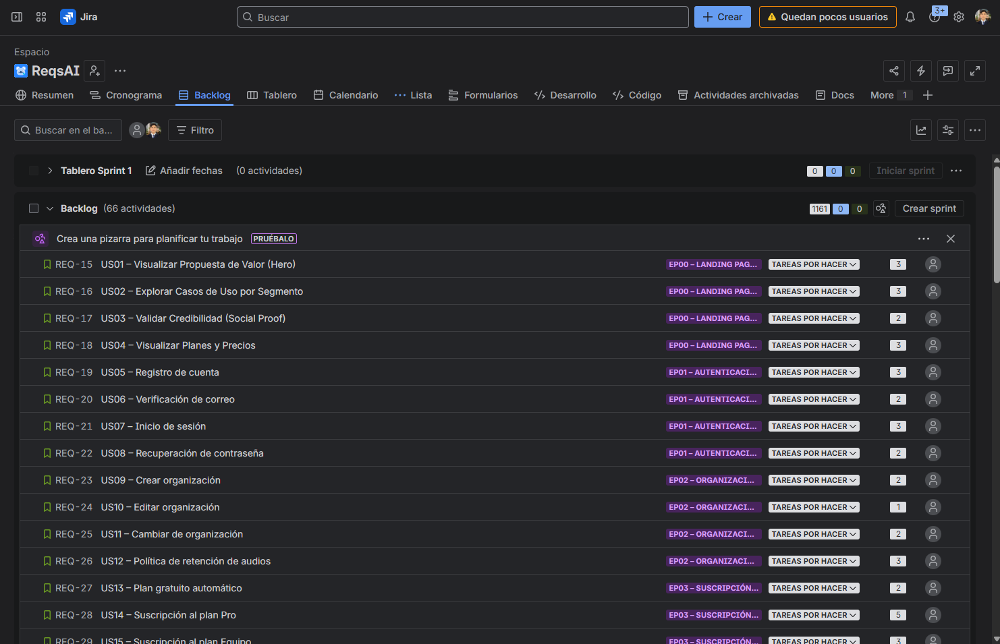

## 3.4. Impact Mapping

En esta sección presentamos el Impact Mapping del modelo de negocio digital de Reqs-AI. Para su elaboración partimos de las user persona definidas previamente, **Miguel Ocampo** y **Diego Alvarado**, y conectamos cada objetivo de negocio con los cambios de comportamiento esperados (impacts), los entregables del producto (deliverables) y las historias de usuario del backlog.

El mapa fue estructurado con **tres Business Goals SMART** para mantener foco estratégico y trazabilidad funcional:

- **G1**: En 4 meses, aumentar la conversión de visitante a cuenta del 3% al 12%, y lograr que el 70% de nuevos usuarios cree su organización y abra el demo en menos de 15 minutos.
- **G2**: En 4 meses, reducir en 40% el tiempo de levantamiento y documentación por reunión, y lograr que el 75% de sesiones se cierre el mismo día con backlog utilizable.
- **G3**: En 6 meses, lograr 100% de organizaciones con control de acceso y retención activa, convertir 15% de organizaciones free a pago y exportar 70% de historias aprobadas a Jira en menos de 5 minutos.

Para cada meta, el mapa diferencia el rol de cada persona: Miguel concentra impactos de gobierno, operación y decisión de negocio; Diego concentra impactos de captura, validación y continuidad del flujo analítico hacia desarrollo. A partir de ello se priorizan deliverables de captación, onboarding, configuración de proyecto, control de calidad y exportación a Jira.

La trazabilidad final se mantiene en formato **Goal -> Persona -> Impact -> Deliverable -> User Story**, usando únicamente historias **US** del Product Backlog para asegurar consistencia entre estrategia y planificación de producto.


[Ver imagen detallada](./assets/user-research/impact-map/impact-map.png)

# Capítulo IV: Strategic-Level Product Design

## 4.1. Strategic-Level Attribute-Driven Design

### 4.1.1. Design Purpose

El propósito del proceso de diseño de Reqs-AI es establecer una arquitectura de software capaz de resolver tecnológicamente la desconexión y pérdida de información que ocurre durante el levantamiento de requisitos. El diseño está concebido como un sistema creado desde cero orientado a construir una solución robusta, escalable y en tiempo real que traduzca la voz del cliente directamente en especificaciones técnicas de alto valor.

Este diseño está directamente orientado a satisfacer las necesidades críticas de nuestros dos segmentos objetivos:
* **Para el Líder Técnico de Startup:** La arquitectura priorizará el rendimiento y la integración (flujos automatizados hacia herramientas como Jira), asegurando agilidad y la reducción del tiempo entre el *discovery* y el desarrollo.
* **Para la Analista Enterprise:** El diseño se centrará en la seguridad y la privacidad de los datos, estableciendo una arquitectura *Multitenancy* con aislamiento de datos estricto (*Row Level Security*), cumpliendo así con las exigencias corporativas y mitigando los riesgos de fuga de información.

A nivel de negocio para la startup Kntro-Soft, el diseño tiene el propósito de habilitar el modelo de distribución SaaS (Software as a Service). La arquitectura debe soportar el sistema de suscripciones y facturación, gestionar los límites de consumo de los motores de IA (LLM) para mantener la rentabilidad, y asegurar que la plataforma pueda escalar el procesamiento de múltiples organizaciones concurrentes sin degradar la experiencia de usuario.

### 4.1.2. Attribute-Driven Design Inputs

En esta sección se presentan las entradas fundamentales requeridas para ejecutar el proceso de diseño arquitectónico basado en el método Attribute-Driven Design (ADD). Estos inputs proporcionan el contexto, las metas y los límites que guiarán la toma de decisiones técnicas para la plataforma Reqs-AI. A continuación, el contenido se divide en tres categorías principales dictadas por la metodología: la funcionalidad primaria, los escenarios de atributos de calidad y las restricciones.

#### 4.1.2.1. Primary Functionality (Primary User Stories)

A continuación, se detallan las Historias de Usuario primarias que tienen el mayor impacto arquitectónico en el diseño de Reqs-AI. Estas funcionalidades han sido seleccionadas porque introducen requerimientos complejos de procesamiento asíncrono (análisis de audio en tiempo real), integración con servicios de Inteligencia Artificial (LLM) y aislamiento estricto de datos (Multitenancy), elementos que dictarán la topología base del sistema.

| Epic / User Story ID | Título                             | Descripción                                                                                                                                                                                     | Criterios de Aceptación                                                                                                                                                                                                                                                          | Relacionado con (Epic ID) |
|:---------------------|:-----------------------------------|:------------------------------------------------------------------------------------------------------------------------------------------------------------------------------------------------|:---------------------------------------------------------------------------------------------------------------------------------------------------------------------------------------------------------------------------------------------------------------------------------|:--------------------------|
| **US11**             | Crear organización                 | Como usuario autenticado sin organización, quiero crear un espacio de trabajo con el nombre de mi empresa, para centralizar proyectos en un entorno separado.                                   | **Given** un usuario autenticado sin organización<br>**When** crea una organización con un nombre válido<br>**Then** el sistema genera el espacio de trabajo<br>**And** asigna al usuario el rol inamovible de 'Propietario'                                                     | EP02                      |
| **US21**             | Cargar documentos del cliente      | Como miembro, quiero subir documentos del cliente al proyecto, para que las historias generadas reflejen el vocabulario del negocio (RAG).                                                      | **Given** un usuario configurando un proyecto<br>**When** sube un glosario en PDF válido<br>**Then** el sistema debe fragmentar (chunking), vectorizar y persistir el documento en una base de datos vectorial en menos de 10 segundos                                           | EP04                      |
| **US37**             | Generación automática de historias | Como analista, quiero que el sistema procese el audio en vivo y redacte automáticamente historias de usuario estructuradas con criterios de aceptación, para ahorrar horas de redacción manual. | **Given** una sesión de captura de audio activa<br>**When** el sistema recibe y transcribe el flujo de voz<br>**Then** el motor de IA procesa el texto generado<br>**And** redacta una historia de usuario en formato Gherkin<br>**And** la añade al backlog de la sesión actual | EP06                      |

**Justificación del Impacto Arquitectónico:**

*   **US11 (Crear organización):** Define el modelo base de multi-tenant y la asignación de ownership; requiere aislamiento de datos, provisión de recursos por organización y reglas consistentes para separar el acceso entre organizaciones.
*   **US21 (Cargar documentos del cliente):** Obliga a definir un pipeline de ingesta asíncrona con chunking, embeddings y almacenamiento vectorial, controlando tiempos de procesamiento, costos y límites por organización.
*   **US37 (Generación automática de historias):** Exige procesamiento en tiempo real con baja latencia, orquestación de STT y LLM, y manejo de estados de sesión y reintentos sin perder datos durante la captura en vivo.

#### 4.1.2.2. Quality attribute Scenarios

En esta sección se definen los escenarios de atributos de calidad más críticos que guiarán las decisiones arquitectónicas de Reqs-AI. Se ha priorizado el Rendimiento (necesario para el procesamiento de audio en tiempo real), la Seguridad (aislamiento de datos), la Disponibilidad (para tolerar fallas externas) y la Modificabilidad (cambio de proveedores de IA).

| Atributo                            | Fuente                              | Estímulo                                                                                                | Artefacto                                | Entorno                                           | Respuesta                                                                                                                                                     | Medida                                                                               |
|:------------------------------------|:------------------------------------|:--------------------------------------------------------------------------------------------------------|:-----------------------------------------|:--------------------------------------------------|:--------------------------------------------------------------------------------------------------------------------------------------------------------------|:-------------------------------------------------------------------------------------|
| **Performance (Streaming)**         | Líder Técnico / Analista Enterprise | El usuario habla durante la sesión de levantamiento de requerimientos.                                  | Motor de Transcripción (STT)             | Operación normal del sistema.                     | El sistema procesa el flujo de audio continuo y renderiza el texto en la interfaz del cliente.                                                                | La transcripción parcial debe aparecer en pantalla en **menos de 2 segundos**.       |
| **Performance (Consolidación)**     | Líder Técnico / Analista Enterprise | El usuario detiene la grabación de la sesión para generar el Gherkin final.                             | Motor de Procesamiento e Integración LLM | Operación normal del sistema.                     | El sistema procesa la transcripción, consulta al LLM y retorna el documento estructurado.                                                                     | El documento final se entrega en **menos de 20 segundos** tras finalizar la sesión.  |
| **Security (Seguridad)**            | Usuario autenticado del Tenant A    | Intenta acceder a través de la API a un ID de proyecto o archivo de audio del Tenant B.                 | API Gateway / Base de Datos              | Operación normal del sistema.                     | El sistema intercepta la petición, verifica el contexto de seguridad (Row Level Security) y deniega el acceso.                                                | El acceso se bloquea el **100% de las veces** y se registra el intento en auditoría. |
| **Availability (Disponibilidad)**   | Proveedor externo de IA (API)       | El servicio del LLM no responde (Timeout) o devuelve un error 500 durante una sesión en vivo.           | Motor de Integración de IA               | Entorno degradado (Falla de dependencia externa). | El sistema persiste la transcripción con estado Pendiente y encola la solicitud en memoria mediante Eventos de Spring asíncronos para reintentar la conexión. | Se recupera la operación con **0 bytes perdidos**.                                   |
| **Modifiability (Modificabilidad)** | Arquitecto de Software              | El negocio decide cambiar de proveedor de LLM (ej. de OpenAI a Anthropic) por un incremento de precios. | Módulo de Integración de IA              | Tiempo de diseño/desarrollo.                      | El desarrollador implementa un nuevo adaptador (Adapter) para la nueva API sin alterar la lógica de negocio core.                                             | El cambio se completa e integra en **menos de 16 horas de desarrollo**.              |

#### 4.1.2.3. Constraints

Esta sección describe las restricciones innegociables impuestas por el modelo de negocio, las capacidades técnicas del equipo y la viabilidad del proyecto. Las principales restricciones incluyen la dependencia de API de LLM externos y el uso del stack tecnológico (Java/Spring Boot y Angular/Vue.js). A continuación, se detallan:

| Constraint ID | Título                               | Descripción                                                                                                                                             | Criterios de Aceptación                                                                                                                                                                              | Relacionado con (Epic ID) |
|:--------------|:-------------------------------------|:--------------------------------------------------------------------------------------------------------------------------------------------------------|:-----------------------------------------------------------------------------------------------------------------------------------------------------------------------------------------------------|:--------------------------|
| **CON-01**    | Stack Tecnológico Backend y Frontend | Como equipo de desarrollo, debemos utilizar Java (Spring Boot) para el backend y Angular o Vue.js para el frontend.                                     | **Given** un nuevo componente a desarrollar<br>**When** el equipo inicie su construcción<br>**Then** el código debe estar escrito en Java 17+ usando Spring Boot o TypeScript usando Angular/Vue.js. | EP01, EP02                |
| **CON-02**    | Uso de APIs de LLM externas          | Como Arquitecto de Software, debo integrar el sistema con APIs de modelos de terceros (ej. OpenAI, Anthropic), ya que no alojaremos modelos propios.    | **Given** la necesidad de generar Gherkin<br>**When** el sistema realice una inferencia<br>**Then** la petición debe enrutarse hacia la API REST del proveedor seleccionado.                         | EP04                      |
| **CON-03**    | Despliegue en Cloud Pública          | Como responsable de infraestructura, debo asegurar que los componentes sean desplegados en la nube (AWS, Azure o GCP), para evitar costos *on-premise*. | **Given** la liberación de una nueva versión<br>**When** se ejecute el pipeline de despliegue<br>**Then** los artefactos deben aprovisionarse en la nube pública seleccionada.                       | Todas                     |

**Justificación de Restricciones:**

*   **CON-01 (Stack Tecnológico Backend y Frontend):** El equipo tiene experiencia consolidada en Java/Spring y frameworks web, lo que reduce curva de aprendizaje y riesgo de entrega.
*   **CON-02 (Uso de API de LLM externas):** Los modelos propios no son viables por costos de infraestructura, mantenimiento y talento especializado para entrenamiento y hosting.
*   **CON-03 (Despliegue en Cloud Pública):** La startup necesita reducir costos de inversión inicial y operar con elasticidad sin invertir en infraestructura propia.

### 4.1.3. Architectural Drivers Backlog

En esta sección se establece el conjunto de Architectural Drivers acordados por el equipo, resultado del proceso iterativo en nuestro Quality Attribute Workshop (QAW). El Architectural Drivers Backlog consolida los Functional Drivers seleccionados (provenientes de las historias de usuario críticas), los Quality Attribute Drivers seleccionados (Performance, Security, Availability, Modifiability) y todos los Constraints del negocio y la tecnología. Todos los Drivers se presentan a continuación, habiendo sido priorizados de forma descendente colocando primero aquellos que representan una Alta importancia para los Stakeholders y un Alto impacto en la Complejidad Técnica de la Arquitectura.

| Driver ID | Título de Driver                                          | Descripción                                                                                                                                                                                                                        | Importancia para Stakeholders (High, Medium, Low) | Impacto en Architecture Technical Complexity (High, Medium, Low) |
|:----------|:----------------------------------------------------------|:-----------------------------------------------------------------------------------------------------------------------------------------------------------------------------------------------------------------------------------|:--------------------------------------------------|:-----------------------------------------------------------------|
| **AD-01** | Procesamiento de Audio en Tiempo Real e Integración LLM   | El sistema debe ingestar flujos continuos de audio (STT) en <2s y consolidar la inferencia del modelo LLM (Gherkin) en <20s, gestionando operaciones asíncronas durante las reuniones.                                             | High                                              | High                                                             |
| **AD-02** | Arquitectura Multitenancy y Aislamiento de Datos          | El diseño debe garantizar la separación estricta de la información (Row Level Security) entre organizaciones corporativas, denegando el 100% de los accesos cruzados.                                                              | High                                              | High                                                             |
| **AD-03** | Tolerancia a Fallos en Servicios de IA Externos           | El sistema debe ser capaz de soportar caídas de las APIs de IA (Timeout/5xx) sin perder datos, procesando las sesiones de forma asíncrona mediante el patrón Observer (Eventos de Spring) y control de estado en la Base de Datos. | High                                              | High                                                             |
| **AD-04** | Dependencia Estricta de APIs de LLM Externas              | Todo el procesamiento de inteligencia generativa dependerá de proveedores externos, lo que obliga al diseño a gestionar *rate limits* y costos operativos.                                                                         | High                                              | High                                                             |
| **AD-05** | Ingesta de Contexto del Cliente y Motor RAG               | El sistema debe fragmentar (chunking) y vectorizar los PDFs de contexto de las empresas en <10s para proveer Retrieval-Augmented Generation en las inferencias.                                                                    | High                                              | Medium                                                           |
| **AD-06** | Modificabilidad de Proveedores de Inteligencia Artificial | La arquitectura debe ser agnóstica al proveedor del LLM, permitiendo el reemplazo de la API de IA (ej. de OpenAI a Anthropic) en <16 horas de desarrollo mediante adaptadores.                                                     | High                                              | Medium                                                           |
| **AD-07** | Despliegue en Cloud Pública                               | Todos los componentes deben ser contenerizados y desplegados en una nube pública como AWS o Azure para minimizar costos *on-premise* y permitir la escalabilidad.                                                                  | Medium                                            | Medium                                                           |
| **AD-08** | Stack Tecnológico Base de Desarrollo                      | El backend debe desarrollarse en Java (Spring Boot) y el frontend en Angular/Vue.js debido al conocimiento técnico previo del equipo, limitando la adopción de otros lenguajes core.                                               | Medium                                            | Low                                                              |

### 4.1.4. Architectural Design Decisions

En esta sección se detalla el proceso seguido durante las iteraciones (Stages) del *Quality Attribute Workshop* para definir la arquitectura de Reqs-AI. En cada etapa, el equipo enfrentó un conjunto específico de *Architectural Drivers* y evaluó distintos patrones o tácticas de diseño, sopesando sus pros y contras (Trade-offs) para asegurar que la solución cumpla con los atributos de calidad exigidos sin incurrir en *over-engineering* para la etapa actual de la startup.

**Iteración 1: Topología Base y Multitenancy (Drivers: AD-02, AD-07, AD-08)**
En esta primera iteración se evaluó la estructura general del backend y cómo gestionar el aislamiento de datos. Se descartó la arquitectura de Microservicios por su alta complejidad operativa, optando por un **Monolito Modular** en Spring Boot (AD-08). Para resolver la separación de datos entre empresas (AD-02), se debatió entre *Database-per-Tenant* y *Shared-Database*. Se eligió la base de datos compartida aplicando políticas estrictas de **Row Level Security (RLS)** a nivel de base de datos (ej. PostgreSQL), lo que garantiza el aislamiento del 100% de la información mientras se optimizan los costos de despliegue en la nube (AD-07).

**Iteración 2: Ingesta de Audio en Tiempo Real y Tolerancia a Fallos (Drivers: AD-01, AD-03)**
El reto principal fue cumplir con la latencia <2 s para la transcripción en vivo (AD-01). Se evaluó REST Polling, Server-Sent Events (SSE) y WebSockets. Se eligió **WebSockets** por permitir una comunicación bidireccional continua (necesaria para mandar fragmentos de audio al server y recibir texto del STT simultáneamente). Para la tolerancia a fallos ante caídas de las API de IA (AD-03), se descartó la complejidad de un **Message Broker externo** y se adoptó el uso de **Colas en Memoria RAM (Patrón Observer)** junto con persistencia de estado en la Base de Datos, optimizando la latencia y reduciendo costos de infraestructura en el MVP.

**Iteración 3: Integración RAG y Modificabilidad de IA (Drivers: AD-04, AD-05, AD-06)**
Finalmente, el equipo abordó cómo evitar el acoplamiento con las API de IA de terceros y cómo lograr el RAG rápido (AD-05). Se descartó la Arquitectura en Capas tradicional a favor de una **Arquitectura Hexagonal (Ports and Adapters)**. Esto permite encapsular las reglas de negocio del *Prompt Engineering* en el dominio, dejando a OpenAI o Anthropic como simples "adaptadores", cumpliendo la meta de intercambiabilidad en <16 h (AD-06). Para el almacenamiento del contexto del cliente, se eligió una **Base de Datos Vectorial** (ej. pgvector) superando las limitaciones de búsqueda semántica de las BD relacionales tradicionales.

**Candidate Pattern Evaluation Matrix**

La siguiente matriz resume la evaluación de los patrones candidatos considerados para los Drivers más críticos, justificando técnica y económicamente la decisión final del equipo.

| Driver ID | Título de Driver                          | Pattern 1                                                                                                                                                                                                                                                                                                                                                 | Pattern 2                                                                                                                                                                                                                                                                                                                                      | Pattern 3                                                                                                                                                                                                                |
|:----------|:------------------------------------------|:----------------------------------------------------------------------------------------------------------------------------------------------------------------------------------------------------------------------------------------------------------------------------------------------------------------------------------------------------------|:-----------------------------------------------------------------------------------------------------------------------------------------------------------------------------------------------------------------------------------------------------------------------------------------------------------------------------------------------|:-------------------------------------------------------------------------------------------------------------------------------------------------------------------------------------------------------------------------|
| **AD-01** | Procesamiento de Audio en Tiempo Real     | **REST Long Polling**<br>**Pro:** Fácil implementación inicial.<br>**Con:** Genera una alta latencia de red e interrumpe el flujo continuo del audio, incumpliendo la meta de <2s. *(Descartado)*                                                                                                                                                         | **WebSockets** *(Elegido)*<br>**Pro:** Comunicación bidireccional y persistente, latencia casi nula para *streaming* de audio a texto.<br>**Con:** Añade complejidad al manejo de estados y balanceo de carga.                                                                                                                                 | **Server-Sent Events (SSE)**<br>**Pro:** Excelente para enviar texto del servidor al cliente con soporte HTTP nativo.<br>**Con:** Es unidireccional. No sirve para que el cliente envíe su audio en vivo. *(Descartado)* |
| **AD-02** | Arquitectura Multitenancy y Aislamiento   | **Database per Tenant**<br>**Pro:** Aislamiento físico de datos impecable. Fácil restauración.<br>**Con:** Costos exorbitantes para una startup si la plataforma escala a miles de pequeñas empresas. *(Descartado)*                                                                                                                                      | **Shared Database con Row Level Security** *(Elegido)*<br>**Pro:** Maximiza la economía de infraestructura. El motor (PostgreSQL) asegura que un inquilino jamás vea datos ajenos.<br>**Con:** Un error en la configuración de la política expone a todos.                                                                                     | *(No se evaluó un 3er patrón)*                                                                                                                                                                                           |
| **AD-03** | Tolerancia a Fallos en Servicios Externos | **Cola en Memoria RAM local (Patrón Observer con @Async)** *(Elegido)*<br>**Pro:** Muy rápido (latencia mínima), simplicidad de código y no requiere aprovisionar infraestructura extra (RabbitMQ/Kafka).<br>**Con:** Si el servidor se reinicia abruptamente, los eventos en memoria se pierden, por lo que el estado debe respaldarse en Base de Datos. | **Message Broker Persistente (ej. RabbitMQ / Kafka)** *(Descartado)*<br>**Pro:** Garantiza la durabilidad total de los mensajes y retries automáticos si el pod falla.<br>**Con:** Exceso de ingeniería (Overengineering) para la etapa actual del proyecto. Requiere aprovisionar, configurar y pagar por otro componente pesado en el cloud. | *(No se evaluó un 3er patrón)*                                                                                                                                                                                           |
| **AD-06** | Modificabilidad de Proveedores IA         | **Arquitectura Monolítica en Capas**<br>**Pro:** Modelo mental simple para el equipo (Controllers, Services, Repositories).<br>**Con:** Lógica de negocio altamente acoplada al SDK del proveedor de IA. Tomaría semanas migrar. *(Descartado)*                                                                                                           | **Arquitectura Hexagonal (Ports & Adapters)** *(Elegido)*<br>**Pro:** El dominio ignora qué IA se usa. Cambiar a Anthropic solo exige escribir un nuevo Adapter para el Port correspondiente en <16h.<br>**Con:** Exige escribir más código *boilerplate* y dominar Inyección de Dependencias.                                                 | *(No se evaluó un 3er patrón)*                                                                                                                                                                                           |

### 4.1.5. Quality Attribute Scenario Refinements

Tras finalizar las iteraciones del *Quality Attribute Workshop* y definir los patrones arquitectónicos base (WebSockets para el streaming, Shared DB con Row Level Security para el multitenancy, y Arquitectura Orientada Eventos en Memoria para la tolerancia a fallos), procedemos a refinar los escenarios de atributos de calidad priorizados. Estos refinamientos incorporan los artefactos tecnológicos que ahora conocemos y mapean directamente los escenarios con los objetivos de negocio (Business Goals) de la plataforma SaaS, identificando además las preguntas abiertas y riesgos remanentes (Issues).

A continuación, se presenta la versión final de los escenarios refinados en orden de prioridad.

<br>

<table style="width: 100%; border: 1px solid; border-collapse: collapse;">
  <tr>
    <th colspan="2" style="text-align: left; padding: 8px;">Scenario Refinement for Scenario 1</th>
    <th style="padding: 8px;">Procesamiento de Audio en Tiempo Real (Streaming)</th>
  </tr>
  <tr>
    <td colspan="2" style="padding: 8px;"><strong>Scenario(s):</strong></td>
    <td style="padding: 8px;">Procesamiento asíncrono y bidireccional de audio durante la reunión en vivo.</td>
  </tr>
  <tr>
    <td colspan="2" style="padding: 8px;"><strong>Business Goals:</strong></td>
    <td style="padding: 8px;">Garantizar una experiencia de usuario fluida y sin fricciones que posicione a Reqs-AI como una herramienta no intrusiva y veloz, fomentando la adopción temprana por parte de Startups.</td>
  </tr>
  <tr>
    <td colspan="2" style="padding: 8px;"><strong>Relevant Quality Attributes:</strong></td>
    <td style="padding: 8px;">Performance, Usability</td>
  </tr>
  <tr>
    <td style="width: 15%; padding: 8px;"></td>
    <td style="width: 25%; padding: 8px;"><strong>Stimulus:</strong></td>
    <td style="padding: 8px;">El usuario habla de forma continua durante la sesión de levantamiento de requerimientos.</td>
  </tr>
  <tr>
    <td rowspan="5" style="vertical-align: top; padding: 8px;"><strong>Scenario<br>Components</strong></td>
    <td style="padding: 8px;"><strong>Stimulus Source:</strong></td>
    <td style="padding: 8px;">Líder Técnico / Analista Enterprise.</td>
  </tr>
  <tr>
    <td style="padding: 8px;"><strong>Environment:</strong></td>
    <td style="padding: 8px;">Operación normal del sistema, con conexión a internet estable.</td>
  </tr>
  <tr>
    <td style="padding: 8px;"><strong>Artifact (if Known):</strong></td>
    <td style="padding: 8px;">Servidor de WebSockets y Motor STT (Speech-to-Text).</td>
  </tr>
  <tr>
    <td style="padding: 8px;"><strong>Response:</strong></td>
    <td style="padding: 8px;">El sistema ingesta el flujo de audio a través del canal WebSocket abierto y retorna transcripciones parciales asíncronas al cliente.</td>
  </tr>
  <tr>
    <td style="padding: 8px;"><strong>Response Measure:</strong></td>
    <td style="padding: 8px;">La transcripción parcial aparece en pantalla en <strong>&lt; 2 segundos</strong>.</td>
  </tr>
  <tr>
    <td colspan="2" style="padding: 8px;"><strong>Questions:</strong></td>
    <td style="padding: 8px;">¿Cuál es el impacto en la memoria RAM del servidor al mantener cientos de conexiones WebSocket concurrentes abiertas durante horas?</td>
  </tr>
  <tr>
    <td colspan="2" style="padding: 8px;"><strong>Issues:</strong></td>
    <td style="padding: 8px;">Posibles desconexiones abruptas de WebSockets en redes corporativas (Enterprise) que utilizan firewalls o proxies estrictos.</td>
  </tr>
</table>

<br>

<table style="width: 100%; border: 1px solid; border-collapse: collapse;">
  <tr>
    <th colspan="2" style="text-align: left; padding: 8px;">Scenario Refinement for Scenario 2</th>
    <th style="padding: 8px;">Arquitectura Multitenancy y Aislamiento de Datos</th>
  </tr>
  <tr>
    <td colspan="2" style="padding: 8px;"><strong>Scenario(s):</strong></td>
    <td style="padding: 8px;">Prevención de acceso no autorizado a datos transaccionales de otra organización.</td>
  </tr>
  <tr>
    <td colspan="2" style="padding: 8px;"><strong>Business Goals:</strong></td>
    <td style="padding: 8px;">Cumplir con estrictas normativas de privacidad corporativa para lograr cerrar contratos B2B de alto valor con clientes del segmento Enterprise.</td>
  </tr>
  <tr>
    <td colspan="2" style="padding: 8px;"><strong>Relevant Quality Attributes:</strong></td>
    <td style="padding: 8px;">Security, Data Privacy</td>
  </tr>
  <tr>
    <td style="width: 15%; padding: 8px;"></td>
    <td style="width: 25%; padding: 8px;"><strong>Stimulus:</strong></td>
    <td style="padding: 8px;">Intento de lectura/escritura a través de la API hacia un ID de proyecto o archivo de audio que pertenece a otro inquilino (Tenant).</td>
  </tr>
  <tr>
    <td rowspan="5" style="vertical-align: top; padding: 8px;"><strong>Scenario<br>Components</strong></td>
    <td style="padding: 8px;"><strong>Stimulus Source:</strong></td>
    <td style="padding: 8px;">Usuario autenticado malintencionado o error de enrutamiento en el frontend.</td>
  </tr>
  <tr>
    <td style="padding: 8px;"><strong>Environment:</strong></td>
    <td style="padding: 8px;">Operación normal, sistema bajo ataque o durante auditoría de seguridad.</td>
  </tr>
  <tr>
    <td style="padding: 8px;"><strong>Artifact (if Known):</strong></td>
    <td style="padding: 8px;">API Gateway, Spring Security y Base de Datos PostgresSQL (Shared DB con RLS).</td>
  </tr>
  <tr>
    <td style="padding: 8px;"><strong>Response:</strong></td>
    <td style="padding: 8px;">El filtro RLS de la base de datos deniega la lectura, la API retorna un error 403 Forbidden y el evento se guarda en los logs de auditoría.</td>
  </tr>
  <tr>
    <td style="padding: 8px;"><strong>Response Measure:</strong></td>
    <td style="padding: 8px;">El acceso se bloquea el <strong>100% de las veces</strong> sin fugas de información.</td>
  </tr>
  <tr>
    <td colspan="2" style="padding: 8px;"><strong>Questions:</strong></td>
    <td style="padding: 8px;">¿Cómo afecta la validación de políticas RLS al rendimiento de las consultas complejas (JOIN) cuando la tabla principal supere el millón de registros?</td>
  </tr>
  <tr>
    <td colspan="2" style="padding: 8px;"><strong>Issues:</strong></td>
    <td style="padding: 8px;">Un error humano del DBA al configurar una nueva política RLS podría exponer datos cruzados masivamente si no hay pruebas automatizadas que lo verifiquen.</td>
  </tr>
</table>

<br>

<table style="width: 100%; border: 1px solid; border-collapse: collapse;">
  <tr>
    <th colspan="2" style="text-align: left; padding: 8px;">Scenario Refinement for Scenario 3</th>
    <th style="padding: 8px;">Tolerancia a Fallos en Servicios de IA</th>
  </tr>
  <tr>
    <td colspan="2" style="padding: 8px;"><strong>Scenario(s):</strong></td>
    <td style="padding: 8px;">Caída o timeout del proveedor externo de Inteligencia Artificial (OpenAI / Anthropic).</td>
  </tr>
  <tr>
    <td colspan="2" style="padding: 8px;"><strong>Business Goals:</strong></td>
    <td style="padding: 8px;">Evitar la pérdida irreversible de la información capturada en las reuniones para mantener la confianza absoluta de los clientes y minimizar la tasa de abandono (churn rate).</td>
  </tr>
  <tr>
    <td colspan="2" style="padding: 8px;"><strong>Relevant Quality Attributes:</strong></td>
    <td style="padding: 8px;">Availability, Reliability</td>
  </tr>
  <tr>
    <td style="width: 15%; padding: 8px;"></td>
    <td style="width: 25%; padding: 8px;"><strong>Stimulus:</strong></td>
    <td style="padding: 8px;">El servicio del LLM no responde (Timeout) o devuelve un error 5xx durante la fase crítica de consolidación de historias.</td>
  </tr>
  <tr>
    <td rowspan="5" style="vertical-align: top; padding: 8px;"><strong>Scenario<br>Components</strong></td>
    <td style="padding: 8px;"><strong>Stimulus Source:</strong></td>
    <td style="padding: 8px;">Proveedor externo de API de Inteligencia Artificial.</td>
  </tr>
  <tr>
    <td style="padding: 8px;"><strong>Environment:</strong></td>
    <td style="padding: 8px;">Entorno degradado (Falla crítica de dependencia externa).</td>
  </tr>
  <tr>
    <td style="padding: 8px;"><strong>Artifact (if Known):</strong></td>
    <td style="padding: 8px;">Módulo de Integración de IA (Adapter Hexagonal) y ApplicationEventPublisher de Spring Boot.</td>
  </tr>
  <tr>
    <td style="padding: 8px;"><strong>Response:</strong></td>
    <td style="padding: 8px;">El sistema marca el registro como PENDIENTE en base de datos, encola el evento en memoria (@Async), notifica al usuario en la UI ("En proceso diferido") y aplica reintentos.</td>
  </tr>
  <tr>
    <td style="padding: 8px;"><strong>Response Measure:</strong></td>
    <td style="padding: 8px;">Se recupera la operación y persiste el texto con <strong>0 bytes perdidos</strong>.</td>
  </tr>
  <tr>
    <td colspan="2" style="padding: 8px;"><strong>Questions:</strong></td>
    <td style="padding: 8px;">¿Cómo garantizamos que un reinicio no planificado del servidor Spring Boot retome automáticamente las tareas marcadas como PENDIENTES en la Base de Datos?</td>
  </tr>
  <tr>
    <td colspan="2" style="padding: 8px;"><strong>Issues:</strong></td>
    <td style="padding: 8px;">Si el servidor reinicia durante un pico de peticiones concurrentes, los eventos asíncronos en RAM se perderán, requiriendo un job de reconciliación en base de datos al arrancar.</td>
  </tr>
</table>

## 4.2. Strategic-Level Domain-Driven Design

### 4.2.1. EventStorming

Para establecer una base sólida en el diseño guiado por el dominio (DDD) y facilitar el descubrimiento de nuestros Bounded Contexts, el equipo de Kntro-Soft llevó a cabo una sesión de **Design-Level Event Storming** utilizando la herramienta colaborativa Miro. La sesión tuvo una duración aproximada de 2 horas. El objetivo principal fue transicionar del espacio del problema (entendido en los capítulos anteriores) al espacio de la solución, mapeando la línea de tiempo completa del negocio de Reqs-AI. Al utilizar un enfoque de nivel de diseño, pudimos no solo explorar los eventos que ocurren en el sistema (como la captura de audio o la generación de Gherkin), sino también agrupar lógicamente las reglas de negocio para descubrir los Agregados (Aggregates) estructurales del código antes de definir las fronteras de los subdominios.

La sesión se estructuró siguiendo una agenda iterativa para construir el modelo de forma progresiva:

**1. Domain Events:** Iniciamos la sesión identificando en post-its naranjas los hechos relevantes que ocurren en el sistema (escritos como verbos en participio pasado). En esta etapa inicial nos centramos únicamente en la lluvia de ideas de todos los eventos posibles sin preocuparnos por el orden temporal exacto.


**2. Timeline:** Una vez identificados los eventos, procedimos a organizarlos cronológicamente, creando una línea de tiempo lógica que abarca desde el registro de la organización hasta la exportación de las historias de usuario aprobadas.

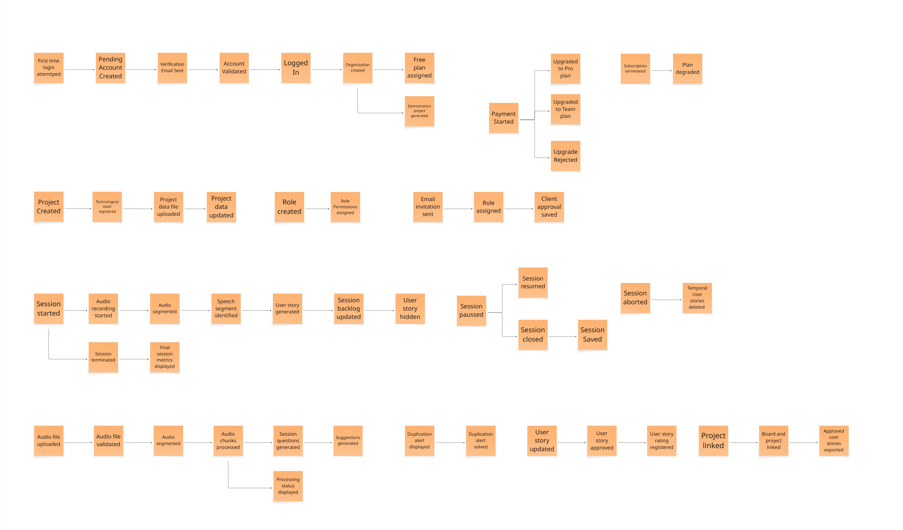

**3. Pain Points:** Con la línea de tiempo establecida, analizamos el flujo para identificar cuellos de botella, problemas potenciales o áreas de fricción (representados visualmente para destacar conflictos en el dominio). Esto nos ayudó a visualizar dónde el sistema requería atención especial.

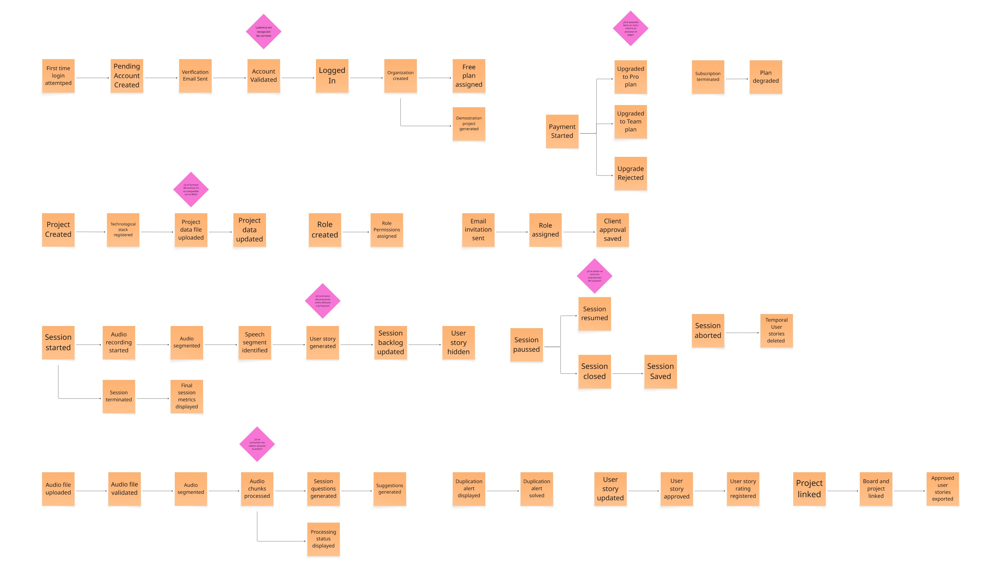

**4. Pivotal Points:** Marcamos los eventos cruciales que representan cambios de estado significativos o transiciones importantes en el ciclo de vida del negocio (por ejemplo, el momento en que se completa el pago o se genera la historia de usuario).

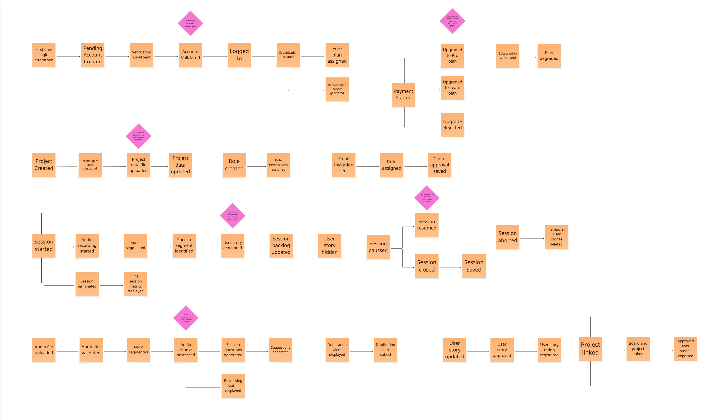

**5. Commands and Actors:** A la izquierda de los eventos, colocamos post-its azules que representan la acción o intención (comandos) que provoca dicho evento. Además, identificamos qué o quién ejecuta estos comandos utilizando post-its amarillos pequeños para los actores humanos (como el Líder Técnico o el Analista Enterprise).


**6. Policies:** Para las acciones automatizadas o lógicas reactivas del sistema, utilizamos post-its lilas representando las políticas. **Es importante destacar que en esta etapa es donde se diseñan las soluciones automáticas y reglas de negocio para resolver los Pain Points identificados anteriormente. Por esta razón, los marcadores de Pain Points desaparecen de los diagramas en los siguientes pasos, ya que el diseño del flujo y las políticas han mitigado esos problemas.**

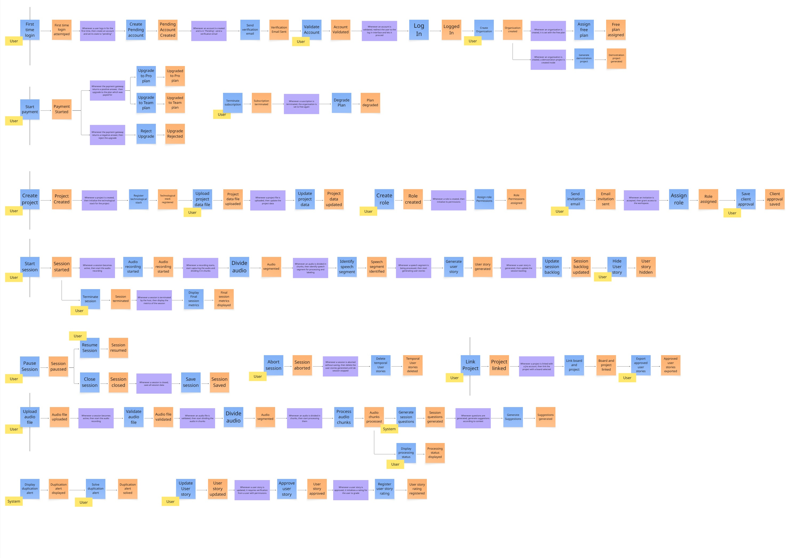

**7. Read Models:** Insertamos post-its verdes detallando la información necesaria que el usuario debe visualizar antes de tomar una decisión o ejecutar un comando (por ejemplo, el Dashboard de Consumo de Tokens o la vista de transcripción).

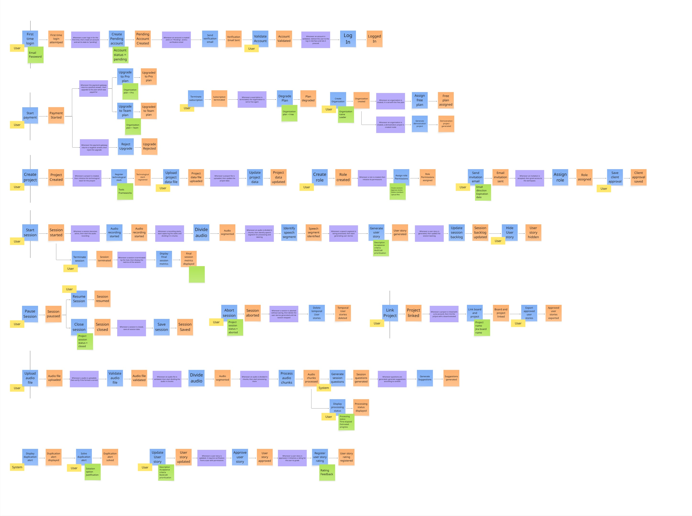

**8. External Services:** Mapeamos las dependencias críticas de Reqs-AI utilizando post-its rosados. Los colocamos entre los comandos y los eventos cuando la acción delega responsabilidad a un tercero (API de IA para LLM, pasarela de pago para Billing, y API de Jira para exportación).

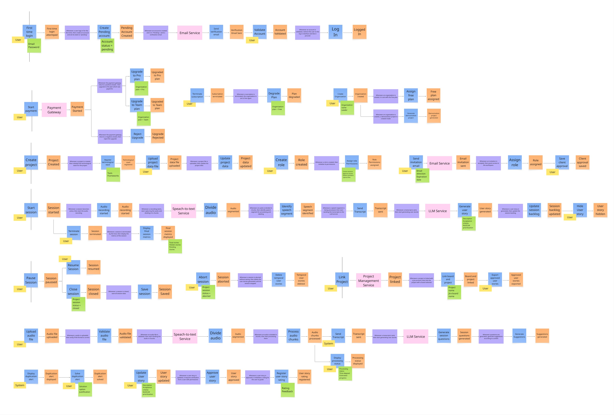

**9. Aggregates:** Como última capa de agrupación estructural, añadimos post-its amarillos grandes alrededor de los comandos, eventos y modelos de lectura asociados para documentar los Agregados (Aggregates). Estos definen las entidades transaccionales clave y las fronteras de consistencia de datos dentro del dominio.

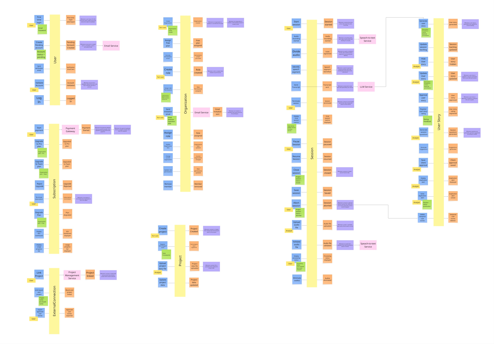

El resultado de la sesión de Design-Level Event Storming fue un mapa exhaustivo y altamente estructurado del dominio de Reqs-AI. Pasamos de una simple lluvia de ideas a un conjunto de Agregados claramente definidos.

El paso final metodológico del Event Storming, que consiste en agrupar estos Agregados dentro de las fronteras lógicas de los Bounded Contexts correspondientes, se abordará en detalle en la siguiente sección, donde evaluaremos las relaciones semánticas y cohesivas para definir la arquitectura final del dominio.

### 4.2.2. Candidate Context Discovery

A partir del dominio modelado en nuestra sesión de EventStorming, el equipo llevó a cabo un taller colaborativo de descubrimiento de contextos (Candidate Context Discovery) de aproximadamente 2 horas. El objetivo de esta fase fue trazar fronteras lógicas alrededor de los Agregados identificados previamente, con el fin de descomponer el sistema en módulos altamente cohesivos y con bajo acoplamiento (Bounded Contexts).

Para lograr esto, aplicamos rigurosamente tres heurísticas de Domain-Driven Design recomendadas por la industria (Alberto Brandolini y Nick Tune). Tras una reciente refactorización arquitectónica para evitar el anti-patrón de "Nano-Servicios" y mejorar la cohesión, consolidamos nuestro diseño. A continuación, se explica la aplicación de cada heurística:

**1. Aplicación de "Start-with-value"**
Comenzamos el análisis preguntándonos: *¿Por qué partes del sistema pagarían nuestros clientes?* La propuesta de valor radica en capturar reuniones y transformarlas mediante IA en historias de usuario estructuradas.
*   Decidimos agrupar los agregados Session (manejo de WebSockets/Audio) y User Story (Prompts y LLM) en un único y potente Core Domain llamado **Requirement Discovery**. Esto cohesiona todo el flujo de valor principal (Value Stream) bajo un mismo techo, minimizando la latencia de red entre la captura y el análisis.

**2. Aplicación de "Look-for-pivotal-events"**
Buscamos los Eventos Pivote que marcan hitos críticos en la vida del cliente.
*   *Eventos: "Account Validated", "Organization Created" y "Project Created":* Extraímos el agregado User hacia un **IAM** independiente. Por otro lado, dado que un proyecto solo tiene sentido dentro de la estructura de una empresa, agrupamos Organization y Project en un solo contexto cohesionado llamado **Workspace Management**.
*   *Evento: "Upgraded to Pro Plan":* Involucra pasarelas de pago y cuotas. Aislamos el agregado Subscription en el **Billing & Subscription**.

**3. Aplicación de "Start-with-simple"**
Evaluamos las integraciones postprocesamiento.
*   Después de que las historias son generadas, deben enviarse a plataformas externas (ej. Jira). Para proteger nuestro Core Domain de los constantes cambios en las API de terceros, aplicamos el patrón Anti-Corruption Layer (ACL) aislando el agregado ExternalConnection en el **Integration Gateway**.

**Resumen de Bounded Contexts Descubiertos**
A través de este proceso analítico y evolutivo, el sistema quedó dividido arquitectónicamente en los siguientes 5 Candidate Bounded Contexts:

| Bounded Context               | Tipo de Subdominio   | Agregado(s) Principal(es) | Responsabilidad Principal                                                                                                  |
|:------------------------------|:---------------------|:--------------------------|:---------------------------------------------------------------------------------------------------------------------------|
| **1. Requirement Discovery**  | Core Domain          | Session, User Story       | Ingesta de audio (WebSockets), inferencia mediante LLMs, fragmentación de contexto (RAG) y generación del formato Gherkin. |
| **2. Workspace Management**   | Generic Subdomain    | Organization, Project     | Aislamiento Multitenant (Row Level Security), gestión de proyectos, roles corporativos y almacenamiento de glosarios.      |
| **3. IAM**                    | Generic Subdomain    | User                      | Autenticación, registro, validación de correo y gestión de credenciales seguras.                                           |
| **4. Billing & Subscription** | Generic Subdomain    | Subscription              | Integración con pasarelas de pago, upgrades/downgrades de planes y monitoreo de consumo de cuotas/tokens.                  |
| **5. Integration Gateway**    | Supporting Subdomain | ExternalConnection        | Capa Anticorrupción (ACL) para autorizar credenciales (OAuth) y exportar historias hacia herramientas externas como Jira.  |


### 4.2.3. Domain Message Flows Modeling

En esta sección, aplicamos una variante técnica de Domain Storytelling enfocado en el flujo de mensajes para evidenciar cómo colaboran los 5 Bounded Contexts consolidados (**Requirement Discovery**, **Workspace Management**, **IAM**, **Billing & Subscription**, e **Integration Gateway**) y así resolver los casos principales del negocio.

Utilizamos una notación específica para modelar la interacción:
*   **Actor:** Persona interactuando con el sistema.
*   **Bounded Context:** Módulo lógico de nuestro dominio.
*   **System:** Sistemas o dependencias externas.
*   **Command:** Intención de hacer algo (color azul).
*   **Event:** Hecho que ya ocurrió (color naranja).
*   **Query:** Solicitud de información (color verde).
*   **Direction of message:** Flecha que indica el flujo del emisor al receptor.

A continuación, detallamos los escenarios elaborados.

**Escenario 1: Captura de sesión y generación de historias (Core Flow)**

Este flujo describe la colaboración principal desde que el usuario inicia la grabación de la reunión hasta que se estructuran las historias de usuario con la Inteligencia Artificial.

1. **Inicio y Procesamiento:** El Actor **Product Owner** envía el Command **Start Session** al Bounded Context **Requirement Discovery**. Este contexto gestiona el streaming enviando el Command **Divide Audio** al System **STT Service**, que retorna progresivamente el Event **Speech segments identified**.
2. **Recopilación de Contexto (RAG):** Una vez finalizada la sesión, **Requirement Discovery** necesita los datos y reglas de negocio del cliente, por lo que envía una Query **Request Project Data** a **Workspace Management**, recibiendo el Event **Project data sent** (que incluye el glosario).
3. **Inferencia IA:** Con el texto de la reunión y el contexto listos, **Requirement Discovery** envía el Command **Generate User story** al System **LLM Service**. Se consolida el resultado emitiendo el Event final **User story generated** para que el Product Owner lo revise.

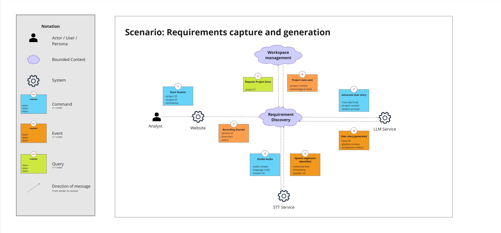

**Escenario 2: Suscripción y mejora de organización**

Este flujo se enfoca estrictamente en la coreografía arquitectónica que ocurre cuando una organización decide adquirir un plan de pago. Demuestra cómo el sistema reacciona para actualizar las capacidades del entorno sin necesidad de intervención manual de un administrador.

1. **Solicitud de Suscripción:** El Actor **Tech Lead** envía el Command **Request Pro Upgrade** a **Billing & Subscription**.
2. **Procesamiento Externo:** **Billing & Subscription** delega la transacción enviando el Command **Process Payment** al System **Payment Gateway**. El sistema externo válido y retorna el resultado.
3. **Propagación de Beneficios:** Una vez consolidado el pago, **Billing & Subscription** emite el Event **Upgraded to Pro Plan**.
4. **Aprovisionamiento Automático:** El contexto **Workspace Management** escucha este evento y reacciona automáticamente actualizando los límites operativos de la organización.

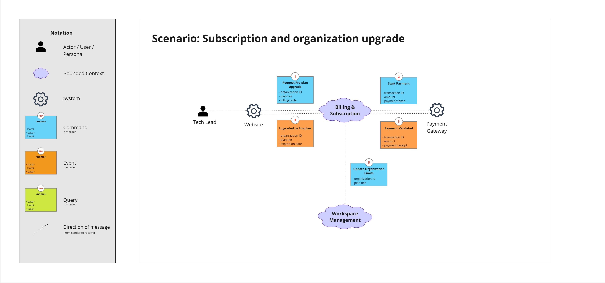

**Escenario 3: Sincronización Ágil (Exportación a Jira)**

Este es un flujo netamente operativo y postprocesamiento. Ocurre después de que el usuario ya utilizó el sistema core y desea llevar el resultado final hacia sus herramientas de gestión de proyectos.

1. **Aprobación:** Tras haber revisado las historias generadas por la IA, el Actor **Tech Lead** envía el Command **Approve Story** a **Requirement Discovery**.
2. **Propagación:** El contexto core registra el cambio y emite el Event **Story Approved**.
3. **Capa Anticorrupción:** El evento es escuchado por el **Integration Gateway**. Este contexto actúa como ACL (aislando al core domain de los detalles de API externas), mapea el modelo interno al formato esperado por el sistema externo, y envía el Command **Create Issue** al System **PM Service**.
4. **Confirmación y Retorno:** El System **PM Service** responde exitosamente con los datos del ticket. El **Integration Gateway** traduce esta respuesta al lenguaje de nuestro dominio y emite el Event **Story Exported**.

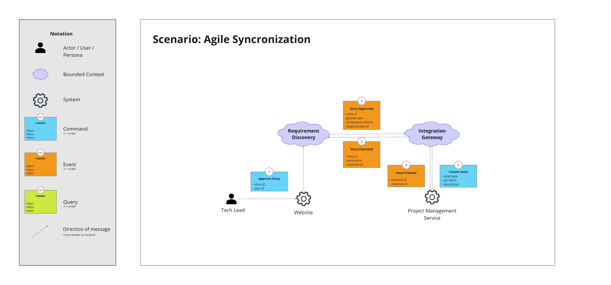

### 4.2.4. Bounded Context Canvases

En esta sección el equipo diseña sus candidate bounded contexts, detallando los criterios de diseño. El equipo seleccionó cada bounded context, por orden de importancia, para elaborar su Bounded Context Canvas.

**1. Requirement Discovery**

Motor central de la plataforma responsable de ingerir el audio de las reuniones en tiempo real, orquestar la transcripción y aplicar Inteligencia Artificial con contexto (RAG) para generar historias de usuario estructuradas en formato Gherkin.

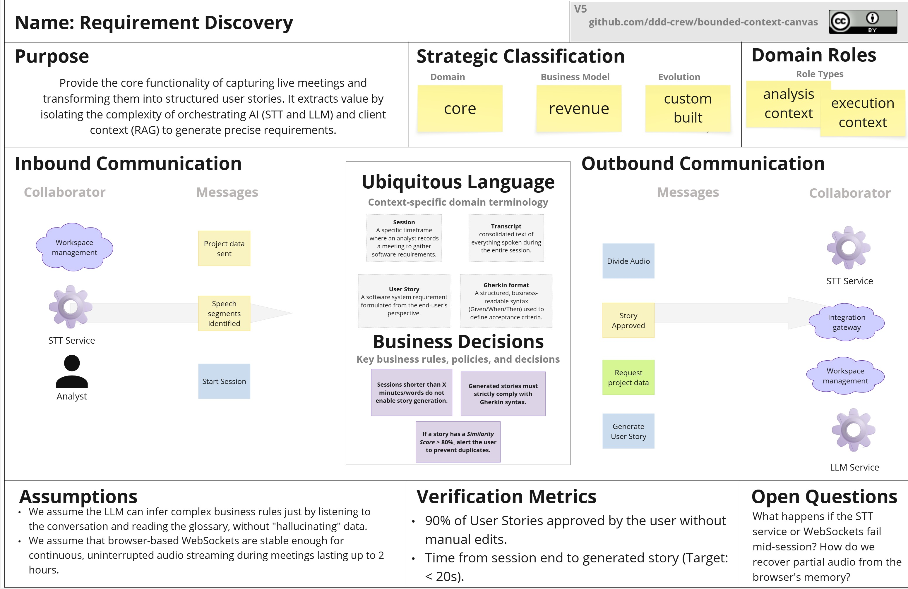

**2. Workspace Management**

Módulo organizativo que garantiza el aislamiento de datos (Multitenancy), gestiona la jerarquía corporativa (proyectos) y almacena el conocimiento específico del cliente (Glosarios) para contextualizar la IA.

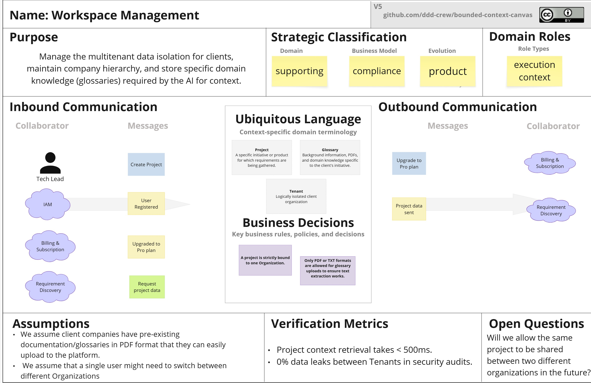

**3. Identity and Access Management**

Este contexto asegura el acceso a la plataforma mediante autenticación y gestión de usuarios.

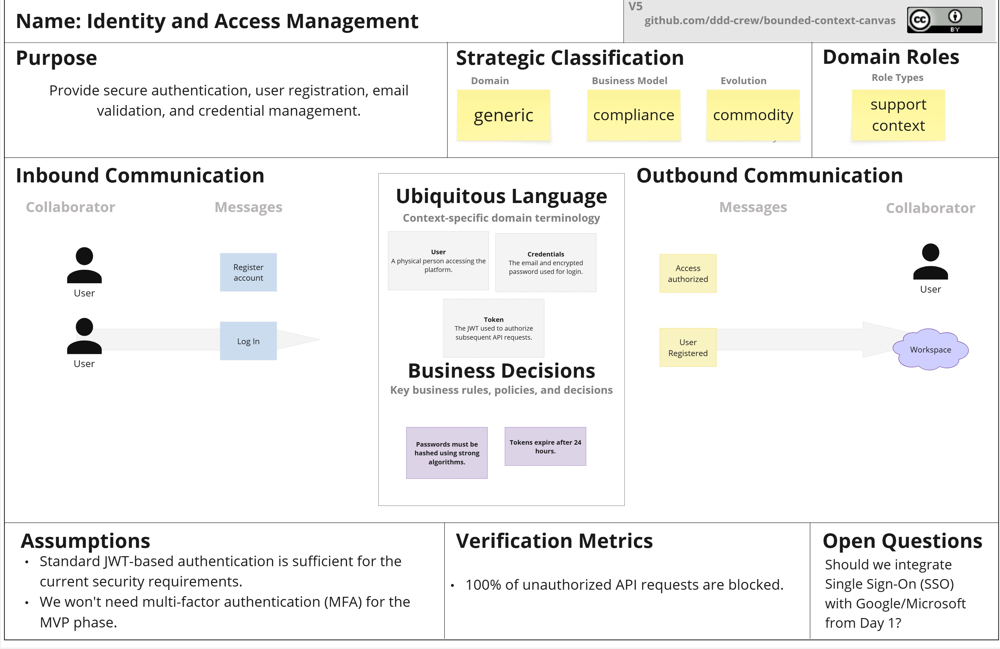

**4. Billing & Subscription**

Este contexto monitorea el uso de las cuotas de IA y gestiona los pagos recurrentes integrando pasarelas externas.

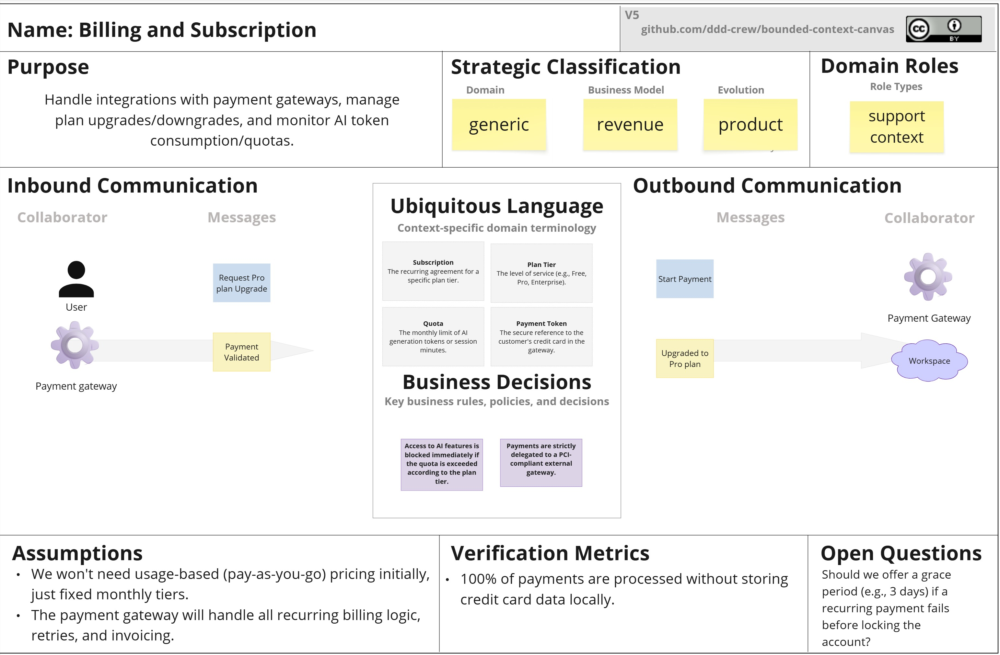

**5. Integration Gateway**

Capa Anticorrupción (ACL) que protege el Core Domain de los cambios en API de terceros. Se encarga de traducir los eventos del sistema a formatos externos y exportar las historias hacia herramientas como Jira.


### 4.2.5. Context Mapping

En esta sección evidenciamos el proceso de elaboración de nuestro Context Map. Para llegar al diseño estructural definitivo de nuestros 5 Bounded Contexts, el equipo evaluó el modelo sometiéndolo a un análisis crítico, respondiendo a las preguntas estratégicas de diseño sugeridas. Además, aplicamos rigurosamente los patrones de integración definidos por el repositorio oficial de Context Mapping de DDD Crew.

**Evaluación de Alternativas y Diseños Candidatos**

*   **¿Qué pasaría si agrupamos dos contextos fuertemente acoplados en uno solo?**
    Inicialmente, considerábamos separar la captura de audio (WebSockets) de la generación de la historia (LLM). Sin embargo, al aplicar esta pregunta, nos dimos cuenta de que ambos son parte inseparable del mismo flujo de valor en tiempo real. Agruparlos en un único Core Domain llamado **Requirement Discovery** eliminó la latencia de red y la serialización innecesaria entre ambos pasos. Aplicamos la misma lógica para fusionar Organización y Proyecto dentro de **Workspace Management**.
*   **¿Qué pasaría si aislamos los core capabilities y movemos los otros a un context aparte?**
    Una vez consolidado el Core, evaluamos el proceso de exportar las historias hacia gestores de proyectos (Jira). Notamos que la integración con terceros es puramente una capacidad de soporte. Por ello, aislamos el core de IA y movimos toda la comunicación externa hacia el **Integration Gateway**. Esto evita que los cambios constantes en API de terceros contaminen nuestro motor de inferencia.
*   **¿Qué pasaría si duplicamos una funcionalidad para romper la dependencia?**
    Evaluamos la validación de cuotas. Si **Requirement Discovery** tuviera que preguntar sincrónicamente a **Billing & Subscription** si un usuario tiene saldo antes de cada uso de IA, el sistema sería lento y frágil. Decidimos romper esta dependencia directa. **Billing & Subscription** emite eventos asíncronos cuando una cuota se actualiza, y **Workspace Management** duplica y almacena localmente esta capacidad. Así, el Core Domain solo consulta su contexto local sin bloqueos de red.

**Patrones de Relación DDD Establecidos**

Tras este debate, definimos formalmente los patrones de integración estratégicos. Las relaciones indican quién es el proveedor (Upstream **U**) y quién es el consumidor (Downstream **D**).

1.  **Integration Gateway [D] hacia External PM Service (Jira) [U]**
    *   **Patrón:** Anti-Corruption Layer (ACL)
    *   **Justificación:** El Integration Gateway actúa como una barrera traductora unidireccional. Consume los eventos de dominio internos del producto, formulados en nuestro lenguaje ubicuo, y los transforma al esquema propietario y mutable de Atlassian. Nuestro Core jamás adopta las convenciones de modelado de Jira ni se entera de cómo funciona su API, lo que preserva la pureza semántica del dominio de elicitación de requisitos.
    *   **Naturaleza del contrato traducido por el ACL:** El Gateway implementa adaptadores que convierten los conceptos de dominio internos (aprobación de historias, rechazo con motivo, referencias a épicas) a las estructuras propietarias que Atlassian exige: sus tipos de campos, sus formatos de descripción enriquecida, su esquema de identificadores externos y sus convenciones de priorización. Esta traducción es bidireccional cuando se necesita trazabilidad: el identificador interno de cada historia se mapea y persiste junto al identificador externo que Jira asigna, sin contaminar el modelo de dominio del Core.
    *   **Análisis de Impacto del Patrón ACL en la evolución del sistema:** El equipo evaluó tres escenarios concretos donde el ACL demuestra su valor:
        1.  *Cambios en la API de Atlassian:* Si Atlassian modificara la versión de su API o migrara a un esquema completamente distinto, únicamente la implementación interna del Gateway requeriría actualización. Ningún módulo del Core sufriría modificación alguna en su modelo de dominio ni en su lógica de negocio.
        2.  *Cambio entre variantes de Jira:* La migración entre Jira Cloud, Jira Data Center o Jira Server —cada una con mecanismos de autenticación, paginación y límites de tasa distintos— se absorbe completamente dentro del Gateway mediante implementaciones intercambiables del mismo contrato interno, sin exponer esa variabilidad hacia el resto del sistema.
        3.  *Limitaciones operativas externas:* Las restricciones de consumo que Atlassian impone por plan (límites de llamadas por segundo) son gestionadas internamente por el Gateway con políticas de reintento, tolerancia a fallos y encolado, sin contaminar la lógica de los módulos internos con preocupaciones de infraestructura externa.
    *   **Tradeoff consciente y costo del aislamiento:** El equipo asume el costo de mantener un adaptador por cada herramienta de gestión soportada y la duplicación temporal de representaciones (interna vs. externa). Este costo se justifica por la naturaleza heterogénea del mercado objetivo: el roadmap incluye soporte futuro para Trello, Asana, ClickUp y Linear, todas con esquemas radicalmente distintos. Sin el ACL, cada nueva integración obligaría a contaminar el Core con concesiones específicas de cada vendor.

2.  **Requirement Discovery [D] hacia External AI Services (LLM / STT) [U]**
    *   **Patrón:** Anti-Corruption Layer (ACL)
    *   **Justificación:** Para evitar el *vendor lock-in* con proveedores de IA cuyos contratos de API evolucionan mensualmente (OpenAI, Anthropic, AssemblyAI, Deepgram, entre otros), el ACL traduce las solicitudes de inferencia y los flujos de audio internos del dominio al esquema específico del proveedor activo. El modelo de dominio de Requirement Discovery permanece estable e independiente de los cambios externos, lo que es crítico en un Core Domain donde la inferencia de IA representa la principal propuesta de valor del producto.
    *   **Naturaleza del contrato traducido por el ACL:** El Gateway de IA expone al dominio dos abstracciones bien definidas: una para la inferencia de lenguaje (recibe la transcripción de la reunión, el glosario del proyecto y el historial de historias previas; devuelve historias estructuradas en Gherkin) y otra para la transcripción de audio en tiempo real (recibe fragmentos de audio en streaming; devuelve segmentos de texto con marcas temporales). Cada adaptador concreto es responsable de traducir estas abstracciones al contrato particular del proveedor —con sus formatos de autenticación, sus estructuras de mensaje, sus parámetros de configuración y sus esquemas de respuesta—, sin que el dominio conozca esa especificidad.
    *   **Análisis de Impacto del Patrón ACL en la evolución del sistema:** El equipo evaluó tres escenarios donde el ACL es estratégicamente determinante:
        1.  *Cambio de proveedor de IA:* Migrar el motor de inferencia de un proveedor a otro —motivado por costo, calidad de razonamiento, latencia o regulación de datos en regiones específicas— requiere únicamente desarrollar un nuevo adaptador interno. El modelo de dominio, la lógica de RAG y los flujos de sesiones permanecen completamente inmutables.
        2.  *Cambio de modelo dentro del mismo proveedor:* Las actualizaciones de modelos dentro de un mismo proveedor frecuentemente alteran el comportamiento esperado ante ciertos tipos de instrucciones. El ACL encapsula los ajustes necesarios de construcción de prompts específicos por modelo sin que esos detalles se propaguen al Domain.
        3.  *Estrategia de continuidad ante degradación:* Si el proveedor primario sufre una interrupción del servicio o impone restricciones de consumo agresivas, el ACL puede orquestar un desvío automático hacia un proveedor secundario equivalente, garantizando la continuidad del Core sin que el dominio conozca la sustitución.
    *   **Tradeoff consciente y costo del aislamiento:** Mantener múltiples adaptadores —uno por cada proveedor soportado— representa una carga de mantenimiento real: cada cambio en una API externa exige actualizar el adaptador correspondiente y verificar la paridad funcional. Sin embargo, en una categoría de mercado donde los proveedores liberan modelos disruptivos cada pocos meses y sus políticas de precios pueden cambiar unilateralmente, el costo de quedar atado a un único vendor supera ampliamente el costo de mantener la abstracción.

3.  **Requirement Discovery [D] hacia Workspace Management [U]**
    *   **Patrón:** Customer / Supplier
    *   **Justificación:** Requirement Discovery [Customer] establece una relación de dependencia activa pero negociada con Workspace Management [Supplier]. Como Core Domain, Requirement Discovery exige que el contexto del proyecto —el glosario de términos técnicos del cliente, las restricciones arquitectónicas y el historial de historias previas— se le entregue en un formato canónico, limpio y oportuno para inyectarlo en el motor RAG. Workspace Management, reconociendo la prioridad estratégica de su cliente, adapta sus procesos internos de ingesta, normalización y curación para satisfacer esa necesidad sin imponer su propio modelo interno.
    *   **Naturaleza del contrato negociado:** La relación se materializa en un contrato de contexto de proyecto formalmente versionado y consensuado entre ambos contextos: incluye el glosario de términos con sus definiciones y sinónimos, las restricciones que el cliente ha declarado sobre su arquitectura, y el resumen de historias ya generadas. El contrato incluye acuerdos de frescura de los datos —el contexto entregado debe reflejar el estado más reciente con un desfase máximo aceptable—, de latencia de generación y de política de versionado bilateral, donde cualquier cambio estructural requiere retrocompatibilidad durante al menos un ciclo de desarrollo completo.
    *   **Análisis de Impacto del Patrón Customer/Supplier en la evolución del sistema:** El equipo evaluó tres dinámicas que esta relación introduce:
        1.  *Priorización del backlog de Workspace:* Las solicitudes provenientes de Requirement Discovery —mejoras al procesamiento de documentos del cliente, enriquecimiento del glosario, soporte multiidioma— tienen prioridad operativa sobre el backlog interno de Workspace, lo que ocasionalmente fuerza a Workspace a postergar mejoras propias a la gestión de organizaciones.
        2.  *Crecimiento del volumen de datos:* Si un proyecto enterprise supera ciertos umbrales de tamaño del glosario o del historial de historias, el contrato actual —que entrega un snapshot completo en cada consulta— se vuelve insostenible en términos de latencia y consumo de memoria. Esto obligaría a renegociar el contrato hacia una entrega incremental o paginada, con implicancias de rediseño en ambos contextos.
        3.  *Evolución del concepto de "contexto":* Si el equipo de producto decide enriquecer el RAG con nuevas fuentes de información del cliente —diagramas de arquitectura, documentación de API, transcripciones de reuniones anteriores—, Workspace deberá expandir su capacidad de ingesta y curación para honrar la nueva expectativa del Customer, en cada iteración que el producto agregue una nueva fuente de contexto.
    *   **Tradeoff consciente y dinámica de poder:** El patrón Customer/Supplier reconoce explícitamente una asimetría de prioridades: Workspace cede parte de su autonomía de roadmap a cambio de servir al Core Domain que genera el principal valor del producto. Esta dinámica funciona eficientemente mientras el mismo equipo gestione ambos contextos. Si Reqs-AI escalara con equipos dedicados por contexto, esta relación debería formalizarse mediante contratos de integración automatizados y verificables (*consumer-driven contract testing*) para mantener la salud del acuerdo sin depender de la coordinación informal entre personas.

4.  **Workspace Management [D] hacia IAM [U] y Billing & Subscription [U]**
    *   **Patrón:** Conformist (CF)
    *   **Justificación:** Workspace Management se conforma al modelo de identidad que IAM define y al modelo de suscripción que Billing establece —ambos dictados en gran medida por los estándares de los sistemas externos que integran (pasarelas de identidad y de pago). Al adoptar el patrón Conformist, Workspace acepta que es un consumidor pasivo: no puede negociar ni alterar el esquema de ninguno de estos dos contextos proveedores.
    *   **Naturaleza del acoplamiento por contagio:** Workspace Management replica internamente un subconjunto del modelo de Billing para poder evaluar si una organización tiene cuotas disponibles sin depender de llamadas sincrónicas a Billing en cada operación. Esto significa que Workspace almacena localmente la categoría de plan activo, el estado de la suscripción y los saldos de consumo disponibles, actualizando esa información de forma reactiva cada vez que Billing emite eventos de cambio de estado. De forma análoga, Workspace incorpora los identificadores y roles de identidad que IAM define, sin cuestionarlos ni adaptarlos a su propia semántica interna.
    *   **Análisis de Impacto del Patrón Conformist en la evolución del sistema:** Asumir el rol de Conformist genera un acoplamiento estructural unidireccional con consecuencias evolutivas concretas que el equipo ha evaluado en tres escenarios:
        1.  *Cambio en el modelo de monetización:* Si Billing evolucionara de un esquema de planes fijos a un modelo de consumo por uso —por minutos de reunión procesada o por volumen de historias generadas—, Workspace deberá reescribir completamente su lógica de validación de cuotas para adaptarse al nuevo esquema de medición, sin poder influir en cómo Billing decide estructurarlo. Esto implicaría una migración de datos no trivial y la actualización coordinada de toda la lógica de control de acceso en Requirement Discovery.
        2.  *Cambio de pasarela de pago:* Si Billing migrara a una pasarela de pagos distinta —motivado por el mercado local peruano o latinoamericano—, los identificadores externos de suscripción que Workspace almacena por trazabilidad quedarían obsoletos. Esto forzaría una migración de datos coordinada entre ambos contextos, con riesgo de pérdida de histórico de auditoría y la necesidad de mantener temporalmente ambas representaciones durante el período de transición.
        3.  *Despliegue acoplado:* Cualquier evolución en el contrato de los eventos que Billing pública para notificar cambios de estado de suscripción requiere despliegues coordinados de ambos contextos. Esto rompe el principio de despliegue independiente que buscaríamos en una arquitectura modular madura y obliga a versionar cuidadosamente los eventos compartidos con políticas de retrocompatibilidad explícitas.
    *   **Tradeoff consciente y umbral de migración a ACL:** El equipo acepta esta deuda arquitectural mientras Billing siga siendo un *Generic Subdomain* estable y la startup priorice la velocidad de entrega sobre la autonomía evolutiva de Workspace. Sin embargo, se establecen tres condiciones de disparo que justificarían introducir un Anti-Corruption Layer entre Workspace y Billing en futuras iteraciones: (a) que el modelo de negocio de Billing cambie más de una vez por trimestre, (b) que se incorpore una segunda pasarela de pago para soportar mercados regionales con métodos locales de cobro, o (c) que Workspace deba soportar estructuras de planes diferenciadas por geografía o tipo de organización. Mientras estos disparadores no se activen, el costo de construir y mantener un ACL supera el costo del re-trabajo ocasional sobre Workspace.

5.  **Requirement Discovery [U] hacia Integration Gateway [D]**
    *   **Patrones:** Open Host Service (OHS) y Published Language (PL)
    *   **Justificación:** El Core Domain Requirement Discovery actúa como un *host* abierto que emite eventos de dominio estandarizados a través de un canal público bien definido, expresados en un Published Language compartido y versionado. Cualquier contexto o sistema externo puede suscribirse a este canal sin requerir modificaciones en el Core. Esta arquitectura desacopla completamente al productor de los consumidores y permite la evolución independiente de ambos lados de la integración.
    *   **Naturaleza del lenguaje publicado y del canal abierto:** El equipo formalizó el contrato del OHS en tres dimensiones: los tipos de eventos que Requirement Discovery pública —relacionados con los cambios de estado del ciclo de vida de cada historia de usuario y de cada sesión de elicitación—, la estructura común que todos los eventos comparten —con metadatos de trazabilidad, versionado semántico y contexto de tenant para soportar el multitenancy— y el canal de transporte —actualmente en memoria dentro del monolito modular, pero diseñado con la abstracción suficiente para migrarlo a un bus de eventos distribuido si la arquitectura evoluciona en el futuro.
    *   **Análisis de Impacto del Patrón OHS+PL en la evolución del sistema:** El equipo evaluó tres beneficios concretos que esta arquitectura habilita:
        1.  *Incorporación de nuevos consumidores sin modificar el Core:* En futuras iteraciones podrán incorporarse consumidores adicionales —notificaciones hacia plataformas de colaboración del cliente, exportaciones hacia otros gestores de proyectos, servicios de analítica de productividad— simplemente suscribiéndose al canal publicado, sin que Requirement Discovery requiera modificación alguna.
        2.  *Evolución interna del Core sin disrupción externa:* Mientras el Published Language permanezca estable, Requirement Discovery puede refactorizar libremente su modelo interno, cambiar de proveedor de IA, optimizar su motor RAG o rediseñar su capa de persistencia, sin afectar a ningún consumidor downstream.
        3.  *Política de versionado retrocompatible:* Los cambios aditivos al Published Language —incorporación de campos opcionales— son retrocompatibles y no requieren coordinación con los consumidores. Los cambios disruptivos —renombrado, eliminación o cambio de cardinalidad de elementos del contrato— requieren publicar el evento bajo una nueva versión y mantener la versión anterior activa durante un período de transición acordado, para dar tiempo a los consumidores a migrar sin interrupciones.
    *   **Tradeoff consciente y rigidez del contrato público:** Adoptar OHS+PL convierte al Published Language en un activo crítico cuya estabilidad es responsabilidad del Core Domain. Cada cambio en el contrato debe ser deliberado, comunicado y documentado, lo que reduce la velocidad de iteración interna sobre los tipos y estructuras de eventos publicados. Sin embargo, esta rigidez es exactamente el tipo de disciplina que se espera de un Core Domain maduro: el costo de esa lentitud en el contrato público se compensa ampliamente al habilitar un ecosistema de consumidores extensible, desacoplado y robusto a largo plazo.

**Diagrama de Context Map Final**

A continuación presentamos la visualización de las relaciones estructurales consolidadas tras aplicar los patrones descritos. Las líneas conectan los Bounded Contexts indicando los roles U y D y los patrones aplicados sobre ellas.

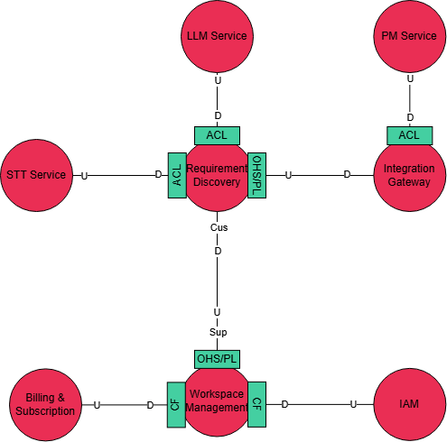

## 4.3. Software Architecture

En este capítulo, el equipo detalla la arquitectura de software de Reqs-AI aplicando el modelo C4. Este modelo jerárquico permite documentar el sistema desde su ecosistema más amplio hasta sus componentes desplegables y su entorno de infraestructura final. Todas las decisiones reflejadas en estos diagramas están alineadas con los Atributos de Calidad y Restricciones analizados previamente, como el uso del Monolito Modular, la tolerancia a fallos en memoria y el multitenancy seguro.

### 4.3.1. Software Architecture System Landscape Diagram

El *System Landscape Diagram* proporciona una vista panorámica del ecosistema tecnológico en el que habita Reqs-AI. A diferencia de un simple diagrama de contexto que solo mira hacia adentro, este diagrama ilustra cómo nuestro sistema principal (agrupado dentro de los límites de la empresa *Kntro-Soft Enterprise*) interactúa no solo con los usuarios, sino también con el entorno de herramientas de terceros que el usuario final ya utiliza en su día a día corporativo.

A continuación, se presenta la topología del paisaje del sistema:

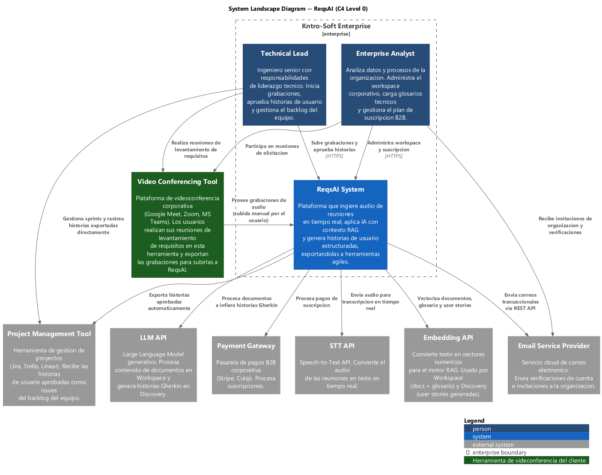

**Análisis de Interacciones en el Ecosistema:**

1.  **Límite Empresarial Kntro-Soft Enterprise:** Agrupa a nuestros actores principales (Technical Lead y Enterprise Analyst) interactuando centralmente con el **ReqsAI System**. Este es el núcleo de valor donde se procesan las transcripciones, se analizan los requerimientos y se estructuran en historias de usuario.
2.  **Proveedores de Inteligencia y Procesamiento (Core Dependencies):** Las dependencias tecnológicas críticas que Reqs-AI delega para cumplir sus objetivos:
    *   **STT API (Speech-to-Text):** Recibe los fragmentos de audio en tiempo real y devuelve el texto transcrito.
    *   **Embedding API:** Convierte texto en vectores numéricos para el índice RAG. Es utilizada por **Workspace Management** (vectorización de documentos y glosario) y por **Requirement Discovery** (vectorización de historias de usuario generadas para búsqueda semántica).
    *   **LLM API (Large Language Model generativo):** Procesa y genera texto de alto nivel. **Workspace Management** la invoca para extraer y estructurar el contenido de documentos subidos por el cliente, produciendo fragmentos de calidad para el RAG. **Requirement Discovery** la invoca para inferir historias de usuario en formato Gherkin a partir de la transcripción y el contexto recuperado del RAG.
    *   **Payment Gateway:** Procesa las transacciones de las suscripciones B2B corporativas.
3.  **Herramientas de Ecosistema del Cliente (The Landscape Effect):** La verdadera amplitud del ecosistema se evidencia en las relaciones laterales entre los usuarios y las herramientas que ya usan **independientemente** de ReqsAI:
    *   **Video Conferencing Tool (Google Meet, Zoom, MS Teams):** El *Technical Lead* y el *Enterprise Analyst* realizan sus reuniones de levantamiento de requisitos en estas plataformas. Exportan las grabaciones de audio y las suben manualmente a ReqsAI para su procesamiento. Esta es la fuente upstream del audio que alimenta el pipeline de IA.
    *   **Project Management Tool (Jira, Trello, Linear):** El *Technical Lead* gestiona sus Sprints directamente en la herramienta de su equipo. ReqsAI exporta las historias aprobadas hacia ella, cerrando la brecha entre el levantamiento de requerimientos y la ejecución ágil.
    *   **Email Service Provider:** El *Enterprise Analyst* recibe notificaciones e invitaciones de su organización a través de su proveedor de correo corporativo.
    *   **Customer Support Channel:** El *Technical Lead* y el *Enterprise Analyst* tienen disponible este canal de atención via correo electrónico para resolver dudas, y reportar problemas.

### 4.3.2. Software Architecture Context Level Diagrams

Mientras que el Diagrama Landscape nos mostró el panorama del negocio, el **Diagrama de Contexto (Context Level Diagram)** del modelo C4 cambia el foco hacia el interior, centrando toda la atención arquitectónica exclusivamente en el **Reqs-AI System**. Este diagrama responde a la pregunta de "¿Cuáles son las fronteras inmediatas de nuestra solución?".

A nivel de contexto, eliminamos las interacciones directas entre los usuarios y los sistemas de terceros (ej. el Technical Lead consultando Jira por su cuenta) y nos limitamos a mapear cómo nuestro sistema es el único orquestador responsable de comunicarse con el mundo exterior para cumplir sus objetivos.

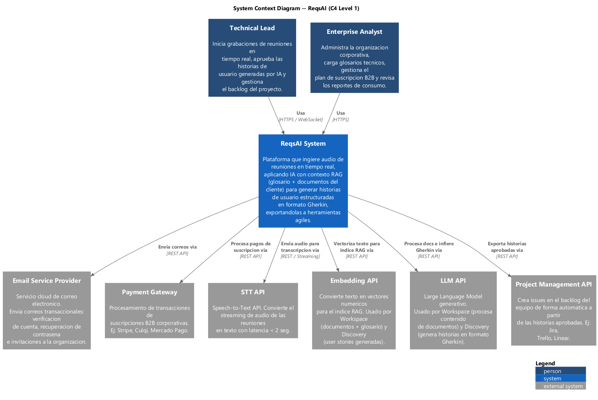

**Análisis de Entradas y Salidas del Sistema Central:**

*   **Actores Primarios (Inbound):**
    *   El **Technical Lead** envía los comandos principales: inicia grabaciones de audio en tiempo real y aprueba las historias generadas.
    *   El **Enterprise Analyst** administra las organizaciones corporativas (Workspaces), los pagos B2B y sube los glosarios de términos que contextualizan la IA.
*   **Sistemas de Soporte (Outbound Operacional):**
    *   **Payment Gateway:** Recibe los datos de transacción para habilitar el uso ilimitado o cuotas Pro de la inteligencia artificial.
    *   **Email Service Provider:** Recibe peticiones vía REST API para enviar los correos transaccionales de recuperación de contraseña y validación de cuentas.
*   **Sistemas Core (Outbound Tecnológico):**
    *   **STT API (Speech-to-Text):** Recibe el streaming continuo de audio de las reuniones y retorna texto fragmentado con latencia inferior a 2 segundos.
    *   **Embedding API:** Transforma texto en vectores numéricos para el motor RAG. **Workspace Management** la invoca al ingerir documentos y el glosario técnico del cliente, almacenando los vectores en pgvector. **Requirement Discovery** la invoca para vectorizar las historias de usuario generadas, habilitando búsquedas semánticas sobre el historial del proyecto.
    *   **LLM API (Inteligencia Generativa):** Genera y procesa lenguaje de alto nivel. **Workspace Management** la invoca para extraer y estructurar el contenido significativo de los documentos subidos por el cliente antes de vectorizarlos, mejorando la calidad de recuperación del RAG. **Requirement Discovery** la invoca para la inferencia generativa: envía un *prompt* que combina la transcripción de la reunión con el contexto recuperado del RAG y recibe como respuesta un bloque JSON estructurado en formato Gherkin.
    *   **Project Management Tool:** Recibe las historias de usuario aprobadas y formateadas para crear automáticamente *Issues* en el backlog del equipo (por ejemplo en Jira).

### 4.3.3. Software Architecture Container Level Diagrams

En esta sección presentamos el diagrama de contenedores para el sistema Reqs-AI. Este nivel hace un enfoque al sistema principal para revelar los contenedores de software que lo componen (aplicaciones móviles, web, API, bases de datos), mostrando cómo se distribuyen las responsabilidades, las decisiones tecnológicas de alto nivel y cómo estos componentes se comunican entre sí y con los sistemas externos.

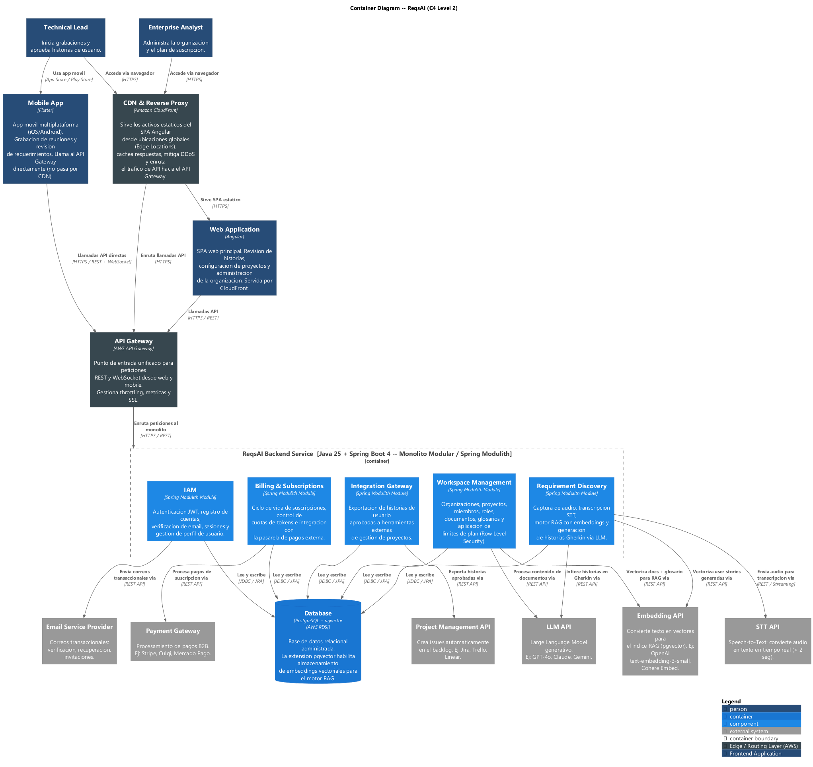

El sistema Reqs-AI está compuesto por los siguientes contenedores principales:

1.  **Interfaces de Usuario (Frontend):**
    *   **Web Application:** Es la plataforma principal para los usuarios. Permite una visualización completa para el análisis profundo de datos, revisión de historias de usuario, configuración de proyectos y gestión general del sistema. Se eligió **Angular** por ser un framework robusto, ideal para aplicaciones empresariales escalables.
    *   **Mobile App:** Proporciona accesibilidad móvil a los usuarios, permitiéndoles interactuar con el sistema, grabar reuniones o revisar el estado de los requerimientos desde cualquier lugar. Se optó por **Flutter** para asegurar un desarrollo multiplataforma eficiente (iOS y Android) con una base de código unificada.

2.  **Distribución y Enrutamiento Perimetral (Edge):**
    *   **CDN & Reverse Proxy (Amazon CloudFront):** Sirve exclusivamente los activos estáticos del SPA Angular desde Edge Locations globales (HTML, CSS, JS), cachea respuestas, mitiga ataques DDoS y enruta el tráfico dinámico de API hacia el API Gateway. **La app móvil no pasa por CloudFront** — es una aplicación nativa instalada desde el App Store/Google Play que llama directamente la API Gateway.
    *   **API Gateway (AWS API Gateway):** Punto de entrada unificado para todas las peticiones REST y WebSocket, tanto de la app web (enrutadas desde CloudFront) como de la app móvil (conexión directa). Gestiona throttling, métricas de consumo y terminación SSL.

3.  **Lógica Core (Backend — Monolito Modular):**
    *   **Reqs-AI Backend Application:** Desarrollado en **Java 25 con Spring Boot 4**, se despliega como un único contenedor Docker que concentra toda la inteligencia de negocio del producto. Está estructurado internamente como un **Monolito Modular** con Spring Modulith: los 5 Bounded Contexts operan como módulos independientes con fronteras de acceso estrictas, comunicándose entre sí mediante interfaces públicas y eventos en memoria —sin tráfico de red interno—, lo que elimina la latencia distribuida y garantiza la coherencia transaccional. Esta decisión prioriza la simplicidad operativa y el *Time-to-Market* en la etapa actual, manteniendo la arquitectura preparada para una migración selectiva si el volumen futuro lo justifica.

    | # | Bounded Context        | Responsabilidad principal                                                                                   |
    |---|------------------------|-------------------------------------------------------------------------------------------------------------|
    | 1 | Requirement Discovery  | Captura de audio en tiempo real, transcripción, motor RAG y generación de historias en Gherkin.             |
    | 2 | Workspace Management   | Jerarquía de organizaciones y proyectos, glosarios técnicos y aplicación de Row Level Security multitenant. |
    | 3 | IAM                    | Identidad, autenticación, autorización por roles y gestión de permisos corporativos.                        |
    | 4 | Billing & Subscription | Planes de suscripción, control de cuotas e integración con la pasarela de pagos.                            |
    | 5 | Integration Gateway    | Exportación de historias aprobadas hacia las herramientas de gestión que el cliente ya utiliza.             |

4.  **Almacenamiento de Datos (AWS RDS):**
    *   **Database:** Base de datos relacional administrada en **AWS RDS** con **PostgreSQL** y la extensión **pgvector**. La elección de pgvector es una decisión estratégica crítica que permite almacenar y consultar *embeddings* vectoriales directamente en la base de datos relacional, habilitando el motor RAG y las búsquedas semánticas sin necesidad de una base de datos vectorial separada.

**Comunicación e Integración de Contenedores**

La arquitectura define un flujo de comunicación diferenciado según el canal:

*   **Canal Web:** El navegador carga el SPA Angular desde **CloudFront** (activos estáticos cacheados en el Edge). Las llamadas de API del SPA viajan por CloudFront → API Gateway → Backend.
*   **Canal Móvil:** La app Flutter (instalada desde App Store/Google Play) realiza llamadas HTTPS directamente la **API Gateway**, sin pasar por CloudFront, ya que no es una aplicación web servida desde un servidor.
*   **Comunicación Interna:** La API Gateway enruta todas las peticiones hacia el contenedor del backend. Internamente, los Bounded Contexts se comunican mediante Domain Events en memoria y persisten en la base de datos compartida (AWS RDS PostgreSQL).
*   **Integración con Sistemas Externos:** Las integraciones están descentralizadas, asignadas al Bounded Context que las necesita:
    *   **IAM** envía correos transaccionales vía **Email Service Provider**.
    *   **Billing & Subscription** procesa pagos vía **Payment Gateway**.
    *   **Workspace Management** vectoriza documentos y glosario vía **Embedding API**, y procesa el contenido de documentos para el RAG vía **LLM API**.
    *   **Requirement Discovery** transcribe audio vía **STT API**, vectoriza historias generadas vía **Embedding API** e infiere historias en Gherkin vía **LLM API**.
    *   **Integration Gateway** exporta historias aprobadas vía **Project Management API** (Jira, Trello, Linear).

### 4.3.4. Software Architecture Deployment Diagrams

En esta sección se presenta el diagrama de despliegue, el cual ilustra cómo los contenedores de software de Reqs-AI se mapean a la infraestructura de la nube. Este diagrama detalla los nodos de ejecución, los entornos operativos y la topología de red, priorizando una arquitectura viable, escalable y optimizada en costos.

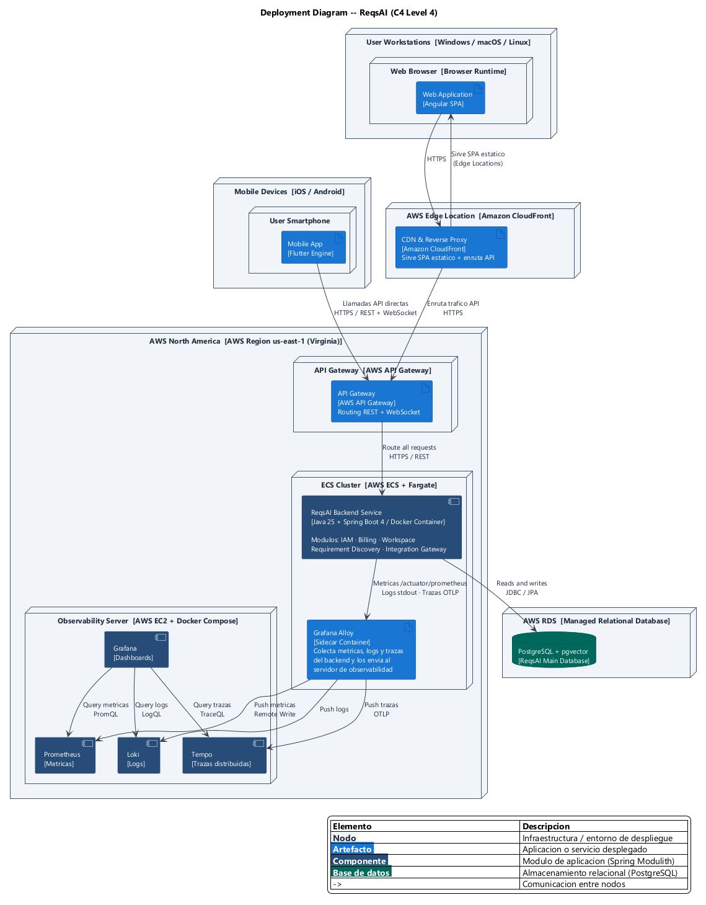

**Nodos de Despliegue y Distribución de Componentes**

La infraestructura de despliegue se divide en los entornos de cliente, la red de entrega perimetral (Edge), la infraestructura de procesamiento core y la persistencia de datos.

1.  **En el lado del cliente:**
    *   **Dispositivos físicos (iOS/Android):** Dentro opera el *Flutter Engine*, entorno encargado de ejecutar la aplicación mobile.
    *   **Computadoras de los usuarios:** Utilizan un navegador web como nodo de ejecución para renderizar la aplicación web (Angular).

2.  **Entorno de Nube - Red Perimetral (AWS Edge Location):**
    Para garantizar baja latencia y alta seguridad antes de que el tráfico llegue a los servidores principales, se utilizan los nodos Edge de AWS distribuidos globalmente.
    *   **Amazon CloudFront (CDN & Reverse Proxy):** Actúa como el primer punto de contacto (Proxy Inverso). Almacena en caché los archivos estáticos de la Web App en ubicaciones cercanas al usuario para cargas instantáneas, y enruta de forma segura y eficiente el tráfico dinámico hacia la región principal de AWS.

3.  **Entorno de Nube - Procesamiento (AWS North America — us-east-1, Virginia):**
    La lógica de negocio se aloja en la región de AWS North America, elegida por su alta disponibilidad y ecosistema completo de servicios administrados.
    *   **AWS API Gateway:** Recibe el tráfico dinámico desde CloudFront (web) y directamente desde la app móvil, funcionando como orquestador de peticiones REST y WebSocket hacia el backend.
    *   **ECS Cluster (AWS ECS + Fargate):** El backend se despliega como un contenedor Docker en **AWS ECS con Fargate** (serverless containers). Fargate abstrae completamente la gestión de servidores EC2 subyacentes, provisionando cómputo bajo demanda con autoescalado automático. La task definition del ECS define dos contenedores en la misma unidad de ejecución: el **ReqsAI Backend Service** (Java 25 + Spring Boot 4) y el **Grafana Alloy** como sidecar de observabilidad.
    *   **Observability Server (AWS EC2 + Docker Compose):** Una instancia EC2 dedicada ejecuta el stack de observabilidad completo mediante Docker Compose: **Prometheus** (almacén de métricas, consultado con PromQL), **Loki** (agregación de logs, consultado con LogQL), **Tempo** (trazas distribuidas, consultado con TraceQL) y **Grafana** (dashboard unificado que visualiza las tres fuentes). Grafana Alloy, corriendo como sidecar en el ECS Cluster, colecta las métricas del endpoint `/actuator/prometheus`, logs del stdout del contenedor y trazas OTLP, enviándolos al servidor de observabilidad mediante push.

4.  **Entorno de Nube - Persistencia (AWS RDS):**
    *   **AWS RDS (PostgreSQL + pgvector):** La base de datos principal se gestiona completamente en **Amazon RDS**, el servicio de base de datos relacional administrado de AWS. Se utiliza **PostgreSQL** con la extensión **pgvector** habilitada, esencial para el almacenamiento de embeddings vectoriales que alimentan el motor RAG. RDS provee backups automáticos, failover multi-AZ y actualizaciones de parches sin downtime.

**Comunicación e Interacción de Nodos**

*   **App Web:** El navegador carga el SPA Angular desde **CloudFront** (Edge Location más cercano). Las llamadas de API del SPA viajan CloudFront → API Gateway → ECS Backend.
*   **App Móvil:** La app Flutter instalada en el dispositivo del usuario realiza llamadas HTTPS **directamente la API Gateway**, sin pasar por CloudFront, ya que no es una aplicación web servida desde CDN.
*   **Observabilidad:** Grafana Alloy (sidecar en ECS) colecta continuamente métricas, logs y trazas del backend y los envía al Observability Server en EC2. Grafana consulta Prometheus, Loki y Tempo para mostrar el estado del sistema en tiempo real.
*   **Persistencia:** El backend se conecta a **AWS RDS** via JDBC/JPA para todas las operaciones transaccionales de los 5 Bounded Contexts.

# Capítulo V: Tactical-Level Software Design

## 5.1. Bounded Context: IAM

El BC IAM gestiona la identidad, autenticación y sesiones de los usuarios de Reqs-AI. Es responsable desde el registro de cuenta hasta la emisión y rotación de tokens de acceso, verificación de correo electrónico, actualización de perfil y almacenamiento de preferencias de navegación del usuario. No administra roles ni permisos por organización; esa responsabilidad pertenece al BC Workspace Management.

### 5.1.1. Domain Layer

Esta capa contiene el núcleo del negocio del BC IAM: reglas de autenticación, ciclo de vida de cuentas y gestión de sesiones mediante tokens. No depende de ningún framework externo a nivel de lógica.

**Aggregate Roots**

**Aggregate: `Account`**

| Campo               | Detalle                                                                                                                                                                                       |
|---------------------|-----------------------------------------------------------------------------------------------------------------------------------------------------------------------------------------------|
| **Paquete**         | `com.kntrosoft.reqsai.iam.domain.model.aggregates`                                                                                                                                            |
| **Extiende**        | `AbstractAggregateRoot<Account>`                                                                                                                                                              |
| **Propósito**       | Representa las credenciales y el estado del ciclo de vida de una cuenta. Controla las invariantes de autenticación: una cuenta no puede autenticarse si no está verificada o está suspendida. |
| **Anotaciones JPA** | `@Entity`, `@Table(name = "accounts")`                                                                                                                                                        |

**Atributos:**

| Atributo                    | Tipo            | Columna JPA                    | Descripción                                                    |
|-----------------------------|-----------------|--------------------------------|----------------------------------------------------------------|
| `id`                        | `AccountId`     | `id`                           | Identificador único de la cuenta (UUID).                       |
| `email`                     | `Email`         | `@Embedded`                    | Correo electrónico único de acceso, normalizado a minúsculas.  |
| `passwordHash`              | `String`        | `password_hash`                | Hash BCrypt de la contraseña.                                  |
| `status`                    | `AccountStatus` | `status`                       | Estado actual de la cuenta en su ciclo de vida.                |
| `verificationCode`          | `String?`       | `verification_code`            | Código OTP de verificación de correo. Nulo una vez verificado. |
| `verificationCodeExpiresAt` | `Instant?`      | `verification_code_expires_at` | Fecha de expiración del OTP.                                   |

**Constructores:**

| Constructor                                 | Visibilidad | Propósito                                                     |
|---------------------------------------------|-------------|---------------------------------------------------------------|
| `protected Account()`                       | `protected` | Para JPA. No instanciar directamente.                         |
| `Account(Email email, String passwordHash)` | `public`    | Crea la cuenta en estado `PENDING_VERIFICATION`. Genera UUID. |

**Métodos de negocio:**

| Método                                                     | Visibilidad | Parámetros                           | Retorna | Descripción                            | Excepciones lanzadas                                                    |
|------------------------------------------------------------|-------------|--------------------------------------|---------|----------------------------------------|-------------------------------------------------------------------------|
| `verifyEmail(String code, Instant now)`                    | `public`    | `code: String`, `now: Instant`       | `void`  | Valida el OTP y activa la cuenta.      | `InvalidVerificationCodeException` si el código es incorrecto o expiró. |
| `changePassword(String newPasswordHash)`                   | `public`    | `newPasswordHash: String`            | `void`  | Reemplaza el hash de contraseña.       | —                                                                       |
| `suspend()`                                                | `public`    | —                                    | `void`  | Transición a estado `SUSPENDED`.       | `CannotSuspendAccountException` si ya está suspendida o eliminada.      |
| `activate()`                                               | `public`    | —                                    | `void`  | Transición a estado `ACTIVE`.          | —                                                                       |
| `delete()`                                                 | `public`    | —                                    | `void`  | Baja lógica: estado `DELETED`.         | —                                                                       |
| `generateVerificationCode(String code, Instant expiresAt)` | `public`    | `code: String`, `expiresAt: Instant` | `void`  | Almacena nuevo OTP (usado en reenvío). | —                                                                       |

**Métodos de consulta:**

| Método                    | Visibilidad | Retorna   | Descripción                                    |
|---------------------------|-------------|-----------|------------------------------------------------|
| `isPendingVerification()` | `public`    | `boolean` | `true` si el status es `PENDING_VERIFICATION`. |
| `isActive()`              | `public`    | `boolean` | `true` si el status es `ACTIVE`.               |
| `isSuspended()`           | `public`    | `boolean` | `true` si el status es `SUSPENDED`.            |
| `isDeleted()`             | `public`    | `boolean` | `true` si el status es `DELETED`.              |

**Relaciones:**

| Relación                   | Tipo              | Multiplicidad | Detalles                                                         |
|----------------------------|-------------------|---------------|------------------------------------------------------------------|
| `Account` → `User`         | Referencia por ID | 1..1          | `User` mantiene `accountId: AccountId`. Frontera de aggregate.   |
| `Account` → `RefreshToken` | Referencia por ID | 1..*          | `RefreshToken` mantiene `userId: UserId`. Frontera de aggregate. |

---

**Aggregate: `User`**

| Campo               | Detalle                                                                                                                             |
|---------------------|-------------------------------------------------------------------------------------------------------------------------------------|
| **Paquete**         | `com.kntrosoft.reqsai.iam.domain.model.aggregates`                                                                                  |
| **Extiende**        | `AbstractAggregateRoot<User>`                                                                                                       |
| **Propósito**       | Representa el perfil del usuario vinculado a una cuenta. Controla actualizaciones de datos personales y preferencias de navegación. |
| **Anotaciones JPA** | `@Entity`, `@Table(name = "users")`                                                                                                 |

**Atributos:**

| Atributo      | Tipo              | Columna JPA  | Descripción                             |
|---------------|-------------------|--------------|-----------------------------------------|
| `id`          | `UserId`          | `id`         | Identificador único del usuario (UUID). |
| `accountId`   | `AccountId`       | `account_id` | Referencia a la cuenta asociada.        |
| `firstName`   | `String`          | `first_name` | Nombres del usuario.                    |
| `lastName`    | `String`          | `last_name`  | Apellidos del usuario.                  |
| `avatarUrl`   | `String?`         | `avatar_url` | URL de foto de perfil (opcional).       |
| `preferences` | `UserPreferences` | `@Embedded`  | Preferencias de navegación del usuario. |

**Constructores:**

| Constructor                                                    | Visibilidad | Propósito                                                                      |
|----------------------------------------------------------------|-------------|--------------------------------------------------------------------------------|
| `protected User()`                                             | `protected` | Para JPA. No instanciar directamente.                                          |
| `User(AccountId accountId, String firstName, String lastName)` | `public`    | Crea perfil asociado a una cuenta. Inicializa `preferences` con valores nulos. |

**Métodos de negocio:**

| Método                                                               | Visibilidad | Parámetros                                                    | Retorna | Descripción                               | Excepciones lanzadas |
|----------------------------------------------------------------------|-------------|---------------------------------------------------------------|---------|-------------------------------------------|----------------------|
| `updateProfile(String firstName, String lastName, String avatarUrl)` | `public`    | `firstName: String`, `lastName: String`, `avatarUrl: String?` | `void`  | Actualiza nombre y foto de perfil.        | —                    |
| `updatePreferences(UserPreferences preferences)`                     | `public`    | `preferences: UserPreferences`                                | `void`  | Reemplaza las preferencias de navegación. | —                    |

**Métodos de consulta:**

| Método          | Visibilidad | Retorna  | Descripción                           |
|-----------------|-------------|----------|---------------------------------------|
| `getFullName()` | `public`    | `String` | Retorna `firstName + " " + lastName`. |

**Relaciones:**

| Relación                   | Tipo                      | Multiplicidad | Detalles                                                            |
|----------------------------|---------------------------|---------------|---------------------------------------------------------------------|
| `User` → `AccountId`       | Referencia por ID         | 1..1          | Mantiene frontera de aggregate. Nunca el objeto `Account` completo. |
| `User` → `UserPreferences` | Composición (`@Embedded`) | 1..1          | VO embebido, siempre presente.                                      |

---

**Aggregate: `RefreshToken`**

| Campo               | Detalle                                                                                                                                                                         |
|---------------------|---------------------------------------------------------------------------------------------------------------------------------------------------------------------------------|
| **Paquete**         | `com.kntrosoft.reqsai.iam.domain.model.aggregates`                                                                                                                              |
| **Extiende**        | `AbstractAggregateRoot<RefreshToken>`                                                                                                                                           |
| **Propósito**       | Representa un token de renovación de sesión. Controla su ciclo de vida (emisión, rotación, revocación) y garantiza que el token solo pueda usarse si está activo y no expirado. |
| **Anotaciones JPA** | `@Entity`, `@Table(name = "refresh_tokens")`                                                                                                                                    |

**Atributos:**

| Atributo    | Tipo             | Columna JPA  | Descripción                                     |
|-------------|------------------|--------------|-------------------------------------------------|
| `id`        | `RefreshTokenId` | `id`         | Identificador único del token (UUID).           |
| `tokenHash` | `String`         | `token_hash` | Hash SHA-256 del token en texto plano.          |
| `userId`    | `UserId`         | `user_id`    | Usuario propietario del token.                  |
| `status`    | `TokenStatus`    | `status`     | Estado actual del token.                        |
| `expiresAt` | `Instant`        | `expires_at` | Fecha de expiración.                            |
| `revokedAt` | `Instant?`       | `revoked_at` | Fecha de revocación explícita (nulo si activo). |

**Constructores:**

| Constructor                                                        | Visibilidad | Propósito                                |
|--------------------------------------------------------------------|-------------|------------------------------------------|
| `protected RefreshToken()`                                         | `protected` | Para JPA. No instanciar directamente.    |
| `RefreshToken(String tokenHash, UserId userId, Instant expiresAt)` | `public`    | Emite un nuevo token en estado `ACTIVE`. |

**Métodos de negocio:**

| Método                      | Visibilidad | Parámetros           | Retorna | Descripción                                   | Excepciones lanzadas                                           |
|-----------------------------|-------------|----------------------|---------|-----------------------------------------------|----------------------------------------------------------------|
| `revoke(Instant revokedAt)` | `public`    | `revokedAt: Instant` | `void`  | Marca el token como `REVOKED`.                | `InvalidRefreshTokenException` si ya está revocado o expirado. |
| `rotate()`                  | `public`    | —                    | `void`  | Revoca el token actual para emitir uno nuevo. | `InvalidRefreshTokenException` si no está activo.              |

**Métodos de consulta:**

| Método                   | Visibilidad | Retorna   | Descripción                                       |
|--------------------------|-------------|-----------|---------------------------------------------------|
| `isValid(Instant now)`   | `public`    | `boolean` | `true` si el status es `ACTIVE` y no ha expirado. |
| `isExpired(Instant now)` | `public`    | `boolean` | `true` si `expiresAt` es anterior a `now`.        |

**Relaciones:**

| Relación                  | Tipo              | Multiplicidad | Detalles                        |
|---------------------------|-------------------|---------------|---------------------------------|
| `RefreshToken` → `UserId` | Referencia por ID | 1..1          | Mantiene frontera de aggregate. |

---

**Value Objects**

**Value Object: `Email`**

| Campo         | Detalle                                                                                                                                                      |
|---------------|--------------------------------------------------------------------------------------------------------------------------------------------------------------|
| **Paquete**   | `com.kntrosoft.reqsai.iam.domain.model.valueobjects`                                                                                                         |
| **Tipo Java** | `record`                                                                                                                                                     |
| **Propósito** | Encapsula una dirección de correo electrónico con formato válido y normalización a minúsculas. Garantiza que cualquier instancia es siempre un email válido. |

**Campos:**

| Campo   | Tipo     | Descripción                      |
|---------|----------|----------------------------------|
| `value` | `String` | Correo normalizado a minúsculas. |

**Validaciones en compact constructor:**

| Regla                                         | Excepción lanzada       | Error Code      |
|-----------------------------------------------|-------------------------|-----------------|
| No puede ser nulo o vacío                     | `InvalidValueException` | `INVALID_EMAIL` |
| Debe tener formato de email válido (RFC 5322) | `InvalidValueException` | `INVALID_EMAIL` |

**Factory method:**

| Método | Firma                           | Descripción                                             |
|--------|---------------------------------|---------------------------------------------------------|
| `of`   | `static Email of(String value)` | Normaliza a minúsculas y llama al constructor compacto. |

---

**Value Object: `UserPreferences`**

| Campo         | Detalle                                                                                                                                                                                               |
|---------------|-------------------------------------------------------------------------------------------------------------------------------------------------------------------------------------------------------|
| **Paquete**   | `com.kntrosoft.reqsai.iam.domain.model.valueobjects`                                                                                                                                                  |
| **Tipo Java** | `record`                                                                                                                                                                                              |
| **Propósito** | Almacena las preferencias de navegación del usuario. Persiste el último contexto de trabajo para restaurar la sesión al iniciar la aplicación. Respaldado por US13 (seleccionar organización activa). |

**Campos:**

| Campo                  | Tipo      | Descripción                                                                       |
|------------------------|-----------|-----------------------------------------------------------------------------------|
| `lastVisitedOrgId`     | `String?` | ID de la última organización visitada. Nulo si el usuario no ha visitado ninguna. |
| `lastVisitedProjectId` | `String?` | ID del último proyecto visitado. Nulo si el usuario no ha visitado ninguno.       |

**Validaciones en compact constructor:**

| Regla                                                          | Excepción lanzada       | Error Code            |
|----------------------------------------------------------------|-------------------------|-----------------------|
| Si se provee `lastVisitedOrgId`, no puede ser cadena vacía     | `InvalidValueException` | `INVALID_PREFERENCES` |
| Si se provee `lastVisitedProjectId`, no puede ser cadena vacía | `InvalidValueException` | `INVALID_PREFERENCES` |

---

**Value Object: `AccountStatus`**

| Campo         | Detalle                                                      |
|---------------|--------------------------------------------------------------|
| **Paquete**   | `com.kntrosoft.reqsai.iam.domain.model.valueobjects`         |
| **Tipo Java** | `enum`                                                       |
| **Propósito** | Define los estados posibles del ciclo de vida de una cuenta. |

**Valores:**

| Valor                  | Descripción en el negocio                                                         |
|------------------------|-----------------------------------------------------------------------------------|
| `PENDING_VERIFICATION` | La cuenta fue creada pero el correo no ha sido verificado. No puede autenticarse. |
| `ACTIVE`               | La cuenta está activa y puede operar normalmente.                                 |
| `SUSPENDED`            | La cuenta fue suspendida administrativamente. No puede autenticarse.              |
| `DELETED`              | Baja lógica de la cuenta. No puede recuperarse mediante flujos estándar.          |

---

**Value Object: `TokenStatus`**

| Campo         | Detalle                                                            |
|---------------|--------------------------------------------------------------------|
| **Paquete**   | `com.kntrosoft.reqsai.iam.domain.model.valueobjects`               |
| **Tipo Java** | `enum`                                                             |
| **Propósito** | Define los estados posibles del ciclo de vida de un refresh token. |

**Valores:**

| Valor     | Descripción en el negocio                            |
|-----------|------------------------------------------------------|
| `ACTIVE`  | Token vigente, puede usarse para renovar la sesión.  |
| `REVOKED` | Token revocado explícitamente (sign-out o rotación). |
| `EXPIRED` | Token expirado por vencimiento de tiempo.            |

---

**Domain Exceptions**

| Clase                              | Extiende                         | HTTP Status | Error Code                  | Cuándo se lanza                                          |
|------------------------------------|----------------------------------|-------------|-----------------------------|----------------------------------------------------------|
| `AccountNotFoundException`         | `EntityNotFoundException`        | 404         | `ACCOUNT_NOT_FOUND`         | No se encuentra la cuenta por ID o email.                |
| `AccountAlreadyExistsException`    | `BusinessRuleViolationException` | 409         | `ACCOUNT_ALREADY_EXISTS`    | Intento de registrar un email ya existente.              |
| `InvalidCredentialsException`      | `AuthenticationException`        | 401         | `INVALID_CREDENTIALS`       | Email o contraseña incorrectos en sign-in.               |
| `AccountNotVerifiedException`      | `BusinessRuleViolationException` | 409         | `ACCOUNT_NOT_VERIFIED`      | Intento de autenticarse sin haber verificado el correo.  |
| `CannotSuspendAccountException`    | `BusinessRuleViolationException` | 409         | `CANNOT_SUSPEND_ACCOUNT`    | La cuenta ya está suspendida o eliminada.                |
| `InvalidRefreshTokenException`     | `AuthenticationException`        | 401         | `INVALID_REFRESH_TOKEN`     | El refresh token no existe, fue revocado o ya expiró.    |
| `InvalidVerificationCodeException` | `BusinessRuleViolationException` | 409         | `INVALID_VERIFICATION_CODE` | El OTP es incorrecto o ha expirado.                      |
| `UserNotFoundException`            | `EntityNotFoundException`        | 404         | `USER_NOT_FOUND`            | No se encuentra el perfil de usuario por ID o accountId. |

---

**Domain Events**

| Clase                             | Paquete                    | Campos clave                                                   | Se publica cuando                                | Consumido por                                             |
|-----------------------------------|----------------------------|----------------------------------------------------------------|--------------------------------------------------|-----------------------------------------------------------|
| `AccountCreatedEvent`             | `iam/api/`                 | `accountId`, `userId`, `email`, `occurredAt`                   | Se completa `SignUpCommandHandler` exitosamente. | Interno.                                                  |
| `EmailVerificationRequestedEvent` | `iam/api/`                 | `email`, `verificationCode`, `expirationMinutes`, `occurredAt` | Se crea una cuenta nueva o se reenvía el OTP.    | `EmailVerificationRequestedEventListener` (envía correo). |
| `AccountVerifiedEvent`            | `iam/domain/model/events/` | `accountId`, `occurredAt`                                      | La cuenta transiciona a estado `ACTIVE`.         | Interno.                                                  |

---

**Commands**

| Clase                           | Paquete                  | Campos                                                                          | Handler que lo procesa                 |
|---------------------------------|--------------------------|---------------------------------------------------------------------------------|----------------------------------------|
| `SignUpCommand`                 | `domain/model/commands/` | `email: String`, `password: String`, `firstName: String`, `lastName: String`    | `SignUpCommandHandler`                 |
| `SignInCommand`                 | `domain/model/commands/` | `email: String`, `password: String`                                             | `SignInCommandHandler`                 |
| `VerifyEmailCommand`            | `domain/model/commands/` | `email: String`, `code: String`                                                 | `VerifyEmailCommandHandler`            |
| `ResendVerificationCodeCommand` | `domain/model/commands/` | `email: String`                                                                 | `ResendVerificationCodeCommandHandler` |
| `ChangePasswordCommand`         | `domain/model/commands/` | `userId: String`, `currentPassword: String`, `newPassword: String`              | `ChangePasswordCommandHandler`         |
| `RefreshSessionCommand`         | `domain/model/commands/` | `refreshToken: String`                                                          | `RefreshSessionCommandHandler`         |
| `RevokeRefreshTokenCommand`     | `domain/model/commands/` | `refreshToken: String`                                                          | `RevokeRefreshTokenCommandHandler`     |
| `UpdateUserProfileCommand`      | `domain/model/commands/` | `userId: String`, `firstName: String`, `lastName: String`, `avatarUrl: String?` | `UpdateUserProfileCommandHandler`      |
| `UpdateUserPreferencesCommand`  | `domain/model/commands/` | `userId: String`, `lastVisitedOrgId: String?`, `lastVisitedProjectId: String?`  | `UpdateUserPreferencesCommandHandler`  |

**Queries**

| Clase                       | Paquete                 | Campos              | Handler que lo procesa             |
|-----------------------------|-------------------------|---------------------|------------------------------------|
| `GetAuthenticatedUserQuery` | `domain/model/queries/` | —                   | `GetAuthenticatedUserQueryHandler` |
| `GetUserByIdQuery`          | `domain/model/queries/` | `userId: String`    | `GetUserByIdQueryHandler`          |
| `GetUserByAccountIdQuery`   | `domain/model/queries/` | `accountId: String` | `GetUserByAccountIdQueryHandler`   |

---

### 5.1.2. Interface Layer

Esta capa es la puerta de entrada HTTP al BC IAM. Expone los endpoints de autenticación y gestión de perfil siguiendo el patrón de separación entre interfaz Swagger e implementación.

**Controllers**

**`AuthenticationController` (Swagger Interface)**

| Campo           | Detalle                                                                          |
|-----------------|----------------------------------------------------------------------------------|
| **Paquete**     | `com.kntrosoft.reqsai.iam.interfaces.rest.swagger`                               |
| **Base path**   | `ApiVersioning.BASE + "/authentication"` → `/api/v1/authentication`              |
| **Tag OpenAPI** | `"Authentication"`                                                               |
| **Propósito**   | Contrato OpenAPI para registro, autenticación y gestión de sesiones. Sin lógica. |

| Método HTTP | Path           | Nombre del método        | Request DTO                     | Response DTO                | Códigos HTTP       |
|-------------|----------------|--------------------------|---------------------------------|-----------------------------|--------------------|
| `POST`      | `/sign-up`     | `signUp`                 | `SignUpRequest`                 | `AuthenticatedUserResponse` | 201, 400, 409      |
| `POST`      | `/sign-in`     | `signIn`                 | `SignInRequest`                 | `AuthenticatedUserResponse` | 200, 400, 401, 409 |
| `POST`      | `/verify`      | `verifyEmail`            | `VerifyEmailRequest`            | `void`                      | 200, 400, 409      |
| `POST`      | `/resend-code` | `resendVerificationCode` | `ResendVerificationCodeRequest` | `void`                      | 200, 400, 404      |
| `POST`      | `/refresh`     | `refreshSession`         | `RefreshSessionRequest`         | `AuthenticatedUserResponse` | 200, 401           |
| `POST`      | `/sign-out`    | `signOut`                | `RevokeRefreshTokenRequest`     | `void`                      | 204, 401           |

**`AuthenticationControllerImpl` (Implementation)**

| Campo           | Detalle                                                 |
|-----------------|---------------------------------------------------------|
| **Paquete**     | `com.kntrosoft.reqsai.iam.interfaces.rest.controllers`  |
| **Anotaciones** | `@Slf4j`, `@RestController`, `@RequiredArgsConstructor` |
| **Implementa**  | `AuthenticationController`                              |

| Handler                                | Para qué endpoint   |
|----------------------------------------|---------------------|
| `SignUpCommandHandler`                 | `POST /sign-up`     |
| `SignInCommandHandler`                 | `POST /sign-in`     |
| `VerifyEmailCommandHandler`            | `POST /verify`      |
| `ResendVerificationCodeCommandHandler` | `POST /resend-code` |
| `RefreshSessionCommandHandler`         | `POST /refresh`     |
| `RevokeRefreshTokenCommandHandler`     | `POST /sign-out`    |

---

**`UserController` (Swagger Interface)**

| Campo           | Detalle                                                                            |
|-----------------|------------------------------------------------------------------------------------|
| **Paquete**     | `com.kntrosoft.reqsai.iam.interfaces.rest.swagger`                                 |
| **Base path**   | `ApiVersioning.BASE + "/users"` → `/api/v1/users`                                  |
| **Tag OpenAPI** | `"Users"`                                                                          |
| **Propósito**   | Contrato OpenAPI para consulta y actualización del perfil del usuario autenticado. |

| Método HTTP | Path              | Nombre del método      | Request DTO                | Response DTO   | Códigos HTTP  |
|-------------|-------------------|------------------------|----------------------------|----------------|---------------|
| `GET`       | `/me`             | `getAuthenticatedUser` | —                          | `UserResponse` | 200, 401      |
| `PATCH`     | `/me/profile`     | `updateProfile`        | `UpdateProfileRequest`     | `UserResponse` | 200, 400, 401 |
| `PATCH`     | `/me/preferences` | `updatePreferences`    | `UpdatePreferencesRequest` | `UserResponse` | 200, 400, 401 |

**`UserControllerImpl` (Implementation)**

| Campo           | Detalle                                                 |
|-----------------|---------------------------------------------------------|
| **Paquete**     | `com.kntrosoft.reqsai.iam.interfaces.rest.controllers`  |
| **Anotaciones** | `@Slf4j`, `@RestController`, `@RequiredArgsConstructor` |
| **Implementa**  | `UserController`                                        |

| Handler                               | Para qué endpoint       |
|---------------------------------------|-------------------------|
| `GetAuthenticatedUserQueryHandler`    | `GET /me`               |
| `UpdateUserProfileCommandHandler`     | `PATCH /me/profile`     |
| `UpdateUserPreferencesCommandHandler` | `PATCH /me/preferences` |

---

**Request DTOs**

| Clase                           | Paquete                        | Campos                                                                       | Validaciones Jakarta                                                |
|---------------------------------|--------------------------------|------------------------------------------------------------------------------|---------------------------------------------------------------------|
| `SignUpRequest`                 | `interfaces/rest/dto/request/` | `email: String`, `password: String`, `firstName: String`, `lastName: String` | `@NotBlank` en todos, `@Email` en email, `@Size(min=8)` en password |
| `SignInRequest`                 | `interfaces/rest/dto/request/` | `email: String`, `password: String`                                          | `@NotBlank` en todos                                                |
| `VerifyEmailRequest`            | `interfaces/rest/dto/request/` | `email: String`, `code: String`                                              | `@NotBlank` en todos                                                |
| `ResendVerificationCodeRequest` | `interfaces/rest/dto/request/` | `email: String`                                                              | `@NotBlank`, `@Email`                                               |
| `RefreshSessionRequest`         | `interfaces/rest/dto/request/` | `refreshToken: String`                                                       | `@NotBlank`                                                         |
| `RevokeRefreshTokenRequest`     | `interfaces/rest/dto/request/` | `refreshToken: String`                                                       | `@NotBlank`                                                         |
| `UpdateProfileRequest`          | `interfaces/rest/dto/request/` | `firstName: String`, `lastName: String`, `avatarUrl: String?`                | `@NotBlank` en `firstName` y `lastName`                             |
| `UpdatePreferencesRequest`      | `interfaces/rest/dto/request/` | `lastVisitedOrgId: String?`, `lastVisitedProjectId: String?`                 | Opcionales, sin `@NotBlank`                                         |

---

**Response DTOs**

| Clase                       | Paquete                         | Campos                                                                                                                                                     | Notas                                |
|-----------------------------|---------------------------------|------------------------------------------------------------------------------------------------------------------------------------------------------------|--------------------------------------|
| `AuthenticatedUserResponse` | `interfaces/rest/dto/response/` | `id: String`, `email: String`, `firstName: String`, `lastName: String`, `accessToken: String`, `refreshToken: String`                                      | `@Builder` + `@Schema` en cada campo |
| `UserResponse`              | `interfaces/rest/dto/response/` | `id: String`, `email: String`, `firstName: String`, `lastName: String`, `avatarUrl: String?`, `lastVisitedOrgId: String?`, `lastVisitedProjectId: String?` | `@Builder` + `@Schema` en cada campo |

---

**Mappers**

**Request Mappers:**

| Clase                            | Método                                                                                           | Convierte                                            |
|----------------------------------|--------------------------------------------------------------------------------------------------|------------------------------------------------------|
| `SignUpRequestMapper`            | `static SignUpCommand toCommand(SignUpRequest request)`                                          | DTO de registro → Command.                           |
| `SignInRequestMapper`            | `static SignInCommand toCommand(SignInRequest request)`                                          | DTO de autenticación → Command.                      |
| `UpdateProfileRequestMapper`     | `static UpdateUserProfileCommand toCommand(String userId, UpdateProfileRequest request)`         | Combina userId del contexto de seguridad + body.     |
| `UpdatePreferencesRequestMapper` | `static UpdateUserPreferencesCommand toCommand(String userId, UpdatePreferencesRequest request)` | Combina userId del contexto + preferencias del body. |

**Response Mappers:**

| Clase                             | Método                                                                                            | Convierte                                |
|-----------------------------------|---------------------------------------------------------------------------------------------------|------------------------------------------|
| `AuthenticatedUserResponseMapper` | `static AuthenticatedUserResponse toResponse(User user, String accessToken, String refreshToken)` | User + tokens → DTO de autenticación.    |
| `UserResponseMapper`              | `static UserResponse toResponse(User user, String email)`                                         | User + email de Account → DTO de perfil. |

---

### 5.1.3. Application Layer

Esta capa orquesta los casos de uso del BC IAM. No contiene lógica de negocio; conecta la capa de interfaces con el dominio a través de puertos.

**Command Handlers**

**`SignUpCommandHandler`**

| Campo                  | Detalle                                                                                               |
|------------------------|-------------------------------------------------------------------------------------------------------|
| **Paquete**            | `com.kntrosoft.reqsai.iam.application.authentication.signup`                                          |
| **Anotaciones**        | `@Slf4j`, `@Service`, `@RequiredArgsConstructor`, `@Transactional`                                    |
| **Command que recibe** | `SignUpCommand`                                                                                       |
| **Retorna**            | `AuthenticatedUserResponse`                                                                           |
| **Propósito**          | Registra una nueva cuenta y perfil de usuario, genera OTP y publica evento de verificación de correo. |

**Dependencias:**

| Puerto                      | Para qué se usa                                    |
|-----------------------------|----------------------------------------------------|
| `AccountRepositoryPort`     | Verificar unicidad de email y persistir `Account`. |
| `UserRepositoryPort`        | Persistir `User`.                                  |
| `HashingServicePort`        | Hashear la contraseña.                             |
| `VerificationServicePort`   | Generar OTP y tiempo de expiración.                |
| `ApplicationEventPublisher` | Publicar `EmailVerificationRequestedEvent`.        |

**Flujo:**

| Paso | Acción                                                                                                  | Excepción lanzada               |
|------|---------------------------------------------------------------------------------------------------------|---------------------------------|
| 1    | Verificar que no exista una cuenta con el mismo email.                                                  | `AccountAlreadyExistsException` |
| 2    | Hashear la contraseña con `HashingServicePort.encode()`.                                                | —                               |
| 3    | Crear `Account` con `new Account(Email.of(email), passwordHash)`.                                       | —                               |
| 4    | Generar OTP con `VerificationServicePort` y llamar `account.generateVerificationCode(code, expiresAt)`. | —                               |
| 5    | Persistir `Account` con `accountRepository.save(account)`.                                              | —                               |
| 6    | Crear `User` con `new User(account.getId(), firstName, lastName)`.                                      | —                               |
| 7    | Persistir `User` con `userRepository.save(user)`.                                                       | —                               |
| 8    | Publicar `EmailVerificationRequestedEvent(email, code, expirationMinutes)`.                             | —                               |

---

**`SignInCommandHandler`**

| Campo                  | Detalle                                                                        |
|------------------------|--------------------------------------------------------------------------------|
| **Paquete**            | `com.kntrosoft.reqsai.iam.application.authentication.signin`                   |
| **Anotaciones**        | `@Slf4j`, `@Service`, `@RequiredArgsConstructor`, `@Transactional`             |
| **Command que recibe** | `SignInCommand`                                                                |
| **Retorna**            | `AuthenticatedUserResponse`                                                    |
| **Propósito**          | Valida credenciales, emite access token JWT y persiste un nuevo refresh token. |

**Dependencias:**

| Puerto                       | Para qué se usa                          |
|------------------------------|------------------------------------------|
| `AccountRepositoryPort`      | Cargar `Account` por email.              |
| `UserRepositoryPort`         | Cargar `User` por accountId.             |
| `HashingServicePort`         | Comparar contraseña con hash almacenado. |
| `TokenServicePort`           | Emitir JWT (access token).               |
| `RefreshTokenRepositoryPort` | Persistir el nuevo `RefreshToken`.       |

**Flujo:**

| Paso | Acción                                                   | Excepción lanzada                                            |
|------|----------------------------------------------------------|--------------------------------------------------------------|
| 1    | Cargar `Account` por email.                              | `AccountNotFoundException`                                   |
| 2    | Verificar que la cuenta esté `ACTIVE`.                   | `AccountNotVerifiedException`, `InvalidCredentialsException` |
| 3    | Comparar contraseña con `HashingServicePort.matches()`.  | `InvalidCredentialsException`                                |
| 4    | Cargar `User` por `account.getId()`.                     | `UserNotFoundException`                                      |
| 5    | Emitir JWT con `TokenServicePort.generateToken(userId)`. | —                                                            |
| 6    | Crear y persistir nuevo `RefreshToken`.                  | —                                                            |
| 7    | Retornar `AuthenticatedUserResponse` con tokens.         | —                                                            |

---

**`VerifyEmailCommandHandler`**

| Campo                  | Detalle                                                            |
|------------------------|--------------------------------------------------------------------|
| **Paquete**            | `com.kntrosoft.reqsai.iam.application.authentication.verify`       |
| **Anotaciones**        | `@Slf4j`, `@Service`, `@RequiredArgsConstructor`, `@Transactional` |
| **Command que recibe** | `VerifyEmailCommand`                                               |
| **Retorna**            | `void`                                                             |
| **Propósito**          | Verifica el OTP de correo y activa la cuenta.                      |

**Flujo:**

| Paso | Acción                                             | Excepción lanzada                  |
|------|----------------------------------------------------|------------------------------------|
| 1    | Cargar `Account` por email.                        | `AccountNotFoundException`         |
| 2    | Llamar `account.verifyEmail(code, Instant.now())`. | `InvalidVerificationCodeException` |
| 3    | Persistir `Account` actualizado.                   | —                                  |

---

**`ResendVerificationCodeCommandHandler`**

| Campo                  | Detalle                                                                       |
|------------------------|-------------------------------------------------------------------------------|
| **Paquete**            | `com.kntrosoft.reqsai.iam.application.authentication.resend`                  |
| **Anotaciones**        | `@Slf4j`, `@Service`, `@RequiredArgsConstructor`, `@Transactional`            |
| **Command que recibe** | `ResendVerificationCodeCommand`                                               |
| **Retorna**            | `void`                                                                        |
| **Propósito**          | Genera un nuevo OTP y publica evento para reenviar el correo de verificación. |

**Flujo:**

| Paso | Acción                                                                  | Excepción lanzada                |
|------|-------------------------------------------------------------------------|----------------------------------|
| 1    | Cargar `Account` por email.                                             | `AccountNotFoundException`       |
| 2    | Verificar que la cuenta esté en estado `PENDING_VERIFICATION`.          | `BusinessRuleViolationException` |
| 3    | Generar nuevo OTP con `VerificationServicePort`.                        | —                                |
| 4    | Llamar `account.generateVerificationCode(code, expiresAt)` y persistir. | —                                |
| 5    | Publicar `EmailVerificationRequestedEvent`.                             | —                                |

---

**`RefreshSessionCommandHandler`**

| Campo                  | Detalle                                                             |
|------------------------|---------------------------------------------------------------------|
| **Paquete**            | `com.kntrosoft.reqsai.iam.application.authentication.refresh`       |
| **Anotaciones**        | `@Slf4j`, `@Service`, `@RequiredArgsConstructor`, `@Transactional`  |
| **Command que recibe** | `RefreshSessionCommand`                                             |
| **Retorna**            | `AuthenticatedUserResponse`                                         |
| **Propósito**          | Valida el refresh token, lo rota y emite un nuevo access token JWT. |

**Flujo:**

| Paso | Acción                                                        | Excepción lanzada              |
|------|---------------------------------------------------------------|--------------------------------|
| 1    | Cargar `RefreshToken` por hash del token recibido.            | `InvalidRefreshTokenException` |
| 2    | Verificar validez con `refreshToken.isValid(Instant.now())`.  | `InvalidRefreshTokenException` |
| 3    | Llamar `refreshToken.rotate()` y persistir el token revocado. | —                              |
| 4    | Crear nuevo `RefreshToken` y persistir.                       | —                              |
| 5    | Cargar `User` y emitir JWT con `TokenServicePort`.            | —                              |
| 6    | Retornar `AuthenticatedUserResponse` con los nuevos tokens.   | —                              |

---

**`RevokeRefreshTokenCommandHandler`**

| Campo                  | Detalle                                                            |
|------------------------|--------------------------------------------------------------------|
| **Paquete**            | `com.kntrosoft.reqsai.iam.application.authentication.signout`      |
| **Anotaciones**        | `@Slf4j`, `@Service`, `@RequiredArgsConstructor`, `@Transactional` |
| **Command que recibe** | `RevokeRefreshTokenCommand`                                        |
| **Retorna**            | `void`                                                             |
| **Propósito**          | Revoca el refresh token del usuario (sign-out).                    |

**Flujo:**

| Paso | Acción                                                   | Excepción lanzada              |
|------|----------------------------------------------------------|--------------------------------|
| 1    | Cargar `RefreshToken` por hash del token.                | `InvalidRefreshTokenException` |
| 2    | Llamar `refreshToken.revoke(Instant.now())` y persistir. | —                              |

---

**`UpdateUserProfileCommandHandler`**

| Campo                  | Detalle                                                            |
|------------------------|--------------------------------------------------------------------|
| **Paquete**            | `com.kntrosoft.reqsai.iam.application.user.updateprofile`          |
| **Anotaciones**        | `@Slf4j`, `@Service`, `@RequiredArgsConstructor`, `@Transactional` |
| **Command que recibe** | `UpdateUserProfileCommand`                                         |
| **Retorna**            | `User`                                                             |
| **Propósito**          | Actualiza nombre y foto de perfil del usuario autenticado.         |

**Flujo:**

| Paso | Acción                                                       | Excepción lanzada       |
|------|--------------------------------------------------------------|-------------------------|
| 1    | Cargar `User` por userId.                                    | `UserNotFoundException` |
| 2    | Llamar `user.updateProfile(firstName, lastName, avatarUrl)`. | —                       |
| 3    | Persistir `User` actualizado.                                | —                       |

---

**`UpdateUserPreferencesCommandHandler`**

| Campo                  | Detalle                                                            |
|------------------------|--------------------------------------------------------------------|
| **Paquete**            | `com.kntrosoft.reqsai.iam.application.user.updatepreferences`      |
| **Anotaciones**        | `@Slf4j`, `@Service`, `@RequiredArgsConstructor`, `@Transactional` |
| **Command que recibe** | `UpdateUserPreferencesCommand`                                     |
| **Retorna**            | `User`                                                             |
| **Propósito**          | Actualiza las preferencias de navegación del usuario autenticado.  |

**Flujo:**

| Paso | Acción                                                               | Excepción lanzada                                       |
|------|----------------------------------------------------------------------|---------------------------------------------------------|
| 1    | Cargar `User` por userId.                                            | `UserNotFoundException`                                 |
| 2    | Construir `UserPreferences(lastVisitedOrgId, lastVisitedProjectId)`. | `InvalidValueException` si algún campo es cadena vacía. |
| 3    | Llamar `user.updatePreferences(preferences)` y persistir.            | —                                                       |

---

**Query Handlers**

| Clase                              | Paquete                     | Query que recibe            | Retorna | Notas                                                                                       |
|------------------------------------|-----------------------------|-----------------------------|---------|---------------------------------------------------------------------------------------------|
| `GetAuthenticatedUserQueryHandler` | `application/user/queries/` | `GetAuthenticatedUserQuery` | `User`  | Obtiene `userId` del `SecurityContextHolder` y carga `User`. Lanza `UserNotFoundException`. |
| `GetUserByIdQueryHandler`          | `application/user/queries/` | `GetUserByIdQuery`          | `User`  | Carga `User` por ID. Lanza `UserNotFoundException`.                                         |
| `GetUserByAccountIdQueryHandler`   | `application/user/queries/` | `GetUserByAccountIdQuery`   | `User`  | Carga `User` por `accountId`. Usado internamente entre handlers.                            |

---

**Event Listeners**

| Clase                                     | Evento que escucha                | Qué hace                                                      | Puertos que usa                |
|-------------------------------------------|-----------------------------------|---------------------------------------------------------------|--------------------------------|
| `EmailVerificationRequestedEventListener` | `EmailVerificationRequestedEvent` | Envía correo de verificación con OTP mediante plantilla HTML. | `EmailNotificationServicePort` |

---

**Output Ports**

**Repository Ports** — `application/ports/repositories/`:

| Interfaz                     | Método              | Firma                                                 | Descripción                                |
|------------------------------|---------------------|-------------------------------------------------------|--------------------------------------------|
| `AccountRepositoryPort`      | `save`              | `Account save(Account account)`                       | Persiste o actualiza.                      |
|                              | `findById`          | `Optional<Account> findById(String id)`               | Busca por ID.                              |
|                              | `findByEmail`       | `Optional<Account> findByEmail(Email email)`          | Busca por email.                           |
|                              | `existsByEmail`     | `boolean existsByEmail(Email email)`                  | Verifica unicidad de email.                |
| `UserRepositoryPort`         | `save`              | `User save(User user)`                                | Persiste o actualiza.                      |
|                              | `findById`          | `Optional<User> findById(String id)`                  | Busca por ID.                              |
|                              | `findByAccountId`   | `Optional<User> findByAccountId(AccountId accountId)` | Busca por cuenta.                          |
| `RefreshTokenRepositoryPort` | `save`              | `RefreshToken save(RefreshToken token)`               | Persiste o actualiza.                      |
|                              | `findByTokenHash`   | `Optional<RefreshToken> findByTokenHash(String hash)` | Busca por hash SHA-256.                    |
|                              | `deleteAllByUserId` | `void deleteAllByUserId(String userId)`               | Limpieza de tokens al eliminar un usuario. |

**Service Ports** — `application/ports/`:

| Interfaz                       | Paquete               | Métodos clave                                                                                                              | Implementación en infra         |
|--------------------------------|-----------------------|----------------------------------------------------------------------------------------------------------------------------|---------------------------------|
| `TokenServicePort`             | `ports/token/`        | `generateToken(String userId): String`, `validateToken(String token): boolean`, `getUserIdFromToken(String token): String` | `JwtTokenServiceAdapter`        |
| `HashingServicePort`           | `ports/hashing/`      | `encode(String raw): String`, `matches(String raw, String hash): boolean`                                                  | `BCryptHashingServiceAdapter`   |
| `VerificationServicePort`      | `ports/verification/` | `generateCode(): String`, `generateExpirationMinutes(): int`                                                               | `OtpVerificationServiceAdapter` |
| `EmailNotificationServicePort` | `ports/email/`        | `sendVerificationEmail(String to, String code, int expirationMinutes): void`                                               | `SmtpEmailNotificationAdapter`  |

---

### 5.1.4. Infrastructure Layer

Esta capa contiene las implementaciones técnicas de los puertos definidos en la capa de aplicación. El dominio no conoce esta capa.

**JPA Repositories**

| Clase                    | Extiende                              | Implementa                   | Propósito                                                                    |
|--------------------------|---------------------------------------|------------------------------|------------------------------------------------------------------------------|
| `AccountRepository`      | `JpaRepository<Account, String>`      | `AccountRepositoryPort`      | Persistencia de cuentas. Spring Data genera queries por VO `Email` embebido. |
| `UserRepository`         | `JpaRepository<User, String>`         | `UserRepositoryPort`         | Persistencia de perfiles de usuario. Soporta búsqueda por `AccountId`.       |
| `RefreshTokenRepository` | `JpaRepository<RefreshToken, String>` | `RefreshTokenRepositoryPort` | Persistencia de tokens. Soporta búsqueda por hash y borrado por userId.      |

**Métodos derivados (Spring Data):**

| Repositorio              | Firma                                                      | Descripción                                 |
|--------------------------|------------------------------------------------------------|---------------------------------------------|
| `AccountRepository`      | `Optional<Account> findByEmail(Email email)`               | Búsqueda por VO embebido.                   |
| `AccountRepository`      | `boolean existsByEmail(Email email)`                       | Verificación de unicidad de email.          |
| `UserRepository`         | `Optional<User> findByAccountId(AccountId accountId)`      | Búsqueda de perfil por referencia a cuenta. |
| `RefreshTokenRepository` | `Optional<RefreshToken> findByTokenHash(String tokenHash)` | Búsqueda de token por hash SHA-256.         |
| `RefreshTokenRepository` | `void deleteAllByUserId(String userId)`                    | Limpieza de tokens al eliminar un usuario.  |

---

**Adapters Externos**

| Clase                           | Implementa                     | Servicio externo        | Tecnología                                                    | Propósito                                                       |
|---------------------------------|--------------------------------|-------------------------|---------------------------------------------------------------|-----------------------------------------------------------------|
| `JwtTokenServiceAdapter`        | `TokenServicePort`             | —                       | JJWT (HS256, clave y expiración configurables por properties) | Emite y valida JWT. Claims: `sub`, `userId`.                    |
| `BCryptHashingServiceAdapter`   | `HashingServicePort`           | —                       | Spring Security `BCryptPasswordEncoder`                       | Hashea y verifica contraseñas con BCrypt.                       |
| `OtpVerificationServiceAdapter` | `VerificationServicePort`      | —                       | `SecureRandom`                                                | Genera códigos OTP numéricos de 6 dígitos con TTL configurable. |
| `SmtpEmailNotificationAdapter`  | `EmailNotificationServicePort` | SMTP (SendGrid / Gmail) | Spring Mail                                                   | Envía correo de verificación con plantilla HTML.                |

---

**Configuración de Seguridad**

| Clase                                  | Propósito                                                                                                                                                                                                 |
|----------------------------------------|-----------------------------------------------------------------------------------------------------------------------------------------------------------------------------------------------------------|
| `WebSecurityConfiguration`             | Define la cadena de filtros Spring Security: CORS habilitado, CSRF deshabilitado, sesión stateless, `permitAll` en `/api/v1/authentication/**` y Swagger UI. Registra `BearerAuthorizationRequestFilter`. |
| `BearerAuthorizationRequestFilter`     | Intercepta cada request, extrae el Bearer token del header `Authorization`, lo valida con `TokenServicePort` y establece la autenticación en el `SecurityContextHolder`.                                  |
| `UnauthorizedRequestHandlerEntryPoint` | Responde con `401 Unauthorized` ante cualquier acceso sin token válido.                                                                                                                                   |
| `UserDetailsServiceImpl`               | Implementa `UserDetailsService` de Spring Security. Carga `Account` por email para el proceso de autenticación del filtro.                                                                                |

**JWT (Access Token):**
- Claims incluidos: `sub` (email), `userId`.
- No incluye `orgId` ni permisos de organización; la autorización por organización se resuelve en el BC Workspace Management.
- Expiración configurable por properties de entorno.

### 5.1.6. Bounded Context Software Architecture Component Level Diagrams

En esta sección se presenta el diagrama de componentes C4 (Nivel 3) del BC IAM. El container es el módulo Spring Modulith completo. Los componentes reflejan la descomposición por capas y sus interacciones principales.

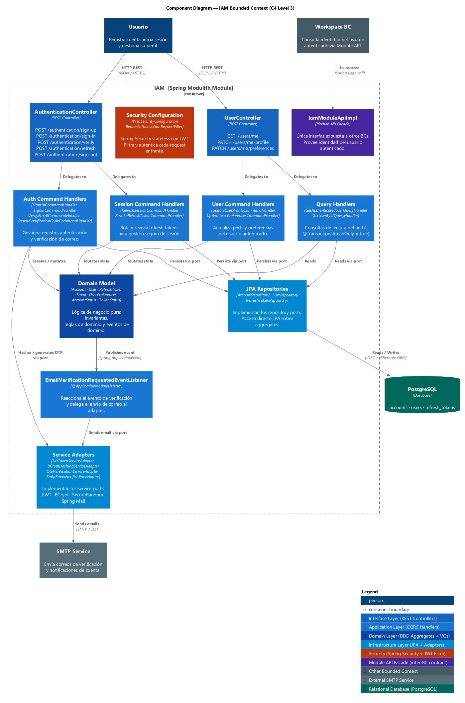

### 5.1.7. Bounded Context Software Architecture Code Level Diagrams

#### 5.1.7.1. Bounded Context Domain Layer Class Diagrams

En esta sección se presenta el diagrama de clases UML del Domain Layer del BC IAM. Incluye los tres Aggregate Roots, los Value Objects, las enumeraciones y los Domain Events, con visibilidades completas, multiplicidades y relaciones de herencia, composición y dependencia.


#### 5.1.7.2. Bounded Context Database Design Diagram

En esta sección se presenta el diagrama de base de datos del BC IAM. Incluye las tres tablas que persisten los Aggregate Roots, con sus columnas, constraints y relaciones. El VO `Email` se persiste como columna embebida en `accounts`. El VO `UserPreferences` se persiste como columnas embebidas en `users`.

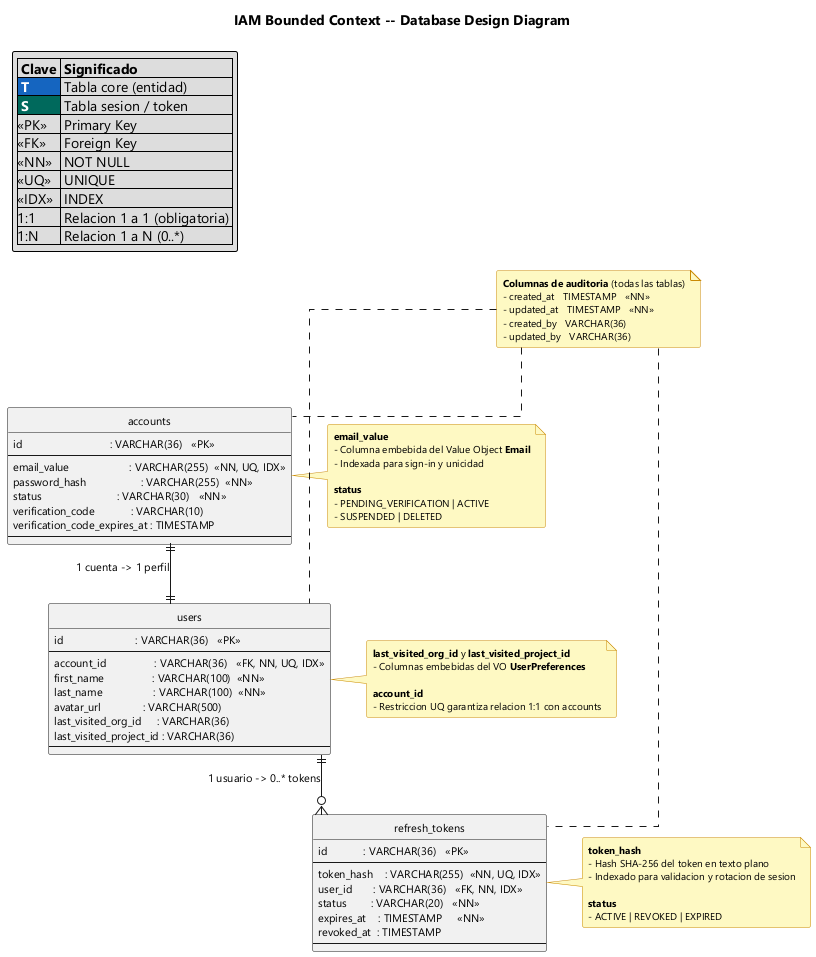

## 5.2. Bounded Context: Billing and Subscriptions

El BC Billing and Subscriptions gestiona el ciclo de vida de las suscripciones de las organizaciones en Reqs-AI. Es responsable desde la asignación del plan gratuito hasta las transiciones de plan, cancelaciones y seguimiento del consumo de tokens. Implementa el patrón `PaymentProviderRef` para mantenerse desacoplado del proveedor de pagos concreto (Stripe, culqi, etc.).

### 5.2.1. Domain Layer

Esta capa contiene las reglas de negocio de suscripciones, cuotas de uso y ciclo de vida de planes, sin dependencia de frameworks externos.

**Aggregate Roots**

**Aggregate: `Subscription`**

| Campo               | Detalle                                                                                                                                                                                   |
|---------------------|-------------------------------------------------------------------------------------------------------------------------------------------------------------------------------------------|
| **Paquete**         | `com.kntrosoft.reqsai.billing.domain.model.aggregates`                                                                                                                                    |
| **Extiende**        | `AbstractAggregateRoot<Subscription>`                                                                                                                                                     |
| **Propósito**       | Representa la suscripción de una organización a un plan. Controla las transiciones de plan, cancelaciones, reactivaciones y el seguimiento del consumo de tokens contra la cuota mensual. |
| **Anotaciones JPA** | `@Entity`, `@Table(name = "subscriptions")`                                                                                                                                               |

**Atributos:**

| Atributo             | Tipo                  | Columna JPA            | Descripción                                                  |
|----------------------|-----------------------|------------------------|--------------------------------------------------------------|
| `id`                 | `SubscriptionId`      | `id`                   | Identificador único de la suscripción (UUID).                |
| `organizationId`     | `OrganizationId`      | `organization_id`      | Referencia a la organización propietaria.                    |
| `planType`           | `PlanType`            | `plan_type`            | Plan actual: FREE, PRO o ENTERPRISE.                         |
| `status`             | `SubscriptionStatus`  | `status`               | Estado actual de la suscripción en su ciclo de vida.         |
| `providerRef`        | `PaymentProviderRef?` | `@Embedded`            | Referencia al proveedor de pagos externo. Nulo en plan FREE. |
| `currentPeriodStart` | `Instant`             | `current_period_start` | Inicio del período de facturación vigente.                   |
| `currentPeriodEnd`   | `Instant`             | `current_period_end`   | Fin del período de facturación vigente.                      |
| `tokenQuotaUsed`     | `Long`                | `token_quota_used`     | Tokens consumidos en el período actual.                      |
| `cancelledAt`        | `Instant?`            | `cancelled_at`         | Fecha de cancelación. Nulo si no ha sido cancelada.          |

**Constructores:**

| Constructor                                   | Visibilidad | Propósito                                                                       |
|-----------------------------------------------|-------------|---------------------------------------------------------------------------------|
| `protected Subscription()`                    | `protected` | Para JPA. No instanciar directamente.                                           |
| `Subscription(OrganizationId organizationId)` | `public`    | Crea suscripción gratuita en estado `ACTIVE`. Inicializa `tokenQuotaUsed` en 0. |

**Métodos de negocio:**

| Método                                                                                                 | Visibilidad | Parámetros                                            | Retorna | Descripción                                                            | Excepciones lanzadas                                                        |
|--------------------------------------------------------------------------------------------------------|-------------|-------------------------------------------------------|---------|------------------------------------------------------------------------|-----------------------------------------------------------------------------|
| `upgradeTo(PlanType planType, PaymentProviderRef providerRef, Instant periodStart, Instant periodEnd)` | `public`    | `planType`, `providerRef`, `periodStart`, `periodEnd` | `void`  | Transiciona a un plan superior y registra la referencia del proveedor. | `CannotUpgradeSubscriptionException` si está cancelada o ya tiene ese plan. |
| `cancel(Instant cancelledAt)`                                                                          | `public`    | `cancelledAt: Instant`                                | `void`  | Cancela la suscripción.                                                | `CannotCancelSubscriptionException` si ya está cancelada.                   |
| `reactivate(Instant periodStart, Instant periodEnd)`                                                   | `public`    | `periodStart`, `periodEnd: Instant`                   | `void`  | Reactiva la suscripción cancelada.                                     | `CannotReactivateSubscriptionException` si no está en estado `CANCELLED`.   |
| `incrementTokenUsage(Long tokens)`                                                                     | `public`    | `tokens: Long`                                        | `void`  | Suma tokens al consumo del período actual.                             | —                                                                           |
| `resetQuota()`                                                                                         | `public`    | —                                                     | `void`  | Reinicia `tokenQuotaUsed` a 0 al inicio de nuevo período.              | —                                                                           |
| `applyProviderRef(PaymentProviderRef providerRef)`                                                     | `public`    | `providerRef: PaymentProviderRef`                     | `void`  | Actualiza la referencia del proveedor externo.                         | —                                                                           |

**Métodos de consulta:**

| Método                            | Visibilidad | Retorna   | Descripción                              |
|-----------------------------------|-------------|-----------|------------------------------------------|
| `isActive()`                      | `public`    | `boolean` | `true` si el status es `ACTIVE`.         |
| `isCancelled()`                   | `public`    | `boolean` | `true` si el status es `CANCELLED`.      |
| `isPastDue()`                     | `public`    | `boolean` | `true` si el status es `PAST_DUE`.       |
| `isQuotaExceeded(Long maxTokens)` | `public`    | `boolean` | `true` si `tokenQuotaUsed >= maxTokens`. |
| `isFree()`                        | `public`    | `boolean` | `true` si `planType` es `FREE`.          |

**Relaciones:**

| Relación                              | Tipo                      | Multiplicidad | Detalles                        |
|---------------------------------------|---------------------------|---------------|---------------------------------|
| `Subscription` → `OrganizationId`     | Referencia por ID         | 1..1          | Mantiene frontera de aggregate. |
| `Subscription` → `PaymentProviderRef` | Composición (`@Embedded`) | 0..1          | VO embebido, nulo en plan FREE. |

---

**Value Objects**

**Value Object: `PaymentProviderRef`**

| Campo         | Detalle                                                                                                                                           |
|---------------|---------------------------------------------------------------------------------------------------------------------------------------------------|
| **Paquete**   | `com.kntrosoft.reqsai.billing.domain.model.valueobjects`                                                                                          |
| **Tipo Java** | `record`                                                                                                                                          |
| **Propósito** | Encapsula la referencia a un proveedor de pagos externo. Permite cambiar de proveedor (Stripe → Culqi) sin modificar el aggregate `Subscription`. |

**Campos:**

| Campo        | Tipo              | Descripción                                       |
|--------------|-------------------|---------------------------------------------------|
| `provider`   | `PaymentProvider` | Proveedor que emitió la suscripción externa.      |
| `externalId` | `String`          | ID de la suscripción en el sistema del proveedor. |

**Validaciones en compact constructor:**

| Regla                                  | Excepción lanzada       | Error Code                     |
|----------------------------------------|-------------------------|--------------------------------|
| `provider` no puede ser nulo           | `InvalidValueException` | `INVALID_PAYMENT_PROVIDER_REF` |
| `externalId` no puede ser nulo o vacío | `InvalidValueException` | `INVALID_PAYMENT_PROVIDER_REF` |

---

**Value Object: `PaymentProvider`**

| Campo         | Detalle                                                                         |
|---------------|---------------------------------------------------------------------------------|
| **Paquete**   | `com.kntrosoft.reqsai.billing.domain.model.valueobjects`                        |
| **Tipo Java** | `enum`                                                                          |
| **Propósito** | Identifica el proveedor de pagos externo con el que se gestiona la suscripción. |

**Valores:**

| Valor          | Descripción en el negocio                  |
|----------------|--------------------------------------------|
| `STRIPE`       | Proveedor Stripe (mercado internacional).  |
| `CULQI`        | Proveedor Culqi (mercado latinoamericano). |
| `PAYPAL`       | Proveedor PayPal.                          |
| `MERCADO_PAGO` | Proveedor Mercado Pago.                    |

---

**Value Object: `PlanType`**

| Campo         | Detalle                                                  |
|---------------|----------------------------------------------------------|
| **Paquete**   | `com.kntrosoft.reqsai.billing.domain.model.valueobjects` |
| **Tipo Java** | `enum`                                                   |
| **Propósito** | Define los tipos de plan disponibles en Reqs-AI.         |

**Valores:**

| Valor        | Descripción en el negocio                                           |
|--------------|---------------------------------------------------------------------|
| `FREE`       | Plan gratuito con cuotas reducidas. Sin proveedor de pagos externo. |
| `PRO`        | Plan de pago mensual con cuotas ampliadas.                          |
| `ENTERPRISE` | Plan corporativo con cuotas máximas y soporte dedicado.             |

---

**Value Object: `SubscriptionStatus`**

| Campo         | Detalle                                                           |
|---------------|-------------------------------------------------------------------|
| **Paquete**   | `com.kntrosoft.reqsai.billing.domain.model.valueobjects`          |
| **Tipo Java** | `enum`                                                            |
| **Propósito** | Define los estados posibles del ciclo de vida de una suscripción. |

**Valores:**

| Valor       | Descripción en el negocio                                            |
|-------------|----------------------------------------------------------------------|
| `ACTIVE`    | Suscripción activa y vigente.                                        |
| `CANCELLED` | Suscripción cancelada. Acceso puede mantenerse hasta fin de período. |
| `PAST_DUE`  | Pago fallido. Acceso restringido hasta regularizar.                  |
| `TRIALING`  | En período de prueba.                                                |

---

**Domain Exceptions**

| Clase                                   | Extiende                         | HTTP Status | Error Code                       | Cuándo se lanza                                              |
|-----------------------------------------|----------------------------------|-------------|----------------------------------|--------------------------------------------------------------|
| `SubscriptionNotFoundException`         | `EntityNotFoundException`        | 404         | `SUBSCRIPTION_NOT_FOUND`         | No se encuentra la suscripción por ID u organizationId.      |
| `SubscriptionAlreadyExistsException`    | `BusinessRuleViolationException` | 409         | `SUBSCRIPTION_ALREADY_EXISTS`    | La organización ya tiene una suscripción activa.             |
| `CannotUpgradeSubscriptionException`    | `BusinessRuleViolationException` | 409         | `CANNOT_UPGRADE_SUBSCRIPTION`    | La suscripción está cancelada o ya tiene el plan solicitado. |
| `CannotCancelSubscriptionException`     | `BusinessRuleViolationException` | 409         | `CANNOT_CANCEL_SUBSCRIPTION`     | La suscripción ya está cancelada.                            |
| `CannotReactivateSubscriptionException` | `BusinessRuleViolationException` | 409         | `CANNOT_REACTIVATE_SUBSCRIPTION` | La suscripción no está en estado `CANCELLED`.                |
| `TokenQuotaExceededException`           | `BusinessRuleViolationException` | 409         | `TOKEN_QUOTA_EXCEEDED`           | El consumo de tokens supera la cuota del plan.               |

---

**Domain Events**

| Clase                        | Paquete                        | Campos clave                                                           | Se publica cuando                                | Consumido por                                                |
|------------------------------|--------------------------------|------------------------------------------------------------------------|--------------------------------------------------|--------------------------------------------------------------|
| `SubscriptionAssignedEvent`  | `billing/api/`                 | `subscriptionId`, `organizationId`, `planType`, `occurredAt`           | Se asigna el plan FREE a una organización nueva. | BC Workspace (aplica `PlanLimits` a la organización).        |
| `SubscriptionUpgradedEvent`  | `billing/api/`                 | `subscriptionId`, `organizationId`, `oldPlan`, `newPlan`, `occurredAt` | Se completa `UpgradeSubscriptionCommandHandler`. | BC Workspace (actualiza `PlanLimits`).                       |
| `SubscriptionCancelledEvent` | `billing/domain/model/events/` | `subscriptionId`, `organizationId`, `occurredAt`                       | La suscripción pasa a estado `CANCELLED`.        | Interno.                                                     |
| `TokenQuotaExceededEvent`    | `billing/api/`                 | `subscriptionId`, `organizationId`, `quotaUsed`, `occurredAt`          | `tokenQuotaUsed` alcanza el máximo del plan.     | BC Req Discovery (bloquea procesamiento de nuevas sesiones). |

---

**Commands**

| Clase                           | Paquete                  | Campos                                                                                         | Handler que lo procesa                 |
|---------------------------------|--------------------------|------------------------------------------------------------------------------------------------|----------------------------------------|
| `AssignFreeSubscriptionCommand` | `domain/model/commands/` | `organizationId: String`                                                                       | `AssignFreeSubscriptionCommandHandler` |
| `UpgradeSubscriptionCommand`    | `domain/model/commands/` | `subscriptionId: String`, `planType: String`, `providerExternalId: String`, `provider: String` | `UpgradeSubscriptionCommandHandler`    |
| `CancelSubscriptionCommand`     | `domain/model/commands/` | `subscriptionId: String`                                                                       | `CancelSubscriptionCommandHandler`     |
| `ReactivateSubscriptionCommand` | `domain/model/commands/` | `subscriptionId: String`                                                                       | `ReactivateSubscriptionCommandHandler` |
| `IncrementTokenUsageCommand`    | `domain/model/commands/` | `organizationId: String`, `tokens: Long`                                                       | `IncrementTokenUsageCommandHandler`    |
| `ResetQuotaCommand`             | `domain/model/commands/` | `subscriptionId: String`                                                                       | `ResetQuotaCommandHandler`             |

**Queries**

| Clase                                | Paquete                 | Campos                   | Handler que lo procesa                      |
|--------------------------------------|-------------------------|--------------------------|---------------------------------------------|
| `GetSubscriptionByOrganizationQuery` | `domain/model/queries/` | `organizationId: String` | `GetSubscriptionByOrganizationQueryHandler` |
| `GetSubscriptionByIdQuery`           | `domain/model/queries/` | `subscriptionId: String` | `GetSubscriptionByIdQueryHandler`           |

---

### 5.2.2. Interface Layer

Esta capa expone los endpoints REST del BC Billing para consulta y gestión de suscripciones, y recibe webhooks de proveedores de pago.

**Controllers**

**`SubscriptionController` (Swagger Interface)**

| Campo           | Detalle                                                                      |
|-----------------|------------------------------------------------------------------------------|
| **Paquete**     | `com.kntrosoft.reqsai.billing.interfaces.rest.swagger`                       |
| **Base path**   | `ApiVersioning.BASE + "/subscriptions"` → `/api/v1/subscriptions`            |
| **Tag OpenAPI** | `"Subscriptions"`                                                            |
| **Propósito**   | Contrato OpenAPI para consulta y gestión del ciclo de vida de suscripciones. |

| Método HTTP | Path                             | Nombre del método               | Request DTO                     | Response DTO           | Códigos HTTP            |
|-------------|----------------------------------|---------------------------------|---------------------------------|------------------------|-------------------------|
| `GET`       | `/organization/{organizationId}` | `getSubscriptionByOrganization` | — (path variable)               | `SubscriptionResponse` | 200, 401, 404           |
| `POST`      | `/`                              | `assignFreeSubscription`        | `AssignFreeSubscriptionRequest` | `SubscriptionResponse` | 201, 400, 401, 409      |
| `PUT`       | `/{id}/upgrade`                  | `upgradeSubscription`           | `UpgradeSubscriptionRequest`    | `SubscriptionResponse` | 200, 400, 401, 404, 409 |
| `PUT`       | `/{id}/cancel`                   | `cancelSubscription`            | —                               | `SubscriptionResponse` | 200, 401, 404, 409      |
| `PUT`       | `/{id}/reactivate`               | `reactivateSubscription`        | —                               | `SubscriptionResponse` | 200, 401, 404, 409      |

**`SubscriptionControllerImpl` (Implementation)**

| Campo           | Detalle                                                    |
|-----------------|------------------------------------------------------------|
| **Paquete**     | `com.kntrosoft.reqsai.billing.interfaces.rest.controllers` |
| **Anotaciones** | `@Slf4j`, `@RestController`, `@RequiredArgsConstructor`    |
| **Implementa**  | `SubscriptionController`                                   |

| Handler                                     | Para qué endpoint                    |
|---------------------------------------------|--------------------------------------|
| `GetSubscriptionByOrganizationQueryHandler` | `GET /organization/{organizationId}` |
| `AssignFreeSubscriptionCommandHandler`      | `POST /`                             |
| `UpgradeSubscriptionCommandHandler`         | `PUT /{id}/upgrade`                  |
| `CancelSubscriptionCommandHandler`          | `PUT /{id}/cancel`                   |
| `ReactivateSubscriptionCommandHandler`      | `PUT /{id}/reactivate`               |

---

**`BillingWebhookController` (Swagger Interface)**

| Campo           | Detalle                                                                                         |
|-----------------|-------------------------------------------------------------------------------------------------|
| **Paquete**     | `com.kntrosoft.reqsai.billing.interfaces.rest.swagger`                                          |
| **Base path**   | `ApiVersioning.BASE + "/billing/webhooks"` → `/api/v1/billing/webhooks`                         |
| **Tag OpenAPI** | `"Billing Webhooks"`                                                                            |
| **Propósito**   | Recibe notificaciones de eventos de proveedores de pago (pagos exitosos, fallos, renovaciones). |

| Método HTTP | Path      | Nombre del método     | Request DTO            | Response DTO | Códigos HTTP |
|-------------|-----------|-----------------------|------------------------|--------------|--------------|
| `POST`      | `/stripe` | `handleStripeWebhook` | `String` (payload raw) | `void`       | 200, 400     |
| `POST`      | `/culqi`  | `handleCulqiWebhook`  | `String` (payload raw) | `void`       | 200, 400     |

**`BillingWebhookControllerImpl` (Implementation)**

| Campo           | Detalle                                                    |
|-----------------|------------------------------------------------------------|
| **Paquete**     | `com.kntrosoft.reqsai.billing.interfaces.rest.controllers` |
| **Anotaciones** | `@Slf4j`, `@RestController`, `@RequiredArgsConstructor`    |
| **Implementa**  | `BillingWebhookController`                                 |

| Handler                                                                  | Para qué endpoint                  |
|--------------------------------------------------------------------------|------------------------------------|
| `PaymentProviderPort`                                                    | Verificación de firma del webhook. |
| `UpgradeSubscriptionCommandHandler` / `CancelSubscriptionCommandHandler` | Según evento del proveedor.        |

---

**Request DTOs**

| Clase                           | Paquete                        | Campos                                                               | Validaciones Jakarta |
|---------------------------------|--------------------------------|----------------------------------------------------------------------|----------------------|
| `AssignFreeSubscriptionRequest` | `interfaces/rest/dto/request/` | `organizationId: String`                                             | `@NotBlank`          |
| `UpgradeSubscriptionRequest`    | `interfaces/rest/dto/request/` | `planType: String`, `provider: String`, `providerExternalId: String` | `@NotBlank` en todos |

**Response DTOs**

| Clase                  | Paquete                         | Campos                                                                                                                                                                                                                                        | Notas                  |
|------------------------|---------------------------------|-----------------------------------------------------------------------------------------------------------------------------------------------------------------------------------------------------------------------------------------------|------------------------|
| `SubscriptionResponse` | `interfaces/rest/dto/response/` | `id: String`, `organizationId: String`, `planType: String`, `status: String`, `provider: String?`, `providerExternalId: String?`, `currentPeriodStart: Instant`, `currentPeriodEnd: Instant`, `tokenQuotaUsed: Long`, `cancelledAt: Instant?` | `@Builder` + `@Schema` |

**Mappers**

**Request Mappers:**

| Clase                                 | Método                                                                                       | Convierte                                                                   |
|---------------------------------------|----------------------------------------------------------------------------------------------|-----------------------------------------------------------------------------|
| `AssignFreeSubscriptionRequestMapper` | `static AssignFreeSubscriptionCommand toCommand(AssignFreeSubscriptionRequest request)`      | DTO → Command.                                                              |
| `UpgradeSubscriptionRequestMapper`    | `static UpgradeSubscriptionCommand toCommand(String id, UpgradeSubscriptionRequest request)` | Combina path variable + body en el Command. Construye `PaymentProviderRef`. |

**Response Mappers:**

| Clase                        | Método                                                              | Convierte                                                                 |
|------------------------------|---------------------------------------------------------------------|---------------------------------------------------------------------------|
| `SubscriptionResponseMapper` | `static SubscriptionResponse toResponse(Subscription subscription)` | Aggregate → DTO. Extrae `provider.name()` y `externalId` del VO embebido. |

---

### 5.2.3. Application Layer

Esta capa orquesta los casos de uso de Billing. Coordina la validación de negocio, la persistencia y la publicación de eventos sin contener lógica de dominio.

**Command Handlers**

**`AssignFreeSubscriptionCommandHandler`**

| Campo                  | Detalle                                                                                                                    |
|------------------------|----------------------------------------------------------------------------------------------------------------------------|
| **Paquete**            | `com.kntrosoft.reqsai.billing.application.subscription.assignfree`                                                         |
| **Anotaciones**        | `@Slf4j`, `@Service`, `@RequiredArgsConstructor`, `@Transactional`                                                         |
| **Command que recibe** | `AssignFreeSubscriptionCommand`                                                                                            |
| **Retorna**            | `Subscription`                                                                                                             |
| **Propósito**          | Asigna el plan FREE a una organización recién creada. Generalmente invocado por el BC Workspace al crear una organización. |

**Dependencias:**

| Puerto                       | Para qué se usa                                |
|------------------------------|------------------------------------------------|
| `SubscriptionRepositoryPort` | Verificar unicidad y persistir `Subscription`. |
| `ApplicationEventPublisher`  | Publicar `SubscriptionAssignedEvent`.          |

**Flujo:**

| Paso | Acción                                                       | Excepción lanzada                    |
|------|--------------------------------------------------------------|--------------------------------------|
| 1    | Verificar que la organización no tenga ya una suscripción.   | `SubscriptionAlreadyExistsException` |
| 2    | Crear `Subscription` con `new Subscription(organizationId)`. | —                                    |
| 3    | Persistir con `subscriptionRepository.save(subscription)`.   | —                                    |
| 4    | Publicar `SubscriptionAssignedEvent`.                        | —                                    |

---

**`UpgradeSubscriptionCommandHandler`**

| Campo                  | Detalle                                                                                     |
|------------------------|---------------------------------------------------------------------------------------------|
| **Paquete**            | `com.kntrosoft.reqsai.billing.application.subscription.upgrade`                             |
| **Anotaciones**        | `@Slf4j`, `@Service`, `@RequiredArgsConstructor`, `@Transactional`                          |
| **Command que recibe** | `UpgradeSubscriptionCommand`                                                                |
| **Retorna**            | `Subscription`                                                                              |
| **Propósito**          | Actualiza la suscripción a un plan superior y registra la referencia del proveedor externo. |

**Dependencias:**

| Puerto                       | Para qué se usa                             |
|------------------------------|---------------------------------------------|
| `SubscriptionRepositoryPort` | Cargar y persistir `Subscription`.          |
| `PaymentProviderPort`        | Confirmar el pago con el proveedor externo. |
| `ApplicationEventPublisher`  | Publicar `SubscriptionUpgradedEvent`.       |

**Flujo:**

| Paso | Acción                                                                          | Excepción lanzada                    |
|------|---------------------------------------------------------------------------------|--------------------------------------|
| 1    | Cargar `Subscription` por ID.                                                   | `SubscriptionNotFoundException`      |
| 2    | Confirmar pago con `PaymentProviderPort.confirmUpgrade()`.                      | `PaymentProviderException`           |
| 3    | Construir `PaymentProviderRef(provider, externalId)`.                           | —                                    |
| 4    | Llamar `subscription.upgradeTo(planType, providerRef, periodStart, periodEnd)`. | `CannotUpgradeSubscriptionException` |
| 5    | Persistir y publicar `SubscriptionUpgradedEvent`.                               | —                                    |

---

**`CancelSubscriptionCommandHandler`**

| Campo                  | Detalle                                                            |
|------------------------|--------------------------------------------------------------------|
| **Paquete**            | `com.kntrosoft.reqsai.billing.application.subscription.cancel`     |
| **Anotaciones**        | `@Slf4j`, `@Service`, `@RequiredArgsConstructor`, `@Transactional` |
| **Command que recibe** | `CancelSubscriptionCommand`                                        |
| **Retorna**            | `void`                                                             |
| **Propósito**          | Cancela la suscripción activa.                                     |

**Flujo:**

| Paso | Acción                                             | Excepción lanzada                   |
|------|----------------------------------------------------|-------------------------------------|
| 1    | Cargar `Subscription` por ID.                      | `SubscriptionNotFoundException`     |
| 2    | Llamar `subscription.cancel(Instant.now())`.       | `CannotCancelSubscriptionException` |
| 3    | Persistir y publicar `SubscriptionCancelledEvent`. | —                                   |

---

**`ReactivateSubscriptionCommandHandler`**

| Campo                  | Detalle                                                            |
|------------------------|--------------------------------------------------------------------|
| **Paquete**            | `com.kntrosoft.reqsai.billing.application.subscription.reactivate` |
| **Anotaciones**        | `@Slf4j`, `@Service`, `@RequiredArgsConstructor`, `@Transactional` |
| **Command que recibe** | `ReactivateSubscriptionCommand`                                    |
| **Retorna**            | `Subscription`                                                     |
| **Propósito**          | Reactiva una suscripción previamente cancelada.                    |

**Flujo:**

| Paso | Acción                                                    | Excepción lanzada                       |
|------|-----------------------------------------------------------|-----------------------------------------|
| 1    | Cargar `Subscription` por ID.                             | `SubscriptionNotFoundException`         |
| 2    | Llamar `subscription.reactivate(periodStart, periodEnd)`. | `CannotReactivateSubscriptionException` |
| 3    | Persistir `Subscription` actualizado.                     | —                                       |

---

**`IncrementTokenUsageCommandHandler`**

| Campo                  | Detalle                                                                                                                                     |
|------------------------|---------------------------------------------------------------------------------------------------------------------------------------------|
| **Paquete**            | `com.kntrosoft.reqsai.billing.application.subscription.tokenusage`                                                                          |
| **Anotaciones**        | `@Slf4j`, `@Service`, `@RequiredArgsConstructor`, `@Transactional`                                                                          |
| **Command que recibe** | `IncrementTokenUsageCommand`                                                                                                                |
| **Retorna**            | `void`                                                                                                                                      |
| **Propósito**          | Incrementa el consumo de tokens de la organización. Publica evento si se alcanza la cuota. Invocado internamente desde el BC Req Discovery. |

**Flujo:**

| Paso | Acción                                                                            | Excepción lanzada               |
|------|-----------------------------------------------------------------------------------|---------------------------------|
| 1    | Cargar `Subscription` por `organizationId`.                                       | `SubscriptionNotFoundException` |
| 2    | Llamar `subscription.incrementTokenUsage(tokens)`.                                | —                               |
| 3    | Persistir `Subscription`.                                                         | —                               |
| 4    | Si `subscription.isQuotaExceeded(maxTokens)`, publicar `TokenQuotaExceededEvent`. | —                               |

---

**`ResetQuotaCommandHandler`**

| Campo                  | Detalle                                                                                                                             |
|------------------------|-------------------------------------------------------------------------------------------------------------------------------------|
| **Paquete**            | `com.kntrosoft.reqsai.billing.application.subscription.resetquota`                                                                  |
| **Anotaciones**        | `@Slf4j`, `@Service`, `@RequiredArgsConstructor`, `@Transactional`                                                                  |
| **Command que recibe** | `ResetQuotaCommand`                                                                                                                 |
| **Retorna**            | `void`                                                                                                                              |
| **Propósito**          | Reinicia el contador de tokens al inicio de cada período de facturación. Invocado por un scheduler mensual o webhook del proveedor. |

**Flujo:**

| Paso | Acción                                          | Excepción lanzada               |
|------|-------------------------------------------------|---------------------------------|
| 1    | Cargar `Subscription` por ID.                   | `SubscriptionNotFoundException` |
| 2    | Llamar `subscription.resetQuota()` y persistir. | —                               |

---

**Query Handlers**

| Clase                                       | Paquete                             | Query que recibe                     | Retorna        | Notas                                               |
|---------------------------------------------|-------------------------------------|--------------------------------------|----------------|-----------------------------------------------------|
| `GetSubscriptionByOrganizationQueryHandler` | `application/subscription/queries/` | `GetSubscriptionByOrganizationQuery` | `Subscription` | Lanza `SubscriptionNotFoundException` si no existe. |
| `GetSubscriptionByIdQueryHandler`           | `application/subscription/queries/` | `GetSubscriptionByIdQuery`           | `Subscription` | Lanza `SubscriptionNotFoundException` si no existe. |

---

**Event Listeners**

| Clase                               | Evento que escucha          | Qué hace                                                                              | Puertos que usa                    |
|-------------------------------------|-----------------------------|---------------------------------------------------------------------------------------|------------------------------------|
| `SubscriptionAssignedEventListener` | `SubscriptionAssignedEvent` | Notifica al BC Workspace para aplicar los `PlanLimits` correspondientes al plan FREE. | `WorkspaceModuleApi` (in-process). |
| `SubscriptionUpgradedEventListener` | `SubscriptionUpgradedEvent` | Notifica al BC Workspace para actualizar los `PlanLimits` al nuevo plan.              | `WorkspaceModuleApi` (in-process). |

---

**Output Ports**

**Repository Ports** — `application/ports/repositories/`:

| Interfaz                     | Método                   | Firma                                                                | Descripción                         |
|------------------------------|--------------------------|----------------------------------------------------------------------|-------------------------------------|
| `SubscriptionRepositoryPort` | `save`                   | `Subscription save(Subscription subscription)`                       | Persiste o actualiza.               |
|                              | `findById`               | `Optional<Subscription> findById(String id)`                         | Busca por ID.                       |
|                              | `findByOrganizationId`   | `Optional<Subscription> findByOrganizationId(String organizationId)` | Busca por organización.             |
|                              | `existsByOrganizationId` | `boolean existsByOrganizationId(String organizationId)`              | Verifica unicidad por organización. |

**Service Ports** — `application/ports/`:

| Interfaz              | Paquete          | Métodos clave                                                                                                          | Implementación en infra                                       |
|-----------------------|------------------|------------------------------------------------------------------------------------------------------------------------|---------------------------------------------------------------|
| `PaymentProviderPort` | `ports/payment/` | `confirmUpgrade(String externalId, PaymentProvider provider): boolean`, `cancelExternal(PaymentProviderRef ref): void` | `StripePaymentProviderAdapter`, `CulqiPaymentProviderAdapter` |

---

### 5.2.4. Infrastructure Layer

Esta capa contiene las implementaciones técnicas de los puertos definidos en Billing. El dominio no conoce esta capa.

**JPA Repositories**

| Clase                    | Extiende                              | Implementa                   | Propósito                                                                       |
|--------------------------|---------------------------------------|------------------------------|---------------------------------------------------------------------------------|
| `SubscriptionRepository` | `JpaRepository<Subscription, String>` | `SubscriptionRepositoryPort` | Persistencia de suscripciones. Spring Data genera queries por `organizationId`. |

**Métodos derivados (Spring Data):**

| Repositorio              | Firma                                                                | Descripción                                          |
|--------------------------|----------------------------------------------------------------------|------------------------------------------------------|
| `SubscriptionRepository` | `Optional<Subscription> findByOrganizationId(String organizationId)` | Búsqueda de la suscripción vigente por organización. |
| `SubscriptionRepository` | `boolean existsByOrganizationId(String organizationId)`              | Verificación de unicidad.                            |

---

**Adapters Externos**

| Clase                          | Implementa            | Servicio externo | Tecnología                   | Propósito                                                                                                  |
|--------------------------------|-----------------------|------------------|------------------------------|------------------------------------------------------------------------------------------------------------|
| `StripePaymentProviderAdapter` | `PaymentProviderPort` | Stripe API       | Stripe Java SDK              | Confirma pagos, crea y cancela suscripciones en Stripe. Verifica firma de webhooks con `Stripe-Signature`. |
| `CulqiPaymentProviderAdapter`  | `PaymentProviderPort` | Culqi API        | Culqi Java SDK / HTTP client | Confirma pagos y gestiona suscripciones en Culqi para el mercado latinoamericano.                          |

**Configuración de infraestructura:**

| Clase                           | Propósito                                                                                                                                                 |
|---------------------------------|-----------------------------------------------------------------------------------------------------------------------------------------------------------|
| `BillingSchedulerConfiguration` | Define el scheduler mensual (`@Scheduled`) que dispara `ResetQuotaCommand` para todas las suscripciones activas al inicio de cada período de facturación. |

### 5.2.6. Bounded Context Software Architecture Component Level Diagrams

En esta sección se presenta el diagrama de componentes C4 (Nivel 3) del BC Billing and Subscriptions. El container es el módulo Spring Modulith completo. Los componentes reflejan la descomposición por capas y sus interacciones, incluyendo el scheduler de reset de cuota y la integración con proveedores de pago externos.

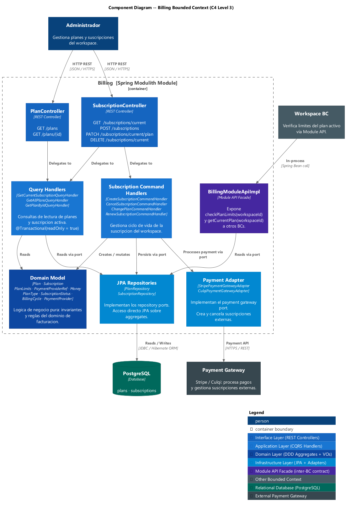

### 5.2.7. Bounded Context Software Architecture Code Level Diagrams

#### 5.2.7.1. Bounded Context Domain Layer Class Diagrams

En esta sección se presenta el diagrama de clases UML del Domain Layer del BC Billing. Incluye el Aggregate Root `Subscription`, los Value Objects (`PaymentProviderRef`, `SubscriptionId`, `OrganizationId`), las enumeraciones (`PlanType`, `SubscriptionStatus`, `PaymentProvider`), los Domain Events publicados al Api package y las excepciones de dominio con su jerarquía de herencia desde el Shared Kernel.

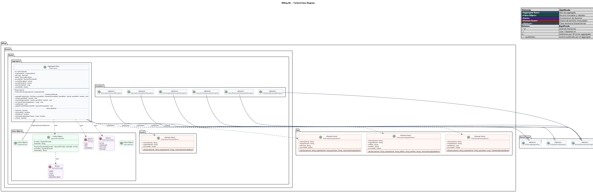

#### 5.2.7.2. Bounded Context Database Design Diagram

En esta sección se presenta el diagrama de base de datos del BC Billing. La persistencia se reduce a una única tabla `subscriptions`, que almacena el ciclo de vida de la suscripción de cada organización. El VO `PaymentProviderRef` se persiste como columnas embebidas (`payment_provider`, `payment_external_id`). La columna `token_quota_used` acumula el consumo de tokens del período actual y se reinicia vía scheduler mensual.

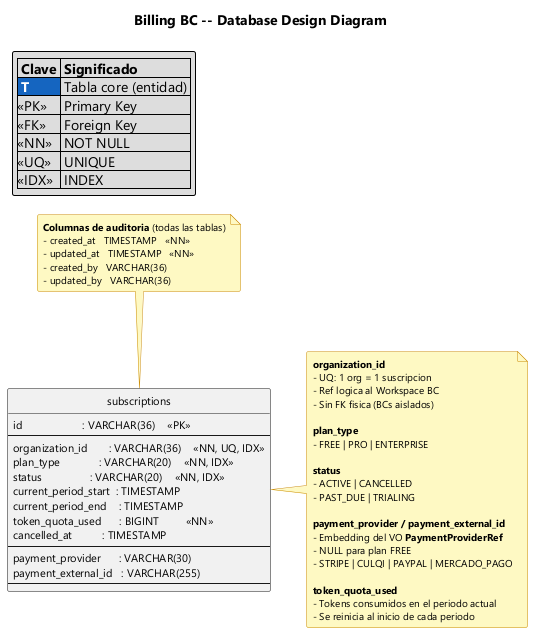

## 5.3. Bounded Context: Workspace Management

### 5.3.1. Domain Layer

El Bounded Context de Workspace Management gestiona las organizaciones, miembros, proyectos, roles, documentos y glosarios. Es el núcleo estructural de la plataforma: todo el trabajo de elicitación de requisitos ocurre dentro de un proyecto, que a su vez pertenece a una organización. Este BC también aplica los límites de plan definidos por Billing sobre cada organización.

**Aggregate Roots**

---

**`Organization`** — tabla: `organizations`

Representa la unidad raíz de tenencia multi-organizacional. Contiene los límites de plan activos que controlan los recursos disponibles.

| Campo        | Tipo             | Descripción                                              |
|--------------|------------------|----------------------------------------------------------|
| `id`         | `OrganizationId` | Identificador único de la organización                   |
| `name`       | `String`         | Nombre visible de la organización                        |
| `slug`       | `String`         | Identificador URL único (inmutable tras creación)        |
| `ownerId`    | `UserId`         | Referencia al usuario propietario                        |
| `status`     | `OrgStatus`      | Estado: `ACTIVE`, `INACTIVE`, `DELETED`                  |
| `planLimits` | `PlanLimits`     | Límites operativos actuales según el plan de facturación |

| Método                         | Descripción                                             |
|--------------------------------|---------------------------------------------------------|
| `rename(name)`                 | Actualiza el nombre de la organización                  |
| `updateLimits(limits)`         | Reemplaza los límites de plan tras un evento de Billing |
| `deactivate()`                 | Cambia el estado a `INACTIVE`                           |
| `reactivate()`                 | Cambia el estado a `ACTIVE`                             |
| `delete()`                     | Cambia el estado a `DELETED`                            |

| Excepción lanzada                        | Condición de disparo            |
|------------------------------------------|---------------------------------|
| `OrganizationSlugAlreadyExistsException` | El slug ya existe en el sistema |

---

**`Member`** — tabla: `members`

Representa la pertenencia de un usuario a una organización. Los fundadores tienen `invitedBy` e `invitedAt` en `null`; los invitados siempre los tienen definidos.

| Campo            | Tipo             | Descripción                                                |
|------------------|------------------|------------------------------------------------------------|
| `id`             | `MemberId`       | Identificador único de membresía                           |
| `organizationId` | `OrganizationId` | Organización a la que pertenece                            |
| `userId`         | `UserId`         | Usuario representado                                       |
| `role`           | `OrgRole`        | Rol en la organización: `OWNER`, `ADMIN`, `MEMBER`         |
| `status`         | `MemberStatus`   | Estado: `ACTIVE`, `PENDING`, `INACTIVE`                    |
| `invitedBy`      | `UserId?`        | Usuario que realizó la invitación (`null` para fundadores) |
| `invitedAt`      | `Instant?`       | Momento de la invitación (`null` para fundadores)          |

| Método                  | Descripción                                               |
|-------------------------|-----------------------------------------------------------|
| `changeRole(role)`      | Cambia el rol del miembro dentro de la organización       |
| `accept()`              | Cambia el estado de `PENDING` a `ACTIVE`                  |
| `deactivate()`          | Cambia el estado a `INACTIVE`                             |
| `reactivate()`          | Cambia el estado a `ACTIVE`                               |

| Excepción lanzada                  | Condición de disparo                               |
|------------------------------------|----------------------------------------------------|
| `MemberAlreadyExistsException`     | El usuario ya es miembro de la organización        |
| `MemberPlanLimitExceededException` | Se alcanzó el límite `maxMembers` del plan         |

---

**`Project`** — tabla: `projects`

Agrupa todo el trabajo de elicitación de requisitos. Contiene el perfil técnico del proyecto y las restricciones definidas por el equipo. El `descriptionEmbedding` permite búsqueda semántica entre proyectos.

| Campo                  | Tipo                      | Descripción                                                     |
|------------------------|---------------------------|-----------------------------------------------------------------|
| `id`                   | `ProjectId`               | Identificador único del proyecto                                |
| `organizationId`       | `OrganizationId`          | Organización propietaria                                        |
| `name`                 | `String`                  | Nombre del proyecto (único dentro de la organización)           |
| `description`          | `String`                  | Descripción del alcance del proyecto                            |
| `technicalProfile`     | `TechnicalProfile`        | Perfil técnico: lenguajes, frameworks, arquitectura, dominio    |
| `status`               | `ProjectStatus`           | Estado: `ACTIVE`, `ARCHIVED`                                    |
| `descriptionEmbedding` | `List<Float>?`            | Vector embedding de la descripción para búsqueda semántica      |
| `constraints`          | `List<ProjectConstraint>` | Restricciones técnicas del proyecto (entidades compuestas)      |

| Método                                               | Descripción                                        |
|------------------------------------------------------|----------------------------------------------------|
| `updateDetails(name, description, technicalProfile)` | Actualiza metadatos del proyecto                   |
| `updateEmbedding(embedding)`                         | Reemplaza el vector de embedding de la descripción |
| `addConstraint(description)`                         | Agrega una nueva restricción técnica               |
| `removeConstraint(constraintId)`                     | Elimina una restricción existente                  |
| `archive()`                                          | Cambia el estado a `ARCHIVED`                      |
| `restore()`                                          | Cambia el estado a `ACTIVE`                        |

| Excepción lanzada                     | Condición de disparo                                    |
|---------------------------------------|---------------------------------------------------------|
| `ProjectNameAlreadyExistsException`   | El nombre ya existe dentro de la misma organización     |
| `ProjectPlanLimitExceededException`   | Se alcanzó el límite `maxProjects` del plan             |

---

**`ProjectRole`** — tabla: `project_roles`

Define un conjunto de permisos asignables a los miembros de un proyecto. Cada proyecto puede tener múltiples roles personalizados.

| Campo         | Tipo              | Descripción                                |
|---------------|-------------------|--------------------------------------------|
| `id`          | `ProjectRoleId`   | Identificador único del rol                |
| `projectId`   | `ProjectId`       | Proyecto al que pertenece el rol           |
| `name`        | `String`          | Nombre del rol (único dentro del proyecto) |
| `permissions` | `Set<Permission>` | Conjunto de permisos asignados             |

| Método                           | Descripción                       |
|----------------------------------|-----------------------------------|
| `rename(name)`                   | Cambia el nombre del rol          |
| `updatePermissions(permissions)` | Reemplaza el conjunto de permisos |

| Excepción lanzada                       | Condición de disparo                          |
|-----------------------------------------|-----------------------------------------------|
| `ProjectRoleNameAlreadyExistsException` | El nombre del rol ya existe en el proyecto    |

---

**`ProjectMember`** — tabla: `project_members`

Relaciona un miembro de la organización con un proyecto y le asigna un rol. Los campos `assignedBy` y `assignedAt` son campos de dominio propios (no campos de auditoría heredados).

| Campo          | Tipo              | Descripción                                              |
|----------------|-------------------|----------------------------------------------------------|
| `id`           | `ProjectMemberId` | Identificador único de la membresía de proyecto          |
| `projectId`    | `ProjectId`       | Proyecto al que pertenece                                |
| `memberId`     | `MemberId`        | Miembro de la organización asignado                      |
| `roleId`       | `ProjectRoleId`   | Rol asignado dentro del proyecto                         |
| `assignedBy`   | `UserId`          | Usuario que realizó la asignación                        |
| `assignedAt`   | `Instant`         | Momento de la asignación                                 |

| Método                  | Descripción                                             |
|-------------------------|---------------------------------------------------------|
| `changeRole(roleId)`    | Reasigna el rol del miembro dentro del proyecto         |

| Excepción lanzada                      | Condición de disparo                            |
|----------------------------------------|-------------------------------------------------|
| `ProjectMemberAlreadyExistsException`  | El miembro ya está asignado al proyecto         |

---

**`ProjectDocument`** — tabla: `project_documents`

Representa un documento cargado en el contexto de un proyecto (especificaciones, manuales, contratos). El responsable de carga se obtiene de `createdBy` heredado de `AbstractAggregateRoot`.

| Campo       | Tipo                  | Descripción                                              |
|-------------|-----------------------|----------------------------------------------------------|
| `id`        | `ProjectDocumentId`   | Identificador único del documento                        |
| `projectId` | `ProjectId`           | Proyecto al que pertenece                                |
| `name`      | `String`              | Nombre descriptivo del documento                         |
| `url`       | `String`              | URL de almacenamiento (S3 o equivalente)                 |
| `mimeType`  | `String`              | Tipo MIME del archivo                                    |
| `status`    | `DocumentStatus`      | Estado: `ACTIVE`, `ARCHIVED`                             |

| Método      | Descripción                         |
|-------------|-------------------------------------|
| `archive()` | Cambia el estado a `ARCHIVED`       |
| `restore()` | Cambia el estado a `ACTIVE`         |

| Excepción lanzada                      | Condición de disparo                               |
|----------------------------------------|----------------------------------------------------|
| `DocumentPlanLimitExceededException`   | Se alcanzó el límite `maxDocumentsPerProject`      |

---

**`Glossary`** — tabla: `glossaries`

Glosario de términos técnicos de un proyecto. Se crea automáticamente al crear el proyecto. Gestiona la composición de `GlossaryTerm` como entidades internas.

| Campo       | Tipo                 | Descripción                       |
|-------------|----------------------|-----------------------------------|
| `id`        | `GlossaryId`         | Identificador único del glosario  |
| `projectId` | `ProjectId`          | Proyecto al que pertenece (1:1)   |
| `terms`     | `List<GlossaryTerm>` | Términos del glosario (entidades) |

| Método                                         | Descripción                                           |
|------------------------------------------------|-------------------------------------------------------|
| `addTerm(term, definition, synonyms, addedBy)` | Agrega un nuevo término al glosario                   |
| `removeTerm(termId)`                           | Elimina un término existente                          |
| `updateTerm(termId, definition, synonyms)`     | Actualiza la definición y sinónimos de un término     |

| Excepción lanzada                        | Condición de disparo                                  |
|------------------------------------------|-------------------------------------------------------|
| `GlossaryTermPlanLimitExceededException` | Se alcanzó el límite `maxGlossaryTermsPerProject`     |
| `GlossaryTermNotFoundException`          | El término solicitado no existe en el glosario        |

---

**Entities**

**`ProjectConstraint`** — tabla: `project_constraints`

Restricción técnica o de negocio definido para un proyecto. El `embedding` permite que Requirement Discovery pueda consultarlas semánticamente.

| Campo         | Tipo                    | Descripción                                              |
|---------------|-------------------------|----------------------------------------------------------|
| `id`          | `ProjectConstraintId`   | Identificador único de la restricción                    |
| `projectId`   | `ProjectId`             | Proyecto al que pertenece                                |
| `description` | `String`                | Descripción textual de la restricción                    |
| `embedding`   | `List<Float>?`          | Vector embedding para búsqueda semántica                 |

| Método                            | Descripción                                          |
|-----------------------------------|------------------------------------------------------|
| `updateDescription(description)`  | Actualiza el texto de la restricción                 |
| `updateEmbedding(embedding)`      | Reemplaza el vector embedding                        |

---

**`GlossaryTerm`** — tabla: `glossary_terms`

Término técnico con definición y sinónimos. El `embedding` permite búsqueda semántica desde Requirement Discovery durante la generación de historias de usuario.

| Campo        | Tipo             | Descripción                                               |
|--------------|------------------|-----------------------------------------------------------|
| `id`         | `GlossaryTermId` | Identificador único del término                           |
| `glossaryId` | `GlossaryId`     | Glosario al que pertenece                                 |
| `term`       | `String`         | Término técnico o de dominio                              |
| `definition` | `String`         | Definición del término                                    |
| `synonyms`   | `List<String>`   | Lista de sinónimos o variantes                            |
| `addedBy`    | `UserId`         | Usuario que agregó el término                             |
| `addedAt`    | `Instant`        | Momento en que fue agregado                               |
| `embedding`  | `List<Float>?`   | Vector embedding de la definición para búsqueda semántica |

| Método                              | Descripción                                          |
|-------------------------------------|------------------------------------------------------|
| `update(definition, synonyms)`      | Actualiza la definición y los sinónimos              |
| `updateEmbedding(embedding)`        | Reemplaza el vector embedding                        |

---

**Value Objects**

**`PlanLimits`** — `com.kntrosoft.reqsai.workspace.domain.model.valueobjects`

Value Object inmutable que encapsula los límites operativos de un plan de facturación. Definido como `record` de Java.

| Campo                        | Tipo   | Descripción                                           |
|------------------------------|--------|-------------------------------------------------------|
| `maxMembers`                 | `Int`  | Número máximo de miembros en la organización          |
| `maxProjects`                | `Int`  | Número máximo de proyectos en la organización         |
| `maxDocumentsPerProject`     | `Int`  | Número máximo de documentos por proyecto              |
| `maxTokensPerMonth`          | `Long` | Cuota mensual de tokens de IA                         |
| `maxGlossaryTermsPerProject` | `Int`  | Número máximo de términos de glosario por proyecto    |

---

**`TechnicalProfile`** — `com.kntrosoft.reqsai.workspace.domain.model.valueobjects`

Value Object inmutable que describe el contexto técnico de un proyecto. Utilizado para enriquecer el contexto de la IA durante la elicitación de requisitos.

| Campo                  | Tipo           | Descripción                                    |
|------------------------|----------------|------------------------------------------------|
| `programmingLanguages` | `List<String>` | Lenguajes de programación usados               |
| `frameworks`           | `List<String>` | Frameworks y bibliotecas relevantes            |
| `architecture`         | `String`       | Estilo arquitectónico (ej. "microservicios")   |
| `domain`               | `String`       | Dominio del negocio (ej. "fintech", "salud")   |

---

**Enumeraciones**

| Enumeración      | Valores                                                                                                                                                            |
|------------------|--------------------------------------------------------------------------------------------------------------------------------------------------------------------|
| `OrgStatus`      | `ACTIVE`, `INACTIVE`, `DELETED`                                                                                                                                    |
| `MemberStatus`   | `ACTIVE`, `PENDING`, `INACTIVE`                                                                                                                                    |
| `OrgRole`        | `OWNER`, `ADMIN`, `MEMBER`                                                                                                                                         |
| `ProjectStatus`  | `ACTIVE`, `ARCHIVED`                                                                                                                                               |
| `DocumentStatus` | `ACTIVE`, `ARCHIVED`                                                                                                                                               |
| `Permission`     | `READ_PROJECT`, `WRITE_PROJECT`, `DELETE_PROJECT`, `MANAGE_MEMBERS`, `MANAGE_ROLES`, `UPLOAD_DOCUMENTS`, `MANAGE_GLOSSARY`, `RUN_DISCOVERY`, `MANAGE_INTEGRATIONS` |

---

**Domain Exceptions**

Todas las excepciones se ubican en `com.kntrosoft.reqsai.workspace.domain.model.exceptions` y extienden `RuntimeException`.

| Excepción                                | Mensaje representativo                                   |
|------------------------------------------|----------------------------------------------------------|
| `OrganizationNotFoundException`          | `"Organization not found: {id}"`                         |
| `OrganizationSlugAlreadyExistsException` | `"Slug already in use: {slug}"`                          |
| `MemberNotFoundException`                | `"Member not found: {id}"`                               |
| `MemberAlreadyExistsException`           | `"User is already a member of this organization"`        |
| `MemberPlanLimitExceededException`       | `"Member limit reached for this plan"`                   |
| `InsufficientPermissionsException`       | `"User does not have required permission: {permission}"` |
| `ProjectNotFoundException`               | `"Project not found: {id}"`                              |
| `ProjectNameAlreadyExistsException`      | `"Project name already exists in this organization"`     |
| `ProjectPlanLimitExceededException`      | `"Project limit reached for this plan"`                  |
| `ProjectRoleNotFoundException`           | `"Project role not found: {id}"`                         |
| `ProjectRoleNameAlreadyExistsException`  | `"Role name already exists in this project"`             |
| `ProjectMemberNotFoundException`         | `"Project member not found: {id}"`                       |
| `ProjectMemberAlreadyExistsException`    | `"Member is already assigned to this project"`           |
| `ProjectDocumentNotFoundException`       | `"Document not found: {id}"`                             |
| `DocumentPlanLimitExceededException`     | `"Document limit reached for this project"`              |
| `GlossaryNotFoundException`              | `"Glossary not found for project: {projectId}"`          |
| `GlossaryTermNotFoundException`          | `"Glossary term not found: {id}"`                        |
| `GlossaryTermPlanLimitExceededException` | `"Glossary term limit reached for this project"`         |

---

**Domain Events**

Todos los eventos se ubican en `com.kntrosoft.reqsai.workspace.domain.events`.

| Evento                       | Campos principales                              | Consumidor                                      |
|------------------------------|-------------------------------------------------|-------------------------------------------------|
| `OrganizationCreatedEvent`   | `organizationId`, `ownerId`, `planLimits`       | Billing BC → `AssignFreeSubscriptionCommand`    |
| `MemberInvitedEvent`         | `memberId`, `organizationId`, `email`, `role`   | Infraestructura → envío de email de invitación  |
| `ProjectCreatedEvent`        | `projectId`, `organizationId`, `createdBy`      | Interno → creación automática de `Glossary`     |
| `PlanLimitsUpdatedEvent`     | `organizationId`, `newLimits`                   | Interno → refresco de límites en Organization   |

### 5.3.2. Interface Layer

**Controladores REST**

El paquete raíz de la capa de interfaz es `com.kntrosoft.reqsai.workspace.interfaces.rest`. Cada recurso define una interfaz Swagger (`*Controller`) y una implementación (`*ControllerImpl`). Todos los endpoints requieren el header `Authorization: Bearer <token>` salvo indicación contraria.

---

**`OrganizationController`** — `/api/v1/organizations`

| Método   | Ruta       | Descripción                                                 |
|----------|------------|-------------------------------------------------------------|
| `POST`   | `/`        | Crea una nueva organización y el miembro fundador (`OWNER`) |
| `GET`    | `/{orgId}` | Obtiene los datos de una organización                       |
| `PATCH`  | `/{orgId}` | Renombra la organización                                    |
| `DELETE` | `/{orgId}` | Elimina lógicamente la organización (estado `DELETED`)      |

---

**`MemberController`** — `/api/v1/organizations/{orgId}/members`

| Método   | Ruta                 | Descripción                                                      |
|----------|----------------------|------------------------------------------------------------------|
| `POST`   | `/invite`            | Invita a un usuario por email; crea `Member` en estado `PENDING` |
| `POST`   | `/{memberId}/accept` | El usuario invitado acepta la invitación                         |
| `GET`    | `/`                  | Lista los miembros de la organización                            |
| `PATCH`  | `/{memberId}/role`   | Cambia el rol de un miembro                                      |
| `DELETE` | `/{memberId}`        | Desactiva a un miembro de la organización                        |

---

**`ProjectController`** — `/api/v1/organizations/{orgId}/projects`

| Método  | Ruta                   | Descripción                                    |
|---------|------------------------|------------------------------------------------|
| `POST`  | `/`                    | Crea un proyecto y su glosario vacío asociado  |
| `GET`   | `/`                    | Lista los proyectos de la organización         |
| `GET`   | `/{projectId}`         | Obtiene los datos de un proyecto               |
| `PATCH` | `/{projectId}`         | Actualiza nombre, descripción y perfil técnico |
| `POST`  | `/{projectId}/archive` | Archiva el proyecto                            |
| `POST`  | `/{projectId}/restore` | Reactiva el proyecto archivado                 |

---

**`ProjectRoleController`** — `/api/v1/projects/{projectId}/roles`

| Método   | Ruta          | Descripción                                    |
|----------|---------------|------------------------------------------------|
| `POST`   | `/`           | Crea un rol personalizado en el proyecto       |
| `GET`    | `/`           | Lista los roles del proyecto                   |
| `PATCH`  | `/{roleId}`   | Actualiza nombre y permisos del rol            |
| `DELETE` | `/{roleId}`   | Elimina un rol del proyecto                    |

---

**`ProjectMemberController`** — `/api/v1/projects/{projectId}/members`

| Método   | Ruta                      | Descripción                                      |
|----------|---------------------------|--------------------------------------------------|
| `POST`   | `/`                       | Asigna un miembro de la organización al proyecto |
| `GET`    | `/`                       | Lista los miembros del proyecto                  |
| `PATCH`  | `/{projectMemberId}/role` | Cambia el rol de un miembro dentro del proyecto  |
| `DELETE` | `/{projectMemberId}`      | Elimina a un miembro del proyecto                |

---

**`ProjectDocumentController`** — `/api/v1/projects/{projectId}/documents`

| Método | Ruta               | Descripción                                     |
|--------|--------------------|-------------------------------------------------|
| `POST` | `/`                | Registra un documento cargado (URL + metadatos) |
| `GET`  | `/`                | Lista los documentos del proyecto               |
| `POST` | `/{docId}/archive` | Archiva un documento                            |
| `POST` | `/{docId}/restore` | Reactiva un documento archivado                 |

---

**`GlossaryController`** — `/api/v1/projects/{projectId}/glossary`

| Método   | Ruta              | Descripción                                               |
|----------|-------------------|-----------------------------------------------------------|
| `GET`    | `/`               | Obtiene el glosario del proyecto con todos sus términos   |
| `POST`   | `/terms`          | Agrega un término al glosario                             |
| `PATCH`  | `/terms/{termId}` | Actualiza la definición y sinónimos de un término         |
| `DELETE` | `/terms/{termId}` | Elimina un término del glosario                           |

**Request/Response DTOs**

Los DTO se ubican en `com.kntrosoft.reqsai.workspace.interfaces.rest.dto`. Las anotaciones de validación Jakarta (`@NotBlank`, `@Size`, `@Valid`) se aplican únicamente sobre los request DTO. Las respuestas DTO proyectan los datos necesarios para cada caso de uso.

| DTO                         | Tipo     | Campos principales                                                                |
|-----------------------------|----------|-----------------------------------------------------------------------------------|
| `CreateOrganizationRequest` | Request  | `name: String`, `slug: String`                                                    |
| `InviteMemberRequest`       | Request  | `email: String`, `role: OrgRole`                                                  |
| `CreateProjectRequest`      | Request  | `name: String`, `description: String`, `technicalProfile: TechnicalProfileDto`    |
| `UpdateProjectRequest`      | Request  | `name: String?`, `description: String?`, `technicalProfile: TechnicalProfileDto?` |
| `CreateProjectRoleRequest`  | Request  | `name: String`, `permissions: Set<Permission>`                                    |
| `AddProjectMemberRequest`   | Request  | `memberId: String`, `roleId: String`                                              |
| `UploadDocumentRequest`     | Request  | `name: String`, `url: String`, `mimeType: String`                                 |
| `AddGlossaryTermRequest`    | Request  | `term: String`, `definition: String`, `synonyms: List<String>`                    |
| `OrganizationResponse`      | Response | `id`, `name`, `slug`, `status`, `planLimits`                                      |
| `ProjectResponse`           | Response | `id`, `name`, `description`, `technicalProfile`, `status`, `constraints`          |
| `GlossaryResponse`          | Response | `id`, `projectId`, `terms: List<GlossaryTermResponse>`                            |

### 5.3.3. Application Layer

**Commands**

Los comandos se ubican en `com.kntrosoft.reqsai.workspace.application.commands`.

**Comandos de organización:**

| Comando                         | Campos                                  |
|---------------------------------|-----------------------------------------|
| `CreateOrganizationCommand`     | `name`, `slug`, `ownerId`               |
| `RenameOrganizationCommand`     | `organizationId`, `name`, `requestedBy` |
| `DeactivateOrganizationCommand` | `organizationId`, `requestedBy`         |
| `DeleteOrganizationCommand`     | `organizationId`, `requestedBy`         |
| `ApplyPlanLimitsCommand`        | `organizationId`, `planLimits`          |

**Comandos de miembro:**

| Comando                   | Campos                                            |
|---------------------------|---------------------------------------------------|
| `InviteMemberCommand`     | `organizationId`, `email`, `role`, `requestedBy`  |
| `AcceptInvitationCommand` | `memberId`                                        |
| `ChangeMemberRoleCommand` | `memberId`, `role`, `requestedBy`                 |
| `DeactivateMemberCommand` | `memberId`, `requestedBy`                         |

**Comandos de proyecto:**

| Comando                         | Campos                                                                     |
|---------------------------------|----------------------------------------------------------------------------|
| `CreateProjectCommand`          | `organizationId`, `name`, `description`, `technicalProfile`, `requestedBy` |
| `UpdateProjectCommand`          | `projectId`, `name`, `description`, `technicalProfile`, `requestedBy`      |
| `UpdateProjectEmbeddingCommand` | `projectId`, `embedding`                                                   |
| `ArchiveProjectCommand`         | `projectId`, `requestedBy`                                                 |
| `RestoreProjectCommand`         | `projectId`, `requestedBy`                                                 |

**Comandos de rol de proyecto:**

| Comando                    | Campos                                            |
|----------------------------|---------------------------------------------------|
| `CreateProjectRoleCommand` | `projectId`, `name`, `permissions`, `requestedBy` |
| `UpdateProjectRoleCommand` | `roleId`, `name`, `permissions`, `requestedBy`    |
| `DeleteProjectRoleCommand` | `roleId`, `requestedBy`                           |

**Comandos de miembro de proyecto:**

| Comando                          | Campos                                          |
|----------------------------------|-------------------------------------------------|
| `AddProjectMemberCommand`        | `projectId`, `memberId`, `roleId`, `assignedBy` |
| `ChangeProjectMemberRoleCommand` | `projectMemberId`, `roleId`, `requestedBy`      |
| `RemoveProjectMemberCommand`     | `projectMemberId`, `requestedBy`                |

**Comandos de documento:**

| Comando                         | Campos                                                |
|---------------------------------|-------------------------------------------------------|
| `UploadProjectDocumentCommand`  | `projectId`, `name`, `url`, `mimeType`, `requestedBy` |
| `ArchiveProjectDocumentCommand` | `documentId`, `requestedBy`                           |
| `RestoreProjectDocumentCommand` | `documentId`, `requestedBy`                           |

**Comandos de glosario:**

| Comando                              | Campos                                                    |
|--------------------------------------|-----------------------------------------------------------|
| `AddGlossaryTermCommand`             | `glossaryId`, `term`, `definition`, `synonyms`, `addedBy` |
| `UpdateGlossaryTermCommand`          | `termId`, `definition`, `synonyms`, `requestedBy`         |
| `RemoveGlossaryTermCommand`          | `termId`, `requestedBy`                                   |
| `UpdateGlossaryTermEmbeddingCommand` | `termId`, `embedding`                                     |

---

**Queries**

Los queries se ubican en `com.kntrosoft.reqsai.workspace.application.queries`.

| Query                          | Campos           | Descripción                                |
|--------------------------------|------------------|--------------------------------------------|
| `GetOrganizationQuery`         | `organizationId` | Obtiene los datos de una organización      |
| `ListOrganizationMembersQuery` | `organizationId` | Lista los miembros de la organización      |
| `GetProjectQuery`              | `projectId`      | Obtiene los datos completos de un proyecto |
| `ListProjectsQuery`            | `organizationId` | Lista los proyectos de la organización     |
| `GetProjectRolesQuery`         | `projectId`      | Lista los roles de un proyecto             |
| `ListProjectMembersQuery`      | `projectId`      | Lista los miembros asignados al proyecto   |
| `GetGlossaryQuery`             | `projectId`      | Obtiene el glosario con todos sus términos |
| `ListProjectDocumentsQuery`    | `projectId`      | Lista los documentos de un proyecto        |

---

**Command Handlers**

Los handlers se ubican en `com.kntrosoft.reqsai.workspace.application.handlers`. Todos son `@Component` con inyección de dependencias y los que modifican estado son `@Transactional`.

---

**`CreateOrganizationCommandHandler`**

Crea la organización y el miembro fundador en una única transacción, luego publica el evento de creación para que Billing asigne el plan gratuito.

| Paso | Acción                                                                                                |
|------|-------------------------------------------------------------------------------------------------------|
| 1    | Verifica que el slug no exista; lanza `OrganizationSlugAlreadyExistsException` si falla               |
| 2    | Crea `Organization` con `PlanLimits` del plan `FREE` (valores por defecto)                            |
| 3    | Persiste la organización con `OrganizationRepository`                                                 |
| 4    | Crea `Member` para el `ownerId` con `role=OWNER`, `status=ACTIVE`, `invitedBy=null`, `invitedAt=null` |
| 5    | Persiste el miembro con `MemberRepository`                                                            |
| 6    | Publica `OrganizationCreatedEvent`                                                                    |

---

**`InviteMemberCommandHandler`**

Invita a un nuevo miembro validando que no se supere el límite del plan.

| Paso | Acción                                                                                     |
|------|--------------------------------------------------------------------------------------------|
| 1    | Recupera la organización; lanza `OrganizationNotFoundException` si no existe               |
| 2    | Cuenta miembros activos; lanza `MemberPlanLimitExceededException` si se alcanzó el límite  |
| 3    | Verifica que el usuario no sea ya miembro; lanza `MemberAlreadyExistsException` si existe  |
| 4    | Crea `Member` con `status=PENDING`, `invitedBy=requestedBy`, `invitedAt=now()`             |
| 5    | Persiste el miembro con `MemberRepository`                                                 |
| 6    | Publica `MemberInvitedEvent` para disparar el email de invitación                          |

---

**`CreateProjectCommandHandler`**

Crea el proyecto validando los límites del plan y luego crea automáticamente su glosario vacío.

| Paso | Acción                                                                                      |
|------|---------------------------------------------------------------------------------------------|
| 1    | Recupera la organización; lanza `OrganizationNotFoundException` si no existe                |
| 2    | Cuenta proyectos activos; lanza `ProjectPlanLimitExceededException` si se alcanzó el límite |
| 3    | Verifica unicidad del nombre en la organización; lanza `ProjectNameAlreadyExistsException`  |
| 4    | Crea y persiste el `Project` con `ProjectRepository`                                        |
| 5    | Crea y persiste un `Glossary` vacío asociado al proyecto                                    |
| 6    | Publica `ProjectCreatedEvent`                                                               |
| 7    | Despacha `UpdateProjectEmbeddingCommand` (asíncrono) para generar el embedding con IA       |

---

**`ApplyPlanLimitsCommandHandler`**

Escucha los eventos de Billing y actualiza los límites de plan de la organización.

| Paso | Acción                                                                                        |
|------|-----------------------------------------------------------------------------------------------|
| 1    | Recupera la organización; lanza `OrganizationNotFoundException` si no existe                  |
| 2    | Llama a `organization.updateLimits(planLimits)`                                               |
| 3    | Persiste los cambios con `OrganizationRepository`                                             |
| 4    | Publica `PlanLimitsUpdatedEvent`                                                              |

---

**`UploadProjectDocumentCommandHandler`**

Registra un documento verificando que no se supere el límite del plan.

| Paso | Acción                                                                                        |
|------|-----------------------------------------------------------------------------------------------|
| 1    | Recupera el proyecto; lanza `ProjectNotFoundException` si no existe                           |
| 2    | Cuenta documentos activos; lanza `DocumentPlanLimitExceededException` si se alcanzó el límite |
| 3    | Crea y persiste `ProjectDocument` con `ProjectDocumentRepository`                             |

---

**`AddGlossaryTermCommandHandler`**

Agrega un término al glosario verificando el límite del plan y generando el embedding del término.

| Paso | Acción                                                                                     |
|------|--------------------------------------------------------------------------------------------|
| 1    | Recupera el `Glossary`; lanza `GlossaryNotFoundException` si no existe                     |
| 2    | Valida el límite de términos; lanza `GlossaryTermPlanLimitExceededException` si se alcanzó |
| 3    | Llama a `glossary.addTerm(term, definition, synonyms, addedBy)`                            |
| 4    | Persiste el glosario con `GlossaryRepository`                                              |
| 5    | Despacha `UpdateGlossaryTermEmbeddingCommand` (asíncrono) para generar el embedding con IA |

---

**Query Handlers**

La query handlers son `@Transactional(readOnly = true)` y retornan respuestas DTO directamente desde los repositorios JPA.

| Query Handler                         | Descripción                                                               |
|---------------------------------------|---------------------------------------------------------------------------|
| `GetOrganizationQueryHandler`         | Busca la organización y mapea a `OrganizationResponse`                    |
| `ListOrganizationMembersQueryHandler` | Lista los miembros activos y mapea a `List<MemberResponse>`               |
| `GetProjectQueryHandler`              | Busca el proyecto con sus restricciones y mapea a `ProjectResponse`       |
| `ListProjectsQueryHandler`            | Lista los proyectos de la organización y mapea a `List<ProjectResponse>`  |
| `GetProjectRolesQueryHandler`         | Lista los roles del proyecto y mapea a `List<ProjectRoleResponse>`        |
| `ListProjectMembersQueryHandler`      | Lista los miembros del proyecto y mapea a `List<ProjectMemberResponse>`   |
| `GetGlossaryQueryHandler`             | Obtiene el glosario con todos sus términos y mapea a `GlossaryResponse`   |
| `ListProjectDocumentsQueryHandler`    | Lista los documentos activos del proyecto                                 |

---

**Output Ports**

Los puertos de salida se ubican en `com.kntrosoft.reqsai.workspace.application.ports`.

**Repository Ports:**

| Puerto                       | Método principal                                                         |
|------------------------------|--------------------------------------------------------------------------|
| `OrganizationRepository`     | `save`, `findById`, `findBySlug`, `countActiveByPlan`                    |
| `MemberRepository`           | `save`, `findById`, `findByOrganizationIdAndUserId`, `countActiveByOrg`  |
| `ProjectRepository`          | `save`, `findById`, `findByOrganizationId`, `countActiveByOrg`           |
| `ProjectRoleRepository`      | `save`, `findById`, `findByProjectId`, `existsByProjectIdAndName`        |
| `ProjectMemberRepository`    | `save`, `findById`, `findByProjectId`, `existsByProjectIdAndMemberId`    |
| `ProjectDocumentRepository`  | `save`, `findById`, `findByProjectId`, `countActiveByProject`            |
| `GlossaryRepository`         | `save`, `findById`, `findByProjectId`, `countTermsByGlossary`            |

**Service Ports:**

| Puerto                         | Método                                      | Descripción                                      |
|--------------------------------|---------------------------------------------|--------------------------------------------------|
| `EmbeddingServicePort`         | `generateEmbedding(text): List<Float>`      | Genera el vector embedding de un texto usando IA |
| `EmailNotificationServicePort` | `sendInvitationEmail(email, orgName, role)` | Envía el email de invitación a un miembro        |

### 5.3.4. Infrastructure Layer

**JPA Repositories**

Los repositorios JPA se ubican en `com.kntrosoft.reqsai.workspace.infrastructure.persistence.jpa` e implementan las interfaces de puerto mediante Spring Data JPA directamente sobre las entidades de dominio.

| Repositorio JPA                    | Interfaz de dominio implementada    |
|------------------------------------|-------------------------------------|
| `OrganizationJpaRepository`        | `OrganizationRepository`            |
| `MemberJpaRepository`              | `MemberRepository`                  |
| `ProjectJpaRepository`             | `ProjectRepository`                 |
| `ProjectRoleJpaRepository`         | `ProjectRoleRepository`             |
| `ProjectMemberJpaRepository`       | `ProjectMemberRepository`           |
| `ProjectDocumentJpaRepository`     | `ProjectDocumentRepository`         |
| `GlossaryJpaRepository`            | `GlossaryRepository`                |

---

**Adapters**

Los adaptadores se ubican en `com.kntrosoft.reqsai.workspace.infrastructure.adapters`.

**`OpenAiEmbeddingAdapter`** — implementa `EmbeddingServicePort`

Genera vectores de embedding usando el modelo `text-embedding-3-small` de OpenAI. Se utiliza para indexar descripciones de proyectos, restricciones técnicas y definiciones de términos del glosario.

| Método                    | Descripción                                                           |
|---------------------------|-----------------------------------------------------------------------|
| `generateEmbedding(text)` | Invoca la API de OpenAI Embeddings y retorna `List<Float>` (1536 dim) |

**`SmtpEmailNotificationAdapter`** — implementa `EmailNotificationServicePort`

Envía correos de invitación usando JavaMailSender de Spring. Reutiliza la misma interfaz de puerto definida en IAM BC.

| Método                                      | Descripción                                                    |
|---------------------------------------------|----------------------------------------------------------------|
| `sendInvitationEmail(email, orgName, role)` | Construye y envía el correo de invitación a la organización    |

---

**Event Listeners**

Los listeners se ubican en `com.kntrosoft.reqsai.workspace.infrastructure.events` y están anotados con `@ApplicationModuleListener` para procesamiento asíncrono intermódulo.

| Listener                              | Evento escuchado             | Acción despachada                  |
|---------------------------------------|------------------------------|------------------------------------|
| `SubscriptionAssignedEventListener`   | `SubscriptionAssignedEvent`  | `ApplyPlanLimitsCommand`           |
| `SubscriptionUpgradedEventListener`   | `SubscriptionUpgradedEvent`  | `ApplyPlanLimitsCommand`           |

Ambos listeners extraen el `organizationId` y los nuevos `PlanLimits` del evento de Billing y los despachan al `ApplyPlanLimitsCommandHandler` para actualizar la organización correspondiente.

### 5.3.6. Bounded Context Software Architecture Component Level Diagrams

En esta sección se presenta el diagrama de componentes C4 (Nivel 3) del BC Workspace Management. El container es el módulo Spring Modulith completo. Los componentes reflejan la descomposición por capas, incluyendo los handlers de comandos y consultas para organizaciones, miembros, proyectos, roles, documentos y glosarios, así como los listeners de eventos de Billing para actualización de límites de plan.

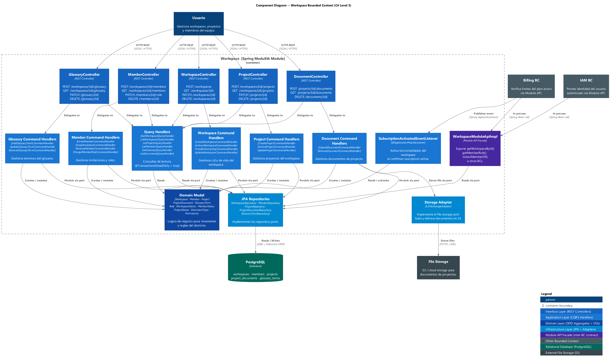

### 5.3.7. Bounded Context Software Architecture Code Level Diagrams

#### 5.3.7.1. Bounded Context Domain Layer Class Diagrams

En esta sección se presenta el diagrama de clases UML del Domain Layer del BC Workspace Management. Incluye los siete Aggregate Roots (`Organization`, `Member`, `Project`, `ProjectRole`, `ProjectMember`, `ProjectDocument`, `Glossary`), los Value Objects (`PlanLimits`, `TechnicalProfile` y sus ID correspondientes), las enumeraciones (`OrgStatus`, `OrgRole`, `MemberStatus`, `ProjectStatus`, `DocumentStatus`, `Permission`), los Domain Events y las dieciocho excepciones de dominio organizadas por jerarquía.

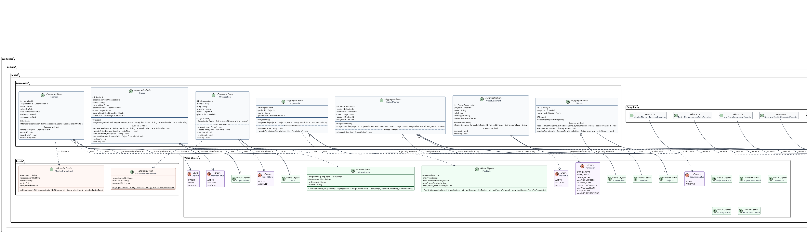

#### 5.3.7.2. Bounded Context Database Design Diagram

En esta sección se presenta el diagrama de base de datos del BC Workspace Management. Incluye nueve tablas relacionadas: `organizations`, `members`, `projects`, `project_constraints`, `project_roles`, `project_members`, `project_documents`, `glossaries` y `glossary_terms`. El VO `PlanLimits` se persiste como columnas embebidas `max_*` en `organizations`. El VO `TechnicalProfile` se persiste como columnas embebidas en `projects`. El glosario mantiene una relación 1:1 con el proyecto y se crea automáticamente al crear el proyecto.

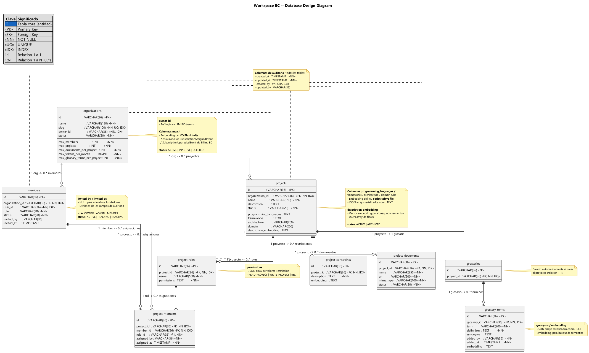

## 5.4. Bounded Context: Requirement Discovery

### 5.4.1. Domain Layer

El Bounded Context de Requirement Discovery es el núcleo de inteligencia de la plataforma. Gestiona las sesiones de elicitación (reuniones transcritas), el procesamiento con IA para extraer historias de usuario y criterios de aceptación, y el flujo de revisión por parte del equipo. Consume contexto de Workspace Management (perfil técnico, restricciones, glosario) para enriquecer la generación automática de artefactos.

**Aggregate Roots**

---

**`DiscoverySession`** — tabla: `discovery_sessions`

Representa una sesión de levantamiento de requisitos. Encapsula el ciclo de vida desde la creación de la sesión, la carga del transcript, el procesamiento con IA y la finalización.

| Campo             | Tipo                  | Descripción                                                       |
|-------------------|-----------------------|-------------------------------------------------------------------|
| `id`              | `DiscoverySessionId`  | Identificador único de la sesión                                  |
| `projectId`       | `ProjectId`           | Proyecto al que pertenece la sesión                               |
| `title`           | `String`              | Título descriptivo de la sesión                                   |
| `transcript`      | `String?`             | Texto transcrito de la reunión (`null` hasta que se cargue)       |
| `status`          | `SessionStatus`       | Estado del ciclo de vida de la sesión                             |
| `processingError` | `String?`             | Mensaje de error cuando `status = FAILED`                         |

| Método                         | Descripción                                                     |
|--------------------------------|-----------------------------------------------------------------|
| `uploadTranscript(transcript)` | Carga el texto del transcript; solo permitido en estado `DRAFT` |
| `startProcessing()`            | Cambia el estado a `PROCESSING`; requiere transcript no nulo    |
| `complete()`                   | Cambia el estado a `COMPLETED` tras generación exitosa          |
| `fail(error)`                  | Cambia el estado a `FAILED` y registra el mensaje de error      |
| `reset()`                      | Regresa al estado `DRAFT` para reprocesar                       |

| Excepción lanzada                    | Condición de disparo                                         |
|--------------------------------------|--------------------------------------------------------------|
| `SessionAlreadyProcessingException`  | Se intenta iniciar procesamiento en una sesión ya en proceso |
| `TranscriptRequiredException`        | Se intenta procesar sin transcript cargado                   |

---

**`UserStory`** — tabla: `user_stories`

Historia de usuario generada por IA a partir de una sesión. El equipo la revisa y puede aprobarla, rechazarla o editar su prioridad y puntos de historia. Compone internamente los criterios de aceptación.

| Campo                | Tipo                        | Descripción                                                     |
|----------------------|-----------------------------|-----------------------------------------------------------------|
| `id`                 | `UserStoryId`               | Identificador único de la historia                              |
| `sessionId`          | `DiscoverySessionId`        | Sesión de origen                                                |
| `projectId`          | `ProjectId`                 | Proyecto al que pertenece                                       |
| `title`              | `String`                    | Título breve de la historia                                     |
| `role`               | `String`                    | Actor beneficiado (ej. "desarrollador", "administrador")        |
| `action`             | `String`                    | Acción que desea realizar el actor                              |
| `benefit`            | `String`                    | Beneficio esperado de la acción                                 |
| `priority`           | `Priority`                  | Prioridad: `LOW`, `MEDIUM`, `HIGH`, `CRITICAL`                  |
| `storyPoints`        | `Int?`                      | Estimación de esfuerzo en puntos de historia                    |
| `status`             | `StoryStatus`               | Estado: `DRAFT`, `APPROVED`, `REJECTED`                         |
| `acceptanceCriteria` | `List<AcceptanceCriterion>` | Criterios de aceptación (entidades compuestas)                  |

| Método                             | Descripción                                                      |
|------------------------------------|------------------------------------------------------------------|
| `approve()`                        | Cambia el estado a `APPROVED`; solo desde `DRAFT`                |
| `reject()`                         | Cambia el estado a `REJECTED`; solo desde `DRAFT`                |
| `updatePriority(priority)`         | Actualiza la prioridad de la historia                            |
| `updateStoryPoints(points)`        | Actualiza los puntos de historia estimados                       |
| `addCriterion(description, type)`  | Agrega un criterio de aceptación                                 |
| `removeCriterion(criterionId)`     | Elimina un criterio de aceptación existente                      |

| Excepción lanzada                   | Condición de disparo                                             |
|-------------------------------------|------------------------------------------------------------------|
| `InvalidStoryTransitionException`   | Se intenta una transición de estado no válida                    |

---

**Entities**

**`AcceptanceCriterion`** — tabla: `acceptance_criteria`

Criterio de aceptación asociado a una historia de usuario. Puede expresarse en formato Gherkin (`GIVEN_WHEN_THEN`) o como ítem de checklist (`CHECKLIST`).

| Campo         | Tipo                    | Descripción                             |
|---------------|-------------------------|-----------------------------------------|
| `id`          | `AcceptanceCriterionId` | Identificador único del criterio        |
| `storyId`     | `UserStoryId`           | Historia de usuario a la que pertenece  |
| `description` | `String`                | Descripción del criterio de aceptación  |
| `type`        | `CriterionType`         | Formato: `GIVEN_WHEN_THEN`, `CHECKLIST` |

| Método                      | Descripción                        |
|-----------------------------|------------------------------------|
| `update(description, type)` | Actualiza la descripción y el tipo |

---

**Value Objects & Enumeraciones**

| Enumeración     | Valores                                      | Descripción                                     |
|-----------------|----------------------------------------------|-------------------------------------------------|
| `SessionStatus` | `DRAFT`, `PROCESSING`, `COMPLETED`, `FAILED` | Ciclo de vida de una sesión de descubrimiento   |
| `StoryStatus`   | `DRAFT`, `APPROVED`, `REJECTED`              | Estado de revisión de una historia de usuario   |
| `Priority`      | `LOW`, `MEDIUM`, `HIGH`, `CRITICAL`          | Prioridad de una historia en el backlog         |
| `CriterionType` | `GIVEN_WHEN_THEN`, `CHECKLIST`               | Formato de expresión del criterio de aceptación |

---

**Domain Exceptions**

Todas las excepciones se ubican en `com.kntrosoft.reqsai.discovery.domain.model.exceptions` y extienden `RuntimeException`.

| Excepción                              | Mensaje representativo                                          |
|----------------------------------------|-----------------------------------------------------------------|
| `DiscoverySessionNotFoundException`    | `"Discovery session not found: {id}"`                           |
| `SessionAlreadyProcessingException`    | `"Session is already being processed"`                          |
| `TranscriptRequiredException`          | `"A transcript must be uploaded before processing can start"`   |
| `TokenQuotaExceededException`          | `"Monthly token quota has been exceeded for this organization"` |
| `UserStoryNotFoundException`           | `"User story not found: {id}"`                                  |
| `AcceptanceCriterionNotFoundException` | `"Acceptance criterion not found: {id}"`                        |
| `InvalidStoryTransitionException`      | `"Cannot transition story from {current} to {target}"`          |

---

**Domain Events**

Todos los eventos se ubican en `com.kntrosoft.reqsai.discovery.domain.events`.

| Evento                          | Campos principales                     | Consumidor                                                 |
|---------------------------------|----------------------------------------|------------------------------------------------------------|
| `SessionProcessingStartedEvent` | `sessionId`, `projectId`               | Infraestructura → disparo asíncrono de la extracción       |
| `UserStoriesGeneratedEvent`     | `sessionId`, `projectId`, `storyCount` | Infraestructura → notificación a los miembros del proyecto |
| `AiTokensConsumedEvent`         | `organizationId`, `tokensConsumed`     | Billing BC → `IncrementTokenUsageCommand`                  |

### 5.4.2. Interface Layer

**Controladores REST**

El paquete raíz de la capa de interfaz es `com.kntrosoft.reqsai.discovery.interfaces.rest`. Todos los endpoints requieren el header `Authorization: Bearer <token>`.

---

**`DiscoverySessionController`** — `/api/v1/projects/{projectId}/sessions`

| Método   | Ruta                          | Descripción                                                               |
|----------|-------------------------------|---------------------------------------------------------------------------|
| `POST`   | `/`                           | Crea una nueva sesión de descubrimiento en estado `DRAFT`                 |
| `GET`    | `/`                           | Lista las sesiones del proyecto                                           |
| `GET`    | `/{sessionId}`                | Obtiene los datos de una sesión                                           |
| `POST`   | `/{sessionId}/transcript`     | Carga o reemplaza el transcript de la sesión                              |
| `POST`   | `/{sessionId}/process`        | Inicia el procesamiento con IA para generar historias de usuario          |
| `POST`   | `/{sessionId}/reset`          | Regresa la sesión a estado `DRAFT` para reprocesar                        |

---

**`UserStoryController`** — `/api/v1/sessions/{sessionId}/stories`

| Método   | Ruta                         | Descripción                                                              |
|----------|------------------------------|--------------------------------------------------------------------------|
| `GET`    | `/`                          | Lista las historias de usuario de la sesión                              |
| `GET`    | `/{storyId}`                 | Obtiene una historia de usuario con sus criterios de aceptación          |
| `POST`   | `/{storyId}/approve`         | Aprueba una historia de usuario                                          |
| `POST`   | `/{storyId}/reject`          | Rechaza una historia de usuario                                          |
| `PATCH`  | `/{storyId}/priority`        | Actualiza la prioridad de la historia                                    |
| `PATCH`  | `/{storyId}/story-points`    | Actualiza los puntos de historia estimados                               |
| `POST`   | `/{storyId}/criteria`        | Agrega un criterio de aceptación a la historia                           |
| `PATCH`  | `/{storyId}/criteria/{id}`   | Actualiza un criterio de aceptación                                      |
| `DELETE` | `/{storyId}/criteria/{id}`   | Elimina un criterio de aceptación                                        |

**Request/Response DTOs**

Los DTOs se ubican en `com.kntrosoft.reqsai.discovery.interfaces.rest.dto`.

| DTO                             | Tipo     | Campos principales                                                                                    |
|---------------------------------|----------|-------------------------------------------------------------------------------------------------------|
| `CreateSessionRequest`          | Request  | `title: String`                                                                                       |
| `UploadTranscriptRequest`       | Request  | `transcript: String`                                                                                  |
| `UpdatePriorityRequest`         | Request  | `priority: Priority`                                                                                  |
| `UpdateStoryPointsRequest`      | Request  | `storyPoints: Int`                                                                                    |
| `AddAcceptanceCriterionRequest` | Request  | `description: String`, `type: CriterionType`                                                          |
| `DiscoverySessionResponse`      | Response | `id`, `projectId`, `title`, `status`, `processingError`                                               |
| `UserStoryResponse`             | Response | `id`, `title`, `role`, `action`, `benefit`, `priority`, `storyPoints`, `status`, `acceptanceCriteria` |

### 5.4.3. Application Layer

**Commands**

Los comandos se ubican en `com.kntrosoft.reqsai.discovery.application.commands`.

| Comando                              | Campos                                                |
|--------------------------------------|-------------------------------------------------------|
| `CreateDiscoverySessionCommand`      | `projectId`, `title`, `requestedBy`                   |
| `UploadSessionTranscriptCommand`     | `sessionId`, `transcript`, `requestedBy`              |
| `StartDiscoveryProcessingCommand`    | `sessionId`, `requestedBy`                            |
| `ResetDiscoverySessionCommand`       | `sessionId`, `requestedBy`                            |
| `ApproveUserStoryCommand`            | `storyId`, `requestedBy`                              |
| `RejectUserStoryCommand`             | `storyId`, `requestedBy`                              |
| `UpdateUserStoryPriorityCommand`     | `storyId`, `priority`, `requestedBy`                  |
| `UpdateStoryPointsCommand`           | `storyId`, `storyPoints`, `requestedBy`               |
| `AddAcceptanceCriterionCommand`      | `storyId`, `description`, `type`, `requestedBy`       |
| `UpdateAcceptanceCriterionCommand`   | `criterionId`, `description`, `type`, `requestedBy`   |
| `RemoveAcceptanceCriterionCommand`   | `criterionId`, `requestedBy`                          |

---

**Queries**

Los queries se ubican en `com.kntrosoft.reqsai.discovery.application.queries`.

| Query                         | Campos          | Descripción                                                         |
|-------------------------------|-----------------|---------------------------------------------------------------------|
| `ListDiscoverySessionsQuery`  | `projectId`     | Lista todas las sesiones de un proyecto                             |
| `GetDiscoverySessionQuery`    | `sessionId`     | Obtiene los datos completos de una sesión                           |
| `ListUserStoriesQuery`        | `sessionId`     | Lista las historias de usuario generadas en una sesión              |
| `GetUserStoryQuery`           | `storyId`       | Obtiene una historia con sus criterios de aceptación                |

---

**Command Handlers**

Los handlers se ubican en `com.kntrosoft.reqsai.discovery.application.handlers`.

---

**`StartDiscoveryProcessingCommandHandler`**

Orquesta el procesamiento con IA: válida el estado de la sesión, enriquece el prompt con contexto del proyecto, invoca la extracción y persiste las historias generadas.

| Paso | Acción                                                                                                     |
|------|------------------------------------------------------------------------------------------------------------|
| 1    | Recupera la sesión; lanza `DiscoverySessionNotFoundException` si no existe                                 |
| 2    | Verifica que `transcript != null`; lanza `TranscriptRequiredException` si está vacío                       |
| 3    | Llama a `session.startProcessing()`; lanza `SessionAlreadyProcessingException` si aplica                   |
| 4    | Persiste el estado `PROCESSING` con `DiscoverySessionRepository`                                           |
| 5    | Recupera el contexto del proyecto vía `ProjectContextPort` (perfil técnico, restricciones, glosario)       |
| 6    | Invoca `RequirementExtractionPort.extract(transcript, projectContext)`; obtiene `ExtractionResult`         |
| 7    | Por cada historia en `ExtractionResult.stories`: crea `UserStory` con sus `AcceptanceCriterion` y persiste |
| 8    | Publica `AiTokensConsumedEvent` con los tokens consumidos según `ExtractionResult.tokensUsed`              |
| 9    | Llama a `session.complete()` y persiste el estado final                                                    |
| 10   | Publica `UserStoriesGeneratedEvent`                                                                        |

Si el paso 6 lanza `TokenQuotaExceededException`: llama a `session.fail("Token quota exceeded")`, persiste y propaga la excepción.

---

**`CreateDiscoverySessionCommandHandler`**

| Paso | Acción                                                                                     |
|------|--------------------------------------------------------------------------------------------|
| 1    | Crea `DiscoverySession` con `status=DRAFT` y `transcript=null`                             |
| 2    | Persiste con `DiscoverySessionRepository`                                                  |

---

**`ApproveUserStoryCommandHandler`**

| Paso | Acción                                                                                     |
|------|--------------------------------------------------------------------------------------------|
| 1    | Recupera la historia; lanza `UserStoryNotFoundException` si no existe                      |
| 2    | Llama a `story.approve()`; lanza `InvalidStoryTransitionException` si no está en `DRAFT`   |
| 3    | Persiste con `UserStoryRepository`                                                         |

---

**Query Handlers**

Los query handlers son `@Transactional(readOnly = true)`.

| Query Handler                       | Descripción                                                                  |
|-------------------------------------|------------------------------------------------------------------------------|
| `ListDiscoverySessionsQueryHandler` | Lista las sesiones de un proyecto y mapea a `List<DiscoverySessionResponse>` |
| `GetDiscoverySessionQueryHandler`   | Obtiene una sesión y mapea a `DiscoverySessionResponse`                      |
| `ListUserStoriesQueryHandler`       | Lista las historias de una sesión y mapea a `List<UserStoryResponse>`        |
| `GetUserStoryQueryHandler`          | Obtiene una historia con sus criterios y mapea a `UserStoryResponse`         |

---

**Output Ports**

Los puertos de salida se ubican en `com.kntrosoft.reqsai.discovery.application.ports`.

**Repository Ports:**

| Puerto                       | Métodos principales                                                 |
|------------------------------|---------------------------------------------------------------------|
| `DiscoverySessionRepository` | `save`, `findById`, `findByProjectId`                               |
| `UserStoryRepository`        | `save`, `findById`, `findBySessionId`, `saveAll`                    |

**Service Ports:**

| Puerto                      | Método                                           | Descripción                                                         |
|-----------------------------|--------------------------------------------------|---------------------------------------------------------------------|
| `RequirementExtractionPort` | `extract(transcript, context): ExtractionResult` | Envía el transcript y contexto a la IA y retorna historias + tokens |
| `ProjectContextPort`        | `getContext(projectId): ProjectContext`          | Obtiene perfil técnico, restricciones y términos del glosario       |

`ExtractionResult` es un record con `stories: List<GeneratedStory>` y `tokensUsed: Long`. `GeneratedStory` contiene título, rol, acción, beneficio y criterios de aceptación en texto plano. `ProjectContext` es un record con `TechnicalProfile`, `List<String>` de restricciones y `Map<String, String>` de términos del glosario (término → definición).

### 5.4.4. Infrastructure Layer

**JPA Repositories**

Los repositorios JPA se ubican en `com.kntrosoft.reqsai.discovery.infrastructure.persistence.jpa`.

| Repositorio JPA                   | Interfaz de dominio implementada  |
|-----------------------------------|-----------------------------------|
| `DiscoverySessionJpaRepository`   | `DiscoverySessionRepository`      |
| `UserStoryJpaRepository`          | `UserStoryRepository`             |

---

**Adapters**

Los adaptadores se ubican en `com.kntrosoft.reqsai.discovery.infrastructure.adapters`.

**`OpenAiRequirementExtractionAdapter`** — implementa `RequirementExtractionPort`

Invoca la API de OpenAI (modelo GPT-4o) con un prompt estructurado que incluye el transcript y el contexto del proyecto. El prompt instruye al modelo para que devuelva las historias en formato JSON estructurado con título, rol, acción, beneficio y criterios de aceptación.

| Método                         | Descripción                                                                    |
|--------------------------------|--------------------------------------------------------------------------------|
| `extract(transcript, context)` | Construye el prompt, invoca OpenAI Chat Completions y parsea el JSON retornado |

La respuesta JSON del modelo se parsea a `ExtractionResult`. Los tokens utilizados se extraen del campo `usage.total_tokens` de la respuesta de la API.

**`WorkspaceContextAdapter`** — implementa `ProjectContextPort`

Consulta directamente los repositorios JPA de Workspace Management para obtener el contexto del proyecto. Al ser módulos del mismo servicio Spring, el acceso es directo sin llamada HTTP.

| Método                  | Descripción                                                                        |
|-------------------------|------------------------------------------------------------------------------------|
| `getContext(projectId)` | Obtiene `TechnicalProfile` del proyecto, sus restricciones y términos del glosario |

---

**Event Listeners**

Los listeners se ubican en `com.kntrosoft.reqsai.discovery.infrastructure.events` y están anotados con `@ApplicationModuleListener`.

| Listener                          | Evento escuchado          | Acción                                                                                                  |
|-----------------------------------|---------------------------|---------------------------------------------------------------------------------------------------------|
| `TokenQuotaExceededEventListener` | `TokenQuotaExceededEvent` | Falla todas las sesiones en estado `PROCESSING` de la organización con mensaje `"Token quota exceeded"` |
| `AiTokensConsumedEventListener`   | `AiTokensConsumedEvent`   | Despacha `IncrementTokenUsageCommand` al handler de Billing BC                                          |

### 5.4.6. Bounded Context Software Architecture Component Level Diagrams

En esta sección se presenta el diagrama de componentes C4 (Nivel 3) del BC Requirement Discovery. El container es el módulo Spring Modulith completo. Los componentes reflejan la descomposición por capas, incluyendo el pipeline de procesamiento con IA (transcripción → generación de historias → criterios de aceptación), los ports de integración con el LLM/STT y los listeners de eventos de Billing para control de cuota de tokens.

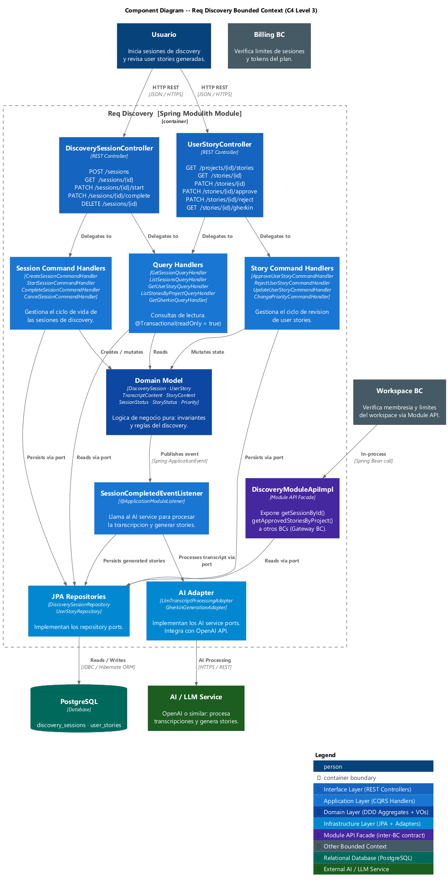

### 5.4.7. Bounded Context Software Architecture Code Level Diagrams

#### 5.4.7.1. Bounded Context Domain Layer Class Diagrams

En esta sección se presenta el diagrama de clases UML del Domain Layer del BC Requirement Discovery. Incluye los dos Aggregate Roots (`DiscoverySession`, `UserStory`), la entidad `AcceptanceCriterion` (pertenece a `UserStory`), los Value Objects de identidad, las enumeraciones (`SessionStatus`, `StoryStatus`, `Priority`, `CriterionType`), los Domain Events internos y el evento `AiTokensConsumedEvent` publicado al Api package para que Billing BC actualice el consumo de tokens.

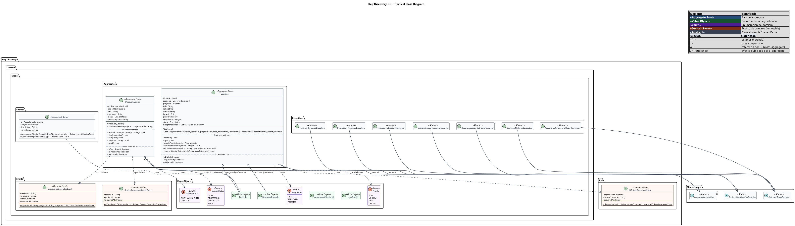

#### 5.4.7.2. Bounded Context Database Design Diagram

En esta sección se presenta el diagrama de base de datos del BC Requirement Discovery. Incluye tres tablas relacionadas: `discovery_sessions`, `user_stories` y `acceptance_criteria`. La tabla `project_id` en `discovery_sessions` es una referencia lógica al BC Workspace (sin FK física, BC aislados). Los criterios de aceptación se almacenan como filas en su propia tabla con su tipo (`GIVEN_WHEN_THEN` o `CHECKLIST`), en lugar de JSON embebido.

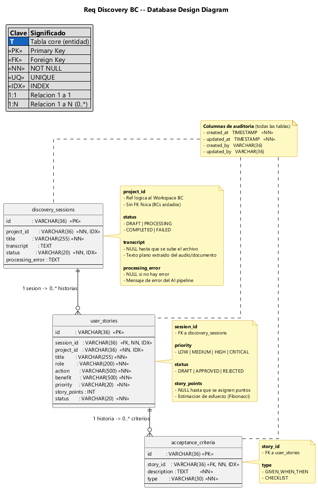

## 5.5. Bounded Context: Integration Gateway

### 5.5.1. Domain Layer

El Bounded Context de Integration Gateway gestiona las integraciones de Reqs-AI con herramientas externas de gestión de proyectos, principalmente Jira. Permite exportar las historias de usuario aprobadas como issues al backlog del equipo y sincronizar el estado de dichos issues de vuelta a la plataforma. Este BC actúa como anticorruption layer entre el dominio de Reqs-AI y los modelos de datos de herramientas externas.

**Aggregate Roots**

---

**`Integration`** — tabla: `integrations`

Representa la conexión configurada entre un proyecto de Reqs-AI y una herramienta externa. Almacena las credenciales de acceso de forma encriptada y el mapeo de configuración necesario para la exportación.

| Campo            | Tipo                  | Descripción                                               |
|------------------|-----------------------|-----------------------------------------------------------|
| `id`             | `IntegrationId`       | Identificador único de la integración                     |
| `projectId`      | `ProjectId`           | Proyecto de Reqs-AI asociado                              |
| `provider`       | `IntegrationProvider` | Proveedor externo: `JIRA`, `TRELLO`, `LINEAR`             |
| `status`         | `IntegrationStatus`   | Estado: `ACTIVE`, `INACTIVE`, `ERROR`                     |
| `config`         | `IntegrationConfig`   | Configuración de conexión (URL, proyecto destino, mapeos) |
| `encryptedToken` | `String`              | Token de acceso OAuth encriptado con AES                  |

| Método                        | Descripción                                     |
|-------------------------------|-------------------------------------------------|
| `activate()`                  | Cambia el estado a `ACTIVE`                     |
| `deactivate()`                | Cambia el estado a `INACTIVE`                   |
| `markError(reason)`           | Cambia el estado a `ERROR` y registra el motivo |
| `updateConfig(config)`        | Actualiza la configuración de conexión          |
| `rotateToken(encryptedToken)` | Rota el token de acceso almacenado              |

| Excepción lanzada                   | Condición de disparo                                          |
|-------------------------------------|---------------------------------------------------------------|
| `IntegrationAlreadyExistsException` | Ya existe una integración activa para el proveedor y proyecto |
| `IntegrationInactiveException`      | Se intenta exportar con una integración desactivada           |

---

**`ExportRecord`** — tabla: `export_records`

Registra cada exportación de una historia de usuario hacia la herramienta externa. Mantiene la referencia al issue externo creado para permitir sincronización posterior.

| Campo             | Tipo             | Descripción                                                     |
|-------------------|------------------|-----------------------------------------------------------------|
| `id`              | `ExportRecordId` | Identificador único del registro de exportación                 |
| `integrationId`   | `IntegrationId`  | Integración usada para la exportación                           |
| `storyId`         | `UserStoryId`    | Historia de usuario exportada                                   |
| `externalIssueId` | `String`         | ID del issue en la herramienta externa (ej. `PROJ-123` en Jira) |
| `externalUrl`     | `String`         | URL pública del issue externo                                   |
| `status`          | `ExportStatus`   | Estado: `PENDING`, `EXPORTED`, `SYNCED`, `FAILED`               |
| `failureReason`   | `String?`        | Motivo del fallo cuando `status = FAILED`                       |

| Método                       | Descripción                                                |
|------------------------------|------------------------------------------------------------|
| `markExported(issueId, url)` | Registra el ID y URL del issue creado, cambia a `EXPORTED` |
| `markSynced()`               | Cambia el estado a `SYNCED` tras sincronización exitosa    |
| `markFailed(reason)`         | Cambia el estado a `FAILED` y registra el motivo           |

| Excepción lanzada                  | Condición de disparo                                           |
|------------------------------------|----------------------------------------------------------------|
| `StoryAlreadyExportedException`    | La historia ya tiene un registro de exportación exitoso        |

---

**Value Objects & Enumeraciones**

**`IntegrationConfig`** — `com.kntrosoft.reqsai.gateway.domain.model.valueobjects`

Value Object inmutable que encapsula la configuración específica de cada integración.

| Campo              | Tipo                  | Descripción                                                              |
|--------------------|-----------------------|--------------------------------------------------------------------------|
| `baseUrl`          | `String`              | URL base de la instancia del proveedor (ej. `https://org.atlassian.net`) |
| `projectKey`       | `String`              | Clave del proyecto destino en la herramienta externa                     |
| `issueTypeMapping` | `Map<String, String>` | Mapeo de tipos de historia a tipos de issue del proveedor                |

| Enumeración           | Valores                                   | Descripción                           |
|-----------------------|-------------------------------------------|---------------------------------------|
| `IntegrationProvider` | `JIRA`, `TRELLO`, `LINEAR`                | Proveedores de integración soportados |
| `IntegrationStatus`   | `ACTIVE`, `INACTIVE`, `ERROR`             | Estado operativo de la integración    |
| `ExportStatus`        | `PENDING`, `EXPORTED`, `SYNCED`, `FAILED` | Estado del ciclo de exportación       |

---

**Domain Exceptions**

Todas las excepciones se ubican en `com.kntrosoft.reqsai.gateway.domain.model.exceptions` y extienden `RuntimeException`.

| Excepción                           | Mensaje representativo                                                                  |
|-------------------------------------|-----------------------------------------------------------------------------------------|
| `IntegrationNotFoundException`      | `"Integration not found: {id}"`                                                         |
| `IntegrationAlreadyExistsException` | `"An active integration already exists for provider {provider} in project {projectId}"` |
| `IntegrationInactiveException`      | `"Integration is not active"`                                                           |
| `ExportRecordNotFoundException`     | `"Export record not found: {id}"`                                                       |
| `StoryAlreadyExportedException`     | `"Story {storyId} has already been exported"`                                           |
| `ExternalProviderException`         | `"External provider returned error: {message}"`                                         |

---

**Domain Events**

Todos los eventos se ubican en `com.kntrosoft.reqsai.gateway.domain.events`.

| Evento                      | Campos principales                               | Consumidor                                         |
|-----------------------------|--------------------------------------------------|----------------------------------------------------|
| `StoryExportedEvent`        | `exportRecordId`, `storyId`, `externalIssueId`   | Infraestructura → notificación al usuario          |
| `ExportFailedEvent`         | `exportRecordId`, `storyId`, `reason`            | Infraestructura → alerta al usuario del fallo      |

### 5.5.2. Interface Layer

**Controladores REST**

El paquete raíz de la capa de interfaz es `com.kntrosoft.reqsai.gateway.interfaces.rest`. Todos los endpoints requieren el header `Authorization: Bearer <token>`.

---

**`IntegrationController`** — `/api/v1/projects/{projectId}/integrations`

| Método   | Ruta                          | Descripción                                                  |
|----------|-------------------------------|--------------------------------------------------------------|
| `POST`   | `/`                           | Configura una nueva integración para el proyecto             |
| `GET`    | `/`                           | Lista las integraciones del proyecto                         |
| `GET`    | `/{integrationId}`            | Obtiene los datos de una integración                         |
| `PATCH`  | `/{integrationId}`            | Actualiza la configuración o rota el token de la integración |
| `POST`   | `/{integrationId}/activate`   | Activa una integración desactivada                           |
| `POST`   | `/{integrationId}/deactivate` | Desactiva una integración activa                             |
| `DELETE` | `/{integrationId}`            | Elimina la integración                                       |

---

**`ExportController`** — `/api/v1/integrations/{integrationId}/exports`

| Método   | Ruta                   | Descripción                                                              |
|----------|------------------------|--------------------------------------------------------------------------|
| `POST`   | `/`                    | Exporta una o varias historias aprobadas al proveedor externo            |
| `GET`    | `/`                    | Lista los registros de exportación de la integración                     |
| `GET`    | `/{exportId}`          | Obtiene los detalles de un registro de exportación                       |
| `POST`   | `/{exportId}/sync`     | Sincroniza el estado del issue externo con el registro local             |

---

**`WebhookController`** — `/api/v1/webhooks/integrations`

Recibe notificaciones entrantes de los proveedores externos (ej. cambio de estado de un issue en Jira). No requiere autenticación Bearer; válida la firma del webhook del proveedor.

| Método | Ruta    | Descripción                                                                         |
|--------|---------|-------------------------------------------------------------------------------------|
| `POST` | `/jira` | Recibe eventos de Jira (issue updated, issue deleted) y actualiza el `ExportRecord` |

**Request/Response DTOs**

Los DTOs se ubican en `com.kntrosoft.reqsai.gateway.interfaces.rest.dto`.

| DTO                        | Tipo     | Campos principales                                                               |
|----------------------------|----------|----------------------------------------------------------------------------------|
| `CreateIntegrationRequest` | Request  | `provider: IntegrationProvider`, `config: IntegrationConfigDto`, `token: String` |
| `UpdateIntegrationRequest` | Request  | `config: IntegrationConfigDto?`, `token: String?`                                |
| `ExportStoriesRequest`     | Request  | `storyIds: List<String>`                                                         |
| `IntegrationResponse`      | Response | `id`, `projectId`, `provider`, `status`, `config`                                |
| `ExportRecordResponse`     | Response | `id`, `storyId`, `externalIssueId`, `externalUrl`, `status`                      |

### 5.5.3. Application Layer

**Commands**

Los comandos se ubican en `com.kntrosoft.reqsai.gateway.application.commands`.

| Comando                          | Campos                                                             |
|----------------------------------|--------------------------------------------------------------------|
| `CreateIntegrationCommand`       | `projectId`, `provider`, `config`, `encryptedToken`, `requestedBy` |
| `UpdateIntegrationCommand`       | `integrationId`, `config?`, `encryptedToken?`, `requestedBy`       |
| `ActivateIntegrationCommand`     | `integrationId`, `requestedBy`                                     |
| `DeactivateIntegrationCommand`   | `integrationId`, `requestedBy`                                     |
| `DeleteIntegrationCommand`       | `integrationId`, `requestedBy`                                     |
| `ExportStoriesToProviderCommand` | `integrationId`, `storyIds`, `requestedBy`                         |
| `SyncExportRecordCommand`        | `exportRecordId`                                                   |

---

**Queries**

Los queries se ubican en `com.kntrosoft.reqsai.gateway.application.queries`.

| Query                    | Campos           | Descripción                                           |
|--------------------------|------------------|-------------------------------------------------------|
| `ListIntegrationsQuery`  | `projectId`      | Lista las integraciones de un proyecto                |
| `GetIntegrationQuery`    | `integrationId`  | Obtiene los datos de una integración                  |
| `ListExportRecordsQuery` | `integrationId`  | Lista los registros de exportación de una integración |
| `GetExportRecordQuery`   | `exportRecordId` | Obtiene los detalles de un registro de exportación    |

---

**Command Handlers**

Los handlers se ubican en `com.kntrosoft.reqsai.gateway.application.handlers`.

---

**`CreateIntegrationCommandHandler`**

| Paso | Acción                                                                                                       |
|------|--------------------------------------------------------------------------------------------------------------|
| 1    | Verifica que no exista una integración activa del mismo proveedor; lanza `IntegrationAlreadyExistsException` |
| 2    | Encripta el token con `TokenEncryptionPort.encrypt(token)`                                                   |
| 3    | Crea y persiste `Integration` con `status=ACTIVE`                                                            |

---

**`ExportStoriesToProviderCommandHandler`**

Orquesta la exportación de un conjunto de historias aprobadas al proveedor externo. Cada historia genera un `ExportRecord` individual.

| Paso | Acción                                                                                                             |
|------|--------------------------------------------------------------------------------------------------------------------|
| 1    | Recupera la integración; lanza `IntegrationNotFoundException` si no existe                                         |
| 2    | Verifica `status=ACTIVE`; lanza `IntegrationInactiveException` si aplica                                           |
| 3    | Desencripta el token con `TokenEncryptionPort.decrypt(encryptedToken)`                                             |
| 4    | Por cada `storyId`: verifica que no exista `ExportRecord` exitoso; lanza `StoryAlreadyExportedException` si aplica |
| 5    | Recupera los datos de la historia vía `UserStoryPort.getStory(storyId)`                                            |
| 6    | Invoca `ExternalProviderPort.createIssue(story, integration)` para crear el issue                                  |
| 7    | Crea y persiste `ExportRecord` con `status=EXPORTED` y el `externalIssueId` retornado                              |
| 8    | Publica `StoryExportedEvent`                                                                                       |

Si el paso 6 lanza error: persiste `ExportRecord` con `status=FAILED` y pública `ExportFailedEvent`.

---

**`SyncExportRecordCommandHandler`**

| Paso | Acción                                                                                           |
|------|--------------------------------------------------------------------------------------------------|
| 1    | Recupera el `ExportRecord`; lanza `ExportRecordNotFoundException` si no existe                   |
| 2    | Invoca `ExternalProviderPort.getIssueStatus(externalIssueId, integration)`                       |
| 3    | Actualiza el estado del `ExportRecord` a `SYNCED`                                                |

---

**Query Handlers**

Los query handlers son `@Transactional(readOnly = true)`.

| Query Handler                   | Descripción                                                                |
|---------------------------------|----------------------------------------------------------------------------|
| `ListIntegrationsQueryHandler`  | Lista las integraciones del proyecto y mapea a `List<IntegrationResponse>` |
| `GetIntegrationQueryHandler`    | Obtiene una integración y mapea a `IntegrationResponse`                    |
| `ListExportRecordsQueryHandler` | Lista los registros de exportación y mapea a `List<ExportRecordResponse>`  |
| `GetExportRecordQueryHandler`   | Obtiene un registro y mapea a `ExportRecordResponse`                       |

---

**Output Ports**

Los puertos de salida se ubican en `com.kntrosoft.reqsai.gateway.application.ports`.

**Repository Ports:**

| Puerto                   | Métodos principales                                                    |
|--------------------------|------------------------------------------------------------------------|
| `IntegrationRepository`  | `save`, `findById`, `findByProjectId`, `existsByProjectAndProvider`    |
| `ExportRecordRepository` | `save`, `findById`, `findByIntegrationId`, `existsByStoryIdAndSuccess` |

**Service Ports:**

| Puerto                 | Método                                         | Descripción                                                     |
|------------------------|------------------------------------------------|-----------------------------------------------------------------|
| `ExternalProviderPort` | `createIssue(story, integration): String`      | Crea un issue en el proveedor externo y retorna el ID externo   |
| `ExternalProviderPort` | `getIssueStatus(issueId, integration): String` | Consulta el estado actual de un issue en el proveedor           |
| `TokenEncryptionPort`  | `encrypt(token): String`                       | Encripta el token de acceso con AES antes de persistir          |
| `TokenEncryptionPort`  | `decrypt(encryptedToken): String`              | Desencripta el token para usarlo en llamadas al proveedor       |
| `UserStoryPort`        | `getStory(storyId): StoryDto`                  | Obtiene los datos de una historia de usuario desde Discovery BC |

### 5.5.4. Infrastructure Layer

**JPA Repositories**

Los repositorios JPA se ubican en `com.kntrosoft.reqsai.gateway.infrastructure.persistence.jpa`.

| Repositorio JPA                | Interfaz de dominio implementada |
|--------------------------------|----------------------------------|
| `IntegrationJpaRepository`     | `IntegrationRepository`          |
| `ExportRecordJpaRepository`    | `ExportRecordRepository`         |

---

**Adapters**

Los adaptadores se ubican en `com.kntrosoft.reqsai.gateway.infrastructure.adapters`.

**`JiraProviderAdapter`** — implementa `ExternalProviderPort` para `provider=JIRA`

Utiliza la API REST de Jira Cloud para crear issues y consultar su estado. El anticorruption layer traduce el modelo de `UserStory` de Reqs-AI al modelo de issue de Jira.

| Método                                 | Descripción                                                                 |
|----------------------------------------|-----------------------------------------------------------------------------|
| `createIssue(story, integration)`      | Mapea la historia al formato de Jira y llama a `POST /rest/api/3/issue`     |
| `getIssueStatus(issueId, integration)` | Consulta `GET /rest/api/3/issue/{issueId}` y retorna el campo `status.name` |

**`AesTokenEncryptionAdapter`** — implementa `TokenEncryptionPort`

Encripta y desencripta tokens OAuth usando AES-256-GCM. La clave de encriptación se inyecta desde configuración de entorno (`ENCRYPTION_KEY`).

| Método                    | Descripción                                                    |
|---------------------------|----------------------------------------------------------------|
| `encrypt(token)`          | Encripta el token y retorna el ciphertext en Base64            |
| `decrypt(encryptedToken)` | Desencripta el ciphertext y retorna el token original          |

**`DiscoveryUserStoryAdapter`** — implementa `UserStoryPort`

Accede directamente a los repositorios JPA de Requirement Discovery para obtener los datos de una historia sin llamada HTTP, aprovechando la co-ubicación en el mismo servicio Spring.

| Método                  | Descripción                                                          |
|-------------------------|----------------------------------------------------------------------|
| `getStory(storyId)`     | Busca la historia y sus criterios de aceptación y mapea a `StoryDto` |

---

**Configuración de infraestructura:**

| Clase                        | Propósito                                                                                           |
|------------------------------|-----------------------------------------------------------------------------------------------------|
| `JiraWebhookSecurityFilter`  | Valida la firma HMAC-SHA256 del header `X-Hub-Signature` en las notificaciones entrantes de Jira    |
| `IntegrationProviderFactory` | Fábrica que retorna el `ExternalProviderPort` correcto según el `IntegrationProvider` del aggregate |

### 5.5.6. Bounded Context Software Architecture Component Level Diagrams

En esta sección se presenta el diagrama de componentes C4 (Nivel 3) del BC Integration Gateway. El container es el módulo Spring Modulith completo. Los componentes reflejan la descomposición por capas, incluyendo los handlers de comandos para crear y gestionar integraciones y exportaciones, el `IntegrationProviderFactory` que abstrae los proveedores externos (Jira, Trello, Linear) y los adapters de infraestructura para comunicación con las API externas.

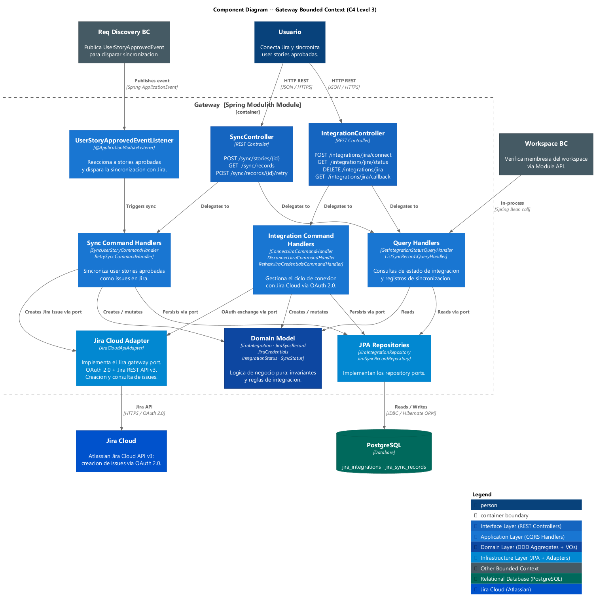

### 5.5.7. Bounded Context Software Architecture Code Level Diagrams

#### 5.5.7.1. Bounded Context Domain Layer Class Diagrams

En esta sección se presenta el diagrama de clases UML del Domain Layer del BC Integration Gateway. Incluye los dos Aggregate Roots (`Integration`, `ExportRecord`), el Value Object `IntegrationConfig` (con `baseUrl`, `projectKey` e `issueTypeMapping`), las enumeraciones (`IntegrationProvider` con JIRA/TRELLO/LINEAR, `IntegrationStatus`, `ExportStatus`), los Domain Events y las excepciones de dominio. El BC es agnóstico al proveedor concreto gracias al patrón Strategy implementado via `IntegrationProvider`.

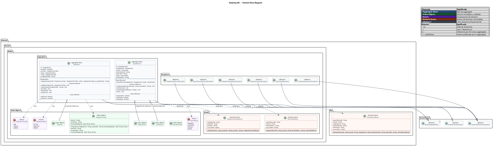

#### 5.5.7.2. Bounded Context Database Design Diagram

En esta sección se presenta el diagrama de base de datos del BC Integration Gateway. Incluye dos tablas: `integrations` y `export_records`. El VO `IntegrationConfig` se persiste como columnas embebidas (`base_url`, `project_key`, `issue_type_mapping`). El token de autenticación se almacena cifrado en reposo (AES-256) en la columna `encrypted_token`. Las referencias a proyectos (Workspace BC) y a historias (Discovery BC) son lógicas, sin FK físicas entre BC.

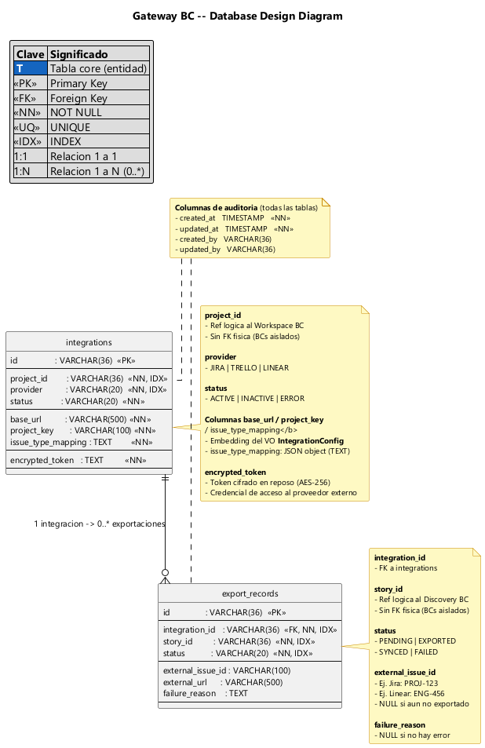

# Capítulo VI: Solution UX Design

## 6.1. Style Guidelines

En esta sección se definen los lineamientos visuales y de experiencia que guían el diseño de Reqs-AI. El objetivo principal es mantener una interfaz clara, consistente y profesional, alineada con el propósito del producto: ayudar a equipos de software a convertir reuniones de levantamiento de requisitos en historias de usuario estructuradas, criterios de aceptación y artefactos listos para el backlog.

El diseño de la aplicación sigue una estética limpia, similar a herramientas de productividad como Notion, priorizando espacios en blanco, jerarquía visual clara, navegación lateral persistente y componentes reutilizables. Esta decisión permite que el usuario se concentre en la revisión de proyectos, sesiones, historias generadas por IA e integraciones sin distraerse con elementos visuales innecesarios.

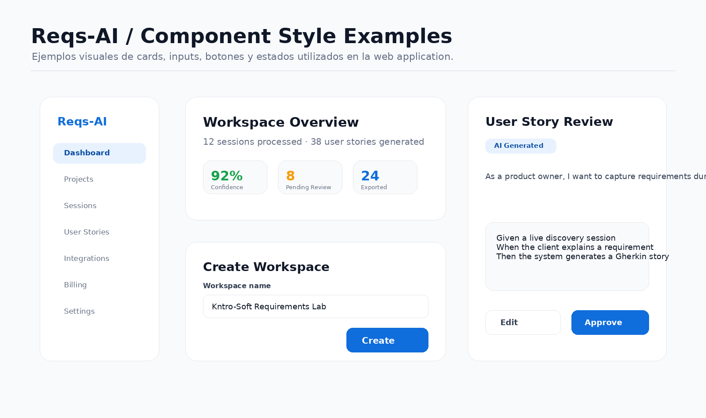

### 6.1.1. General Style Guidelines

Los lineamientos generales de estilo de Reqs-AI se enfocan en transmitir precisión, confianza y productividad. Al tratarse de una plataforma SaaS orientada a requisitos de software, la interfaz debe comunicar orden, seguridad y facilidad de uso. Por ello, se utiliza una composición minimalista, con tarjetas limpias, bordes suaves, sombras ligeras y una estructura modular que permite reconocer rápidamente cada sección del sistema.

La paleta visual se apoya principalmente en tonos neutros, fondos claros y un azul principal para acciones relevantes. El azul se utiliza en botones primarios, enlaces, estados activos y elementos de navegación seleccionados. Los tonos grises se reservan para contenedores, bordes, textos secundarios y fondos de separación. Además, se incorporan colores semánticos para comunicar estados específicos: verde para acciones completadas, amarillo para advertencias, rojo para errores y un acento violeta o azul intenso para elementos relacionados con inteligencia artificial.

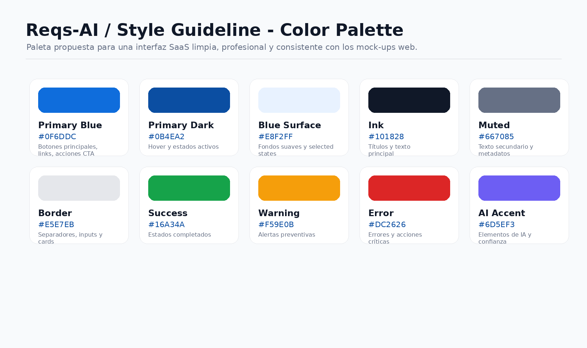

A nivel tipográfico, se propone el uso de una familia sans serif moderna y legible para interfaces digitales. Los títulos deben tener mayor peso visual para diferenciar secciones principales, mientras que los textos descriptivos deben mantener un tamaño cómodo para lectura en pantallas. La jerarquía recomendada distingue entre títulos de página, subtítulos, nombres de módulos, cuerpo de texto, etiquetas, metadatos y mensajes de ayuda.

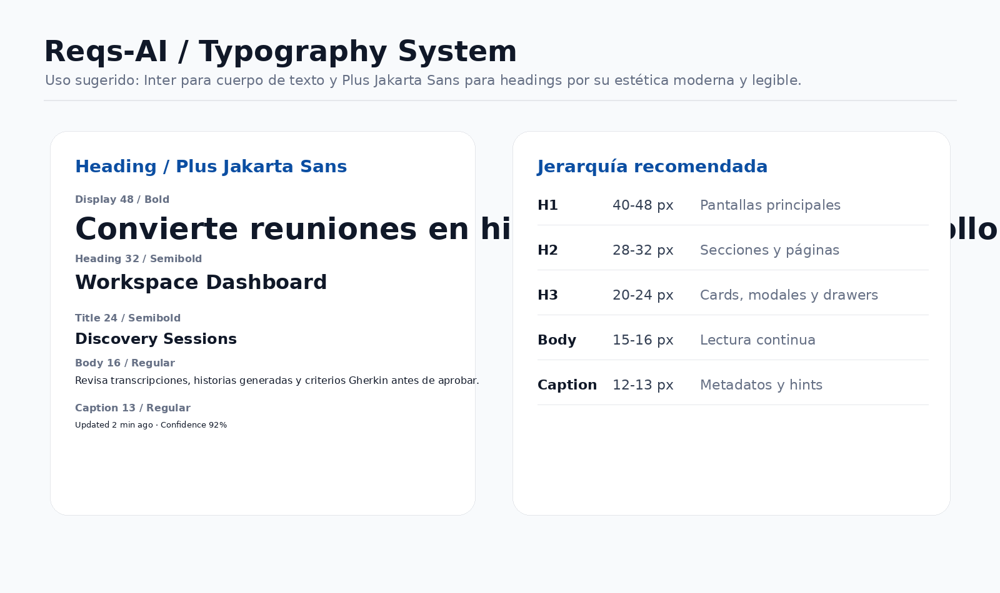

Los componentes siguen criterios de consistencia. Los botones principales se reservan para acciones críticas como crear workspace, iniciar sesión en vivo, aprobar historia o conectar Jira. Los botones secundarios se utilizan para editar, cancelar, visualizar detalles o navegar entre estados. Los formularios deben mostrar etiquetas claras, placeholders descriptivos y mensajes de validación visibles cuando exista un error. Las tarjetas se utilizan para agrupar información de proyectos, sesiones, historias y métricas de uso.

En cuanto a accesibilidad, se prioriza el contraste entre texto y fondo, el uso de etiquetas comprensibles, la persistencia de navegación global y la diferenciación visual de estados. Los elementos interactivos deben mantener tamaños adecuados para facilitar su uso en escritorio y pantallas reducidas. Asimismo, los mensajes de error deben ser específicos para que el usuario pueda corregir su acción sin depender de interpretación técnica.

### 6.1.2. Web, Mobile & Devices Style Guidelines

Para la web application, Reqs-AI utiliza una estructura de aplicación empresarial basada en tres zonas principales: sidebar lateral, topbar superior y área central de contenido. La sidebar permite acceder a módulos como Dashboard, Projects, Sessions, User Stories, Integrations, Billing y Settings. La topbar concentra el selector de workspace, la búsqueda global, acciones rápidas y el menú de perfil. El área central se adapta al módulo activo mediante tablas, tarjetas, modales y paneles laterales.

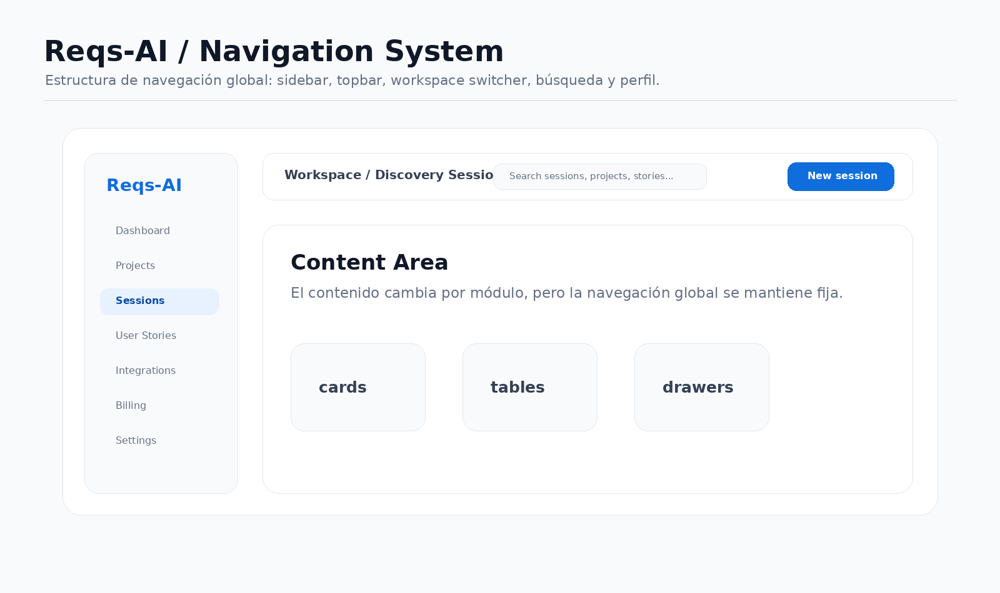

En escritorio, la aplicación debe aprovechar el ancho disponible para mostrar información densa, como listados de sesiones, tableros de historias, métricas de consumo, configuración de integraciones y paneles de revisión. En estos casos, se recomienda usar layouts de dos columnas o paneles laterales para evitar abrir demasiadas pantallas nuevas. Por ejemplo, una historia de usuario puede listarse en el tablero y abrirse en un drawer lateral para revisar criterios Gherkin, confianza de IA y acciones de aprobación.

En dispositivos móviles, la experiencia debe simplificarse priorizando consultas rápidas, revisión de estados y acciones puntuales. La navegación lateral puede transformarse en menú colapsable, la topbar debe reducirse a búsqueda, perfil y acción principal, y las tablas deben convertirse en tarjetas verticales. Esto permite mantener la coherencia visual sin sobrecargar pantallas pequeñas.

Para dispositivos externos o escenarios de grabación, la interfaz debe reforzar estados claros: sesión activa, sesión pausada, procesamiento en curso, historia generada, historia pendiente de revisión y exportación completada. Estos estados son importantes porque Reqs-AI trabaja con procesos en vivo y procesamiento asistido por IA, por lo que el usuario necesita retroalimentación inmediata para confiar en el sistema.

## 6.2. Information Architecture

La arquitectura de información de Reqs-AI organiza los contenidos de la plataforma en función del flujo real del usuario: acceder a la cuenta, crear o seleccionar un workspace, configurar proyectos, iniciar sesiones de descubrimiento, revisar historias generadas por IA, exportarlas hacia herramientas externas y administrar la organización. Esta organización permite que la experiencia sea coherente con el proceso de levantamiento de requisitos y no solo con una agrupación técnica de funcionalidades.

La estructura principal se divide en módulos globales: Authentication, Workspace, Dashboard, Projects, Discovery Sessions, User Stories, Integrations, Billing y Settings. Cada módulo agrupa acciones relacionadas y mantiene una nomenclatura consistente para reducir ambigüedad. De esta forma, el usuario puede comprender dónde iniciar una tarea, dónde revisar resultados y dónde configurar aspectos administrativos.

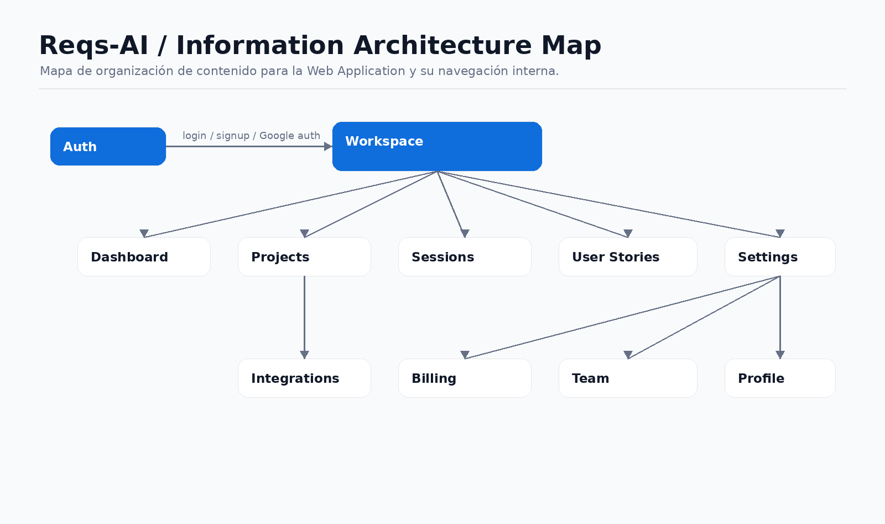

### 6.2.2. Labeling Systems

El sistema de etiquetado de Reqs-AI utiliza términos breves, consistentes y orientados al lenguaje del dominio. Las etiquetas principales se mantienen en inglés porque el producto trabaja con conceptos habituales del entorno SaaS y de gestión ágil, como Workspace, Projects, Sessions, User Stories, Integrations y Billing. Sin embargo, las descripciones internas pueden adaptarse al idioma del usuario cuando se requiera internacionalización.

Las etiquetas de navegación deben indicar claramente el contenido del módulo. “Projects” agrupa iniciativas por cliente o producto; “Sessions” representa reuniones procesadas o en vivo; “User Stories” contiene historias generadas por IA; “Integrations” centraliza conexiones con Jira u otras herramientas; “Billing” administra plan y consumo; y “Settings” concentra la configuración organizacional y de equipo.

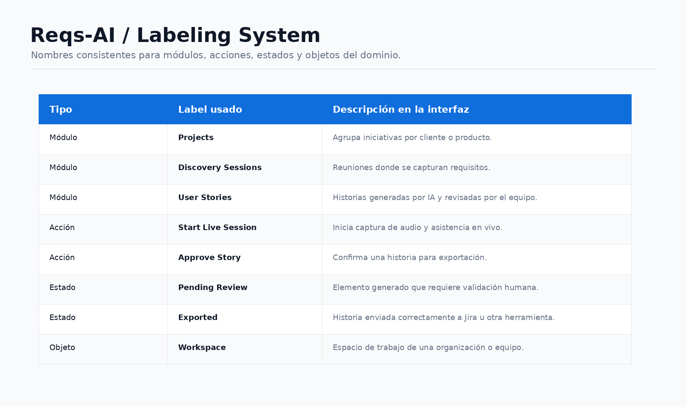

Para las acciones, se recomienda utilizar verbos directos que indiquen intención: Create Workspace, Start Live Session, Create Project, Approve Story, Export to Jira, Invite Member y Connect Integration. Para los estados, se deben usar etiquetas que permitan comprender el avance del flujo: Draft, Active, Processing, Pending Review, Approved, Exported, Failed y Archived.

Este sistema de etiquetado ayuda a reducir la carga cognitiva porque el usuario puede asociar rápidamente cada término con una tarea concreta del proceso de levantamiento, revisión y transferencia de requisitos.

### 6.2.3. Searching Systems

El sistema de búsqueda de Reqs-AI debe facilitar la localización rápida de proyectos, sesiones, historias de usuario, miembros e integraciones. La búsqueda principal se ubica en la topbar para estar disponible desde cualquier módulo de la aplicación. Esto permite que el usuario no dependa únicamente de la navegación lateral cuando necesita encontrar información específica.

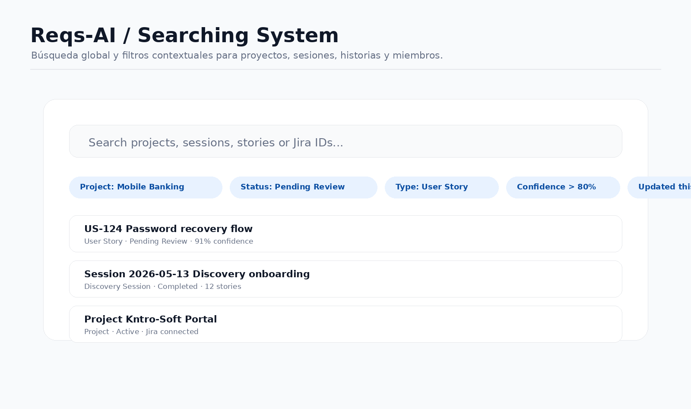

La búsqueda global debe aceptar palabras clave relacionadas con nombres de proyectos, títulos de sesiones, identificadores de historias, estados de revisión, miembros del equipo y referencias externas como tickets de Jira. Además, cada módulo debe contar con filtros contextuales. En Projects, los filtros pueden ser estados, cliente o fecha de actualización. En Sessions, los filtros pueden ser proyecto, estado de procesamiento o fecha. En User Stories, los filtros pueden ser estados, prioridad, confianza de IA, similitud detectada o exportación.

Para mejorar la experiencia, los resultados deben mostrar información resumida: nombre del elemento, tipo, estado, fecha de actualización y acción rápida. Esto permite que el usuario decida si desea abrir el detalle, editar, aprobar o exportar sin ingresar a múltiples pantallas.

### 6.2.4. SEO Tags and Meta Tags

Los SEO Tags y Meta Tags se aplican principalmente a la landing page pública de Reqs-AI, ya que la aplicación interna se encuentra protegida por autenticación y no debe indexarse en buscadores. La landing page debe estar optimizada para comunicar la propuesta de valor del producto, captar leads y explicar cómo la plataforma convierte reuniones de discovery en historias de usuario estructuradas con apoyo de IA.

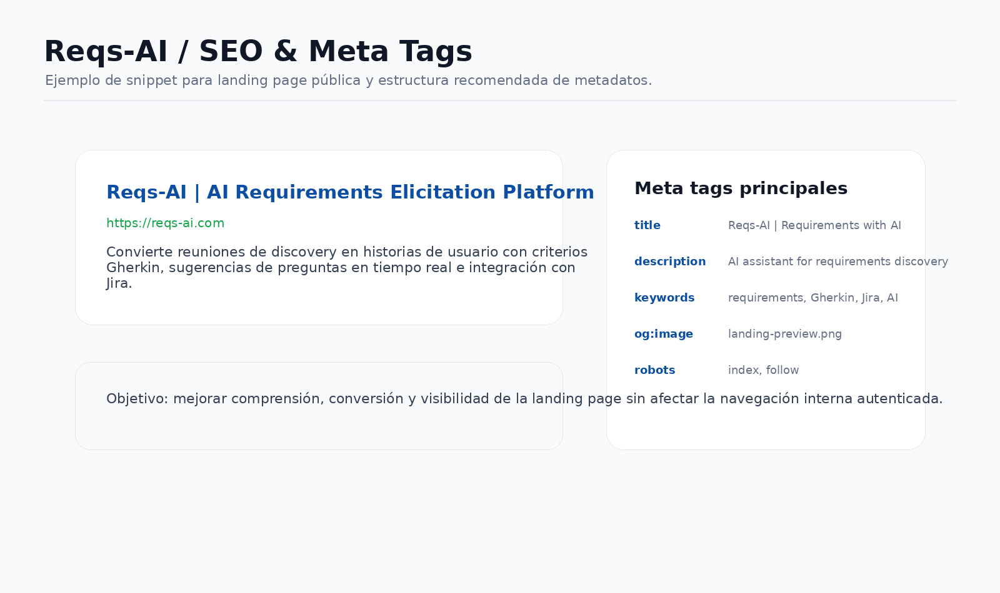

Se propone utilizar un título claro y orientado al beneficio, una descripción breve con palabras clave relacionadas con el dominio y etiquetas Open Graph para mejorar la presentación cuando el enlace sea compartido en redes sociales o canales profesionales. También se recomienda definir una imagen de previsualización, metadatos de idioma, autor, viewport responsive y robots index/follow para las páginas públicas.

Ejemplo de metadatos recomendados:

```html
<title>Reqs-AI | AI Requirements Elicitation Platform</title>
<meta name="description" content="Convert discovery meetings into structured user stories, Gherkin acceptance criteria and Jira-ready backlog items using AI.">
<meta name="keywords" content="requirements elicitation, user stories, Gherkin, Jira integration, AI assistant, software requirements">
<meta name="author" content="Kntro-Soft">
<meta name="viewport" content="width=device-width, initial-scale=1.0">
<meta name="robots" content="index, follow">
<meta property="og:title" content="Reqs-AI | Requirements with AI">
<meta property="og:description" content="Generate clear user stories from client meetings with AI assistance.">
<meta property="og:type" content="website">
<meta property="og:image" content="assets/ui/landing/reqs-ai-preview.png">
```

### 6.2.5. Navigation Systems

El sistema de navegación de Reqs-AI se organiza mediante una navegación global persistente y una navegación contextual por módulo. La navegación global se presenta en la sidebar y permite acceder a las áreas principales de la aplicación: Dashboard, Projects, Sessions, User Stories, Integrations, Billing y Settings. Esta estructura se mantiene constante para que el usuario siempre tenga claridad sobre su ubicación.

La navegación superior complementa la experiencia con el selector de workspace, búsqueda global, notificaciones, acciones rápidas y menú de perfil. El selector de workspace es clave porque Reqs-AI funciona bajo una lógica organizacional y permite operar sobre diferentes espacios de trabajo sin mezclar información entre clientes o equipos.

Dentro de cada módulo se utilizan breadcrumbs, tabs, botones de acción y paneles laterales. Por ejemplo, en User Stories el usuario puede navegar del tablero general al detalle de una historia mediante un drawer lateral; en Integrations puede abrir el flujo de conexión con Jira mediante un modal; y en Settings puede alternar entre configuración del workspace, miembros, roles y billing.

Este sistema de navegación busca mantener continuidad entre los flujos. El usuario puede pasar de una sesión de discovery a las historias generadas, luego revisar una historia, aprobarla y finalmente exportarla hacia Jira sin perder el contexto del proyecto ni del workspace activo.

## 6.3. Landing Page UI Design

El diseño de la interfaz de usuario (UI) para la Landing Page de Reqs-AI ha sido estructurado como el puente directo entre la propuesta de valor técnica de Kntro-Soft y las necesidades cognitivas de nuestros segmentos objetivos. Para lograrlo, traducimos los hallazgos del proceso de Need Finding y la arquitectura de información en una disposición visual que prioriza la claridad, la accesibilidad y el profesionalismo. Cada componente de la interfaz responde a decisiones estratégicas de diseño inclusivo: desde el uso de contrastes tipográficos que guían el flujo de lectura del usuario, hasta una jerarquía visual rigurosa que destaca de inmediato soluciones clave como la documentación instantánea en Gherkin y el asistente consultivo en tiempo real. Así, transformamos los requisitos funcionales de la plataforma en una experiencia digital intuitiva, limpia y optimizada para mitigar la fricción desde el primer punto de contacto.

### 6.3.1. Landing Page Wireframe

**Hero Section Wireframe**

El Hero Section se posiciona en la parte superior de la página aplicando el principio de proximidad y foco visual, donde un titular de alto contraste comunica instantáneamente la propuesta de valor de Reqs-AI ("Documentación de requisitos asistida por IA en tiempo real"), acompañada de un subtítulo persuasivo y un botón de Call to Action (CTA) altamente accesible. Su disposición está optimizada arquitectónicamente mediante una estructura de una sola columna central en dispositivos móviles para facilitar el scrolling vertical, y un diseño de dos columnas en formato desktop que equilibra el texto con una captura intuitiva de la plataforma, guiando de forma fluida el recorrido visual del usuario sin generar sobrecarga cognitiva.


**Benefits Section Wireframe**

Esta sección presenta las funcionalidades clave mediante un diseño modular y limpio que respeta el principio de simplicidad, agrupando cada beneficio (documentación instantánea, asistencia en vivo y contexto inteligente) con un ícono descriptivo para agilizar la consistencia y el reconocimiento visual. En la versión web de escritorio se despliega una cuadrícula horizontal de tres columnas para una lectura comparativa rápida, mientras que en la versión móvil se adapta a una lista vertical de una sola columna que garantiza la adaptabilidad y una navegación táctil cómoda y fluida.


**Features Section Wireframe**

Esta sección expone el funcionamiento técnico de la plataforma mediante un flujo visual continuo que aplica el principio de secuencia lógica y continuidad. En la versión de escritorio, el proceso se divide en un diseño asimétrico de dos columnas alternadas que guían el recorrido del usuario paso a paso, mientras que la versión móvil lo consolida en una sola columna vertical con espaciados optimizados, asegurando una asimilación intuitiva y una alta legibilidad en pantallas táctiles.


**Target Segments Section Wireframe**

Esta sección expone los públicos objetivos aplicando el principio de contraste y segmentación clara de la información para diferenciar ambos perfiles. En la interfaz de escritorio se despliegan dos tarjetas simétricas en paralelo que permiten una comparativa directa e inmediata, mientras que en la versión móvil se apilan verticalmente para mantener una lectura limpia, un scroll cómodo y una correcta accesibilidad táctil.


**Testimonials Section Wireframe**

Esta sección refuerza la confianza de la plataforma aplicando el principio de prueba social mediante un diseño modular y limpio. En la versión de escritorio, los testimonios se organizan en una cuadrícula horizontal de tres columnas que permite una lectura rápida de las experiencias de los usuarios, mientras que en la versión móvil se adaptan a un carrusel o lista vertical de una sola columna que optimiza el espacio y facilita la navegación táctil.


**Pricing Section Wireframe**

Esta sección presenta los planes de suscripción de la plataforma aplicando el principio de contraste e incentivo visual para guiar la conversión de los distintos segmentos. En la versión de escritorio se despliega una estructura de tres columnas en paralelo destacando el plan "Professional" con una inversión de color (tarjeta negra), mientras que en la versión móvil las tarjetas se apilan verticalmente, manteniendo botones de acción (CTA) amplios y accesibles para una óptima interacción táctil.


**Contact Section Wireframe**

Esta sección facilita la conversión y el soporte directo aplicando los principios de claridad y accesibilidad en los canales de comunicación. En la interfaz de escritorio, los datos de contacto corporativo (correo electrónico y dirección física) se distribuyen de forma asimétrica junto a una descripción concisa para optimizar el espacio en pantalla, mientras que en la versión móvil los elementos se unifican en un flujo vertical de una sola columna que garantiza un acceso táctil inmediato y libre de fricciones.


**Final CTA Section Wireframe**

Esta sección actúa como el cierre de conversión de la página aplicando el principio de foco absoluto y aislamiento visual mediante un fondo oscuro de alto contraste. Su estructura simétrica de una sola columna centralizada, idéntica tanto en la versión de escritorio como en la móvil, elimina cualquier distracción secundaria para dirigir toda la atención del usuario hacia el botón principal de registro ("Get Started Now"), maximizando la accesibilidad y la intención de clic.


**Footer Section Wireframe**

Esta sección consolida el cierre de la página aplicando los principios de consistencia y arquitectura de información estructurada para la navegación secundaria. En la interfaz de escritorio se organiza mediante un diseño de cuadrícula asimétrica multicolumna que separa los derechos de autor y enlaces de redes sociales a la izquierda, distribuyendo de forma limpia las columnas temáticas de enlaces (Producto, Empresa, Soporte y Legal) a la derecha; mientras que en la versión móvil se unifica en una única columna de bloques apilados secuencialmente que optimiza el área táctil y la legibilidad en pantallas compactas.


### 6.3.2. Landing Page Mock-up

**Hero Section Mock-up**

El Mock-up del Hero Section consolida la identidad visual del producto aplicando el Design System mediante una paleta de colores oscuros de alta fidelidad con acentos morados y una tipografía moderna Sans-Serif de alto contraste (blanco sobre fondo oscuro), garantizando la accesibilidad (WCAG). En la versión de escritorio se plasma la arquitectura de dos columnas donde el texto persuasivo coexiste armónicamente con una maqueta detallada de la interfaz de Reqs-AI, mientras que la versión móvil sintetiza este espacio en una disposición centralizada de una sola columna que optimiza la interacción táctil en los botones principales (Call to Action).


**Benefits Section Mock-up**

El Mock-up de la sección de beneficios consolida visualmente el núcleo de la problemática aplicando el Design System mediante un sofisticado fondo azul noche de baja luminosidad, el cual genera un contraste idóneo con los textos en blanco y los acentos en verde esmeralda para garantizar la conformidad con las pautas de accesibilidad. En la versión de escritorio, las tres tarjetas de problemáticas identificadas (pérdida de información, feedback infinito y costos exponenciales) se organizan en una cuadrícula simétrica de tres columnas equipadas con íconos vectoriales minimalistas que agilizan el reconocimiento visual, mientras que la interfaz móvil las unifica en una secuencia vertical de lectura directa que facilita la interacción táctil y preserva el balance del espacio negativo.


**Features Section Mock-up**

El Mock-up de esta sección implementa un fondo claro y limpio que destaca las cuatro funcionalidades principales mediante tarjetas individuales con bordes suavizados, respetando el principio de consistencia técnica del Design System. En la versión de escritorio, se aplica una distribución horizontal de cuatro columnas equipadas con contenedores de íconos en tonalidades pastel que agilizan la navegación visual, mientras que en la interfaz móvil este flujo se transforma en un desplazamiento vertical unificado para asegurar la accesibilidad tipográfica y una cómoda interacción táctil.


**Target Segments Section Mock-up**

El Mock-up de esta sección segmenta con precisión a los usuarios aplicando el Design System a través de dos grandes contenedores simétricos con sutiles bordes redondeados y tipografía oscura de alta legibilidad sobre un fondo gris claro neutro. En la versión de escritorio, las tarjetas de "Tech Leaders" y "Systems Analysts" se posicionan en paralelo para facilitar una lectura comparativa de sus dolores y beneficios específicos, integrando checkmarks de color verde esmeralda para una rápida asimilación visual; mientras que en la versión móvil se apilan de forma vertical para asegurar un escalado limpio y una óptima accesibilidad táctil.


**Testimonials Section Mock-up**

El Mock-up de esta sección materializa la prueba social aplicando el Design System mediante tarjetas individuales blancas que incorporan avatares circulares de alta definición y tipografía en cursiva para los testimonios corporativos. En la versión de escritorio, las opiniones se distribuyen horizontalmente en una cuadrícula simétrica de tres columnas que organiza la información de los líderes de la industria de forma limpia, mientras que en la versión móvil se adaptan a un ordenamiento vertical de una sola columna que garantiza la legibilidad tipográfica y una cómoda navegación táctil.


**Pricing Section Mock-up**

El Mock-up de la sección de precios plasma el modelo de monetización aplicando el Design System mediante tres tarjetas con tipografía limpia de gran escala para las tarifas (como el plan Starter de $49/mo enfocado en startups). En la versión de escritorio, se utiliza el principio de asimetría visual al destacar el plan "Professional" con un fondo azul oscuro profundo y un botón CTA verde esmeralda para atraer la conversión, mientras que en la versión móvil la interfaz se adapta a un apilamiento vertical que resguarda la proporción del espacio y garantiza la accesibilidad en la lectura de las características técnicas.


**Contact Section Mock-up**

El Mock-up de la sección de contacto materializa los canales de atención aplicando el Design System mediante iconografía lineal en color verde esmeralda y tipografía oscura de alta legibilidad sobre un fondo gris neutro. En la versión de escritorio, la información de soporte (hello@reqs.ai) y la dirección corporativa se despliegan con una alineación asimétrica a la izquierda que deja un respiro visual óptimo gracias al uso estratégico del espacio negativo, mientras que en la versión móvil todo el bloque se centraliza en una sola columna para garantizar una lectura directa y un acceso táctil inmediato.


**Final CTA Section Mock-up**

El Mock-up de la sección de cierre consolida la conversión aplicando el Design System mediante un bloque contenedor de color azul noche profundo y bordes suavizados que aísla visualmente el contenido para eliminar elementos distractores. Su estructura centralizada de una sola columna destaca un titular persuasivo de gran escala ("Stop wasting hours post-processing meeting recordings.") y un botón principal (CTA) verde esmeralda con alto contraste tipográfico, garantizando una interacción táctil intuitiva y una accesibilidad óptima tanto en la interfaz de escritorio como en la adaptación móvil.


**Footer Section Mock-up**

El Mock-up del Footer consolida la navegación secundaria aplicando el Design System mediante una tipografía Sans-Serif oscura de alta legibilidad sobre un fondo blanco limpio. En la versión de escritorio se implementa una cuadrícula asimétrica multicolumna que agrupa de manera lógica y ordenada las secciones del producto (Product, Company, Support y Legal) junto al logotipo, el lema corporativo y los íconos de redes sociales a la izquierda, mientras que en la versión móvil todos los bloques se apilan verticalmente de forma secuencial para maximizar las áreas de interacción táctil.


## 6.4. Applications UX/UI Design

En esta sección se presenta el diseño UX/UI de la aplicación web de Reqs-AI. El objetivo es mostrar cómo la solución organiza la experiencia del usuario dentro de la plataforma, desde el acceso inicial hasta la gestión de workspaces, proyectos, sesiones de descubrimiento, historias generadas por IA, integraciones, facturación y configuración del equipo.

La propuesta de diseño se centra en validar la navegación, jerarquía visual, consistencia entre módulos y claridad de los flujos principales antes de pasar a la versión final de alta fidelidad. De esta manera, los wireframes permiten revisar la estructura funcional de la aplicación y los mock-ups permiten representar la apariencia final del producto.

### 6.4.1. Applications Wireframes

**Web Application Wireframes**

Los wireframes de la aplicación web representan la versión de baja fidelidad de Reqs-AI. Su finalidad es validar la distribución de los elementos, la navegación interna, la secuencia de pantallas y los estados principales del sistema sin centrarse todavía en colores, estilos visuales o detalles gráficos finales.

Estos wireframes cubren el recorrido principal del usuario: autenticación, creación del workspace, navegación por el dashboard, gestión de proyectos, configuración de sesiones, revisión de historias generadas por IA, integración con Jira, administración de facturación y configuración del equipo.

**Autenticación y acceso**

**Google Auth External Authorization Wireframe**

**Descripción:** Representa la pantalla de autorización externa mediante Google. En baja fidelidad permite validar la ubicación del bloque de acceso federado, los permisos solicitados y el retorno seguro hacia Reqs-AI.


**Login Screen Wireframe**

**Descripción:** Muestra la estructura base del inicio de sesión. Define la jerarquía de campos, acciones principales y acceso alternativo para que el usuario registrado ingrese a su workspace.


**Signup Screen Wireframe**

**Descripción:** Presenta la composición inicial del formulario de registro. Permite validar la disposición de campos, botones y enlaces necesarios para crear una cuenta en la plataforma.


**Onboarding y creación de workspace**

**Dashboard Empty State Before Workspace Wireframe**

**Descripción:** Expone el estado vacío del dashboard cuando el usuario aún no tiene un workspace. Este wireframe válida el mensaje guía y el llamado a la acción para iniciar el onboarding.


**Workspace Creation Modal Empty Fields Wireframe**

**Descripción:** Muestra el modal de creación de workspace sin datos ingresados. Sirve para validar la estructura del formulario y los campos mínimos requeridos para crear una organización.


**Workspace Creation Validation Errors Wireframe**

**Descripción:** Representa los mensajes de validación del formulario. Permite comprobar cómo se informan errores cuando faltan datos obligatorios o cuando la información no cumple las reglas.


**Workspace Company Type Dropdown Open Wireframe**

**Descripción:** Muestra el selector de tipo de compañía abierto. Este estado permite validar cómo el usuario escoge el perfil de organización para contextualizar el uso inicial de Reqs-AI.


**Workspace Team Size Dropdown Open Wireframe**

**Descripción:** Presenta el selector de tamaño de equipo. Este wireframe ayuda a validar la captura de información necesaria para adaptar la experiencia del workspace.


**Workspace Creation Form Filled Wireframe**

**Descripción:** Muestra el formulario de workspace completado. Permite revisar cómo se presentan los datos antes de confirmar la creación del espacio de trabajo.


**Workspace Use Case Selection State Wireframe**

**Descripción:** Representa la selección del caso de uso principal del workspace. Permite validar la organización visual de opciones vinculadas a discovery, requisitos, documentación e integración.


**Workspace Creation Loading State Wireframe**

**Descripción:** Muestra el estado de carga durante la creación del workspace. Su objetivo es validar la retroalimentación visual mientras el sistema configura el entorno.


**Workspace Created Success Modal Wireframe**

**Descripción:** Presenta la confirmación de creación exitosa del workspace. Este wireframe válida el cierre del onboarding y la transición hacia el dashboard principal.


**Dashboard y navegación principal**

**Workspace Dashboard Home Wireframe**

**Descripción:** Muestra la estructura general del dashboard con navegación lateral, barra superior, métricas y accesos rápidos. Permite validar la organización inicial de la aplicación interna.


**Workspace Switcher Menu Open Wireframe**

**Descripción:** Representa el selector de workspace abierto. Permite validar el cambio de contexto entre organizaciones o espacios de trabajo sin perder consistencia en la navegación.


**User Profile Menu Open Wireframe**

**Descripción:** Muestra el menú de perfil del usuario. Válida la ubicación de opciones personales, configuración de cuenta y cierre de sesión dentro de la interfaz global.


**Gestión de proyectos**

**Projects Page Overview Wireframe**

**Descripción:** Presenta la vista general de proyectos. Permite validar la organización de listados, estados, acciones y acceso a la creación de nuevos proyectos dentro del workspace.


**Create New Project Modal Wireframe**

**Descripción:** Muestra el modal para crear un proyecto. Permite validar la captura de información inicial del proyecto y la selección de plantilla o configuración base.


**Sesiones de descubrimiento**

**Discovery Sessions Page Wireframe**

**Descripción:** Representa la vista de sesiones de descubrimiento. Sirve para validar la tabla de sesiones, filtros, estados y acciones asociadas al procesamiento de reuniones.


**Live Session Configuration Modal Wireframe**

**Descripción:** Muestra la configuración previa para iniciar una sesión en vivo. Permite validar campos, permisos y opciones necesarias para activar la captura asistida por IA.


**Historias de usuario generadas por IA**

**User Stories Review Board Wireframe**

**Descripción:** Presenta el tablero de historias generadas por IA. Permite validar la disposición de tarjetas, métricas, estados de revisión y acciones de aprobación.


**User Story Detail Review Drawer Wireframe**

**Descripción:** Muestra el detalle de una historia de usuario, incluyendo criterios de aceptación y revisión. Sirve para validar el panel lateral de edición, confianza y aprobación.


**Integraciones externas**

**Integrations Page Jira Connection Wireframe**

**Descripción:** Representa la página de integraciones externas. Válida la ubicación de la conexión con Jira, el estado de integración y las acciones de configuración.


**Jira Connection Modal Wireframe**

**Descripción:** Muestra el asistente de conexión con Jira. Permite validar el flujo de autenticación, mapeo de proyectos y configuración de sincronización con Atlassian.


**Billing y configuración**

**Billing Subscription Page Wireframe**

**Descripción:** Presenta la página de suscripción y facturación. Sirve para validar la visualización del plan activo, consumo, límites y opciones de actualización.


**Settings Workspace Configuration Wireframe**

**Descripción:** Muestra la configuración general del workspace. Permite validar la organización de secciones relacionadas con datos, preferencias, plan y controles administrativos.


**Settings Team Members Management Wireframe**

**Descripción:** Representa la subsección de miembros o perfil dentro de settings. Permite validar la gestión de usuarios, roles, invitaciones y control de acceso al workspace.


**Navigation Consistency Check Frame Wireframe**

**Descripción:** Evidencia la consistencia de navegación entre pantallas. Permite comprobar que sidebar, barra superior, perfil y acciones principales se mantienen uniformes.


**Variantes complementarias del onboarding**

**Workspace Creation Form Filled Alternative Wireframe**

**Descripción:** Presenta una variante del formulario de workspace completado. Se usa para contrastar distribución de campos y confirmar que el flujo mantiene claridad antes de guardar.


**Workspace Settings Company Type Dropdown Wireframe**

**Descripción:** Muestra una variante del selector de tipo de empresa dentro del flujo de configuración. Permite validar la selección del contexto organizacional.


**Workspace Use Case Selection Modal Wireframe**

**Descripción:** Representa una versión alternativa del modal de selección de caso de uso. Ayuda a validar la lectura de opciones y la continuidad del onboarding.


**Workspace Initialization Loading Modal Wireframe**

**Descripción:** Muestra una variante del estado de inicialización del workspace. Permite validar la comunicación de progreso mientras se preparan recursos internos.


**Workspace Created Success Details Wireframe**

**Descripción:** Presenta una variante del mensaje de éxito con mayor detalle. Sirve para validar el cierre del flujo y la confirmación de elementos creados dentro del workspace.


**Mobile Application Wireframes**

Los wireframes de la aplicación móvil representan la versión de baja fidelidad de Reqs-AI en formato adaptado para dispositivos móviles. Su objetivo es validar la estructura, navegación y flujos principales dentro de una interfaz táctil y de menor tamaño, manteniendo la consistencia funcional con la versión web.

**Login Screen**

**Descripción:** Esta pantalla gestiona el acceso seguro a la aplicación móvil aplicando el principio de simplicidad y reducción de la carga cognitiva mediante un diseño de una sola columna centralizada. El flujo prioriza la accesibilidad táctil ubicando los campos de entrada de texto (Email y Password) y el botón principal de acción (CTA) con dimensiones óptimas para evitar errores de pulsación, mientras que la arquitectura de información organiza los elementos de forma secuencial de arriba hacia abajo, garantizando una navegación intuitiva y directa desde el primer punto de contacto.


**Dashboard Screen**

**Descripción:** Esta pantalla actúa como el centro de control principal de la aplicación, estructurando la arquitectura de información mediante un flujo completamente vertical y modular para pantallas compactas. En la parte superior se integran tarjetas de métricas numéricas con barras de progreso que aplican el principio de consistencia visual para una asimilación inmediata del estado del proyecto, seguidas de una lista secuencial de elementos (Lorem Ipsum List) con contenedores amplios que mitigan el esfuerzo cognitivo. Para asegurar el diseño inclusivo y la accesibilidad táctil en movilidad, la pantalla incorpora un menú de navegación inferior (Bottom Navigation Bar) con etiquetas claras y un botón de acción flotante (FAB) estratégicamente posicionado en la esquina inferior derecha para facilitar el alcance con el pulgar.


**Settings & Profile Screen**

**Descripción:** Esta vista gestiona la configuración de usuario agrupando la información en contenedores independientes que respetan el principio de proximidad y consistencia. La arquitectura de información distribuye verticalmente el perfil del usuario, el resumen de cuenta, las preferencias de apariencia, la seguridad, las notificaciones y las herramientas conectadas (como Jira o Trello); garantizando un diseño inclusivo mediante botones de acción grandes, etiquetas explícitas y un menú de navegación inferior consistente que facilita el control ergonómico con una sola mano.


**Live Assistant Screen**

**Descripción:** Esta pantalla representa el núcleo interactivo en tiempo real de la solución móvil, estructurando un flujo de conversación dinámico optimizado para la escucha activa en juntas de trabajo. La arquitectura de información utiliza un diseño cronológico asimétrico de burbujas de diálogo que diferencia claramente las intervenciones de los participantes (Stakeholder) del procesamiento del sistema (Assistant), reduciendo drásticamente la sobrecarga cognitiva.

Cumpliendo con los principios de diseño inclusivo y accesibilidad táctil en movilidad, la sección inferior integra un carrusel horizontal interactivo de sugerencias estratégicas inteligentes (AI Suggestions) con botones de acción rápida de gran tamaño (Use Suggestion), acompañados por una barra de herramientas de control ergonómico inferior de alta accesibilidad para operaciones inmediatas como silenciar, tomar notas o revisar artefactos generados.


**Review & Export Screen**

**Descripción:** Esta pantalla gestiona la revisión exhaustiva y exportación de artefactos mediante una arquitectura de información jerárquica y modular adaptada para entornos móviles. La interfaz implementa un sistema de pestañas superiores (Tabs) para alternar rápidamente entre categorías, seguido de tarjetas con listas de verificación individuales (Checkboxes) que permiten al usuario seleccionar historias de usuario específicas que despliegan su estructura sintáctica detallada. Para mitigar la fricción y asegurar un diseño inclusivo en movilidad, la pantalla superpone un panel emergente inferior (Bottom Sheet) de alta accesibilidad táctil que organiza las opciones de integración (como Jira, Azure, GitHub y Markdown) en una cuadrícula simétrica de botones amplios y fáciles de pulsar con una sola mano, agilizando el flujo de sincronización hacia repositorios externos de gestión.


**Projects Archive Screen**

**Descripción:** Esta pantalla gestiona el catálogo de proyectos activos e históricos estructurando la arquitectura de información mediante un patrón jerárquico que facilita la búsqueda y el filtrado rápido en dispositivos móviles. En la parte superior se integra una barra de búsqueda (Search Input) seguida de píldoras de filtrado por estado (All, In Progress, Completed) que respetan el principio de consistencia técnica y proximidad, permitiendo refinar los resultados con un solo toque. El cuerpo principal organiza los proyectos en tarjetas modulares individuales que optimizan la legibilidad tipográfica; cada tarjeta agrupa de forma clara el estado del proyecto, el título, el cliente, la cantidad de historias de usuario y una barra de progreso porcentual. Finalmente, para garantizar el diseño inclusivo y la ergonomía táctil en movilidad, se incluye un botón de acción flotante (FAB) para añadir nuevos proyectos y una barra de navegación inferior (Bottom Navigation Bar) que asegura un control cómodo y libre de fricciones con una sola mano.


**Project Settings Screen**

**Descripción:** Esta vista gestiona los parámetros específicos de un proyecto individual organizando la arquitectura de información mediante una estructura puramente vertical que agrupa las configuraciones generales, el backend de sincronización, la gestión de miembros del equipo y los tokens de acceso. El diseño prioriza la accesibilidad y el control inclusivo en movilidad al implementar controles deslizantes (Switches) y menús desplegables con amplias áreas de activación táctil, optimizando la interacción con una sola mano y reduciendo la fatiga cognitiva del usuario.


**Session History Screen**

**Descripción:** Esta pantalla organiza el historial cronológico de las sesiones de elicitación mediante una línea de tiempo vertical dividida por bloques temporales (Today, Yesterday) que reduce la carga cognitiva del usuario. La interfaz aplica los principios de jerarquía visual y diseño inclusivo al estructurar cada sesión en tarjetas independientes con identificadores únicos (#ID), etiquetas de estado y botones de acción de gran tamaño (View Transcript o Resume Session), permitiendo un acceso y control táctil inmediato en movilidad.


**Integrations Directory Screen**

**Descripción:** Esta pantalla centraliza las herramientas externas conectadas organizando la arquitectura de información mediante categorías temáticas horizontales (Project Management, Communication) que simplifican el descubrimiento y la navegación en la interfaz móvil. El diseño fomenta el diseño inclusivo al implementar tarjetas independientes con botones de gran tamaño para conectar (Connect) o gestionar (Manage), complementado con un buscador superior accesible para mitigar el esfuerzo cognitivo y agilizar las tareas táctiles en movilidad.


**Billing & Subscription Screen**

**Descripción:** Esta pantalla gestiona los detalles de facturación de la aplicación organizando la arquitectura de información de manera lineal y segregada mediante bloques de historial de transacciones, métodos de pago vinculados y tarjetas de suscripción activa. El diseño refuerza los principios de diseño inclusivo al incorporar botones de acción prominentes para la cancelación o actualización de planes, reduciendo la fricción en transacciones críticas y garantizando una interacción táctil transparente, ergonómica y libre de errores en movilidad.


### 6.4.2. Applications Wireflow Diagrams

**Web Application Wireflow Diagrams**

Los wireflows de la aplicación web de Reqs-AI representan la conexión entre pantallas y estados interactivos del sistema. A diferencia de los wireframes, estos diagramas no solo muestran la estructura visual, sino también cómo el usuario avanza de una acción a otra dentro del flujo: autenticación, creación de workspace, navegación principal, gestión de proyectos, sesiones de descubrimiento, revisión de historias generadas por IA, integraciones, facturación y configuración del equipo.

Cada wireflow incluye una flecha que indica la transición principal entre pantallas, permitiendo validar la continuidad de la experiencia, la coherencia de navegación y la relación entre módulos de la web application.

**Flujo de autenticación y acceso**

**Registro hacia inicio de sesión**

**Descripción:** El flujo muestra cómo un visitante que se encuentra en la pantalla de registro puede volver al inicio de sesión mediante el enlace de acceso. Esta transición valida la navegación bidireccional entre autenticación y creación de cuenta.


**Inicio de sesión hacia autenticación con Google**

**Descripción:** El flujo evidencia que el usuario puede seleccionar la opción de continuar con Google desde el login. Luego es redirigido al selector de cuenta externo, reduciendo fricción en el acceso.


**Registro hacia autenticación con Google**

**Descripción:** El flujo representa la alternativa de crear una cuenta usando Google desde la pantalla de registro. Permite validar que el onboarding también soporta autenticación federada.


**Inicio de sesión hacia confirmación de workspace creado**

**Descripción:** El flujo muestra que, luego de autenticarse correctamente, el usuario puede ser llevado al estado de confirmación del workspace. Este paso cierra el acceso inicial y conecta con las acciones posteriores del entorno de trabajo.


**Flujo de onboarding y creación de workspace**

**Confirmación de workspace hacia carga de configuración**

**Descripción:** El flujo inicia en el modal de workspace creado y continúa hacia un estado de construcción del entorno. Válida que el sistema comunica el progreso mientras prepara módulos, contexto de IA y configuración inicial.


**Workspace creado hacia configuración de tipo de empresa**

**Descripción:** El flujo permite pasar desde el modal de éxito a la configuración del workspace. Se evidencia la selección del tipo de compañía para adaptar la experiencia al contexto de la organización.


**Tipo de empresa hacia selección de caso de uso**

**Descripción:** El flujo muestra cómo, después de seleccionar el tipo de organización, el usuario continúa hacia la definición del caso de uso principal. Esta transición ayuda a personalizar el workspace según el objetivo de trabajo.


**Selección de caso de uso hacia formulario de workspace**

**Descripción:** El flujo representa el paso desde la selección de usos del workspace hacia el formulario de creación. Permite validar que el usuario puede completar la configuración general luego de definir su enfoque de trabajo.


**Formulario completo hacia validación de nuevo workspace**

**Descripción:** El flujo muestra la acción de crear workspace desde un formulario completado y su transición a una variante de validación. Evidencia cómo la interfaz comunica errores o campos requeridos antes de guardar.


**Estado vacío hacia creación de workspace**

**Descripción:** El flujo parte del dashboard sin workspace y lleva al modal de creación. Esta transición valida el onboarding principal cuando el usuario aún no tiene un espacio activo.


**Crear workspace hacia desplegable de tipo de compañía**

**Descripción:** El flujo muestra la apertura del selector de tipo de compañía dentro del formulario. Permite comprobar que el usuario puede clasificar su organización antes de finalizar la creación.


**Tipo de compañía hacía caso de uso principal**

**Descripción:** El flujo evidencia que, al completar la información organizacional, el usuario puede definir el propósito principal del workspace. Esta selección orienta el uso de Reqs-AI hacia requisitos, discovery o planificación.


**Tamaño de equipo hacia selección de usos principales**

**Descripción:** El flujo muestra la selección del tamaño del equipo y su avance hacia la pantalla de casos de uso. Permite validar que el onboarding recopila datos de escala y preferencias funcionales.


**Progreso de creación hacia workspace creado**

**Descripción:** El flujo representa la transición desde el estado de creación en progreso hasta la confirmación exitosa. Válida que el usuario recibe retroalimentación clara cuando el espacio termina de configurarse.


**Workspace creado hacia página principal**

**Descripción:** El flujo muestra cómo el usuario pasa desde el modal de éxito hacia el home del workspace. Esta transición permite iniciar la gestión de proyectos, sesiones e insights desde el dashboard.


**Flujo de navegación principal e historias de usuario**

**Home del workspace hacia historias de usuario**

**Descripción:** El flujo evidencia la navegación desde el dashboard principal hacia el módulo de User Stories. Permite validar el acceso al backlog generado por IA desde el menú lateral.


**Listado de historias hacia panel de revisión**

**Descripción:** El flujo muestra cómo una historia del listado se abre en un drawer de revisión. Allí se visualizan estado, prioridad, confianza de IA, descripción y criterios Gherkin para su aprobación.


**Selector de workspace hacia menú de perfil**

**Descripción:** El flujo evidencia dos componentes globales de navegación: el selector de workspace y el menú de perfil. Válida que el usuario puede cambiar contexto y acceder a opciones personales desde la cabecera.


**Flujo de proyectos y sesiones de descubrimiento**

**Selector de workspace hacía proyectos**

**Descripción:** El flujo muestra la transición desde la navegación global hacia la página de proyectos. Permite comprobar que el usuario puede ubicarse en un workspace y administrar sus iniciativas.


**Proyectos hacia creación de nuevo proyecto**

**Descripción:** El flujo parte del listado de proyectos y abre el modal de creación. Permite validar la captura del nombre, descripción, plantilla y visibilidad del proyecto.


**Menú de perfil hacia sesiones**

**Descripción:** El flujo muestra la navegación hacia el módulo de Sessions desde la estructura interna de la aplicación. Permite validar la consulta de reuniones procesadas, métricas y acciones disponibles.


**Sesiones hacia vista de discovery sessions**

**Descripción:** El flujo representa el cambio desde la vista completa de sesiones hacia una vista resumida de discovery sessions. Permite revisar métricas, sesiones recientes y estado de procesamiento.


**Discovery sessions hacia inicio de sesión en vivo**

**Descripción:** El flujo muestra cómo el usuario abre el modal para iniciar una sesión de descubrimiento en vivo. Se configuran título, proyecto asociado, modo de facilitación y opciones de captura antes de lanzar la sesión.


**Sesiones hacia integraciones**

**Descripción:** El flujo evidencia la navegación desde sesiones hacia el módulo de integraciones. Permite conectar los resultados del levantamiento con herramientas externas como Jira, Confluence, GitHub, Slack o Miro.


**Flujo de integraciones, billing y configuración**

**Integraciones hacia conexión con Jira**

**Descripción:** El flujo muestra cómo el usuario inicia la configuración de Jira desde la página de integraciones. El modal guía la autenticación, la conexión del sitio Atlassian y la preparación del mapeo.


**Billing hacia configuración del workspace**

**Descripción:** El flujo conecta la página de facturación con settings. Permite validar que el usuario puede revisar su plan, consumo y método de pago, y luego administrar configuración organizacional.


**Settings hacia gestión de equipo**

**Descripción:** El flujo muestra la navegación desde la configuración general hacia Team Management. Permite administrar miembros, invitaciones, roles, permisos y alertas del equipo.


**Gestión de equipo hacia home con notificaciones**

**Descripción:** El flujo evidencia el retorno desde Team Management hacia el dashboard principal, donde se despliega el panel de notificaciones. Permite validar la continuidad de navegación y comunicación de eventos del sistema.


**Mobile Application Wireflow Diagrams**

**Autenticación de usuario y gestión de perfil**

**Descripción:** Este Wireflow detalla el flujo secuencial orientado al objetivo del usuario de iniciar sesión de forma segura y navegar de inmediato hacia la gestión de su cuenta. El diagrama mapea la transición interactiva desde la pantalla de Login centralizada hasta la vista de Settings & Profile, evidenciando la persistencia de la arquitectura de información y la consistencia del menú de navegación inferior durante el desplazamiento ergonómico en la aplicación móvil.


**Navegación del Dashboard a Live Assistant**

**Descripción:** Este Wireflow ilustra el flujo interactivo diseñado para cumplir con el objetivo del usuario de iniciar o acceder rápidamente a una sesión de elicitación de requerimientos en tiempo real. El diagrama define la transición directa desde el Dashboard principal mediante la barra de navegación inferior hacia la pantalla del Live Assistant, asegurando que el analista pueda monitorear la transcripción y recibir sugerencias inteligentes de la IA de manera inmediata y sin fricciones de navegación.


**Navegación del Dashboard a Review & Export**

**Descripción:** Este Wireflow traza el camino interactivo enfocado en el objetivo del usuario de examinar, validar y exportar los requerimientos generados hacia repositorios externos. El diagrama mapea la navegación desde la vista principal del Dashboard hacia la pantalla de Review & Export, ilustrando cómo la interfaz despliega de forma adaptativa el menú emergente inferior (Bottom Sheet) para facilitar la sincronización táctil con herramientas de gestión de proyectos sin perder el contexto de la aplicación móvil.


**Gestión Integral de Proyectos y Requerimientos**

**Descripción:** Este Wireflow mapea el flujo interactivo de extremo a extremo diseñado para que el analista administre la configuración y los artefactos de un proyecto. El diagrama detalla la ruta secuencial que inicia en el Dashboard, transiciona por el catálogo de Projects Archive mediante la barra de navegación, ingresa a las configuraciones detalladas en Project Settings y culmina en la vista de Project User Stories, demostrando cómo se mantiene la jerarquía visual y la consistencia en el control de estados críticos a través de la aplicación móvil.


**Navegación de Historias de Usuario a Historial, Integraciones y Facturación**

**Descripción:** Este Wireflow traza el flujo transversal que permite al analista navegar fluidamente entre el control operativo y administrativo del sistema. El diagrama detalla la transición secuencial iniciada en la vista de Project User Stories, pasando secuencialmente a través del menú de navegación inferior hacia Session History para auditar transcripciones previas, luego hacia el Integrations Directory para conectar servicios de comunicación externos, y culminando directamente en Billing & Subscription para la gestión financiera de la cuenta móvil.


### 6.4.2. Applications Mock-ups

**Web Application Mock-ups**

Los siguientes mock-ups presentan la versión de alta fidelidad de la aplicación web de Reqs-AI. La secuencia evidencia el recorrido principal del usuario dentro de la plataforma: autenticación, creación del workspace, navegación inicial, gestión de proyectos, sesiones de descubrimiento, revisión de historias generadas por IA, integraciones, facturación y configuración del equipo.

**Autenticación y acceso**

**Google Auth External Authorization**

**Descripción:** Esta pantalla representa el flujo de autorización externa mediante Google. Permite evidenciar que Reqs-AI contempla un acceso rápido y seguro usando una cuenta existente, reduciendo la fricción del registro manual.


**Login Screen**

**Descripción:** Este mock-up muestra la pantalla de inicio de sesión de Reqs-AI. Aquí el usuario ingresa sus credenciales para acceder a sus proyectos, sesiones e historial dentro de la organización activa.


**Signup Screen**

**Descripción:** Esta pantalla representa el registro de una nueva cuenta. El formulario permite que un visitante se convierta en usuario de la plataforma para posteriormente crear o asociarse a un workspace.


**Onboarding y creación de workspace**

**Dashboard Empty State Before Workspace**

**Descripción:** Este mock-up muestra el estado inicial del dashboard cuando el usuario aún no ha creado ningún workspace. Funciona como punto de onboarding y guía al usuario hacia la creación de su primer espacio de trabajo.


**Workspace Creation Modal Empty Fields**

**Descripción:** Esta pantalla presenta la modal inicial de creación de workspace con los campos vacíos. Su propósito es capturar los datos básicos de la organización o equipo que usará Reqs-AI.


**Workspace Creation Validation Errors**

**Descripción:** Este mock-up evidencia las validaciones del formulario de creación de workspace. La interfaz informa al usuario cuando faltan campos obligatorios o cuando la información ingresada no cumple las reglas esperadas.


**Workspace Creation Company Type Dropdown Open**

**Descripción:** Esta pantalla muestra el selector desplegable para elegir el tipo de empresa u organización. Este dato ayuda a contextualizar el uso de Reqs-AI según el perfil del equipo.


**Workspace Creation Form Filled Private Visibility**

**Descripción:** Este mock-up representa el formulario de workspace completado, incluyendo la configuración de visibilidad privada. Permite revisar la información antes de confirmar la creación del entorno.


**Workspace Creation Team Size Dropdown Open**

**Descripción:** Esta pantalla muestra el selector de tamaño del equipo. La selección permite adaptar la experiencia inicial y las recomendaciones del sistema según la cantidad de miembros del workspace.


**Workspace Settings Company Type Dropdown Open**

**Descripción:** Este mock-up representa un estado de configuración donde se puede revisar o ajustar el tipo de organización. Refuerza que los datos del workspace pueden actualizarse según la realidad del equipo.


**Workspace Onboarding Use Case Selection State**

**Descripción:** Esta pantalla muestra la selección del caso de uso principal del workspace. Permite orientar la plataforma hacia discovery, levantamiento de requisitos, generación de historias o integración con herramientas ágiles.


**Workspace Use Case Selection Modal**

**Descripción:** Este mock-up presenta el modal donde el usuario define el enfoque inicial de uso de Reqs-AI. Esta decisión ayuda a personalizar el onboarding y las siguientes acciones dentro de la plataforma.


**Workspace Setup Summary Form Filled**

**Descripción:** Esta pantalla funciona como resumen previo a la creación definitiva del workspace. El usuario puede validar los datos ingresados antes de confirmar el espacio de trabajo.


**Workspace Creation Loading State**

**Descripción:** Este mock-up muestra el estado de carga después de confirmar la creación del workspace. Comunica que el sistema está procesando la solicitud y evita acciones repetidas.


**Workspace Creation Progress Loading State**

**Descripción:** Esta pantalla representa un estado de progreso durante la creación del workspace. Muestra que el sistema está configurando el entorno, preparando datos iniciales y habilitando el acceso.


**Workspace Created Success Modal**

**Descripción:** Este mock-up evidencia la confirmación de creación exitosa del workspace. La interfaz informa que el espacio ya está listo y permite continuar hacia el dashboard principal.


**Workspace Created Success Details Modal**

**Descripción:** Esta pantalla complementa el mensaje de éxito con detalles del workspace creado. Refuerza el cierre del flujo de onboarding y da claridad sobre el nuevo entorno de trabajo.


**Dashboard y navegación principal**

**Workspace Dashboard Home**

**Descripción:** Este mock-up muestra el dashboard principal luego de crear el workspace. Presenta una vista general de actividad, accesos rápidos y métricas iniciales.


**Workspace Switcher Menu Open**

**Descripción:** Esta pantalla evidencia el selector de workspace abierto. Permite cambiar entre organizaciones o espacios de trabajo, asegurando que el usuario opere en el contexto correcto.


**User Profile Menu Open**

**Descripción:** Este mock-up muestra el menú de perfil del usuario. Desde esta sección se accede a opciones personales, configuración de cuenta o cierre de sesión.


**Gestión de proyectos**

**Projects Page Overview**

**Descripción:** Este mock-up presenta la vista principal de proyectos dentro del workspace. Permite visualizar proyectos activos, su estado y accesos para crear o administrar iniciativas.


**Projects Board Overview**

**Descripción:** Esta pantalla muestra una vista tipo tablero de proyectos. Facilita comparar proyectos, revisar su avance y acceder a sesiones o historias relacionadas.


**Live Discovery Session Modal Configuration**

**Descripción:** Esta pantalla representa la configuración de una sesión de descubrimiento en vivo. El usuario puede preparar la captura de audio y activar el soporte de IA para convertir la conversación en historias de usuario.


**Historias de usuario generadas por IA**

**User Stories Page Review Board**

**Descripción:** Este mock-up muestra el tablero de revisión de historias de usuario generadas por IA. Las historias pueden organizarse por estado, revisarse, editarse y aprobarse antes de pasar al backlog.


**Integraciones, billing y configuración**

**Integrations Page Jira Connection**

**Descripción:** Este mock-up muestra la página de integraciones externas, destacando la conexión con Jira. Permite evidenciar cómo Reqs-AI facilita llevar historias aprobadas hacia herramientas ágiles.


**Jira Connection Modal OAuth Flow**

**Descripción:** Esta pantalla representa el modal de conexión con Jira mediante autorización OAuth. El objetivo es vincular Reqs-AI con Atlassian de forma segura, sin exponer credenciales directamente.


**Billing Subscription Page**

**Descripción:** Este mock-up presenta la página de suscripción y facturación. Permite visualizar el plan activo, consumo, límites y opciones de actualización del modelo SaaS.


**Settings Workspace Configuration Page**

**Descripción:** Esta pantalla muestra la configuración general del workspace. Desde aquí se gestionan datos de la organización, preferencias del entorno y ajustes principales.


**Navigation Consistency Check Frame**

**Descripción:** Esta pantalla evidencia la consistencia visual de la navegación en la aplicación. Mantiene sidebar, barra superior, acciones principales y perfil de usuario de forma uniforme.


**Settings Team Members Management Page**

**Descripción:** Este mock-up representa la administración de miembros del equipo. Permite invitar usuarios, revisar integrantes, gestionar roles y controlar accesos al workspace.


**Sesiones de descubrimiento**

**Discovery Sessions Page Simple Overview**

**Descripción:** Esta pantalla muestra una vista general de las sesiones de descubrimiento. Permite revisar reuniones registradas, su estado y el acceso a sesiones anteriores.


**Discovery Sessions Page Metrics And Export**

**Descripción:** Este mock-up amplía la vista de sesiones con métricas y acciones de exportación. Permite evidenciar el valor generado por Reqs-AI mediante sesiones procesadas y resultados obtenidos.


**User Story Review Drawer With Gherkin**

**Descripción:** Esta pantalla presenta el panel lateral de detalle de una historia de usuario. Incluye descripción, criterios de aceptación en formato Gherkin, nivel de confianza y acciones de edición o aprobación.


**Create New Project Modal Template Selection**

**Descripción:** Este mock-up representa el modal de creación de un nuevo proyecto. Incluye la selección de plantilla o tipo de proyecto para configurar rápidamente un espacio de levantamiento de requisitos.


**Mobile Application Mock-ups**

Los siguientes mock-ups presentan la versión de alta fidelidad de la aplicación móvil de Reqs-AI. La secuencia evidencia el recorrido principal del usuario dentro de la plataforma: autenticación, navegación principal, gestión de proyectos, sesiones de descubrimiento, revisión de historias generadas por IA, integraciones, facturación y configuración del equipo.

**Login Screen**

**Descripción:** El Mock-up de la pantalla de inicio de sesión consolida la identidad de marca del producto aplicando el Design System mediante una paleta de colores sobria, donde destaca el verde esmeralda corporativo en el botón principal de acción (CTA) y los acentos interactivos (Sign In, Forgot Password?). La arquitectura de información distribuye verticalmente los elementos clave (campos de texto legibles, opciones de autenticación federada con Google y Okta, y enlaces de asistencia) sobre una tarjeta contenedora blanca con bordes redondeados y sombras sutiles que generan una clara separación de capas visuales, garantizando un alto contraste tipográfico y un diseño inclusivo que minimiza el error táctil en dispositivos móviles.


**Dashboard Screen**

**Descripción:** El Mock-up del Dashboard implementa el Design System estructurando métricas clave (como los 12 proyectos activos o las 450 historias generadas) en tarjetas modulares blancas de alta visibilidad que optimizan la carga cognitiva. Su arquitectura de información destaca una sección interactiva de "Recent Sessions" y un contenedor asimétrico azul noche para recomendaciones de la IA, complementado con un menú de navegación inferior consistente y un botón flotante de micrófono esmeralda que garantiza una accesibilidad táctil inmediata en movilidad.


**Settings & Profile Screen**

**Descripción:** El Mock-up de esta vista consolida las configuraciones de la cuenta organizando la arquitectura de información mediante contenedores modulares con esquinas suavizadas sobre un fondo gris claro neutro. La interfaz integra con precisión los elementos de diseño del Design System, destacando el uso de etiquetas de estado en verde esmeralda para suscripciones activas (Enterprise), selectores de apariencia con alto contraste y un botón de cierre de sesión (Log Out) codificado en rojo para mitigar errores de navegación táctil.


**Live Assistant Screen**

**Descripción:** El Mock-up de esta pantalla operativa plasma la interacción de la IA en tiempo real utilizando el Design System mediante un contenedor blanco de bordes suavizados y un sutil degradado verde esmeralda para el módulo "AI Smart Suggestions". La arquitectura de información prioriza la accesibilidad y ergonomía táctil en movilidad al ubicar los controles de sesión en la parte inferior, destacando el botón principal asimétrico (Finish & Generate Stories) para cerrar el flujo libre de errores.


**Review & Export Screen**

**Descripción:** El Mock-up de esta pantalla aplica el Design System superponiendo un panel emergente inferior (Bottom Sheet) estilizado con sombras suaves para confirmar la sincronización hacia plataformas de gestión de proyectos. La arquitectura de información destaca una cuadrícula de botones para seleccionar servicios externos (como Azure DevOps en verde corporativo) y un botón de acción principal de alto contraste (Sync Backlog), garantizando un diseño inclusivo y un control táctil óptimo sin perder la visibilidad de las historias de usuario de fondo.


**Projects Archive Screen**

**Descripción:** El Mock-up de esta pantalla consolida el catálogo de proyectos empleando tarjetas modulares individuales con bordes suavizados que facilitan la lectura en movilidad. Su arquitectura de información integra un buscador superior intuitivo y píldoras de filtrado por estado, aplicando las pautas de diseño inclusivo del Design System mediante barras de progreso en verde esmeralda y un botón flotante de adición táctil de alta accesibilidad para el pulgar.


**Project Settings Screen**

**Descripción:** El Mock-up de esta pantalla configura los parámetros del proyecto aplicando el Design System mediante un diseño puramente vertical segmentado en bloques funcionales con tipografía de alto contraste. La arquitectura de información destaca controles interactivos táctiles como el switch esmeralda de "AI Auto-Analysis Settings", tarjetas de integración directa (Jira y Azure) y un componente cronológico de "Team Activity", garantizando un diseño inclusivo y un control ergonómico sin errores en movilidad.


**Project User Stories Screen**

**Descripción:** El Mock-up de esta pantalla presenta el catálogo detallado de historias de usuario bajo una arquitectura de información estructurada en bloques de sintaxis Gherkin (Given-When-Then) de alta legibilidad para el analista. La interfaz consolida el Design System mediante un buscador superior interactivo, píldoras de filtrado por estado (Draft, Review, Approved) codificadas por colores de alto contraste y un botón flotante de adición táctil que optimiza el diseño inclusivo en movilidad.


**Session History Screen**

**Descripción:** El Mock-up de esta pantalla organiza las grabaciones pasadas aplicando el Design System sobre una línea de tiempo vertical segmentada de manera limpia con indicadores de estado circulares. La arquitectura de información destaca en cada tarjeta métricas críticas como el porcentaje de precisión de la IA (AI Score), la duración y el moderador, integrando un diseño inclusivo mediante botones de reproducción rápida en verde esmeralda y accesos prominentes (View Transcript) para mitigar errores en movilidad.


**Integrations Directory Screen**

**Descripción:** El Mock-up de esta pantalla consolida el catálogo de extensiones externas aplicando el Design System mediante tarjetas modulares ordenadas bajo íconos de categoría con alto contraste cromático. La arquitectura de información distribuye de forma jerárquica los servicios vinculados (como Jira en estado activo) de los disponibles para conectar (Connect), integrando un diseño inclusivo mediante botones amplios de fácil alcance y un banner asimétrico azul noche para promocionar integraciones destacadas de la IA.


**Billing & Subscription Screen**

**Descripción:** El Mock-up de esta pantalla gestiona los datos financieros del usuario aplicando el Design System a través de bloques de información con bordes suavizados sobre un fondo blanco limpio. La arquitectura de información prioriza los datos críticos mediante una barra de progreso esmeralda para el consumo de tokens, una tarjeta asimétrica azul noche para el próximo cobro de $499.00 y una lista vertical de facturas descargables con botones táctiles amplios, logrando un diseño inclusivo que simplifica la administración de la cuenta en movilidad.


### 6.4.3. Applications User Flow Diagrams


**Mobile Application User Flow Diagrams**

**Autenticación de Usuario y Configuración de Cuenta**

**Descripción:** Este User Flow mapea el happy path de alta fidelidad para el inicio de sesión exitoso y la navegación inmediata hacia la configuración del perfil mediante el menú inferior. El diagrama integra los Mock-ups finales del producto digital para validar las condiciones visuales del Design System, sirviendo como contraparte directa y consistente del Wireflow funcional previamente establecido.


**Activación de Sesión de Elicitación en Live Assistant**

**Descripción:** Este User Flow ilustra la ruta óptima (happy path) de alta fidelidad que recorre el analista al iniciar una sesión de captura de requerimientos desde el Dashboard principal. El diagrama emplea los Mock-ups terminados para validar visualmente la activación inmediata del motor de IA (Analysis engine active) y el despliegue dinámico de sugerencias en tiempo real al cambiar de pantalla.


**Sincronización y Exportación de Requerimientos Refinados**

**Descripción:** Este User Flow representa la ruta esperada (happy path) de alta fidelidad para la validación y exportación de artefactos de software directamente a herramientas de gestión desde el Dashboard. El diagrama incorpora los Mock-ups finales para ilustrar la interacción táctil que despliega el panel inferior de sincronización (Ready for Backlog Sync), garantizando la consistencia visual y de comportamiento con su respectivo diagrama de Wireflow.


**Administración de Proyectos y Gestión de Historias de Usuario**

**Descripción:** Este User Flow detalla la ruta interactiva (happy path) de alta fidelidad que recorre el usuario para supervisar la configuración y el backlog de un proyecto específico. El diagrama conecta en secuencia los Mock-ups finales del producto digital (Dashboard, Projects Archive, Project Settings y Project User Stories), validando de forma consistente las transiciones visuales de los datos y estados definidos previamente en la estructura funcional del Wireflow.


**Navegación de Historias de Usuario a Historial, Integraciones y Facturación**

**Descripción:** Este último User Flow consolida el camino operativo (happy path) de alta fidelidad que recorre el analista para transicionar entre la gestión del backlog y los módulos administrativos. El diagrama enlaza secuencialmente los Mock-ups finales (Project User Stories, Session History, Integrations Directory y Billing & Subscription) mediante interacciones en el menú inferior, garantizando una correspondencia estética y funcional exacta con el comportamiento definido en su Wireflow homólogo.


## 6.5. Applications Prototyping

**Web Application Prototyping**
En esta sección se presentan el prototipo interactivo de alta fidelidad para la aplicación web de Reqs-AI, construido con Figma. El prototipo integra los Mock-ups finales en una experiencia navegable que simula el comportamiento real del producto digital.

**Enlace al prototipo:**

El prototipo interactivo de la aplicación web de Reqs-AI se encuentra disponible en el siguiente enlace: [Reqs-AI Web Application Prototype](https://www.figma.com/proto/UVAwp3YUbl7HdyW36b40d6/Web-application-prototype?node-id=25-16791&p=f&t=eUjvMWP8QbWcmZbl-1&scaling=min-zoom&content-scaling=fixed&page-id=0%3A1&starting-point-node-id=25%3A16791&show-proto-sidebar=1)


**Mobile Application Prototyping**

En esta sección se presentan el prototipo interactivo de alta fidelidad para la aplicación móvil de Reqs-AI, construido con Figma. El prototipo integra los Mock-ups finales en una experiencia navegable que simula el comportamiento real del producto digital, permitiendo validar la usabilidad, la consistencia visual y la fluidez de las transiciones entre pantallas.


**Enlace al prototipo:**

El prototipo interactivo de la aplicación móvil de Reqs-AI se encuentra disponible en el siguiente enlace: [Reqs-AI Mobile Application Prototype](https://www.figma.com/proto/TBYTXyq5REHaJd57XdMFe3/Mobile-App?node-id=10-275&viewport=-1730%2C-1243%2C0.17&t=4JoIIEahuM82Ubyn-1&scaling=min-zoom&content-scaling=fixed&starting-point-node-id=10%3A275&show-proto-sidebar=1&page-id=0%3A1)

El video del prototipo interactivo se encuentra disponible en el siguiente enlace: [Reqs-AI Mobile Application Prototype Video](https://upcedupe-my.sharepoint.com/:v:/g/personal/u20201e843_upc_edu_pe/IQAQ5aiOb23nSI7phtra3Un_AQX1hqL_qhVPW8CldVvTLv0?nav=eyJyZWZlcnJhbEluZm8iOnsicmVmZXJyYWxBcHAiOiJPbmVEcml2ZUZvckJ1c2luZXNzIiwicmVmZXJyYWxBcHBQbGF0Zm9ybSI6IldlYiIsInJlZmVycmFsTW9kZSI6InZpZXciLCJyZWZlcnJhbFZpZXciOiJNeUZpbGVzTGlua0NvcHkifX0&e=BmdCkh)

# Capítulo VII: Product Implementation, Validation & Deployment

## 7.1. Software Configuration Management

### 7.1.1. Software Development Environment Configuration

### 7.1.2. Source Code Management

### 7.1.3. Source Code Style Guide & Conventions

### 7.1.4. Software Deployment Configuration

## 7.2. Solution Implementation

### 7.2.X. Sprint n

#### 7.2.X.1. Sprint Planning n

#### 7.2.X.2. Sprint Backlog n

#### 7.2.X.3. Development Evidence for Sprint Review

#### 7.2.X.4. Testing Suite Evidence for Sprint Review

#### 7.2.X.5. Execution Evidence for Sprint Review

#### 7.2.X.6. Services Documentation Evidence for Sprint Review

#### 7.2.X.7. Software Deployment Evidence for Sprint Review

#### 7.2.X.8. Team Collaboration Insights during Sprint

## 7.3. Validation Interviews

### 7.3.1. Diseño de Entrevistas

### 7.3.2. Registro de Entrevistas

### 7.3.3. Evaluaciones según heurísticas

## 7.4. Video About-the-Product

# Conclusiones

El equipo concluye que el problema abordado es real, recurrente y de alto impacto en el ciclo de vida del software: la ambigüedad en el levantamiento de requisitos y la sobrecarga de postprocesamiento generan retrabajo, retrasos y riesgo de construir funcionalidades incorrectas. La evidencia obtenida en entrevistas confirma un patrón consistente en ambos segmentos objetivo (Líder Técnico de Startup y Analista de Sistemas/Producto): transformar conversaciones en requisitos claros, trazables y accionables sigue siendo el principal cuello de botella.

Sobre esta base, Reqs-AI se consolida como una propuesta de valor pertinente al combinar asistencia en tiempo real, generación estructurada de historias de usuario y criterios de aceptación, y mecanismos de integración con herramientas de gestión del backlog. El enfoque del producto no reemplaza el criterio profesional del analista o líder técnico, sino que lo potencia para reducir omisiones, acelerar la claridad funcional y mejorar la calidad de entrada hacia desarrollo y QA.

Asimismo, el trabajo desarrollado en el informe demuestra coherencia metodológica entre descubrimiento, análisis y diseño de solución. Los artefactos de Lean UX, entrevistas, need finding, user stories, backlog e impact mapping se enlazan con decisiones arquitectónicas estratégicas (DDD, EventStorming, Bounded Contexts y lineamientos de seguridad multitenancy con RLS), aportando trazabilidad desde la necesidad del usuario hasta la estructura técnica propuesta.

Respecto a las hipótesis planteadas, el equipo considera que cuentan con validación inicial de problema y de deseabilidad, debido a la convergencia de hallazgos cualitativos y cuantitativos en las entrevistas. Sin embargo, su validación de desempeño y negocio permanece parcial, ya que métricas objetivas como reducción de reuniones de aclaración, tiempo de edición manual por sesión, retención de uso y sincronización efectiva al backlog deben medirse con el producto en operación real.

La principal limitación actual del proyecto es que aún no se presenta evidencia completa de implementación, pruebas de campo y resultados longitudinales de adopción. En consecuencia, aunque la arquitectura y el diseño funcional están sólidamente fundamentados, todavía es necesario contrastar el comportamiento del sistema en escenarios productivos con usuarios reales y condiciones de carga, seguridad y dependencia de servicios externos de IA.

Como siguientes pasos, se recomienda priorizar un MVP enfocado en el flujo crítico end-to-end (captura de reunión, síntesis guiada, generación de historias con criterios de aceptación y exportación a backlog), ejecutar pilotos controlados en startups y entornos enterprise, y definir un tablero de métricas para validar hipótesis de valor, eficiencia y confianza. Con ello, Reqs-AI podrá transitar de una solución bien diseñada en el plano estratégico a una plataforma validada en impacto operativo y escalabilidad de negocio.

# Bibliografía

>Pulse of the Profession (2018) Success in Disruptive Times. Project Management Institute. Recuperado el 15 de Abril de 2025, de https://www.pmi.org/learning/thought-leadership/pulse/pulse-of-the-profession-2018

>Jhonson J (2020) CHAOS Report: Beyond Infinity. Standish Group. Recuperado el 15 de Abril de 2025, de https://www.standishgroup.com/products/copy-of-chaos-report-beyond-infinity-digital-version

# Anexos

1. Relative Cost of Fixing Defects (IBM System Science Institute)   
